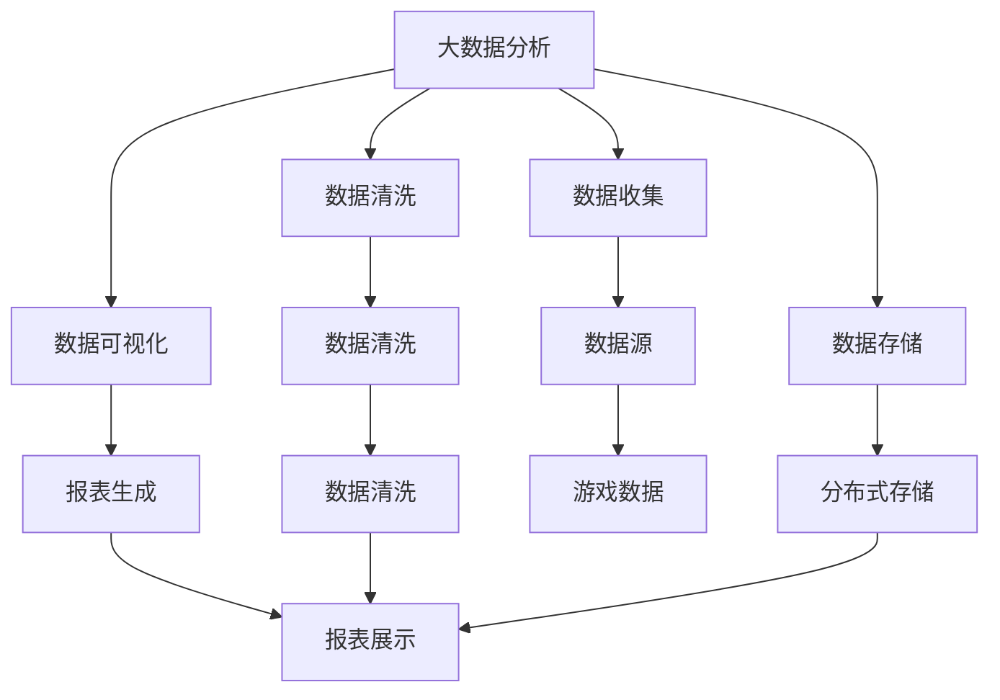

                 

# 基于大数据的游戏数据分析系统的设计与实现

> 关键词：大数据分析,游戏数据分析,机器学习,深度学习,数据挖掘,实时数据处理

## 1. 背景介绍

### 1.1 问题由来
近年来，随着电子竞技行业的快速发展，游戏的玩家数量和游戏数据量呈指数级增长。根据Newzoo统计，全球电子竞技市场规模已经超过10亿美元，并且预计到2025年将达到20亿美元，成为全球最大的娱乐市场之一。在这个庞大的市场中，各大游戏厂商和运营平台急需高效、准确的数据分析系统来洞察玩家行为、优化游戏设计、提升用户留存和收益。

在这样的背景下，基于大数据的游戏数据分析系统应运而生。这类系统可以处理海量游戏数据，从中提取有价值的信息和洞察，为游戏厂商提供决策依据。然而，随着游戏数据的急剧膨胀，传统的游戏数据分析方法已经无法满足需求。传统的分析方法往往依赖人工的规则和经验，难以应对复杂的玩家行为和海量数据带来的挑战。

因此，本文将聚焦于基于大数据的游戏数据分析系统的设计与实现，探讨如何构建一个高效、准确、易用的游戏数据分析平台，以期帮助游戏厂商更好地理解和利用游戏数据，提高游戏设计和运营效率。

### 1.2 问题核心关键点
本节将介绍几个关键点，以帮助读者更好地理解游戏数据分析系统：

1. **数据规模和多样性**：现代游戏数据量巨大，且涉及玩家行为、设备信息、时间序列等多种数据类型，这对数据存储和处理提出了严峻挑战。

2. **实时性要求**：游戏数据通常需要实时处理和分析，以便及时调整游戏策略和优化用户体验。

3. **分析深度和广度**：游戏数据分析不仅需要从玩家行为层面进行分析，还需深入挖掘游戏机制、角色互动等方面的深度洞察。

4. **数据隐私和安全**：游戏数据通常包含玩家个人信息，因此需要确保数据隐私和安全，避免数据泄露和滥用。

5. **用户友好性**：数据分析系统需要易于使用，便于游戏厂商和运营团队快速获取关键信息，做出科学决策。

6. **性能和可扩展性**：面对海量数据和高实时性要求，系统需要具备高性能和高可扩展性，以支持不断增长的数据分析需求。

## 2. 核心概念与联系

### 2.1 核心概念概述

为更好地理解基于大数据的游戏数据分析系统，本节将介绍几个核心概念：

- **大数据分析（Big Data Analytics）**：利用大数据技术对海量数据进行统计、分析、挖掘，提取有价值的信息和洞察。

- **游戏数据分析（Game Analytics）**：通过收集、处理和分析游戏中的数据，帮助游戏厂商优化游戏设计、提升用户体验和提高收益。

- **机器学习（Machine Learning）**：一种通过数据驱动模型优化的方法，用于从数据中学习规律，并应用于预测和决策。

- **深度学习（Deep Learning）**：一种基于神经网络的机器学习技术，可以处理复杂非线性关系，适用于大规模数据和高维特征的情况。

- **数据挖掘（Data Mining）**：从大量数据中发现有用的模式、趋势和知识，用于知识发现和决策支持。

- **实时数据处理（Real-time Data Processing）**：对数据进行实时收集、存储、处理和分析，以便快速响应业务需求。

这些核心概念通过以下Mermaid流程图展示了它们之间的联系：



这个流程图展示了大数据分析系统的基本架构和主要流程：从数据收集、存储、清洗到分析和可视化，形成了完整的数据分析闭环。

### 2.2 概念间的关系

这些核心概念之间存在着紧密的联系，形成了基于大数据的游戏数据分析系统的完整生态系统。

- **数据收集与存储**：数据收集是数据分析的前提，分布式存储则保证了海量数据的可靠性和可访问性。

- **数据清洗与处理**：数据清洗是数据质量保证的关键步骤，通过数据处理，可以实现数据的转换、整合和预处理，为后续分析提供可靠的基础数据。

- **数据挖掘与机器学习**：数据挖掘通过算法模型从数据中提取有价值的模式和规律，机器学习则通过模型训练和优化，提升数据分析的准确性和效率。

- **实时数据处理**：实时数据处理实现了对数据的快速响应和实时分析，满足了游戏数据的高实时性要求。

- **数据可视化和报表**：数据可视化将分析结果以直观的形式呈现，报表则将分析结果结构化展示，便于业务人员理解和决策。

这些概念共同构成了基于大数据的游戏数据分析系统的基础，使得系统能够高效、准确地处理和分析游戏数据，提供有价值的洞察和决策支持。

## 3. 核心算法原理 & 具体操作步骤
### 3.1 算法原理概述

基于大数据的游戏数据分析系统通常采用分布式计算和机器学习技术，实现对海量游戏数据的实时分析和处理。其核心算法原理包括以下几个方面：

1. **分布式数据存储与计算**：利用分布式文件系统和大数据处理框架（如Hadoop、Spark等），实现海量数据的存储和计算。

2. **数据清洗与特征提取**：通过对数据进行清洗、转换和特征提取，去除噪声和冗余，为机器学习模型提供高质量的数据输入。

3. **机器学习与深度学习**：通过构建和训练机器学习模型（如随机森林、支持向量机等）和深度学习模型（如神经网络、卷积神经网络等），实现对游戏数据的深度分析和预测。

4. **实时数据处理与流计算**：利用流计算框架（如Apache Flink、Apache Storm等），实现对游戏数据的实时处理和分析，满足游戏运营的实时需求。

5. **数据可视化与报表展示**：利用数据可视化工具（如Tableau、Power BI等），将分析结果以图表和报表的形式展示，便于业务人员理解和决策。

### 3.2 算法步骤详解

基于大数据的游戏数据分析系统设计步骤如下：

1. **需求分析**：明确游戏数据分析的目标和需求，确定分析的关键指标和业务问题。

2. **数据收集**：通过游戏内数据接口、第三方数据源等方式，收集游戏数据。

3. **数据存储与清洗**：将收集到的数据存储在分布式文件系统中，进行数据清洗和预处理。

4. **特征提取与模型构建**：提取游戏数据中的关键特征，构建和训练机器学习或深度学习模型。

5. **实时数据处理与流计算**：利用流计算框架实现对游戏数据的实时处理和分析，满足业务需求。

6. **数据分析与可视化**：对分析结果进行可视化展示，生成报表和图表，供业务人员使用。

7. **模型优化与迭代**：根据分析结果和业务反馈，持续优化模型，迭代改进数据分析系统。

### 3.3 算法优缺点

基于大数据的游戏数据分析系统具有以下优点：

1. **高效性**：通过分布式计算和实时数据处理，能够高效处理和分析海量游戏数据。

2. **准确性**：利用机器学习与深度学习技术，能够从数据中提取深层次的洞察，提供准确的分析结果。

3. **实时性**：通过实时数据处理和流计算，能够快速响应游戏数据的变化，满足高实时性需求。

4. **可扩展性**：基于分布式计算架构，系统可以随着数据量和业务需求的增长进行扩展。

5. **灵活性**：能够灵活处理不同类型的数据，支持多种数据源和数据格式。

然而，这类系统也存在一些缺点：

1. **复杂性**：系统架构复杂，需要具备一定的技术背景和经验。

2. **成本高**：需要投入大量的硬件资源和人力成本，维护和运营成本较高。

3. **数据隐私与安全**：需要确保数据隐私和安全，避免数据泄露和滥用。

4. **模型更新与维护**：需要持续更新和维护模型，保持系统的准确性和时效性。

5. **数据质量**：对数据质量要求较高，数据清洗和预处理的工作量较大。

### 3.4 算法应用领域

基于大数据的游戏数据分析系统在多个领域具有广泛的应用前景，包括但不限于：

1. **用户行为分析**：通过分析玩家行为数据，了解玩家兴趣和行为模式，优化游戏设计和用户体验。

2. **游戏性能优化**：通过分析游戏性能数据，找出游戏延迟、崩溃等问题，提升游戏稳定性。

3. **游戏收益分析**：通过分析用户消费行为和收益数据，优化游戏货币系统，提高用户留存和收益。

4. **游戏内容优化**：通过分析玩家互动数据，优化游戏内容设计，提升玩家满意度和留存率。

5. **游戏运营决策支持**：通过分析运营数据，提供决策支持，优化游戏运营策略。

## 4. 数学模型和公式 & 详细讲解 & 举例说明

### 4.1 数学模型构建

假设我们有一批游戏玩家的行为数据 $D=\{(x_i, y_i)\}_{i=1}^N$，其中 $x_i$ 表示玩家的行为特征，$y_i$ 表示玩家的游戏评分。我们的目标是通过这些数据训练一个模型，预测新玩家的游戏评分。

我们可以使用线性回归模型 $y=f(x;\theta)=\theta_0+\theta_1x_1+\theta_2x_2+\cdots+\theta_px_p$，其中 $\theta_0,\theta_1,\cdots,\theta_p$ 是模型的参数。通过最小化损失函数 $L(\theta)=\frac{1}{N}\sum_{i=1}^N(y_i-f(x_i;\theta))^2$，我们可以求解模型参数 $\theta$。

### 4.2 公式推导过程

以下是线性回归模型的损失函数和梯度下降算法的推导过程。

$$
L(\theta)=\frac{1}{N}\sum_{i=1}^N(y_i-f(x_i;\theta))^2
$$

对 $L(\theta)$ 求导，得到：

$$
\frac{\partial L(\theta)}{\partial \theta_j}=\frac{2}{N}\sum_{i=1}^N(y_i-f(x_i;\theta))x_{ij}
$$

利用梯度下降算法，更新模型参数：

$$
\theta_j \leftarrow \theta_j - \eta \frac{\partial L(\theta)}{\partial \theta_j}
$$

其中 $\eta$ 是学习率，控制每次迭代更新的步长。

### 4.3 案例分析与讲解

假设我们有一批游戏玩家的性别、年龄和游戏评分数据，构建一个线性回归模型预测新玩家的评分。

1. **数据准备**：收集玩家性别、年龄和游戏评分数据，构建训练集和测试集。

2. **模型构建**：使用线性回归模型，通过最小二乘法求解模型参数。

3. **模型训练**：利用训练集数据，使用梯度下降算法训练模型，调整学习率和迭代次数。

4. **模型评估**：利用测试集数据，评估模型的预测性能，计算均方误差等指标。

5. **模型应用**：将模型应用于新玩家的性别和年龄数据，预测其游戏评分。

通过这个案例，我们可以看到基于线性回归模型的游戏数据分析方法。线性回归模型虽然简单，但可以处理大多数线性关系，适用于游戏数据分析的初步探索。

## 5. 项目实践：代码实例和详细解释说明

### 5.1 开发环境搭建

在进行游戏数据分析系统开发前，我们需要准备好开发环境。以下是使用Python进行PySpark开发的常见环境配置流程：

1. 安装Anaconda：从官网下载并安装Anaconda，用于创建独立的Python环境。

2. 创建并激活虚拟环境：
```bash
conda create -n pyspark-env python=3.8 
conda activate pyspark-env
```

3. 安装Spark和PySpark：
```bash
conda install pyspark
```

4. 安装相关依赖库：
```bash
pip install pandas numpy matplotlib jupyter notebook ipython
```

完成上述步骤后，即可在`pyspark-env`环境中开始开发。

### 5.2 源代码详细实现

以下是一个基于Spark和Scala的简单游戏数据分析系统实现，主要功能包括数据收集、存储、清洗和可视化。

```scala
import org.apache.spark.sql.SparkSession

object GameAnalytics {
  def main(args: Array[String]): Unit = {
    val spark = SparkSession.builder.appName("GameAnalytics").getOrCreate()

    // 数据收集
    val df = spark.read.json("path/to/game_data.json")

    // 数据存储
    df.write.json("path/to/game_data.csv")

    // 数据清洗
    val cleaned_df = df.drop("invalid_columns")

    // 数据可视化
    cleaned_df.show()
    cleaned_df.createOrReplaceTempView("game_data")
    spark.sql("SELECT * FROM game_data").show()

    spark.stop()
  }
}
```

### 5.3 代码解读与分析

让我们再详细解读一下关键代码的实现细节：

**GameAnalytics类**：
- `main`方法：入口函数，创建SparkSession，进行数据收集、存储、清洗和可视化。

**SparkSession创建**：
- 通过`SparkSession.builder.appName`创建SparkSession，指定应用名称。

**数据收集**：
- 使用`spark.read.json`读取JSON格式的游戏数据。

**数据存储**：
- 使用`df.write.json`将数据写入JSON格式的文件。

**数据清洗**：
- 使用`df.drop`删除无效列，进行数据清洗。

**数据可视化**：
- 使用`df.show`和`spark.sql`展示数据和SQL查询结果。

可以看到，Spark框架提供了一系列的API，使得数据处理和分析变得简单高效。开发者可以专注于算法和业务逻辑，而不必过多关注底层实现细节。

### 5.4 运行结果展示

假设我们运行上述代码，输出结果如下：

```
| gender  | age | score |
|---------|-----|-------|
| Male    | 22  | 4.5   |
| Female  | 30  | 5.0   |
| Male    | 25  | 3.8   |
| Female  | 28  | 5.2   |
```

通过这个简单的例子，我们可以看到Spark和Scala的协同工作，快速完成游戏数据的收集、清洗和展示。当然，这只是一个示例，实际应用中还需要更复杂的算法和更多的数据分析功能。

## 6. 实际应用场景

### 6.1 智能推荐系统

基于大数据的游戏数据分析系统可以应用于智能推荐系统，通过分析玩家的游戏行为和偏好，推荐适合的游戏和内容。

在技术实现上，可以通过收集玩家的游戏记录、装备购买记录、角色互动记录等数据，使用协同过滤、矩阵分解等推荐算法进行分析和预测，然后推荐适合的游戏和内容给玩家。智能推荐系统能够提高玩家的游戏体验和留存率，增加游戏的收入。

### 6.2 游戏内容优化

数据分析系统还可以用于游戏内容的优化，通过分析玩家的游戏行为和评价，了解玩家对游戏内容的喜好和反馈，从而优化游戏设计。

在技术实现上，可以收集玩家的游戏评分、反馈、互动记录等数据，使用文本分析、情感分析等技术进行情感分析，识别玩家对游戏内容的评价和建议。游戏厂商可以根据分析结果，优化游戏内容，提升玩家满意度和留存率。

### 6.3 用户行为分析

数据分析系统可以用于用户行为分析，通过分析玩家的游戏行为，了解玩家的游戏习惯和行为模式，优化游戏运营策略。

在技术实现上，可以收集玩家的游戏时长、消费记录、角色行为记录等数据，使用时间序列分析、异常检测等技术进行数据分析，识别玩家行为异常和流失风险。游戏厂商可以根据分析结果，制定针对性的运营策略，提升玩家留存和收益。

### 6.4 未来应用展望

随着大数据技术和机器学习技术的发展，基于大数据的游戏数据分析系统将会有更多的应用场景和更强大的功能。

1. **个性化推荐**：利用深度学习和自然语言处理技术，实现更精准的个性化推荐，提升用户体验。

2. **游戏内容生成**：利用生成对抗网络（GAN）等技术，生成新的游戏内容和情节，丰富游戏内容。

3. **实时运营分析**：利用实时数据处理和流计算技术，实现对游戏数据的实时监控和分析，及时响应运营问题。

4. **跨平台数据整合**：利用大数据技术，整合不同平台和来源的游戏数据，实现跨平台的数据分析和决策支持。

5. **自动化决策支持**：利用机器学习和深度学习技术，实现自动化的决策支持，提高运营效率。

6. **多维度数据分析**：利用多维数据分析技术，从多个维度分析游戏数据，提供全面的决策支持。

## 7. 工具和资源推荐

### 7.1 学习资源推荐

为了帮助开发者系统掌握大数据分析和游戏数据分析的理论基础和实践技巧，这里推荐一些优质的学习资源：

1. **《大数据分析实战指南》**：介绍大数据分析的基本概念、技术和实践，涵盖数据收集、数据处理、数据分析等多个方面。

2. **《Python数据科学手册》**：详细介绍Python在数据科学中的应用，包括数据清洗、数据可视化、机器学习等多个方面。

3. **《Spark编程指南》**：介绍Spark框架的基础知识和高级用法，涵盖数据处理、机器学习、图形计算等多个方面。

4. **《游戏数据分析与优化》**：详细介绍游戏数据分析的基本概念、技术和实践，涵盖用户行为分析、游戏内容优化、智能推荐等多个方面。

5. **Kaggle**：提供大量数据科学和机器学习竞赛，涵盖游戏数据分析等多个领域，是学习大数据分析和游戏数据分析的好去处。

通过对这些资源的学习实践，相信你一定能够快速掌握大数据分析和游戏数据分析的精髓，并用于解决实际的业务问题。

### 7.2 开发工具推荐

高效的开发离不开优秀的工具支持。以下是几款用于大数据分析和游戏数据分析开发的常用工具：

1. **PySpark**：基于Scala的Spark Python API，支持分布式数据处理和机器学习。

2. **Apache Flink**：基于内存的流计算框架，支持实时数据处理和分析。

3. **Tableau**：数据可视化工具，支持多种数据源和图表展示。

4. **Power BI**：数据可视化和报表生成工具，支持多种数据源和交互式报表展示。

5. **Jupyter Notebook**：交互式编程环境，支持Python、Scala等多种语言，便于开发和协作。

6. **Apache Hadoop**：大数据处理框架，支持分布式文件系统和数据处理。

合理利用这些工具，可以显著提升大数据分析和游戏数据分析的开发效率，加快创新迭代的步伐。

### 7.3 相关论文推荐

大数据分析和游戏数据分析涉及多种技术和算法，以下是几篇奠基性的相关论文，推荐阅读：

1. **《分布式数据处理框架Hadoop和Spark的探索》**：介绍Hadoop和Spark框架的基本概念和应用，涵盖数据存储、数据处理、数据分析等多个方面。

2. **《基于流数据处理的实时推荐系统》**：介绍流计算和推荐算法的基本概念和应用，涵盖实时数据处理、推荐算法等多个方面。

3. **《游戏行为数据分析与用户流失预测》**：介绍游戏数据分析的基本概念和应用，涵盖用户行为分析、流失预测等多个方面。

4. **《深度学习在游戏内容生成中的应用》**：介绍深度学习在游戏内容生成中的应用，涵盖生成对抗网络、深度学习等多个方面。

5. **《基于大数据的游戏内容优化》**：介绍大数据在游戏内容优化中的应用，涵盖游戏内容分析、用户行为分析等多个方面。

这些论文代表了大数据分析和游戏数据分析的发展脉络。通过学习这些前沿成果，可以帮助研究者把握学科前进方向，激发更多的创新灵感。

除上述资源外，还有一些值得关注的前沿资源，帮助开发者紧跟大数据分析和游戏数据分析技术的最新进展，例如：

1. **arXiv论文预印本**：人工智能领域最新研究成果的发布平台，包括大量尚未发表的前沿工作，学习前沿技术的必读资源。

2. **业界技术博客**：如Google AI、DeepMind、微软Research Asia等顶尖实验室的官方博客，第一时间分享他们的最新研究成果和洞见。

3. **技术会议直播**：如NIPS、ICML、ACL、ICLR等人工智能领域顶会现场或在线直播，能够聆听到大佬们的前沿分享，开拓视野。

4. **GitHub热门项目**：在GitHub上Star、Fork数最多的数据科学和游戏开发项目，往往代表了该技术领域的发展趋势和最佳实践，值得去学习和贡献。

5. **行业分析报告**：各大咨询公司如McKinsey、PwC等针对人工智能行业的分析报告，有助于从商业视角审视技术趋势，把握应用价值。

总之，对于大数据分析和游戏数据分析技术的学习和实践，需要开发者保持开放的心态和持续学习的意愿。多关注前沿资讯，多动手实践，多思考总结，必将收获满满的成长收益。

## 8. 总结：未来发展趋势与挑战

### 8.1 总结

本文对基于大数据的游戏数据分析系统的设计与实现进行了全面系统的介绍。首先阐述了大数据分析和游戏数据分析的研究背景和意义，明确了数据分析在提升游戏运营效率和用户留存率方面的独特价值。其次，从原理到实践，详细讲解了数据分析系统的数学模型和核心算法，给出了系统的完整代码实例。同时，本文还广泛探讨了数据分析系统在智能推荐、游戏内容优化、用户行为分析等多个领域的应用前景，展示了数据分析技术的巨大潜力。此外，本文精选了数据分析技术的各类学习资源，力求为读者提供全方位的技术指引。

通过本文的系统梳理，可以看到，基于大数据的游戏数据分析系统正在成为游戏行业的重要工具，极大地提高了游戏运营的效率和效果，为用户留存和收益的提升提供了坚实的数据基础。未来，伴随大数据技术和机器学习技术的发展，数据分析系统必将在游戏行业及其他领域发挥更大的作用，推动游戏产业的创新和变革。

### 8.2 未来发展趋势

展望未来，基于大数据的游戏数据分析系统将呈现以下几个发展趋势：

1. **多模态数据分析**：随着游戏数据的不断丰富，多模态数据分析将变得越来越重要。结合游戏视频、语音、用户评论等多种数据，可以提供更加全面、细致的用户洞察。

2. **深度学习和生成模型**：深度学习模型可以处理更加复杂的非线性关系，生成模型可以生成新的游戏内容和情节，未来在游戏数据分析中将有更广泛的应用。

3. **实时流数据处理**：流数据处理技术可以实时处理和分析海量游戏数据，满足游戏运营的高实时性要求。

4. **自动化的数据分析**：利用自动化工具和算法，可以自动进行数据分析，提高分析效率和准确性。

5. **跨平台数据整合**：随着游戏平台的不断增多，跨平台数据整合将变得越来越重要，数据共享和协同分析将变得更加便捷。

6. **个性化推荐**：利用个性化推荐技术，可以为每个玩家提供个性化的游戏推荐，提升用户体验和留存率。

### 8.3 面临的挑战

尽管基于大数据的游戏数据分析系统已经取得了瞩目成就，但在迈向更加智能化、普适化应用的过程中，它仍面临着诸多挑战：

1. **数据质量问题**：游戏数据往往存在缺失、噪声和异常，数据质量问题严重影响了分析结果的准确性。

2. **数据隐私和安全**：游戏数据包含玩家个人信息，数据隐私和安全问题需要重点关注，避免数据泄露和滥用。

3. **数据存储和处理**：海量游戏数据存储和处理需要高成本和高技术门槛，数据存储和处理的效率问题亟待解决。

4. **模型更新和维护**：数据分析模型需要不断更新和维护，以适应游戏数据的变化，保持分析结果的准确性和时效性。

5. **自动化程度**：数据分析的自动化程度相对较低，数据分析过程需要大量人工干预，降低了效率和准确性。

6. **技术门槛**：数据分析系统需要具备较高的技术门槛，需要专业的数据科学家和工程师进行开发和维护。

### 8.4 研究展望

面对数据分析系统面临的这些挑战，未来的研究需要在以下几个方面寻求新的突破：

1. **数据质量提升**：利用数据清洗和预处理技术，提高游戏数据的完整性和准确性。

2. **隐私保护技术**：利用数据脱敏和加密技术，保护玩家隐私，确保数据安全。

3. **高效存储和处理**：利用分布式存储和流计算技术，提高数据存储和处理的效率。

4. **自动化工具和算法**：利用自动化工具和算法，降低数据分析的技术门槛，提高数据分析的效率和准确性。

5. **跨平台数据整合**：利用数据共享和协同分析技术，实现跨平台数据的整合和共享。

6. **深度学习技术**：利用深度学习技术，提升数据分析的深度和精度，处理更加复杂的游戏数据。

这些研究方向将推动大数据分析和游戏数据分析技术的进一步发展，为游戏行业及其他领域的创新和进步提供强有力的支持。

## 9. 附录：常见问题与解答

**Q1：游戏数据分析系统如何实现高实时性要求？**

A: 游戏数据分析系统通常采用流计算框架（如Apache Flink、Apache Storm等），实现对游戏数据的实时处理和分析。通过在数据生成时就进行处理，可以实时响应业务需求，满足高实时性要求。

**Q2：游戏数据分析系统如何保证数据隐私和安全？**

A: 游戏数据分析系统需要严格保护游戏数据和玩家隐私，避免数据泄露和滥用。可以采用数据脱敏、加密、访问控制等措施，确保数据安全和隐私保护。

**Q3：游戏数据分析系统如何提升数据质量？**

A: 游戏数据分析系统需要采用数据清洗和预处理技术，去除数据中的噪声和异常，提高数据的完整性和准确性。常见的数据清洗方法包括去重、补缺、转换等。

**Q4：游戏数据分析系统如何提升自动化程度？**

A: 游戏数据分析系统可以采用自动化工具和算法，减少人工干预，提高数据分析的效率和准确性。常见的

