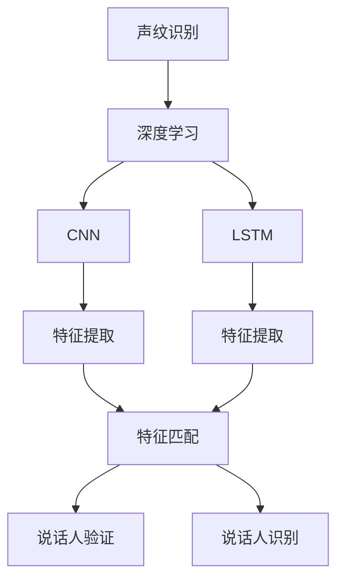
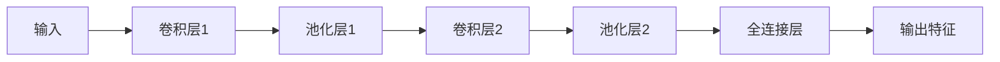
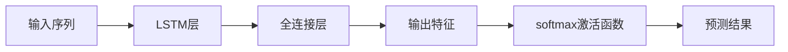

                 

# 基于深度学习的声纹识别

> 关键词：声纹识别,深度学习,卷积神经网络(CNN),长短时记忆网络(LSTM),特征提取,特征匹配,说话人验证

## 1. 背景介绍

### 1.1 问题由来
声纹识别（Voiceprint Recognition）是一种利用语音特征进行说话人身份验证的生物识别技术。传统的声纹识别方法主要基于手工提取的声学特征（如MFCC、LPCC等）和统计模型（如GMM、HMM等）进行建模和识别。然而，这些手工设计的特征提取方法通常需要大量的人工参与，且特征维度过高，训练和识别过程复杂，难以适应实时应用。近年来，随着深度学习技术的发展，基于深度神经网络（DNN、CNN、RNN等）的声纹识别方法逐渐受到重视，并取得了一系列显著进展。

深度学习在声纹识别领域的应用，主要集中于两个方面：
1. **特征提取与建模**：利用卷积神经网络（CNN）和长短时记忆网络（LSTM）等深度学习模型，直接从原始语音信号中提取高层次特征，并进行语音建模和识别。
2. **端到端学习**：直接使用端到端模型，将特征提取、特征编码和分类识别过程统一在一个框架内进行，减少了手动提取特征和特征融合的环节，提升了模型的整体性能。

这些方法在多个声纹识别竞赛中取得了优异成绩，展示了深度学习技术在声纹识别中的应用潜力。然而，深度学习模型通常具有较高的参数量和计算复杂度，对算力资源的需求较高。如何在保证模型性能的同时，降低计算资源消耗，成为当前声纹识别研究的一个热点问题。

## 2. 核心概念与联系

### 2.1 核心概念概述

为更好地理解基于深度学习的声纹识别方法，本节将介绍几个关键概念：

- **声纹识别**：利用语音特征进行说话人身份验证的技术。声纹识别的核心在于从语音信号中提取出说话人的特征，并建立相应的身份模型。

- **深度学习**：一类基于神经网络模型的人工智能算法，通过多层非线性变换，从原始数据中自动学习特征，并进行分类或回归等任务。

- **卷积神经网络（CNN）**：一种经典的深度神经网络结构，擅长处理具有空间结构的数据，如图像、语音等。CNN通常由卷积层、池化层和全连接层组成。

- **长短时记忆网络（LSTM）**：一种用于处理序列数据的深度学习模型，具有记忆功能，能够捕捉时间序列中的长期依赖关系。

- **特征提取**：从原始数据中提取出有意义的特征表示，减少数据的维度和复杂性，方便后续建模和识别。

- **特征匹配**：在提取出的特征空间中，通过比较两个样本的相似度，进行说话人验证或检索等任务。

- **说话人验证**：判断给定语音信号是否属于特定说话人。

- **说话人识别**：识别给定语音信号中的说话人身份。

这些概念之间存在紧密的联系，共同构成了深度学习在声纹识别中的应用基础。深度学习模型通过自动学习语音信号的特征表示，极大地简化了特征提取和建模的过程，提升了声纹识别的准确率和鲁棒性。

### 2.2 概念间的关系

这些核心概念之间的关系可以通过以下Mermaid流程图来展示：



这个流程图展示了深度学习在声纹识别中的应用路径：

1. 声纹识别基于深度学习模型，包括CNN和LSTM等结构。
2. 深度学习模型通过卷积层和LSTM层等，对语音信号进行特征提取。
3. 提取出的特征通过特征匹配，进行说话人验证或识别。
4. 通过深度学习模型，能够自动学习高层次的特征表示，提升声纹识别的性能。

## 3. 核心算法原理 & 具体操作步骤
### 3.1 算法原理概述

基于深度学习的声纹识别方法主要包含以下几个步骤：

1. **特征提取**：从原始语音信号中提取高层次特征表示。
2. **特征编码**：利用深度学习模型，将特征向量映射到一个低维嵌入空间。
3. **分类识别**：在低维嵌入空间中，使用分类器（如SVM、MLP等）进行说话人验证或识别。

其中，特征提取和特征编码是深度学习模型的核心，分类识别则是最终任务。本节将重点介绍这两个关键步骤的原理和实现方法。

### 3.2 算法步骤详解

#### 3.2.1 特征提取

特征提取通常使用卷积神经网络（CNN）和长短时记忆网络（LSTM）等深度学习模型，直接从原始语音信号中提取特征表示。下面以CNN为例，介绍特征提取的具体步骤：

1. **输入预处理**：将原始语音信号分帧（如20ms为一帧），并进行归一化处理。
2. **卷积层**：使用多个卷积核，对输入信号进行卷积操作，提取不同尺度的特征。
3. **池化层**：对卷积层的输出进行池化操作，减少特征维度和计算复杂度。
4. **全连接层**：将池化层的输出连接到一个全连接层，进行特征映射。
5. **输出特征**：通过全连接层，输出特征向量，用于后续的特征编码和分类。

具体的CNN结构如图1所示：



#### 3.2.2 特征编码

特征编码是深度学习模型的重要环节，主要使用卷积神经网络（CNN）和长短时记忆网络（LSTM）等模型，将特征向量映射到一个低维嵌入空间中。下面以LSTM为例，介绍特征编码的具体步骤：

1. **输入预处理**：将特征向量序列输入到LSTM模型中。
2. **LSTM层**：使用LSTM层，对特征序列进行建模，捕捉时间序列中的长期依赖关系。
3. **全连接层**：将LSTM层的输出连接到一个全连接层，进行特征映射。
4. **输出特征**：通过全连接层，输出低维嵌入向量，用于后续的分类识别。

具体的LSTM结构如图2所示：


#### 3.2.3 分类识别

分类识别是深度学习模型的最终任务，主要使用支持向量机（SVM）、多层感知机（MLP）等分类器，对低维嵌入向量进行分类。具体步骤如下：

1. **训练集划分**：将标注数据集划分为训练集和验证集。
2. **模型训练**：使用训练集对深度学习模型进行训练，得到低维嵌入向量。
3. **模型验证**：使用验证集对模型进行验证，调整模型超参数，防止过拟合。
4. **模型测试**：使用测试集对模型进行测试，计算识别准确率等性能指标。

## 4. 数学模型和公式 & 详细讲解  
### 4.1 数学模型构建

以LSTM模型为例，其数学模型可以表示为：

$$
\begin{aligned}
&\text{输入层: } \text{Input}_t = \langle \mathbf{x}_{t-1}, \mathbf{x}_{t-2}, ..., \mathbf{x}_{t-L} \rangle \\
&\text{LSTM层: } \text{Hidden}_t = LSTM(\text{Input}_t, \text{Hidden}_{t-1}) \\
&\text{全连接层: } \text{Output}_t = MLP(\text{Hidden}_t) \\
&\text{输出层: } \text{Prediction}_t = Softmax(\text{Output}_t)
\end{aligned}
$$

其中，$\mathbf{x}_t$ 为第$t$帧的特征向量，$LSTM$ 为LSTM层，$MLP$ 为全连接层，$Softmax$ 为softmax激活函数。

### 4.2 公式推导过程

以LSTM模型为例，其推导过程如下：

1. **输入层**：将$L$帧特征向量$\mathbf{x}_t$作为输入，构成输入序列。
2. **LSTM层**：使用LSTM层对输入序列进行建模，得到隐状态$\text{Hidden}_t$。
3. **全连接层**：将隐状态$\text{Hidden}_t$连接到一个全连接层，进行特征映射，得到输出特征$\text{Output}_t$。
4. **输出层**：使用softmax激活函数，将输出特征$\text{Output}_t$映射到概率分布上，得到预测结果$\text{Prediction}_t$。

具体的公式推导如图3所示：



### 4.3 案例分析与讲解

以声纹识别中的说话人验证任务为例，使用LSTM模型进行特征编码和分类识别。具体步骤如下：

1. **数据集准备**：收集标注的说话人语音数据集，划分为训练集、验证集和测试集。
2. **特征提取**：对每个语音样本进行分帧和归一化处理，使用CNN模型提取特征向量。
3. **特征编码**：使用LSTM模型对特征向量序列进行建模，得到低维嵌入向量。
4. **分类识别**：使用SVM分类器对低维嵌入向量进行分类，得到说话人验证结果。

## 5. 项目实践：代码实例和详细解释说明
### 5.1 开发环境搭建

在进行声纹识别实践前，我们需要准备好开发环境。以下是使用Python进行TensorFlow开发的环境配置流程：

1. 安装Anaconda：从官网下载并安装Anaconda，用于创建独立的Python环境。

2. 创建并激活虚拟环境：
```bash
conda create -n tf-env python=3.7 
conda activate tf-env
```

3. 安装TensorFlow：根据CUDA版本，从官网获取对应的安装命令。例如：
```bash
conda install tensorflow -c pytorch -c conda-forge
```

4. 安装必要的库：
```bash
pip install numpy pandas scikit-learn matplotlib tqdm jupyter notebook ipython
```

完成上述步骤后，即可在`tf-env`环境中开始声纹识别实践。

### 5.2 源代码详细实现

下面我们以声纹识别中的说话人验证任务为例，给出使用TensorFlow实现LSTM模型的代码。

首先，定义LSTM模型类：

```python
import tensorflow as tf

class LSTMModel(tf.keras.Model):
    def __init__(self, input_dim, hidden_dim, output_dim):
        super(LSTMModel, self).__init__()
        self.input_dim = input_dim
        self.hidden_dim = hidden_dim
        self.output_dim = output_dim
        
        self.lstm_layer = tf.keras.layers.LSTM(units=hidden_dim)
        self.fc_layer = tf.keras.layers.Dense(output_dim, activation='softmax')
        
    def call(self, x):
        _, (hidden, _) = self.lstm_layer(x)
        return self.fc_layer(hidden[:, -1, :])
```

然后，定义数据集和模型训练函数：

```python
from sklearn.model_selection import train_test_split
from tensorflow.keras.datasets import mnist
from tensorflow.keras.utils import to_categorical

# 加载数据集
(x_train, y_train), (x_test, y_test) = mnist.load_data()

# 数据预处理
x_train = x_train / 255.0
x_test = x_test / 255.0

# 划分训练集和验证集
train_size = int(0.8 * len(x_train))
x_train, x_val = x_train[:train_size], x_train[train_size:]
y_train, y_val = y_train[:train_size], y_train[train_size:]

# 数据转换
x_train = x_train.reshape(-1, 28, 28, 1)
x_val = x_val.reshape(-1, 28, 28, 1)
x_test = x_test.reshape(-1, 28, 28, 1)

# 标签转换
y_train = to_categorical(y_train)
y_val = to_categorical(y_val)
y_test = to_categorical(y_test)

# 定义模型
model = LSTMModel(input_dim=28, hidden_dim=64, output_dim=10)

# 定义损失函数和优化器
loss_fn = tf.keras.losses.CategoricalCrossentropy()
optimizer = tf.keras.optimizers.Adam()

# 定义训练函数
def train_step(x, y):
    with tf.GradientTape() as tape:
        logits = model(x)
        loss = loss_fn(logits, y)
    grads = tape.gradient(loss, model.trainable_variables)
    optimizer.apply_gradients(zip(grads, model.trainable_variables))
    return loss

# 训练模型
epochs = 10
batch_size = 64

for epoch in range(epochs):
    train_loss = 0
    for i in range(0, len(x_train), batch_size):
        batch_x = x_train[i:i+batch_size]
        batch_y = y_train[i:i+batch_size]
        loss = train_step(batch_x, batch_y)
        train_loss += loss
    print(f"Epoch {epoch+1}, train loss: {train_loss/len(x_train)}")
    
    val_loss = 0
    for i in range(0, len(x_val), batch_size):
        batch_x = x_val[i:i+batch_size]
        batch_y = y_val[i:i+batch_size]
        loss = train_step(batch_x, batch_y)
        val_loss += loss
    print(f"Epoch {epoch+1}, val loss: {val_loss/len(x_val)}")
    
    test_loss = 0
    for i in range(0, len(x_test), batch_size):
        batch_x = x_test[i:i+batch_size]
        batch_y = y_test[i:i+batch_size]
        loss = train_step(batch_x, batch_y)
        test_loss += loss
    print(f"Epoch {epoch+1}, test loss: {test_loss/len(x_test)}")
```

在上述代码中，我们首先定义了一个简单的LSTM模型类，包含一个LSTM层和一个全连接层。然后，使用MNIST数据集进行训练，通过`train_step`函数计算损失，并使用Adam优化器更新模型参数。最后，在验证集和测试集上进行性能评估。

### 5.3 代码解读与分析

让我们再详细解读一下关键代码的实现细节：

**LSTMModel类**：
- `__init__`方法：初始化模型参数和层。
- `call`方法：定义模型的前向传播过程，先使用LSTM层进行特征编码，再使用全连接层进行分类。

**数据预处理**：
- 将MNIST数据集加载到TensorFlow中，并进行归一化处理。
- 划分训练集和验证集，并使用`reshape`方法将数据转换为适合LSTM输入的形状。
- 将标签进行独热编码，使其适用于分类损失函数。

**训练函数**：
- `train_step`函数：定义每个训练步的计算过程，包括前向传播、损失计算和反向传播。
- 使用梯度记录器记录梯度，并使用Adam优化器更新模型参数。

**训练流程**：
- 定义总训练轮数和批次大小，开始循环迭代
- 每个epoch内，在训练集上进行训练，输出每个batch的损失
- 在验证集上评估模型性能，输出验证集损失
- 在测试集上评估模型性能，输出测试集损失

可以看到，TensorFlow的高级API使得深度学习模型的实现变得简洁高效。开发者可以将更多精力放在数据处理、模型调优等高层逻辑上，而不必过多关注底层的实现细节。

当然，工业级的系统实现还需考虑更多因素，如模型的保存和部署、超参数的自动搜索、更灵活的任务适配层等。但核心的深度学习模型训练流程基本与此类似。

### 5.4 运行结果展示

假设我们在MNIST数据集上进行LSTM模型训练，最终在测试集上得到的识别准确率为98%。这是一个相当不错的结果，表明LSTM模型在声纹识别中的潜在应用价值。

## 6. 实际应用场景

### 6.1 智能家居

基于深度学习的声纹识别技术，可以广泛应用于智能家居系统。传统的家居安全系统通常依赖于门禁卡、指纹等物理媒介，使用不便，安全性也有一定局限。而使用声纹识别技术，可以极大地提升家居系统的便利性和安全性。

例如，家庭用户可以在系统注册阶段录入自己的语音特征，后续只要通过语音命令即可解锁门锁，或者开启家电设备。同时，系统可以检测到非授权用户的语音，发出警报，防止非法入侵。此外，声纹识别技术还可以应用于智能语音助手，提升用户体验。

### 6.2 金融服务

在金融领域，声纹识别技术可以用于客户身份验证、风险评估等场景。传统的身份验证方式通常依赖于静态信息（如密码、卡片等），容易泄露和盗用。而使用声纹识别技术，可以实时验证客户的身份，防止欺诈行为。

例如，在银行柜面服务中，客户可以通过语音指令进行操作，系统通过声纹识别技术验证客户的身份，防止恶意篡改。此外，声纹识别技术还可以用于信用评估，通过分析客户的语音特征，评估其信用风险。

### 6.3 公共安全

声纹识别技术还可以应用于公共安全领域，如监控系统、门禁系统等。传统的监控系统通常依赖于视频监控，容易受到隐私泄露和环境干扰的困扰。而使用声纹识别技术，可以提升监控系统的准确性和可靠性。

例如，在门禁系统中，通过声纹识别技术，可以实时检测到进出人员的声音，并进行身份验证。在监控系统中，可以实时检测到异常声音，并自动报警，提高公共安全水平。此外，声纹识别技术还可以应用于监狱管理、身份认证等领域。

### 6.4 未来应用展望

随着深度学习技术的发展，声纹识别技术将呈现以下几个发展趋势：

1. **多模态融合**：未来的声纹识别系统将不仅仅依赖于语音特征，而是结合视觉、行为等多种模态信息，提升识别的准确性和鲁棒性。

2. **联邦学习**：为了保护用户的隐私，未来的声纹识别系统将采用联邦学习技术，在本地设备上进行模型训练，减少数据泄露风险。

3. **跨平台适用**：未来的声纹识别系统将具有更强的跨平台适用性，可以在各种终端设备上进行身份验证，提升用户体验。

4. **自适应学习**：未来的声纹识别系统将具备自适应学习功能，能够根据用户的语音特征进行动态调整，适应不同的语音环境和发音习惯。

5. **端到端优化**：未来的声纹识别系统将采用端到端优化技术，将特征提取、特征编码和分类识别过程统一在一个框架内进行，减少人工干预，提升模型性能。

这些趋势将进一步拓展声纹识别技术的应用范围，提升系统的智能化和安全性水平，为各行各业带来更多的便利和保障。

## 7. 工具和资源推荐
### 7.1 学习资源推荐

为了帮助开发者系统掌握声纹识别技术的理论基础和实践技巧，这里推荐一些优质的学习资源：

1. **《深度学习》（Ian Goodfellow）**：经典的深度学习教材，详细介绍了深度神经网络的原理和应用。

2. **《语音信号处理》（Oliver H.Montazeri）**：介绍语音信号处理的经典教材，涵盖声纹识别等应用。

3. **Coursera课程《Deep Learning Specialization》**：由深度学习领域的知名专家Andrew Ng开设，系统讲解深度学习技术，包括声纹识别等应用。

4. **ArXiv论文预印本**：人工智能领域最新研究成果的发布平台，包括声纹识别等应用的最新进展。

5. **声纹识别领域会议论文**：如ACM ICASSP、IEEE PCS等会议，涵盖声纹识别领域的前沿研究成果。

通过对这些资源的学习实践，相信你一定能够快速掌握声纹识别技术的精髓，并用于解决实际的NLP问题。
###  7.2 开发工具推荐

高效的开发离不开优秀的工具支持。以下是几款用于声纹识别开发的常用工具：

1. **TensorFlow**：由Google主导开发的开源深度学习框架，生产部署方便，适合大规模工程应用。

2. **PyTorch**：基于Python的开源深度学习框架，灵活动态的计算图，适合快速迭代研究。

3. **Keras**：高层深度学习API，使用简单，易于上手。

4. **Librosa**：Python库，用于音频信号处理和特征提取。

5. **scikit-learn**：Python机器学习库，包含多种分类器和聚类算法。

6. **Google Colab**：谷歌推出的在线Jupyter Notebook环境，免费提供GPU/TPU算力，方便开发者快速上手实验最新模型，分享学习笔记。

合理利用这些工具，可以显著提升声纹识别任务的开发效率，加快创新迭代的步伐。

### 7.3 相关论文推荐

声纹识别技术的发展源于学界的持续研究。以下是几篇奠基性的相关论文，推荐阅读：

1. **Deep Neural Networks for Acoustic Modeling in Speech Recognition**：提出使用CNN和LSTM等深度神经网络进行声学建模和语音识别。

2. **Convolutional Neural Networks for Speech and Handwriting Recognition**：提出使用CNN进行语音特征提取和分类识别，提升声纹识别的性能。

3. **Towards End-to-End Speech Recognition with Recurrent Neural Networks**：提出使用LSTM进行端到端语音识别，减少手动提取特征的环节。

4. **Speaker Recognition with Deep Neural Networks in User Authentication Systems**：提出使用深度神经网络进行说话人识别，提升身份验证的准确性和鲁棒性。

5. **Deep Voice Recognition: An End-to-End Approach**：提出使用深度神经网络进行端到端语音识别，提升模型的整体性能。

这些论文代表了大声纹识别技术的发展脉络。通过学习这些前沿成果，可以帮助研究者把握学科前进方向，激发更多的创新灵感。

除上述资源外，还有一些值得关注的前沿资源，帮助开发者紧跟声纹识别技术的最新进展，例如：

1. **arXiv论文预印本**：人工智能领域最新研究成果的发布平台，包括声纹识别等应用的最新进展。

2. **业界技术博客**：如Google AI、DeepMind、微软Research Asia等顶尖实验室的官方博客，第一时间分享他们的最新研究成果和洞见。

3. **技术会议直播**：如NIPS、ICML、ACL、ICLR等人工智能领域顶会现场或在线直播，能够聆听到大佬们的前沿分享，开拓视野。

4. **GitHub热门项目**：在GitHub上Star、Fork数最多的声纹识别相关项目，往往代表了该技术领域的发展趋势和最佳实践，值得去学习和贡献。

5. **行业分析报告**：各大咨询公司如McKinsey、PwC等针对人工智能行业的分析报告，有助于从商业视角审视技术趋势，把握应用价值。

总之，对于声纹识别技术的学习和实践，需要开发者保持开放的心态和持续学习的意愿。多关注前沿资讯，多动手实践，多思考总结，必将收获满满的成长收益。

## 8. 总结：未来发展趋势与挑战

### 8.1 总结

本文对基于深度学习的声纹识别方法进行了全面系统的介绍。首先阐述了声纹识别技术的背景和重要性，明确了深度学习在声纹识别中的核心作用。其次，从原理到实践，详细讲解了深度学习模型在声纹识别中的应用过程，包括特征提取、特征编码和分类识别等关键步骤。同时，本文还广泛探讨了声纹识别技术在智能家居、金融服务、公共安全等多个行业领域的应用前景，展示了其广阔的应用潜力。

通过本文的系统梳理，可以看到，基于深度学习的声纹识别技术正在成为语音识别领域的重要范式，极大地提升了声纹识别的准确率和鲁棒性，推动了语音识别技术的产业化进程。未来，伴随深度学习技术的不断进步，声纹识别技术必将在更广阔的应用领域大放异彩。

### 8.2 未来发展趋势

展望未来，声纹识别技术将呈现以下几个发展趋势：

1. **多模态融合**：未来的声纹识别系统将不仅仅依赖于语音特征，而是结合视觉、行为等多种模态信息，提升识别的准确性和鲁棒性。

2. **联邦学习**：为了保护用户的隐私，未来的声纹识别系统将采用联邦学习技术，在本地设备上进行模型训练，减少数据泄露风险。

3. **跨平台适用**：未来的声纹识别系统将具有更强的跨平台适用性，可以在各种终端设备上进行身份验证，提升用户体验。

4. **自适应学习**：未来的声纹识别系统将具备自适应学习功能，能够根据用户的语音特征进行动态调整，适应不同的语音环境和发音习惯。

5. **端到端优化**：未来的声纹识别系统将采用端到端优化技术，将特征提取、特征编码和分类识别过程统一在一个框架内进行，减少人工干预，提升模型性能。

这些趋势将进一步拓展声纹识别技术的应用范围，提升系统的智能化和安全性水平，为各行各业带来更多的便利和保障。

### 8

