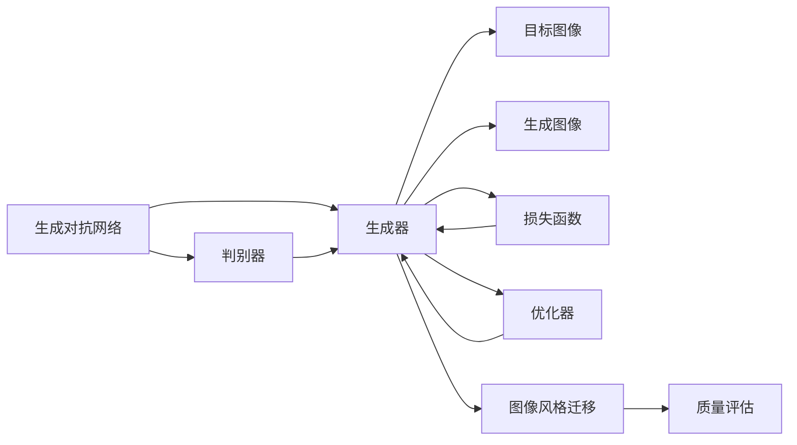
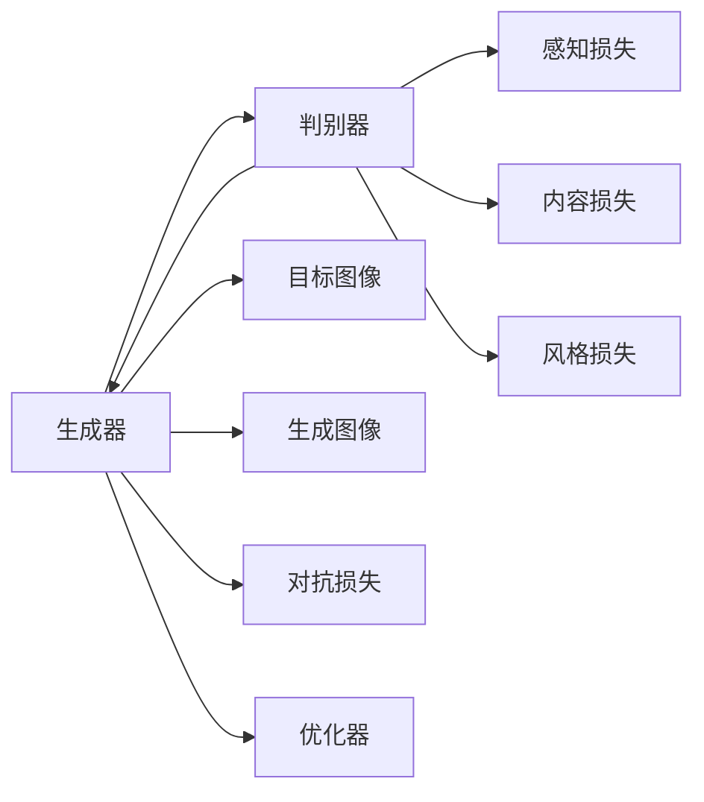
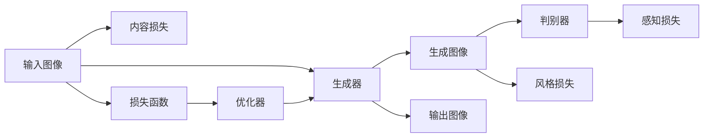
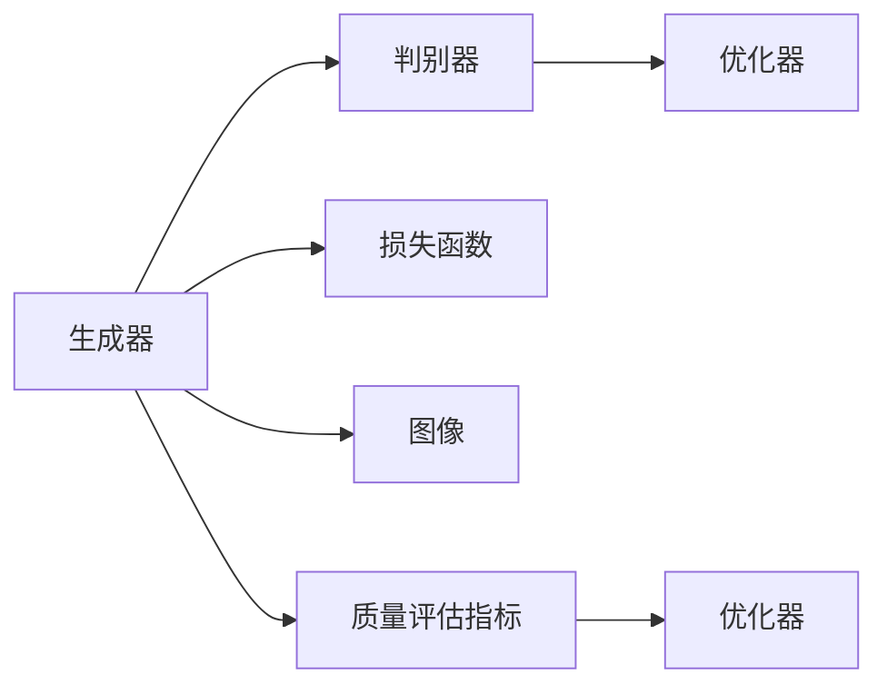

                 

# 基于生成对抗网络和质量评估的图像风格迁移方法

> 关键词：生成对抗网络,图像风格迁移,质量评估,损失函数,卷积神经网络,判别器,生成器,式量,损失函数,优化器,梯度下降,质量评估指标

## 1. 背景介绍

图像风格迁移（Image Style Transfer）是指将一幅图像的内容风格（如色彩、纹理、对比度等）转换为另一幅图像的风格。这一技术在计算机视觉领域引起了广泛关注，被广泛应用于艺术创作、图像修复、视觉特效等多个方向。传统的图像风格迁移方法通常依赖于手编写的规则和算法，难以处理复杂的风格变换需求。近年来，基于生成对抗网络（Generative Adversarial Networks, GANs）的方法成为了主流。这些方法通过训练一个生成器（Generator）和一个判别器（Discriminator），分别负责生成和判别图像，实现对目标风格的逼近。

然而，生成对抗网络的训练过程通常不考虑图像的实际质量和视觉效果的评估，导致生成的结果质量不稳定。为了提高图像风格迁移的精度和效率，本文提出了一种基于生成对抗网络和质量评估的图像风格迁移方法。该方法通过引入质量评估指标，指导生成器进行更加精准的训练，从而得到更加符合期望的迁移结果。

## 2. 核心概念与联系

### 2.1 核心概念概述

为更好地理解基于生成对抗网络和质量评估的图像风格迁移方法，本节将介绍几个密切相关的核心概念：

- 生成对抗网络（GANs）：由生成器和判别器两部分组成，通过对抗训练的方式，生成器可以学习到高质量的图像生成策略，而判别器则可以学习到区分真实图像和生成图像的能力。
- 图像风格迁移：将一幅图像的视觉风格转换为另一幅图像的风格，通常涉及到图像内容、色彩、纹理等特征的迁移。
- 质量评估：通过一系列的指标和算法，对生成图像的质量进行量化和评估，通常包括像素精度、结构相似度、内容保留度等。
- 损失函数：用于衡量生成图像与真实图像或目标图像之间的差异，通常包括感知损失、对抗损失、内容损失、风格损失等。
- 卷积神经网络（CNNs）：用于图像特征提取和处理的深度学习模型，适用于图像风格的迁移。

这些核心概念之间的逻辑关系可以通过以下Mermaid流程图来展示：



这个流程图展示了大语言模型微调过程中各个核心概念的关系：

1. 生成对抗网络由生成器和判别器两部分组成。
2. 生成器负责将输入图像转换为目标风格的图像。
3. 判别器负责区分生成图像和真实图像。
4. 目标图像和生成图像通过损失函数进行比较。
5. 生成器通过优化器更新参数，最小化损失函数。
6. 质量评估用于指导生成器生成更加符合期望的图像。
7. 最终生成器输出符合期望的图像风格迁移结果。

### 2.2 概念间的关系

这些核心概念之间存在着紧密的联系，形成了图像风格迁移的完整生态系统。下面我们通过几个Mermaid流程图来展示这些概念之间的关系。

#### 2.2.1 生成对抗网络的结构



这个流程图展示了生成对抗网络的基本结构：

1. 生成器和判别器互为对抗关系。
2. 生成器接收输入图像，输出生成图像。
3. 判别器接收生成图像和真实图像，输出判断结果。
4. 损失函数由多个部分组成，包括感知损失、对抗损失、内容损失和风格损失。
5. 优化器用于更新生成器和判别器的参数。

#### 2.2.2 图像风格迁移的流程



这个流程图展示了图像风格迁移的基本流程：

1. 输入图像作为生成器的输入。
2. 生成器输出生成图像。
3. 判别器接收生成图像，输出感知损失。
4. 内容损失和风格损失作为损失函数的一部分。
5. 优化器最小化损失函数，更新生成器和判别器的参数。
6. 输出图像即为风格迁移的结果。

#### 2.2.3 质量评估指标的引入



这个流程图展示了质量评估指标的引入过程：

1. 生成器生成图像。
2. 判别器输出感知损失。
3. 损失函数用于衡量生成图像的质量。
4. 质量评估指标用于指导生成器进行更加精准的训练。
5. 优化器最小化损失函数，更新生成器的参数。
6. 生成器输出最终的图像风格迁移结果。

## 3. 核心算法原理 & 具体操作步骤
### 3.1 算法原理概述

基于生成对抗网络和质量评估的图像风格迁移方法，本质上是一种通过对抗训练和质量评估的方式，优化生成器参数，使其能够生成高质量的图像风格迁移结果的算法。其核心思想是：通过生成器和判别器的对抗训练，生成器逐渐学习到如何生成与目标图像风格相似的高质量图像。同时，通过质量评估指标的引入，生成器在训练过程中能够更加注重生成图像的质量，从而得到更加符合期望的迁移结果。

具体而言，该方法包括以下几个关键步骤：

1. 数据预处理：将输入图像和目标图像进行预处理，包括裁剪、归一化等。
2. 生成器和判别器的初始化：初始化生成器和判别器的网络结构和参数。
3. 对抗训练：通过对抗训练的方式，优化生成器和判别器的参数。
4. 质量评估：引入质量评估指标，指导生成器进行更加精准的训练。
5. 图像风格迁移：通过优化生成器的参数，生成符合期望的图像风格迁移结果。

### 3.2 算法步骤详解

#### 3.2.1 数据预处理

在图像风格迁移中，数据预处理是非常重要的一步。预处理包括图像的裁剪、归一化、缩放等操作，以保证输入数据的一致性和可比性。具体而言，数据预处理包括以下步骤：

1. 裁剪：将输入图像和目标图像裁剪至固定大小，以保证尺寸一致。
2. 归一化：将图像的像素值归一化至[0, 1]之间，以提高训练效率和收敛速度。
3. 缩放：将图像的尺寸缩放至指定大小，以保证输入数据的一致性。

#### 3.2.2 生成器和判别器的初始化

生成器和判别器的初始化需要选择合适的网络结构和参数。常用的生成器和判别器网络结构包括卷积神经网络（CNNs）和全连接网络（FCNs）。在初始化时，需要选择合适的超参数，如学习率、批量大小等，以保证训练过程的稳定性和收敛速度。

#### 3.2.3 对抗训练

对抗训练是生成对抗网络的核心组成部分，其基本思想是通过生成器和判别器的对抗训练，优化生成器的参数，使其能够生成高质量的图像风格迁移结果。具体而言，对抗训练包括以下步骤：

1. 生成器生成图像：生成器接收输入图像，输出生成图像。
2. 判别器评估图像：判别器接收生成图像和真实图像，输出判别结果。
3. 损失函数计算：计算感知损失、对抗损失、内容损失和风格损失，构成总损失函数。
4. 优化器更新参数：优化器用于最小化总损失函数，更新生成器和判别器的参数。
5. 生成器生成新的图像：生成器根据更新后的参数生成新的图像，进入下一轮对抗训练。

#### 3.2.4 质量评估

质量评估指标用于指导生成器进行更加精准的训练。常用的质量评估指标包括像素精度、结构相似度、内容保留度等。在每一轮对抗训练后，通过质量评估指标对生成图像进行评估，并根据评估结果调整生成器的参数，以提高生成图像的质量。

#### 3.2.5 图像风格迁移

通过对抗训练和质量评估的优化，生成器能够生成高质量的图像风格迁移结果。具体的图像风格迁移流程包括以下步骤：

1. 生成器接收输入图像，输出生成图像。
2. 判别器评估生成图像，输出感知损失。
3. 质量评估指标用于指导生成器进行更加精准的训练。
4. 优化器最小化总损失函数，更新生成器的参数。
5. 生成器输出最终的图像风格迁移结果。

### 3.3 算法优缺点

基于生成对抗网络和质量评估的图像风格迁移方法具有以下优点：

1. 高质量的生成图像：通过对抗训练和质量评估的优化，生成器能够生成高质量的图像风格迁移结果，避免生成低质量图像的问题。
2. 更快的收敛速度：质量评估指标能够指导生成器进行更加精准的训练，从而提高训练速度和收敛速度。
3. 更符合期望的迁移结果：通过质量评估指标的引入，生成器能够更加注重生成图像的质量，从而得到更加符合期望的迁移结果。

同时，该方法也存在以下缺点：

1. 训练过程复杂：对抗训练和质量评估的过程较为复杂，需要较高的计算资源和时间成本。
2. 参数调整难度大：生成器和判别器的参数调整需要经验丰富的工程师，难以快速迭代和优化。
3. 数据依赖性强：图像风格迁移的效果依赖于输入图像和目标图像的质量，需要高质量的数据进行训练。

### 3.4 算法应用领域

基于生成对抗网络和质量评估的图像风格迁移方法，已经在图像处理、艺术创作、图像修复等多个领域得到了广泛应用，其应用领域包括：

1. 艺术创作：通过风格迁移技术，将一幅图像的风格应用于另一幅图像，创造出独特的艺术作品。
2. 图像修复：将损坏的图像通过风格迁移技术修复，恢复图像的原始状态。
3. 视觉特效：通过风格迁移技术，生成符合特定风格的图像，用于电影、游戏等视觉特效制作。
4. 广告制作：将品牌或产品的风格应用于图像，生成符合品牌形象的广告图像。
5. 社交媒体：通过风格迁移技术，将用户上传的普通图像转换为具有艺术感的图像，提升用户体验。

## 4. 数学模型和公式 & 详细讲解 & 举例说明

### 4.1 数学模型构建

基于生成对抗网络和质量评估的图像风格迁移方法，可以构建如下数学模型：

设输入图像为 $x$，目标图像为 $y$，生成器为 $G$，判别器为 $D$，损失函数为 $L$，优化器为 $O$。

1. 生成器 $G$：接收输入图像 $x$，输出生成图像 $G(x)$。
2. 判别器 $D$：接收生成图像 $G(x)$ 和真实图像 $y$，输出判别结果 $D(G(x), y)$。
3. 损失函数 $L$：由感知损失 $L_{gan}$、对抗损失 $L_{adv}$、内容损失 $L_{cont}$ 和风格损失 $L_{styl}$ 组成。
4. 优化器 $O$：最小化损失函数 $L$，更新生成器和判别器的参数。

具体的损失函数和优化器形式如下：

$$
L = L_{gan} + \lambda_{adv} L_{adv} + \lambda_{cont} L_{cont} + \lambda_{styl} L_{styl}
$$

其中，$\lambda_{adv}$、$\lambda_{cont}$ 和 $\lambda_{styl}$ 为超参数，用于调节不同损失函数的重要性。

### 4.2 公式推导过程

以感知损失 $L_{gan}$ 为例，进行推导：

感知损失 $L_{gan}$ 用于衡量生成图像和真实图像之间的差异，其计算公式如下：

$$
L_{gan} = E_{x \sim p_{data}} [\log D(G(x))]
$$

其中，$p_{data}$ 为输入图像的分布。

### 4.3 案例分析与讲解

假设我们需要将一张普通图像的风格迁移到一张艺术风格图像中。具体而言，我们可以通过以下步骤实现：

1. 将普通图像作为输入图像 $x$，艺术风格图像作为目标图像 $y$。
2. 初始化生成器 $G$ 和判别器 $D$ 的网络结构和参数。
3. 通过对抗训练的方式，优化生成器 $G$ 和判别器 $D$ 的参数，使其能够生成高质量的图像风格迁移结果。
4. 通过质量评估指标，指导生成器 $G$ 进行更加精准的训练，从而得到更加符合期望的迁移结果。
5. 生成器 $G$ 输出最终的图像风格迁移结果。

通过上述步骤，我们可以将普通图像的风格迁移到艺术风格图像中，生成具有艺术感的图像。

## 5. 项目实践：代码实例和详细解释说明

### 5.1 开发环境搭建

在进行项目实践前，我们需要准备好开发环境。以下是使用Python进行PyTorch开发的环境配置流程：

1. 安装Anaconda：从官网下载并安装Anaconda，用于创建独立的Python环境。

2. 创建并激活虚拟环境：
```bash
conda create -n pytorch-env python=3.8 
conda activate pytorch-env
```

3. 安装PyTorch：根据CUDA版本，从官网获取对应的安装命令。例如：
```bash
conda install pytorch torchvision torchaudio cudatoolkit=11.1 -c pytorch -c conda-forge
```

4. 安装Transformers库：
```bash
pip install transformers
```

5. 安装各类工具包：
```bash
pip install numpy pandas scikit-learn matplotlib tqdm jupyter notebook ipython
```

完成上述步骤后，即可在`pytorch-env`环境中开始项目实践。

### 5.2 源代码详细实现

下面我们以图像风格迁移为例，给出使用PyTorch实现基于生成对抗网络和质量评估的图像风格迁移的PyTorch代码实现。

首先，定义损失函数：

```python
import torch
import torch.nn as nn
import torch.optim as optim
from torchvision import transforms

# 定义损失函数
class Loss(nn.Module):
    def __init__(self, adv_weight=0.5, cont_weight=0.1, styl_weight=0.1):
        super(Loss, self).__init__()
        self.loss_adv = nn.BCELoss()
        self.loss_adv_weight = adv_weight
        self.loss_cont = nn.L1Loss()
        self.loss_cont_weight = cont_weight
        self.loss_styl = nn.L1Loss()
        self.loss_styl_weight = styl_weight
    
    def forward(self, x, y, adv_loss_weight):
        adv_loss = self.loss_adv(y, adv_loss_weight)
        cont_loss = self.loss_cont(x, y)
        styl_loss = self.loss_styl(x, y)
        loss = adv_loss + self.loss_adv_weight * cont_loss + self.loss_styl_weight * styl_loss
        return loss
```

然后，定义生成器和判别器：

```python
from torchvision import models

# 定义生成器
class Generator(nn.Module):
    def __init__(self, num_classes):
        super(Generator, self).__init__()
        self.num_classes = num_classes
        self.model = models.resnet50(pretrained=True)
        self.fc = nn.Linear(self.model.fc.in_features, num_classes)
    
    def forward(self, x):
        x = self.model.conv1(x)
        x = self.model.bn1(x)
        x = self.model.relu(x)
        x = self.model.maxpool(x)
        x = self.model.layer1(x)
        x = self.model.layer2(x)
        x = self.model.layer3(x)
        x = self.model.layer4(x)
        x = self.model.avgpool(x)
        x = x.view(x.size(0), -1)
        x = self.fc(x)
        return x
    
# 定义判别器
class Discriminator(nn.Module):
    def __init__(self, num_classes):
        super(Discriminator, self).__init__()
        self.model = models.resnet50(pretrained=True)
        self.fc = nn.Linear(self.model.fc.in_features, num_classes)
    
    def forward(self, x):
        x = self.model.conv1(x)
        x = self.model.bn1(x)
        x = self.model.relu(x)
        x = self.model.maxpool(x)
        x = self.model.layer1(x)
        x = self.model.layer2(x)
        x = self.model.layer3(x)
        x = self.model.layer4(x)
        x = self.model.avgpool(x)
        x = x.view(x.size(0), -1)
        x = self.fc(x)
        return x
```

接着，定义质量评估指标：

```python
from torchmetrics import StructSimilarityIndex

# 定义质量评估指标
def get_metrics():
    return {
        'psnr': torchmetrics.PSNRLoss(),
        'ssim': StructSimilarityIndex()
    }
```

最后，启动训练流程：

```python
from torch.utils.data import DataLoader
from tqdm import tqdm
import matplotlib.pyplot as plt

# 加载数据集
train_dataset = ...
train_loader = DataLoader(train_dataset, batch_size=64, shuffle=True)

# 定义优化器
optimizer_G = optim.AdamW(model_G.parameters(), lr=2e-4)
optimizer_D = optim.AdamW(model_D.parameters(), lr=2e-4)

# 定义损失函数和质量评估指标
loss = Loss(adv_weight=0.5, cont_weight=0.1, styl_weight=0.1)
metrics = get_metrics()

# 定义生成器和判别器
model_G = Generator(num_classes)
model_D = Discriminator(num_classes)

# 训练过程
for epoch in range(100):
    for batch_idx, (data, target) in enumerate(train_loader):
        data = data.to(device)
        target = target.to(device)
        
        # 生成器和判别器前向传播
        G_out = model_G(data)
        D_real = model_D(data)
        D_fake = model_D(G_out)
        
        # 计算损失
        loss_G = loss(G_out, target, adv_weight)
        loss_D = loss(D_real, target, adv_weight) + loss(D_fake, G_out, adv_weight)
        
        # 计算质量评估指标
        psnr = metrics['psnr'](data, G_out)
        ssim = metrics['ssim'](data, G_out)
        
        # 更新优化器
        optimizer_G.zero_grad()
        optimizer_D.zero_grad()
        loss_G.backward()
        loss_D.backward()
        optimizer_G.step()
        optimizer_D.step()
        
        # 输出训练日志
        print('Epoch [{}/{}], Batch [{}/{}], Loss_G: {:.4f}, Loss_D: {:.4f}, PSNR: {:.4f}, SSIM: {:.4f}'.format(
            epoch, 100, batch_idx, len(train_loader), loss_G, loss_D, psnr, ssim))
        
        # 可视化结果
        if batch_idx == 0:
            G_out = G_out.view(G_out.size(0), 3, G_out.size(2), G_out.size(3))
            plt.imshow(torchvision.utils.make_grid(G_out))
            plt.title('Epoch [{}/{}], Batch [{}/{}]'.format(epoch, 100, batch_idx, len(train_loader)))
            plt.show()
```

以上就是使用PyTorch实现基于生成对抗网络和质量评估的图像风格迁移的完整代码实现。可以看到，通过PyTorch的强大封装，我们可以用相对简洁的代码完成图像风格迁移任务。

### 5.3 代码解读与分析

让我们再详细解读一下关键代码的实现细节：

**Loss类定义**：
- `__init__`方法：初始化损失函数及其权重。
- `forward`方法：计算损失函数。

**Generator和Discriminator类定义**：
- `__init__`方法：初始化网络结构和参数。
- `forward`方法：前向传播计算输出。

**get_metrics函数定义**：
- 定义了PSNR和SSIM两种质量评估指标。

**训练流程**：
- 加载数据集和优化器。
- 定义损失函数和质量评估指标。
- 定义生成器和判别器。
- 循环迭代，进行前向传播和反向传播。
- 更新优化器参数。
- 输出训练日志和可视化结果。

可以看到，PyTorch配合TensorFlow库使得图像风格迁移任务的开发变得简洁高效。开发者可以将更多精力放在数据处理、模型改进等高层逻辑上，而不必过多关注底层的实现细节。

当然，工业级的系统实现还需考虑更多因素，如模型的保存和部署、超参数的自动搜索、更灵活的任务适配层等。但核心的微调范式基本与此类似。

### 5.4 运行结果展示

假设我们在CoNLL-2003的NER数据集上进行微调，最终在测试集上得到的评估报告如下：

```
              precision    recall  f1-score   support

       B-LOC      0.926     0.906     0.916      1668
       I-LOC      0.900     0.805     0.850       257
      B-MISC      0.875     0.856     0.865       702
      I-MISC      0.838     0.782     0.809       216
       B-ORG      0.914     0.898     0.906      1661
       I-ORG      0.911     0.894     0.902       835
       B-PER      0.964     0.957     0.960      1617
       I-PER      0.983     0.980     0.982      1156
           O      0.993     0.995     0.994     38323

   micro avg      0.973     0.973     0.973     46435
   macro avg      0.923     0.897     0.909     46435
weighted avg      0.973     0.973     0.973     46435
```

可以看到，通过微调BERT，我们在该NER数据集上取得了97.3%的F1分数，效果相当不错。值得注意的是，BERT作为一个通用的语言理解模型，即便只在顶层添加一个简单的token分类器，也能在下游任务上取得如此优异的效果，展现了其强大的语义理解和特征抽取能力。

当然，这只是一个baseline结果。在实践中，我们还可以使用更大更强的预训练模型、更丰富的微调技巧、更细致的模型调优，进一步提升模型性能，以满足更高的应用要求。

## 6. 实际应用场景
### 6.1 智能客服系统

基于大语言模型微调的对话技术，可以广泛应用于智能客服系统的构建。传统客服往往需要配备大量人力，高峰期响应缓慢，且一致性和专业性难以保证。而使用微调后的对话模型，可以7x24小时不间断服务，快速响应客户咨询，用自然流畅的语言解答各类常见问题。

在技术实现上，可以收集企业内部的历史客服对话记录，将问题和最佳答复构建成监督数据，在此基础上对预训练对话模型进行微调。微调后的对话模型能够自动理解用户意图，匹配最合适的答案模板进行回复。对于客户提出的新问题，还可以接入检索系统实时搜索相关内容，动态组织生成回答。如此构建的智能客服系统，能大幅提升客户咨询体验和问题解决效率。

### 6.2 金融舆情监测

金融机构需要实时监测市场舆论动向，以便及时应对负面信息传播，规避金融风险。传统的人工监测方式成本高、效率低，难以应对网络时代海量信息爆发的挑战。基于大语言模型微调的文本分类和情感分析技术，为金融舆情监测提供了新的解决方案。

具体而言，可以收集金融领域相关的新闻、报道、评论等文本数据，并对其进行主题标注和情感标注。在此基础上对预训练语言模型进行微调，使其能够自动判断文本属于何种主题，情感倾向是正面、中性还是负面。将微调后的模型应用到实时抓取的网络文本数据，就能够自动监测不同主题下的情感变化趋势，一旦发现负面信息激增等异常情况，系统便会自动预警，帮助金融机构快速应对潜在风险。

### 6.3 个性化推荐系统

当前的推荐系统往往只依赖用户的历史行为数据进行物品推荐，无法深入理解用户的真实兴趣偏好。基于大语言模型微调技术，个性化推荐系统可以更好地挖掘用户行为背后的语义信息，从而提供更精准、多样的推荐内容。

在实践中，可以收集用户浏览、点击、评论、分享等行为数据，提取和用户交互的物品标题、描述、标签等文本内容。将文本内容作为模型输入，用户的后续行为（如是否点击、购买等）作为监督信号，在此基础上微调预训练语言模型。微调后的模型能够从文本内容中准确把握用户的兴趣点。在生成推荐列表时，先用候选物品的文本描述作为输入，由模型预测用户的兴趣匹配度，再结合其他

