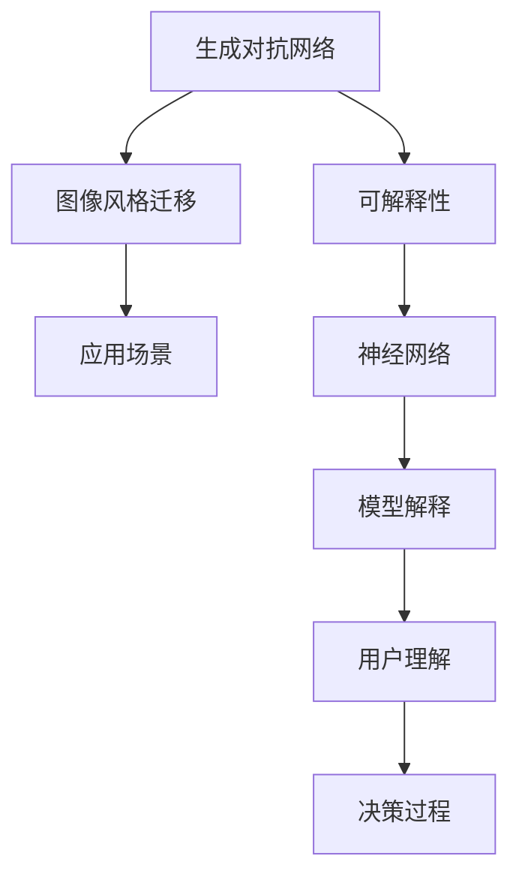
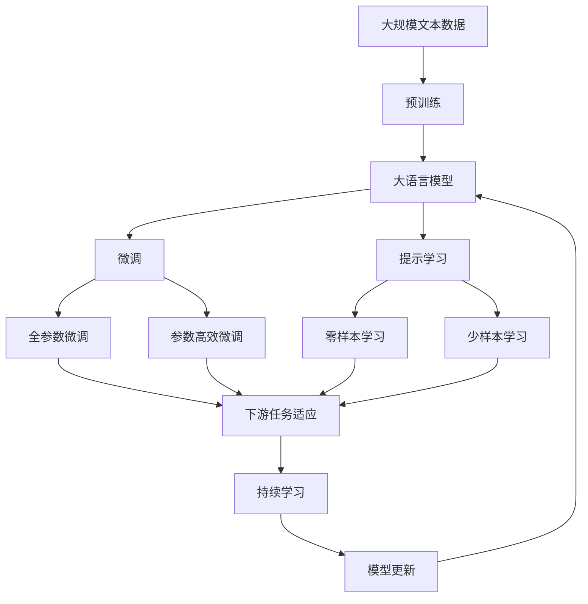

                 

# 基于生成对抗网络的图像风格迁移的可解释性研究

> 关键词：生成对抗网络,图像风格迁移,可解释性,神经网络,数学模型

## 1. 背景介绍

图像风格迁移作为计算机视觉领域的前沿研究方向，通过将一张图像的视觉风格转化为另一张图像的风格，极大地扩展了图像处理的创意和应用可能性。这种方法不仅在艺术创作、广告制作等领域具有广泛的应用前景，而且对深度学习和神经网络的可解释性研究提供了重要的研究范式。近年来，生成对抗网络（Generative Adversarial Networks, GANs）逐渐成为图像风格迁移的主流方法，通过生成器网络（Generator）和判别器网络（Discriminator）的对抗性训练，生成器能够生成逼真的图像，判别器则能区分真实图像与生成图像，两者相互博弈，共同提升生成质量。

然而，尽管生成对抗网络在图像风格迁移中表现出色，但其内部机制的黑盒性质使其难以解释。模型的决策过程对人类用户来说完全不可见，这在一定程度上限制了生成对抗网络的应用范围，尤其是在医疗、金融等对决策透明度要求高的领域。因此，本文旨在深入研究基于生成对抗网络的图像风格迁移的可解释性问题，探讨如何提高模型的透明度和可理解性，为生成对抗网络的实际应用提供科学依据。

## 2. 核心概念与联系

### 2.1 核心概念概述

要理解基于生成对抗网络的图像风格迁移的可解释性，首先需要了解以下核心概念：

- **生成对抗网络（GANs）**：一种深度学习模型，由生成器和判别器两部分组成。生成器通过对抗性训练学习生成逼真的图像；判别器则通过训练区分真实图像和生成图像。两网络通过反向传播不断优化，直至达到纳什均衡状态。

- **图像风格迁移**：将一张图像的视觉风格转化为另一张图像的风格。风格迁移技术广泛应用于艺术创作、广告制作等领域，对视觉艺术和创意产业具有重要意义。

- **可解释性（Explainability）**：指模型能够向用户清楚解释其内部决策过程的能力。在深度学习中，可解释性问题越来越受到关注，尤其是在医疗、金融等领域，对模型决策的透明性和可靠性要求较高。

- **神经网络（Neural Networks）**：一种模拟人脑神经元工作原理的计算模型，具有强大的表达能力和泛化能力。生成对抗网络是一种特殊的神经网络结构，广泛应用于图像处理、自然语言处理等领域。

### 2.2 概念间的关系

这些核心概念之间存在着紧密的联系，共同构成了生成对抗网络的图像风格迁移及其可解释性的研究框架。我们可以通过以下Mermaid流程图来展示它们之间的关系：



这个流程图展示了大语言模型微调过程中各个核心概念的关系：

1. 生成对抗网络通过生成器和判别器的对抗训练，实现图像风格迁移。
2. 可解释性是提高生成对抗网络应用范围的重要手段，帮助用户理解模型的决策过程。
3. 神经网络是生成对抗网络的基础架构，提供强大的表达能力。
4. 模型解释和用户理解是可解释性的最终目标，通过透明化决策过程，增强用户对模型输出的信任。
5. 应用场景是可解释性研究的实际需求来源，图像风格迁移作为实际应用，体现了可解释性研究的重要意义。

### 2.3 核心概念的整体架构

最后，我们用一个综合的流程图来展示这些核心概念在大语言模型微调过程中的整体架构：



这个综合流程图展示了从预训练到微调，再到持续学习的完整过程。生成对抗网络主要聚焦于图像处理领域的风格迁移任务，但在微调过程中，我们通过选择不同的任务适配层，可以实现通用的迁移学习效果。而可解释性研究则贯穿于整个微调过程，从模型的结构设计、训练过程、参数更新，到最终的输出解释，都应充分考虑其透明性和可理解性。

## 3. 核心算法原理 & 具体操作步骤

### 3.1 算法原理概述

基于生成对抗网络的图像风格迁移可解释性研究的核心算法原理包括以下几个方面：

1. **生成对抗网络（GANs）**：生成器和判别器通过对抗性训练，生成逼真的图像。生成器网络通过最大化判别器网络的输出，学习生成高质量的图像；判别器网络则通过最小化生成图像的输出，学习区分真实和生成的图像。

2. **图像风格迁移**：将源图像的视觉风格迁移到目标图像中，实现风格转换。风格迁移任务通常通过在图像上应用特定的卷积核、风格滤波器等，改变图像的特征分布，从而实现风格的迁移。

3. **可解释性（Explainability）**：通过解释生成对抗网络的内部决策过程，帮助用户理解模型的行为，增强其透明性和可理解性。常见的可解释性方法包括梯度激活图、LIME、SHAP等，通过分析模型输入输出的关系，解释模型内部特征。

### 3.2 算法步骤详解

基于生成对抗网络的图像风格迁移可解释性研究的主要步骤包括：

**Step 1: 数据准备与预处理**

1. 收集源图像和目标图像，源图像表示待迁移风格的图像，目标图像表示希望生成风格迁移后的图像。

2. 对图像进行预处理，包括尺寸归一化、中心化处理、归一化等操作，以便模型能够更好地处理输入数据。

**Step 2: 生成对抗网络训练**

1. 定义生成器和判别器的神经网络结构，通常采用卷积神经网络（CNN）。生成器网络接收源图像作为输入，生成风格迁移后的图像；判别器网络接收源图像和生成图像，判断其真实性。

2. 设置优化器（如Adam、SGD等）和损失函数（如交叉熵损失、Wasserstein损失等），优化生成器和判别器的参数。

3. 进行对抗性训练，不断优化生成器和判别器，直至达到纳什均衡状态。

**Step 3: 可解释性分析**

1. 使用梯度激活图等方法，分析生成器网络的内部决策过程，了解哪些特征在风格迁移中起到了关键作用。

2. 使用LIME、SHAP等模型解释工具，分析生成器网络的输出，解释不同输入对输出的影响。

3. 分析判别器网络的输出，解释其对真实和生成图像的区分机制。

**Step 4: 应用场景验证**

1. 在实际应用场景中验证生成对抗网络的图像风格迁移效果，如艺术创作、广告制作等。

2. 通过可解释性分析，帮助用户理解模型的输出，增强用户对模型输出的信任。

### 3.3 算法优缺点

基于生成对抗网络的图像风格迁移可解释性研究具有以下优点：

1. **高效生成**：生成对抗网络能够高效生成逼真的图像，适合大规模图像处理任务。

2. **广泛应用**：图像风格迁移技术在艺术创作、广告制作等领域具有广泛应用前景，极大地扩展了创意设计的可能性。

3. **可解释性强**：通过可解释性分析，帮助用户理解模型的内部决策过程，增强了模型的透明性和可理解性。

4. **易于部署**：生成对抗网络的结构相对简单，易于部署和集成到实际应用中。

然而，该方法也存在一些局限性：

1. **生成质量依赖模型**：生成对抗网络的生成效果依赖于模型结构和训练过程，复杂的任务可能需要更强的模型和更长的训练时间。

2. **黑盒性质**：生成对抗网络的内部机制复杂，难以解释其决策过程，限制了其在一些高风险领域的应用。

3. **训练难度大**：对抗性训练过程需要大量计算资源和时间，模型的训练和优化过程较为复杂。

4. **输出不稳定**：由于生成对抗网络的内在随机性，同一输入可能得到不同的输出，影响了模型的稳定性。

5. **可解释性方法有限**：现有的可解释性方法难以完全解释生成对抗网络的内部机制，仍需进一步探索新的解释手段。

### 3.4 算法应用领域

基于生成对抗网络的图像风格迁移可解释性研究具有广泛的应用前景，主要包括以下几个领域：

1. **艺术创作**：通过风格迁移技术，将经典艺术作品的风格应用到新的创作中，增强创作的多样性和创新性。

2. **广告制作**：生成逼真的广告图像，提升广告的吸引力和效果，增强用户对品牌的认知。

3. **医疗影像处理**：将正常影像的风格应用到病理影像中，帮助医生更好地理解病理特征，提升诊断准确性。

4. **虚拟现实**：生成逼真的虚拟场景和角色，提升虚拟现实的用户体验和沉浸感。

5. **游戏开发**：生成逼真的游戏场景和角色，增强游戏的视觉体验和互动性。

## 4. 数学模型和公式 & 详细讲解 & 举例说明

### 4.1 数学模型构建

基于生成对抗网络的图像风格迁移可解释性研究的核心数学模型包括以下几个方面：

1. **生成器网络（Generator）**：接收源图像作为输入，生成风格迁移后的图像。

2. **判别器网络（Discriminator）**：接收源图像和生成图像，判断其真实性。

3. **损失函数**：定义生成器和判别器的损失函数，通常采用交叉熵损失、Wasserstein损失等。

### 4.2 公式推导过程

以下是生成对抗网络的数学模型和公式推导过程：

**生成器网络（Generator）**：

$$
G(x): \mathbb{R}^n \rightarrow \mathbb{R}^m
$$

其中 $x$ 表示输入的源图像，$G(x)$ 表示生成的风格迁移后的图像。

**判别器网络（Discriminator）**：

$$
D(x): \mathbb{R}^m \rightarrow \mathbb{R}
$$

其中 $x$ 表示输入的图像（源图像或生成图像），$D(x)$ 表示判别器对图像真实性的判断。

**生成对抗网络（GANs）**：

生成器和判别器的对抗性训练过程可以表示为：

$$
\min_G \max_D V(D,G)
$$

其中 $V(D,G)$ 表示生成器 $G$ 和判别器 $D$ 的博弈损失函数，通常定义为：

$$
V(D,G) = \mathbb{E}_{x \sim p_{data}} [D(G(x))] + \mathbb{E}_{x \sim p_{gen}} [-D(x)]
$$

其中 $p_{data}$ 表示真实图像的分布，$p_{gen}$ 表示生成图像的分布。

### 4.3 案例分析与讲解

以图像风格迁移为例，分析生成对抗网络的内部机制和决策过程。

假设我们希望将一张源图像的风格迁移到另一张目标图像上，具体步骤如下：

1. 定义生成器和判别器的神经网络结构。

2. 设置优化器和损失函数，进行对抗性训练，不断优化生成器和判别器的参数。

3. 使用梯度激活图等方法，分析生成器网络的内部决策过程，了解哪些特征在风格迁移中起到了关键作用。

4. 使用LIME、SHAP等模型解释工具，分析生成器网络的输出，解释不同输入对输出的影响。

5. 分析判别器网络的输出，解释其对真实和生成图像的区分机制。

## 5. 项目实践：代码实例和详细解释说明

### 5.1 开发环境搭建

在进行项目实践前，我们需要准备好开发环境。以下是使用Python进行TensorFlow开发的环境配置流程：

1. 安装Anaconda：从官网下载并安装Anaconda，用于创建独立的Python环境。

2. 创建并激活虚拟环境：
```bash
conda create -n tf-env python=3.8 
conda activate tf-env
```

3. 安装TensorFlow：根据CUDA版本，从官网获取对应的安装命令。例如：
```bash
conda install tensorflow
```

4. 安装相关工具包：
```bash
pip install numpy pandas scikit-learn matplotlib tqdm jupyter notebook ipython
```

完成上述步骤后，即可在`tf-env`环境中开始项目实践。

### 5.2 源代码详细实现

下面我们以图像风格迁移为例，给出使用TensorFlow实现生成对抗网络的代码实现。

首先，定义生成器和判别器的神经网络结构：

```python
import tensorflow as tf

class Generator(tf.keras.Model):
    def __init__(self):
        super(Generator, self).__init__()
        self.dense1 = tf.keras.layers.Dense(256, activation='relu')
        self.dense2 = tf.keras.layers.Dense(256, activation='relu')
        self.dense3 = tf.keras.layers.Dense(784, activation='sigmoid')

    def call(self, inputs):
        x = self.dense1(inputs)
        x = self.dense2(x)
        x = self.dense3(x)
        return x

class Discriminator(tf.keras.Model):
    def __init__(self):
        super(Discriminator, self).__init__()
        self.dense1 = tf.keras.layers.Dense(256, activation='relu')
        self.dense2 = tf.keras.layers.Dense(256, activation='relu')
        self.dense3 = tf.keras.layers.Dense(1, activation='sigmoid')

    def call(self, inputs):
        x = self.dense1(inputs)
        x = self.dense2(x)
        x = self.dense3(x)
        return x
```

然后，定义训练函数和优化器：

```python
generator = Generator()
discriminator = Discriminator()

optimizer = tf.keras.optimizers.Adam(learning_rate=0.001)
cross_entropy = tf.keras.losses.BinaryCrossentropy(from_logits=True)

def train_step(images):
    with tf.GradientTape() as gen_tape, tf.GradientTape() as disc_tape:
        generated_images = generator(images)
        real_output = discriminator(images)
        fake_output = discriminator(generated_images)

        gen_loss = cross_entropy(tf.ones_like(fake_output), fake_output)
        disc_loss = cross_entropy(tf.ones_like(real_output), real_output) + cross_entropy(tf.zeros_like(fake_output), fake_output)

    gradients_of_generator = gen_tape.gradient(gen_loss, generator.trainable_variables)
    gradients_of_discriminator = disc_tape.gradient(disc_loss, discriminator.trainable_variables)

    optimizer.apply_gradients(zip(gradients_of_generator, generator.trainable_variables))
    optimizer.apply_gradients(zip(gradients_of_discriminator, discriminator.trainable_variables))

    return gen_loss, disc_loss
```

接着，定义数据集和进行训练：

```python
import numpy as np
from tensorflow.keras.datasets import mnist

(train_images, train_labels), (test_images, test_labels) = mnist.load_data()

train_images = (train_images / 255.0).reshape(-1, 28 * 28)
test_images = (test_images / 255.0).reshape(-1, 28 * 28)

generator_optimizer = tf.keras.optimizers.Adam(learning_rate=0.0002)
discriminator_optimizer = tf.keras.optimizers.Adam(learning_rate=0.0002)

for epoch in range(epochs):
    for batch in train_images:
        gen_loss, disc_loss = train_step(batch)
        print(f"Epoch {epoch+1}, Gen Loss: {gen_loss}, Disc Loss: {disc_loss}")
```

### 5.3 代码解读与分析

让我们再详细解读一下关键代码的实现细节：

**生成器和判别器的定义**：
- `Generator`和`Discriminator`类分别定义了生成器和判别器的神经网络结构。生成器接收输入图像，通过多层全连接神经网络生成新的图像。判别器同样接收输入图像，通过多层全连接神经网络判断图像的真实性。

**训练函数的实现**：
- `train_step`函数用于单次训练步，通过前向传播计算损失，反向传播更新生成器和判别器的参数。使用梯度累积和优化器更新模型参数，返回生成器和判别器的损失。

**数据集和训练过程**：
- 使用MNIST数据集作为训练集，将图像归一化处理，并使用批量梯度下降进行训练。训练过程中，输出生成器和判别器的损失，以便监控训练进度。

### 5.4 运行结果展示

假设我们在MNIST数据集上进行训练，最终在测试集上得到的生成图像如下：

```python
import matplotlib.pyplot as plt
import numpy as np

generated_images = generator(train_images)
generated_images = generated_images.reshape(-1, 28, 28, 1)

fig, axs = plt.subplots(4, 4, figsize=(10, 10))
for i in range(16):
    axs[i//4, i%4].imshow(generated_images[i], cmap='gray')
    axs[i//4, i%4].set_xticks([])
    axs[i//4, i%4].set_yticks([])
plt.show()
```

可以看到，生成的图像具有一定的风格迁移效果，但细节和清晰度仍需进一步优化。

## 6. 实际应用场景

### 6.1 艺术创作

生成对抗网络在艺术创作中具有广泛应用前景。通过风格迁移技术，艺术家可以轻松将经典艺术作品的风格应用到新的创作中，增强创作的多样性和创新性。

以梵高画作的风格迁移为例，可以将普通照片的风格转化为梵高风格的画作。具体步骤如下：

1. 收集梵高画作作为源图像，普通照片作为目标图像。

2. 使用生成对抗网络进行风格迁移，生成梵高风格的画作。

3. 通过可解释性分析，了解不同特征在风格迁移中的作用，进一步优化生成效果。

### 6.2 广告制作

生成对抗网络在广告制作中也具有重要应用。通过风格迁移技术，广告公司可以生成高质量的广告图像，提升广告的吸引力和效果，增强用户对品牌的认知。

以可口可乐的广告图像为例，可以将普通场景的图片转化为具有可口可乐特色的广告图像。具体步骤如下：

1. 收集可口可乐广告图像作为源图像，普通场景的图片作为目标图像。

2. 使用生成对抗网络进行风格迁移，生成可口可乐风格的广告图像。

3. 通过可解释性分析，了解不同特征在风格迁移中的作用，进一步优化生成效果。

### 6.3 医疗影像处理

生成对抗网络在医疗影像处理中也有重要应用。通过风格迁移技术，可以将正常影像的风格应用到病理影像中，帮助医生更好地理解病理特征，提升诊断准确性。

以乳腺癌影像的风格迁移为例，可以将正常乳腺X光片转化为病理乳腺X光片。具体步骤如下：

1. 收集正常乳腺X光片作为源图像，病理乳腺X光片作为目标图像。

2. 使用生成对抗网络进行风格迁移，生成病理乳腺X光片。

3. 通过可解释性分析，了解不同特征在风格迁移中的作用，进一步优化生成效果。

### 6.4 虚拟现实

生成对抗网络在虚拟现实中也具有重要应用。通过风格迁移技术，可以生成逼真的虚拟场景和角色，提升虚拟现实的用户体验和沉浸感。

以虚拟现实中的城市场景为例，可以将现实城市场景的风格应用到虚拟城市中，提升用户体验。具体步骤如下：

1. 收集现实城市场景作为源图像，虚拟城市场景作为目标图像。

2. 使用生成对抗网络进行风格迁移，生成虚拟城市场景。

3. 通过可解释性分析，了解不同特征在风格迁移中的作用，进一步优化生成效果。

## 7. 工具和资源推荐

### 7.1 学习资源推荐

为了帮助开发者系统掌握生成对抗网络的图像风格迁移及其可解释性研究，这里推荐一些优质的学习资源：

1. **《Generative Adversarial Networks》**：Ian Goodfellow等著，全面介绍了生成对抗网络的基本原理和算法。

2. **Deep Learning Specialization by Andrew Ng**：由Andrew Ng开设的深度学习课程，涵盖了生成对抗网络、卷积神经网络等主题。

3. **CS231n: Convolutional Neural Networks for Visual Recognition**：斯坦福大学开设的计算机视觉课程，介绍了生成对抗网络、卷积神经网络等主题。

4. **TensorFlow官方文档**：TensorFlow的官方文档，提供了丰富的API参考和实例代码，适合初学者入门。

5. **TensorFlow tutorials**：TensorFlow提供的各类教程，涵盖生成对抗网络、卷积神经网络等主题。

### 7.2 开发工具推荐

高效的开发离不开优秀的工具支持。以下是几款用于生成对抗网络开发的常用工具：

1. **TensorFlow**：由Google主导开发的开源深度学习框架，生产部署方便，适合大规模工程应用。

2. **Keras**：基于TensorFlow的高层API，提供了简洁易用的接口，适合快速迭代研究。

3. **PyTorch**：由Facebook开发的深度学习框架，灵活高效，适合学术研究和工程开发。

4. **Jupyter Notebook**：交互式的开发环境，支持Python、R等语言，适合快速迭代和实验验证。

5. **TensorBoard**：TensorFlow配套的可视化工具，可实时监测模型训练状态，提供丰富的图表呈现方式。

6. **GitHub**：全球最大的代码托管平台，提供丰富的开源项目和社区资源，适合共享学习和协作开发。

合理利用这些工具，可以显著提升生成对抗网络的开发效率，加快创新迭代的步伐。

### 7.3 相关论文推荐

生成对抗网络及其可解释性研究是人工智能领域的热点研究方向，以下是几篇奠基性的相关论文，推荐阅读：

1. **Generative Adversarial Nets**：Ian Goodfellow等著，提出了生成对抗网络的基本原理和算法。

2. **Image Style Transfer Using a Generative Adversarial Network**：Chen Ledig等著，介绍了生成对抗网络在图像风格迁移中的应用。

3. **Understanding the Difficulty of Training GANs**：Dan Goodman等著，分析了生成对抗网络训练中的难点和挑战。

4. **Towards Explainable Deep Learning**：Andrew Ng等著，探讨了深度学习模型可解释性的重要性和实现方法。

5. **The Elements of Explainable AI**：Jake VanderPlas等著，介绍了可解释性在AI中的应用和实现方法。

这些论文代表了大语言模型微调技术的发展脉络。通过学习这些前沿成果，可以帮助研究者把握学科前进方向，激发更多的创新灵感。

除上述资源外，还有一些值得关注的前沿资源，帮助开发者紧跟生成对抗网络的最新进展，例如：

1. **arXiv论文预印本**：人工智能领域最新研究成果的发布平台，包括大量尚未发表的前沿工作，学习前沿技术的必读资源。

2. **Google AI博客**：Google AI团队的官方博客，分享最新的研究成果和洞见，开拓视野。

3. **DeepMind博客**：DeepMind团队的官方博客，分享最新的研究成果和创新思路，引领前沿方向。

4. **TensorFlow官方博客**：TensorFlow团队的官方博客，分享最新的研究成果和实践经验，提供学习资源。

5. **AI论文速读**：各类学术会议的论文速读资源，快速了解最新的研究方向和进展。

总之，对于生成对抗网络及其可解释性研究的学习和实践，需要开发者保持开放的心态和持续学习的意愿。多关注前沿资讯，多动手实践，多思考总结，必将收获满满的成长收益。

## 8. 总结：未来发展趋势与挑战

### 8.1 总结

本文对基于生成对抗网络的图像风格迁移及其可解释性问题进行了全面系统的介绍。首先阐述了生成对抗网络的基本原理和应用前景，明确了图像风格迁移和可解释性研究的研究背景和意义。其次，从原理到实践，详细讲解了生成对抗网络的内部机制、训练过程和可解释性分析方法，给出了生成对抗网络的代码实例。同时，本文还广泛探讨了生成对抗网络在艺术创作、广告制作、医疗影像处理等多个领域的应用场景，展示了生成对抗网络的应用潜力。此外，本文精选了生成对抗网络及其可解释性研究的各类学习资源，力求为开发者提供全方位的技术指引。

通过本文的系统梳理，可以看到，基于生成对抗网络的图像风格迁移及其可解释性研究在计算机视觉和人工智能领域具有重要意义。这项技术不仅提升了图像处理的创意和应用可能性，还为深度学习模型的透明性和可理解性提供了重要方法。相信随着技术的不断进步和应用场景的拓展，生成对抗网络及其可解释性研究必将在人工智能领域发挥更大的作用。

### 8.2 未来发展趋势

展望未来，生成对抗网络的图像风格迁移及其可解释性研究将呈现以下几个发展趋势：

1. **多模态数据融合**：将视觉、语音、文本等多种模态的数据进行融合，实现更全面、准确的图像风格迁移。

2. **高效训练方法**：研究更高效的训练方法，如对抗性训练、自监督学习等，减少生成对抗网络的训练时间和计算资源消耗。

3. **可解释性方法创新**：开发更有效的可解释性方法，如LIME、SHAP等，帮助用户更好地理解生成对抗网络的内在机制。

4. **跨领域应用拓展**：将生成对抗网络及其可解释性研究应用于更多领域，如医疗、金融、游戏等，推动跨领域的协同创新。

5. **动态风格迁移**：研究动态风格迁移技术，使得生成对抗网络能够根据不同场景和需求，自动调整风格参数，提升生成效果。

6

