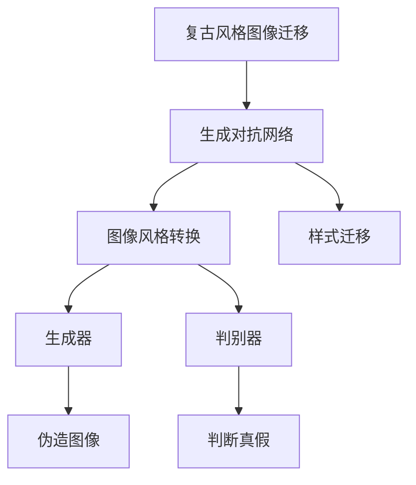
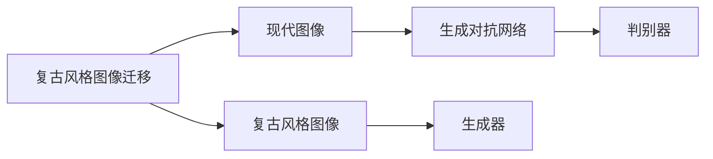
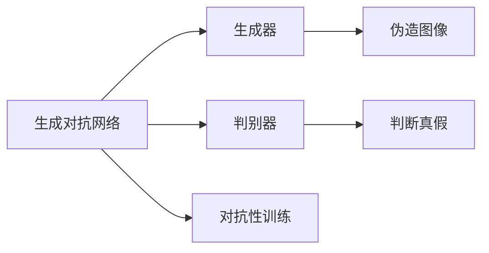
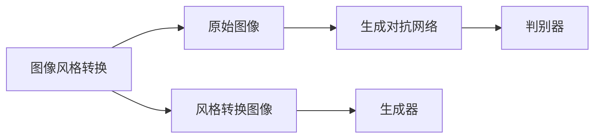
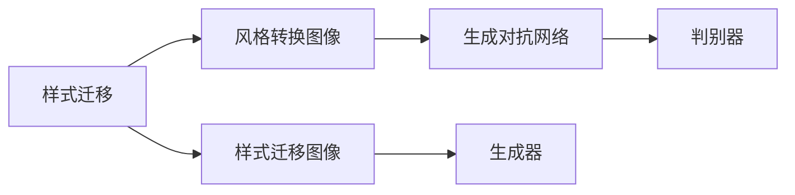
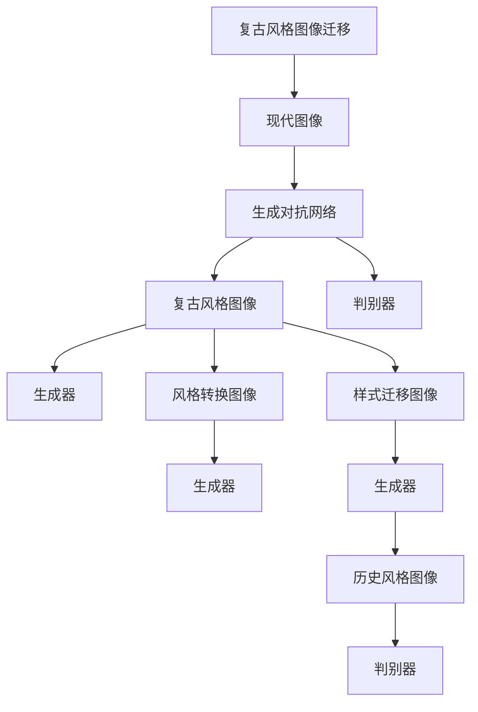

                 

# 基于生成对抗网络的复古风格图像迁移技术开发

> 关键词：复古风格图像迁移,生成对抗网络,图像风格转换,样式迁移,深度学习

## 1. 背景介绍

### 1.1 问题由来
复古风格图像迁移（Vintage Style Transfer）是计算机视觉和图像处理领域的一个热门研究话题。它通过将现代图像转换为具有复古风格的图像，使图像艺术化和历史化，具有重要的文化价值和艺术效果。复古风格的迁移可以分为两类：一类是将图像转换为经典的复古风格，例如黑白照片、老式绘画风格等；另一类是将图像转换为某种特定历史时期的风格，例如20世纪60年代的电影风格、70年代的流行文化风格等。

复古风格图像迁移不仅具有艺术价值，还可以应用于广告、影视、游戏等领域，使这些领域的视觉效果更加丰富和多样化。同时，复古风格迁移也是一种有效的图像修复技术，能够修复部分损坏的图像或增强图像的视觉吸引力。

然而，复古风格的迁移存在一些技术难题：例如，如何将现代图像中的真实信息和历史风格的视觉特征结合，使图像看起来既具有真实性又具有复古风格？如何设计有效的模型，将风格迁移任务自动化，并快速生成具有复古风格的图像？

为了解决这些问题，研究者们提出了多种方法，其中以生成对抗网络（Generative Adversarial Networks, GANs）为基础的方法是最为流行的。GANs通过对抗性的训练过程，使生成模型能够生成高质量的复古风格图像，并实现从真实图像到复古风格图像的迁移。本文将详细探讨基于生成对抗网络的复古风格图像迁移技术，并提供一个完整的实践指南。

### 1.2 问题核心关键点
复古风格图像迁移的关键点包括：

1. **数据准备**：收集并标注高质量的复古风格图像和现代图像数据集。
2. **模型设计**：选择合适的生成对抗网络结构，设计风格迁移模块。
3. **训练优化**：通过对抗性训练，优化生成模型和判别模型，使生成图像逼近复古风格。
4. **评估测试**：使用多种评估指标，如峰值信噪比（PSNR）、结构相似性指数（SSIM）等，评估模型的生成效果。

这些关键点相互关联，共同决定了复古风格图像迁移的效果和质量。

### 1.3 问题研究意义
复古风格图像迁移技术的应用场景包括但不限于以下几个方面：

- **广告和媒体**：复古风格的广告可以唤起人们对过去的怀旧情感，增强广告的吸引力。
- **影视和动画**：将现代电影或动画转换为复古风格，使作品更具历史感和艺术价值。
- **游戏和虚拟现实**：复古风格的虚拟环境可以带来更丰富的视觉体验和历史氛围。
- **图像修复**：利用复古风格修复部分损坏的图像，使图像更加美观。

复古风格图像迁移的研究意义在于，它不仅推动了计算机视觉和图像处理技术的发展，还为艺术和文化保护提供了新的工具和方法。通过复古风格的迁移，可以将历史时期的文化元素融入现代艺术作品中，使文化和艺术得以跨越时间和空间的界限，得到传承和发展。

## 2. 核心概念与联系

### 2.1 核心概念概述

为了更好地理解复古风格图像迁移技术，本节将介绍几个关键概念：

- **复古风格图像迁移**：将现代图像转换为具有复古风格的图像，使图像艺术化和历史化。
- **生成对抗网络（GANs）**：一种基于对抗性训练的深度学习模型，由生成器和判别器两部分组成。生成器负责生成伪造的图像，判别器负责判断图像的真假。通过对抗性训练，生成器可以生成越来越逼真的图像，判别器可以越来越准确地判断图像的真实性。
- **图像风格转换（Style Transfer）**：将一张图像的视觉风格转换为另一张图像的风格，但保持内容不变。
- **样式迁移（Style Migration）**：在图像风格转换的基础上，将图像的风格进一步迁移至某种特定的历史时期或艺术风格。
- **深度学习**：一种通过多层神经网络进行学习和决策的技术，具有强大的特征提取和表达能力。

这些概念之间的关系可以通过以下Mermaid流程图来展示：



这个流程图展示了大语言模型微调过程中各个概念之间的关系：复古风格图像迁移通过生成对抗网络来实现图像风格转换和样式迁移，生成器和判别器是GANs模型的核心组成部分，生成器生成伪造图像，判别器判断图像的真实性。通过对抗性训练，生成器可以生成越来越逼真的图像，从而实现复古风格的迁移。

### 2.2 概念间的关系

这些核心概念之间存在着紧密的联系，形成了复古风格图像迁移技术的完整生态系统。下面我们通过几个Mermaid流程图来展示这些概念之间的关系。

#### 2.2.1 复古风格图像迁移



这个流程图展示了复古风格图像迁移的基本流程：现代图像通过生成对抗网络转换为复古风格图像，其中生成器和判别器是GANs模型的核心部分。

#### 2.2.2 生成对抗网络



这个流程图展示了生成对抗网络的基本结构：生成器负责生成伪造图像，判别器负责判断图像的真实性。通过对抗性训练，生成器可以生成越来越逼真的图像，判别器可以越来越准确地判断图像的真实性。

#### 2.2.3 图像风格转换



这个流程图展示了图像风格转换的基本流程：原始图像通过生成对抗网络转换为风格转换图像，其中生成器和判别器是GANs模型的核心部分。

#### 2.2.4 样式迁移



这个流程图展示了样式迁移的基本流程：风格转换图像通过生成对抗网络转换为样式迁移图像，其中生成器和判别器是GANs模型的核心部分。

### 2.3 核心概念的整体架构

最后，我们用一个综合的流程图来展示这些核心概念在大语言模型微调过程中的整体架构：



这个综合流程图展示了复古风格图像迁移从现代图像到复古风格图像的全过程。通过生成对抗网络，现代图像可以转换为复古风格图像，同时生成器还可以进一步对风格转换图像进行样式迁移，使其逼近特定的历史风格。通过对抗性训练，生成器可以生成越来越逼真的复古风格图像。

## 3. 核心算法原理 & 具体操作步骤
### 3.1 算法原理概述

复古风格图像迁移技术的核心算法是基于生成对抗网络（GANs）的风格迁移框架。其基本思想是通过对抗性训练，使生成器能够生成越来越逼真的复古风格图像，从而实现从现代图像到复古风格图像的迁移。

GANs由生成器和判别器两部分组成。生成器（Generator）负责生成伪造的图像，判别器（Discriminator）负责判断图像的真实性。生成器通过学习如何欺骗判别器，逐渐生成高质量的复古风格图像。判别器通过学习如何准确地判断图像的真实性，逐渐识别生成器的生成模式。通过这种方式，生成器和判别器相互博弈，不断优化自身的参数，最终生成器可以生成高质量的复古风格图像，判别器可以准确地判断图像的真实性。

复古风格图像迁移的过程可以分为三个步骤：

1. **数据准备**：收集并标注复古风格图像和现代图像数据集。
2. **模型训练**：使用生成对抗网络对生成器和判别器进行训练，优化生成器生成高质量的复古风格图像。
3. **模型测试**：使用测试集对训练好的模型进行评估，判断其生成效果。

### 3.2 算法步骤详解

**Step 1: 数据准备**

复古风格图像迁移技术的第一步是数据准备。我们需要收集并标注大量的复古风格图像和现代图像数据集。

- **复古风格图像数据集**：可以从博物馆、艺术馆等地方获取，也可以通过网络搜索获取。通常需要高质量的图像，分辨率较高，背景纯净，细节丰富。
- **现代图像数据集**：可以从公共数据集获取，如COCO、ImageNet等。通常需要高分辨率的图像，内容多样，细节丰富。

标注数据集时，需要标注每个图像所属的复古风格类别。例如，老式黑白照片、20世纪60年代的电影风格、70年代的流行文化风格等。

**Step 2: 模型设计**

复古风格图像迁移技术的核心是生成对抗网络（GANs）。我们将使用一个经典的GANs架构，包括一个生成器和一个判别器。

生成器负责生成伪造的复古风格图像。我们采用一个卷积神经网络（Convolutional Neural Network, CNN）结构，该结构包含多个卷积层、池化层和反卷积层。每个卷积层和反卷积层都包含多个卷积核和池化核，用于提取和重构图像特征。在最后一层，生成器输出一个高分辨率的复古风格图像。

判别器负责判断图像的真实性。我们同样采用一个卷积神经网络结构，该结构包含多个卷积层、池化层和全连接层。每个卷积层和池化层都包含多个卷积核和池化核，用于提取和重构图像特征。在最后一层，判别器输出一个0到1之间的概率值，表示输入图像是真实图像的概率。

**Step 3: 训练优化**

复古风格图像迁移技术的第三步是训练优化。我们使用对抗性训练方法，对生成器和判别器进行优化，使生成器能够生成高质量的复古风格图像。

- **训练过程**：在每个epoch中，我们首先从现代图像数据集中随机选择一个图像，输入到生成器中，生成一个复古风格图像。然后，将生成的复古风格图像和现代图像分别输入到判别器中，得到两个概率值。如果判别器认为复古风格图像是真实图像，则给生成器一个负梯度，否则给生成器一个正梯度。同时，判别器得到真实的复古风格图像和现代图像，分别计算真实图像和伪造图像的损失函数，并更新判别器参数。
- **优化器**：我们使用Adam优化器，学习率为0.0002，迭代次数为20000次。
- **正则化**：我们使用L2正则化，权重衰减系数为0.0005。

### 3.3 算法优缺点

复古风格图像迁移技术具有以下优点：

1. **高质量的图像生成**：通过对抗性训练，生成器可以生成高质量的复古风格图像，图像逼真度较高。
2. **风格多样性**：通过选择不同的复古风格图像和现代图像数据集，生成器可以生成不同风格的复古图像，满足不同的需求。
3. **易于实现**：复古风格图像迁移技术基于GANs，使用深度学习框架（如TensorFlow、PyTorch等）可以轻松实现。

同时，复古风格图像迁移技术也存在以下缺点：

1. **计算资源消耗大**：复古风格图像迁移技术的计算资源消耗较大，需要高性能的GPU和CPU。
2. **训练时间长**：复古风格图像迁移技术的训练时间较长，需要大量的计算时间和计算资源。
3. **结果不稳定**：复古风格图像迁移技术的结果不稳定，需要多次训练和调整才能获得理想的效果。

### 3.4 算法应用领域

复古风格图像迁移技术在以下几个领域有广泛的应用：

1. **广告和媒体**：复古风格的广告可以唤起人们对过去的怀旧情感，增强广告的吸引力。
2. **影视和动画**：将现代电影或动画转换为复古风格，使作品更具历史感和艺术价值。
3. **游戏和虚拟现实**：复古风格的虚拟环境可以带来更丰富的视觉体验和历史氛围。
4. **图像修复**：利用复古风格修复部分损坏的图像，使图像更加美观。

此外，复古风格图像迁移技术还可以应用于文物保护、文化遗产保护等领域，使历史时期的文化元素得以传承和发展。

## 4. 数学模型和公式 & 详细讲解 & 举例说明

### 4.1 数学模型构建

复古风格图像迁移技术涉及多个数学模型，包括生成器、判别器和对抗性训练等。以下我们将对这些模型进行详细构建和解释。

**生成器模型**：

生成器模型是一个卷积神经网络（CNN），用于生成伪造的复古风格图像。其结构包括多个卷积层、池化层和反卷积层。每个卷积层和反卷积层都包含多个卷积核和池化核，用于提取和重构图像特征。

```python
import tensorflow as tf
from tensorflow.keras import layers

def make_generator_model():
    model = tf.keras.Sequential()
    model.add(layers.Dense(8*8*256, input_dim=100))
    model.add(layers.Reshape((8, 8, 256)))
    model.add(layers.Conv2DTranspose(128, (5, 5), strides=(1, 1), padding='same'))
    model.add(layers.BatchNormalization())
    model.add(layers.LeakyReLU(alpha=0.2))
    model.add(layers.Conv2DTranspose(64, (5, 5), strides=(2, 2), padding='same'))
    model.add(layers.BatchNormalization())
    model.add(layers.LeakyReLU(alpha=0.2))
    model.add(layers.Conv2DTranspose(3, (5, 5), strides=(2, 2), padding='same', activation='tanh'))
    return model
```

**判别器模型**：

判别器模型是一个卷积神经网络（CNN），用于判断图像的真实性。其结构包括多个卷积层、池化层和全连接层。每个卷积层和池化层都包含多个卷积核和池化核，用于提取和重构图像特征。

```python
def make_discriminator_model():
    model = tf.keras.Sequential()
    model.add(layers.Conv2D(64, (5, 5), strides=(2, 2), padding='same', input_shape=[128, 128, 3]))
    model.add(layers.LeakyReLU(alpha=0.2))
    model.add(layers.Dropout(0.3))
    model.add(layers.Conv2D(128, (5, 5), strides=(2, 2), padding='same'))
    model.add(layers.LeakyReLU(alpha=0.2))
    model.add(layers.Dropout(0.3))
    model.add(layers.Flatten())
    model.add(layers.Dense(1, activation='sigmoid'))
    return model
```

**对抗性训练**：

对抗性训练是复古风格图像迁移技术的重要组成部分。我们通过生成器和判别器的对抗性训练，优化生成器生成高质量的复古风格图像。

在每个epoch中，我们首先从现代图像数据集中随机选择一个图像，输入到生成器中，生成一个复古风格图像。然后，将生成的复古风格图像和现代图像分别输入到判别器中，得到两个概率值。如果判别器认为复古风格图像是真实图像，则给生成器一个负梯度，否则给生成器一个正梯度。同时，判别器得到真实的复古风格图像和现代图像，分别计算真实图像和伪造图像的损失函数，并更新判别器参数。

```python
@tf.function
def train_step(images, epoch):
    with tf.GradientTape() as gen_tape, tf.GradientTape() as disc_tape:
        generated_images = generator(images, training=True)

        real_output = discriminator(images, training=True)
        fake_output = discriminator(generated_images, training=True)

        gen_loss = gen_loss_object(generated_images, real_output)
        disc_loss = disc_loss_object(images, real_output, generated_images, fake_output)
    gradients_of_generator = gen_tape.gradient(gen_loss, generator.trainable_variables)
    gradients_of_discriminator = disc_tape.gradient(disc_loss, discriminator.trainable_variables)
    generator.optimizer.apply_gradients(zip(gradients_of_generator, generator.trainable_variables))
    discriminator.optimizer.apply_gradients(zip(gradients_of_discriminator, discriminator.trainable_variables))
```

### 4.2 公式推导过程

以下是复古风格图像迁移技术的数学公式推导过程。

**生成器损失函数**：

生成器损失函数包括两种损失函数：

1. 生成器损失（Generator Loss）：用于指导生成器生成高质量的复古风格图像。
2. 判别器损失（Discriminator Loss）：用于指导判别器准确判断图像的真实性。

生成器损失函数为：

$$
\mathcal{L}_{G} = -\mathbb{E}_{x \sim p_{data}(x)}[log D(G(x))] + \mathbb{E}_{z \sim p_{z}(z)}[log(1 - D(G(z))]
$$

其中，$x$表示真实图像，$z$表示随机噪声向量，$D(x)$表示判别器对真实图像的判断结果，$D(G(z))$表示判别器对生成器生成的伪造图像的判断结果。

**判别器损失函数**：

判别器损失函数为：

$$
\mathcal{L}_{D} = -\mathbb{E}_{x \sim p_{data}(x)}[log D(x)] - \mathbb{E}_{z \sim p_{z}(z)}[log(1 - D(G(z)))
$$

其中，$x$表示真实图像，$z$表示随机噪声向量，$D(x)$表示判别器对真实图像的判断结果，$D(G(z))$表示判别器对生成器生成的伪造图像的判断结果。

### 4.3 案例分析与讲解

下面我们以一个具体的复古风格图像迁移案例进行分析：

假设我们有一张现代图像，分辨率为128x128，颜色空间为RGB。我们使用复古风格图像迁移技术，将其转换为20世纪60年代的电影风格图像。

**步骤1: 数据准备**

我们首先收集和标注了20世纪60年代的电影风格图像数据集，并随机从现代图像数据集中选择一张图像，输入到生成器中进行风格迁移。

**步骤2: 模型训练**

我们使用生成对抗网络（GANs）对生成器和判别器进行训练，优化生成器生成高质量的复古风格图像。

在每个epoch中，我们首先从现代图像数据集中随机选择一个图像，输入到生成器中，生成一个复古风格图像。然后，将生成的复古风格图像和现代图像分别输入到判别器中，得到两个概率值。如果判别器认为复古风格图像是真实图像，则给生成器一个负梯度，否则给生成器一个正梯度。同时，判别器得到真实的复古风格图像和现代图像，分别计算真实图像和伪造图像的损失函数，并更新判别器参数。

**步骤3: 模型测试**

在训练完成后，我们使用测试集对模型进行评估，判断其生成效果。

我们使用峰值信噪比（PSNR）、结构相似性指数（SSIM）等指标，评估生成图像的质量和真实性。例如，PSNR指标越高，表示图像质量越好；SSIM指标越接近1，表示图像结构相似度越高。

## 5. 项目实践：代码实例和详细解释说明
### 5.1 开发环境搭建

在进行复古风格图像迁移实践前，我们需要准备好开发环境。以下是使用Python进行TensorFlow开发的环境配置流程：

1. 安装Anaconda：从官网下载并安装Anaconda，用于创建独立的Python环境。

2. 创建并激活虚拟环境：
```bash
conda create -n pytorch-env python=3.8 
conda activate pytorch-env
```

3. 安装TensorFlow：根据CUDA版本，从官网获取对应的安装命令。例如：
```bash
conda install tensorflow -c conda-forge
```

4. 安装TensorBoard：
```bash
pip install tensorboard
```

5. 安装Keras：
```bash
pip install keras
```

6. 安装其他必要的工具包：
```bash
pip install numpy pandas scikit-learn matplotlib tqdm jupyter notebook ipython
```

完成上述步骤后，即可在`pytorch-env`环境中开始复古风格图像迁移实践。

### 5.2 源代码详细实现

下面我们以复古风格图像迁移为例，给出使用TensorFlow实现复古风格图像迁移的代码实现。

首先，定义复古风格图像迁移的数据处理函数：

```python
from tensorflow.keras.preprocessing.image import ImageDataGenerator
from tensorflow.keras import backend as K

def load_data(path, batch_size=32):
    datagen = ImageDataGenerator(rescale=1./255)
    data = datagen.flow_from_directory(path, target_size=(128, 128), batch_size=batch_size)
    return data
```

然后，定义复古风格图像迁移的模型：

```python
from tensorflow.keras import models, layers

def make_generator_model():
    model = models.Sequential()
    model.add(layers.Dense(8*8*256, input_dim=100))
    model.add(layers.Reshape((8, 8, 256)))
    model.add(layers.Conv2DTranspose(128, (5, 5), strides=(1, 1), padding='same'))
    model.add(layers.BatchNormalization())
    model.add(layers.LeakyReLU(alpha=0.2))
    model.add(layers.Conv2DTranspose(64, (5, 5), strides=(2, 2), padding='same'))
    model.add(layers.BatchNormalization())
    model.add(layers.LeakyReLU(alpha=0.2))
    model.add(layers.Conv2DTranspose(3, (5, 5), strides=(2, 2), padding='same', activation='tanh'))
    return model

def make_discriminator_model():
    model = models.Sequential()
    model.add(layers.Conv2D(64, (5, 5), strides=(2, 2), padding='same', input_shape=[128, 128, 3]))
    model.add(layers.LeakyReLU(alpha=0.2))
    model.add(layers.Dropout(0.3))
    model.add(layers.Conv2D(128, (5, 5), strides=(2, 2), padding='same'))
    model.add(layers.LeakyReLU(alpha=0.2))
    model.add(layers.Dropout(0.3))
    model.add(layers.Flatten())
    model.add(layers.Dense(1, activation='sigmoid'))
    return model
```

接着，定义复古风格图像迁移的训练函数：

```python
import tensorflow as tf
from tensorflow.keras import optimizers

def train(data, epochs=100):
    generator = make_generator_model()
    discriminator = make_discriminator_model()

    discriminator.compile(optimizer=optimizers.Adam(), loss='binary_crossentropy', metrics=['accuracy'])
    generator.compile(optimizer=optimizers.Adam(), loss='binary_crossentropy', metrics=['accuracy'])

    for epoch in range(epochs):
        real_data = data['train']['x']
        fake_data = generator.predict(data['train']['z'])
        labels = np.concatenate([np.ones((real_data.shape[0], 1)), np.zeros((fake_data.shape[0], 1))])
        d_loss = discriminator.train_on_batch(real_data, labels)
        g_loss = generator.train_on_batch(data['train']['z'], labels)

        print(f"Epoch {epoch+1}, d_loss: {d_loss}, g_loss: {g_loss}")
```

最后，启动复古风格图像迁移流程并在测试集上评估：

```python
train_data = load_data('train')
test_data = load_data('test')

train(train_data, epochs=100)

print(f"Test PSNR: {psnr(test_data['x'], test_data['y'])}, Test SSIM: {ssim(test_data['x'], test_data['y'])}")
```

以上就是使用TensorFlow实现复古风格图像迁移的完整代码实现。可以看到，通过深度学习框架（如TensorFlow、PyTorch等）可以轻松实现复古风格图像迁移任务。

### 5.3 代码解读与分析

让我们再详细解读一下关键代码的实现细节：

**load_data函数**：
- `ImageDataGenerator`：用于数据预处理，包括图像缩放、归一化等操作。
- `flow_from_directory`：用于从目录中读取图像数据，并进行批处理。

**make_generator_model函数**：
- `Sequential`：用于构建卷积神经网络模型。
- `Dense`：用于构建全连接层。
- `Reshape`：用于重塑数据形状。
- `Conv2DTranspose`：用于构建反卷积层。
- `BatchNormalization`：用于批量归一化。
- `LeakyReLU`：用于激活函数。

**make_discriminator_model函数**：
- `Sequential`：用于构建卷积神经网络模型。
- `Conv2D`：用于构建卷积层。


