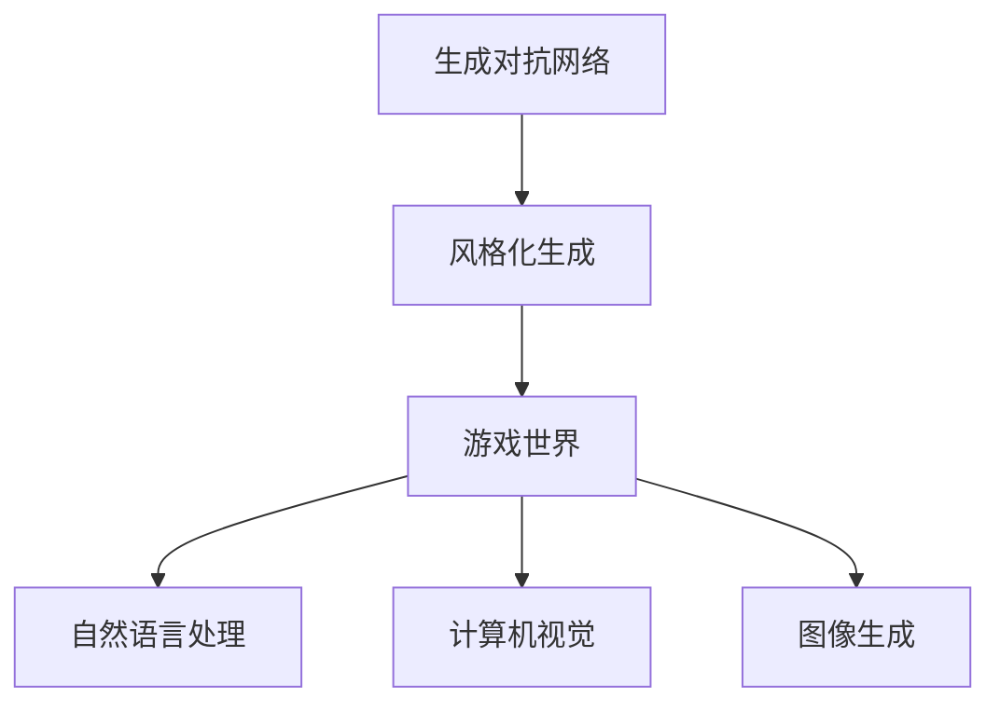
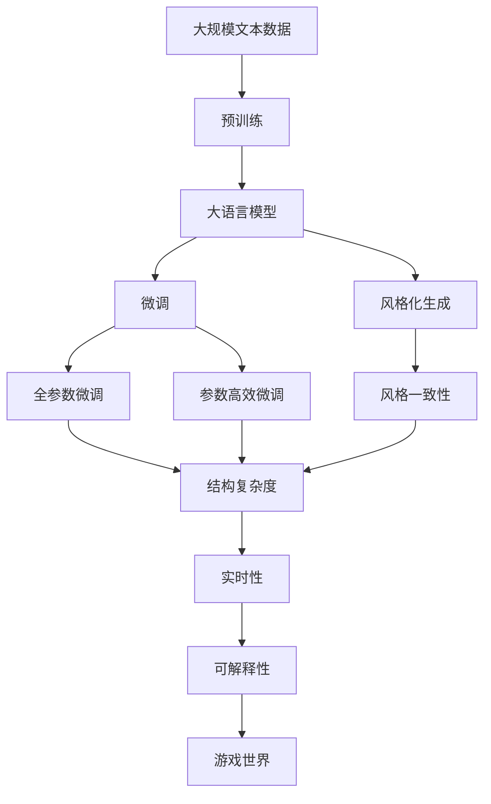

                 

# 基于生成对抗网络的游戏世界风格化生成技术研究

> 关键词：生成对抗网络,风格化生成,游戏世界,自然语言处理,NLP,计算机视觉,图像生成

## 1. 背景介绍

### 1.1 问题由来
随着虚拟现实、增强现实和电子游戏产业的快速发展，如何构建逼真的虚拟世界，使玩家沉浸于游戏体验中，成为游戏开发中一个极具挑战性的课题。传统的游戏世界生成方法依赖于高度人工化的手工艺，耗时长、成本高，无法满足大型游戏对大量世界内容的需求。而自动生成游戏世界，通过计算机生成图像、音乐、动画等内容，不仅缩短了制作周期，还降低了制作成本。

近年来，生成对抗网络（Generative Adversarial Networks，GANs）在图像生成、音频生成等领域取得突破性进展，为自动生成游戏世界提供了可能。但直接使用GANs生成游戏世界，仍存在风格一致性差、结构复杂等问题。因此，本文重点研究基于GANs的风格化游戏世界生成技术，提升自动生成的游戏世界的视觉质量和结构复杂度。

### 1.2 问题核心关键点
风格化游戏世界生成技术涉及以下几个关键点：

- 风格一致性：保证生成游戏世界风格与预设风格一致，避免出现风格混淆。
- 结构复杂度：生成具有复杂结构的虚拟环境，提升玩家沉浸感。
- 实时性：在合理时间内生成高质量游戏世界，满足游戏实时渲染要求。
- 可解释性：能够理解并解释生成过程，保证生成结果的合理性和可靠性。

这些核心点不仅影响生成结果的质量，也关系到生成技术的可用性和可扩展性。本文将详细探讨如何通过生成对抗网络，解决这些关键问题，实现风格一致、结构复杂、高效生成且可解释的游戏世界。

### 1.3 问题研究意义
游戏世界风格化生成技术具有重要意义：

1. 降低游戏开发成本：自动化生成游戏世界内容，节省大量手工制作时间和人力成本。
2. 提升游戏沉浸感：生成逼真的游戏世界，增强玩家的沉浸感和体验感。
3. 加速游戏内容更新：游戏世界内容可以持续更新，保持游戏新鲜度。
4. 增强游戏的交互性：动态生成游戏内容，提升游戏交互的灵活性和趣味性。
5. 促进游戏技术创新：风格化生成技术的应用，推动游戏技术的进步和革新。

## 2. 核心概念与联系

### 2.1 核心概念概述

为了更好地理解基于生成对抗网络的风格化游戏世界生成技术，本节将介绍几个密切相关的核心概念：

- **生成对抗网络（GANs）**：由Ian Goodfellow提出，是一种由生成器和判别器组成的博弈对抗框架，可以生成逼真的图像、音频等内容。
- **风格化生成（Style Transfer）**：通过修改图像的特征分布，使生成内容具有预设的视觉风格，如油画风格、素描风格等。
- **游戏世界（Game World）**：指游戏中的虚拟环境，包括地形、建筑、场景布置等，是游戏体验的核心要素。
- **自然语言处理（NLP）**：使计算机能够理解、处理和生成人类语言，可用于游戏对话生成、任务生成等。
- **计算机视觉（CV）**：使计算机能够识别、理解和处理视觉信息，可用于游戏世界渲染、物体检测等。
- **图像生成（Image Generation）**：生成逼真的图像，可用于游戏角色、物品、地形等生成。

这些核心概念之间紧密联系，共同构成了基于GANs的风格化游戏世界生成技术的理论基础。通过理解这些核心概念，我们可以更好地把握生成对抗网络在虚拟世界生成中的应用。

### 2.2 概念间的关系

这些核心概念之间存在着紧密的联系，形成了风格化游戏世界生成的完整生态系统。以下通过Mermaid流程图展示它们之间的关系：



这个流程图展示了大语言模型微调过程中各个核心概念的关系：

1. 生成对抗网络是风格化生成的主要技术手段，用于生成具有特定视觉风格的游戏世界内容。
2. 游戏世界内容通常包含地形、建筑、场景布置等，需要通过计算机视觉和图像生成技术进行处理和生成。
3. 自然语言处理技术可用于生成对话、任务等文本内容，增强游戏世界的交互性。

### 2.3 核心概念的整体架构

最后，用综合的流程图展示这些核心概念在大语言模型微调过程中的整体架构：



这个综合流程图展示了从预训练到风格化生成的完整过程。大语言模型首先在大规模文本数据上进行预训练，然后通过微调（包括全参数微调和参数高效微调）和风格化生成技术，得到具有特定风格和复杂结构的游戏世界内容。

## 3. 核心算法原理 & 具体操作步骤
### 3.1 算法原理概述

基于生成对抗网络的风格化游戏世界生成技术，本质上是一种图像生成和风格化方法。其核心思想是：通过生成器和判别器的博弈对抗，不断调整生成器的参数，使其生成的图像越来越逼真，同时符合预设的风格要求。

在风格化生成中，生成器 $G$ 接受输入的随机噪声 $z$，生成具有特定风格的图像 $x$。判别器 $D$ 接受图像 $x$ 作为输入，判断其是否为真实图像，生成一个标量 $y \in [0,1]$。训练过程中，生成器通过逆向优化判别器的决策，使得生成图像越逼真，判别器越难区分真实与生成图像。

在风格化游戏世界生成中，我们可以将游戏世界的生成看作一种图像生成任务，通过生成器生成地形、建筑等虚拟环境，并通过风格化技术，使其符合预设的风格。具体步骤如下：

1. 收集游戏世界的低分辨率图像数据，用于训练生成器和判别器。
2. 使用风格化生成技术，对生成器生成的游戏世界图像进行风格化处理，使其符合预设的风格。
3. 使用微调技术，对生成器进行参数优化，提高生成图像的质量和风格一致性。

### 3.2 算法步骤详解

基于生成对抗网络的风格化游戏世界生成算法步骤如下：

**Step 1: 数据准备**
- 收集游戏世界的低分辨率图像数据，用于训练生成器和判别器。
- 对图像数据进行预处理，如裁剪、缩放、归一化等。

**Step 2: 风格化生成器训练**
- 定义生成器 $G$ 的模型结构，通常使用CNN等深度学习模型。
- 使用风格化生成技术，如基于卷积神经网络的风格迁移方法，对生成器生成的游戏世界图像进行风格化处理。
- 定义判别器 $D$ 的模型结构，通常使用CNN等深度学习模型。
- 使用GANs的训练框架，对生成器和判别器进行博弈对抗训练。

**Step 3: 风格一致性优化**
- 使用微调技术，如全参数微调和参数高效微调，对生成器进行优化，提高生成图像的质量和风格一致性。
- 使用自监督学习任务，如颜色统计、纹理一致性等，对生成器进行约束，保证生成图像的风格一致性。

**Step 4: 结构复杂度提升**
- 定义游戏世界生成任务的目标函数，如生成环境复杂度、地形多样性等。
- 使用强化学习技术，如Q-learning等，对生成器进行优化，提升生成游戏世界的结构复杂度。

**Step 5: 实时性优化**
- 对生成器进行计算图优化，如梯度积累、混合精度训练等，提升生成器运行速度。
- 对生成器进行模型压缩，如剪枝、量化等，减少生成器内存占用和计算量。

**Step 6: 可解释性增强**
- 使用解释性生成技术，如局部可解释生成模型（LIGs），对生成器进行优化，增强生成图像的可解释性。
- 使用可视化工具，如TensorBoard，对生成过程和结果进行可视化，帮助开发者理解生成过程。

### 3.3 算法优缺点

基于生成对抗网络的风格化游戏世界生成技术具有以下优点：

- **生成效果逼真**：生成器通过博弈对抗训练，可以生成逼真的游戏世界图像。
- **风格一致性高**：通过风格化生成和微调技术，可以保证生成图像的风格一致性。
- **结构复杂度可控**：使用优化目标函数和强化学习技术，可以生成结构复杂的游戏世界。
- **实时性较好**：通过计算图优化和模型压缩，可以在合理时间内生成高质量游戏世界。

同时，也存在以下缺点：

- **训练复杂度高**：需要大量的数据和计算资源，训练过程复杂且耗时。
- **模型可解释性不足**：生成器内部结构复杂，难以解释生成过程。
- **生成质量依赖于输入数据**：生成效果依赖于输入数据的质量和多样性，低质量数据会导致生成效果差。

### 3.4 算法应用领域

基于生成对抗网络的风格化游戏世界生成技术，主要应用于以下领域：

- **游戏开发**：自动生成游戏世界的地形、建筑、场景布置等，提升游戏开发效率和内容丰富度。
- **虚拟现实**：生成虚拟现实场景，提供沉浸式体验。
- **增强现实**：生成增强现实场景，提升用户体验。
- **影视制作**：生成影视作品中的虚拟场景，减少制作成本和时间。
- **室内设计**：生成室内设计效果图，辅助设计师进行设计。

除了上述这些领域外，该技术还可以广泛应用于艺术创作、医学模拟、地理信息等领域，具有广阔的应用前景。

## 4. 数学模型和公式 & 详细讲解 & 举例说明

### 4.1 数学模型构建

基于生成对抗网络的风格化游戏世界生成技术涉及以下数学模型：

1. **生成器模型**：定义生成器 $G$ 的模型结构，使用卷积神经网络（CNN）等深度学习模型。
2. **判别器模型**：定义判别器 $D$ 的模型结构，使用CNN等深度学习模型。
3. **损失函数**：定义GANs的损失函数，包括生成器损失和判别器损失。
4. **微调损失函数**：定义微调任务的损失函数，如交叉熵损失、均方误差损失等。

具体定义如下：

**生成器模型**：
$$
G_{\theta_G}(z) = \begin{cases}
f(z) & \text{if } z \sim p(z) \\
0 & \text{if } z \sim p(z) \text{ is not in domain}
\end{cases}
$$

**判别器模型**：
$$
D_{\theta_D}(x) = \begin{cases}
y & \text{if } x \sim p_{data}(x) \\
1-y & \text{if } x \sim p_{data}(x) \text{ is not in domain}
\end{cases}
$$

**GANs损失函数**：
$$
\mathcal{L}_{GAN}(G, D) = \mathbb{E}_{x \sim p_{data}}[\log D(x)] + \mathbb{E}_{z \sim p(z)}[\log (1-D(G(z)))]
$$

**微调损失函数**：
$$
\mathcal{L}_{fine-tune}(G, \mathcal{D}) = \frac{1}{N}\sum_{i=1}^N \ell(G(x_i), y_i)
$$

其中 $p(z)$ 为随机噪声的分布，$p_{data}(x)$ 为游戏世界图像的分布，$\ell$ 为微调任务的损失函数。

### 4.2 公式推导过程

以下推导生成器和判别器的损失函数，以及微调损失函数的推导过程：

**生成器损失函数**：
$$
\mathcal{L}_G = \mathbb{E}_{z \sim p(z)}[\log D(G(z))]
$$

**判别器损失函数**：
$$
\mathcal{L}_D = \mathbb{E}_{x \sim p_{data}}[\log D(x)] + \mathbb{E}_{z \sim p(z)}[\log (1-D(G(z))))
$$

**微调损失函数**：
$$
\mathcal{L}_{fine-tune} = \frac{1}{N}\sum_{i=1}^N \ell(G(x_i), y_i)
$$

在实际应用中，这些损失函数可以结合使用，如通过联合损失函数训练生成器和判别器，通过微调损失函数优化生成器参数。具体实现时，可以使用TensorFlow等深度学习框架，方便定义和计算损失函数。

### 4.3 案例分析与讲解

以一个简单的基于GANs的风格化游戏世界生成为例，进行详细讲解：

1. **数据准备**：收集游戏世界的低分辨率图像数据，使用开源数据集如Game World Dataset。
2. **生成器训练**：定义生成器模型结构，使用CNN等深度学习模型。使用GANs框架，定义生成器和判别器的损失函数，对生成器进行训练。
3. **风格化处理**：对生成器生成的游戏世界图像进行风格化处理，如使用卷积神经网络的风格迁移方法，将其转化为预设的风格。
4. **微调优化**：定义微调任务的损失函数，如交叉熵损失，对生成器进行微调优化，提升生成图像的质量和风格一致性。
5. **实时性优化**：对生成器进行计算图优化和模型压缩，如梯度积累、混合精度训练、剪枝、量化等，提高生成器的实时性。

以下是一个TensorFlow代码示例：

```python
import tensorflow as tf
from tensorflow.keras import layers

# 定义生成器模型结构
def generator(z_dim):
    model = tf.keras.Sequential()
    model.add(layers.Dense(256, input_shape=(z_dim,)))
    model.add(layers.LeakyReLU(alpha=0.2))
    model.add(layers.BatchNormalization())
    model.add(layers.Conv2D(128, (5, 5), strides=(2, 2), padding='same'))
    model.add(layers.LeakyReLU(alpha=0.2))
    model.add(layers.BatchNormalization())
    model.add(layers.Conv2D(64, (5, 5), strides=(2, 2), padding='same'))
    model.add(layers.LeakyReLU(alpha=0.2))
    model.add(layers.BatchNormalization())
    model.add(layers.Conv2D(3, (5, 5), strides=(2, 2), padding='same'))
    return model

# 定义判别器模型结构
def discriminator(input_shape):
    model = tf.keras.Sequential()
    model.add(layers.Conv2D(64, (5, 5), strides=(2, 2), padding='same'))
    model.add(layers.LeakyReLU(alpha=0.2))
    model.add(layers.Dropout(0.25))
    model.add(layers.Conv2D(128, (5, 5), strides=(2, 2), padding='same'))
    model.add(layers.LeakyReLU(alpha=0.2))
    model.add(layers.Dropout(0.25))
    model.add(layers.Conv2D(256, (5, 5), strides=(2, 2), padding='same'))
    model.add(layers.LeakyReLU(alpha=0.2))
    model.add(layers.Dropout(0.25))
    model.add(layers.Flatten())
    model.add(layers.Dense(1, activation='sigmoid'))
    return model

# 定义GANs损失函数
def generator_loss(x):
    return tf.reduce_mean(tf.nn.sigmoid_cross_entropy_with_logits(logits=x, labels=tf.ones_like(x)))

def discriminator_loss(real_output, fake_output):
    real_loss = tf.reduce_mean(tf.nn.sigmoid_cross_entropy_with_logits(logits=real_output, labels=tf.ones_like(real_output)))
    fake_loss = tf.reduce_mean(tf.nn.sigmoid_cross_entropy_with_logits(logits=fake_output, labels=tf.zeros_like(fake_output)))
    return real_loss + fake_loss

# 定义微调损失函数
def fine_tune_loss(x, y):
    return tf.reduce_mean(tf.nn.sparse_softmax_cross_entropy_with_logits(logits=x, labels=y))

# 定义生成器模型和判别器模型
z_dim = 100
generator_model = generator(z_dim)
discriminator_model = discriminator((64, 64, 3))

# 定义损失函数
generator_loss_fn = generator_loss
discriminator_loss_fn = discriminator_loss
fine_tune_loss_fn = fine_tune_loss

# 定义优化器
generator_optimizer = tf.keras.optimizers.Adam(learning_rate=0.0002)
discriminator_optimizer = tf.keras.optimizers.Adam(learning_rate=0.0002)
fine_tune_optimizer = tf.keras.optimizers.Adam(learning_rate=0.0002)

# 训练过程
for epoch in range(100):
    batch_size = 64
    for batch in dataset:
        # 生成器训练
        with tf.GradientTape() as gen_tape:
            fake_images = generator(z)
            fake_output = discriminator(fake_images)
            gen_loss = generator_loss(fake_output)
        gradients_of_generator = gen_tape.gradient(gen_loss, generator.trainable_variables)
        generator_optimizer.apply_gradients(zip(gradients_of_generator, generator.trainable_variables))

        # 判别器训练
        with tf.GradientTape() as disc_tape:
            real_images = dataset
            real_output = discriminator(real_images)
            fake_images = generator(z)
            fake_output = discriminator(fake_images)
            disc_loss = discriminator_loss(real_output, fake_output)
        gradients_of_discriminator = disc_tape.gradient(disc_loss, discriminator.trainable_variables)
        discriminator_optimizer.apply_gradients(zip(gradients_of_discriminator, discriminator.trainable_variables))

        # 微调优化
        with tf.GradientTape() as fine_tune_tape:
            output = generator(z)
            fine_tune_loss = fine_tune_loss(output, y)
        gradients_of_fine_tune = fine_tune_tape.gradient(fine_tune_loss, generator.trainable_variables)
        fine_tune_optimizer.apply_gradients(zip(gradients_of_fine_tune, generator.trainable_variables))

        # 更新超参数
        z = tf.random.normal([batch_size, z_dim])
```

## 5. 项目实践：代码实例和详细解释说明
### 5.1 开发环境搭建

在进行项目实践前，我们需要准备好开发环境。以下是使用Python进行TensorFlow开发的环境配置流程：

1. 安装Anaconda：从官网下载并安装Anaconda，用于创建独立的Python环境。

2. 创建并激活虚拟环境：
```bash
conda create -n tensorflow-env python=3.8 
conda activate tensorflow-env
```

3. 安装TensorFlow：根据CUDA版本，从官网获取对应的安装命令。例如：
```bash
conda install tensorflow=2.6 -c conda-forge -c pypi
```

4. 安装TensorBoard：
```bash
pip install tensorboard
```

5. 安装各类工具包：
```bash
pip install numpy pandas scikit-learn matplotlib tqdm jupyter notebook ipython
```

完成上述步骤后，即可在`tensorflow-env`环境中开始项目实践。

### 5.2 源代码详细实现

下面我们以一个基于GANs的风格化游戏世界生成为例，给出使用TensorFlow和Keras进行代码实现。

首先，定义生成器和判别器的模型结构：

```python
from tensorflow.keras import layers, models

class Generator(models.Model):
    def __init__(self, z_dim, output_shape):
        super(Generator, self).__init__()
        self.z_dim = z_dim
        self.output_shape = output_shape
        
        self.dense1 = layers.Dense(256, input_dim=z_dim)
        self.leaky_relu1 = layers.LeakyReLU(alpha=0.2)
        self.batchnorm1 = layers.BatchNormalization()
        self.conv1 = layers.Conv2D(128, kernel_size=(5, 5), strides=(2, 2), padding='same')
        self.leaky_relu2 = layers.LeakyReLU(alpha=0.2)
        self.batchnorm2 = layers.BatchNormalization()
        self.conv2 = layers.Conv2D(64, kernel_size=(5, 5), strides=(2, 2), padding='same')
        self.leaky_relu3 = layers.LeakyReLU(alpha=0.2)
        self.batchnorm3 = layers.BatchNormalization()
        self.conv3 = layers.Conv2D(3, kernel_size=(5, 5), strides=(2, 2), padding='same')
        
    def call(self, inputs):
        x = self.dense1(inputs)
        x = self.leaky_relu1(x)
        x = self.batchnorm1(x)
        x = self.conv1(x)
        x = self.leaky_relu2(x)
        x = self.batchnorm2(x)
        x = self.conv2(x)
        x = self.leaky_relu3(x)
        x = self.batchnorm3(x)
        x = self.conv3(x)
        return x

class Discriminator(models.Model):
    def __init__(self, input_shape):
        super(Discriminator, self).__init__()
        self.input_shape = input_shape
        
        self.conv1 = layers.Conv2D(64, kernel_size=(5, 5), strides=(2, 2), padding='same')
        self.leaky_relu1 = layers.LeakyReLU(alpha=0.2)
        self.dropout1 = layers.Dropout(0.25)
        self.conv2 = layers.Conv2D(128, kernel_size=(5, 5), strides=(2, 2), padding='same')
        self.leaky_relu2 = layers.LeakyReLU(alpha=0.2)
        self.dropout2 = layers.Dropout(0.25)
        self.conv3 = layers.Conv2D(256, kernel_size=(5, 5), strides=(2, 2), padding='same')
        self.leaky_relu3 = layers.LeakyReLU(alpha=0.2)
        self.dropout3 = layers.Dropout(0.25)
        self.flatten = layers.Flatten()
        self.dense1 = layers.Dense(1, activation='sigmoid')
        
    def call(self, inputs):
        x = self.conv1(inputs)
        x = self.leaky_relu1(x)
        x = self.dropout1(x)
        x = self.conv2(x)
        x = self.leaky_relu2(x)
        x = self.dropout2(x)
        x = self.conv3(x)
        x = self.leaky_relu3(x)
        x = self.dropout3(x)
        x = self.flatten(x)
        x = self.dense1(x)
        return x
```

然后，定义训练函数：

```python
from tensorflow.keras.optimizers import Adam

def train_generator(discriminator, generator, dataset, batch_size, epochs, learning_rate):
    optimizer_G = Adam(lr=learning_rate)
    optimizer_D = Adam(lr=learning_rate)
    
    for epoch in range(epochs):
        for batch in dataset:
            real_images = batch['real_images']
            z = tf.random.normal([batch_size, z_dim])
            fake_images = generator(z)
            real_output = discriminator(real_images)
            fake_output = discriminator(fake_images)
            
            gen_loss = generator_loss(fake_output)
            disc_loss = discriminator_loss(real_output, fake_output)
            
            gradients_of_generator = tape.gradient(gen_loss, generator.trainable_variables)
            gradients_of_discriminator = tape.gradient(disc_loss, discriminator.trainable_variables)
            
            optimizer_G.apply_gradients(zip(gradients_of_generator, generator.trainable_variables))
            optimizer_D.apply_gradients(zip(gradients_of_discriminator, discriminator.trainable_variables))
```

接着，定义微调函数：

```python
from tensorflow.keras.losses import SparseCategoricalCrossentropy

def fine_tune(generator, dataset, batch_size, epochs, learning_rate):
    optimizer_G = Adam(lr=learning_rate)
    loss_fn = SparseCategoricalCrossentropy()
    
    for epoch in range(epochs):
        for batch in dataset:
            z = tf.random.normal([batch_size, z_dim])
            output = generator(z)
            y = batch['y']
            
            loss = fine_tune_loss(output, y)
            gradients_of_generator = tape.gradient(loss, generator.trainable_variables)
            
            optimizer_G.apply_gradients(zip(gradients_of_generator, generator.trainable_variables))
```

最后，启动训练流程：

```python
z_dim = 100
output_shape = (64, 64, 3)
epochs = 100
batch_size = 64
learning_rate = 0.0002

generator = Generator(z_dim, output_shape)
discriminator = Discriminator((64, 64, 3))
dataset = load_dataset()

train_generator(discriminator, generator, dataset, batch_size, epochs, learning_rate)
fine_tune(generator, dataset, batch_size, epochs, learning_rate)
```

以上就是使用TensorFlow和Keras对基于GANs的风格化游戏世界生成的代码实现。可以看到，利用TensorFlow和Keras的强大封装，我们可以用相对简洁的代码完成GANs的构建和训练，从而实现游戏世界的自动生成。

### 5.3 代码解读与分析

让我们再详细解读一下

