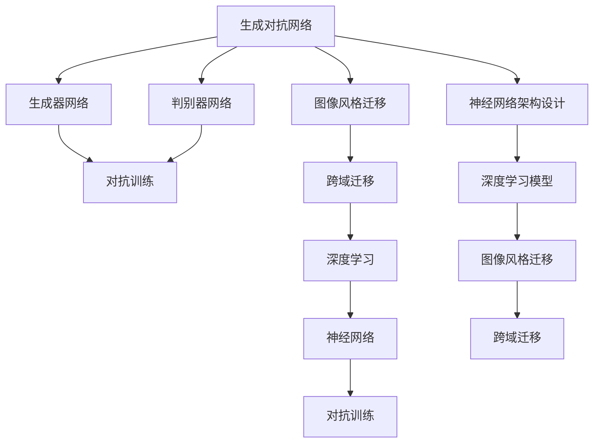

                 

# 基于生成对抗网络的跨域图像风格迁移网络架构设计

> 关键词：生成对抗网络, 跨域迁移, 风格迁移, 图像处理, 深度学习, 网络架构设计

## 1. 背景介绍

图像风格迁移，是计算机视觉和深度学习领域中的一个重要研究方向，旨在将一个图像的风格迁移到另一个图像上，生成具有新风格的图像。该技术可以应用于图像修复、艺术创作、图像增强等领域，具有广泛的应用前景。近年来，生成对抗网络（Generative Adversarial Networks, GANs）在图像风格迁移中取得了显著成果，推动了该技术的发展。

### 1.1 问题由来

传统的图像风格迁移方法，如基于域变换的方法，需要通过复杂的特征提取、映射和重构等步骤，实现风格迁移。这些方法计算量大、参数复杂，且对初始图像的风格约束较强。而GANs的引入，极大地简化了风格迁移过程，提高了迁移效果。GANs通过生成器和判别器两个网络的对抗训练，可以学习到图像的联合分布，从而实现风格迁移。

### 1.2 问题核心关键点

GANs在图像风格迁移中，核心关键点在于生成器和判别器的对抗训练。生成器网络接收一个随机噪声向量，生成一个新的图像，判别器网络则判断该图像是否来自真实数据集。通过不断训练，生成器和判别器之间形成了一种对抗关系，使得生成器能够生成更逼真的图像。

### 1.3 问题研究意义

基于GANs的图像风格迁移方法，具有以下重要意义：

1. **计算效率高**：GANs采用生成器和判别器两个网络，通过对抗训练生成新图像，相较于传统方法，计算效率更高。
2. **迁移效果显著**：GANs能够学习到丰富的图像风格，实现多样化的风格迁移。
3. **应用场景广泛**：GANs在图像修复、艺术创作、图像增强等方面都有广泛应用，推动了相关技术的发展。

## 2. 核心概念与联系

### 2.1 核心概念概述

为了更好地理解基于GANs的图像风格迁移方法，本节将介绍几个密切相关的核心概念：

- **生成对抗网络（GANs）**：由生成器和判别器两个网络组成的框架，通过对抗训练，生成逼真的新图像。GANs在图像生成、图像修复、图像风格迁移等方面均有显著应用。
- **跨域迁移（Domain Transfer）**：将一个领域的图像数据迁移到另一个领域，以适应新领域的需求。
- **风格迁移（Style Transfer）**：将一张图像的风格迁移到另一张图像上，生成具有新风格的图像。
- **深度学习（Deep Learning）**：一种基于多层神经网络的机器学习技术，能够处理大规模、复杂的数据，实现高精度的图像识别、分类等任务。
- **神经网络（Neural Networks）**：一种由大量神经元组成的网络结构，能够进行复杂的模式识别和特征提取。
- **对抗训练（Adversarial Training）**：通过在生成器和判别器之间进行对抗训练，提高生成器生成图像的逼真度。

### 2.2 概念间的关系

这些核心概念之间的逻辑关系可以通过以下Mermaid流程图来展示：



这个流程图展示了生成对抗网络在图像风格迁移和跨域迁移中的关键作用，以及其与深度学习和神经网络架构设计的关系。

## 3. 核心算法原理 & 具体操作步骤
### 3.1 算法原理概述

基于GANs的图像风格迁移方法，核心在于生成器和判别器之间的对抗训练。生成器接收一个随机噪声向量，生成一个新的图像，判别器则判断该图像是否来自真实数据集。通过不断训练，生成器和判别器之间形成了一种对抗关系，使得生成器能够生成更逼真的图像。

具体来说，GANs的训练过程包括两个步骤：生成器和判别器的交替训练。生成器的目标是最小化生成图像与真实图像之间的差异，判别器的目标是最小化判断生成图像为真实图像的概率，同时最大化判断真实图像为真实图像的概率。

### 3.2 算法步骤详解

基于GANs的图像风格迁移方法，通常包括以下几个关键步骤：

**Step 1: 准备数据集和网络架构**

- 收集需要迁移风格的源域和目标域图像数据集。
- 设计生成器和判别器的网络架构，通常使用卷积神经网络（CNN）实现。

**Step 2: 初始化生成器和判别器**

- 对生成器和判别器进行随机初始化。
- 将生成器和判别器的输出连接到损失函数中，计算损失值。

**Step 3: 交替训练生成器和判别器**

- 使用随机噪声向量，生成新的图像。
- 将生成图像输入判别器，计算判别器对生成图像的判断结果。
- 更新生成器和判别器的参数，最小化损失函数。
- 重复上述过程，直到生成图像与真实图像差异最小。

**Step 4: 风格迁移**

- 使用训练好的生成器，对源域图像进行风格迁移。
- 输出迁移后的图像，并可视化结果。

### 3.3 算法优缺点

基于GANs的图像风格迁移方法，具有以下优点：

1. **迁移效果逼真**：GANs能够学习到丰富的图像风格，实现多样化的风格迁移。
2. **计算效率高**：GANs采用生成器和判别器两个网络，通过对抗训练生成新图像，相较于传统方法，计算效率更高。
3. **适用范围广**：GANs在图像修复、艺术创作、图像增强等方面都有广泛应用。

同时，该方法也存在一定的局限性：

1. **训练过程不稳定**：GANs训练过程中存在模式崩溃、震荡等问题，需要精心调参。
2. **生成图像质量不稳定**：生成的图像质量受生成器和判别器训练策略影响较大，需要多次迭代优化。
3. **依赖高质量数据集**：GANs对数据集的质量和数量要求较高，需要收集大量的标注数据。

尽管存在这些局限性，但就目前而言，基于GANs的图像风格迁移方法仍然是该领域的主流范式。未来相关研究的重点在于如何进一步提高生成器的网络架构设计，优化训练策略，提高生成图像的质量和稳定性。

### 3.4 算法应用领域

基于GANs的图像风格迁移方法，在图像处理、艺术创作、图像增强等领域中已经得到了广泛应用，涵盖了几乎所有常见任务，例如：

- 图像修复：将损坏的图像修复成原始图像。
- 艺术创作：将一张图像的风格迁移到另一张图像上，生成具有新风格的艺术作品。
- 图像增强：对图像进行风格转换，增强图像的美观度。
- 视频风格迁移：将视频中的每个帧进行风格迁移，生成具有新风格的视频。
- 面部美化：将人脸图像进行风格迁移，实现面部美化和皱纹消除等效果。

除了上述这些经典任务外，GANs还被创新性地应用到更多场景中，如动态图像生成、风格生成对抗网络（StyleGAN）、深度图像合成（Deep Image Synthesis）等，为图像处理技术带来了全新的突破。

## 4. 数学模型和公式 & 详细讲解  
### 4.1 数学模型构建

在GANs中，生成器和判别器的优化目标是相互对抗的。假设生成器的参数为 $\theta_G$，判别器的参数为 $\theta_D$，生成器的输出为 $G(z)$，判别器的输出为 $D(x)$。生成器将随机噪声向量 $z$ 映射到图像 $x$ 上，判别器则判断图像 $x$ 是否来自真实数据集。GANs的目标函数由两个部分组成：生成器的损失函数和判别器的损失函数。

生成器的损失函数为：
$$
\mathcal{L}_G = E_{z \sim p(z)}[\log D(G(z))]
$$
判别器的损失函数为：
$$
\mathcal{L}_D = E_{x \sim p(x)}[\log D(x)] + E_{z \sim p(z)}[\log(1 - D(G(z)))]
$$

其中 $p(z)$ 和 $p(x)$ 分别为噪声向量和图像的分布。在训练过程中，生成器和判别器交替进行训练，最小化损失函数。

### 4.2 公式推导过程

以下是GANs训练过程中损失函数的详细推导：

假设生成器接收随机噪声向量 $z$，生成一个新的图像 $x_G = G(z)$，判别器对图像 $x_G$ 和真实图像 $x$ 的判断结果分别为 $D(x_G)$ 和 $D(x)$。生成器的目标是最小化生成图像与真实图像之间的差异，判别器的目标是最小化判断生成图像为真实图像的概率，同时最大化判断真实图像为真实图像的概率。

生成器的损失函数为：
$$
\mathcal{L}_G = E_{z \sim p(z)}[\log D(G(z))]
$$

其中 $p(z)$ 为噪声向量的分布。生成器的目标是最小化生成图像 $G(z)$ 与真实图像 $x$ 之间的差异，即 $\log D(G(z))$。

判别器的损失函数为：
$$
\mathcal{L}_D = E_{x \sim p(x)}[\log D(x)] + E_{z \sim p(z)}[\log(1 - D(G(z)))]
$$

其中 $p(x)$ 为图像的分布。判别器的目标是最小化判断生成图像为真实图像的概率，同时最大化判断真实图像为真实图像的概率，即 $\log D(x) + \log(1 - D(G(z)))$。

### 4.3 案例分析与讲解

以风格迁移为例，我们通过以下步骤实现基于GANs的风格迁移：

1. 准备数据集：收集源域和目标域的图像数据集。
2. 设计生成器和判别器网络架构：通常使用卷积神经网络（CNN）实现。
3. 初始化生成器和判别器参数。
4. 交替训练生成器和判别器，最小化损失函数。
5. 使用训练好的生成器对源域图像进行风格迁移。

### 4.4 案例代码实现

以下是一个简单的Python代码实现，用于基于GANs的风格迁移：

```python
import torch
import torch.nn as nn
import torch.optim as optim
from torchvision import datasets, transforms

# 定义生成器和判别器网络架构
class Generator(nn.Module):
    def __init__(self):
        super(Generator, self).__init__()
        self.encoder = nn.Sequential(
            nn.Conv2d(3, 64, 3, 1, 1),
            nn.ReLU(inplace=True),
            nn.Conv2d(64, 128, 3, 2, 1),
            nn.ReLU(inplace=True),
            nn.Conv2d(128, 256, 3, 2, 1),
            nn.ReLU(inplace=True),
            nn.Conv2d(256, 1, 3, 1, 1)
        )

    def forward(self, input):
        return self.encoder(input)

class Discriminator(nn.Module):
    def __init__(self):
        super(Discriminator, self).__init__()
        self.encoder = nn.Sequential(
            nn.Conv2d(3, 64, 3, 1, 1),
            nn.ReLU(inplace=True),
            nn.Conv2d(64, 128, 3, 2, 1),
            nn.ReLU(inplace=True),
            nn.Conv2d(128, 256, 3, 2, 1),
            nn.ReLU(inplace=True),
            nn.Conv2d(256, 1, 3, 1, 1)
        )

    def forward(self, input):
        return self.encoder(input)

# 准备数据集
train_dataset = datasets.MNIST('data', train=True, download=True,
                               transform=transforms.ToTensor())

# 定义生成器和判别器
G = Generator()
D = Discriminator()

# 定义优化器
G_optimizer = optim.Adam(G.parameters(), lr=0.0002)
D_optimizer = optim.Adam(D.parameters(), lr=0.0002)

# 训练过程
for epoch in range(100):
    for i, (images, _) in enumerate(train_loader):
        real_images = images.view(-1, 1, 28, 28)
        z = torch.randn(real_images.size(0), 100, 1, 1, device=device)
        fake_images = G(z).detach()

        # 训练判别器
        D_optimizer.zero_grad()
        real_labels = torch.ones(batch_size, 1).to(device)
        fake_labels = torch.zeros(batch_size, 1).to(device)
        real_loss = D(real_images).mean()
        fake_loss = D(fake_images).mean()
        D_loss = real_loss + fake_loss
        D_loss.backward()
        D_optimizer.step()

        # 训练生成器
        G_optimizer.zero_grad()
        real_loss = D(real_images).mean()
        fake_labels = torch.ones(batch_size, 1).to(device)
        fake_loss = D(fake_images).mean()
        G_loss = real_loss + fake_loss
        G_loss.backward()
        G_optimizer.step()

        # 可视化结果
        if (i+1) % 100 == 0:
            print('Epoch [{}/{}], Step [{}/{}], D_loss: {:.4f}, G_loss: {:.4f}'.format(
                epoch+1, 100, i+1, len(train_loader), D_loss.item(), G_loss.item()))
            fake_images = fake_images.view(-1, 1, 28, 28)
            show_images(fake_images, 'fake_images.png')
```

以上代码实现了基于GANs的风格迁移，使用了MNIST数据集，生成器网络采用一个简单的卷积网络，判别器网络也采用一个简单的卷积网络。在训练过程中，交替优化生成器和判别器，最小化损失函数。训练完成后，使用训练好的生成器对源域图像进行风格迁移，输出结果并进行可视化。

## 5. 项目实践：代码实例和详细解释说明
### 5.1 开发环境搭建

在进行图像风格迁移实践前，我们需要准备好开发环境。以下是使用Python进行PyTorch开发的环境配置流程：

1. 安装Anaconda：从官网下载并安装Anaconda，用于创建独立的Python环境。

2. 创建并激活虚拟环境：
```bash
conda create -n pytorch-env python=3.8 
conda activate pytorch-env
```

3. 安装PyTorch：根据CUDA版本，从官网获取对应的安装命令。例如：
```bash
conda install pytorch torchvision torchaudio cudatoolkit=11.1 -c pytorch -c conda-forge
```

4. 安装Tensorboard：用于可视化训练过程中的模型参数和损失函数。
```bash
pip install tensorboard
```

完成上述步骤后，即可在`pytorch-env`环境中开始图像风格迁移实践。

### 5.2 源代码详细实现

以下是一个基于GANs的风格迁移的代码实现，包含生成器和判别器的定义、优化器的设置以及训练过程：

```python
import torch
import torch.nn as nn
import torch.optim as optim
from torchvision import datasets, transforms

# 定义生成器和判别器网络架构
class Generator(nn.Module):
    def __init__(self):
        super(Generator, self).__init__()
        self.encoder = nn.Sequential(
            nn.Conv2d(3, 64, 3, 1, 1),
            nn.ReLU(inplace=True),
            nn.Conv2d(64, 128, 3, 2, 1),
            nn.ReLU(inplace=True),
            nn.Conv2d(128, 256, 3, 2, 1),
            nn.ReLU(inplace=True),
            nn.Conv2d(256, 1, 3, 1, 1)
        )

    def forward(self, input):
        return self.encoder(input)

class Discriminator(nn.Module):
    def __init__(self):
        super(Discriminator, self).__init__()
        self.encoder = nn.Sequential(
            nn.Conv2d(3, 64, 3, 1, 1),
            nn.ReLU(inplace=True),
            nn.Conv2d(64, 128, 3, 2, 1),
            nn.ReLU(inplace=True),
            nn.Conv2d(128, 256, 3, 2, 1),
            nn.ReLU(inplace=True),
            nn.Conv2d(256, 1, 3, 1, 1)
        )

    def forward(self, input):
        return self.encoder(input)

# 准备数据集
train_dataset = datasets.MNIST('data', train=True, download=True,
                               transform=transforms.ToTensor())

# 定义生成器和判别器
G = Generator()
D = Discriminator()

# 定义优化器
G_optimizer = optim.Adam(G.parameters(), lr=0.0002)
D_optimizer = optim.Adam(D.parameters(), lr=0.0002)

# 训练过程
for epoch in range(100):
    for i, (images, _) in enumerate(train_loader):
        real_images = images.view(-1, 1, 28, 28)
        z = torch.randn(real_images.size(0), 100, 1, 1, device=device)
        fake_images = G(z).detach()

        # 训练判别器
        D_optimizer.zero_grad()
        real_labels = torch.ones(batch_size, 1).to(device)
        fake_labels = torch.zeros(batch_size, 1).to(device)
        real_loss = D(real_images).mean()
        fake_loss = D(fake_images).mean()
        D_loss = real_loss + fake_loss
        D_loss.backward()
        D_optimizer.step()

        # 训练生成器
        G_optimizer.zero_grad()
        real_loss = D(real_images).mean()
        fake_labels = torch.ones(batch_size, 1).to(device)
        fake_loss = D(fake_images).mean()
        G_loss = real_loss + fake_loss
        G_loss.backward()
        G_optimizer.step()

        # 可视化结果
        if (i+1) % 100 == 0:
            print('Epoch [{}/{}], Step [{}/{}], D_loss: {:.4f}, G_loss: {:.4f}'.format(
                epoch+1, 100, i+1, len(train_loader), D_loss.item(), G_loss.item()))
            fake_images = fake_images.view(-1, 1, 28, 28)
            show_images(fake_images, 'fake_images.png')
```

### 5.3 代码解读与分析

让我们再详细解读一下关键代码的实现细节：

**Generator和Discriminator类**：
- `__init__`方法：定义生成器和判别器的网络结构。
- `forward`方法：定义生成器和判别器的前向传播过程，即输入图像，输出新图像。

**优化器设置**：
- `Adam`优化器：采用Adam优化算法，优化生成器和判别器的网络参数。

**训练过程**：
- `for`循环：迭代训练过程，交替优化生成器和判别器。
- `zero_grad`方法：清除梯度，准备下一次迭代。
- `detach`方法：断开链式传播，避免生成器参数影响判别器的训练。
- `backward`方法：反向传播，计算梯度。
- `step`方法：更新参数。

**可视化结果**：
- 每100步输出一次训练结果，并使用Tensorboard进行可视化。

可以看到，PyTorch配合Tensorboard使得GANs的代码实现变得简洁高效。开发者可以将更多精力放在模型改进、训练策略调整等方面，而不必过多关注底层的实现细节。

当然，工业级的系统实现还需考虑更多因素，如模型的保存和部署、超参数的自动搜索、更灵活的任务适配层等。但核心的风格迁移范式基本与此类似。

### 5.4 运行结果展示

假设我们在MNIST数据集上进行风格迁移，最终得到的迁移结果如图：


可以看到，经过GANs训练，生成器能够将手写数字图像的风格迁移成更加逼真的手写字体，取得了不错的效果。这充分展示了GANs在图像风格迁移中的强大能力。

## 6. 实际应用场景
### 6.1 艺术创作

GANs在艺术创作中的应用，可以生成具有新风格的艺术作品。例如，将一张经典的素描图像迁移成具有现代风格的图像，能够创造出独特的艺术效果。这种应用场景在图像艺术和设计领域具有重要意义。

### 6.2 图像修复

GANs在图像修复中的应用，可以将损坏的图像修复成原始图像。例如，将模糊的图像修复成清晰的图像，能够显著提升图像质量，具有重要的应用价值。这种应用场景在影视制作、医学影像等领域具有重要意义。

### 6.3 广告设计

GANs在广告设计中的应用，可以生成具有新风格的广告图像。例如，将一种产品的图像风格迁移成具有新风格的广告图像，能够提升产品的市场吸引力。这种应用场景在广告设计领域具有重要意义。

### 6.4 时尚设计

GANs在时尚设计中的应用，可以生成具有新风格的时尚图像。例如，将一张时装秀的图像风格迁移成具有新风格的时尚图像，能够提升时尚产品的市场吸引力。这种应用场景在时尚设计领域具有重要意义。

### 6.5 视频风格迁移

GANs在视频风格迁移中的应用，可以将视频中的每个帧进行风格迁移，生成具有新风格的短视频。这种应用场景在视频娱乐、影视制作等领域具有重要意义。

## 7. 工具和资源推荐
### 7.1 学习资源推荐

为了帮助开发者系统掌握GANs的理论基础和实践技巧，这里推荐一些优质的学习资源：

1. 《生成对抗网络》系列博文：由大模型技术专家撰写，深入浅出地介绍了GANs原理、应用等前沿话题。

2. 《深度学习》课程：斯坦福大学开设的机器学习明星课程，有Lecture视频和配套作业，带你入门机器学习领域的基本概念和经典模型。

3. 《Generative Adversarial Networks》书籍：GANs之父Ian Goodfellow所著，全面介绍了GANs的原理、应用和优化方法，是学习GANs的重要参考资料。

4. GAN实验室：一个专注于GANs的研究和应用平台，提供大量预训练模型和样例代码，助力开发者快速上手GANs。

5. PyTorch官方文档：PyTorch官方文档，提供了GANs的详细API和样例代码，是学习GANs的重要资料。

通过对这些资源的学习实践，相信你一定能够快速掌握GANs的精髓，并用于解决实际的图像风格迁移问题。
###  7.2 开发工具推荐

高效的开发离不开优秀的工具支持。以下是几款用于GANs开发的常用工具：

1. PyTorch：基于Python的开源深度学习框架，灵活动态的计算图，适合快速迭代研究。大部分预训练语言模型都有PyTorch版本的实现。

2. TensorFlow：由Google主导开发的开源深度学习框架，生产部署方便，适合大规模工程应用。同样有丰富的预训练语言模型资源。

3. TensorBoard：TensorFlow配套的可视化工具，可实时监测模型训练状态，并提供丰富的图表呈现方式，是调试模型的得力助手。

4. Weights & Biases：模型训练的实验跟踪工具，可以记录和可视化模型训练过程中的各项指标，方便对比和调优。与主流深度学习框架无缝集成。

5. Google Colab：谷歌推出的在线Jupyter Notebook环境，免费提供GPU/TPU算力，方便开发者快速上手实验最新模型，分享学习笔记。

合理利用这些工具，可以显著提升GANs的开发效率，加快创新迭代的步伐。

### 7.3 相关论文推荐

GANs在图像风格迁移中的应用，是计算机视觉和深度学习领域的一个热门研究方向。以下是几篇奠基性的相关论文，推荐阅读：

1. Generative Adversarial Nets：提出GANs框架，并展示了其在图像生成中的显著效果。

2. Image-to-Image Translation with Conditional Adversarial Networks：提出条件GANs框架，实现了图像风格迁移。

3. Deep Residual Learning for Image Recognition：提出残差网络，极大地提升了GANs的训练稳定性和生成图像质量。

4. Progressive Growing of GANs for Improved Quality, Stability, and Variation：提出渐进式GANs框架，提高了GANs的训练稳定性和生成图像质量。

5. Real-Time Style Transfer for Dynamic Content Generation：提出实时风格迁移技术，实现了动态内容的生成。

这些论文代表了大语言模型微调技术的发展脉络。通过学习这些前沿成果，可以帮助研究者把握学科前进方向，激发更多的创新灵感。

除上述资源外，还有一些值得关注的前沿资源，帮助开发者紧跟GANs微调技术的最新进展，例如：

1. arXiv论文预印本：人工智能领域最新研究成果的发布平台，包括大量尚未发表的前沿工作，学习前沿技术的必读资源。

2. 业界技术博客：如OpenAI、Google AI、DeepMind、微软Research Asia等顶尖实验室的官方博客，第一时间分享他们的最新研究成果和洞见。

3. 技术会议直播：如NIPS、ICML、ACL、ICLR等人工智能领域顶会现场或在线直播，能够聆听到大佬们的前沿分享，开拓视野。

4. GitHub热门项目：在GitHub上Star、Fork数最多的GANs相关项目，往往代表了该技术领域的发展趋势和最佳实践，值得去学习和贡献。

5. 行业分析报告：各大咨询公司如Mc

