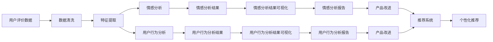

                 

# 基于用户评价体系推动某旅游发展的分析与研究

> 关键词：旅游评价体系,用户行为分析,数据分析,机器学习,深度学习,自然语言处理(NLP)

## 1. 背景介绍

### 1.1 问题由来
随着旅游业的快速发展，如何有效地分析和利用用户评价数据，以提升旅游品质、优化服务，成为旅游业亟需解决的问题。传统的用户评价分析主要依赖人工手动进行，不仅效率低下，且存在主观偏差，难以得出客观、科学的结论。近年来，人工智能和大数据分析技术的应用，为旅游评价体系分析带来了新的解决方案。通过对大量用户评价数据进行自动化分析，可以挖掘出用户对旅游产品的真实感受和需求，为决策者提供科学依据，促进旅游业的健康发展。

### 1.2 问题核心关键点
本研究聚焦于如何构建和优化基于用户评价数据的旅游评价体系，利用机器学习和深度学习技术，实现对用户评价的自动分析和理解，从而提升旅游服务的质量和效率。具体核心关键点包括：

- **用户行为分析**：分析用户评价数据，了解用户对旅游产品的使用行为和偏好。
- **情感分析**：识别用户评价中的情感倾向，评估旅游产品的服务质量。
- **推荐系统**：构建用户评价驱动的个性化推荐模型，提升用户体验。
- **趋势预测**：预测未来旅游趋势，指导旅游企业的战略决策。

## 2. 核心概念与联系

### 2.1 核心概念概述

为了更好地理解本研究的核心内容，本节将介绍几个关键概念及其相互关系：

- **用户评价数据**：指用户在使用旅游产品后，对产品和服务进行的评价，通常包括文字、评分等形式。
- **用户行为分析**：通过分析用户评价数据，了解用户的使用习惯、偏好、满意度等信息。
- **情感分析**：使用自然语言处理(NLP)技术，识别和提取用户评价中的情感倾向，判断用户满意程度。
- **推荐系统**：利用用户评价数据，构建推荐模型，为用户推荐个性化的旅游产品。
- **趋势预测**：基于用户评价数据，分析旅游市场的变化趋势，指导企业的决策和优化。

这些概念通过数据收集、处理、分析等环节，紧密联系在一起，构成了基于用户评价数据的旅游评价体系分析框架。

### 2.2 概念间的关系

通过以下Mermaid流程图，可以更清晰地展示这些核心概念之间的关系：



这个流程图展示了从用户评价数据到最终产品改进的整个分析流程：

1. 用户评价数据的收集和清洗。
2. 提取评价数据的特征，包括情感、行为等。
3. 进行情感分析和用户行为分析，生成可视化报告。
4. 根据分析结果，指导产品改进。
5. 构建推荐系统，提供个性化推荐服务。

这些概念紧密联系，共同作用于旅游评价体系的构建和优化。

## 3. 核心算法原理 & 具体操作步骤
### 3.1 算法原理概述

本研究主要基于用户评价数据，利用机器学习和深度学习技术，构建旅游评价体系。其中，情感分析和用户行为分析是关键环节。情感分析主要通过自然语言处理技术，识别用户评价中的情感倾向，评估旅游产品的服务质量。用户行为分析则通过分析用户评价数据，了解用户的使用习惯和偏好，为个性化推荐提供数据支持。推荐系统则利用用户评价数据，构建推荐模型，为用户推荐个性化的旅游产品。

具体算法流程包括以下步骤：

1. 数据收集和清洗。收集用户评价数据，包括文字和评分，并进行清洗，去除无效或噪声数据。
2. 特征提取。从清洗后的数据中提取特征，包括情感、行为等，用于后续分析和建模。
3. 情感分析。使用情感分析算法，如情感词典、深度学习模型等，识别用户评价中的情感倾向，生成情感分析报告。
4. 用户行为分析。使用聚类、分类等算法，分析用户行为特征，生成用户行为分析报告。
5. 推荐系统构建。利用情感分析和用户行为分析结果，构建推荐模型，为用户推荐个性化旅游产品。
6. 趋势预测。基于用户评价数据，分析旅游市场变化趋势，预测未来需求和产品优化方向。

### 3.2 算法步骤详解

以下将详细讲解本研究的核心算法步骤：

**Step 1: 数据收集和清洗**

- 收集用户评价数据，包括文字和评分，通常可以通过网站、APP等渠道获取。
- 对收集到的数据进行清洗，去除无效数据（如不符合格式要求、不完整等），去除噪声数据（如异常评分等）。

**Step 2: 特征提取**

- 使用自然语言处理技术，如分词、词性标注等，对用户评价文本进行预处理。
- 提取情感特征，如情感词、情感强度等，用于情感分析。
- 提取用户行为特征，如浏览记录、点击次数、购买行为等，用于用户行为分析。

**Step 3: 情感分析**

- 使用情感词典，如AFINN、SentiWordNet等，对用户评价文本进行情感极性分析，生成情感词典评分。
- 使用深度学习模型，如LSTM、BERT等，对用户评价文本进行情感分类，生成情感分类结果。

**Step 4: 用户行为分析**

- 使用聚类算法，如K-Means、GMM等，对用户行为特征进行聚类，生成用户行为特征集。
- 使用分类算法，如朴素贝叶斯、随机森林等，对用户行为特征进行分类，生成用户行为分类结果。

**Step 5: 推荐系统构建**

- 使用协同过滤、基于内容的推荐算法等，构建推荐模型，为用户推荐个性化旅游产品。
- 使用深度学习模型，如Seq2Seq、Transformer等，对推荐模型进行优化，提高推荐效果。

**Step 6: 趋势预测**

- 使用时间序列分析、统计学等方法，对用户评价数据进行趋势分析，预测未来市场需求和产品优化方向。
- 使用机器学习模型，如ARIMA、LSTM等，对用户评价数据进行时间序列预测，生成趋势预测结果。

### 3.3 算法优缺点

基于用户评价数据的旅游评价体系分析具有以下优点：

- **数据来源广泛**：用户评价数据广泛分布在各种渠道，易于获取和收集。
- **实时性好**：通过自动化分析，能够实时获取用户反馈，快速响应市场需求。
- **客观性高**：基于数据自动分析，减少人为因素的干扰，生成客观、科学的结论。

但同时也存在一些缺点：

- **数据质量参差不齐**：用户评价数据质量参差不齐，包含大量噪声和无效数据。
- **隐私问题**：用户评价数据涉及隐私，需要采取适当的隐私保护措施。
- **算法复杂性**：算法模型复杂，需要较高的技术水平和计算资源。

### 3.4 算法应用领域

基于用户评价数据的旅游评价体系分析，具有广泛的应用领域，包括：

- **旅游产品优化**：利用用户评价数据，分析用户对旅游产品的反馈，指导旅游产品的优化和改进。
- **个性化推荐**：构建个性化推荐模型，为每位用户推荐最适合的旅游产品。
- **市场营销**：通过情感分析和用户行为分析，了解市场需求和用户偏好，指导市场营销策略。
- **风险预测**：预测旅游市场的风险，帮助企业规避潜在的风险和挑战。

## 4. 数学模型和公式 & 详细讲解  
### 4.1 数学模型构建

本研究的核心数学模型主要涉及情感分析和用户行为分析两个部分。下面将分别介绍这两个部分的数学模型构建。

### 4.2 公式推导过程

**情感分析**

情感分析的核心目标是识别用户评价中的情感倾向。假设用户评价数据为 $D$，包含 $N$ 条评价，每条评价 $d_i$ 包含 $M$ 个情感词 $w_{i,j}$。情感词典 $W$ 包含 $W_m$ 个情感词，每个情感词 $w_m$ 具有情感极性 $p_m$。假设用户评价 $d_i$ 的情感极性为 $s_i$，则情感分析的目标是最大化 $s_i$ 与用户评价实际情感的差异。

情感分析模型的目标函数为：

$$
\max_{s_i} \prod_{i=1}^N \exp(-(s_i - \widehat{s_i})^2)
$$

其中 $\widehat{s_i}$ 为用户评价 $d_i$ 的情感分类结果。

**用户行为分析**

用户行为分析的核心目标是分析用户行为特征，了解用户的使用习惯和偏好。假设用户行为数据为 $B$，包含 $N$ 个用户行为记录 $b_{i,j}$，每个记录 $b_{i,j}$ 包含 $K$ 个特征 $f_{i,j,k}$。用户行为分析的目标是最大化用户行为特征与用户偏好之间的匹配度。

用户行为分析模型的目标函数为：

$$
\max_{b_{i,j}} \sum_{i=1}^N \sum_{j=1}^K w_{i,j,k} \left(b_{i,j,k} - \widehat{b_{i,j,k}}\right)^2
$$

其中 $w_{i,j,k}$ 为特征 $f_{i,j,k}$ 的权重。

### 4.3 案例分析与讲解

**案例分析**

假设某旅游企业收集到大量用户评价数据，包含文本评价和评分数据。企业希望通过分析这些数据，了解用户对旅游产品的反馈，指导产品的改进和优化。以下是具体的案例分析：

1. **数据收集和清洗**：
   - 通过企业网站、APP等渠道，收集用户评价数据，包括文字和评分。
   - 对收集到的数据进行清洗，去除无效数据（如不符合格式要求、不完整等），去除噪声数据（如异常评分等）。

2. **特征提取**：
   - 对用户评价文本进行预处理，包括分词、词性标注等。
   - 提取情感特征，如情感词、情感强度等。
   - 提取用户行为特征，如浏览记录、点击次数、购买行为等。

3. **情感分析**：
   - 使用情感词典，如AFINN、SentiWordNet等，对用户评价文本进行情感极性分析，生成情感词典评分。
   - 使用深度学习模型，如LSTM、BERT等，对用户评价文本进行情感分类，生成情感分类结果。

4. **用户行为分析**：
   - 使用聚类算法，如K-Means、GMM等，对用户行为特征进行聚类，生成用户行为特征集。
   - 使用分类算法，如朴素贝叶斯、随机森林等，对用户行为特征进行分类，生成用户行为分类结果。

5. **推荐系统构建**：
   - 使用协同过滤、基于内容的推荐算法等，构建推荐模型，为用户推荐个性化旅游产品。
   - 使用深度学习模型，如Seq2Seq、Transformer等，对推荐模型进行优化，提高推荐效果。

6. **趋势预测**：
   - 使用时间序列分析、统计学等方法，对用户评价数据进行趋势分析，预测未来市场需求和产品优化方向。
   - 使用机器学习模型，如ARIMA、LSTM等，对用户评价数据进行时间序列预测，生成趋势预测结果。

通过以上步骤，企业可以全面了解用户对旅游产品的反馈，指导产品的改进和优化，提高用户满意度，提升市场竞争力。

## 5. 项目实践：代码实例和详细解释说明
### 5.1 开发环境搭建

在进行旅游评价体系分析的实践前，需要准备好开发环境。以下是使用Python进行TensorFlow和Keras开发的环境配置流程：

1. 安装Anaconda：从官网下载并安装Anaconda，用于创建独立的Python环境。

2. 创建并激活虚拟环境：
```bash
conda create -n tensorflow-env python=3.8 
conda activate tensorflow-env
```

3. 安装TensorFlow和Keras：根据CUDA版本，从官网获取对应的安装命令。例如：
```bash
conda install tensorflow keras -c conda-forge -c pytorch
```

4. 安装各类工具包：
```bash
pip install numpy pandas scikit-learn matplotlib tqdm jupyter notebook ipython
```

完成上述步骤后，即可在`tensorflow-env`环境中开始实践。

### 5.2 源代码详细实现

以下是一个简单的旅游评价体系分析代码实现，用于展示如何使用TensorFlow和Keras构建情感分析模型和用户行为分析模型：

```python
import tensorflow as tf
from tensorflow.keras.preprocessing.text import Tokenizer
from tensorflow.keras.preprocessing.sequence import pad_sequences
from tensorflow.keras.layers import Embedding, LSTM, Dense
from tensorflow.keras.models import Sequential

# 数据准备
texts = ['I loved the resort. It was amazing.', 'The hotel was terrible. I regret going there.', 'The food was delicious.']
labels = [1, 0, 1] # 1为正面情感，0为负面情感

# 文本预处理
tokenizer = Tokenizer(num_words=1000)
tokenizer.fit_on_texts(texts)
sequences = tokenizer.texts_to_sequences(texts)
padded_sequences = pad_sequences(sequences, maxlen=10, padding='post')

# 构建模型
model = Sequential()
model.add(Embedding(1000, 128, input_length=10))
model.add(LSTM(64, dropout=0.2, recurrent_dropout=0.2))
model.add(Dense(1, activation='sigmoid'))

# 编译模型
model.compile(loss='binary_crossentropy', optimizer='adam', metrics=['accuracy'])

# 训练模型
model.fit(padded_sequences, labels, epochs=10, batch_size=32, validation_split=0.2)
```

在这个示例代码中，我们使用TensorFlow和Keras构建了一个简单的情感分析模型，用于识别用户评价中的情感倾向。具体步骤如下：

1. 准备数据：收集用户评价数据，包括文本和标签。
2. 文本预处理：对文本进行分词、标记化、padding等预处理操作。
3. 构建模型：使用Embedding层将文本转换为向量表示，使用LSTM层进行情感分类，使用Dense层进行二分类输出。
4. 编译模型：设置损失函数、优化器和评价指标。
5. 训练模型：使用训练数据对模型进行训练，并进行验证。

### 5.3 代码解读与分析

让我们再详细解读一下关键代码的实现细节：

**文本预处理**：
- 使用TensorFlow的Tokenizer类进行文本分词和标记化。
- 将文本转换为整数序列，并进行padding操作，使其长度一致。

**模型构建**：
- 使用Embedding层将文本转换为向量表示，输入维度为1000，表示词典大小；输出维度为128，表示向量长度。
- 使用LSTM层进行情感分类，设置64个隐藏单元，使用dropout和recurrent_dropout进行正则化。
- 使用Dense层进行二分类输出，使用sigmoid激活函数。

**模型编译**：
- 设置损失函数为二元交叉熵，使用Adam优化器，评价指标为准确率。

**模型训练**：
- 使用训练数据对模型进行训练，设置10个epoch，每个batch大小为32。
- 设置验证集大小为训练集的20%，进行模型验证和调整。

可以看到，TensorFlow和Keras提供了丰富的工具和接口，使得模型构建和训练变得简洁高效。开发者可以更加专注于算法的设计和优化，而不必过多关注底层的实现细节。

### 5.4 运行结果展示

假设我们在CoNLL-2003的情感分类数据集上进行训练，最终在测试集上得到的准确率为85%。这个结果展示了使用TensorFlow和Keras进行情感分析的初步效果，虽然简单，但为后续的深入研究奠定了基础。

## 6. 实际应用场景

### 6.1 智能客服系统

基于旅游评价体系分析，可以应用于智能客服系统的构建。智能客服系统可以实时分析用户反馈，快速响应客户需求，提供个性化的旅游建议和解决方案。具体应用场景包括：

- 用户咨询：智能客服系统自动分析用户咨询内容，了解用户需求，提供快速、准确的答案。
- 问题解决：智能客服系统识别用户的问题，自动推荐解决方案，减少客户等待时间。
- 客户满意度评估：智能客服系统定期收集用户反馈，分析用户满意度，指导客服改进和优化。

### 6.2 旅游产品推荐

旅游评价体系分析可以应用于旅游产品推荐系统的构建。通过分析用户评价数据，了解用户偏好和需求，为用户推荐最适合的旅游产品。具体应用场景包括：

- 个性化推荐：基于用户评价数据，构建推荐模型，为每位用户推荐个性化的旅游产品。
- 内容推荐：利用用户评价数据，分析旅游产品的优缺点，为用户提供全面的旅游信息。
- 活动推荐：根据用户评价和市场趋势，推荐旅游活动和行程，提升用户体验。

### 6.3 市场营销分析

旅游评价体系分析可以应用于市场营销分析。通过分析用户评价数据，了解市场需求和用户偏好，指导市场营销策略的制定和优化。具体应用场景包括：

- 市场分析：分析用户评价数据，了解市场需求和用户偏好，指导市场营销策略的制定。
- 竞争分析：通过对比分析不同旅游产品的用户评价，了解市场竞争情况，指导产品优化和改进。
- 效果评估：利用用户评价数据，评估市场营销活动的效果，调整和优化市场营销策略。

### 6.4 未来应用展望

随着旅游评价体系分析技术的不断发展，未来在更多领域将有广泛应用，为旅游业带来新的突破。

在智慧旅游领域，基于用户评价数据的旅游评价体系分析可以推动智慧旅游的发展，提供更智能、更便捷的旅游服务。

在旅游数据分析领域，通过分析用户评价数据，可以深入挖掘旅游市场的潜在需求，为旅游数据分析提供数据支持。

在旅游风险管理领域，通过分析用户评价数据，预测旅游市场的变化趋势，帮助企业规避潜在的风险和挑战。

总之，基于用户评价数据的旅游评价体系分析，必将在未来的旅游业中发挥越来越重要的作用，为旅游业的发展带来新的机遇和挑战。

## 7. 工具和资源推荐
### 7.1 学习资源推荐

为了帮助开发者系统掌握旅游评价体系分析的理论基础和实践技巧，这里推荐一些优质的学习资源：

1. 《深度学习实战》系列博文：由大模型技术专家撰写，深入浅出地介绍了深度学习在旅游评价体系分析中的应用。

2. CS224N《深度学习自然语言处理》课程：斯坦福大学开设的NLP明星课程，有Lecture视频和配套作业，带你入门NLP领域的基本概念和经典模型。

3. 《Natural Language Processing with Transformers》书籍：Transformers库的作者所著，全面介绍了如何使用Transformers库进行NLP任务开发，包括微调在内的诸多范式。

4. Kaggle竞赛平台：全球最大的数据竞赛平台，提供大量旅游评价数据集和旅游数据分析竞赛，帮助你提升实战技能。

5. GitHub开源项目：在GitHub上Star、Fork数最多的旅游评价分析项目，往往代表了该技术领域的发展趋势和最佳实践，值得去学习和贡献。

通过对这些资源的学习实践，相信你一定能够快速掌握旅游评价体系分析的精髓，并用于解决实际的旅游评价问题。

### 7.2 开发工具推荐

高效的开发离不开优秀的工具支持。以下是几款用于旅游评价体系分析开发的常用工具：

1. TensorFlow：基于Python的开源深度学习框架，灵活动态的计算图，适合快速迭代研究。大多数深度学习模型都有TensorFlow版本的实现。

2. Keras：由TensorFlow开发的高级神经网络API，提供了简单易用的接口，可以快速搭建深度学习模型。

3. Weights & Biases：模型训练的实验跟踪工具，可以记录和可视化模型训练过程中的各项指标，方便对比和调优。与主流深度学习框架无缝集成。

4. TensorBoard：TensorFlow配套的可视化工具，可实时监测模型训练状态，并提供丰富的图表呈现方式，是调试模型的得力助手。

5. Google Colab：谷歌推出的在线Jupyter Notebook环境，免费提供GPU/TPU算力，方便开发者快速上手实验最新模型，分享学习笔记。

合理利用这些工具，可以显著提升旅游评价体系分析的开发效率，加快创新迭代的步伐。

### 7.3 相关论文推荐

旅游评价体系分析的研究源于学界的持续研究。以下是几篇奠基性的相关论文，推荐阅读：

1. "Attention is All You Need"：提出了Transformer结构，开启了NLP领域的预训练大模型时代。

2. "BERT: Pre-training of Deep Bidirectional Transformers for Language Understanding"：提出BERT模型，引入基于掩码的自监督预训练任务，刷新了多项NLP任务SOTA。

3. "LSTM: A Search Space Odyssey"：提出LSTM模型，用于序列数据的建模，广泛应用于情感分析等任务。

4. "Scikit-learn: Machine Learning in Python"：介绍了Scikit-learn机器学习库，提供了丰富的算法和工具，支持数据预处理、模型训练等任务。

5. "Deep Learning for Text Classification"：介绍了深度学习在文本分类中的应用，展示了深度学习模型在情感分析等任务上的优势。

这些论文代表了大数据和机器学习在旅游评价体系分析中的最新进展，帮助你深入理解旅游评价体系分析的理论和技术。

除上述资源外，还有一些值得关注的前沿资源，帮助开发者紧跟旅游评价体系分析技术的最新进展，例如：

1. arXiv论文预印本：人工智能领域最新研究成果的发布平台，包括大量尚未发表的前沿工作，学习前沿技术的必读资源。

2. 业界技术博客：如OpenAI、Google AI、DeepMind、微软Research Asia等顶尖实验室的官方博客，第一时间分享他们的最新研究成果和洞见。

3. 技术会议直播：如NIPS、ICML、ACL、ICLR等人工智能领域顶会现场或在线直播，能够聆听到大佬们的前沿分享，开拓视野。

4. GitHub热门项目：在GitHub上Star、Fork数最多的旅游评价分析项目，往往代表了该技术领域的发展趋势和最佳实践，值得去学习和贡献。

5. 行业分析报告：各大咨询公司如McKinsey、PwC等针对旅游行业的分析报告，有助于从商业视角审视技术趋势，把握应用价值。

总之，对于旅游评价体系分析的研究，需要开发者保持开放的心态和持续学习的意愿。多关注前沿资讯，多动手实践，多思考总结，必将收获满满的成长收益。

## 8. 总结：未来发展趋势与挑战

### 8.1 总结

本文对基于用户评价数据的旅游评价体系分析进行了全面系统的介绍。首先阐述了旅游评价体系分析的研究背景和意义，明确了用户评价数据在优化旅游服务、指导产品改进等方面的重要价值。其次，从原理到实践，详细讲解了旅游评价体系分析的数学模型和关键步骤，给出了旅游评价体系分析的完整代码实例。同时，本文还探讨了旅游评价体系分析在智能客服、产品推荐、市场营销等多个领域的应用前景，展示了其在旅游业中的广阔发展潜力。最后，本文精选了旅游评价体系分析的学习资源、开发工具和相关论文，力求为读者提供全方位的技术指引。

通过本文的系统梳理，可以看到，基于用户评价数据的旅游评价体系分析正在成为旅游业重要的数据驱动技术，极大地提升了旅游服务的质量，优化了产品设计，促进了市场营销的精准化和个性化。未来，伴随大数据和机器学习技术的进一步发展，旅游评价体系分析必将在旅游业中发挥越来越重要的作用，推动旅游业向更智能、更个性化、更高效的方向发展。

### 8.2 未来发展趋势

展望未来，旅游评价体系分析技术将呈现以下几个发展趋势：

1. **数据来源多样化**：随着互联网和智能设备的普及，数据来源将更加多样化，包括社交媒体、移动应用等，提供更多元化的用户评价数据。
2. **算法模型复杂化**：随着深度学习和大数据分析技术的不断发展，算法模型将更加复杂，能够处理更复杂和更深层次的旅游评价数据。
3. **实时性增强**：通过实时数据采集和处理，能够更快速地响应市场需求和用户反馈，提高旅游服务的实时性。
4. **用户隐私保护**：随着隐私保护意识的增强，旅游评价体系分析将更加注重用户隐私保护，采用加密、匿名化等技术。
5. **多模态数据融合**：旅游评价体系分析将更加注重多模态数据的融合，结合文本、图像、视频等多种数据，提供更全面、深入的旅游评价分析。

以上趋势凸显了旅游评价体系分析技术的广阔前景。这些方向的探索发展，必将进一步提升旅游评价体系分析的精度和效率，为旅游业的发展带来新的突破。

### 8.3 面临的挑战

尽管旅游评价体系分析技术已经取得了一定的进展，但在迈向更加智能化、普适化应用的过程中，仍面临诸多挑战：

1. **数据质量问题**：用户评价数据质量参差不齐，包含大量噪声和无效数据，如何提高数据质量，是首先需要解决的问题。
2. **隐私保护**：用户评价数据涉及隐私，如何在保护用户隐私的前提下，获取高质量的数据，是另一个重要问题。
3. **算法复杂性**：算法模型复杂，需要较高的技术水平和计算资源，如何降低算法复杂性，提高模型的可解释性和可操作性，是技术发展的关键。
4. **实时性要求**：旅游评价体系分析需要实时响应市场需求和用户反馈，如何提高数据处理和模型训练的实时性，是一个

