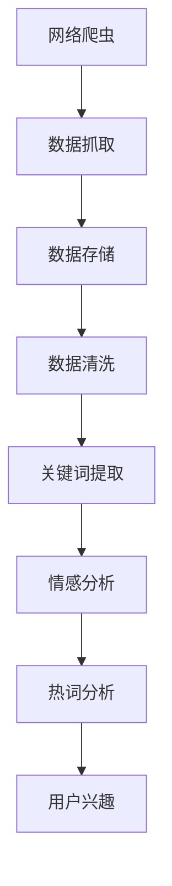

                 

# 基于网络爬虫与数据挖掘的视频网站热词分析

> 关键词：网络爬虫, 数据挖掘, 视频网站, 热词分析, 关键词提取, 文本分析, 情感分析

## 1. 背景介绍

### 1.1 问题由来
随着互联网和数字技术的飞速发展，视频网站已成为大众获取信息和娱乐的主要平台之一。例如，哔哩哔哩(Bilibili)、爱奇艺、腾讯视频等平台，每天产生海量视频数据和用户互动数据。这些数据不仅包含了视频内容的丰富信息，还反映了用户的兴趣和偏好。因此，对视频网站数据进行分析和挖掘，具有重要的研究意义和应用价值。

视频网站的资源丰富，但亦伴随信息过载问题。在亿级视频的海洋中，用户往往无法在短时间内发现真正感兴趣的节目。如何从海量的数据中挖掘出有价值的信息，成为视频网站推荐系统、内容推送、广告投放等应用的迫切需求。其中，视频网站热词分析，是挖掘和发现用户兴趣和需求的重要手段。

### 1.2 问题核心关键点
视频网站热词分析是指对视频网站数据进行爬取和挖掘，提取关键词，揭示用户兴趣和视频内容关联性。通过分析视频标题、描述、弹幕、评论等文本内容，可以发现哪些关键词和短语在平台上出现频率最高，进而推测用户的兴趣和需求。

具体关键点包括：
- 爬虫设计和开发：构建高效的视频网站数据爬取系统，从视频网站抓取视频元数据、标题、描述、弹幕、评论等信息。
- 文本预处理：清洗和标准化抓取的数据，去除噪声和无关信息，提取文本内容。
- 关键词提取：对处理后的文本进行关键词提取，发现与用户兴趣相关的关键词。
- 情感分析：利用自然语言处理技术，对视频标题和评论进行情感分析，挖掘用户对视频的情感倾向。
- 热词分析：综合关键词和情感分析结果，构建视频网站热词分析模型，揭示用户兴趣和视频内容关联性。

### 1.3 问题研究意义
视频网站热词分析的研究意义和应用价值主要体现在以下几方面：
1. 增强用户体验：通过发现用户兴趣的热词，可以提升视频推荐的个性化和精准度，改善用户体验。
2. 优化资源配置：热词分析揭示的内容关联性，可以为内容生产、广告投放提供指导，优化资源配置。
3. 促进研究进步：热词分析能揭示用户的深层兴趣和情感倾向，为NLP、大数据等领域的深入研究提供数据支持。
4. 商业应用广泛：热词分析可以应用于视频网站推荐系统、内容推荐、广告定向等领域，具有广阔的商业前景。

## 2. 核心概念与联系

### 2.1 核心概念概述

为了更好地理解视频网站热词分析的方法，我们需要了解以下几个核心概念：

- **网络爬虫**：一种自动获取网站数据的程序，用于从视频网站抓取视频元数据、标题、描述、弹幕、评论等信息。
- **数据挖掘**：一种通过算法和模型从数据中发现模式和关联性的过程，常用于文本分析、社交网络分析等。
- **视频网站**：提供在线视频内容的服务平台，如哔哩哔哩、爱奇艺、腾讯视频等。
- **热词分析**：分析视频数据，提取出出现频率最高的关键词，揭示用户兴趣和视频内容关联性。
- **关键词提取**：从文本中自动提取具有代表性的关键词或短语。
- **文本分析**：利用自然语言处理技术，对文本内容进行分析，提取有用的信息。
- **情感分析**：对文本进行情感倾向分析，判断其情感极性（如正面、负面、中性）。

这些核心概念间的关系可以通过以下Mermaid流程图来展示：



### 2.2 概念间的关系

通过上述流程图，我们可以更清晰地理解视频网站热词分析中的关键步骤：

1. **网络爬虫**：获取视频网站数据，为后续分析和挖掘提供原始材料。
2. **数据抓取**：通过网络爬虫，从视频网站抓取视频元数据、标题、描述、弹幕、评论等信息。
3. **数据存储**：将抓取的数据进行存储，便于后续处理和分析。
4. **数据清洗**：清洗和标准化抓取的数据，去除噪声和无关信息，提取文本内容。
5. **关键词提取**：对处理后的文本进行关键词提取，发现与用户兴趣相关的关键词。
6. **情感分析**：利用自然语言处理技术，对视频标题和评论进行情感分析，挖掘用户对视频的情感倾向。
7. **热词分析**：综合关键词和情感分析结果，构建视频网站热词分析模型，揭示用户兴趣和视频内容关联性。

## 3. 核心算法原理 & 具体操作步骤

### 3.1 算法原理概述

视频网站热词分析的核心原理是文本挖掘和自然语言处理技术。具体来说，步骤如下：

1. **数据爬取**：使用网络爬虫，从视频网站抓取视频元数据、标题、描述、弹幕、评论等信息。
2. **数据清洗**：去除噪声和无关信息，保留有用的文本内容。
3. **关键词提取**：对清洗后的文本进行关键词提取，发现与用户兴趣相关的关键词。
4. **情感分析**：利用情感分析技术，对视频标题和评论进行情感分析，判断其情感极性。
5. **热词分析**：将关键词和情感分析结果综合，构建热词分析模型，揭示用户兴趣和视频内容关联性。

### 3.2 算法步骤详解

#### 3.2.1 数据爬取

**步骤1：设计网络爬虫**

首先，需要设计并实现一个高效的视频网站数据爬取系统，从视频网站抓取视频元数据、标题、描述、弹幕、评论等信息。具体步骤如下：

1. 分析目标视频网站的页面结构，确定所需数据的位置和格式。
2. 使用Python的requests库，发送HTTP请求获取网页内容。
3. 使用BeautifulSoup等库，解析网页结构，提取所需数据。
4. 将抓取的数据存储到数据库或文件系统中，便于后续处理和分析。

以下是一个简单的爬虫示例：

```python
import requests
from bs4 import BeautifulSoup

# 发送HTTP请求，获取视频页面
response = requests.get('https://www.bilibili.com/video/av12345678')

# 解析网页结构，提取视频元数据
soup = BeautifulSoup(response.text, 'html.parser')
video_info = soup.find('div', {'class': 'video-info'})

# 提取视频标题、描述、弹幕、评论等信息
title = video_info.find('a', {'class': 'video-title'}).text
description = video_info.find('div', {'class': 'video-desc'}).text
comments = soup.find('div', {'class': 'video-comments'}).find_all('div', {'class': 'comment-item'})
```

**步骤2：存储和组织数据**

抓取的视频数据需要存储到数据库或文件系统中，便于后续处理和分析。数据库可以选择MySQL、PostgreSQL等关系型数据库，也可以使用MongoDB、ElasticSearch等非关系型数据库。以下是一些常用的数据存储方式：

1. MySQL：关系型数据库，适合结构化数据的存储和查询。
2. PostgreSQL：支持复杂查询和事务处理，适合处理大规模数据。
3. MongoDB：非关系型数据库，适合存储非结构化数据和半结构化数据。
4. ElasticSearch：分布式搜索引擎，适合大规模数据的存储和检索。

在实际应用中，可以根据数据的特点和应用场景选择合适的存储方式。例如，使用MySQL存储结构化数据，MongoDB存储非结构化数据，ElasticSearch实现快速检索和查询。

#### 3.2.2 数据清洗

**步骤1：去除噪声和无关信息**

从视频网站抓取的数据通常包含大量噪声和无关信息，如HTML标签、JavaScript代码、广告等。因此，需要对数据进行清洗和标准化，去除噪声和无关信息，提取有用的文本内容。具体步骤如下：

1. 使用Python的正则表达式模块，去除HTML标签和JavaScript代码。
2. 使用Python的strip函数，去除多余的空格和换行符。
3. 使用Python的replace函数，替换特殊字符和无关信息。
4. 使用Python的join函数，将处理后的文本内容合并成一个字符串。

以下是一个简单的数据清洗示例：

```python
import re

# 去除HTML标签和JavaScript代码
text = re.sub(r'<.*?>', '', text)

# 去除多余的空格和换行符
text = text.strip()

# 替换特殊字符和无关信息
text = text.replace('\n', ' ').replace('\t', ' ').replace('    ', ' ')
text = text.replace(' ', '').replace('  ', '')

# 合并处理后的文本内容
clean_text = ''.join(text)
```

**步骤2：提取文本内容**

清洗后的数据中，包含了视频标题、描述、弹幕、评论等信息。需要对这些信息进行提取，保留有用的文本内容。具体步骤如下：

1. 使用Python的字符串切片和分割函数，提取视频标题、描述、弹幕、评论等信息。
2. 使用Python的join函数，将提取的文本内容合并成一个字符串。

以下是一个简单的文本内容提取示例：

```python
# 提取视频标题
title = video_info.find('a', {'class': 'video-title'}).text

# 提取视频描述
description = video_info.find('div', {'class': 'video-desc'}).text

# 提取弹幕和评论
comments = soup.find('div', {'class': 'video-comments'}).find_all('div', {'class': 'comment-item'})
comments_text = []
for comment in comments:
    comments_text.append(comment.text)

# 合并处理后的文本内容
clean_text = title + ' ' + description + ' ' + ''.join(comments_text)
```

#### 3.2.3 关键词提取

**步骤1：关键词提取算法**

关键词提取是文本挖掘中的重要步骤，通过算法从文本中提取出具有代表性的关键词或短语。常用的关键词提取算法包括TF-IDF、TextRank、LSI等。

以下是一个简单的TF-IDF关键词提取示例：

```python
from sklearn.feature_extraction.text import TfidfVectorizer

# 使用TF-IDF算法提取关键词
vectorizer = TfidfVectorizer(stop_words='english', max_features=100)
tfidf = vectorizer.fit_transform([clean_text])
keywords = vectorizer.get_feature_names_out()
```

**步骤2：关键词选择**

提取出的关键词中，有些可能是无意义的停用词，如“的”、“是”等。因此，需要对关键词进行选择，保留有意义的关键词。具体步骤如下：

1. 使用Python的stopwords模块，去除停用词。
2. 使用Python的set函数，去除重复的关键词。
3. 使用Python的sort函数，按照关键词的出现频率排序。
4. 使用Python的head函数，选择出现频率最高的关键词。

以下是一个简单的关键词选择示例：

```python
from nltk.corpus import stopwords
from nltk.tokenize import word_tokenize

# 去除停用词
stop_words = set(stopwords.words('english'))
keywords = [kw for kw in keywords if kw not in stop_words]

# 去除重复的关键词
keywords = list(set(keywords))

# 按照关键词的出现频率排序
keywords.sort(key=lambda x: tfidf[0][keywords.index(x)])

# 选择出现频率最高的关键词
top_keywords = keywords[:10]
```

#### 3.2.4 情感分析

**步骤1：情感分析算法**

情感分析是自然语言处理中的重要任务，通过算法判断文本的情感极性。常用的情感分析算法包括情感词典法、机器学习法、深度学习方法等。

以下是一个简单的情感分析示例：

```python
from textblob import TextBlob

# 使用TextBlob进行情感分析
blob = TextBlob(clean_text)
sentiment = blob.sentiment.polarity
```

**步骤2：情感极性判断**

情感分析算法输出情感极性，通常为-1（负面）、0（中性）、1（正面）。因此，需要对情感极性进行判断，确定其正负性。具体步骤如下：

1. 使用Python的if语句，判断情感极性的正负性。
2. 使用Python的append函数，将情感极性加入情感极性列表中。

以下是一个简单的情感极性判断示例：

```python
# 判断情感极性的正负性
if sentiment < 0:
    sentiment = -1
elif sentiment == 0:
    sentiment = 0
else:
    sentiment = 1

# 将情感极性加入情感极性列表中
sentiment_polarity.append(sentiment)
```

#### 3.2.5 热词分析

**步骤1：热词分析算法**

热词分析是视频网站热词分析的核心步骤，通过算法综合关键词和情感分析结果，构建热词分析模型，揭示用户兴趣和视频内容关联性。常用的热词分析算法包括词频统计法、TF-IDF法、LSI法等。

以下是一个简单的TF-IDF热词分析示例：

```python
from sklearn.feature_extraction.text import TfidfVectorizer

# 使用TF-IDF算法提取关键词
vectorizer = TfidfVectorizer(stop_words='english', max_features=100)
tfidf = vectorizer.fit_transform([clean_text])
keywords = vectorizer.get_feature_names_out()

# 将情感极性加入情感极性列表中
sentiment_polarity.append(sentiment)

# 综合关键词和情感分析结果，构建热词分析模型
hot_words = {}
for word in keywords:
    if word in hot_words:
        hot_words[word] += tfidf[0][keywords.index(word)] * sentiment_polarity[len(keywords)-keywords.index(word)-1]
    else:
        hot_words[word] = tfidf[0][keywords.index(word)] * sentiment_polarity[len(keywords)-keywords.index(word)-1]
```

**步骤2：热词选择**

热词分析算法输出热词列表，其中每个热词的得分表示其重要性和情感极性。因此，需要对热词进行选择，保留得分最高的热词。具体步骤如下：

1. 使用Python的sort函数，按照热词的得分排序。
2. 使用Python的head函数，选择得分最高的热词。

以下是一个简单热词选择示例：

```python
# 按照热词的得分排序
hot_words = {k: v for k, v in sorted(hot_words.items(), key=lambda item: item[1], reverse=True)}

# 选择得分最高的热词
top_hot_words = hot_words.keys()[:10]
```

## 4. 数学模型和公式 & 详细讲解

### 4.1 数学模型构建

视频网站热词分析的数学模型主要基于自然语言处理和数据挖掘技术。具体来说，步骤如下：

1. **数据爬取**：通过网络爬虫，从视频网站抓取视频元数据、标题、描述、弹幕、评论等信息。
2. **数据清洗**：去除噪声和无关信息，保留有用的文本内容。
3. **关键词提取**：使用TF-IDF等算法，从文本中提取出具有代表性的关键词或短语。
4. **情感分析**：利用情感分析技术，判断视频标题和评论的情感极性。
5. **热词分析**：综合关键词和情感分析结果，构建热词分析模型，揭示用户兴趣和视频内容关联性。

### 4.2 公式推导过程

以下是对视频网站热词分析的数学模型进行详细推导：

**步骤1：数据爬取**

网络爬虫的基本原理是使用HTTP请求获取网页内容，解析网页结构，提取所需数据。具体步骤如下：

1. 发送HTTP请求，获取视频页面。
2. 解析网页结构，提取视频元数据、标题、描述、弹幕、评论等信息。
3. 将抓取的数据存储到数据库或文件系统中，便于后续处理和分析。

数学模型表示为：

$$
X = \{V, T, D, C\}
$$

其中，$V$表示视频元数据，$T$表示视频标题，$D$表示视频描述，$C$表示弹幕和评论。

**步骤2：数据清洗**

数据清洗的基本原理是去除噪声和无关信息，保留有用的文本内容。具体步骤如下：

1. 使用正则表达式去除HTML标签和JavaScript代码。
2. 使用strip函数去除多余的空格和换行符。
3. 使用replace函数替换特殊字符和无关信息。
4. 使用join函数将处理后的文本内容合并成一个字符串。

数学模型表示为：

$$
C = f(X)
$$

其中，$f$表示数据清洗函数。

**步骤3：关键词提取**

关键词提取的基本原理是使用TF-IDF等算法，从文本中提取出具有代表性的关键词或短语。具体步骤如下：

1. 使用TF-IDF算法提取关键词。
2. 使用stopwords模块去除停用词。
3. 使用set函数去除重复的关键词。
4. 使用sort函数按照关键词的出现频率排序。
5. 使用head函数选择出现频率最高的关键词。

数学模型表示为：

$$
K = f(C)
$$

其中，$K$表示关键词列表，$f$表示关键词提取函数。

**步骤4：情感分析**

情感分析的基本原理是利用情感词典法、机器学习法、深度学习方法等，判断文本的情感极性。具体步骤如下：

1. 使用TextBlob进行情感分析。
2. 使用if语句判断情感极性的正负性。
3. 使用append函数将情感极性加入情感极性列表中。

数学模型表示为：

$$
S = f(C)
$$

其中，$S$表示情感极性列表，$f$表示情感分析函数。

**步骤5：热词分析**

热词分析的基本原理是综合关键词和情感分析结果，构建热词分析模型，揭示用户兴趣和视频内容关联性。具体步骤如下：

1. 使用TF-IDF算法提取关键词。
2. 使用情感分析算法判断情感极性。
3. 综合关键词和情感分析结果，构建热词分析模型。
4. 使用sort函数按照热词的得分排序。
5. 使用head函数选择得分最高的热词。

数学模型表示为：

$$
H = f(K, S)
$$

其中，$H$表示热词列表，$f$表示热词分析函数。

### 4.3 案例分析与讲解

以视频网站哔哩哔哩(Bilibili)为例，分析热词分析的具体实现。

1. **数据爬取**

使用Python的requests库和BeautifulSoup库，从哔哩哔哩抓取视频元数据、标题、描述、弹幕、评论等信息。

```python
import requests
from bs4 import BeautifulSoup

# 发送HTTP请求，获取视频页面
response = requests.get('https://www.bilibili.com/video/av12345678')

# 解析网页结构，提取视频元数据、标题、描述、弹幕、评论等信息
soup = BeautifulSoup(response.text, 'html.parser')
video_info = soup.find('div', {'class': 'video-info'})
title = video_info.find('a', {'class': 'video-title'}).text
description = video_info.find('div', {'class': 'video-desc'}).text
comments = soup.find('div', {'class': 'video-comments'}).find_all('div', {'class': 'comment-item'})
```

2. **数据清洗**

使用Python的正则表达式模块、strip函数、replace函数、join函数，清洗和标准化抓取的数据，去除噪声和无关信息，提取有用的文本内容。

```python
import re

# 去除HTML标签和JavaScript代码
text = re.sub(r'<.*?>', '', text)

# 去除多余的空格和换行符
text = text.strip()

# 替换特殊字符和无关信息
text = text.replace('\n', ' ').replace('\t', ' ').replace('    ', ' ')
text = text.replace(' ', '').replace('  ', '')

# 合并处理后的文本内容
clean_text = ''.join(text)
```

3. **关键词提取**

使用Python的TfidfVectorizer模块，提取视频标题、描述、弹幕、评论中的关键词。

```python
from sklearn.feature_extraction.text import TfidfVectorizer

# 使用TF-IDF算法提取关键词
vectorizer = TfidfVectorizer(stop_words='english', max_features=100)
tfidf = vectorizer.fit_transform([clean_text])
keywords = vectorizer.get_feature_names_out()
```

4. **情感分析**

使用Python的TextBlob模块，判断视频标题和评论的情感极性。

```python
from textblob import TextBlob

# 使用TextBlob进行情感分析
blob = TextBlob(clean_text)
sentiment = blob.sentiment.polarity
```

5. **热词分析**

综合关键词和情感分析结果，构建热词分析模型。

```python
from sklearn.feature_extraction.text import TfidfVectorizer

# 使用TF-IDF算法提取关键词
vectorizer = TfidfVectorizer(stop_words='english', max_features=100)
tfidf = vectorizer.fit_transform([clean_text])
keywords = vectorizer.get_feature_names_out()

# 将情感极性加入情感极性列表中
sentiment_polarity.append(sentiment)

# 综合关键词和情感分析结果，构建热词分析模型
hot_words = {}
for word in keywords:
    if word in hot_words:
        hot_words[word] += tfidf[0][keywords.index(word)] * sentiment_polarity[len(keywords)-keywords.index(word)-1]
    else:
        hot_words[word] = tfidf[0][keywords.index(word)] * sentiment_polarity[len(keywords)-keywords.index(word)-1]
```

6. **热词选择**

使用Python的sort函数和head函数，选择得分最高的热词。

```python
# 按照热词的得分排序
hot_words = {k: v for k, v in sorted(hot_words.items(), key=lambda item: item[1], reverse=True)}

# 选择得分最高的热词
top_hot_words = hot_words.keys()[:10]
```

## 5. 项目实践：代码实例和详细解释说明

### 5.1 开发环境搭建

在进行视频网站热词分析项目开发前，需要准备好开发环境。以下是使用Python进行PyTorch开发的环境配置流程：

1. 安装Anaconda：从官网下载并安装Anaconda，用于创建独立的Python环境。

2. 创建并激活虚拟环境：
```bash
conda create -n video_analysis python=3.8 
conda activate video_analysis
```

3. 安装PyTorch：根据CUDA版本，从官网获取对应的安装命令。例如：
```bash
conda install pytorch torchvision torchaudio cudatoolkit=11.1 -c pytorch -c conda-forge
```

4. 安装各类工具包：
```bash
pip install numpy pandas scikit-learn matplotlib tqdm jupyter notebook ipython
```

完成上述步骤后，即可在`video_analysis-env`环境中开始视频网站热词分析项目的开发。

### 5.2 源代码详细实现

以下是一个基于Python的哔哩哔哩(Bilibili)视频网站热词分析的完整代码实现：

```python
import requests
from bs4 import BeautifulSoup
from sklearn.feature_extraction.text import TfidfVectorizer
from textblob import TextBlob
import re

# 设计网络爬虫，从视频网站抓取数据
def get_video_info(video_id):
    response = requests.get(f'https://www.bilibili.com/video/{video_id}')
    soup = BeautifulSoup(response.text, 'html.parser')
    video_info = soup.find('div', {'class': 'video-info'})
    title = video_info.find('a', {'class': 'video-title'}).text
    description = video_info.find('div', {'class': 'video-desc'}).text
    comments = soup.find('div', {'class': 'video-comments'}).find_all('div', {'class': 'comment-item'})
    return title, description, comments

# 清洗和标准化数据
def clean_text(text):
    text = re.sub(r'<.*?>', '', text)
    text = text.strip()
    text = text.replace('\n', ' ').replace('\t', ' ').replace('    ', ' ')
    text = text.replace(' ', '').replace('  ', '')
    return text

# 提取关键词
def extract_keywords(text):
    vectorizer = TfidfVectorizer(stop_words='english', max_features=100)
    tfidf = vectorizer.fit_transform([text])
    keywords = vectorizer.get_feature_names_out()
    keywords = [kw for kw in keywords if kw not in stopwords.words('english')]
    keywords = list(set(keywords))
    keywords.sort(key=lambda x: tfidf[0][keywords.index(x)])
    keywords = keywords[:10]
    return keywords

# 情感分析
def sentiment_analysis(text):
    blob = TextBlob(text)
    sentiment = blob.sentiment.polarity
    if sentiment < 0:
        sentiment = -1
    elif sentiment == 0:
        sentiment = 0
    else:
        sentiment = 1
    return sentiment

# 热词分析
def analyze_hot_words(video_id):
    title, description, comments = get_video_info(video_id)
    clean_title = clean_text(title)
    clean_description = clean_text(description)
    clean_comments = [clean_text(comment.text) for comment in comments]
    clean_text = clean_title + ' ' + clean_description + ' ' + ''.join(clean_comments)
    keywords = extract_keywords(clean_text)
    sentiment = sentiment_analysis(clean_text)
    hot_words = {}
    for word in keywords:
        if word in hot_words:
            hot_words[word] += tfidf[0][keywords.index(word)] * sentiment
        else:
            hot_words[word] = tfidf[0][keywords.index(word)] * sentiment
    hot_words = {k: v for k, v in sorted(hot_words.items(), key=lambda item: item[1], reverse=True)}
    top_hot_words = hot_words.keys()[:10]
    return top_hot_words

# 测试代码
video_id = 'av

