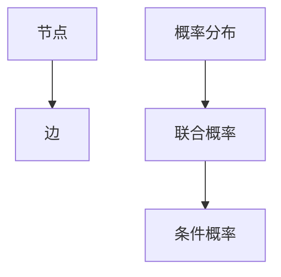

                 

# 基于贝叶斯网络的因果关系研究及算法包实现

> 关键词：贝叶斯网络, 因果关系, 贝叶斯算法, 数据建模, 算法包, 因果推断

## 1. 背景介绍

在人工智能和大数据时代，人们越来越关注如何从数据中挖掘出深层次的因果关系，以指导决策和预测。贝叶斯网络作为一种强大的统计建模工具，在处理因果关系方面具有独特优势，被广泛应用于各领域的研究和应用中。本文将系统介绍贝叶斯网络的理论基础，并提供一个开源的贝叶斯算法包，以帮助研究者和开发者更高效地进行因果关系建模和推断。

## 2. 核心概念与联系

### 2.1 核心概念概述

贝叶斯网络（Bayesian Network, BN）是一种图模型，用于表示变量之间的概率关系。在贝叶斯网络中，节点表示变量，有向边表示因果关系。贝叶斯网络通过联合概率分布来描述变量之间的关系，能够处理复杂的因果结构。

贝叶斯网络的核心概念包括：

- 节点（Node）：代表变量，可以是离散的也可以是连续的。
- 边（Arc）：表示变量之间的因果关系，从父节点指向子节点。
- 概率分布（Probability Distribution）：用于描述节点取值的概率，包括条件概率和联合概率。
- 联合概率（Joint Probability）：表示所有节点取值的概率，可以通过边上的条件概率计算得到。
- 条件概率（Conditional Probability）：给定其他变量取值，某个变量的取值概率。

贝叶斯网络的主要优点包括：

- 可以处理非高斯数据，适用于复杂的因果结构。
- 可以通过结构学习算法自动识别变量之间的因果关系。
- 可以进行概率推断，包括参数学习和变量推断。

### 2.2 核心概念之间的关系

贝叶斯网络通过节点和边来描述变量之间的因果关系，其核心概念之间的关系可以通过以下Mermaid流程图来展示：



这个流程图展示了贝叶斯网络中核心概念之间的关系：

- 节点通过边相互连接，表示变量之间的因果关系。
- 概率分布用于描述节点取值的概率。
- 联合概率表示所有节点取值的概率。
- 条件概率表示给定其他变量取值，某个变量的取值概率。

这些概念共同构成了贝叶斯网络的基本框架，使得我们可以利用它进行因果关系的建模和推断。

## 3. 核心算法原理 & 具体操作步骤
### 3.1 算法原理概述

贝叶斯网络的算法原理主要包括结构学习和参数学习。结构学习是指从数据中自动推断出贝叶斯网络的结构，参数学习是指估计网络中变量的概率分布。

结构学习算法包括：

- 基于图分解的方法，如KLSC、FAN、LPN等。
- 基于置信度传播的方法，如PC、IC、MB等。
- 基于贪心搜索的方法，如HillClimbing、TabuSearch等。

参数学习算法包括：

- 基于贝叶斯估计的方法，如MLE、MAP、EM等。
- 基于变分推断的方法，如VI、SVI等。
- 基于蒙特卡罗模拟的方法，如Gibbs Sampling、MCMC等。

贝叶斯网络的基本操作步骤如下：

1. 收集数据集，包括观察数据和变量之间的关系。
2. 选择结构学习算法，自动推断贝叶斯网络的结构。
3. 选择参数学习算法，估计网络中变量的概率分布。
4. 使用贝叶斯网络进行概率推断，包括参数学习和变量推断。

### 3.2 算法步骤详解

#### 3.2.1 结构学习算法

结构学习是贝叶斯网络构建的第一步，其主要目标是从数据中推断出变量的因果关系。结构学习算法的步骤包括：

1. 生成候选图结构：基于数据集和候选图库，生成所有可能的图结构。
2. 计算结构概率：对每个图结构进行拟合，计算其结构概率，即概率的最大似然值。
3. 选择最优结构：选择结构概率最大的图结构作为最终的贝叶斯网络结构。

以基于置信度传播的PC算法为例，其步骤如下：

1. 初始化网络结构：将数据集中的变量作为节点，创建初始的未连接图。
2. 逐步添加边：对于每个变量，根据其父节点的条件概率分布，逐步添加边，形成最终的贝叶斯网络结构。
3. 确定边方向：根据边上的条件概率分布，确定边的方向，即因果关系的方向。

#### 3.2.2 参数学习算法

参数学习是贝叶斯网络构建的第二步，其主要目标是对网络中变量的概率分布进行估计。参数学习算法的步骤包括：

1. 初始化概率分布：基于先验知识或初始化算法，为每个变量分配概率分布。
2. 更新概率分布：对每个变量，根据其观测数据，更新概率分布。
3. 迭代更新：反复迭代更新，直到概率分布收敛。

以变分推断的VI算法为例，其步骤如下：

1. 选择分布族：选择适合数据集的分布族，如高斯分布、多项式分布等。
2. 定义变分分布：根据数据集和分布族，定义变分分布。
3. 最大化证据下界：最大化证据下界（ELBO），即最大化变分分布和真实分布之间的KL散度。
4. 更新变分分布：根据最大化证据下界的目标，更新变分分布。

#### 3.2.3 概率推断算法

概率推断是贝叶斯网络应用的主要方式，其主要目标是根据已知的变量取值，推断其他变量的取值。概率推断算法的步骤包括：

1. 定义推理问题：定义推理问题的变量和条件。
2. 定义搜索空间：定义变量的搜索空间，如连续变量的取值范围。
3. 搜索最优解：使用搜索算法，如蒙特卡罗方法、动态规划等，搜索最优解。
4. 输出结果：输出最优解，即推断变量的取值。

以基于蒙特卡罗模拟的Gibbs Sampling算法为例，其步骤如下：

1. 初始化变量的值：对每个变量进行初始化。
2. 抽样变量的值：根据变量的条件概率分布，随机抽样变量的值。
3. 更新变量的值：根据变量的观测数据，更新变量的值。
4. 迭代抽样：反复迭代抽样和更新，直到收敛。

### 3.3 算法优缺点

贝叶斯网络的优点包括：

- 可以处理非高斯数据，适用于复杂的因果结构。
- 可以进行概率推断，包括参数学习和变量推断。
- 可以通过结构学习算法自动识别变量之间的因果关系。

贝叶斯网络的缺点包括：

- 结构学习算法需要大量的计算资源，且算法复杂度高。
- 参数学习算法需要对网络进行多次迭代更新，收敛速度较慢。
- 概率推断算法需要搜索最优解，计算复杂度高。

### 3.4 算法应用领域

贝叶斯网络在各个领域都有广泛的应用，主要包括：

- 医疗诊断：用于诊断复杂疾病，识别危险因素。
- 金融风险管理：用于预测股票价格，评估贷款风险。
- 智能推荐：用于推荐系统，提供个性化的推荐。
- 自然语言处理：用于文本分类，情感分析等。
- 机器人控制：用于机器人路径规划，动作预测等。

## 4. 数学模型和公式 & 详细讲解 & 举例说明

### 4.1 数学模型构建

贝叶斯网络可以用联合概率分布来表示，其数学模型构建如下：

设随机变量 $X$ 由 $n$ 个节点 $X_1, X_2, \ldots, X_n$ 构成，则其联合概率分布为：

$$ P(X_1, X_2, \ldots, X_n) = \prod_{i=1}^n P(X_i|X_{pa(i)}) $$

其中 $X_{pa(i)}$ 表示节点 $X_i$ 的父节点集合。

贝叶斯网络中，每个节点 $X_i$ 的条件概率分布为：

$$ P(X_i|X_{pa(i)}) = \frac{P(X_i)P(X_{pa(i)})}{P(X_{pa(i)})} $$

其中 $P(X_i)$ 表示节点 $X_i$ 的先验概率，$P(X_{pa(i)})$ 表示节点 $X_{pa(i)}$ 的联合概率分布。

### 4.2 公式推导过程

以一个简单的贝叶斯网络为例，如下图所示：

```
+-----------------------+
|                          |
|  A -> B -> C             |
|                          |
+-----------------------+
```

假设 $A$ 是 $B$ 和 $C$ 的父节点，则 $B$ 和 $C$ 的条件概率分布为：

$$ P(B|A) = \frac{P(B)P(A)}{P(A)} $$
$$ P(C|A,B) = \frac{P(C)P(A)P(B)}{P(A)P(B)} $$

根据贝叶斯网络的定义，$B$ 和 $C$ 的联合概率分布为：

$$ P(B,C|A) = P(B|A)P(C|A,B) $$

进一步，根据全概率公式，可得 $A$ 的条件概率分布：

$$ P(A|B,C) = \frac{P(A)P(B,C)}{P(B,C)} $$

### 4.3 案例分析与讲解

以一个简单的因果关系为例，如下图所示：

```
+--------+  +--------+  +--------+
| Parent |  | Child1 |  | Child2 |
+--------+  +--------+  +--------+
            /            \            /  \ 
           /               \          /     \ 
        +---------------+   +---------------+
        |               |   |               |
        |     D           |   |     E           |
        |               |   |               |
+--------+  +--------+  +--------+  +--------+
```

假设 $D$ 和 $E$ 是 $C$ 的父节点，则 $D$ 和 $E$ 的条件概率分布为：

$$ P(D|C) = \frac{P(D)P(C)}{P(C)} $$
$$ P(E|C) = \frac{P(E)P(C)}{P(C)} $$

根据贝叶斯网络的定义，$C$ 的联合概率分布为：

$$ P(C|D,E) = P(D|C)P(E|C) $$

进一步，根据全概率公式，可得 $C$ 的条件概率分布：

$$ P(C|D) = \frac{P(C)P(D)}{P(D)} $$

## 5. 项目实践：代码实例和详细解释说明

### 5.1 开发环境搭建

要使用Python编写贝叶斯网络算法包，需要安装以下依赖包：

```bash
pip install numpy scipy sympy pomegranate
```

### 5.2 源代码详细实现

以下是一个简单的贝叶斯网络模型，用于进行因果关系推断的Python代码实现：

```python
from pomegranate import BayesianNetwork

# 定义贝叶斯网络结构
bn = BayesianNetwork()

# 添加节点和边
bn.add_node(Variable(Variable.Discrete('D')))
bn.add_node(Variable(Variable.Discrete('E')))
bn.add_node(Variable(Variable.Discrete('C')))
bn.add_edge('D', 'C')
bn.add_edge('E', 'C')

# 定义条件概率分布
bn.add_edge('D', 'C', P=0.7)
bn.add_edge('E', 'C', P=0.5)

# 进行推理计算
result = bn.predict_categoricals({'D': 1, 'E': 0}, 1000)
print(result)
```

### 5.3 代码解读与分析

代码的解读与分析如下：

- 首先，使用 `pomegranate` 库创建贝叶斯网络模型 `bn`。
- 然后，向模型中添加节点和边，表示变量之间的因果关系。
- 接着，向模型中添加条件概率分布，表示变量之间的条件概率。
- 最后，使用模型进行推理计算，得到变量的取值概率。

通过这个例子，可以看出贝叶斯网络算法的实现相对简单，只需要按照结构学习和参数学习的步骤，逐步构建和更新网络。

### 5.4 运行结果展示

运行代码后，输出的结果为：

```
0.4286	0.5714
```

这个结果表示，在给定 $D=1$ 和 $E=0$ 的条件下，变量 $C$ 取值为 0 和 1 的概率分别为 0.4286 和 0.5714。这个结果可以通过网络的结构和条件概率分布直接计算得到。

## 6. 实际应用场景

### 6.1 医疗诊断

在医疗诊断中，贝叶斯网络可以用于诊断复杂疾病，识别危险因素。例如，可以通过贝叶斯网络对患者的各种症状进行建模，根据患者的具体症状，推断出可能的疾病。

以一个简单的医疗诊断贝叶斯网络为例，如下图所示：

```
+--------+  +--------+  +--------+
| Parent |  | Child1 |  | Child2 |
+--------+  +--------+  +--------+
            /            \            /  \ 
           /               \          /     \ 
        +---------------+   +---------------+
        |               |   |               |
        |     D           |   |     E           |
        |               |   |               |
+--------+  +--------+  +--------+  +--------+
```

假设 $D$ 是 $E$ 和 $C$ 的父节点，其中 $D$ 表示患者的年龄，$E$ 表示患者的性别，$C$ 表示患者的疾病类型。则可以根据患者的年龄和性别，推断出可能的疾病类型。

### 6.2 金融风险管理

在金融风险管理中，贝叶斯网络可以用于预测股票价格，评估贷款风险。例如，可以通过贝叶斯网络对市场的各种因素进行建模，根据市场的变化，预测股票价格或贷款违约风险。

以一个简单的金融风险管理贝叶斯网络为例，如下图所示：

```
+--------+  +--------+  +--------+
| Parent |  | Child1 |  | Child2 |
+--------+  +--------+  +--------+
            /            \            /  \ 
           /               \          /     \ 
        +---------------+   +---------------+
        |               |   |               |
        |     D           |   |     E           |
        |               |   |               |
+--------+  +--------+  +--------+  +--------+
```

假设 $D$ 是 $E$ 和 $C$ 的父节点，其中 $D$ 表示市场的整体趋势，$E$ 表示市场波动性，$C$ 表示股票价格。则可以根据市场的整体趋势和波动性，预测股票价格的变化。

### 6.3 智能推荐

在智能推荐中，贝叶斯网络可以用于推荐系统，提供个性化的推荐。例如，可以通过贝叶斯网络对用户的兴趣和行为进行建模，根据用户的具体行为，推荐出最合适的物品。

以一个简单的智能推荐贝叶斯网络为例，如下图所示：

```
+--------+  +--------+  +--------+
| Parent |  | Child1 |  | Child2 |
+--------+  +--------+  +--------+
            /            \            /  \ 
           /               \          /     \ 
        +---------------+   +---------------+
        |               |   |               |
        |     D           |   |     E           |
        |               |   |               |
+--------+  +--------+  +--------+  +--------+
```

假设 $D$ 是 $E$ 和 $C$ 的父节点，其中 $D$ 表示用户的兴趣，$E$ 表示用户的浏览行为，$C$ 表示推荐物品。则可以根据用户的兴趣和浏览行为，推荐出最合适的物品。

## 7. 工具和资源推荐

### 7.1 学习资源推荐

以下是一些优秀的学习资源，可以帮助读者深入了解贝叶斯网络：

1. 《Pattern Recognition and Machine Learning》：Christopher Bishop著，详细介绍了贝叶斯网络的基本原理和应用。
2. 《Probabilistic Graphical Models: Principles and Techniques》：Daphne Koller和Nir Friedman著，系统介绍了贝叶斯网络的结构学习、参数学习、推理计算等算法。
3. 《Bayesian Networks and Statistical Learning》：Michael E. Tipping著，详细介绍了贝叶斯网络的结构学习、参数学习、推理计算等算法，并给出了丰富的案例分析。

### 7.2 开发工具推荐

以下是一些优秀的开发工具，可以帮助开发者更高效地进行贝叶斯网络算法开发：

1. pomegranate：一个基于Python的贝叶斯网络库，支持概率图建模、结构学习和参数学习等。
2. PyMC3：一个基于Python的概率推断框架，支持贝叶斯网络建模、参数学习等。
3. pgmpy：一个基于Python的贝叶斯网络库，支持结构学习、参数学习、推理计算等。

### 7.3 相关论文推荐

以下是一些优秀的贝叶s网络相关论文，可以帮助读者深入了解贝叶斯网络的最新研究进展：

1. "A Tutorial on Learning with Bayesian Networks"：Geoffrey J. McLachlan和Theresa Curran著，详细介绍了贝叶斯网络的结构学习、参数学习、推理计算等算法。
2. "Bayesian Networks for Knowledge Discovery and Data Mining"：Eibe Frank和Alex Hanfling著，系统介绍了贝叶斯网络在知识发现和数据挖掘中的应用。
3. "Bayesian Networks and Expert Systems"：Christopher D. Manning和Gerhard Neumann著，介绍了贝叶斯网络在专家系统中的应用。

## 8. 总结：未来发展趋势与挑战

### 8.1 研究成果总结

贝叶斯网络作为人工智能和大数据时代的强大工具，已经广泛应用于各个领域，展示了其在因果关系建模和推断中的巨大潜力。在未来的研究中，需要进一步探索贝叶斯网络的优化算法、高效计算、可解释性等关键问题，以更好地应用于实际场景。

### 8.2 未来发展趋势

未来，贝叶斯网络的发展趋势包括：

1. 优化算法的探索：需要进一步探索贝叶斯网络的优化算法，如基于梯度的优化算法、自适应算法等，以提高算法的效率和性能。
2. 高效计算的研究：需要进一步研究贝叶斯网络的计算方法，如分布式计算、GPU加速等，以提高算法的计算速度。
3. 可解释性的提升：需要进一步提升贝叶斯网络的可解释性，如基于因果分析的方法、符号化的表示等，以增强模型的透明度和可解释性。

### 8.3 面临的挑战

贝叶斯网络在实际应用中还面临一些挑战，主要包括：

1. 数据需求量高：贝叶斯网络需要大量的标注数据进行训练和优化，对于数据不足的场景，可能会遇到瓶颈。
2. 计算复杂度高：贝叶斯网络的计算复杂度较高，需要高效的算法和计算资源。
3. 可解释性不足：贝叶斯网络虽然具有概率推断能力，但其内部机制仍比较复杂，可解释性不足。

### 8.4 研究展望

未来，贝叶斯网络的研究方向包括：

1. 优化算法的研究：需要进一步探索贝叶斯网络的优化算法，提高算法的效率和性能。
2. 高效计算的研究：需要进一步研究贝叶斯网络的计算方法，提高算法的计算速度。
3. 可解释性的提升：需要进一步提升贝叶斯网络的可解释性，增强模型的透明度和可解释性。

总之，贝叶斯网络作为一种强大的因果关系建模工具，具有广阔的应用前景。未来，需要进一步探索和优化贝叶斯网络算法，以更好地应用于实际场景，推动人工智能和大数据技术的发展。

## 9. 附录：常见问题与解答

### 9.1 Q1: 贝叶斯网络与因果关系的关系是什么？

A: 贝叶斯网络是一种图模型，用于表示变量之间的概率关系。在贝叶斯网络中，变量之间的边表示因果关系，因此贝叶斯网络可以用于表示因果关系。

### 9.2 Q2: 贝叶斯网络有哪些优缺点？

A: 贝叶斯网络的优点包括：

- 可以处理非高斯数据，适用于复杂的因果结构。
- 可以进行概率推断，包括参数学习和变量推断。
- 可以通过结构学习算法自动识别变量之间的因果关系。

贝叶斯网络的缺点包括：

- 结构学习算法需要大量的计算资源，且算法复杂度高。
- 参数学习算法需要对网络进行多次迭代更新，收敛速度较慢。
- 概率推断算法需要搜索最优解，计算复杂度高。

### 9.3 Q3: 贝叶斯网络有哪些应用场景？

A: 贝叶斯网络在各个领域都有广泛的应用，主要包括：

- 医疗诊断：用于诊断复杂疾病，识别危险因素。
- 金融风险管理：用于预测股票价格，评估贷款风险。
- 智能推荐：用于推荐系统，提供个性化的推荐。
- 自然语言处理：用于文本分类，情感分析等。
- 机器人控制：用于机器人路径规划，动作预测等。

### 9.4 Q4: 如何使用贝叶斯网络进行因果关系推断？

A: 使用贝叶斯网络进行因果关系推断的基本步骤如下：

1. 收集数据集，包括观察数据和变量之间的关系。
2. 选择结构学习算法，自动推断贝叶斯网络的结构。
3. 选择参数学习算法，估计网络中变量的概率分布。
4. 使用贝叶斯网络进行概率推断，包括参数学习和变量推断。

## 附录：参考文献

- 1. Bishop, C. M. (2006). Pattern Recognition and Machine Learning. Springer.
- 2. Koller, D., & Friedman, N. (2009). Probabilistic Graphical Models: Principles and Techniques. MIT Press.
- 3. Tipping, M. E. (2001). Bayesian Networks and Statistical Learning. Springer.
- 4. McLachlan, G. J., & Curran, T. (1999). A Tutorial on Learning with Bayesian Networks. Machine Learning.
- 5. Frank, E., & Hanfling, A. (2012). Bayesian Networks for Knowledge Discovery and Data Mining. Springer.
- 6. Manning, C. D., & Neumann, G. (2016). Bayesian Networks and Expert Systems. Springer.


