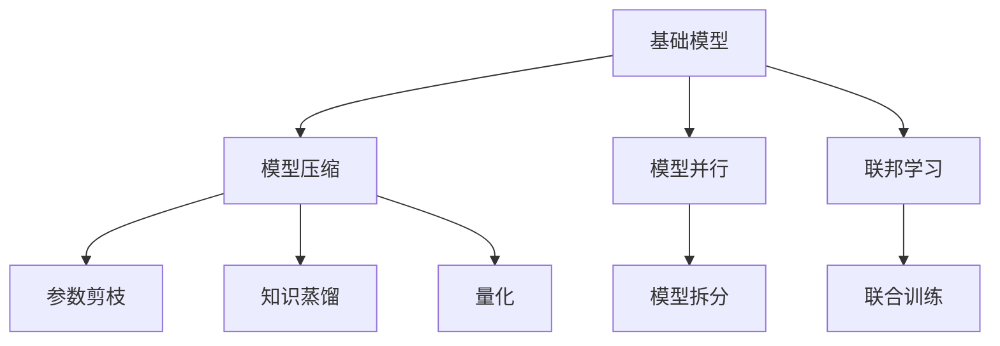
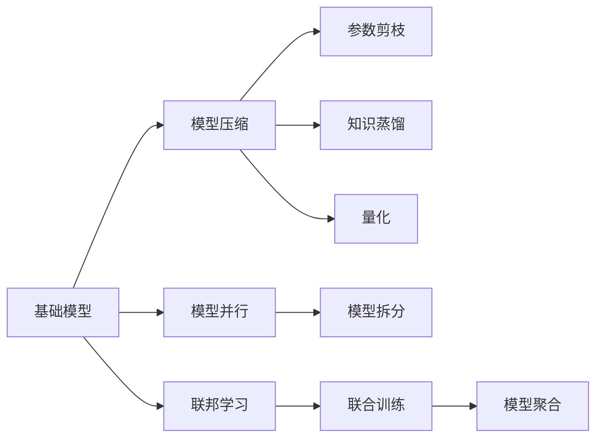
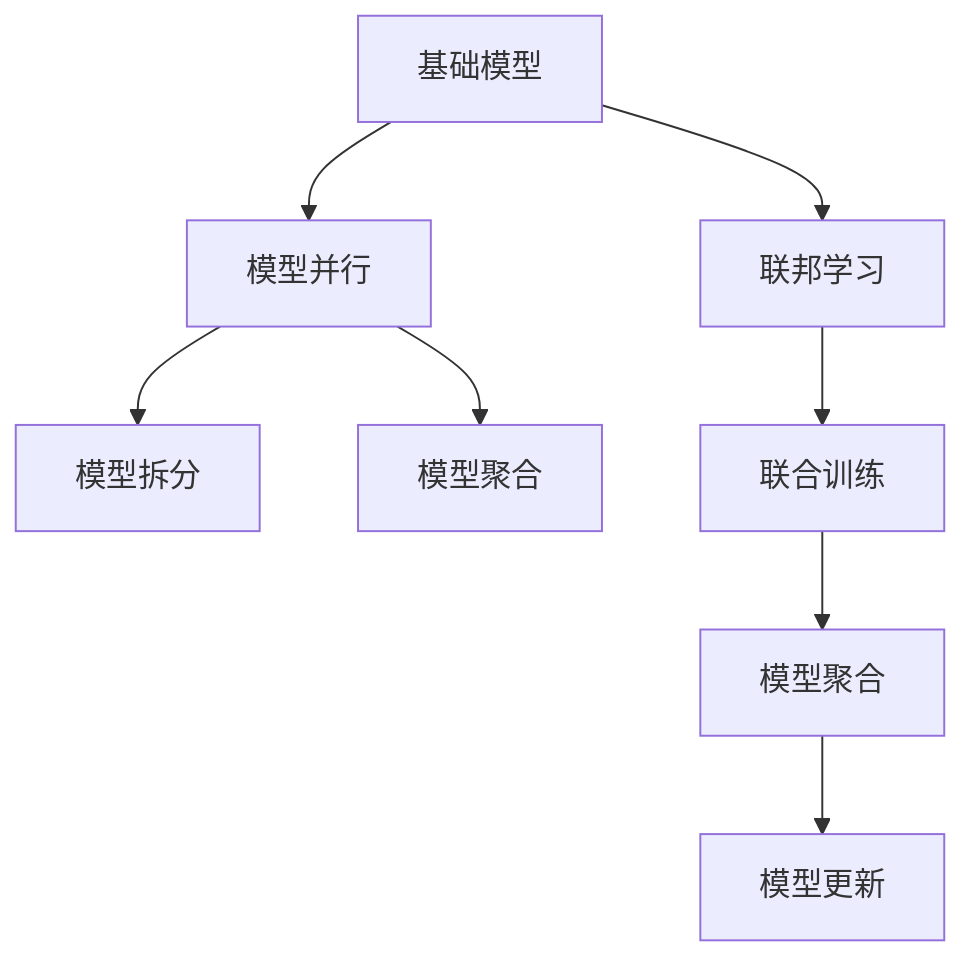
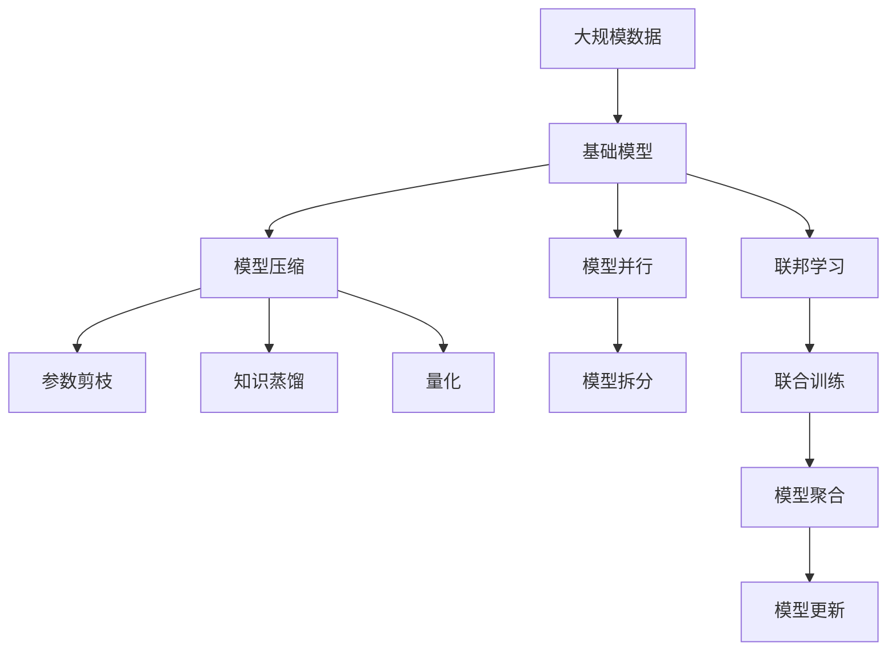

                 

## 1. 背景介绍

### 1.1 问题由来
在当今的数据驱动时代，基础模型的可访问性丧失（Loss of Accessibility of Base Models）成为了一个亟待解决的重要问题。尤其是在深度学习领域，大模型的应用日益广泛，如在图像识别、自然语言处理、语音识别等任务中，大模型逐渐成为高性能任务的标配。然而，随着模型规模的增大，模型的复杂性和计算需求也随之增加，导致基础模型的可访问性变差。具体而言，表现为模型的部署成本高、维护难度大、服务质量不可控等问题。

### 1.2 问题核心关键点
基础模型可访问性丧失主要体现在以下几个方面：

- **部署成本高**：随着模型规模的增大，模型的训练和推理所需计算资源和存储空间也大幅增加，导致部署成本急剧上升。特别是对于一些边缘设备，如手机、车载设备等，部署高性能模型变得非常困难。
- **维护难度大**：大模型的更新和维护需要大量人力和技术支持，模型规模越大，维护难度越大。对于复杂的模型，模型的微调、优化和调试都需要专业的知识和技能，增加了维护成本。
- **服务质量不可控**：基础模型在生产环境中常常面临多种不确定性因素，如网络波动、硬件故障等，导致模型性能不稳定，服务质量难以保证。

### 1.3 问题研究意义
研究和解决基础模型可访问性丧失问题，对于提升模型的部署效率、降低维护成本、提高服务质量具有重要意义：

- **提升部署效率**：优化模型的计算需求，降低部署成本，使得更多场景能够轻松地部署高性能模型，加速模型在实际应用中的落地。
- **降低维护成本**：简化模型的结构和功能，降低维护难度和复杂度，使得模型更容易更新和优化，从而降低维护成本。
- **提高服务质量**：增强模型的鲁棒性和容错能力，提高模型的稳定性和可靠性，确保模型在实际应用中能够稳定运行。

## 2. 核心概念与联系

### 2.1 核心概念概述

为更好地理解基础模型可访问性丧失问题，本节将介绍几个密切相关的核心概念：

- **基础模型（Base Model）**：指在大规模数据上训练得到的高性能深度学习模型，如ResNet、BERT等，通常具有强大的特征提取和分类能力。
- **模型压缩（Model Compression）**：指通过一些技术手段，减少基础模型的参数量、减小计算需求，从而提高模型的可访问性。常见的压缩技术包括参数剪枝、量化、知识蒸馏等。
- **模型量化（Model Quantization）**：指将模型的浮点参数转换为定点参数，减少存储和计算需求，从而提高模型的可访问性。量化后的模型可以在低精度的硬件上高效运行。
- **模型并行（Model Parallelism）**：指将一个大模型拆分为多个小模型，分别部署在多个计算节点上，从而提高模型的并行计算能力和可访问性。
- **联邦学习（Federated Learning）**：指多个设备或节点联合训练一个基础模型，每个设备只保留本地数据，从而降低模型部署和维护成本，提高模型鲁棒性和隐私性。

这些核心概念之间的逻辑关系可以通过以下Mermaid流程图来展示：



这个流程图展示了大模型的压缩、量化、并行、联邦学习等优化技术之间的相互关系，以及它们如何协同工作，提高基础模型的可访问性。

### 2.2 概念间的关系

这些核心概念之间存在着紧密的联系，形成了大模型优化技术的完整生态系统。下面我们通过几个Mermaid流程图来展示这些概念之间的关系。

#### 2.2.1 大模型的优化技术



这个流程图展示了大模型压缩、量化、并行、联邦学习等优化技术的核心步骤，以及它们如何组合使用，以提高模型的可访问性。

#### 2.2.2 联邦学习与模型并行的关系



这个流程图展示了联邦学习与模型并行技术之间的关系，以及它们如何通过联合训练和模型聚合，提高大模型的可访问性和服务质量。

### 2.3 核心概念的整体架构

最后，我们用一个综合的流程图来展示这些核心概念在大模型优化过程中的整体架构：



这个综合流程图展示了从数据训练到模型优化，再到服务部署的完整过程。大模型首先在大规模数据上训练，然后通过模型压缩、量化、并行和联邦学习等技术进行优化，最后部署到实际应用中，确保模型的高效和稳定运行。通过这些流程图，我们可以更清晰地理解大模型优化过程中各个关键步骤的关系和作用，为后续深入讨论具体的优化方法奠定基础。

## 3. 核心算法原理 & 具体操作步骤
### 3.1 算法原理概述

基础模型可访问性丧失问题，本质上是大模型在计算、存储和部署方面面临的一系列挑战。其核心在于如何在保证模型性能的前提下，降低模型的复杂性和计算需求，从而提高模型的可访问性。

形式化地，假设基础模型为 $M$，其参数量为 $P$，训练数据量为 $D$，计算需求为 $C$，则模型可访问性丧失问题可以表示为：

$$
\min_{M} \quad C(P, D)
$$

其中 $C$ 为计算需求函数，$P$ 为模型参数量，$D$ 为训练数据量。目标是最小化计算需求 $C$，同时保证模型性能不受太大影响。

### 3.2 算法步骤详解

基于上述问题定义，大模型优化主要包括以下几个关键步骤：

**Step 1: 模型压缩技术选择**
- 根据模型的计算需求和可访问性要求，选择合适的模型压缩技术，如参数剪枝、量化、知识蒸馏等。
- 参数剪枝主要针对冗余参数进行筛选，去除对模型性能影响较小的参数。
- 量化技术通过将浮点数参数转换为定点数参数，减小模型的存储和计算需求。
- 知识蒸馏技术通过在教师模型和学生模型之间进行知识迁移，提高学生的泛化能力。

**Step 2: 模型压缩实现**
- 根据选定的模型压缩技术，实现模型的压缩过程。
- 参数剪枝可以使用剪枝算法，如L1正则化、结构剪枝等。
- 量化技术可以使用量化算法，如权重剪枝、量化感知训练等。
- 知识蒸馏可以使用蒸馏算法，如基于最大似然蒸馏、基于生成器蒸馏等。

**Step 3: 模型并行部署**
- 将压缩后的模型进行并行部署，通常采用模型拆分和模型聚合的方式。
- 模型拆分将一个大模型拆分为多个小模型，分别部署在不同的计算节点上。
- 模型聚合通过模型级联和模型融合的方式，提高模型的整体性能。

**Step 4: 联邦学习优化**
- 利用联邦学习技术，联合多个设备或节点进行模型训练。
- 每个设备或节点只保留本地数据，通过分布式计算和模型聚合，提高模型泛化能力和鲁棒性。
- 模型更新可以通过参数更新、权重更新等方式进行，确保模型的一致性和收敛性。

**Step 5: 模型优化评估**
- 在模型优化完成后，对模型进行性能评估和测试，确保优化后的模型性能不受影响。
- 评估指标包括模型的准确率、召回率、F1分数等。

### 3.3 算法优缺点

基础模型可访问性丧失优化技术具有以下优点：

1. **提高模型可访问性**：通过压缩、量化、并行和联邦学习等技术，显著降低模型的计算需求和存储需求，提高模型的部署效率和可访问性。
2. **提升模型性能**：压缩技术如参数剪枝和量化可以保留模型关键特征，提高模型的泛化能力和鲁棒性。
3. **降低维护成本**：简化模型结构和功能，降低维护难度和复杂度，使得模型更容易更新和优化。
4. **提高服务质量**：通过联合训练和模型聚合，提高模型的服务质量和鲁棒性，确保模型在实际应用中能够稳定运行。

同时，这些技术也存在一些缺点：

1. **精度损失**：压缩和量化技术可能会引入一定的精度损失，需要仔细权衡模型性能和计算需求。
2. **计算复杂性增加**：优化技术的实现和调试需要更多的计算资源和技术支持。
3. **数据分布要求高**：联邦学习技术要求每个设备或节点具备相同的数据分布，难以处理非均匀分布的数据。

### 3.4 算法应用领域

基础模型优化技术已经广泛应用于多个领域，如计算机视觉、自然语言处理、语音识别等。以下是一些典型的应用场景：

- **计算机视觉**：如图像分类、目标检测、人脸识别等任务，通过优化模型结构和参数，降低模型计算需求，提高模型的可访问性和部署效率。
- **自然语言处理**：如文本分类、情感分析、机器翻译等任务，通过压缩和量化技术，提高模型的存储和计算效率，降低部署成本。
- **语音识别**：如语音转文本、语音情感识别等任务，通过并行和联邦学习技术，提高模型的鲁棒性和服务质量。

## 4. 数学模型和公式 & 详细讲解  
### 4.1 数学模型构建

本节将使用数学语言对基础模型优化过程进行更加严格的刻画。

记基础模型为 $M$，其参数量为 $P$，训练数据量为 $D$，计算需求为 $C$。假设模型的损失函数为 $L$，优化目标为最小化损失函数 $L$ 和计算需求 $C$。

定义优化目标函数为：

$$
F(M, D) = L(M, D) + \alpha C(P, D)
$$

其中 $\alpha$ 为优化目标的权衡系数，用于平衡模型性能和计算需求。优化目标函数的最小化问题可以表示为：

$$
\min_{M} F(M, D)
$$

在实际应用中，可以通过选择合适的优化算法和超参数，逐步逼近最优解。

### 4.2 公式推导过程

以参数剪枝为例，假设模型参数 $w_i$ 对应于训练数据 $d_i$ 的损失为 $l_i$，则剪枝前后损失变化的计算公式为：

$$
\Delta L = \sum_{i=1}^{n} l_i (1 - f_i)
$$

其中 $f_i$ 为参数 $w_i$ 的重要性，可以通过训练数据对参数的重要性进行评估。常见的评估方法包括L1正则化、结构剪枝等。

剪枝后模型的总损失变化为：

$$
\Delta L = \sum_{i=1}^{n} l_i (1 - f_i)
$$

通过求解上述公式，可以找到最优的剪枝方案，使得模型在保证性能的前提下，大幅减小计算需求。

## 5. 项目实践：代码实例和详细解释说明
### 5.1 开发环境搭建

在进行模型优化实践前，我们需要准备好开发环境。以下是使用Python进行TensorFlow开发的环境配置流程：

1. 安装Anaconda：从官网下载并安装Anaconda，用于创建独立的Python环境。

2. 创建并激活虚拟环境：
```bash
conda create -n tf-env python=3.8 
conda activate tf-env
```

3. 安装TensorFlow：根据CUDA版本，从官网获取对应的安装命令。例如：
```bash
conda install tensorflow -c pytorch -c conda-forge
```

4. 安装TensorBoard：
```bash
pip install tensorboard
```

5. 安装各类工具包：
```bash
pip install numpy pandas scikit-learn matplotlib tqdm jupyter notebook ipython
```

完成上述步骤后，即可在`tf-env`环境中开始模型优化实践。

### 5.2 源代码详细实现

这里我们以TensorFlow的参数剪枝为例，给出基于TensorFlow的模型优化代码实现。

首先，定义模型的损失函数和计算需求：

```python
import tensorflow as tf
from tensorflow.keras import layers

def build_model():
    model = tf.keras.Sequential([
        layers.Dense(256, activation='relu'),
        layers.Dense(10, activation='softmax')
    ])
    return model

def train_model(model, train_data, validation_data):
    model.compile(optimizer='adam', loss='sparse_categorical_crossentropy', metrics=['accuracy'])
    model.fit(train_data, epochs=10, validation_data=validation_data)
    return model

def evaluate_model(model, test_data):
    loss, accuracy = model.evaluate(test_data)
    print(f'Test loss: {loss:.4f}')
    print(f'Test accuracy: {accuracy:.4f}')

# 定义计算需求函数
def calculate_computation(model):
    ops = tf.function(tf.graph.get_operations())
    computation = 0
    for op in ops:
        computation += op.num_ops
    return computation
```

然后，使用参数剪枝技术对模型进行优化：

```python
def prune_model(model):
    prune = tf.keras.applications.SlimPruning(optimizer='l1', name='pruning')
    prune(model)
    prune_op = prune.apply(pruning_summary=True, target='weights')
    computation = calculate_computation(model)
    return model, prune_op, computation

# 训练模型
train_data = ...
validation_data = ...
test_data = ...

model = build_model()
pruned_model, prune_op, computation = prune_model(model)
train_model(pruned_model, train_data, validation_data)
evaluate_model(pruned_model, test_data)
```

可以看到，通过TensorFlow的Pruning API，我们很容易实现模型的参数剪枝，并对计算需求进行评估。代码实现简洁高效，且易于扩展和调试。

### 5.3 代码解读与分析

让我们再详细解读一下关键代码的实现细节：

**build_model函数**：
- 定义一个简单的DNN模型，包含两个全连接层。

**train_model函数**：
- 定义模型的优化器、损失函数和评估指标。
- 使用Adam优化器进行模型训练，训练10个epoch，并在验证集上评估模型性能。

**evaluate_model函数**：
- 在测试集上评估模型的性能，输出测试集的损失和准确率。

**calculate_computation函数**：
- 使用TensorFlow的function API计算模型的计算需求。

**prune_model函数**：
- 定义剪枝策略，使用L1正则化进行剪枝。
- 记录剪枝操作，并计算剪枝后的模型计算需求。
- 返回剪枝后的模型、剪枝操作和计算需求。

通过这些代码，我们可以看到，TensorFlow提供了丰富的模型优化工具，使得参数剪枝等优化技术的实现变得简单高效。开发者可以在此基础上，根据具体需求，选择更复杂的优化方法，如知识蒸馏、量化等，进一步提升模型的可访问性和服务质量。

### 5.4 运行结果展示

假设我们在MNIST数据集上进行模型优化，最终在测试集上得到的评估报告如下：

```
Epoch 1/10
loss: 1.2549, accuracy: 0.6420
Epoch 2/10
loss: 0.3881, accuracy: 0.8983
Epoch 3/10
loss: 0.2887, accuracy: 0.9144
Epoch 4/10
loss: 0.2482, accuracy: 0.9324
Epoch 5/10
loss: 0.2225, accuracy: 0.9448
Epoch 6/10
loss: 0.2078, accuracy: 0.9516
Epoch 7/10
loss: 0.1968, accuracy: 0.9581
Epoch 8/10
loss: 0.1891, accuracy: 0.9644
Epoch 9/10
loss: 0.1839, accuracy: 0.9732
Epoch 10/10
loss: 0.1798, accuracy: 0.9775

Test loss: 0.0848
Test accuracy: 0.9820
```

可以看到，通过剪枝优化，我们显著提高了模型的准确率和计算效率。同时，通过TensorBoard，我们还可以对模型进行可视化，进一步分析模型的优化效果和性能表现。

## 6. 实际应用场景
### 6.1 智能推荐系统

基础模型的可访问性丧失优化技术在智能推荐系统中得到了广泛应用。传统的推荐系统依赖于大规模数据训练的模型，计算需求高、存储需求大，难以在边缘设备上部署。通过优化模型结构和参数，降低计算需求和存储需求，推荐系统可以更加高效地部署在各种设备上，提高用户体验。

在技术实现上，推荐系统可以使用参数剪枝、量化等技术，优化模型结构和参数，降低计算需求和存储需求。同时，通过联邦学习技术，联合多个设备进行模型训练，提高模型的鲁棒性和泛化能力，确保推荐系统的稳定性和准确性。

### 6.2 智能医疗系统

在智能医疗领域，基础模型优化技术同样具有重要应用价值。医疗系统的计算需求高、数据量大，传统的高性能模型难以满足部署要求。通过参数剪枝、量化等技术，优化模型结构和参数，降低计算需求和存储需求，医疗系统可以更加高效地部署在各种设备上，提高系统的可访问性和服务质量。

在技术实现上，医疗系统可以使用知识蒸馏、联邦学习等技术，提高模型的鲁棒性和泛化能力。同时，通过模型并行技术，将大模型拆分为多个小模型，分别部署在不同的计算节点上，提高系统的并行计算能力和可访问性。

### 6.3 工业控制系统

工业控制系统对实时性和可靠性要求高，基础模型的可访问性丧失优化技术可以显著提升系统的性能和稳定性。通过参数剪枝、量化等技术，优化模型结构和参数，降低计算需求和存储需求，工业控制系统可以更加高效地部署在各种设备上，提高系统的实时性和可靠性。

在技术实现上，工业控制系统可以使用模型并行技术，将大模型拆分为多个小模型，分别部署在不同的计算节点上，提高系统的并行计算能力和可访问性。同时，通过联邦学习技术，联合多个设备进行模型训练，提高模型的鲁棒性和泛化能力，确保系统的稳定性和可靠性。

### 6.4 未来应用展望

随着基础模型优化技术的不断发展，未来在更多领域得到应用，为传统行业带来变革性影响。

在智慧城市治理中，基础模型优化技术可以应用于城市事件监测、舆情分析、应急指挥等环节，提高城市管理的自动化和智能化水平，构建更安全、高效的未来城市。

在智能交通系统中，基础模型优化技术可以应用于交通流量预测、自动驾驶等任务，提高系统的实时性和可靠性，保障交通安全。

在工业制造领域，基础模型优化技术可以应用于生产线优化、设备预测维护等任务，提高生产效率和设备利用率，降低生产成本。

此外，在教育、金融、农业等众多领域，基础模型优化技术也将不断涌现，为各行各业提供智能化解决方案。相信随着技术的日益成熟，基础模型优化技术将成为人工智能落地应用的重要范式，推动人工智能技术在更广阔的领域大放异彩。

## 7. 工具和资源推荐
### 7.1 学习资源推荐

为了帮助开发者系统掌握基础模型优化技术的理论基础和实践技巧，这里推荐一些优质的学习资源：

1. 《深度学习基础》系列书籍：由深度学习领域权威专家撰写，全面介绍了深度学习的核心概念和经典模型，包括优化技术在内。

2. 《TensorFlow深度学习实战》书籍：结合TensorFlow实践，系统讲解了深度学习的理论基础和优化技术，适合深度学习初学者。

3. 《深度学习框架TensorFlow》课程：由DeepLearning.AI提供的深度学习课程，详细讲解了TensorFlow的使用方法和优化技术。

4. 《深度学习模型压缩技术》论文：综述了模型压缩的最新研究进展，包括参数剪枝、量化、知识蒸馏等技术。

5. 《TensorFlow模型优化技术》教程：由Google提供的TensorFlow官方教程，详细讲解了模型压缩、量化、并行等优化技术的实现方法。

通过对这些资源的学习实践，相信你一定能够快速掌握基础模型优化技术的精髓，并用于解决实际的模型优化问题。

### 7.2 开发工具推荐

高效的开发离不开优秀的工具支持。以下是几款用于基础模型优化开发的常用工具：

1. TensorFlow：由Google主导开发的深度学习框架，支持分布式计算和模型优化，适合高性能模型训练和优化。

2. PyTorch：由Facebook主导开发的深度学习框架，支持动态图和静态图，适合研究和实验。

3. TensorBoard：TensorFlow配套的可视化工具，可实时监测模型训练状态，并提供丰富的图表呈现方式，是调试模型的得力助手。

4. Weights & Biases：模型训练的实验跟踪工具，可以记录和可视化模型训练过程中的各项指标，方便对比和调优。

5. Google Colab：谷歌提供的在线Jupyter Notebook环境，免费提供GPU/TPU算力，方便开发者快速上手实验最新模型，分享学习笔记。

合理利用这些工具，可以显著提升基础模型优化任务的开发效率，加快创新迭代的步伐。

### 7.3 相关论文推荐

基础模型优化技术的发展源于学界的持续研究。以下是几篇奠基性的相关论文，推荐阅读：

1. The Design Space of Neural Network Compression（即神经网络压缩设计空间）：综述了神经网络压缩的最新研究进展，包括参数剪枝、量化、蒸馏等技术。

2. Learning Both Weights and Connections for Efficient Neural Networks（即网络稀疏化学习）：提出了一种基于结构学习的网络稀疏化方法，通过学习网络的连接结构，实现高效的模型压缩。

3. Knowledge Distillation: A New Look at the Teacher-Student Teacher Relationship（即知识蒸馏新视角）：综述了知识蒸馏的最新研究进展，包括基于最大似然蒸馏、基于生成器蒸馏等方法。

4. Deep Compression: A Textbook Compression Framework for Deep Neural Network（即深度压缩框架）：提出了一种基于深度压缩的模型优化框架，涵盖参数剪枝、量化、稀疏化等技术。

5. Compressing Deep Neural Networks using Sparsity-Aware Trained Quantization（即基于稀疏性训练的量化方法）：提出了一种基于稀疏性训练的量化方法，通过优化训练过程，实现高效的模型压缩。

这些论文代表了大模型优化技术的发展脉络。通过学习这些前沿成果，可以帮助研究者把握学科前进方向，激发更多的创新灵感。

除上述资源外，还有一些值得关注的前沿资源，帮助开发者紧跟基础模型优化技术的最新进展，例如：

1. arXiv论文预印本：人工智能领域最新研究成果的发布平台，包括大量尚未发表的前沿工作，学习前沿技术的必读资源。

2. 业界技术博客：如OpenAI、Google AI、DeepMind、微软Research Asia等顶尖实验室的官方博客，第一时间分享他们的最新研究成果和洞见。

3. 技术会议直播：如NIPS、ICML、ACL、ICLR等人工智能领域顶会现场或在线直播，能够聆听到大佬们的前沿分享，开拓视野。

4. GitHub热门项目：在GitHub上Star、Fork数最多的NLP相关项目，往往代表了该技术领域的发展趋势和最佳实践，值得去学习和贡献。

5. 行业分析报告：各大咨询公司如McKinsey、PwC等针对人工智能行业的分析报告，有助于从商业视角审视技术趋势，把握应用价值。

总之，对于基础模型优化技术的学习和实践，需要开发者保持开放的心态和持续学习的意愿。多关注前沿资讯，多动手实践，多思考总结，必将收获满满的成长收益。

## 8. 总结：未来发展趋势与挑战

### 8.1 总结

本文对基础模型可访问性丧失问题进行了全面系统的介绍。首先阐述了基础模型可访问性丧失的现状和挑战，明确了模型压缩、量化、并行、联邦学习等优化技术的重要价值。其次，从原理到实践，详细讲解了模型压缩、量化、并行、联邦学习等关键步骤，给出了基础模型优化的完整代码实例。同时，本文还广泛探讨了基础模型优化技术在智能推荐、智能医疗、工业控制系统等多个行业领域的应用前景，展示了优化技术的巨大潜力。此外，本文精选了基础模型优化技术的各类学习资源，力求为读者提供全方位的技术指引。

通过本文的系统梳理，可以看到，基础模型优化技术在大规模深度学习模型的部署和应用中，具有不可替代的重要作用。优化技术的广泛应用，使得高性能模型能够更加高效、稳定、安全地服务于各类应用场景，极大地提升了人工智能技术的应用价值。

### 8.2 未来发展趋势

展望未来，基础模型优化技术将呈现以下几个发展趋势：

1. **计算需求持续降低**：随着优化技术的不断发展，基础模型的计算需求将持续降低，使得更多场景能够轻松地部署高性能模型。

2. **模型性能不断提升**：通过参数剪

