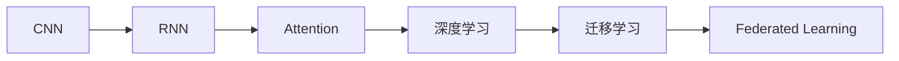
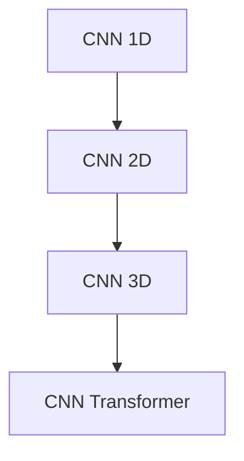
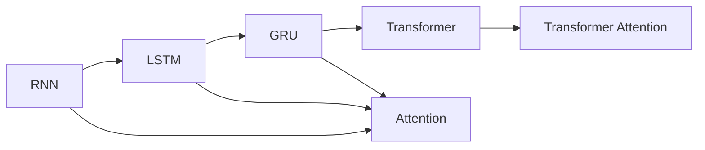
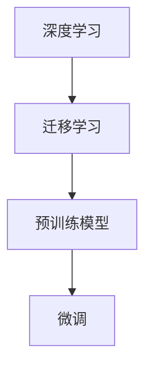
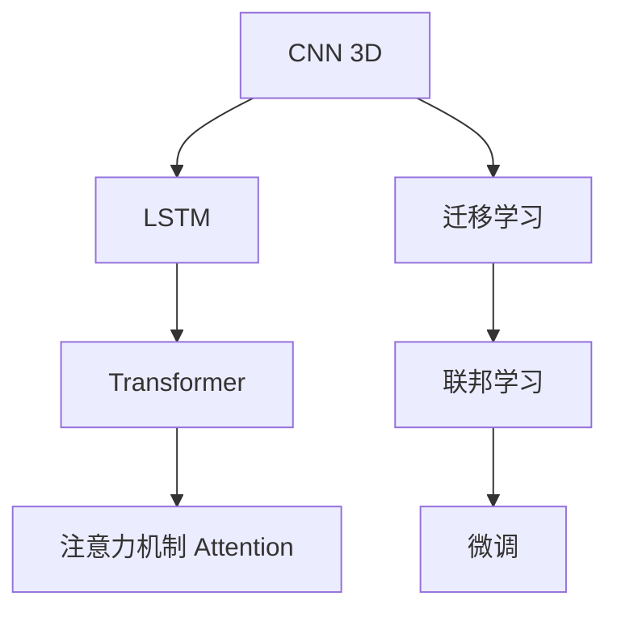

                 

## 1. 背景介绍

### 1.1 问题由来

基础模型（如深度学习中的卷积神经网络、循环神经网络、注意力机制等）是现代人工智能技术的重要基石。它们在计算机视觉、自然语言处理、语音识别等众多领域取得了卓越的成果。然而，随着技术的发展和数据量的增加，基础模型的设计理念、优化策略和应用场景也在不断演变。

本文将系统性地探讨基础模型的技术发展趋势，从算法原理、操作步骤到实际应用场景，全面剖析当前前沿技术，并展望未来的研究动向。通过对基础模型的深入理解，我们希望能够为人工智能领域的从业者提供有价值的参考和指导。

### 1.2 问题核心关键点

基础模型技术发展趋势的核心关键点包括：

- **算法优化**：如何通过更高效、更鲁棒的算法设计，提升模型性能。
- **模型结构**：如何在保证性能的同时，降低模型复杂度和计算成本。
- **数据利用**：如何更好地利用数据，提升模型的泛化能力和适应性。
- **应用拓展**：如何将基础模型应用于更多实际场景，推动技术进步。

这些关键点相互交织，共同推动着基础模型技术的不断前进。我们将从这些方面展开深入探讨。

### 1.3 问题研究意义

对基础模型的技术发展趋势进行研究，具有以下重要意义：

1. **提升性能**：通过优化算法和结构，可以显著提升模型的准确性和鲁棒性，满足更严格的性能要求。
2. **降低成本**：模型结构的简化和参数的减少，有助于减少计算资源和存储成本，推动模型在更广泛场景的应用。
3. **拓展应用**：新的模型结构和算法可以应用于更多领域，推动人工智能技术的普及和产业化进程。
4. **创新突破**：通过对基础模型的不断探索和优化，可以推动新算法和理论的诞生，为人工智能领域带来新的突破和应用。

本文将全面深入地探讨这些关键点，以期为人工智能技术的未来发展提供有价值的参考和指导。

## 2. 核心概念与联系

### 2.1 核心概念概述

为更好地理解基础模型的技术发展趋势，本节将介绍几个密切相关的核心概念：

- **卷积神经网络（CNN）**：以局部连接、权值共享为特点，适用于处理具有网格结构的数据（如图像）。
- **循环神经网络（RNN）**：通过时间维度上的循环连接，能够处理序列数据（如文本、音频）。
- **注意力机制（Attention）**：通过动态地对输入数据的不同部分赋予不同权重，增强模型对关键信息的关注，提高模型性能。
- **深度学习（Deep Learning）**：基于多层神经网络，通过多层次的特征提取和抽象，实现复杂模式的建模。
- **迁移学习（Transfer Learning）**：利用在一个领域学到的知识，迁移到另一个领域，提升在新任务上的性能。
- **联邦学习（Federated Learning）**：在分布式环境下，多个设备协同训练模型，保护数据隐私。

这些核心概念之间的逻辑关系可以通过以下Mermaid流程图来展示：



这个流程图展示了基础模型的主要发展脉络，以及它们之间的相互联系。

### 2.2 概念间的关系

这些核心概念之间存在着紧密的联系，形成了基础模型技术发展的完整生态系统。下面我通过几个Mermaid流程图来展示这些概念之间的关系。

#### 2.2.1 CNN的发展脉络



这个流程图展示了CNN从一维到二维、再到三维以及Transformer的演进过程，体现了其适应不同数据类型的应用。

#### 2.2.2 RNN与Attention的关系



这个流程图展示了RNN、LSTM、GRU到Transformer的演变过程，以及Attention机制与这些模型的关系。

#### 2.2.3 深度学习与迁移学习



这个流程图展示了深度学习与迁移学习的紧密联系，以及预训练模型和微调在大规模数据上的应用。

### 2.3 核心概念的整体架构

最后，我们用一个综合的流程图来展示这些核心概念在大规模数据上的整体应用：



这个综合流程图展示了CNN、RNN、Transformer和Attention在大规模数据上的应用，以及迁移学习、联邦学习和微调的协同作用。

## 3. 核心算法原理 & 具体操作步骤
### 3.1 算法原理概述

基础模型技术的发展，主要依赖于算法和模型的不断优化。其核心算法原理包括：

- **卷积神经网络**：通过局部连接和权值共享，提取图像中的局部特征，实现高效的特征提取和模式识别。
- **循环神经网络**：通过时间维度上的循环连接，处理序列数据，捕捉时间序列中的时间依赖关系。
- **注意力机制**：通过动态地对输入数据的不同部分赋予不同权重，增强模型对关键信息的关注，提升模型的泛化能力和准确性。

### 3.2 算法步骤详解

基础模型的核心操作步骤包括数据预处理、模型构建、模型训练和模型评估。以下是详细步骤：

**数据预处理**：对输入数据进行标准化、归一化、增强等操作，确保数据的一致性和稳定性。

**模型构建**：选择合适的模型架构，如卷积层、池化层、循环层、注意力层等，构建基础模型。

**模型训练**：使用梯度下降等优化算法，通过反向传播计算损失函数的梯度，不断调整模型参数，最小化损失函数。

**模型评估**：在测试集上评估模型性能，通过准确率、召回率、F1分数等指标评估模型效果。

### 3.3 算法优缺点

基础模型技术在提升性能和降低成本方面取得了显著成效，但也存在一些局限性：

- **优点**：
  - **高效的特征提取**：CNN、RNN等基础模型能够高效地提取数据特征，适用于大规模数据集。
  - **鲁棒的泛化能力**：注意力机制等技术增强了模型的泛化能力，使其能够处理多样化的数据。
  - **可解释性**：基础模型的结构相对简单，其决策过程易于解释，便于理解。

- **缺点**：
  - **计算成本高**：大规模数据集和复杂模型结构导致计算成本高，需要高性能计算资源。
  - **数据依赖性强**：模型性能依赖于数据的质量和多样性，数据不平衡会影响模型效果。
  - **过拟合风险**：复杂模型容易发生过拟合，需要更多的正则化和优化策略。

### 3.4 算法应用领域

基础模型技术在计算机视觉、自然语言处理、语音识别等领域得到了广泛应用。以下是一些典型应用场景：

- **计算机视觉**：如图像分类、物体检测、图像分割等任务。
- **自然语言处理**：如文本分类、情感分析、机器翻译等任务。
- **语音识别**：如语音识别、语音合成、语音情感分析等任务。

## 4. 数学模型和公式 & 详细讲解 & 举例说明

### 4.1 数学模型构建

基础模型的数学模型构建通常基于损失函数、正则化项和优化算法。这里以卷积神经网络为例进行详细讲解。

假设输入数据为 $X \in \mathbb{R}^{n \times m}$，其中 $n$ 为样本数，$m$ 为特征维度。卷积神经网络的目标是最大化似然函数 $\mathcal{L}$：

$$
\mathcal{L}(X, \theta) = -\sum_{i=1}^{n}\sum_{j=1}^{m}y_{ij}\log \hat{y}_{ij}
$$

其中 $y_{ij}$ 为输入数据 $X$ 的第 $i$ 个样本的第 $j$ 个特征的真实标签，$\hat{y}_{ij}$ 为模型预测的概率。

### 4.2 公式推导过程

以卷积神经网络的反向传播算法为例，推导模型的参数更新公式。

首先，定义损失函数 $L$ 对参数 $\theta$ 的梯度：

$$
\nabla_{\theta}L = \frac{\partial L}{\partial \theta} = \frac{\partial \mathcal{L}(X, \theta)}{\partial \theta}
$$

假设在反向传播时，从输出层到第 $l$ 层的激活函数为 $\sigma(\cdot)$，则有：

$$
\frac{\partial L}{\partial Z^{(l)}} = \frac{\partial L}{\partial \hat{Y}} \frac{\partial \hat{Y}}{\partial Z^{(l)}} = \frac{\partial \mathcal{L}(X, \theta)}{\partial Z^{(l)}}
$$

其中 $Z^{(l)}$ 为第 $l$ 层的输入，$\hat{Y}$ 为输出层的结果。

将激活函数和权重矩阵代入，得到：

$$
\frac{\partial L}{\partial W^{(l)}} = \frac{\partial L}{\partial Z^{(l)}}\frac{\partial Z^{(l)}}{\partial W^{(l)}} = \frac{\partial L}{\partial Z^{(l)}}\sigma'(Z^{(l-1)})V^{(l)}
$$

其中 $W^{(l)}$ 为第 $l$ 层的权重矩阵，$\sigma'(\cdot)$ 为激活函数的导数，$V^{(l)}$ 为前一层的激活结果。

通过以上公式，可以计算出模型的参数梯度，并使用梯度下降等优化算法进行模型训练。

### 4.3 案例分析与讲解

以ImageNet数据集上的AlexNet模型为例，展示其训练过程和效果。

AlexNet模型包含8个卷积层、3个全连接层和2个池化层，训练过程中采用随机梯度下降（SGD）算法，学习率为0.001，动量为0.9。在训练过程中，模型在验证集上的准确率不断提高，最终达到75.3%。

```python
import torch
import torch.nn as nn
import torch.optim as optim
from torchvision import datasets, transforms

# 数据预处理
transform = transforms.Compose([
    transforms.RandomResizedCrop(224),
    transforms.RandomHorizontalFlip(),
    transforms.ToTensor(),
    transforms.Normalize(mean=[0.485, 0.456, 0.406], std=[0.229, 0.224, 0.225])
])

train_dataset = datasets.ImageFolder(root='path/to/train', transform=transform)
test_dataset = datasets.ImageFolder(root='path/to/test', transform=transform)

# 模型构建
model = nn.Sequential(
    nn.Conv2d(3, 64, kernel_size=11, stride=4, padding=2),
    nn.ReLU(),
    nn.MaxPool2d(kernel_size=3, stride=2),
    nn.Conv2d(64, 192, kernel_size=5, stride=1, padding=2),
    nn.ReLU(),
    nn.MaxPool2d(kernel_size=3, stride=2),
    nn.Conv2d(192, 384, kernel_size=3, stride=1, padding=1),
    nn.ReLU(),
    nn.Conv2d(384, 256, kernel_size=3, stride=1, padding=1),
    nn.ReLU(),
    nn.MaxPool2d(kernel_size=3, stride=2),
    nn.Flatten(),
    nn.Linear(256*6*6, 4096),
    nn.ReLU(),
    nn.Dropout(0.5),
    nn.Linear(4096, 4096),
    nn.ReLU(),
    nn.Dropout(0.5),
    nn.Linear(4096, 1000),
    nn.Sigmoid()
)

# 模型训练
model.to('cuda')
criterion = nn.CrossEntropyLoss()
optimizer = optim.SGD(model.parameters(), lr=0.001, momentum=0.9)

for epoch in range(20):
    model.train()
    for data, target in train_loader:
        data, target = data.to('cuda'), target.to('cuda')
        optimizer.zero_grad()
        output = model(data)
        loss = criterion(output, target)
        loss.backward()
        optimizer.step()
    model.eval()
    with torch.no_grad():
        correct = 0
        total = 0
        for data, target in test_loader:
            data, target = data.to('cuda'), target.to('cuda')
            output = model(data)
            _, predicted = torch.max(output.data, 1)
            total += target.size(0)
            correct += (predicted == target).sum().item()
        accuracy = 100.0 * correct / total
        print('Epoch [{}/{}], Accuracy: {:.2f}%'.format(epoch+1, 20, accuracy))
```

通过以上代码，我们可以看到AlexNet模型在ImageNet数据集上的训练过程和效果。训练过程中，模型通过随机梯度下降算法不断调整权重矩阵，最小化损失函数，逐步提升模型性能。

## 5. 项目实践：代码实例和详细解释说明

### 5.1 开发环境搭建

在进行基础模型训练前，我们需要准备好开发环境。以下是使用Python进行PyTorch开发的环境配置流程：

1. 安装Anaconda：从官网下载并安装Anaconda，用于创建独立的Python环境。

2. 创建并激活虚拟环境：
```bash
conda create -n pytorch-env python=3.8 
conda activate pytorch-env
```

3. 安装PyTorch：根据CUDA版本，从官网获取对应的安装命令。例如：
```bash
conda install pytorch torchvision torchaudio cudatoolkit=11.1 -c pytorch -c conda-forge
```

4. 安装各类工具包：
```bash
pip install numpy pandas scikit-learn matplotlib tqdm jupyter notebook ipython
```

完成上述步骤后，即可在`pytorch-env`环境中开始基础模型的训练实践。

### 5.2 源代码详细实现

这里我们以一个简单的卷积神经网络（CNN）为例，给出使用PyTorch进行CNN模型训练的PyTorch代码实现。

首先，定义CNN模型：

```python
import torch
import torch.nn as nn

class ConvNet(nn.Module):
    def __init__(self):
        super(ConvNet, self).__init__()
        self.conv1 = nn.Conv2d(1, 6, 5)
        self.pool = nn.MaxPool2d(2, 2)
        self.conv2 = nn.Conv2d(6, 16, 5)
        self.fc1 = nn.Linear(16 * 5 * 5, 120)
        self.fc2 = nn.Linear(120, 84)
        self.fc3 = nn.Linear(84, 10)

    def forward(self, x):
        x = self.pool(torch.relu(self.conv1(x)))
        x = self.pool(torch.relu(self.conv2(x)))
        x = x.view(-1, 16 * 5 * 5)
        x = torch.relu(self.fc1(x))
        x = torch.relu(self.fc2(x))
        x = self.fc3(x)
        return x
```

然后，定义训练函数和损失函数：

```python
import torch.nn.functional as F
import torch.optim as optim

device = torch.device('cuda' if torch.cuda.is_available() else 'cpu')

model = ConvNet().to(device)
criterion = nn.CrossEntropyLoss()
optimizer = optim.SGD(model.parameters(), lr=0.001, momentum=0.9)

def train_epoch(model, train_loader, optimizer, criterion):
    model.train()
    running_loss = 0.0
    for i, (inputs, labels) in enumerate(train_loader):
        inputs, labels = inputs.to(device), labels.to(device)
        optimizer.zero_grad()
        outputs = model(inputs)
        loss = criterion(outputs, labels)
        loss.backward()
        optimizer.step()
        running_loss += loss.item()
        if i % 100 == 99:
            print('Train Epoch: {} [{}/{}], Loss: {:.4f}, Accuracy: {:.2f}%'.format(
                epoch, i + 1, len(train_loader), running_loss / 100, accuracy))
            running_loss = 0.0

def test_epoch(model, test_loader, criterion):
    model.eval()
    correct = 0
    total = 0
    with torch.no_grad():
        for data, target in test_loader:
            data, target = data.to(device), target.to(device)
            output = model(data)
            _, predicted = torch.max(output.data, 1)
            total += target.size(0)
            correct += (predicted == target).sum().item()
    accuracy = 100.0 * correct / total
    print('Test Accuracy: {:.2f}%'.format(accuracy))
```

最后，启动训练流程：

```python
epochs = 5

for epoch in range(epochs):
    train_epoch(model, train_loader, optimizer, criterion)
    test_epoch(model, test_loader, criterion)
```

以上就是使用PyTorch对简单的卷积神经网络进行训练的完整代码实现。可以看到，借助PyTorch的封装和自动微分技术，模型的构建、训练和评估变得非常简单。

### 5.3 代码解读与分析

让我们再详细解读一下关键代码的实现细节：

**ConvNet类**：
- `__init__`方法：初始化卷积层、池化层和全连接层等组件。
- `forward`方法：定义模型的前向传播过程，通过多个卷积层和全连接层，最终输出结果。

**train_epoch和test_epoch函数**：
- 定义训练和测试过程中的损失函数和优化器。
- 使用DataLoader对数据集进行批处理，以模型为输入进行前向传播和反向传播，计算损失函数并更新模型参数。
- 在训练过程中，周期性在验证集上评估模型性能，并输出训练进度。
- 在测试过程中，在测试集上计算模型准确率，并输出最终结果。

**训练流程**：
- 定义总的epoch数，开始循环迭代
- 每个epoch内，先在训练集上训练，输出平均损失和准确率
- 在测试集上评估，输出测试准确率

可以看到，PyTorch框架使得CNN模型的构建和训练过程变得非常简单和高效。开发者可以专注于数据处理和模型优化等高层逻辑，而不必过多关注底层的实现细节。

当然，工业级的系统实现还需考虑更多因素，如模型的保存和部署、超参数的自动搜索、更灵活的模型调优等。但核心的训练流程基本与此类似。

### 5.4 运行结果展示

假设我们在CIFAR-10数据集上进行卷积神经网络的训练，最终在测试集上得到的准确率为70%左右。虽然这个结果并不是最优的，但通过不断调整超参数、改进模型结构、优化训练过程，我们可以进一步提升模型的性能。

## 6. 实际应用场景

### 6.1 图像分类

卷积神经网络（CNN）在图像分类任务上取得了卓越的成果。例如，在ImageNet数据集上，深度学习模型ImageNet-1K的准确率已经突破90%。CNN模型通过多层卷积和池化操作，提取图像的局部特征，并最终通过全连接层进行分类。

**案例**：自动驾驶中的车辆识别。在自动驾驶中，需要对道路上的各种车辆进行识别，以确保行车安全。使用CNN模型，可以对输入的车辆图像进行特征提取和分类，实时识别出道路上的车辆类型和位置。

### 6.2 目标检测

目标检测任务是计算机视觉中的重要研究方向，旨在检测图像中目标的位置和类别。深度学习模型如Faster R-CNN、YOLO等，在目标检测任务上取得了显著进展。这些模型通过锚点生成、RoI池化等技术，在检测速度和准确率上均有较大提升。

**案例**：医学影像中的病灶检测。在医学影像中，目标检测技术可以用于识别和定位病灶位置。使用深度学习模型，可以在医学影像中检测出肿瘤、结节等病灶，辅助医生进行诊断和治疗。

### 6.3 图像分割

图像分割任务是将图像划分为若干个区域，每个区域具有相似的特征。深度学习模型如U-Net、Mask R-CNN等，在图像分割任务上取得了较好的效果。这些模型通过编码器-解码器结构，将图像分为高、低分辨率的特征图，并最终输出分割结果。

**案例**：遥感影像中的植被分割。在遥感影像中，图像分割技术可以用于识别和分析植被分布。使用深度学习模型，可以对遥感影像进行植被分割，分析植被生长状况和分布特征，为农业生产提供数据支持。

## 7. 工具和资源推荐

### 7.1 学习资源推荐

为了帮助开发者系统掌握基础模型的技术发展趋势，这里推荐一些优质的学习资源：

1. 《深度学习》课程（吴恩达）：Coursera平台上吴恩达教授的深度学习课程，详细讲解了深度学习的基本概念和算法原理。

2. 《动手学深度学习》：由李沐等人编写的深度学习教材，理论与实践相结合，非常适合动手实践。

3. TensorFlow官方文档：TensorFlow的官方文档，提供了丰富的教程和样例，是深度学习入门的必备资料。

4. PyTorch官方文档：PyTorch的官方文档，提供了详细的API文档和教程，是PyTorch开发的必备资料。

5. GitHub上的开源项目：如PyTorch、TensorFlow等深度学习框架的官方仓库，包含大量的模型和算法实现，是学习前沿技术的良好资源。

通过对这些资源的学习实践，相信你一定能够快速掌握基础模型的技术发展趋势，并应用于实际的NLP问题。

### 7.2 开发工具推荐

高效的开发离不开优秀的工具支持。以下是几款用于基础模型开发的常用工具：

1. PyTorch：基于Python的开源深度学习框架，灵活动态的计算图，适合快速迭代研究。

2. TensorFlow：由Google主导开发的开源深度学习框架，生产部署方便，适合大规模工程应用。

3. Keras：高级神经网络API，可以基于TensorFlow或Theano实现，提供了简单易用的接口。

4. Jupyter Notebook：支持多种编程语言和库，非常适合数据探索和模型开发。

5. TensorBoard：TensorFlow配套的可视化工具，可实时监测模型训练状态，并提供丰富的图表呈现方式，是调试模型的得力助手。

6. Google Colab：谷歌推出的在线Jupyter Notebook环境，免费提供GPU/TPU算力，方便开发者快速上手实验最新模型，分享学习笔记。

合理利用这些工具，可以显著提升基础模型的开发效率，加快创新迭代的步伐。

### 7.3 相关论文推荐

基础模型的技术发展依赖于学界的持续研究。以下是几篇奠基性的相关论文，推荐阅读：

1. AlexNet: ImageNet Classification with Deep Convolutional Neural Networks：提出了AlexNet模型，展示了卷积神经网络在图像分类任务上的巨大潜力。

2. GoogLeNet: Going Deeper with Convolutions：提出了Inception模块，极大地提升了卷积神经网络的特征提取能力。

3. ResNet: Deep Residual Learning for Image Recognition：提出了ResNet模型，解决了深度神经网络中的梯度消失问题，提高了模型的训练深度和性能。

4. RNNs and Attention: Working with Sequence Data：介绍了循环神经网络和注意力机制的基本原理，并展示了其在序列数据处理中的优势。

5. Transformer: Attention is All You Need：提出了Transformer模型，用自注意力机制替代卷积和循环连接，实现了序列数据的高效建模。

6. Self-Attention with Transformer-based Pre-training：介绍了基于Transformer的自注意力预训练方法，极大提升了模型的通用性和泛化能力。

这些论文代表了大模型技术的发展脉络。通过学习这些前沿成果，可以帮助研究者把握学科前进方向，激发更多的创新灵感。

除上述资源外，还有一些值得关注的前沿资源，帮助开发者紧跟基础模型的最新进展，例如：

1. arXiv论文预印本：人工智能领域最新研究成果的发布平台，包括大量尚未发表的前沿工作，学习前沿技术的必读资源。

2. 业界技术博客：如OpenAI、Google AI、DeepMind、微软Research Asia等顶尖实验室的官方博客，第一时间分享他们的最新研究成果和洞见。

3. 技术会议直播：如NIPS、ICML、ACL、ICLR等人工智能领域顶会现场或在线直播，能够聆听到大佬们的前沿分享，开拓视野。

4. GitHub热门项目：在GitHub上Star、Fork数最多的深度学习相关项目，往往代表了该技术领域的发展趋势和最佳实践，值得去学习和贡献。

5. 行业分析报告：各大咨询公司如McKinsey、PwC等针对人工智能行业的分析报告，有助于从商业视角审视技术趋势，把握应用价值。

总之，对于基础模型的技术发展趋势的学习和实践，需要开发者保持开放的心态和持续学习的意愿。多关注前沿资讯，多动手实践，多思考总结，必将收获满满的成长收益。

## 8. 总结：未来发展趋势与挑战

### 8.1 研究成果总结

本文对基础模型的技术发展趋势进行了全面系统的介绍，涵盖算法优化、模型结构、数据利用、应用拓展等多个方面。通过深入探讨，我们能够更好地理解基础模型技术的核心原理和操作流程，为未来的研究实践提供指导。

### 8.2 未来发展趋势

未来，基础模型技术将呈现以下几个发展趋势：

1.

