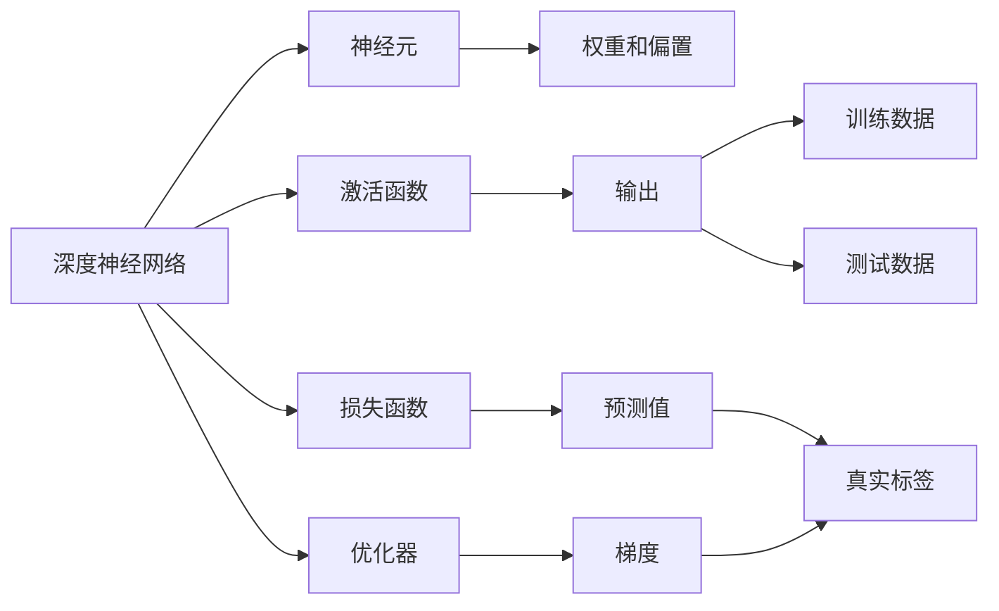
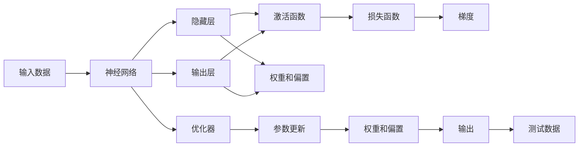

                 

# 基础模型的深度神经网络

> 关键词：深度神经网络,基础模型,算法原理,操作步骤,算法优缺点,算法应用领域

## 1. 背景介绍

### 1.1 问题由来

深度神经网络（Deep Neural Network, DNN）是当前机器学习和人工智能领域最为核心的技术之一。作为传统的多层感知器（Multi-layer Perceptron, MLP）的扩展和升级，深度神经网络通过多层非线性变换，可以从高维数据中自动学习到复杂、抽象的特征表示，解决了一系列传统机器学习算法难以应对的挑战。

然而，在实际应用中，深度神经网络的设计与实现往往复杂多变，需要具备一定的专业背景和理论基础。特别是对于初学者和研究人员，如何系统掌握深度神经网络的基础原理和实践技巧，是一个亟待解决的问题。

本文旨在以通俗易懂的方式，对深度神经网络的基础模型、核心算法原理和操作步骤进行全面系统的介绍，帮助读者理解和实践深度神经网络。

### 1.2 问题核心关键点

本节将重点阐述深度神经网络的基础模型和核心算法原理，包括网络结构、激活函数、损失函数、优化器等关键组件，并解释其工作机制和相互关系。通过系统化的讲解，帮助读者构建深度神经网络的知识框架，为其后续应用和实践打下坚实基础。

### 1.3 问题研究意义

深度神经网络作为人工智能领域的重要工具，广泛应用于图像识别、语音识别、自然语言处理、推荐系统、游戏AI等众多领域，极大地推动了科学计算和智能技术的进步。掌握深度神经网络的基础原理和实现方法，对从事人工智能、计算机视觉、自然语言处理等领域的科研人员和工程师，具有重要的学术价值和实际意义。

## 2. 核心概念与联系

### 2.1 核心概念概述

为更好地理解深度神经网络的基础模型和核心算法原理，本节将介绍几个密切相关的核心概念：

- 深度神经网络（DNN）：由多层非线性变换组成的前馈神经网络，可以处理高维非线性映射问题。
- 神经元（Neuron）：深度神经网络的基本单位，通过加权和激活实现输入-输出映射。
- 激活函数（Activation Function）：引入非线性变换，增强网络的表达能力。
- 损失函数（Loss Function）：衡量模型预测结果与真实标签之间的差异，指导模型优化。
- 优化器（Optimizer）：通过梯度下降等优化算法，最小化损失函数，调整网络参数。

### 2.2 概念间的关系

这些核心概念之间存在着紧密的联系，共同构成了深度神经网络的学习和优化框架。下面通过一个Mermaid流程图来展示它们之间的关系：



这个流程图展示了深度神经网络的核心组件及其相互关系：

1. 深度神经网络通过神经元进行输入-输出映射。
2. 激活函数引入非线性变换，增强网络的表达能力。
3. 损失函数衡量模型预测与真实标签之间的差异，指导模型优化。
4. 优化器通过梯度下降等算法，最小化损失函数，调整网络参数。
5. 权重和偏置是神经元的基本参数，影响神经元的输出。
6. 训练数据和测试数据是模型评估和优化过程中需要输入的数据集。
7. 真实标签和预测值是损失函数的输入，用于计算模型误差。
8. 梯度是优化器计算更新参数的依据，通过反向传播算法实现。

通过这个流程图，我们可以更清晰地理解深度神经网络的学习和优化过程。

### 2.3 核心概念的整体架构

最后，我们用一个综合的流程图来展示深度神经网络的基本架构及其核心组件之间的联系：



这个综合流程图展示了深度神经网络的基本架构及其核心组件之间的联系：

1. 输入数据进入神经网络。
2. 神经网络通过隐藏层进行特征提取和变换。
3. 隐藏层的激活函数引入非线性变换，增强网络的表达能力。
4. 输出层根据隐藏层的特征生成最终的预测值。
5. 损失函数计算模型预测与真实标签之间的差异，指导模型优化。
6. 梯度通过反向传播算法计算，用于优化器更新网络参数。
7. 优化器通过梯度下降等算法，最小化损失函数，调整权重和偏置。
8. 测试数据用于评估模型的泛化能力，辅助模型优化。

## 3. 核心算法原理 & 具体操作步骤
### 3.1 算法原理概述

深度神经网络的核心算法原理包括前向传播、反向传播和优化器的选择等关键步骤。下面将分别进行详细介绍。

### 3.2 算法步骤详解

**Step 1: 数据准备**
- 准备训练数据和测试数据，通常为图像、文本、音频等高维数据。
- 数据预处理：如归一化、标准化、分词、特征提取等。

**Step 2: 网络设计**
- 选择网络结构：包括层数、每层的神经元数量等。
- 激活函数选择：如ReLU、Sigmoid、Tanh等。
- 损失函数选择：根据任务类型，选择合适的损失函数，如交叉熵损失、均方误差损失等。

**Step 3: 模型训练**
- 初始化模型参数。
- 前向传播：输入数据经过神经网络的层层传递，得到预测值。
- 损失函数计算：将预测值与真实标签计算损失值。
- 反向传播：通过链式法则计算梯度，更新模型参数。
- 迭代优化：重复前向传播和反向传播过程，直至模型收敛。

**Step 4: 模型评估**
- 在测试数据上评估模型性能，如准确率、召回率、F1分数等。
- 根据评估结果调整模型参数，进行微调。

**Step 5: 模型应用**
- 将训练好的模型应用于实际问题中，进行预测和推理。

### 3.3 算法优缺点

深度神经网络在理论和实践中具有以下优点：
1. 强大的表达能力：通过多层非线性变换，能够处理高维非线性数据。
2. 鲁棒性：能够自动学习数据中的复杂结构，具有较强的泛化能力。
3. 可解释性：通过可视化工具，可以观察到模型在各层的特征表示，理解模型内部工作机制。

同时，深度神经网络也存在一些缺点：
1. 计算资源需求高：训练和推理过程中需要大量的计算资源，包括GPU、TPU等高性能设备。
2. 参数量大：网络参数多，容易过拟合，需要额外引入正则化等技术。
3. 训练复杂度高：需要调整多个超参数，如学习率、批大小等，需要一定的理论背景和实践经验。

### 3.4 算法应用领域

深度神经网络在众多领域得到了广泛应用，以下是几个典型的应用场景：

- 图像识别：通过卷积神经网络（Convolutional Neural Network, CNN）处理图像数据，实现图像分类、目标检测等任务。
- 语音识别：通过循环神经网络（Recurrent Neural Network, RNN）和卷积神经网络处理音频数据，实现语音识别和语音合成等任务。
- 自然语言处理：通过循环神经网络、长短时记忆网络（Long Short-Term Memory, LSTM）和Transformer等处理文本数据，实现文本分类、语言生成、机器翻译等任务。
- 推荐系统：通过神经网络模型处理用户行为数据，实现商品推荐、广告推荐等任务。
- 游戏AI：通过强化学习、神经网络等技术，构建智能游戏角色，提升游戏体验和智能化水平。

## 4. 数学模型和公式 & 详细讲解 & 举例说明

### 4.1 数学模型构建

本节将使用数学语言对深度神经网络的学习过程进行更加严格的刻画。

记深度神经网络为 $M = \{w, b\}$，其中 $w$ 为权重矩阵，$b$ 为偏置向量，$n_l$ 为隐藏层的神经元数量。设输入数据为 $x \in \mathbb{R}^{n_l}$，输出数据为 $y \in \mathbb{R}^k$。网络的前向传播过程如下：

$$
h^{[l]} = g(\mathbf{W}^{[l]} h^{[l-1]} + \mathbf{b}^{[l]})
$$

其中 $g(\cdot)$ 为激活函数，$\mathbf{W}^{[l]}$ 和 $\mathbf{b}^{[l]}$ 分别为第 $l$ 层的权重矩阵和偏置向量。

输出层的预测值为：

$$
\hat{y} = \mathbf{W}^{[L]} h^{[L-1]} + \mathbf{b}^{[L]}
$$

其中 $L$ 为网络的深度，$h^{[L-1]}$ 为最后一层的隐藏层输出。

假设输出层的损失函数为 $\ell(\hat{y}, y)$，则经验风险为：

$$
\mathcal{L}(w,b) = \frac{1}{N} \sum_{i=1}^N \ell(\hat{y}, y)
$$

### 4.2 公式推导过程

以下我们以二分类任务为例，推导交叉熵损失函数及其梯度的计算公式。

假设输出层的预测值 $\hat{y} = (h_1^{[L]}, h_2^{[L]}, \dots, h_k^{[L]})$，其中 $k$ 为类别数。则二分类交叉熵损失函数定义为：

$$
\ell(\hat{y}, y) = -\frac{1}{N}\sum_{i=1}^N [y_i\log \hat{y}_i + (1-y_i)\log (1-\hat{y}_i)]
$$

将其代入经验风险公式，得：

$$
\mathcal{L}(w,b) = -\frac{1}{N}\sum_{i=1}^N [y_i\log \hat{y}_i + (1-y_i)\log (1-\hat{y}_i)]
$$

根据链式法则，损失函数对权重 $w$ 和偏置 $b$ 的梯度为：

$$
\frac{\partial \mathcal{L}}{\partial w^{[l]}} = \frac{1}{N}\sum_{i=1}^N \frac{\partial \ell}{\partial h^{[l]}} \frac{\partial h^{[l]}}{\partial w^{[l]}}
$$

$$
\frac{\partial \mathcal{L}}{\partial b^{[l]}} = \frac{1}{N}\sum_{i=1}^N \frac{\partial \ell}{\partial h^{[l]}} \frac{\partial h^{[l]}}{\partial b^{[l]}}
$$

其中 $\frac{\partial \ell}{\partial h^{[l]}}$ 可以通过反向传播算法计算。

在得到损失函数的梯度后，即可带入参数更新公式，完成模型的迭代优化。重复上述过程直至收敛，最终得到适应训练数据的最优模型参数 $w^*$ 和 $b^*$。

### 4.3 案例分析与讲解

为了更好地理解深度神经网络的数学模型和公式推导，我们可以通过一个简单的案例来演示。

假设我们有一个二分类任务，训练数据集为 $(x_1, y_1), (x_2, y_2), \dots, (x_N, y_N)$，其中 $y_i \in \{0, 1\}$，$x_i \in \mathbb{R}^{n_l}$。

网络结构为三层全连接网络，输出层激活函数为sigmoid函数。则网络的前向传播过程如下：

$$
h^{[1]} = g(\mathbf{W}^{[1]} x + \mathbf{b}^{[1]})
$$

$$
h^{[2]} = g(\mathbf{W}^{[2]} h^{[1]} + \mathbf{b}^{[2]})
$$

$$
\hat{y} = \mathbf{W}^{[3]} h^{[2]} + \mathbf{b}^{[3]}
$$

其中 $g(\cdot)$ 为sigmoid函数。

假设输出层的损失函数为二分类交叉熵损失，则经验风险为：

$$
\mathcal{L}(\mathbf{W}^{[1]}, \mathbf{W}^{[2]}, \mathbf{W}^{[3]}, \mathbf{b}^{[1]}, \mathbf{b}^{[2]}, \mathbf{b}^{[3]}) = -\frac{1}{N}\sum_{i=1}^N [y_i\log \hat{y}_i + (1-y_i)\log (1-\hat{y}_i)]
$$

根据链式法则，损失函数对权重和偏置的梯度为：

$$
\frac{\partial \mathcal{L}}{\partial \mathbf{W}^{[1]}} = \frac{1}{N}\sum_{i=1}^N \frac{\partial \ell}{\partial h^{[1]}} \frac{\partial h^{[1]}}{\partial \mathbf{W}^{[1]}}
$$

$$
\frac{\partial \mathcal{L}}{\partial \mathbf{W}^{[2]}} = \frac{1}{N}\sum_{i=1}^N \frac{\partial \ell}{\partial h^{[2]}} \frac{\partial h^{[2]}}{\partial \mathbf{W}^{[2]}}
$$

$$
\frac{\partial \mathcal{L}}{\partial \mathbf{W}^{[3]}} = \frac{1}{N}\sum_{i=1}^N \frac{\partial \ell}{\partial h^{[3]}} \frac{\partial h^{[3]}}{\partial \mathbf{W}^{[3]}}
$$

$$
\frac{\partial \mathcal{L}}{\partial \mathbf{b}^{[1]}} = \frac{1}{N}\sum_{i=1}^N \frac{\partial \ell}{\partial h^{[1]}} \frac{\partial h^{[1]}}{\partial \mathbf{b}^{[1]}}
$$

$$
\frac{\partial \mathcal{L}}{\partial \mathbf{b}^{[2]}} = \frac{1}{N}\sum_{i=1}^N \frac{\partial \ell}{\partial h^{[2]}} \frac{\partial h^{[2]}}{\partial \mathbf{b}^{[2]}}
$$

$$
\frac{\partial \mathcal{L}}{\partial \mathbf{b}^{[3]}} = \frac{1}{N}\sum_{i=1}^N \frac{\partial \ell}{\partial h^{[3]}} \frac{\partial h^{[3]}}{\partial \mathbf{b}^{[3]}}
$$

通过上述公式，我们可以清晰地看到，深度神经网络的学习过程通过反向传播算法计算梯度，并利用优化器更新模型参数。通过不断迭代优化，模型可以逐步适应训练数据，并泛化到测试数据上。

## 5. 项目实践：代码实例和详细解释说明
### 5.1 开发环境搭建

在进行深度神经网络开发前，我们需要准备好开发环境。以下是使用Python进行PyTorch开发的环境配置流程：

1. 安装Anaconda：从官网下载并安装Anaconda，用于创建独立的Python环境。

2. 创建并激活虚拟环境：
```bash
conda create -n pytorch-env python=3.8 
conda activate pytorch-env
```

3. 安装PyTorch：根据CUDA版本，从官网获取对应的安装命令。例如：
```bash
conda install pytorch torchvision torchaudio cudatoolkit=11.1 -c pytorch -c conda-forge
```

4. 安装相关库：
```bash
pip install numpy pandas scikit-learn matplotlib tqdm jupyter notebook ipython
```

完成上述步骤后，即可在`pytorch-env`环境中开始深度神经网络开发。

### 5.2 源代码详细实现

这里我们以一个简单的图像分类任务为例，给出使用PyTorch进行深度神经网络开发的PyTorch代码实现。

首先，定义数据加载函数：

```python
import torch
from torchvision import datasets, transforms

def data_loader(batch_size=64):
    train_dataset = datasets.CIFAR10(root='data', train=True, download=True, transform=transforms.ToTensor())
    test_dataset = datasets.CIFAR10(root='data', train=False, download=True, transform=transforms.ToTensor())
    train_loader = torch.utils.data.DataLoader(train_dataset, batch_size=batch_size, shuffle=True)
    test_loader = torch.utils.data.DataLoader(test_dataset, batch_size=batch_size, shuffle=False)
    return train_loader, test_loader
```

然后，定义神经网络模型：

```python
import torch.nn as nn
import torch.nn.functional as F

class Net(nn.Module):
    def __init__(self):
        super(Net, self).__init__()
        self.conv1 = nn.Conv2d(3, 6, 5)
        self.pool = nn.MaxPool2d(2, 2)
        self.conv2 = nn.Conv2d(6, 16, 5)
        self.fc1 = nn.Linear(16 * 5 * 5, 120)
        self.fc2 = nn.Linear(120, 84)
        self.fc3 = nn.Linear(84, 10)
    
    def forward(self, x):
        x = self.pool(F.relu(self.conv1(x)))
        x = self.pool(F.relu(self.conv2(x)))
        x = x.view(-1, 16 * 5 * 5)
        x = F.relu(self.fc1(x))
        x = F.relu(self.fc2(x))
        x = self.fc3(x)
        return x
```

接着，定义训练和评估函数：

```python
from torch.optim import SGD

def train_model(model, train_loader, test_loader, num_epochs, batch_size=64):
    criterion = nn.CrossEntropyLoss()
    optimizer = SGD(model.parameters(), lr=0.001, momentum=0.9)
    
    for epoch in range(num_epochs):
        model.train()
        for data, target in train_loader:
            data, target = data.to(device), target.to(device)
            optimizer.zero_grad()
            output = model(data)
            loss = criterion(output, target)
            loss.backward()
            optimizer.step()
            
        model.eval()
        correct = 0
        total = 0
        with torch.no_grad():
            for data, target in test_loader:
                data, target = data.to(device), target.to(device)
                output = model(data)
                _, predicted = torch.max(output.data, 1)
                total += target.size(0)
                correct += (predicted == target).sum().item()
        print(f'Epoch {epoch+1}, accuracy: {correct/total*100:.2f}%')

    print('Final accuracy:', correct/total*100)
```

最后，启动训练流程并在测试集上评估：

```python
device = torch.device('cuda' if torch.cuda.is_available() else 'cpu')
train_loader, test_loader = data_loader(batch_size=64)

num_epochs = 10
train_model(model, train_loader, test_loader, num_epochs)
```

以上就是使用PyTorch进行深度神经网络开发的完整代码实现。可以看到，通过构建PyTorch模型，我们能够轻松实现神经网络的设计和训练过程。

### 5.3 代码解读与分析

让我们再详细解读一下关键代码的实现细节：

**数据加载函数**：
- 通过PyTorch的`datasets`模块加载CIFAR-10数据集，并应用`transforms`模块对图像进行归一化处理。
- 创建训练集和测试集的数据加载器，支持批处理和随机打乱。

**神经网络模型**：
- 定义神经网络结构，包括卷积层、池化层和全连接层。
- 使用ReLU激活函数和Softmax输出层。
- 使用PyTorch的`nn.Module`基类定义模型。

**训练函数**：
- 定义交叉熵损失函数和随机梯度下降优化器。
- 使用模型进行前向传播和反向传播，更新模型参数。
- 在测试集上评估模型性能。

**训练流程**：
- 在GPU上加载数据，设置训练函数。
- 循环迭代训练模型，并记录训练集上的精度。
- 在测试集上评估模型性能，输出最终结果。

可以看到，通过PyTorch的高级API，我们能够轻松实现深度神经网络的开发和训练过程，大大提高了编程效率。

## 6. 实际应用场景
### 6.1 问题由来

深度神经网络在实际应用中已经展示了强大的性能，被广泛应用于图像识别、语音识别、自然语言处理、推荐系统、游戏AI等众多领域。本文将通过几个典型应用场景，展示深度神经网络的基础模型和技术原理。

### 6.2 案例分析与讲解

**图像识别**
- 通过卷积神经网络（CNN）处理图像数据，实现图像分类、目标检测等任务。CNN通过卷积层和池化层提取图像特征，并通过全连接层进行分类。深度神经网络在图像识别任务中表现优异，如AlexNet、VGG、ResNet等模型均取得了SOTA性能。

**语音识别**
- 通过循环神经网络（RNN）和卷积神经网络处理音频数据，实现语音识别和语音合成等任务。RNN通过时间递归实现音频序列建模，而CNN则用于提取音频特征。深度神经网络在语音识别领域也取得了显著成果，如TIMIT、LibriSpeech等数据集上，深度神经网络模型显著优于传统方法。

**自然语言处理**
- 通过循环神经网络、长短时记忆网络（LSTM）和Transformer等处理文本数据，实现文本分类、语言生成、机器翻译等任务。深度神经网络在自然语言处理领域展示了强大的建模能力，如BERT、GPT等模型在多项NLP任务上取得了SOTA成绩。

**推荐系统**
- 通过神经网络模型处理用户行为数据，实现商品推荐、广告推荐等任务。深度神经网络通过多层非线性变换，可以更好地捕捉用户行为中的复杂关联，提升推荐效果。

**游戏AI**
- 通过强化学习、神经网络等技术，构建智能游戏角色，提升游戏体验和智能化水平。深度神经网络在游戏AI领域取得了巨大成功，如AlphaGo、Dota AI等模型，展示了深度学习在复杂决策任务中的强大能力。

### 6.3 未来应用展望

深度神经网络作为人工智能的重要技术手段，将在未来继续发挥关键作用。以下是对未来应用场景的展望：

1. **自动驾驶**
   - 通过深度神经网络实现环境感知、路径规划和行为决策，推动自动驾驶技术的发展。深度神经网络在图像识别和语音识别等领域已展示了强大的感知能力，未来有望进一步应用于自动驾驶。

2. **医疗影像分析**
   - 通过深度神经网络处理医疗影像数据，实现疾病诊断、病理分析等任务。深度神经网络在医学影像领域展示出强大的图像识别能力，能够快速准确地诊断疾病。

3. **智能家居**
   - 通过深度神经网络实现智能语音交互、环境感知等任务，提升家居智能水平。深度神经网络在自然语言处理和智能语音识别领域已展示了显著成果，未来有望进一步应用于智能家居。

4. **金融风控**
   - 通过深度神经网络处理金融数据，实现风险评估、欺诈检测等任务。深度神经网络在金融领域展示了强大的数据处理能力，能够有效防范金融风险。

5. **智能制造**
   - 通过深度神经网络实现工业设备监控、生产流程优化等任务，推动智能制造的发展。深度神经网络在图像识别和信号处理等领域已展示出强大的数据处理能力，未来有望进一步应用于智能制造。

总之，深度神经网络的基础模型和核心算法原理具有广泛的应用前景，将在未来继续推动人工智能技术的发展。

## 7. 工具和资源推荐
### 7.1 学习资源推荐

为了帮助开发者系统掌握深度神经网络的基础原理和实践技巧，以下是一些优质的学习资源：

1. 《深度学习》系列书籍：由Ian Goodfellow、Yoshua Bengio和Aaron Courville合著，全面介绍深度神经网络的基本概念和应用。

2. CS231n《卷积神经网络》课程：斯坦福大学开设的深度学习课程，涵盖卷积神经网络的基本原理和实践技巧。

3. CS224d《序列模型》课程：斯坦福大学开设的深度学习课程，涵盖循环神经网络和Transformer等序列模型。

4. PyTorch官方文档：PyTorch的官方文档，提供了丰富的神经网络模型和优化器，是新手上手的必备资源。

5. TensorFlow官方文档：TensorFlow的官方文档，涵盖了深度神经网络的基本概念和应用技巧。

6. Fast.ai深度学习课程：由Jeremy Howard和Rachel Thomas合著，面向非专业开发者的入门课程，结合

