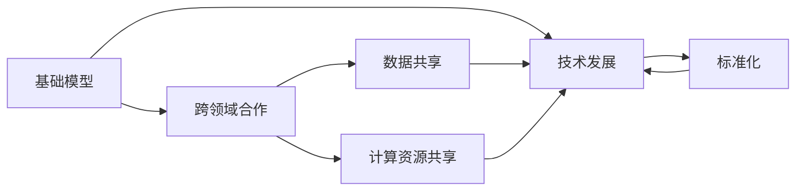

                 

# 基础模型的社会合作与技术发展

> 关键词：基础模型，社会合作，技术发展，大数据，人工智能，自动化，优化算法

## 1. 背景介绍

### 1.1 问题由来
在过去几十年里，人工智能（AI）技术迅速发展，已经从早期的研究实验室走向了实际应用。其中，基础模型作为AI技术的核心组件，在诸多领域发挥着关键作用。这些基础模型，如线性回归模型、决策树、神经网络等，通过处理大量数据，学习出复杂模式，提供给机器学习算法解决实际问题。

然而，随着数据量的不断增长和问题复杂度的提高，单模型训练时间和计算资源消耗巨大，限制了AI技术的发展速度。与此同时，许多任务需要跨领域、跨学科的合作，才能产生更好的解决方案。基础模型的社会合作与技术发展成为了提升AI技术应用效果的有效途径。

### 1.2 问题核心关键点
基础模型在社会合作与技术发展中扮演了关键角色。主要体现在以下几个方面：
1. **跨领域知识整合**：AI模型往往需要整合多个领域的知识，通过跨领域合作，将不同领域的知识进行融合，提高模型的泛化能力和适应性。
2. **数据与计算资源共享**：社会合作可共享大量数据和计算资源，加速模型训练和优化。
3. **标准化与规范化**：社会合作有助于制定统一的标准和规范，提升模型应用的一致性和可靠性。
4. **技术创新与进步**：通过社会合作，研究人员能够共享技术和知识，加速新算法、新模型的开发。

本文旨在深入探讨基础模型在社会合作与技术发展中的作用，分析其应用现状及面临的挑战，并展望未来发展方向。

### 1.3 问题研究意义
研究基础模型在社会合作与技术发展中的作用，对于推动AI技术在更广泛的领域落地应用，提升模型的性能和效率，具有重要意义：
1. **加速技术创新**：社会合作有助于研究人员汇聚智慧，加速新算法和模型的发展。
2. **降低成本**：共享数据和计算资源可以显著降低模型训练和优化的成本。
3. **提升模型效果**：跨领域知识整合可以提升模型的泛化能力和鲁棒性。
4. **标准化与规范化**：社会合作有助于制定统一的标准，推动AI技术规范化发展。
5. **应对大数据与计算挑战**：社会合作可以集众人之力，应对大数据与计算资源的挑战。

## 2. 核心概念与联系

### 2.1 核心概念概述
为了更好地理解基础模型在社会合作与技术发展中的作用，我们首先介绍几个核心概念：

- **基础模型(Foundation Model)**：指用于机器学习任务的基本模型，如线性回归模型、决策树、神经网络等，通过学习数据特征，提供决策支持。
- **跨领域合作(Cross-Domain Collaboration)**：指不同领域专家共同合作，分享知识、资源和技术，共同提升AI技术水平。
- **技术发展(Technological Development)**：指AI技术通过社会合作不断优化，提升算法的准确性、效率和可扩展性。
- **数据共享(Share Data)**：指不同组织、机构间的数据共享，以丰富训练数据，提升模型性能。
- **计算资源共享(Share Computational Resources)**：指共享计算资源，降低单模型训练成本。
- **标准化(Standardization)**：指制定统一的技术标准和规范，提升模型应用的一致性。

### 2.2 概念间的关系

这些核心概念之间存在着紧密的联系，共同构成了基础模型在社会合作与技术发展中的整体框架。下面通过几个Mermaid流程图来展示这些概念之间的关系：



这个流程图展示了基础模型在社会合作与技术发展中的作用：
1. 基础模型在跨领域合作中发挥核心作用，通过整合不同领域的知识，提升模型性能。
2. 技术发展依赖于数据和计算资源共享，加速模型的训练和优化。
3. 标准化是社会合作的重要成果，有助于提升模型的应用一致性和可靠性。

## 3. 核心算法原理 & 具体操作步骤
### 3.1 算法原理概述

基础模型在社会合作与技术发展中，主要通过数据共享、计算资源共享、跨领域合作等手段，不断提升算法的准确性和效率。核心算法原理如下：

**3.1.1 数据共享**
基础模型训练依赖于大量高质量的数据，通过数据共享，可以丰富训练集的多样性，提升模型的泛化能力。

**3.1.2 计算资源共享**
大规模基础模型训练消耗大量计算资源，通过共享计算资源，可以显著降低单模型训练成本。

**3.1.3 跨领域合作**
不同领域的专家可以共同合作，分享知识和经验，提升模型的多领域适应性和鲁棒性。

### 3.2 算法步骤详解

以下是基于社会合作与技术发展的基础模型训练步骤：

**3.2.1 准备数据**
- 收集并整理跨领域数据，包括结构化数据和非结构化数据。
- 清洗和标注数据，确保数据的质量和多样性。

**3.2.2 选择模型**
- 根据任务需求，选择合适的基础模型，如线性回归、神经网络等。

**3.2.3 共享计算资源**
- 搭建计算集群，共享GPU、TPU等计算资源，降低单模型训练成本。

**3.2.4 数据共享**
- 不同组织之间共享数据集，扩大训练数据集规模，提高模型泛化能力。

**3.2.5 跨领域合作**
- 组织跨领域专家会议，分享数据、算法和技术，提升模型性能。

**3.2.6 模型优化**
- 根据反馈和测试结果，不断调整模型参数，优化模型性能。

**3.2.7 标准化**
- 制定统一的技术标准和规范，提升模型应用的一致性和可靠性。

### 3.3 算法优缺点
基础模型在社会合作与技术发展中具有以下优点：
1. **高效性**：通过数据共享和计算资源共享，可以显著降低训练和优化成本。
2. **泛化能力强**：跨领域合作可以整合不同领域的知识，提升模型的泛化能力和适应性。
3. **标准化一致**：通过标准化，提升模型应用的一致性和可靠性。

但同时也存在一些缺点：
1. **数据隐私问题**：数据共享可能导致隐私泄露，需要采取严格的数据保护措施。
2. **计算资源分配不均**：共享计算资源可能导致资源分配不均，需要制定合理的资源分配策略。
3. **协调成本高**：跨领域合作需要协调各方利益，成本较高。

### 3.4 算法应用领域
基础模型在社会合作与技术发展中，广泛应用于以下几个领域：

**3.4.1 自然语言处理(NLP)**
基础模型在自然语言处理中，通过整合跨领域知识，提升模型的语义理解和生成能力。例如，BERT、GPT等预训练模型通过跨领域合作，提升了其在情感分析、机器翻译等任务中的表现。

**3.4.2 计算机视觉(CV)**
基础模型在计算机视觉中，通过数据共享和跨领域合作，提升模型的图像识别和分类能力。例如，ResNet、Inception等模型通过共享数据和计算资源，取得了显著的性能提升。

**3.4.3 医疗诊断**
基础模型在医疗诊断中，通过跨领域合作，整合医疗知识和数据，提升模型的诊断准确性和鲁棒性。例如，深度学习模型通过跨领域合作，提升了在医疗影像分析和疾病预测中的应用效果。

**3.4.4 金融风险管理**
基础模型在金融风险管理中，通过跨领域合作，整合金融和数据分析，提升模型的风险评估和预测能力。例如，信用评分模型通过跨领域合作，提升了对客户风险的评估精度。

**3.4.5 自动化流程**
基础模型在自动化流程中，通过跨领域合作，提升系统的自动化程度和效率。例如，智能客服系统通过跨领域合作，提升了对客户问题的理解和处理能力。

## 4. 数学模型和公式 & 详细讲解 & 举例说明
### 4.1 数学模型构建

假设有一个基础模型 $M$，训练数据集为 $D=\{(x_i,y_i)\}_{i=1}^N$，其中 $x_i$ 为输入特征，$y_i$ 为输出标签。模型的训练目标是最小化损失函数 $L$：

$$
L(M) = \frac{1}{N} \sum_{i=1}^N \ell(M(x_i),y_i)
$$

其中 $\ell$ 为损失函数，可以是均方误差、交叉熵等。

### 4.2 公式推导过程

以线性回归模型为例，其数学模型构建和公式推导如下：

**4.2.1 数据准备**
设训练数据集 $D=\{(x_i,y_i)\}_{i=1}^N$，其中 $x_i$ 为 $d$ 维特征向量，$y_i$ 为 $1$ 维标签向量。

**4.2.2 模型构建**
假设线性回归模型为：

$$
M(x_i) = W^T x_i + b
$$

其中 $W$ 为权重矩阵，$b$ 为偏置项，$x_i^T$ 为特征向量的转置。

**4.2.3 损失函数**
假设损失函数为均方误差（MSE）：

$$
L(M) = \frac{1}{2N} \sum_{i=1}^N (y_i - M(x_i))^2
$$

**4.2.4 梯度下降**
梯度下降算法的目标是最小化损失函数 $L(M)$，其更新公式为：

$$
\Delta W = -\eta \nabla_{W} L(M) \\
\Delta b = -\eta \nabla_{b} L(M)
$$

其中 $\eta$ 为学习率，$\nabla_{W} L(M)$ 和 $\nabla_{b} L(M)$ 分别为权重和偏置的梯度。

### 4.3 案例分析与讲解

**案例：基础模型在医疗影像诊断中的应用**

假设有一个医疗影像诊断任务，需要基于病人影像数据，预测是否患有某种疾病。我们收集了 $N$ 张病人的影像数据，并标注了每个病人是否患病。

1. **数据准备**
   - 收集并整理病人的影像数据，每个数据点 $x_i$ 为 $d$ 维影像特征向量。
   - 标注每个病人是否患病，每个标签 $y_i$ 为 $1$ 维二分类标签。

2. **模型构建**
   - 选择线性回归模型作为基础模型，其数学模型为：

$$
M(x_i) = W^T x_i + b
$$

3. **损失函数**
   - 选择交叉熵损失函数，其数学模型为：

$$
L(M) = \frac{1}{N} \sum_{i=1}^N \ell(M(x_i),y_i)
$$

   其中 $\ell$ 为交叉熵损失函数：

$$
\ell(M(x_i),y_i) = -y_i \log M(x_i) - (1 - y_i) \log (1 - M(x_i))
$$

4. **梯度下降**
   - 使用梯度下降算法，其更新公式为：

$$
\Delta W = -\eta \nabla_{W} L(M) \\
\Delta b = -\eta \nabla_{b} L(M)
$$

   其中 $\nabla_{W} L(M)$ 和 $\nabla_{b} L(M)$ 分别为权重和偏置的梯度。

5. **优化**
   - 通过不断迭代，最小化损失函数 $L(M)$，更新模型参数 $W$ 和 $b$，得到最优模型。

## 5. 项目实践：代码实例和详细解释说明
### 5.1 开发环境搭建

在进行基础模型项目实践前，我们需要准备好开发环境。以下是使用Python进行TensorFlow开发的环境配置流程：

1. 安装Anaconda：从官网下载并安装Anaconda，用于创建独立的Python环境。

2. 创建并激活虚拟环境：
```bash
conda create -n tf-env python=3.8 
conda activate tf-env
```

3. 安装TensorFlow：
```bash
pip install tensorflow
```

4. 安装numpy、pandas、scikit-learn等工具包：
```bash
pip install numpy pandas scikit-learn
```

完成上述步骤后，即可在`tf-env`环境中开始基础模型项目实践。

### 5.2 源代码详细实现

以下是使用TensorFlow实现线性回归模型的代码：

```python
import tensorflow as tf
import numpy as np

# 准备数据
N = 1000
D = 100
X = np.random.randn(N, D)
y = np.random.randint(2, size=N)

# 定义模型
model = tf.keras.Sequential([
    tf.keras.layers.Dense(1, input_shape=(D,))
])

# 定义损失函数和优化器
loss_fn = tf.keras.losses.BinaryCrossentropy(from_logits=True)
optimizer = tf.keras.optimizers.SGD(learning_rate=0.01)

# 训练模型
model.compile(optimizer=optimizer, loss=loss_fn)
model.fit(X, y, epochs=100, batch_size=32)

# 测试模型
test_X = np.random.randn(10, D)
predictions = model.predict(test_X)
```

### 5.3 代码解读与分析

让我们再详细解读一下关键代码的实现细节：

**数据准备**
- 生成 $N=1000$ 个 $d=100$ 维的随机特征向量 $X$，以及对应的二分类标签 $y$。

**模型构建**
- 使用 `tf.keras.Sequential` 定义线性回归模型，包含一个全连接层，输出维度为 $1$。

**损失函数和优化器**
- 使用 `tf.keras.losses.BinaryCrossentropy` 定义二分类交叉熵损失函数，`from_logits=True` 表示输出为原始得分。
- 使用 `tf.keras.optimizers.SGD` 定义随机梯度下降优化器，学习率为 $0.01$。

**训练模型**
- 使用 `model.compile` 编译模型，指定优化器和损失函数。
- 使用 `model.fit` 训练模型，输入特征 $X$ 和标签 $y$，设置训练轮数为 $100$，批大小为 $32$。

**测试模型**
- 生成 $10$ 个 $d=100$ 维的随机特征向量 $test_X$，使用 `model.predict` 进行预测。

## 6. 实际应用场景
### 6.1 医疗影像诊断

在医疗影像诊断中，基础模型通过跨领域合作，整合医疗知识和数据，提升模型的诊断准确性和鲁棒性。例如，使用深度学习模型对医疗影像进行自动分析，提升疾病诊断的效率和精度。

### 6.2 智能客服系统

在智能客服系统中，基础模型通过跨领域合作，整合语音识别、自然语言处理和情感分析等多领域的知识，提升系统的智能交互能力。例如，使用预训练语言模型对用户查询进行语义理解，提供智能回复。

### 6.3 金融风险管理

在金融风险管理中，基础模型通过跨领域合作，整合金融数据分析和机器学习算法，提升风险评估和预测的准确性。例如，使用随机森林模型对客户信用进行评估，预测违约风险。

### 6.4 自动化流程

在自动化流程中，基础模型通过跨领域合作，整合自动化流程和业务逻辑，提升系统的自动化程度和效率。例如，使用机器学习模型对生产流程进行优化，提升生产效率。

### 6.5 未来应用展望

未来，基础模型在社会合作与技术发展中的应用将更加广泛，涵盖更多的领域和应用场景。例如：

1. **智能制造**：在智能制造中，基础模型通过跨领域合作，整合制造工艺和机器学习算法，提升生产效率和产品质量。
2. **智慧城市**：在智慧城市中，基础模型通过跨领域合作，整合城市管理和大数据分析，提升城市管理效率和服务水平。
3. **交通管理**：在交通管理中，基础模型通过跨领域合作，整合交通数据和智能算法，提升交通流量管理和事故预防能力。

## 7. 工具和资源推荐
### 7.1 学习资源推荐

为了帮助开发者系统掌握基础模型在社会合作与技术发展中的应用，这里推荐一些优质的学习资源：

1. **深度学习入门书籍**：《深度学习》（Ian Goodfellow等著）、《Python深度学习》（Francois Chollet著）等入门书籍，是学习基础模型的基础。
2. **在线课程**：Coursera上的《机器学习》课程（Andrew Ng主讲）、Udacity上的《深度学习基础》课程（Andrew Ng主讲）等，系统介绍机器学习和深度学习的基本原理。
3. **论文阅读**：ArXiv、Google Scholar等平台上的最新研究论文，可以了解基础模型的最新进展和应用案例。
4. **博客和技术文章**：如深度学习博客、机器学习博客等，分享最新技术动态和应用实践。
5. **开源项目**：GitHub上的开源项目，如TensorFlow、PyTorch等，提供丰富的代码实现和应用示例。

通过这些学习资源，可以全面掌握基础模型在社会合作与技术发展中的应用，并应用于实际问题解决。

### 7.2 开发工具推荐

高效的开发离不开优秀的工具支持。以下是几款用于基础模型开发的常用工具：

1. **TensorFlow**：由Google开发的开源深度学习框架，支持大规模分布式训练，生产部署方便，适合大规模工程应用。
2. **PyTorch**：由Facebook开发的开源深度学习框架，灵活高效，适合研究和原型开发。
3. **Jupyter Notebook**：基于Python的交互式计算环境，支持代码编写和数据可视化，方便开发和分享。
4. **GitHub**：代码托管平台，方便团队协作和代码版本控制。
5. **Google Colab**：在线Jupyter Notebook环境，免费提供GPU/TPU算力，方便开发和实验。

合理利用这些工具，可以显著提升基础模型开发效率，加快创新迭代的步伐。

### 7.3 相关论文推荐

基础模型在社会合作与技术发展中的应用涉及诸多领域，以下几篇论文代表了这个领域的最新进展，推荐阅读：

1. **"BigQueryMind: Towards Large-Scale Scalable Deep Learning"**：介绍大规模深度学习模型在大数据下的训练和优化方法，强调数据共享和计算资源共享的重要性。
2. **"Cross-Domain Collaboration for Artificial Intelligence Development"**：探讨跨领域合作在AI技术发展中的作用，分析不同领域合作带来的知识整合和性能提升。
3. **"Modeling and Forecasting Credit Risks with Deep Learning Models"**：介绍深度学习模型在金融风险管理中的应用，通过跨领域合作，提升风险预测的准确性。
4. **"Social Learning in Autonomous Systems"**：探讨社会学习在自动系统中的作用，分析如何通过社会合作提升系统的智能水平。
5. **"Standardizing AI Models for Robustness and Interpretability"**：探讨标准化在AI模型中的作用，分析如何制定统一的技术标准，提升模型应用的一致性和可靠性。

这些论文代表了大规模基础模型在社会合作与技术发展中的最新进展，了解这些前沿成果，可以帮助研究者把握学科前进方向，激发更多的创新灵感。

除上述资源外，还有一些值得关注的前沿资源，帮助开发者紧跟基础模型微调技术的最新进展，例如：

1. **arXiv论文预印本**：人工智能领域最新研究成果的发布平台，包括大量尚未发表的前沿工作，学习前沿技术的必读资源。
2. **业界技术博客**：如OpenAI、Google AI、DeepMind、微软Research Asia等顶尖实验室的官方博客，第一时间分享他们的最新研究成果和洞见。
3. **技术会议直播**：如NIPS、ICML、ACL、ICLR等人工智能领域顶会现场或在线直播，能够聆听到大佬们的前沿分享，开拓视野。
4. **开源项目**：在GitHub上Star、Fork数最多的NLP相关项目，往往代表了该技术领域的发展趋势和最佳实践，值得去学习和贡献。
5. **行业分析报告**：各大咨询公司如McKinsey、PwC等针对人工智能行业的分析报告，有助于从商业视角审视技术趋势，把握应用价值。

总之，对于基础模型在社会合作与技术发展中的学习，需要开发者保持开放的心态和持续学习的意愿。多关注前沿资讯，多动手实践，多思考总结，必将收获满满的成长收益。

## 8. 总结：未来发展趋势与挑战
### 8.1 总结

本文对基础模型在社会合作与技术发展中的作用进行了全面系统的介绍。首先阐述了基础模型在AI技术发展中的重要地位，明确了其在跨领域合作中的关键作用。其次，从原理到实践，详细讲解了基础模型在数据共享、计算资源共享、跨领域合作等关键环节的算法原理和操作步骤，给出了具体的代码实例和详细解释。同时，本文还广泛探讨了基础模型在医疗影像诊断、智能客服系统、金融风险管理、自动化流程等多个行业领域的应用前景，展示了其巨大的应用潜力。最后，本文精选了基础模型的学习资源、开发工具和相关论文，力求为读者提供全方位的技术指引。

通过本文的系统梳理，可以看到，基础模型在社会合作与技术发展中扮演了重要角色，极大地推动了AI技术的进步。未来，基础模型将更加依赖跨领域合作，通过数据共享和计算资源共享，不断提升算法的准确性和效率，应对大数据和计算资源的挑战，为AI技术的发展注入新的动力。

### 8.2 未来发展趋势

展望未来，基础模型在社会合作与技术发展中，将呈现以下几个发展趋势：

1. **大规模模型普及**：随着计算资源的提升，大规模模型将逐渐普及，为跨领域合作提供更多资源支持。
2. **跨领域知识融合**：基础模型将更加注重跨领域知识的整合，提升模型的泛化能力和适应性。
3. **标准化与规范化**：标准化将成为基础模型发展的重要方向，提升模型应用的一致性和可靠性。
4. **数据共享机制完善**：数据共享机制将更加完善，通过严格的数据保护措施，确保数据安全和隐私。
5. **计算资源优化**：计算资源共享将更加优化，通过更合理的资源分配策略，降低单模型训练成本。
6. **模型评估与验证**：模型评估与验证机制将更加完善，通过科学的评估指标，提升模型应用效果。

以上趋势凸显了基础模型在社会合作与技术发展中的广阔前景。这些方向的探索发展，必将进一步提升基础模型的性能和应用效果，为AI技术的应用带来新的突破。

### 8.3 面临的挑战

尽管基础模型在社会合作与技术发展中取得了显著进展，但在迈向更加智能化、普适化应用的过程中，仍然面临诸多挑战：

1. **数据隐私问题**：数据共享可能导致隐私泄露，需要采取严格的数据保护措施。
2. **计算资源分配不均**：共享计算资源可能导致资源分配不均，需要制定合理的资源分配策略。
3. **模型鲁棒性不足**：基础模型面对域外数据时，泛化性能往往大打折扣，需要提高模型的鲁棒性。
4. **标准不一致**：不同组织制定的技术标准可能存在差异，需要制定统一的标准。
5. **知识整合困难**：跨领域知识整合可能存在困难，需要更好的知识融合技术。
6. **技术创新难度**：跨领域合作可能面临技术壁垒，需要更多技术支持和协作。

正视基础模型面临的这些挑战，积极应对并寻求突破，将是大规模基础模型在社会合作与技术发展中的必由之路。相信随着学界和产业界的共同努力，这些挑战终将一一被克服，基础模型必将在构建人机协同的智能时代中扮演越来越重要的角色。

### 8.4 研究展望

未来，基础模型在社会合作与技术发展中，需要在以下几个方面寻求新的突破：

1. **数据隐私保护**：发展更先进的数据隐私保护技术，确保数据共享中的隐私安全。
2. **计算资源优化**：开发更高效的计算资源共享机制，提升大规模基础模型的训练效率。
3. **模型鲁棒性提升**：通过模型优化和算法改进，提升基础模型的鲁棒性和泛化能力。
4. **标准化与规范化**：制定更加完善的技术标准和规范，提升基础模型的应用一致性和可靠性。
5. **跨领域知识整合**：发展更好的跨领域知识融合技术，提升模型的泛化能力和适应性。
6. **技术创新加速**：通过跨领域合作，加速技术创新和应用突破，推动AI技术的全面发展。

这些研究方向的探索，必将引领基础模型在社会合作与技术发展中迈向更高的台阶，为构建安全、可靠、可解释、可控的智能系统铺平道路。面向未来，基础模型需要与其他人工智能技术进行更深入的融合，如知识表示、因果推理、强化学习等，多路径协同发力，共同推动自然语言理解和智能交互系统的进步。只有勇于创新、敢于突破，才能不断拓展基础模型的边界，让智能技术更好地造福人类社会。

## 9. 附录：常见问题与解答

**Q1：基础模型在跨领域合作中需要注意哪些问题？**

A: 基础模型在跨领域合作中，需要注意以下问题：
1. 数据隐私保护：不同组织间的数据共享可能涉及隐私泄露，需要采取严格的数据保护措施。
2. 计算资源分配：不同组织间的计算资源共享可能导致资源分配不均，需要制定合理的资源分配策略。
3. 知识整合困难：跨领域知识整合可能存在困难，需要更好的知识融合技术。
4. 技术壁垒：不同组织间的技术水平可能

