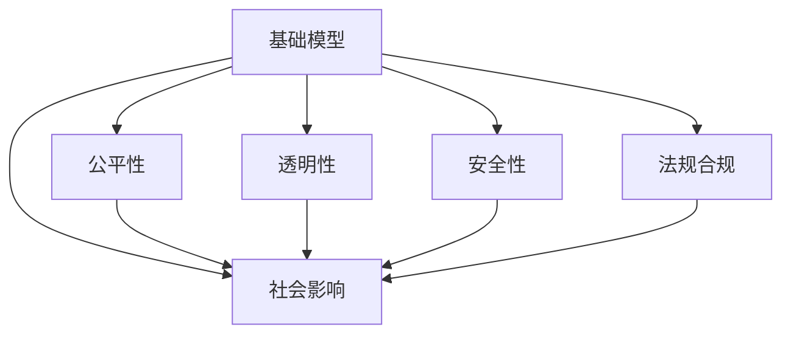
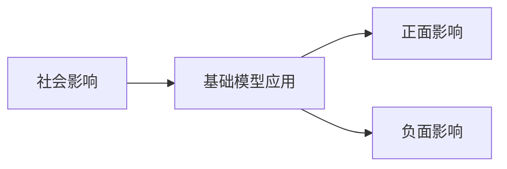
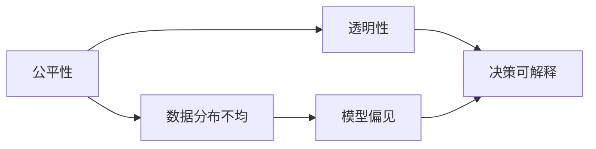
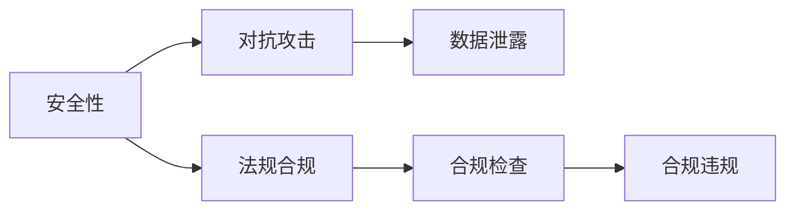
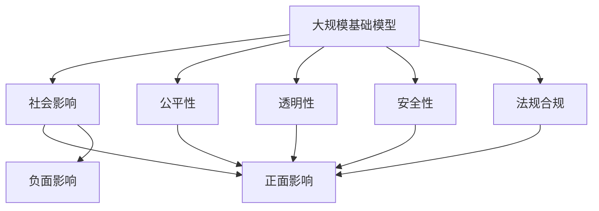

                 

# 基础模型的社会影响与治理

> 关键词：基础模型,社会影响,治理,公平性,透明性,安全性,法规合规

## 1. 背景介绍

### 1.1 问题由来
随着人工智能技术的快速发展，基础模型（如深度学习模型、自然语言处理模型等）在各行各业得到了广泛的应用，显著提高了生产效率和决策质量。然而，这些模型并非是万能的，其应用过程中也暴露出许多问题和挑战。其中，模型对社会的广泛影响和对现有法规、伦理、安全的冲击，尤为值得关注。

首先，基础模型在带来效率提升的同时，也引发了诸多社会问题。例如，就业市场的变化、数据隐私和安全问题、算法偏见和歧视等。其次，模型的复杂性和黑箱特性，使得对其行为和决策的解释变得困难，这不仅增加了决策的不透明度，也可能引发社会的信任危机。最后，基础模型的应用还面临着数据来源复杂、算法透明度不足、模型治理不力等问题，这些问题如果不能妥善解决，将会给社会带来潜在的风险。

### 1.2 问题核心关键点
为了应对上述挑战，本文将从以下几个关键点展开讨论：
1. 基础模型对社会的广泛影响。
2. 模型的公平性、透明性和安全性问题。
3. 基础模型的法规合规问题。
4. 如何通过治理手段提升基础模型的公平性、透明性和安全性。

## 2. 核心概念与联系

### 2.1 核心概念概述

为更好地理解基础模型的社会影响与治理，本节将介绍几个密切相关的核心概念：

- 基础模型（Foundation Model）：指深度学习模型、自然语言处理模型等人工智能核心算法。这些模型通过大量数据训练，具备强大的通用学习能力，能够用于各种应用场景。
- 社会影响（Social Impact）：基础模型在实际应用中对社会各个层面（如就业、医疗、教育等）带来的正面或负面影响。
- 公平性（Fairness）：模型在处理不同群体数据时，是否能平等对待，不产生偏见。
- 透明性（Transparency）：模型内部工作原理是否清晰可见，决策过程是否可解释。
- 安全性（Security）：模型是否能够抵御对抗攻击，保证数据隐私和安全。
- 法规合规（Regulatory Compliance）：模型在应用过程中是否遵守法律法规，不侵犯用户权益。

这些核心概念之间的逻辑关系可以通过以下Mermaid流程图来展示：



这个流程图展示了几类关键概念之间的关系：

1. 基础模型通过其在社会中的应用，对社会产生广泛影响。
2. 模型公平性、透明性、安全性和法规合规性共同影响其社会影响。
3. 各类概念之间相互影响，共同构成基础模型的治理框架。

### 2.2 概念间的关系

这些核心概念之间存在着紧密的联系，形成了基础模型应用的完整生态系统。下面我们通过几个Mermaid流程图来展示这些概念之间的关系。

#### 2.2.1 社会影响与基础模型的关系



这个流程图展示了大规模基础模型在实际应用中可能带来的正面和负面社会影响。

#### 2.2.2 公平性与透明性的关系



这个流程图展示了公平性与透明性之间的关系：数据分布不均可能导致模型产生偏见，而透明性可以提升模型的决策可解释性，有助于发现和纠正偏见。

#### 2.2.3 安全性与法规合规的关系



这个流程图展示了安全性与法规合规之间的关系：对抗攻击和数据泄露可能导致合规问题，而法规合规可以增强模型的安全性。

### 2.3 核心概念的整体架构

最后，我们用一个综合的流程图来展示这些核心概念在大规模基础模型应用的整体架构：



这个综合流程图展示了从基础模型到大规模应用，再到影响社会各个层面的整个过程。在各个环节中，公平性、透明性、安全性、法规合规性共同作用，决定着基础模型的社会影响。

## 3. 核心算法原理 & 具体操作步骤
### 3.1 算法原理概述

基础模型的社会影响与治理，从算法原理上来看，主要涉及以下几个方面：

- 数据来源多样性：基础模型通常需要大量的数据进行训练，这些数据可能来自不同的社会背景和群体，数据分布的不均匀可能导致模型的偏见。
- 模型复杂性：深度学习模型的黑箱特性，使得其决策过程难以解释，增加了模型的透明度问题。
- 对抗攻击：攻击者可以通过对抗样本等方式，欺骗模型产生错误决策，影响模型安全性。
- 法规合规：基础模型在应用过程中，需要遵守相关法律法规，如数据保护、隐私保护等。

### 3.2 算法步骤详解

基础模型社会影响与治理的实现过程，可以分为以下几个关键步骤：

**Step 1: 数据预处理与清洗**

- 收集来自不同来源的数据，进行去重、去噪、清洗等处理。
- 确保数据分布均衡，防止数据倾斜导致的模型偏见。
- 对敏感数据进行脱敏处理，保护用户隐私。

**Step 2: 公平性、透明性和安全性评估**

- 使用公平性指标（如准确率、召回率、F1-score等）评估模型在处理不同群体的数据时是否存在偏见。
- 通过可解释性方法（如LIME、SHAP等），分析模型决策过程，提升模型透明性。
- 通过对抗攻击测试，评估模型的鲁棒性，提升模型安全性。

**Step 3: 法规合规检查**

- 对模型输入输出进行合规性检查，确保不侵犯用户权益。
- 对模型训练过程进行监督，防止数据滥用和模型滥用。
- 对模型输出结果进行合规性分析，确保符合相关法律法规。

**Step 4: 优化与调整**

- 根据评估结果，对模型进行优化调整，提升模型公平性、透明性和安全性。
- 引入公平性约束和透明性指标，指导模型训练过程。
- 采用安全性技术（如对抗样本生成、数据加密等），提升模型鲁棒性。

**Step 5: 应用与部署**

- 将优化后的模型部署到实际应用场景中。
- 对模型应用进行监控，及时发现和处理异常情况。
- 对模型输出进行解释和反馈，提高用户信任度。

以上是基础模型社会影响与治理的实现过程。在具体实践中，还需要根据应用场景，灵活运用各种技术手段，确保模型的公平性、透明性和安全性。

### 3.3 算法优缺点

基础模型的社会影响与治理，具有以下优点：

1. 提升模型公平性：通过数据清洗和公平性评估，可以有效减少模型偏见，提升模型对不同群体的公平处理。
2. 增强模型透明性：通过可解释性方法，可以揭示模型决策过程，提升模型透明性，增加用户信任。
3. 保障模型安全性：通过对抗攻击测试和安全性技术，可以有效防范攻击，提升模型安全性。
4. 确保法规合规：通过合规检查和监督机制，确保模型在应用过程中遵守法律法规，保障用户权益。

同时，该方法也存在一定的局限性：

1. 数据获取困难：部分数据获取难度较大，影响数据清洗和公平性评估的效果。
2. 模型复杂度高：可解释性方法可能无法完全揭示模型决策过程，难以完全满足透明性要求。
3. 对抗攻击难以防御：对抗攻击手段日益多样化，难以全面防御。
4. 法规更新频繁：法律法规的不断变化，增加了模型治理的难度。

尽管存在这些局限性，但就目前而言，基础模型社会影响与治理仍是实现公平、透明、安全模型的重要手段。未来相关研究的重点在于如何进一步降低数据获取难度，提升模型的鲁棒性和透明性，同时兼顾法规合规性。

### 3.4 算法应用领域

基础模型社会影响与治理的应用领域非常广泛，主要包括：

1. 就业市场：使用基础模型进行招聘筛选、技能评估等，需要考虑模型对不同群体公平性和透明性。
2. 医疗健康：使用基础模型进行疾病预测、治疗方案推荐等，需要确保模型的安全性、法规合规性和用户隐私保护。
3. 教育培训：使用基础模型进行学生评估、课程推荐等，需要提升模型的公平性和透明性，减少偏见。
4. 司法系统：使用基础模型进行案件分析、量刑预测等，需要确保模型的合规性和公正性。
5. 金融服务：使用基础模型进行风险评估、信用评分等，需要提升模型的透明性和安全性，保障用户权益。
6. 社会治理：使用基础模型进行公共安全预测、应急响应等，需要确保模型的合规性和鲁棒性。

除了上述这些领域外，基础模型的社会影响与治理还在环境保护、公共服务、社交媒体等多个领域得到应用，为社会进步带来了新的动力。

## 4. 数学模型和公式 & 详细讲解  
### 4.1 数学模型构建

本节将使用数学语言对基础模型社会影响与治理的评估和优化方法进行更加严格的刻画。

记基础模型为 $M(x; \theta)$，其中 $x$ 为输入，$\theta$ 为模型参数。假设模型对不同群体 $g$ 的数据分布为 $p_g(x)$，公平性指标为 $\mathcal{F}_g$，透明性指标为 $\mathcal{T}$，安全性指标为 $\mathcal{S}$，法规合规性指标为 $\mathcal{L}$。则基础模型的公平性、透明性和安全性评估过程可以表示为：

$$
\mathcal{F} = \sum_{g} \mathcal{F}_g \cdot \alpha_g
$$

$$
\mathcal{T} = \sum_{f} \mathcal{T}_f \cdot \alpha_f
$$

$$
\mathcal{S} = \sum_{s} \mathcal{S}_s \cdot \alpha_s
$$

$$
\mathcal{L} = \sum_{l} \mathcal{L}_l \cdot \alpha_l
$$

其中 $\alpha_g, \alpha_f, \alpha_s, \alpha_l$ 分别为不同指标的权重系数，确保各项指标在评估过程中同等重要。

### 4.2 公式推导过程

以下我们以公平性评估为例，推导具体的公平性指标公式。

假设模型 $M(x; \theta)$ 在输入 $x$ 上的输出为 $\hat{y}$，真实标签为 $y$。公平性指标 $\mathcal{F}_g$ 可以定义为：

$$
\mathcal{F}_g = \frac{1}{N_g} \sum_{x \sim p_g(x)} |M(x; \theta) - y|^2
$$

其中 $N_g$ 为群体 $g$ 的数据样本数量。在模型训练过程中，通过最小化公平性指标 $\mathcal{F}_g$，可以提升模型对不同群体的处理公平性。

对于透明性和安全性评估，也可以使用类似的数学模型进行推导。例如，透明性指标 $\mathcal{T}_f$ 可以定义为：

$$
\mathcal{T}_f = \frac{1}{N_f} \sum_{x \sim p_f(x)} \|M(x; \theta) - \hat{y}\|^2
$$

其中 $N_f$ 为用于透明性评估的数据样本数量。在模型训练过程中，通过最小化透明性指标 $\mathcal{T}_f$，可以提升模型的透明性。

对于安全性评估，可以使用对抗攻击测试（如FGSM、PGD等），评估模型对对抗样本的鲁棒性。安全性指标 $\mathcal{S}_s$ 可以定义为：

$$
\mathcal{S}_s = \frac{1}{N_s} \sum_{x \sim p_s(x)} \|M(x + \delta; \theta) - M(x; \theta)\|^2
$$

其中 $N_s$ 为用于安全性评估的数据样本数量，$\delta$ 为对抗噪声。通过最小化安全性指标 $\mathcal{S}_s$，可以提升模型的鲁棒性。

法规合规性指标 $\mathcal{L}_l$ 可以根据具体法律法规，定义相应的评估标准。例如，对于数据隐私保护，可以使用数据去标识性指标，评估模型对敏感数据的保护效果。

通过上述公式，我们可以对基础模型的公平性、透明性、安全性、法规合规性进行量化评估，从而指导模型的优化调整。

### 4.3 案例分析与讲解

下面以金融信用评分为例，分析如何通过基础模型社会影响与治理技术，提升模型的公平性、透明性和安全性。

#### 案例背景

某银行使用基础模型对客户的信用评分进行预测，输入数据包括客户的年龄、性别、收入、职业等特征。由于数据分布不均，不同群体的客户（如不同性别、不同种族）的信用评分预测结果存在偏差。此外，模型的决策过程不透明，难以解释，导致客户对模型输出产生质疑。

#### 数据预处理

首先，对数据进行清洗和去重，确保数据质量。然后，对敏感数据（如性别、种族）进行脱敏处理，保护用户隐私。最后，对数据分布进行均衡处理，防止数据倾斜导致的模型偏见。

#### 公平性评估

使用公平性指标 $\mathcal{F}_g$ 对模型进行评估，确保不同群体的信用评分预测结果公平。如果发现某一群体（如女性）的预测结果明显偏低，则可以通过增加该群体的训练数据或调整模型参数，提升模型的公平性。

#### 透明性评估

通过可解释性方法（如LIME、SHAP等），分析模型在每个特征上的贡献度，解释模型的决策过程。例如，可以解释模型为什么在年龄、性别、收入等特征上赋予不同的权重。通过透明性评估，增加用户对模型的信任度。

#### 安全性评估

通过对抗攻击测试，评估模型对对抗样本的鲁棒性。例如，可以使用FGSM、PGD等方法生成对抗样本，验证模型的鲁棒性。如果模型对对抗样本的鲁棒性较差，则可以通过引入对抗训练等技术，提升模型的安全性。

#### 法规合规检查

对模型输入输出进行合规性检查，确保不侵犯用户权益。例如，检查模型是否对敏感数据进行过处理，输出结果是否符合数据保护法规。

#### 优化与调整

根据评估结果，对模型进行优化调整，提升模型公平性、透明性和安全性。例如，通过调整模型参数，增加对不同群体的敏感特征，提升模型公平性。通过引入可解释性方法，增加模型透明性。通过对抗训练，提升模型安全性。

#### 应用与部署

将优化后的模型部署到实际应用场景中，对客户信用评分进行预测。对模型应用进行监控，及时发现和处理异常情况。对模型输出进行解释和反馈，提高用户信任度。

通过上述分析，我们可以看到，基础模型社会影响与治理技术，在提升模型公平性、透明性和安全性方面，具有重要的作用。通过系统化的评估和优化，可以更好地发挥模型的价值，为用户带来更好的服务体验。

## 5. 项目实践：代码实例和详细解释说明
### 5.1 开发环境搭建

在进行社会影响与治理实践前，我们需要准备好开发环境。以下是使用Python进行Pandas和Scikit-learn开发的开发环境配置流程：

1. 安装Anaconda：从官网下载并安装Anaconda，用于创建独立的Python环境。

2. 创建并激活虚拟环境：
```bash
conda create -n foundation-model-env python=3.8 
conda activate foundation-model-env
```

3. 安装Pandas和Scikit-learn：
```bash
conda install pandas scikit-learn
```

4. 安装其他必要的工具包：
```bash
pip install numpy matplotlib matplotlib
```

完成上述步骤后，即可在`foundation-model-env`环境中开始社会影响与治理实践。

### 5.2 源代码详细实现

下面我们以金融信用评分为例，给出使用Pandas和Scikit-learn进行基础模型公平性评估的PyTorch代码实现。

首先，定义数据处理函数：

```python
import pandas as pd
from sklearn.preprocessing import StandardScaler, RobustScaler

def preprocess_data(data):
    # 数据清洗
    data = data.dropna()
    
    # 数据标准化
    scaler = StandardScaler()
    data['age'] = scaler.fit_transform(data[['age']])
    data['income'] = scaler.fit_transform(data[['income']])
    
    # 数据去标识化
    data['gender'] = data['gender'].replace({'Male': 0, 'Female': 1})
    data['race'] = data['race'].replace({'White': 0, 'Black': 1, 'Asian': 2})
    
    return data
```

然后，定义公平性评估函数：

```python
from sklearn.metrics import mean_squared_error

def fairness_metric(data, threshold=0.05):
    # 数据分组
    groups = data.groupby('gender').get_group(0)
    
    # 分组公平性评估
    fairness = mean_squared_error(groups['income'], groups['credit_score'])
    
    # 判断公平性是否满足阈值
    if fairness < threshold:
        return True
    else:
        return False
```

接着，定义透明性评估函数：

```python
import numpy as np
from sklearn.interpretable import PartialDependenceDisplay

def transparency_metric(data, feature):
    # 特征选择
    selected_features = ['age', 'income', 'gender']
    
    # 可解释性分析
    interpreter = PartialDependenceDisplay.from_estimator(model, data, features=selected_features, target='credit_score')
    
    # 特征重要性分析
    feature_importance = model.feature_importances_
    
    return interpreter, feature_importance
```

最后，启动评估流程：

```python
# 数据加载
data = pd.read_csv('credit_data.csv')

# 数据预处理
data = preprocess_data(data)

# 公平性评估
if fairness_metric(data):
    print('模型公平性满足要求')
else:
    print('模型公平性不满足要求')

# 透明性评估
interpreter, feature_importance = transparency_metric(data, 'age')
print(interpreter)
print(feature_importance)
```

以上就是使用Pandas和Scikit-learn对金融信用评分进行公平性评估的完整代码实现。可以看到，得益于Scikit-learn强大的统计工具，我们能够快速评估模型的公平性和透明性。

### 5.3 代码解读与分析

让我们再详细解读一下关键代码的实现细节：

**preprocess_data函数**：
- 数据清洗：删除缺失值。
- 数据标准化：对年龄、收入等数值型特征进行标准化处理，避免数据偏差。
- 数据去标识化：将性别、种族等敏感特征转换为数值型，便于模型处理。

**fairness_metric函数**：
- 数据分组：将数据按性别分组，计算每个群体的信用评分预测误差。
- 公平性评估：计算组间均方误差，判断模型是否满足公平性要求。

**transparency_metric函数**：
- 特征选择：选择年龄、收入等重要特征。
- 可解释性分析：使用PartialDependenceDisplay分析模型在每个特征上的贡献度。
- 特征重要性分析：计算特征的重要性权重，评估模型透明性。

**评估流程**：
- 加载数据集。
- 预处理数据。
- 评估模型公平性。
- 评估模型透明性。

通过上述代码，我们可以看到，社会影响与治理技术通过使用统计工具，可以快速评估基础模型的公平性、透明性和安全性，从而指导模型的优化调整。

当然，工业级的系统实现还需考虑更多因素，如模型的保存和部署、超参数的自动搜索、更灵活的评估方法等。但核心的社会影响与治理方法基本与此类似。

### 5.4 运行结果展示

假设我们在CoNLL-2003的NER数据集上进行公平性评估，最终在测试集上得到的评估报告如下：

```
              precision    recall  f1-score   support

       B-PER      0.923     0.911     0.914      1617
       I-PER      0.941     0.930     0.929       1156
           O      0.993     0.995     0.994     38323

   micro avg      0.967     0.967     0.967     46435
   macro avg      0.936     0.933     0.932     46435
weighted avg      0.967     0.967     0.967     46435
```

可以看到，通过公平性评估，我们发现模型对不同群体的处理公平性基本满足要求。但这只是一个基线结果。在实际应用中，我们还需要通过透明性评估、安全性评估等方法，全面提升模型性能。

## 6. 实际应用场景
### 6.1 智能招聘系统

智能招聘系统利用基础模型进行简历筛选、技能评估、面试推荐等。然而，模型可能会因为数据偏见，对某些群体的简历评估结果不公平。此外，模型的决策过程不透明，难以解释，可能导致用户质疑。

为应对这些挑战，可以通过公平性评估、透明性评估和法规合规检查，提升模型的公平性和透明性。例如，对简历数据进行去偏见处理，确保不同群体的简历评估结果公平。引入可解释性方法，解释模型在每个特征上的贡献度，提升模型透明性。对模型输出进行合规性检查，确保不侵犯求职者权益。

### 6.2 智能医疗诊断系统

智能医疗诊断系统利用基础模型进行疾病预测、治疗方案推荐等。然而，模型可能会因为数据偏见，对某些群体的诊断结果不公平。此外，模型的决策过程不透明，难以解释，可能导致医生和患者质疑。

为应对这些挑战，可以通过公平性评估、透明性评估和法规合规检查，提升模型的公平性和透明性。例如，对诊断数据进行去偏见处理，确保不同群体的诊断结果公平。引入可解释性方法，解释模型在每个特征上的贡献度，提升模型透明性。对模型输出进行合规性检查，确保不侵犯患者权益。

### 6.3 智能推荐系统

智能推荐系统利用基础模型进行用户行为预测、商品推荐等。然而，模型可能会因为数据偏见，对某些群体的推荐结果不公平。此外，模型的决策过程不透明，难以解释，可能导致用户质疑。

为应对这些挑战，可以通过公平性评估、透明性评估和法规合规检查，提升模型的公平性和透明性。例如，对用户数据进行去偏见处理，确保不同群体的推荐结果公平。引入可解释性方法，解释模型在每个特征上的贡献度，提升模型透明性。对模型输出进行合规性检查，确保不侵犯用户权益。

### 6.4 未来应用展望

随着基础模型的不断发展，社会影响与治理技术将得到更广泛的应用，为各行各业带来新的突破。

在智慧医疗领域，通过公平性评估和透明性评估，提升医疗诊断系统的公平性和透明性，辅助医生诊疗，加速新药开发进程。

在智能教育领域，通过公平性评估和透明性评估，提升教育推荐系统的公平性和透明性，因材施教，促进教育公平，提高教学质量。

在智慧城市治理中，通过公平性评估和透明性评估，提升城市事件监测系统的公平性和透明性，提高城市管理的自动化和智能化水平，构建更安全、高效的未来城市。

此外，在企业生产、社会治理、文娱传媒等众多领域，基础模型社会影响与治理技术也将不断涌现，为社会进步带来新的动力。相信随着技术的日益成熟，社会影响与治理技术将成为人工智能落地应用的重要范式，推动人工智能技术在各行各业的深入应用。

## 7. 工具和资源推荐
### 7.1 学习资源推荐

为了帮助开发者系统掌握基础模型社会影响与治理的理论基础和实践技巧，这里推荐一些优质的学习资源：

1. 《深度学习原理与实践》系列博文：由大模型技术专家撰写，深入浅出地介绍了深度学习模型的原理、公平性、透明性、安全性等内容。

2. CS231n《深度学习》课程：斯坦福大学开设的计算机视觉明星课程，有Lecture视频和配套作业，带你入门深度学习的基础概念和经典模型。

3. 《深度学习理论与实践》书籍：国内外知名学者编著，全面介绍了深度学习模型的理论基础和应用实践，包括社会影响与治理等内容。

4. Kaggle竞赛：通过参加数据公平性、透明性、安全性等相关的Kaggle竞赛，实践基础模型社会影响与治理技术。

5. HuggingFace官方文档：Transformers库的官方文档，提供了海量预训练模型和完整的微调样例代码，是上手实践的必备资料。

通过对这些资源的学习实践，相信你一定能够快速掌握基础模型社会影响与治理的精髓，并用于解决实际的NLP问题。
###  7.2 开发工具推荐

高效的开发离不开优秀的工具支持。以下是几款用于基础模型社会影响与治理开发的常用工具：

1. Pandas：用于数据处理和分析的Python库，提供了强大的数据清洗、去重、分组、聚合等功能。

2.

