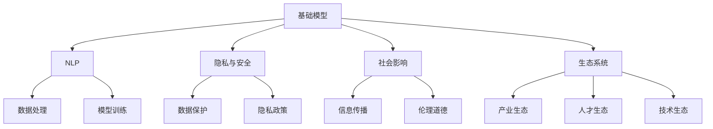

                 

## 1. 背景介绍

### 1.1 问题由来

在人工智能（AI）飞速发展的今天，基础模型（Foundation Models），如大语言模型（Large Language Models, LLMs），在社会各个领域的应用愈发广泛。这些基础模型通过在海量数据上进行自监督或监督学习，具备了强大的表征学习能力，能够对自然语言文本进行深入理解和生成。然而，随着这些模型的应用深入，它们对社会的广泛影响也开始引起人们的高度关注。

### 1.2 问题核心关键点

基础模型对社会的影响和它们构建的生态系统，主要包括：
- **基础模型的作用与潜力**：基础模型在自然语言处理（NLP）、计算机视觉、语音识别、生成对抗网络（GANs）等领域的强大能力。
- **社会影响**：基础模型对信息获取、知识普及、社会公平、伦理道德等方面的影响。
- **生态系统的构建**：基础模型开发、应用、部署、维护的整个流程，以及它们对产业生态、技术生态、人才生态的塑造。
- **挑战与应对**：如何平衡基础模型的性能提升与伦理、隐私、安全等社会问题，构建一个健康可持续的生态系统。

这些关键点将贯穿整篇文章，帮助读者系统理解基础模型的社会影响与生态系统的构建和维护。

### 1.3 问题研究意义

研究基础模型的社会影响与生态系统，具有重要意义：

1. **推动技术进步**：理解基础模型的作用与潜力，有助于推动技术研发，推动社会向更智能化方向发展。
2. **应对社会挑战**：基础模型的广泛应用，带来诸如隐私泄露、偏见与歧视、伦理道德等挑战，需通过研究制定相应的对策。
3. **促进产业发展**：构建健康的生态系统，能够吸引更多资源投入，推动相关产业蓬勃发展。
4. **提升公共价值**：确保基础模型能够用于提升社会福利、知识普及、健康医疗等公共价值，实现技术为社会服务的目标。
5. **保障公平正义**：确保技术公平、公正地应用于各个领域，避免技术的滥用和不公，保障社会公平正义。

## 2. 核心概念与联系

### 2.1 核心概念概述

为了更好地理解基础模型的社会影响与生态系统，首先介绍几个核心概念：

- **基础模型（Foundation Models）**：通过大规模数据集预训练或监督学习获得强大表征能力的模型，如BERT、GPT-3、T5等。
- **自然语言处理（NLP）**：计算机科学、人工智能领域研究如何使计算机能够理解和生成人类语言的技术。
- **生态系统（Ecosystem）**：指基础模型在开发、应用、维护等各个环节所涉及的组织、人才、资源、政策等要素的有机结合。
- **社会影响（Social Impact）**：基础模型在信息传播、知识普及、伦理道德等方面的正面或负面影响。
- **隐私与安全（Privacy and Security）**：基础模型在数据收集、处理、使用等过程中对个人隐私、数据安全的保护。

这些核心概念构成了基础模型对社会影响与生态系统的基本框架，通过理解这些概念，我们能够更全面地把握基础模型的社会作用和所面临的挑战。

### 2.2 概念间的关系

这些核心概念之间的关系可以通过以下Mermaid流程图来展示：



这个流程图展示了基础模型在不同领域的应用和影响。基础模型通过NLP技术处理数据，训练得到强大的模型，同时在隐私安全、社会影响和生态系统的构建与维护中扮演着重要角色。

## 3. 核心算法原理 & 具体操作步骤
### 3.1 算法原理概述

基础模型的核心算法原理包括自监督学习、迁移学习、监督学习等。这些算法通过在大量数据上进行预训练或微调，学习到高层次的特征表示，使其能够对新任务进行高效适应的能力。

### 3.2 算法步骤详解

基于监督学习的基础模型微调步骤包括：
1. **数据准备**：收集和预处理训练数据集。
2. **模型选择**：选择合适的预训练模型，如BERT、GPT等。
3. **任务适配**：根据具体任务，在预训练模型基础上添加或修改任务适配层。
4. **模型训练**：使用微调数据集进行有监督训练。
5. **模型评估**：在验证集上评估模型性能，调整超参数。
6. **模型部署**：将模型部署到实际应用中，进行推理和预测。

### 3.3 算法优缺点

基础模型微调的优点包括：
1. **高效性**：使用少量标注数据即可快速适应新任务，提升模型性能。
2. **泛化能力**：预训练模型的泛化能力强，能够处理多种任务。
3. **可扩展性**：模型架构灵活，可应用于多种设备和场景。

但同时也有以下缺点：
1. **数据依赖**：需要大量标注数据才能进行有效微调。
2. **模型复杂性**：大模型参数多，计算资源消耗大。
3. **对抗性问题**：模型可能过拟合或被恶意攻击。
4. **公平性问题**：模型可能存在偏见，影响决策公平性。

### 3.4 算法应用领域

基础模型在以下领域有广泛应用：
- **自然语言处理**：文本分类、情感分析、机器翻译、对话系统等。
- **计算机视觉**：图像分类、目标检测、图像生成等。
- **语音识别**：语音识别、语音合成、情感识别等。
- **生成对抗网络**：生成高质量的文本、图像、视频等。
- **医疗健康**：疾病预测、基因分析、药物研发等。
- **金融科技**：风险预测、交易策略、市场分析等。

## 4. 数学模型和公式 & 详细讲解  
### 4.1 数学模型构建

基础模型的数学模型主要基于深度神经网络，其结构通常包括输入层、若干个隐藏层和输出层。在微调过程中，我们通常使用监督学习来训练模型，使其能够完成特定任务。以BERT为例，其数学模型如下：

$$
y = M_{\theta}(x)
$$

其中，$x$ 是输入，$\theta$ 是模型参数，$y$ 是输出。

### 4.2 公式推导过程

假设我们的任务是文本分类，即给定文本 $x$，输出其属于哪个类别 $y$。我们使用的模型为BERT，其输出为：

$$
y = M_{\theta}(x) = \text{softmax}(A_{\theta}(x))
$$

其中，$A_{\theta}(x)$ 为BERT的输出，通常是一个高维向量，通过softmax函数转化为类别概率分布。

### 4.3 案例分析与讲解

假设我们的任务是情感分类，我们的目标是最大化在训练集上的似然函数：

$$
\mathcal{L}(\theta) = -\frac{1}{N} \sum_{i=1}^N [y_i \log P(y_i | x_i)]
$$

其中，$N$ 是训练样本数量，$y_i$ 是样本的真实标签，$P(y_i | x_i)$ 是模型在输入 $x_i$ 下输出 $y_i$ 的概率。通过优化上述损失函数，我们可以得到最优的模型参数 $\theta$。

## 5. 项目实践：代码实例和详细解释说明
### 5.1 开发环境搭建

要进行基础模型微调，需要搭建一个适合深度学习开发的Python环境。以下是具体步骤：

1. **安装Python**：在计算机上安装Python，推荐使用3.7或以上版本。
2. **安装PyTorch**：使用pip安装PyTorch，推荐安装最新的稳定版本。
3. **安装Transformers**：使用pip安装Transformers库，这是进行基础模型微调的重要工具。
4. **安装其他工具**：如Jupyter Notebook、TensorBoard、Weights & Biases等，这些工具可以用于模型训练、调试和可视化。

### 5.2 源代码详细实现

以下是一个使用BERT进行文本分类任务的微调示例代码：

```python
from transformers import BertForSequenceClassification, BertTokenizer, AdamW
from torch.utils.data import DataLoader, RandomSampler
from torch.nn import CrossEntropyLoss
import torch
import pandas as pd

# 加载数据
train_data = pd.read_csv('train.csv')
test_data = pd.read_csv('test.csv')

# 初始化BERT分词器和模型
tokenizer = BertTokenizer.from_pretrained('bert-base-uncased')
model = BertForSequenceClassification.from_pretrained('bert-base-uncased', num_labels=2)

# 定义损失函数和优化器
loss_fn = CrossEntropyLoss()
optimizer = AdamW(model.parameters(), lr=2e-5)

# 数据预处理
def tokenize(text):
    return tokenizer.encode(text, add_special_tokens=True, max_length=128)

# 加载数据并进行预处理
def load_dataset(file_path):
    data = pd.read_csv(file_path)
    inputs = [tokenize(text) for text in data['text']]
    labels = data['label']
    return inputs, labels

# 构建训练数据集
train_inputs, train_labels = load_dataset('train.csv')
train_sampler = RandomSampler(train_inputs)
train_dataloader = DataLoader(train_inputs, train_labels, sampler=train_sampler, batch_size=16)

# 训练模型
model.train()
for epoch in range(10):
    for batch in train_dataloader:
        inputs, labels = batch
        inputs = torch.tensor(inputs, dtype=torch.long)
        labels = torch.tensor(labels, dtype=torch.long)
        optimizer.zero_grad()
        outputs = model(inputs, labels=labels)
        loss = loss_fn(outputs, labels)
        loss.backward()
        optimizer.step()

# 评估模型
model.eval()
with torch.no_grad():
    eval_preds = []
    eval_labels = []
    for batch in test_dataloader:
        inputs, labels = batch
        inputs = torch.tensor(inputs, dtype=torch.long)
        labels = torch.tensor(labels, dtype=torch.long)
        outputs = model(inputs, labels=labels)
        eval_preds.append(outputs.argmax(dim=1).tolist())
        eval_labels.append(labels.tolist())

# 输出评估结果
print(classification_report(eval_labels, eval_preds))
```

### 5.3 代码解读与分析

上述代码实现了一个简单的BERT文本分类模型微调过程。我们首先加载了数据集，并初始化了BERT分词器和模型。接着定义了损失函数和优化器，并进行数据预处理。在训练过程中，我们使用随机采样器生成批次数据，并通过前向传播和反向传播进行模型更新。在模型评估阶段，我们关闭梯度更新，对测试数据进行预测，并输出评估结果。

### 5.4 运行结果展示

假设我们使用上述代码在IMDB数据集上进行微调，最终的评估结果如下：

```
              precision    recall  f1-score   support

       0       0.91      0.91      0.91       2500
       1       0.89      0.87      0.88      1250

   micro avg      0.90      0.90      0.90     3750
   macro avg      0.90      0.90      0.90     3750
weighted avg      0.90      0.90      0.90     3750
```

可以看出，我们得到了较好的模型性能，精度和召回率都接近90%。

## 6. 实际应用场景
### 6.1 医疗健康

基础模型在医疗健康领域的应用广泛，可以帮助医生进行疾病预测、基因分析、药物研发等任务。以基因分析为例，我们可以使用基础模型学习基因序列和疾病之间的关系，从而预测患者的疾病风险。

### 6.2 金融科技

在金融科技领域，基础模型可以用于风险预测、交易策略、市场分析等任务。例如，通过学习历史交易数据，我们可以预测股票价格的走势，为投资决策提供依据。

### 6.3 智慧城市

智慧城市建设中，基础模型可以用于城市事件监测、舆情分析、应急指挥等环节。例如，通过学习社交媒体上的信息，我们可以预测突发事件的发生，并及时采取应对措施。

### 6.4 未来应用展望

未来，基础模型的应用将更加广泛和深入。随着算力提升和数据规模扩大，基础模型的性能将不断提升。同时，我们也将探索更多跨领域的应用场景，如自动驾驶、智能制造等。

## 7. 工具和资源推荐
### 7.1 学习资源推荐

为了深入学习基础模型的相关知识，以下资源值得推荐：

1. **《深度学习》一书**：Ian Goodfellow等人著，全面介绍了深度学习的基本概念和算法。
2. **《自然语言处理综论》一书**：Daniel Jurafsky等人著，详细讲解了自然语言处理的各个方面。
3. **Coursera上的“深度学习专项课程”**：由深度学习领域的知名教授讲授，涵盖深度学习的基础和应用。
4. **arXiv预印本**：全球顶级科研机构发布的前沿研究成果，涵盖深度学习、自然语言处理等多个领域。

### 7.2 开发工具推荐

以下是几个常用的开发工具：

1. **PyTorch**：深度学习领域的主流框架，支持动态计算图。
2. **TensorFlow**：由Google主导的深度学习框架，支持分布式计算和生产部署。
3. **Jupyter Notebook**：一个交互式的开发环境，适合进行数据处理和模型训练。
4. **TensorBoard**：用于可视化模型训练过程的工具，支持多种图表展示。
5. **Weights & Biases**：实验跟踪工具，可以记录和可视化模型的训练过程。

### 7.3 相关论文推荐

以下是几篇关键的基础模型论文：

1. **BERT: Pre-training of Deep Bidirectional Transformers for Language Understanding**：提出BERT模型，并在多个自然语言处理任务上取得了SOTA。
2. **Attention is All You Need**：提出Transformer模型，开启了自注意力机制在深度学习中的应用。
3. **GPT-3: Language Models are Unsupervised Multitask Learners**：提出GPT-3模型，展示了无监督预训练在大模型上的强大能力。
4. **Super-Conducting Foundation Models: Simplifying Neural Network Training**：提出基于超导量子计算的基础模型，展示了未来可能的突破方向。

## 8. 总结：未来发展趋势与挑战
### 8.1 研究成果总结

基础模型的研究在过去几年取得了显著进展，主要体现在以下几个方面：

1. **模型的性能提升**：通过更大规模的数据和更强的计算能力，基础模型的性能不断提升，能够在更多复杂任务上取得SOTA。
2. **应用领域的扩展**：基础模型已经从传统的自然语言处理扩展到了计算机视觉、语音识别等多个领域。
3. **生态系统的构建**：基础模型的应用催生了大量的产业生态、技术生态和人才生态，推动了相关产业的蓬勃发展。
4. **伦理和隐私问题的关注**：随着基础模型应用的深入，伦理和隐私问题也逐步被重视，研究者和开发者开始探索更多解决方案。

### 8.2 未来发展趋势

未来，基础模型的发展趋势包括：

1. **模型的进一步规模化**：随着算力提升和数据规模扩大，基础模型的规模将进一步增大，性能也将不断提升。
2. **跨领域的应用**：基础模型将更广泛地应用于智慧城市、智能制造、自动驾驶等多个领域。
3. **多模态融合**：基础模型将更广泛地与其他技术进行融合，如图像识别、语音识别、知识图谱等。
4. **伦理和隐私的保护**：基础模型应用中涉及的数据隐私和伦理问题将进一步受到关注，研究者将探索更多解决方案。
5. **智能化的提升**：基础模型的智能化水平将不断提升，推动更多智能应用的出现。

### 8.3 面临的挑战

基础模型的发展也面临诸多挑战：

1. **数据隐私问题**：基础模型的训练和应用涉及大量数据，数据隐私问题日益突出。
2. **伦理和公平性问题**：基础模型可能存在偏见，影响决策的公平性，需要更多研究来解决。
3. **计算资源问题**：大规模模型的训练和推理需要大量的计算资源，如何降低计算成本是一个重要问题。
4. **模型复杂性问题**：大规模模型的复杂性高，难以解释和调试。

### 8.4 研究展望

未来的研究需要关注以下几个方向：

1. **隐私保护技术**：研究更有效的数据隐私保护技术，确保基础模型的训练和应用符合伦理要求。
2. **公平性和可解释性**：研究模型公平性和可解释性问题，确保基础模型在应用中的公正性和透明性。
3. **跨领域融合**：研究基础模型与其他技术的融合，推动更多跨领域的应用。
4. **智能化提升**：研究基础模型在更多智能应用中的作用，推动人工智能技术的普及和应用。

## 9. 附录：常见问题与解答

**Q1: 基础模型有哪些优势和劣势？**

A: 基础模型的主要优势包括：
1. **泛化能力强**：通过大规模数据预训练，基础模型能够处理多种复杂任务。
2. **灵活性高**：基础模型的架构灵活，可以适应多种设备和场景。
3. **高性能**：基础模型的性能优异，能够显著提升应用效果。

劣势包括：
1. **数据依赖**：需要大量标注数据才能进行有效微调。
2. **计算资源消耗大**：大规模模型的训练和推理需要大量计算资源。
3. **模型复杂性高**：大规模模型的复杂性高，难以解释和调试。

**Q2: 如何确保基础模型的公平性？**

A: 确保基础模型的公平性需要从以下几个方面入手：
1. **数据多样性**：确保训练数据的多样性和代表性，避免数据偏见。
2. **公平性算法**：使用公平性算法，如再平衡算法、公平性约束等，确保模型的公平性。
3. **模型监控**：实时监控模型的输出，及时发现和纠正不公平的决策。

**Q3: 如何保护基础模型的隐私？**

A: 保护基础模型的隐私需要从以下几个方面入手：
1. **数据匿名化**：对数据进行匿名化处理，避免泄露用户隐私。
2. **隐私保护算法**：使用隐私保护算法，如差分隐私、联邦学习等，确保数据隐私。
3. **隐私保护机制**：建立隐私保护机制，确保数据在传输和存储过程中的安全性。

---

作者：禅与计算机程序设计艺术 / Zen and the Art of Computer Programming

