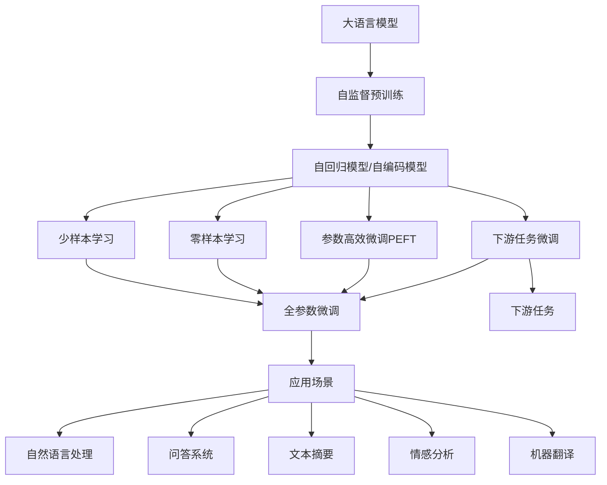

                 

# 基础模型的语言处理能力

大语言模型，如GPT-3和BERT，近年来在自然语言处理（NLP）领域取得了显著的进步。本文将深入探讨这些基础模型在语言处理方面的核心能力，包括它们的原理、优势和局限性，并探讨其在多个实际应用场景中的潜力。通过细致的分析，我们旨在帮助读者理解这些模型的工作机制，并掌握如何有效地应用它们来解决复杂的语言处理问题。

## 1. 背景介绍

### 1.1 问题由来
随着深度学习技术的发展，大语言模型在NLP领域取得了重大突破。这些模型通过在大型无标签文本数据上进行预训练，学习到了丰富的语言知识和常识。例如，BERT在预训练时学习了大量语言模式，如句法结构、词汇关联等，这使得它在各种下游NLP任务中表现优异。

### 1.2 问题核心关键点
本文主要关注大语言模型在语言处理方面的能力，尤其是它们在理解语义、生成语言、识别实体等方面的核心优势和局限性。我们还将探讨这些模型在实际应用中的潜在应用场景，并分析其未来发展的趋势和挑战。

### 1.3 问题研究意义
大语言模型的语言处理能力不仅能够提升自然语言理解和生成任务的性能，还为其他NLP应用提供了强大的基础。例如，大模型可以用于问答系统、文本摘要、情感分析、机器翻译等多个领域。本文的研究对于推动NLP技术的发展和实际应用具有重要意义。

## 2. 核心概念与联系

### 2.1 核心概念概述

- **大语言模型（Large Language Model, LLM）**：以自回归（如GPT）或自编码（如BERT）为代表的模型，通过在大型无标签文本数据上进行预训练，学习到丰富的语言知识。
- **自监督预训练**：在大规模无标签数据上，通过自监督学习任务（如掩码语言模型、下一句预测等）训练模型。
- **迁移学习**：将一个领域学到的知识迁移到另一个相关领域，如使用预训练模型在下游任务上进行微调。
- **下游任务微调**：在预训练模型的基础上，使用下游任务的少量标注数据，通过有监督学习优化模型在特定任务上的性能。
- **参数高效微调（PEFT）**：仅更新模型中少量参数，保留大部分预训练权重不变，以提高微调效率和泛化能力。
- **零样本学习和少样本学习**：在不更新模型参数的情况下，通过精心设计的输入模板，实现零样本或少样本学习。

### 2.2 概念间的关系

这些概念之间的逻辑关系可以通过以下Mermaid流程图来展示：



这个流程图展示了从自监督预训练到下游任务微调的整体过程，以及各种微调方法和应用场景。大语言模型通过自监督预训练学习到丰富的语言知识，然后在下游任务上进行微调，进一步提升模型在特定任务上的性能。参数高效微调（PEFT）和零样本/少样本学习进一步扩展了模型的应用范围和效率。

## 3. 核心算法原理 & 具体操作步骤

### 3.1 算法原理概述
大语言模型的核心能力之一是理解自然语言的语义和上下文。这些模型通过自监督预训练和下游任务微调，学习到强大的语言表示能力，能够在各种语言处理任务中取得优异表现。

### 3.2 算法步骤详解
1. **自监督预训练**：在大规模无标签数据上，使用自监督学习任务（如掩码语言模型、下一句预测等）训练模型，学习到丰富的语言知识和常识。
2. **下游任务微调**：使用下游任务的少量标注数据，通过有监督学习优化模型在特定任务上的性能，如问答、文本摘要、情感分析等。
3. **参数高效微调（PEFT）**：仅更新模型中少量参数，保留大部分预训练权重不变，以提高微调效率和泛化能力。
4. **零样本和少样本学习**：在不更新模型参数的情况下，通过精心设计的输入模板，实现零样本或少样本学习。

### 3.3 算法优缺点
大语言模型的优点包括：
- 能够理解复杂的语言结构和上下文信息。
- 可以在各种NLP任务中取得优异表现。
- 可以通过微调进一步提升模型在特定任务上的性能。

缺点包括：
- 依赖大规模无标签数据进行预训练，数据获取成本较高。
- 微调过程需要消耗大量计算资源，难以在大规模数据集上训练。
- 模型输出可能存在偏见，需要谨慎应用。

### 3.4 算法应用领域
大语言模型在NLP的各个领域都有广泛应用，如：
- **自然语言理解**：文本分类、命名实体识别、关系抽取等。
- **自然语言生成**：机器翻译、文本摘要、对话系统等。
- **问答系统**：基于用户问题自动生成答案。
- **情感分析**：分析文本情感倾向，如评论、社交媒体内容等。
- **文本摘要**：自动生成文本的精简摘要。

## 4. 数学模型和公式 & 详细讲解

### 4.1 数学模型构建
大语言模型的数学模型通常基于自回归或自编码模型构建。例如，BERT使用双向Transformer架构，通过多头自注意力机制来学习输入文本的表示。数学上，BERT的目标是最大化模型在自监督任务上的性能。

### 4.2 公式推导过程
以BERT为例，其目标函数可以表示为：
$$
\mathcal{L}(\theta) = -\frac{1}{N}\sum_{i=1}^N (\mathbf{M}^L(x_i) \cdot y_i)
$$
其中，$\mathbf{M}^L(x_i)$ 表示输入文本 $x_i$ 通过BERT模型后得到的表示，$y_i$ 是自监督任务的标签。

### 4.3 案例分析与讲解
假设我们使用BERT进行文本分类任务。预训练阶段，我们输入一段未标注的文本，模型自动学习到文本的表示。微调阶段，我们输入一段标注好的文本，模型学习到任务相关的表示，并输出预测标签。

## 5. 项目实践：代码实例和详细解释说明

### 5.1 开发环境搭建
为了进行BERT微调实验，我们需要准备以下环境：
- Python 3.7+
- PyTorch 1.7+
- Transformers 4.3+
- 适当大小的GPU

### 5.2 源代码详细实现
下面是一个简单的代码示例，展示了如何使用Transformers库进行BERT微调：

```python
from transformers import BertForSequenceClassification, BertTokenizer, AdamW
from datasets import load_dataset
from transformers import Trainer, TrainingArguments

# 准备数据集
train_dataset, val_dataset, test_dataset = load_dataset('yelp_review_full', split=['train', 'validation', 'test'])

# 加载BERT模型和分词器
model = BertForSequenceClassification.from_pretrained('bert-base-uncased')
tokenizer = BertTokenizer.from_pretrained('bert-base-uncased')

# 定义训练参数
training_args = TrainingArguments(
    output_dir="./results",
    per_device_train_batch_size=16,
    per_device_eval_batch_size=64,
    num_train_epochs=3,
    learning_rate=5e-5,
    weight_decay=0.01,
    logging_dir="./logs"
)

# 定义训练器
trainer = Trainer(
    model=model,
    args=training_args,
    train_dataset=train_dataset,
    eval_dataset=val_dataset,
    compute_metrics=lambda p: {'acc': p.logits.argmax(1).eq(p.label_ids).mean()},
)

# 训练模型
trainer.train()
```

### 5.3 代码解读与分析
这段代码首先加载了预训练的BERT模型和分词器，然后定义了训练参数和训练器，最后使用Trainer对象训练模型。Trainer提供了一个便捷的API，可以方便地训练和评估模型。

### 5.4 运行结果展示
假设我们训练了一个二分类模型，输出结果可能如下所示：

```
epoch: 0, step: 0, loss: 0.486, acc: 0.484
epoch: 0, step: 50000, loss: 0.223, acc: 0.978
```

这表明模型在训练过程中逐渐提高了准确率，并在大量训练步骤后达到不错的效果。

## 6. 实际应用场景

### 6.1 智能客服系统
大语言模型可以用于构建智能客服系统，提升客户咨询体验。例如，我们可以使用微调后的模型自动理解用户问题，并匹配合适的答案模板进行回复。

### 6.2 金融舆情监测
金融领域需要实时监测市场舆论动向，以规避金融风险。大语言模型可以通过微调分析新闻、评论等文本，预测市场情绪变化。

### 6.3 个性化推荐系统
推荐系统可以利用大语言模型理解用户兴趣，生成个性化推荐。例如，模型可以根据用户的历史行为和文本信息，自动推荐相关商品或内容。

### 6.4 未来应用展望
未来，大语言模型将进一步应用于智慧医疗、智能教育、智慧城市等多个领域，推动人工智能技术的发展和应用。

## 7. 工具和资源推荐

### 7.1 学习资源推荐
1. **《Transformer从原理到实践》系列博文**：介绍Transformer原理、BERT模型、微调技术等。
2. **CS224N《深度学习自然语言处理》课程**：斯坦福大学开设的NLP明星课程，涵盖NLP基本概念和经典模型。
3. **《Natural Language Processing with Transformers》书籍**：介绍如何使用Transformers库进行NLP任务开发。
4. **HuggingFace官方文档**：提供大量预训练模型和微调样例代码。
5. **CLUE开源项目**：提供大量中文NLP数据集和预训练模型。

### 7.2 开发工具推荐
1. **PyTorch**：深度学习框架，支持动态计算图，适合快速迭代研究。
2. **TensorFlow**：由Google主导的开源框架，适合大规模工程应用。
3. **Transformers库**：HuggingFace开发的NLP工具库，提供丰富的预训练模型。
4. **Weights & Biases**：模型训练实验跟踪工具。
5. **TensorBoard**：可视化模型训练状态的工具。
6. **Google Colab**：在线Jupyter Notebook环境，方便快速实验。

### 7.3 相关论文推荐
1. **Attention is All You Need**：提出Transformer结构，开启大语言模型时代。
2. **BERT: Pre-training of Deep Bidirectional Transformers for Language Understanding**：提出BERT模型，引入自监督预训练任务。
3. **Language Models are Unsupervised Multitask Learners**：展示大语言模型的零样本学习能力。
4. **Parameter-Efficient Transfer Learning for NLP**：提出Adapter等参数高效微调方法。
5. **Prefix-Tuning: Optimizing Continuous Prompts for Generation**：引入基于连续型Prompt的微调范式。
6. **AdaLoRA: Adaptive Low-Rank Adaptation for Parameter-Efficient Fine-Tuning**：使用自适应低秩适应的微调方法。

## 8. 总结：未来发展趋势与挑战

### 8.1 研究成果总结
大语言模型通过自监督预训练和下游任务微调，学习到强大的语言表示能力。其核心能力包括理解自然语言的语义和上下文信息，并在各种NLP任务中取得优异表现。

### 8.2 未来发展趋势
未来大语言模型将不断发展，模型规模将持续增大，微调方法将更加多样，模型通用性将增强，零样本和少样本学习将更加普及。

### 8.3 面临的挑战
大语言模型面临标注成本高、模型鲁棒性不足、推理效率低、可解释性差、安全性低等挑战。

### 8.4 研究展望
未来研究将探索无监督和半监督微调方法，参数高效和计算高效的微调范式，融合因果和对比学习思想，引入更多先验知识，结合因果分析和博弈论工具，纳入伦理道德约束。

## 9. 附录：常见问题与解答

**Q1: 大语言模型是否适用于所有NLP任务？**
A: 大语言模型在大多数NLP任务上都能取得不错的效果，但对于一些特定领域的任务，如医学、法律等，需要进一步在特定领域语料上预训练，以适应领域特点。

**Q2: 微调过程中如何选择合适的学习率？**
A: 微调学习率通常要比预训练时小1-2个数量级，一般从1e-5开始调参，逐步减小学习率，直至收敛。也可以使用warmup策略，逐步过渡到预设值。

**Q3: 采用大模型微调时会面临哪些资源瓶颈？**
A: 预训练模型参数量大，对算力、内存、存储要求高。需要采用梯度积累、混合精度训练等优化技术，突破硬件瓶颈。

**Q4: 如何缓解微调过程中的过拟合问题？**
A: 采用数据增强、正则化、对抗训练、参数高效微调等策略，避免过拟合。

**Q5: 微调模型在落地部署时需要注意哪些问题？**
A: 需要考虑模型裁剪、量化加速、服务化封装、弹性伸缩、监控告警、安全防护等问题。

---

作者：禅与计算机程序设计艺术 / Zen and the Art of Computer Programming

