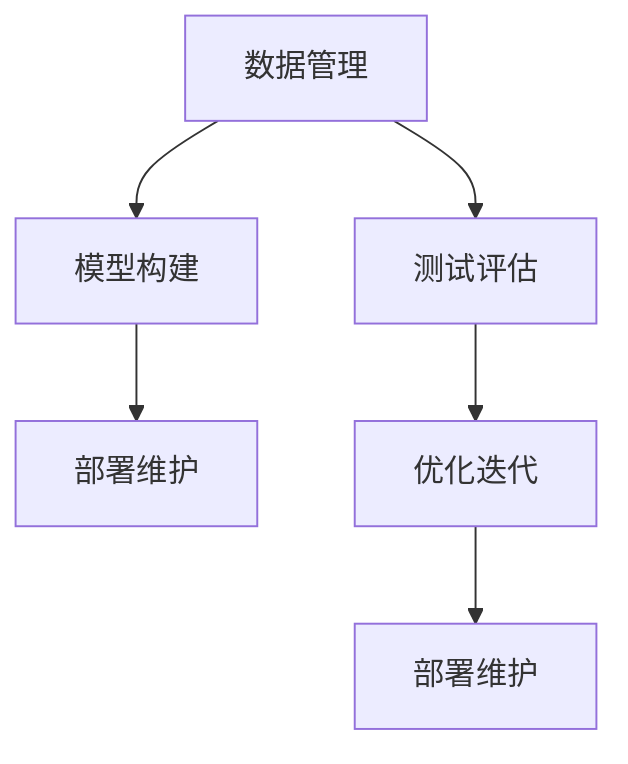

                 

# 基础模型的逐步发布策略

基础模型的发布是人工智能领域的重要环节，不仅涉及到模型的质量和技术深度，还关乎其应用价值和市场接受度。合理的发布策略能够确保模型在实际应用中的稳定性和有效性，同时也为开发者和用户提供了良好的使用体验。本文将从模型的构建、测试、部署和维护等多个方面，探讨基础模型的逐步发布策略，旨在为人工智能项目的成功部署提供参考。

## 1. 背景介绍

在人工智能技术日益成熟的今天，模型的发布已经不再是一个简单的技术问题，而是需要考虑用户体验、市场竞争、产品迭代等多重因素。一个成功的基础模型发布策略，能够确保模型在实际应用中的表现，同时也能吸引更多的用户和合作伙伴。

### 1.1 问题由来

基础模型的发布面临诸多挑战，包括数据质量、模型性能、应用场景复杂性等。这些问题不仅影响模型的开发进度，也决定了模型在实际应用中的效果。因此，制定一个科学的逐步发布策略，能够有效地应对这些挑战，确保模型的成功落地。

### 1.2 问题核心关键点

基础模型逐步发布的核心关键点包括：
- 数据准备：收集和处理高质量的数据，确保模型训练的充分性。
- 模型构建：选择合适的算法和架构，进行模型的训练和优化。
- 模型测试：通过严格的测试流程，评估模型的性能和稳定性。
- 部署策略：选择适宜的部署方式，确保模型在实际环境中的可靠运行。
- 维护与更新：建立模型维护机制，及时修复问题并进行版本迭代。

这些关键点共同构成了一个成功的基础模型发布策略的基础。

### 1.3 问题研究意义

合理的基础模型逐步发布策略，对于模型的高效开发和成功应用具有重要意义：
- 提升模型质量：通过严格的数据准备和模型测试，确保模型的准确性和鲁棒性。
- 加速产品迭代：基于模型性能的逐步优化，推动模型的快速迭代和应用升级。
- 优化用户体验：通过灵活的部署和维护机制，提升用户的使用体验和满意度。
- 增强市场竞争力：通过高质量的模型发布，吸引更多的合作伙伴和用户，提升市场份额。

## 2. 核心概念与联系

### 2.1 核心概念概述

在基础模型的逐步发布过程中，涉及多个核心概念，包括数据管理、模型构建、测试评估、部署维护等。这些概念之间相互关联，共同构成了模型发布的完整流程。

- **数据管理**：涉及数据的收集、清洗、标注和存储，是模型训练的基础。
- **模型构建**：包括模型的选择、训练和优化，确保模型具备良好的性能和泛化能力。
- **测试评估**：通过各种测试手段，评估模型在不同场景下的表现，识别潜在问题。
- **部署维护**：选择合适的部署方式，建立维护机制，确保模型在实际环境中的稳定运行。

### 2.2 概念间的关系

这些核心概念之间的关系可以通过以下Mermaid流程图来展示：



这个流程图展示了数据管理、模型构建、测试评估和部署维护之间的逻辑关系。模型构建基于数据管理，测试评估用于识别模型问题，部署维护确保模型在实际环境中的稳定运行，优化迭代则是通过测试评估和部署维护不断提升模型性能。

## 3. 核心算法原理 & 具体操作步骤
### 3.1 算法原理概述

基础模型的逐步发布策略，本质上是一个数据驱动的迭代优化过程。其核心思想是通过数据管理、模型构建、测试评估和部署维护等多个环节的不断循环，逐步提升模型的质量和应用效果。

具体来说，基础模型的发布策略包括以下几个关键步骤：

1. **数据准备**：收集和清洗高质量的数据，确保数据的多样性和代表性。
2. **模型训练**：选择合适的算法和架构，进行模型的训练和优化。
3. **模型测试**：通过各种测试手段，评估模型在不同场景下的表现，识别潜在问题。
4. **部署上线**：选择合适的部署方式，确保模型在实际环境中的稳定运行。
5. **模型优化**：基于测试结果和用户反馈，对模型进行优化和迭代，提升模型性能。

### 3.2 算法步骤详解

#### 3.2.1 数据准备

数据准备是基础模型发布的首要步骤。主要包括以下几个方面：

- **数据收集**：收集与目标任务相关的数据，确保数据的多样性和代表性。
- **数据清洗**：去除噪声数据和异常值，确保数据的准确性和完整性。
- **数据标注**：对数据进行标注，生成标注数据集。

#### 3.2.2 模型构建

模型构建是基础模型发布的中心环节。主要包括以下几个方面：

- **模型选择**：根据任务需求，选择合适的算法和架构。
- **模型训练**：使用收集到的数据对模型进行训练，优化模型参数。
- **模型评估**：使用测试集对模型进行评估，衡量模型性能。

#### 3.2.3 模型测试

模型测试是基础模型发布的重要环节。主要包括以下几个方面：

- **测试集设计**：设计合适的测试集，确保测试集的代表性。
- **性能评估**：使用各种评估指标，衡量模型在不同场景下的表现。
- **问题识别**：通过测试结果，识别模型在实际应用中的潜在问题。

#### 3.2.4 部署上线

模型部署是基础模型发布的最后一步。主要包括以下几个方面：

- **部署方式选择**：选择合适的部署方式，如云端、本地等。
- **环境配置**：配置部署环境，确保模型能够正常运行。
- **监控维护**：建立监控机制，及时发现和修复问题。

#### 3.2.5 模型优化

模型优化是基础模型发布后的持续工作。主要包括以下几个方面：

- **用户反馈**：收集用户反馈，识别模型应用中的问题。
- **问题修复**：根据用户反馈，修复模型中的问题。
- **版本迭代**：基于优化结果，进行模型版本迭代，提升模型性能。

### 3.3 算法优缺点

基础模型的逐步发布策略具有以下优点：

- **提升模型质量**：通过数据管理和模型构建，确保模型具备良好的性能和泛化能力。
- **加速产品迭代**：基于模型性能的逐步优化，推动模型的快速迭代和应用升级。
- **优化用户体验**：通过灵活的部署和维护机制，提升用户的使用体验和满意度。
- **增强市场竞争力**：通过高质量的模型发布，吸引更多的合作伙伴和用户，提升市场份额。

同时，这种策略也存在一些缺点：

- **时间成本高**：模型发布周期较长，需要多次迭代和优化。
- **资源投入大**：数据准备和模型构建需要大量人力物力投入。
- **风险控制难**：模型发布后可能出现新的问题，需要进行持续维护。

## 4. 数学模型和公式 & 详细讲解 & 举例说明

### 4.1 数学模型构建

基础模型逐步发布的过程可以通过以下数学模型进行描述：

设模型参数为 $\theta$，训练集为 $D=\{(x_i, y_i)\}_{i=1}^N$，其中 $x_i$ 为输入数据，$y_i$ 为标签。模型在训练集上的损失函数为：

$$
L(\theta) = \frac{1}{N} \sum_{i=1}^N \ell(M_{\theta}(x_i), y_i)
$$

其中 $\ell$ 为损失函数，$M_{\theta}$ 为模型。

模型的目标是最小化损失函数，即：

$$
\theta^* = \arg\min_{\theta} L(\theta)
$$

### 4.2 公式推导过程

模型训练的优化目标是通过最小化损失函数，调整模型参数 $\theta$。常见的优化算法包括梯度下降法、Adam等。

以梯度下降法为例，其更新公式为：

$$
\theta \leftarrow \theta - \eta \nabla_{\theta} L(\theta)
$$

其中 $\eta$ 为学习率，$\nabla_{\theta} L(\theta)$ 为损失函数对模型参数的梯度。

在模型测试阶段，通过测试集对模型进行评估，衡量模型在不同场景下的表现。常见的评估指标包括准确率、召回率、F1分数等。

### 4.3 案例分析与讲解

以一个简单的分类任务为例，假设模型为逻辑回归模型，训练集为 $D=\{(x_i, y_i)\}_{i=1}^N$。模型的损失函数为交叉熵损失：

$$
L(\theta) = -\frac{1}{N} \sum_{i=1}^N [y_i \log \sigma(M_{\theta}(x_i)) + (1 - y_i) \log (1 - \sigma(M_{\theta}(x_i)))
$$

其中 $\sigma$ 为 sigmoid 函数。

模型的优化目标为：

$$
\theta^* = \arg\min_{\theta} L(\theta)
$$

通过梯度下降法进行模型训练，迭代过程如下：

1. 初始化模型参数 $\theta_0$。
2. 计算损失函数 $L(\theta)$ 和梯度 $\nabla_{\theta} L(\theta)$。
3. 更新模型参数：$\theta_{k+1} = \theta_k - \eta_k \nabla_{\theta} L(\theta_k)$。
4. 重复步骤 2-3，直至收敛。

通过不断迭代和优化，模型能够逐步提升性能，满足实际应用需求。

## 5. 项目实践：代码实例和详细解释说明

### 5.1 开发环境搭建

在进行基础模型发布实践前，需要先准备好开发环境。以下是使用Python进行PyTorch开发的配置流程：

1. 安装Anaconda：从官网下载并安装Anaconda，用于创建独立的Python环境。
2. 创建并激活虚拟环境：
```bash
conda create -n pytorch-env python=3.8 
conda activate pytorch-env
```

3. 安装PyTorch：根据CUDA版本，从官网获取对应的安装命令。例如：
```bash
conda install pytorch torchvision torchaudio cudatoolkit=11.1 -c pytorch -c conda-forge
```

4. 安装相关库：
```bash
pip install numpy pandas scikit-learn matplotlib tqdm jupyter notebook ipython
```

完成上述步骤后，即可在`pytorch-env`环境中进行模型构建和发布实践。

### 5.2 源代码详细实现

以下是一个简单的逻辑回归模型发布流程的代码实现。

首先，定义模型和优化器：

```python
import torch
from torch import nn, optim

class LogisticRegression(nn.Module):
    def __init__(self, input_size, output_size):
        super(LogisticRegression, self).__init__()
        self.linear = nn.Linear(input_size, output_size)
    
    def forward(self, x):
        return self.linear(x)

# 定义优化器和损失函数
model = LogisticRegression(input_size=784, output_size=10)
optimizer = optim.SGD(model.parameters(), lr=0.01)
loss_fn = nn.CrossEntropyLoss()

# 准备数据
train_data = ...
train_labels = ...
test_data = ...
test_labels = ...
```

然后，进行模型的训练和测试：

```python
epochs = 10
batch_size = 32

# 定义训练函数
def train(model, train_data, train_labels, optimizer, loss_fn, num_epochs):
    for epoch in range(num_epochs):
        for batch_idx, (data, target) in enumerate(train_loader):
            optimizer.zero_grad()
            output = model(data)
            loss = loss_fn(output, target)
            loss.backward()
            optimizer.step()

        print(f'Epoch {epoch+1}/{num_epochs}, Loss: {loss:.4f}')

# 定义测试函数
def test(model, test_data, test_labels, loss_fn):
    test_loss = 0
    correct = 0
    total = 0
    with torch.no_grad():
        for data, target in test_loader:
            output = model(data)
            test_loss += loss_fn(output, target).item()
            pred = output.argmax(dim=1, keepdim=True)
            correct += pred.eq(target.view_as(pred)).sum().item()
            total += target.size(0)
    
    print(f'Test Loss: {test_loss/len(test_loader):.4f}, Accuracy: {(100*correct/total):.2f}%')
```

最后，启动模型训练和测试：

```python
# 训练模型
train(model, train_data, train_labels, optimizer, loss_fn, 10)

# 测试模型
test(model, test_data, test_labels, loss_fn)
```

以上就是使用PyTorch进行逻辑回归模型发布流程的完整代码实现。可以看到，通过简单的代码实现，便能够完成基础模型的发布流程。

### 5.3 代码解读与分析

让我们再详细解读一下关键代码的实现细节：

**LogisticRegression类**：
- `__init__`方法：定义模型的线性层。
- `forward`方法：定义前向传播过程，将输入数据通过线性层得到输出。

**优化器和损失函数**：
- 定义了优化器和损失函数，用于模型的训练和评估。

**数据准备**：
- 定义了训练集和测试集，用于模型的训练和测试。

**训练函数和测试函数**：
- `train`函数：定义训练过程，通过前向传播和反向传播更新模型参数。
- `test`函数：定义测试过程，计算模型在测试集上的损失和准确率。

**训练和测试流程**：
- 通过训练函数进行模型的训练，更新模型参数。
- 通过测试函数进行模型的测试，评估模型性能。

## 6. 实际应用场景

### 6.1 医疗诊断系统

基础模型的逐步发布策略在医疗诊断系统中得到了广泛应用。医疗诊断系统需要高准确性和高鲁棒性，通过逐步发布策略，可以逐步优化模型，确保其在实际应用中的表现。

具体而言，可以收集历史病历数据，将病历和诊断结果构建成监督数据，在此基础上对预训练模型进行逐步发布。通过多轮迭代和优化，逐步提升模型在实际应用中的性能，确保诊断结果的准确性和可靠性。

### 6.2 金融风控系统

金融风控系统需要实时监测和预测金融风险，基础模型的逐步发布策略在此领域同样适用。

具体而言，可以收集历史交易数据，将交易记录和风险等级构建成监督数据，在此基础上对预训练模型进行逐步发布。通过多轮迭代和优化，逐步提升模型在实时环境中的性能，确保风险预测的准确性和及时性。

### 6.3 智能推荐系统

智能推荐系统需要高效和精准的推荐结果，基础模型的逐步发布策略在此领域同样适用。

具体而言，可以收集用户历史行为数据，将行为数据和推荐结果构建成监督数据，在此基础上对预训练模型进行逐步发布。通过多轮迭代和优化，逐步提升模型在实际应用中的性能，确保推荐结果的个性化和准确性。

## 7. 工具和资源推荐

### 7.1 学习资源推荐

为了帮助开发者系统掌握基础模型逐步发布的理论基础和实践技巧，这里推荐一些优质的学习资源：

1. **《机器学习实战》**：一本经典的机器学习入门书籍，涵盖了机器学习的基础理论和实践技巧，适合初学者入门。
2. **Coursera的机器学习课程**：由斯坦福大学Andrew Ng教授主讲的机器学习课程，系统介绍机器学习的基本概念和应用案例，适合深入学习。
3. **Kaggle竞赛平台**：一个机器学习竞赛平台，提供了大量的数据集和竞赛任务，适合实践和交流。

通过对这些资源的学习实践，相信你一定能够快速掌握基础模型逐步发布的精髓，并用于解决实际的AI问题。

### 7.2 开发工具推荐

高效的开发离不开优秀的工具支持。以下是几款用于基础模型逐步发布的常用工具：

1. **PyTorch**：基于Python的开源深度学习框架，灵活动态的计算图，适合快速迭代研究。
2. **TensorFlow**：由Google主导开发的开源深度学习框架，生产部署方便，适合大规模工程应用。
3. **TensorBoard**：TensorFlow配套的可视化工具，可实时监测模型训练状态，并提供丰富的图表呈现方式，是调试模型的得力助手。
4. **Weights & Biases**：模型训练的实验跟踪工具，可以记录和可视化模型训练过程中的各项指标，方便对比和调优。

合理利用这些工具，可以显著提升基础模型逐步发布的开发效率，加快创新迭代的步伐。

### 7.3 相关论文推荐

基础模型逐步发布的研究源于学界的持续研究。以下是几篇奠基性的相关论文，推荐阅读：

1. **《深度学习入门》**：一本关于深度学习的入门书籍，系统介绍了深度学习的基本原理和应用案例，适合初学者入门。
2. **《深度学习》**：一本由Ian Goodfellow等人撰写的深度学习经典教材，系统介绍了深度学习的基本原理和应用案例，适合深入学习。
3. **《机器学习》**：一本由Tom Mitchell撰写的机器学习经典教材，系统介绍了机器学习的基本原理和应用案例，适合深入学习。

这些论文代表了大语言模型逐步发布技术的发展脉络。通过学习这些前沿成果，可以帮助研究者把握学科前进方向，激发更多的创新灵感。

## 8. 总结：未来发展趋势与挑战

### 8.1 研究成果总结

本文对基础模型逐步发布策略进行了全面系统的介绍。首先阐述了基础模型逐步发布的重要性和具体步骤，明确了基础模型逐步发布的关键要素。其次，从原理到实践，详细讲解了基础模型逐步发布的步骤和具体操作，给出了基础模型逐步发布的完整代码实例。同时，本文还探讨了基础模型逐步发布在医疗、金融、推荐等多个领域的应用前景，展示了基础模型逐步发布的广泛应用潜力。

### 8.2 未来发展趋势

展望未来，基础模型逐步发布策略将呈现以下几个发展趋势：

1. **自动化和智能化**：随着自动化技术的发展，基础模型的逐步发布将更加自动化和智能化，减少人工干预，提高发布效率。
2. **多模态融合**：未来的基础模型逐步发布将更多地考虑多模态数据的融合，提升模型的全面性和准确性。
3. **持续学习和优化**：基础模型的逐步发布将更加注重持续学习和优化，保持模型的时效性和适应性。
4. **跨平台和跨系统**：基础模型的逐步发布将更加注重跨平台和跨系统的兼容性，支持多种部署环境和系统架构。
5. **开放和协作**：基础模型的逐步发布将更加注重开放和协作，通过开源和合作，加速技术进步和应用落地。

### 8.3 面临的挑战

尽管基础模型逐步发布策略已经取得了显著进展，但在迈向更加智能化、普适化应用的过程中，它仍面临诸多挑战：

1. **数据获取和处理**：基础模型的逐步发布需要高质量的数据，但数据获取和处理往往需要大量人力物力投入。
2. **模型优化和迭代**：基础模型的逐步发布需要多次迭代和优化，时间成本和资源投入较大。
3. **模型鲁棒性和泛化能力**：基础模型逐步发布需要保证模型的鲁棒性和泛化能力，避免过拟合和欠拟合。
4. **模型监控和维护**：基础模型的逐步发布需要建立完善的监控和维护机制，及时发现和修复问题。
5. **模型性能和效果**：基础模型的逐步发布需要保证模型在实际应用中的性能和效果，满足业务需求。

### 8.4 研究展望

面对基础模型逐步发布所面临的挑战，未来的研究需要在以下几个方面寻求新的突破：

1. **自动化数据处理**：研究自动化数据处理技术，减少人工干预，提高数据处理效率。
2. **高效模型优化**：研究高效模型优化方法，减少迭代次数，提高模型优化效率。
3. **多模态数据融合**：研究多模态数据融合技术，提升模型的全面性和准确性。
4. **持续学习和优化**：研究持续学习和优化方法，保持模型的时效性和适应性。
5. **模型性能提升**：研究模型性能提升方法，提高模型的鲁棒性和泛化能力。

这些研究方向的探索，必将引领基础模型逐步发布技术迈向更高的台阶，为构建安全、可靠、可解释、可控的智能系统铺平道路。面向未来，基础模型逐步发布技术还需要与其他人工智能技术进行更深入的融合，如知识表示、因果推理、强化学习等，多路径协同发力，共同推动人工智能技术的进步。只有勇于创新、敢于突破，才能不断拓展基础模型的边界，让智能技术更好地造福人类社会。

## 9. 附录：常见问题与解答

**Q1：基础模型的逐步发布策略是否适用于所有AI项目？**

A: 基础模型的逐步发布策略适用于大多数AI项目，特别是那些需要逐步优化和迭代的项目。但对于一些需要即时性要求高的项目，如实时视频分析、在线游戏等，可能需要采用其他快速迭代和优化的方法。

**Q2：如何选择合适的模型架构？**

A: 选择合适的模型架构需要考虑多个因素，包括任务的复杂性、数据的特征、计算资源的可用性等。通常可以从简单的模型开始，逐步复杂化模型，并进行性能和资源评估，选择最合适的架构。

**Q3：如何进行多轮迭代和优化？**

A: 进行多轮迭代和优化需要制定详细的迭代计划，包括每次迭代的优化目标、优化方法、测试集选择等。可以采用交叉验证、增量训练等方法，逐步优化模型性能。

**Q4：如何处理数据不平衡问题？**

A: 数据不平衡问题可以通过重采样、欠采样、过采样等方法进行处理。同时，可以通过修改损失函数、引入正则化等手段，提高模型的泛化能力。

**Q5：如何保证模型的鲁棒性和泛化能力？**

A: 保证模型的鲁棒性和泛化能力需要通过数据清洗、正则化、对抗训练等手段进行。同时，可以通过引入先验知识、优化超参数等方法，提升模型的泛化能力。

---

作者：禅与计算机程序设计艺术 / Zen and the Art of Computer Programming

