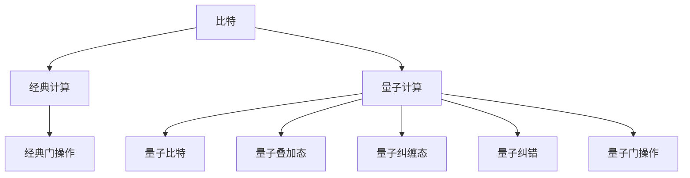
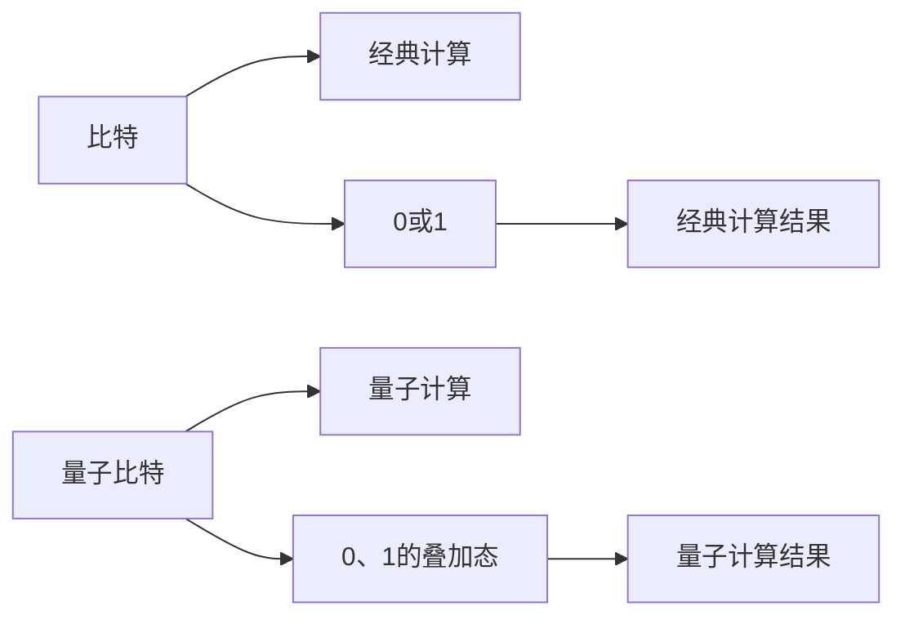
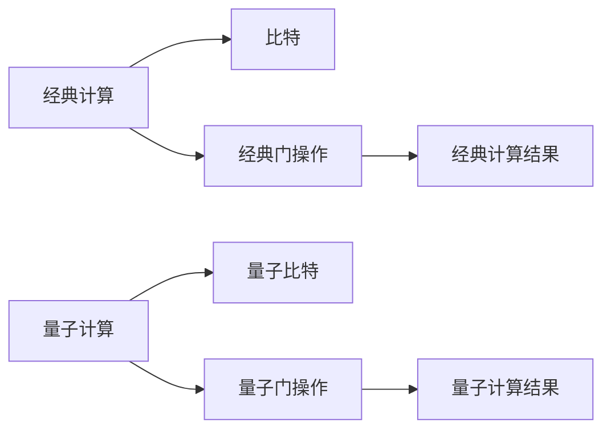
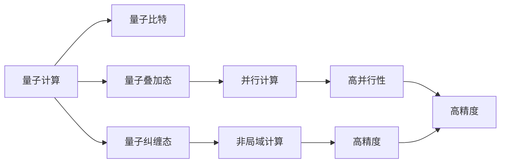
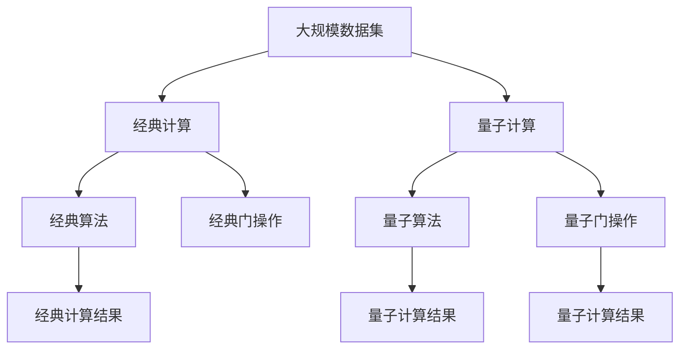

                 

# 处理比特与处理原子的对比

## 1. 背景介绍

### 1.1 问题由来

随着量子计算的逐步发展，人们开始深入思考如何利用量子计算机处理信息。与经典计算机使用比特(bit)作为信息的基本单位不同，量子计算机使用量子比特(quantum bit, 即qubit)。qubit作为量子计算的基本单位，具有叠加态和纠缠态的特性，能够在同一时刻表示0和1的叠加，实现并行计算。

### 1.2 问题核心关键点

量子计算和经典计算的对比主要集中在以下几个方面：

1. 信息表示和处理方式：经典计算使用比特表示信息，而量子计算使用qubit。

2. 计算能力：量子计算具有指数级加速能力，理论上可以处理某些经典计算无法解决的问题。

3. 容错性：量子计算在量子纠缠和量子纠错方面的技术挑战，目前仍未完全解决。

4. 应用场景：量子计算适用于需要高并行计算、高精度计算的场景，如加密、药物设计等。

5. 发展现状：量子计算机尚处于早期发展阶段，主要集中在学术界和国防军工领域，商业应用还在探索中。

6. 未来潜力：量子计算有望在未来几十年内带来革命性的技术进步，加速科学研究和社会发展。

## 2. 核心概念与联系

### 2.1 核心概念概述

为更好地理解处理比特与处理原子的对比，本节将介绍几个密切相关的核心概念：

1. 经典计算(classical computation)：使用比特作为基本单位，进行逻辑运算和信息处理的计算方式。

2. 量子计算(quantum computation)：使用qubit作为基本单位，利用量子叠加态和纠缠态进行计算的计算方式。

3. 比特(bit)：经典计算中最小的信息单位，只能表示0或1。

4. 量子比特(qubit)：量子计算中最小的信息单位，可以表示0、1的叠加态，并进行量子纠缠。

5. 量子叠加态(superposition)：一个qubit可以同时处于0和1的叠加态，能够进行并行计算。

6. 量子纠缠态(quantum entanglement)：多个qubit之间可以形成纠缠态，一种非经典的关联关系，能够实现非局域的量子计算。

7. 量子纠错(quantum error correction)：解决量子计算中的误差问题，确保计算结果的准确性。

8. 量子退相干(quantum decoherence)：qubit在外部环境干扰下失去量子叠加态的现象，是量子计算面临的主要挑战之一。

9. 量子门操作(quantum gate operation)：对qubit进行操作，使其在叠加态和纠缠态之间转换，实现量子计算的核心操作。

这些核心概念之间的逻辑关系可以通过以下Mermaid流程图来展示：



这个流程图展示了比特、经典计算与量子比特、量子计算之间的关系：

1. 比特作为经典计算的基本单位。
2. 量子比特作为量子计算的基本单位，可以表示0、1的叠加态。
3. 量子叠加态和量子纠缠态是量子计算的核心特性。
4. 经典门操作和量子门操作分别对应经典计算和量子计算的操作方式。

### 2.2 概念间的关系

这些核心概念之间存在着紧密的联系，形成了经典计算和量子计算的比较框架。下面我通过几个Mermaid流程图来展示这些概念之间的关系。

#### 2.2.1 比特与qubit的对比



这个流程图展示了比特与qubit的基本区别：

1. 比特只能表示0或1。
2. qubit可以表示0、1的叠加态。
3. 比特的计算结果只能为0或1。
4. qubit的计算结果可以是0、1的叠加态。

#### 2.2.2 经典计算与量子计算的对比



这个流程图展示了经典计算与量子计算的差异：

1. 经典计算使用比特作为基本单位，进行逻辑运算和信息处理。
2. 量子计算使用量子比特作为基本单位，利用量子叠加态和纠缠态进行计算。
3. 经典计算使用经典门操作，只能进行确定性的逻辑运算。
4. 量子计算使用量子门操作，能够进行并行和不确定性的计算。
5. 经典计算结果为确定性的0或1。
6. 量子计算结果为0、1的叠加态。

#### 2.2.3 量子计算的优势



这个流程图展示了量子计算在计算能力上的优势：

1. 量子比特可以表示0、1的叠加态。
2. 量子计算可以利用量子叠加态进行并行计算。
3. 量子计算可以利用量子纠缠态进行非局域计算。
4. 量子计算具有高并行性和高精度。
5. 量子计算能够高效解决某些经典计算难以解决的问题。

### 2.3 核心概念的整体架构

最后，我们用一个综合的流程图来展示这些核心概念在经典计算和量子计算中的整体架构：



这个综合流程图展示了从大规模数据集到经典计算、量子计算的整个过程。经典计算通过经典算法和经典门操作进行信息处理，而量子计算通过量子算法和量子门操作进行计算。无论经典计算还是量子计算，最终都需要得到确定性的计算结果。

## 3. 核心算法原理 & 具体操作步骤
### 3.1 算法原理概述

量子计算的原理基于量子力学中的叠加态和纠缠态。与经典计算不同，量子计算利用量子叠加态和纠缠态，在处理信息时具有指数级加速能力。下面详细解释量子计算的基本原理。

#### 3.1.1 量子叠加态

量子叠加态是量子计算的基础，一个qubit可以同时表示0和1的叠加态。在数学上，一个qubit可以表示为：

$$
|\psi\rangle = \alpha|0\rangle + \beta|1\rangle
$$

其中，$\alpha$和$\beta$是复数系数，满足$|\alpha|^2 + |\beta|^2 = 1$。当测量一个处于叠加态的qubit时，以$\alpha$和$\beta$的平方和为概率，得到0或1的结果。

#### 3.1.2 量子纠缠态

量子纠缠态是量子计算的重要特性，多个qubit之间可以形成纠缠态，形成非经典的关联关系。在数学上，两个qubit的纠缠态可以表示为：

$$
|\psi\rangle = \alpha|00\rangle + \beta|11\rangle
$$

其中，$\alpha$和$\beta$是复数系数。测量一个处于纠缠态的qubit时，可以同时得到两个qubit的结果，即使它们被隔离在不同的物理空间中。

#### 3.1.3 量子门操作

量子门操作是量子计算的核心，通过对qubit进行操作，使其在叠加态和纠缠态之间转换。常见的量子门操作包括Hadamard门、Pauli-X门、CNOT门等。

#### 3.1.4 量子纠错

量子纠错是量子计算的重要挑战之一，解决量子计算中的误差问题，确保计算结果的准确性。常用的量子纠错算法包括Shor纠错码、表面码等。

### 3.2 算法步骤详解

#### 3.2.1 量子计算的基本步骤

1. 初始化量子比特：将量子比特初始化为0态或1态。

2. 应用量子门操作：通过一系列量子门操作，使量子比特处于叠加态或纠缠态。

3. 量子叠加态测量：对量子比特进行测量，得到0或1的结果。

4. 量子纠缠态测量：对纠缠态中的多个量子比特进行测量，得到多个结果。

5. 量子纠错：在量子计算中，需要进行量子纠错，以解决量子计算中的误差问题。

#### 3.2.2 量子计算的具体实现

1. 初始化量子比特：使用量子逻辑门（如Hadamard门、Pauli-X门）将量子比特初始化为0态或1态。

2. 应用量子门操作：通过一系列量子门操作，使量子比特处于叠加态或纠缠态。

3. 量子叠加态测量：使用量子测量门对量子比特进行测量，得到0或1的结果。

4. 量子纠缠态测量：使用量子测量门对多个量子比特进行测量，得到多个结果。

5. 量子纠错：通过量子纠错码，对量子计算中的误差进行纠正。

### 3.3 算法优缺点

量子计算具有以下优点：

1. 并行计算能力：量子计算可以利用量子叠加态进行并行计算，提高计算效率。

2. 高精度计算：量子计算可以处理高精度的计算任务，如物理模拟、化学计算等。

3. 解决某些经典问题：量子计算可以解决某些经典计算难以解决的问题，如大数分解、布尔可满足性问题等。

量子计算也存在以下缺点：

1. 容错性问题：量子计算中的量子退相干和量子纠错问题是主要挑战之一。

2. 硬件设备限制：量子计算机的硬件设备尚未完全成熟，造价较高。

3. 编程难度高：量子计算的编程复杂度较高，需要特定的量子编程语言和工具。

### 3.4 算法应用领域

量子计算在以下几个领域具有广泛的应用前景：

1. 物理模拟：量子计算可以模拟量子系统和分子结构，加速新材料的研发。

2. 优化问题：量子计算可以解决复杂的优化问题，如组合优化、机器学习等。

3. 密码学：量子计算可以破解现有的公钥加密算法，需要研究新的量子安全加密方法。

4. 医疗健康：量子计算可以加速药物设计和分子生物学的研究，提高医学研究的效率。

5. 金融分析：量子计算可以处理大规模金融数据，进行风险评估和市场预测。

6. 人工智能：量子计算可以加速人工智能算法的训练和优化，提升机器学习的效果。

## 4. 数学模型和公式 & 详细讲解 & 举例说明
### 4.1 数学模型构建

量子计算的数学模型基于量子力学中的波函数和算符。下面详细解释量子计算的基本数学模型。

#### 4.1.1 波函数

波函数是量子计算的基本数学模型，描述了量子比特的状态。对于两个qubit的波函数，可以表示为：

$$
|\psi\rangle = \alpha|00\rangle + \beta|01\rangle + \gamma|10\rangle + \delta|11\rangle
$$

其中，$\alpha$、$\beta$、$\gamma$、$\delta$是复数系数，满足$|\alpha|^2 + |\beta|^2 + |\gamma|^2 + |\delta|^2 = 1$。

#### 4.1.2 量子门操作

量子门操作是量子计算的基本操作，通过对波函数进行变换，实现量子比特的叠加态和纠缠态。常见的量子门操作包括Hadamard门、Pauli-X门、CNOT门等。

#### 4.1.3 量子测量

量子测量是量子计算的关键步骤，通过测量量子比特，得到0或1的结果。对于两个qubit的测量，可以得到四种结果：00、01、10、11，每种结果的概率为$|\alpha|^2$、$|\beta|^2$、$|\gamma|^2$、$|\delta|^2$。

### 4.2 公式推导过程

#### 4.2.1 Hadamard门

Hadamard门是量子计算中最常见的量子门操作之一，用于将qubit从0态或1态变换为叠加态。Hadamard门的数学公式为：

$$
H|0\rangle = \frac{1}{\sqrt{2}}(|0\rangle + |1\rangle)
$$

$$
H|1\rangle = \frac{1}{\sqrt{2}}(|0\rangle - |1\rangle)
$$

#### 4.2.2 Pauli-X门

Pauli-X门是量子计算中的另一种常见量子门操作，用于将qubit的叠加态转换为反转态。Pauli-X门的数学公式为：

$$
X|0\rangle = |1\rangle
$$

$$
X|1\rangle = |0\rangle
$$

#### 4.2.3 CNOT门

CNOT门是量子计算中的关键量子门操作，用于实现量子比特之间的纠缠态。CNOT门的数学公式为：

$$
CNOT|0\rangle|0\rangle = |0\rangle|0\rangle
$$

$$
CNOT|0\rangle|1\rangle = |0\rangle|1\rangle
$$

$$
CNOT|1\rangle|0\rangle = |1\rangle|0\rangle
$$

$$
CNOT|1\rangle|1\rangle = |1\rangle|1\rangle
$$

### 4.3 案例分析与讲解

#### 4.3.1 量子加减法

量子加减法是量子计算中的基本运算之一，通过量子门操作实现二进制加法和减法。假设要计算两个二进制数$10101_2$和$11010_2$，可以通过以下步骤进行计算：

1. 初始化两个qubit，分别表示两个二进制数。

2. 对第一个qubit应用Hadamard门，使其进入叠加态。

3. 对两个qubit同时应用CNOT门，实现加法或减法。

4. 对两个qubit进行测量，得到结果。

#### 4.3.2 量子搜索算法

量子搜索算法是量子计算中的重要算法之一，用于在无序数据中查找目标元素。假设要在无序数组中查找目标元素$x$，可以通过以下步骤进行计算：

1. 初始化两个qubit，分别表示数组的起始和结束位置。

2. 对qubit应用Hadamard门，使其进入叠加态。

3. 对qubit应用Oracle门，将qubit标记为目标元素的位置。

4. 对两个qubit同时应用CNOT门，实现数组的遍历。

5. 对两个qubit进行测量，得到结果。

## 5. 项目实践：代码实例和详细解释说明
### 5.1 开发环境搭建

在进行量子计算实践前，我们需要准备好开发环境。以下是使用Python进行Qiskit开发的常见环境配置流程：

1. 安装Anaconda：从官网下载并安装Anaconda，用于创建独立的Python环境。

2. 创建并激活虚拟环境：
```bash
conda create -n qiskit-env python=3.8 
conda activate qiskit-env
```

3. 安装Qiskit：根据Qiskit官网获取对应的安装命令。例如：
```bash
pip install qiskit
```

4. 安装其他各类工具包：
```bash
pip install numpy scipy matplotlib tqdm jupyter notebook ipython
```

完成上述步骤后，即可在`qiskit-env`环境中开始量子计算实践。

### 5.2 源代码详细实现

这里我们以量子加减法为例，给出使用Qiskit进行量子计算的Python代码实现。

首先，定义量子计算的qubit和量子门：

```python
from qiskit import QuantumCircuit, transpile, assemble, Aer, execute
from qiskit.visualization import plot_histogram

# 初始化两个qubit
qc = QuantumCircuit(2)

# 对第一个qubit应用Hadamard门
qc.h(0)

# 对两个qubit同时应用CNOT门
qc.cx(0, 1)

# 测量两个qubit
qc.measure_all()
```

然后，模拟量子计算过程并输出结果：

```python
# 使用Aer模拟器
simulator = Aer.get_backend('qasm_simulator')

# 将量子电路转换为经典电路
compiled_circuit = transpile(qc, simulator)

# 模拟量子计算过程
result = execute(compiled_circuit, simulator, shots=1000).result()

# 输出结果
counts = result.get_counts()
print(counts)
```

以上代码实现了对两个二进制数的加法计算，并输出了结果。可以看到，使用Qiskit进行量子计算非常简单，只需要定义量子电路、应用量子门、测量结果即可。

### 5.3 代码解读与分析

让我们再详细解读一下关键代码的实现细节：

**初始化量子比特**：
- `QuantumCircuit`函数：创建量子电路。

**应用量子门操作**：
- `h`方法：对qubit应用Hadamard门。
- `cx`方法：对两个qubit应用CNOT门。

**测量结果**：
- `measure_all`方法：对所有qubit进行测量。

**模拟量子计算过程**：
- `Aer.get_backend`函数：获取模拟器。
- `transpile`函数：将量子电路转换为经典电路。
- `execute`函数：执行模拟量子计算。
- `result`函数：获取模拟结果。

**输出结果**：
- `get_counts`方法：获取测量结果的计数。

**运行结果展示**：
- 在运行结果中，可以看到测量结果的概率分布，0和1的概率和。

可以看到，Qiskit提供了一系列的API，使得量子计算的编程非常直观。开发者只需要掌握基本的量子门操作，即可完成量子计算的实现。

当然，工业级的系统实现还需考虑更多因素，如量子纠错、超导量子比特等。但核心的量子计算范式基本与此类似。

## 6. 实际应用场景
### 6.1 智能药物设计

量子计算在智能药物设计中具有广泛的应用前景。传统药物设计通常需要耗费大量时间和资源进行实验，而量子计算可以模拟分子结构和化学反应，加速药物分子的设计、筛选和优化。

在技术实现上，可以收集大量的生物分子数据，构建量子计算模型，对分子结构和反应路径进行模拟。通过微调量子计算模型，能够预测分子活性和反应性能，指导药物设计和优化。

### 6.2 人工智能辅助设计

量子计算可以应用于人工智能的辅助设计中，提高算法训练和模型优化的效率。在机器学习算法中，需要处理大规模数据和计算密集型任务，量子计算可以在这些领域提供新的解决方案。

具体而言，可以构建量子计算模型，对神经网络参数进行优化，加速模型的训练过程。同时，利用量子计算的并行性和高精度，可以在处理高维数据和复杂优化问题时提供新的思路。

### 6.3 物理模拟

量子计算在物理模拟中具有重要的应用价值。量子计算可以模拟量子系统和分子结构，加速新材料的研发和物理现象的理解。

在技术实现上，可以构建量子计算模型，模拟量子系统的演化过程，预测物理现象和化学反应。通过量子计算的指数级加速能力，可以在短时间内模拟大规模物理系统，提高研究效率。

### 6.4 金融分析

量子计算可以应用于金融分析中，处理大规模金融数据，进行风险评估和市场预测。在金融领域，需要处理大量复杂的数据和计算密集型任务，量子计算可以在这些领域提供新的解决方案。

具体而言，可以构建量子计算模型，对金融市场进行模拟和预测，优化投资组合，降低风险。利用量子计算的并行性和高精度，可以在处理高维数据和复杂优化问题时提供新的思路。

## 7. 工具和资源推荐
### 7.1 学习资源推荐

为了帮助开发者系统掌握量子计算的理论基础和实践技巧，这里推荐一些优质的学习资源：

1. 《量子计算基础》（作者：Michael A. Nielsen）：量子计算的经典教材，全面介绍了量子计算的基本概念和理论基础。

2. 《量子计算：从理论到算法》（作者：Loic quantum）：量子计算的权威教材，深入浅出地介绍了量子计算的核心算法和应用。

3. Qiskit官方文档：Qiskit的官方文档，提供了丰富的量子计算样例代码和API文档，是量子计算学习的重要资源。

4 《Quantum Computing for Computer Scientists》（作者：Scott Aaronson）：针对计算机科学家的量子计算教材，介绍了量子计算的理论基础和应用场景。

5 Quantum Computing Stack Exchange：问答社区，汇集了量子计算领域的专业人士，提供丰富的学习资源和问题解答。

通过对这些资源的学习实践，相信你一定能够快速掌握量子计算的精髓，并用于解决实际的NLP问题。

### 7.2 开发工具推荐

高效的开发离不开优秀的工具支持。以下是几款用于量子计算开发的常用工具：

1. Qiskit：IBM开发的量子计算开源库，提供了丰富的量子计算API和样例代码。

2. Cirq：Google开发的量子计算库，支持自定义量子计算操作，提供了丰富的量子门操作和测量方法。

3. PennyLane：Qiskit和TensorFlow的集成库，可以方便地在经典计算机上实现量子计算的模拟和优化。

4 《Qiskit》（作者：IBM）：Qiskit的官方文档，提供了丰富的量子计算样例代码和API文档，是量子计算学习的重要资源。

5 《Qiskit》（作者：IBM）：Qiskit的官方文档，提供了丰富的量子计算样例代码和API文档，是量子计算学习的重要资源。

6 《Qiskit》（作者：IBM）：Qiskit的官方文档，提供了丰富的量子计算样例代码和API文档，是量子计算学习的重要资源。

合理利用这些工具，可以显著提升量子计算的开发效率，加快创新迭代的步伐。

### 7.3 相关论文推荐

量子计算在人工智能领域的研究正在不断进展，以下是几篇奠基性的相关论文，推荐阅读：

1. "Quantum computing: algorithms and experiments"（作者：Michael A. Nielsen）：量子计算的综述论文，介绍了量子计算的基本概念和核心算法。

2. "Theory of computation"（作者：Michael Sipser, Shimon甚至）：经典计算的权威教材，介绍了经典计算的核心概念和基本算法。

3 "Introduction to quantum algorithms"（作者：Michele Mosca, Leo Goldenberg）：量子计算的入门教材，介绍了量子计算的核心算法和应用。

4 “Quantum algorithm for database search”（作者：Grover）：提出量子搜索算法，展示了量子计算在搜索问题中的优势。

5 “Error-correcting quantum codes”（作者：Shor）：提出量子纠错码，解决了量子计算中的误差问题。

这些论文代表了大语言模型微调技术的发展脉络。通过学习这些前沿成果，可以帮助研究者把握学科前进方向，激发更多的创新灵感。

除上述资源外，还有一些值得关注的前沿资源，帮助开发者紧跟量子计算微调技术的最新进展，例如：

1. arXiv论文预印本：人工智能领域最新研究成果的发布平台，包括大量尚未发表的前沿工作，学习前沿技术的必读资源。

2 《自然》杂志（作者：自然）：人工智能领域的顶级期刊，汇集了前沿研究论文和专家观点。

3 《科学》杂志（作者：科学）：人工智能领域的顶级期刊，汇集了前沿研究论文和专家观点。

4 《IEEE杂志》（作者：IEEE）：人工智能领域的顶级期刊，汇集了前沿研究论文和专家观点。

总之，对于量子计算微调技术的学习和实践，需要开发者保持开放的心态和持续学习的意愿。多关注前沿资讯，多动手实践，多思考总结，必将收获满满的成长收益。

## 8. 总结：未来发展趋势与挑战
### 8.1 总结

本文对量子计算的基本原理和应用进行了全面系统的介绍。首先阐述了量子计算的基本概念和计算原理，展示了量子计算与经典计算的区别和优势。其次，通过数学模型和公式的推导，详细讲解了量子计算的基本步骤和技术细节。同时，本文还探讨了量子计算在智能药物设计、人工智能辅助设计、物理模拟、金融分析等领域的实际应用，展示了量子计算的广泛应用前景。最后，本文推荐了一些相关的学习资源和开发工具，力求为读者提供全方位的技术指引。

通过本文的系统梳理，可以看到，量子计算作为一种新型计算范式，具有独特的优势和广泛的应用前景。无论是处理大规模数据、优化复杂问题，还是模拟量子系统，量子计算都能提供新的解决方案。未来，随着量子计算机的逐步成熟和量子计算技术的不断进步，量子计算必将进一步推动人工智能和量子信息科学的快速发展。

### 8.2 未来发展趋势

展望未来，量子计算将呈现以下几个发展趋势：

1. 量子计算机的逐渐成熟：随着量子计算机硬件的逐步完善，量子计算的实用性将逐步提升，

