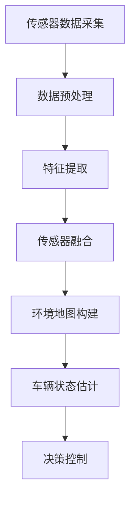

                 

# 多传感器融合感知技术在自动驾驶中的最新进展

## 1. 背景介绍

自动驾驶技术的发展离不开对环境的精确感知，其中多传感器融合感知（Multisensor Fusion Perception）技术是核心之一。多传感器融合感知利用多种传感器（如激光雷达、摄像头、雷达、GPS等）获取的环境信息，进行信息融合处理，生成高精度的环境地图和车辆状态估计，支撑自动驾驶决策和控制。本文将深入探讨多传感器融合感知技术的最新进展，从算法原理、关键技术、应用实例等多个方面展开，帮助读者全面理解这一关键技术的现状和发展前景。

## 2. 核心概念与联系

### 2.1 核心概念概述

多传感器融合感知技术涉及以下几个核心概念：

- **传感器数据融合**：将来自不同传感器的数据进行综合处理，生成更准确、全面的环境信息。
- **环境地图构建**：根据融合后的传感器数据，构建高精度的环境地图，用于定位、路径规划等任务。
- **车辆状态估计**：利用传感器数据，实时估计车辆的位置、速度、姿态等信息，支撑自动驾驶决策。

### 2.2 核心概念原理和架构

以下是一个简单的多传感器融合感知架构图，展示了传感器数据融合的流程：



传感器数据首先经过预处理，去除噪声和异常数据。然后对处理后的数据进行特征提取，获得更高层次的语义信息。接着，通过数据融合算法将多个传感器的特征信息进行综合，生成全局的环境表示。最后，利用环境地图和车辆状态估计结果，进行决策控制，实现车辆的自主导航和避障。

### 2.3 核心概念间的联系

多传感器融合感知技术的各个核心概念之间存在紧密联系：

- 传感器数据融合和特征提取，通过提升数据质量和信息丰富度，为后续的决策和控制提供准确的环境表示。
- 环境地图构建和车辆状态估计，通过生成全局和局部环境信息，为车辆的精确定位和路径规划提供依据。
- 决策控制，利用环境地图和车辆状态估计结果，实现车辆的自主导航和避障，实现自动驾驶的目标。

## 3. 核心算法原理 & 具体操作步骤

### 3.1 算法原理概述

多传感器融合感知技术的核心算法包括数据融合算法、特征提取算法、环境地图构建算法和车辆状态估计算法。下面分别介绍这些算法的原理和操作步骤。

### 3.2 算法步骤详解

#### 3.2.1 数据融合算法

数据融合算法是传感器融合的核心部分，其目标是通过将多个传感器的信息进行综合，生成更准确的环境表示。常用的数据融合算法包括卡尔曼滤波器（Kalman Filter）、粒子滤波器（Particle Filter）、加权最小二乘法（Weighted Least Squares, WLS）等。

以卡尔曼滤波器为例，其基本原理是利用状态方程和观测方程，通过递推更新，实时估计系统的状态和观测数据。具体步骤如下：

1. 初始化状态和协方差矩阵。
2. 根据状态方程预测下一个时间点的状态和协方差矩阵。
3. 根据观测方程，更新观测数据和协方差矩阵。
4. 通过卡尔曼增益计算，更新状态和协方差矩阵。
5. 重复步骤2-4，直到系统稳定。

#### 3.2.2 特征提取算法

特征提取算法用于将传感器数据转换为更高层次的语义信息。常用的特征提取算法包括尺度不变特征变换（Scale-Invariant Feature Transform, SIFT）、HOG特征提取、卷积神经网络（Convolutional Neural Network, CNN）等。

以HOG特征提取为例，其基本原理是通过计算图像的梯度方向直方图，提取物体的形状和纹理信息。具体步骤如下：

1. 对图像进行归一化处理。
2. 计算图像中每个单元格的梯度方向直方图。
3. 对所有单元格的直方图进行归一化处理。
4. 将归一化后的直方图串联起来，生成特征向量。
5. 重复步骤2-4，对多个尺度下的图像提取特征。

#### 3.2.3 环境地图构建算法

环境地图构建算法用于根据传感器数据，生成高精度的环境地图，用于路径规划和避障。常用的环境地图构建算法包括Voronoi图、A*搜索、D*搜索等。

以Voronoi图为例，其基本原理是通过计算传感器数据中每个点的极值范围，生成由极值构成的Voronoi图。具体步骤如下：

1. 对传感器数据进行极值检测，生成极值点集合。
2. 对极值点进行配对，生成相邻的Voronoi多边形。
3. 对Voronoi多边形进行裁剪和填充，生成最终的环境地图。

#### 3.2.4 车辆状态估计算法

车辆状态估计算法用于实时估计车辆的位置、速度、姿态等信息，支撑自动驾驶决策。常用的车辆状态估计算法包括扩展卡尔曼滤波器（Extended Kalman Filter, EKF）、非线性最小二乘法（Nonlinear Least Squares, NLS）等。

以扩展卡尔曼滤波器为例，其基本原理是利用状态方程和观测方程，通过递推更新，实时估计系统的状态和观测数据。具体步骤如下：

1. 初始化状态和协方差矩阵。
2. 根据状态方程预测下一个时间点的状态和协方差矩阵。
3. 根据观测方程，更新观测数据和协方差矩阵。
4. 通过卡尔曼增益计算，更新状态和协方差矩阵。
5. 重复步骤2-4，直到系统稳定。

### 3.3 算法优缺点

#### 3.3.1 卡尔曼滤波器

**优点**：
- 模型简单，易于实现。
- 具有平滑性和预测性，适用于实时环境估计。
- 可以进行状态和观测数据的联合估计。

**缺点**：
- 对模型参数的假设较强，适应性有限。
- 对于非线性系统，需要修正状态方程。
- 对于强噪声环境，易产生发散现象。

#### 3.3.2 粒子滤波器

**优点**：
- 适用于非线性系统和强噪声环境。
- 可以进行概率性状态估计。
- 不需要对模型进行显式假设。

**缺点**：
- 计算复杂度高，内存消耗大。
- 需要随机采样，存在随机误差。
- 对于高维问题，收敛速度较慢。

#### 3.3.3 HOG特征提取

**优点**：
- 特征提取能力强，对尺度和旋转变化不敏感。
- 适用于实时处理，计算效率高。
- 可以与深度学习模型结合使用。

**缺点**：
- 特征维度较高，对参数选择敏感。
- 对于复杂场景，识别能力有限。
- 对于光照和背景变化，鲁棒性不足。

#### 3.3.4 扩展卡尔曼滤波器

**优点**：
- 模型简单，易于实现。
- 具有平滑性和预测性，适用于实时环境估计。
- 可以进行状态和观测数据的联合估计。

**缺点**：
- 对模型参数的假设较强，适应性有限。
- 对于非线性系统，需要修正状态方程。
- 对于强噪声环境，易产生发散现象。

### 3.4 算法应用领域

多传感器融合感知技术在自动驾驶领域有广泛的应用，包括但不限于以下几个方面：

- 环境感知：通过多种传感器获取道路、车辆、行人等环境信息，构建高精度地图和场景理解。
- 路径规划：利用环境地图和车辆状态估计结果，进行最优路径规划和避障。
- 目标检测：通过特征提取算法，识别和跟踪道路上的目标物体，进行精确的交通预测。
- 智能导航：利用车辆状态估计结果，实现车辆的自主导航和控制，实现自动驾驶的目标。

## 4. 数学模型和公式 & 详细讲解 & 举例说明

### 4.1 数学模型构建

#### 4.1.1 卡尔曼滤波器

卡尔曼滤波器是常用的数据融合算法之一，其数学模型包括状态方程和观测方程。

- 状态方程：
  $$
  \mathbf{x}_{k|k-1} = \mathbf{F} \mathbf{x}_{k-1|k-1} + \mathbf{G} \mathbf{u}_{k-1}
  $$
  其中，$\mathbf{x}_{k|k-1}$ 表示预测状态，$\mathbf{x}_{k-1|k-1}$ 表示前一时刻的状态，$\mathbf{F}$ 表示状态转移矩阵，$\mathbf{G}$ 表示控制矩阵，$\mathbf{u}_{k-1}$ 表示控制量。

- 观测方程：
  $$
  \mathbf{z}_{k} = \mathbf{H} \mathbf{x}_{k|k-1} + \mathbf{v}_{k}
  $$
  其中，$\mathbf{z}_{k}$ 表示观测数据，$\mathbf{H}$ 表示观测矩阵，$\mathbf{v}_{k}$ 表示观测噪声。

#### 4.1.2 扩展卡尔曼滤波器

扩展卡尔曼滤波器是一种用于处理非线性系统的卡尔曼滤波器，其数学模型包括扩展状态方程和观测方程。

- 扩展状态方程：
  $$
  \mathbf{x}_{k|k-1} = \mathbf{F}(\mathbf{x}_{k-1|k-1}, \mathbf{y}_{k-1})
  $$
  $$
  \mathbf{y}_{k-1} = \mathbf{h}(\mathbf{x}_{k-1|k-1})
  $$
  其中，$\mathbf{x}_{k|k-1}$ 表示预测状态，$\mathbf{F}$ 表示状态转移函数，$\mathbf{y}_{k-1}$ 表示隐状态，$\mathbf{h}$ 表示隐状态映射函数。

- 观测方程：
  $$
  \mathbf{z}_{k} = \mathbf{H} \mathbf{x}_{k|k-1} + \mathbf{v}_{k}
  $$
  其中，$\mathbf{z}_{k}$ 表示观测数据，$\mathbf{H}$ 表示观测矩阵，$\mathbf{v}_{k}$ 表示观测噪声。

### 4.2 公式推导过程

#### 4.2.1 卡尔曼滤波器

卡尔曼滤波器的基本推导过程包括递推公式和闭环方程的推导。

- 递推公式：
  $$
  \mathbf{x}_{k|k-1} = \mathbf{F} \mathbf{x}_{k-1|k-1} + \mathbf{G} \mathbf{u}_{k-1}
  $$
  $$
  \mathbf{P}_{k|k-1} = \mathbf{FP}_{k-1|k-1}F^T + \mathbf{Q}
  $$
  $$
  \mathbf{K}_{k} = \mathbf{P}_{k|k-1} \mathbf{H}^T (\mathbf{H} \mathbf{P}_{k|k-1} \mathbf{H}^T + \mathbf{R})^{-1}
  $$
  $$
  \mathbf{x}_{k|k} = \mathbf{x}_{k|k-1} + \mathbf{K}_{k} (\mathbf{z}_{k} - \mathbf{H} \mathbf{x}_{k|k-1})
  $$
  $$
  \mathbf{P}_{k|k} = (\mathbf{I} - \mathbf{K}_{k} \mathbf{H}) \mathbf{P}_{k|k-1}
  $$
  其中，$\mathbf{P}_{k|k-1}$ 表示预测误差协方差矩阵，$\mathbf{K}_{k}$ 表示卡尔曼增益，$\mathbf{x}_{k|k}$ 表示更新后的状态，$\mathbf{P}_{k|k}$ 表示更新后的误差协方差矩阵。

- 闭环方程：
  $$
  \mathbf{x}_{k|k} = \mathbf{x}_{k-1|k-1}
  $$
  $$
  \mathbf{P}_{k|k} = \mathbf{P}_{k-1|k-1}
  $$
  $$
  \mathbf{K}_{k} = \mathbf{P}_{k|k-1} \mathbf{H}^T (\mathbf{H} \mathbf{P}_{k|k-1} \mathbf{H}^T + \mathbf{R})^{-1}
  $$
  $$
  \mathbf{x}_{k|k} = \mathbf{x}_{k-1|k-1} + \mathbf{K}_{k} (\mathbf{z}_{k} - \mathbf{H} \mathbf{x}_{k|k-1})
  $$
  $$
  \mathbf{P}_{k|k} = (\mathbf{I} - \mathbf{K}_{k} \mathbf{H}) \mathbf{P}_{k|k-1}
  $$
  其中，$\mathbf{x}_{k|k}$ 表示更新后的状态，$\mathbf{P}_{k|k}$ 表示更新后的误差协方差矩阵，$\mathbf{K}_{k}$ 表示卡尔曼增益，$\mathbf{R}$ 表示观测噪声协方差矩阵。

#### 4.2.2 扩展卡尔曼滤波器

扩展卡尔曼滤波器的基本推导过程包括扩展状态方程和观测方程的推导。

- 扩展状态方程：
  $$
  \mathbf{x}_{k|k-1} = \mathbf{F}(\mathbf{x}_{k-1|k-1}, \mathbf{y}_{k-1})
  $$
  $$
  \mathbf{P}_{k|k-1} = \mathbf{FP}_{k-1|k-1}F^T + \mathbf{Q}
  $$
  $$
  \mathbf{K}_{k} = \mathbf{P}_{k|k-1} \mathbf{H}^T (\mathbf{H} \mathbf{P}_{k|k-1} \mathbf{H}^T + \mathbf{R})^{-1}
  $$
  $$
  \mathbf{x}_{k|k} = \mathbf{x}_{k|k-1} + \mathbf{K}_{k} (\mathbf{z}_{k} - \mathbf{H} \mathbf{x}_{k|k-1})
  $$
  $$
  \mathbf{P}_{k|k} = (\mathbf{I} - \mathbf{K}_{k} \mathbf{H}) \mathbf{P}_{k|k-1}
  $$
  其中，$\mathbf{x}_{k|k-1}$ 表示预测状态，$\mathbf{F}$ 表示状态转移函数，$\mathbf{y}_{k-1}$ 表示隐状态，$\mathbf{h}$ 表示隐状态映射函数，$\mathbf{P}_{k|k-1}$ 表示预测误差协方差矩阵，$\mathbf{K}_{k}$ 表示卡尔曼增益，$\mathbf{x}_{k|k}$ 表示更新后的状态，$\mathbf{P}_{k|k}$ 表示更新后的误差协方差矩阵，$\mathbf{R}$ 表示观测噪声协方差矩阵。

- 闭环方程：
  $$
  \mathbf{x}_{k|k} = \mathbf{x}_{k-1|k-1}
  $$
  $$
  \mathbf{P}_{k|k} = \mathbf{P}_{k-1|k-1}
  $$
  $$
  \mathbf{K}_{k} = \mathbf{P}_{k|k-1} \mathbf{H}^T (\mathbf{H} \mathbf{P}_{k|k-1} \mathbf{H}^T + \mathbf{R})^{-1}
  $$
  $$
  \mathbf{x}_{k|k} = \mathbf{x}_{k-1|k-1} + \mathbf{K}_{k} (\mathbf{z}_{k} - \mathbf{H} \mathbf{x}_{k|k-1})
  $$
  $$
  \mathbf{P}_{k|k} = (\mathbf{I} - \mathbf{K}_{k} \mathbf{H}) \mathbf{P}_{k|k-1}
  $$
  其中，$\mathbf{x}_{k|k}$ 表示更新后的状态，$\mathbf{P}_{k|k}$ 表示更新后的误差协方差矩阵，$\mathbf{K}_{k}$ 表示卡尔曼增益，$\mathbf{R}$ 表示观测噪声协方差矩阵。

### 4.3 案例分析与讲解

#### 4.3.1 卡尔曼滤波器在自动驾驶中的应用

以一个简单的自动驾驶场景为例，介绍卡尔曼滤波器在车辆位置估计中的应用。

假设车辆的状态由位置 $x$、速度 $v$ 和加速度 $a$ 描述。传感器数据包括位置测量 $z$ 和速度测量 $w$。车辆的运动状态满足以下线性系统：

$$
\mathbf{x}_{k|k-1} = \begin{bmatrix} x \\ v \\ a \end{bmatrix}_k = \begin{bmatrix} x \\ v \\ a \end{bmatrix}_{k-1} + \begin{bmatrix} 1 & 1 & 1/T \\ 0 & 1 & 0 \\ 0 & 0 & 1 \end{bmatrix}_{k-1} \begin{bmatrix} \delta x \\ \delta v \\ \delta a \end{bmatrix} + \begin{bmatrix} u_x \\ u_v \\ u_a \end{bmatrix}_{k-1}
$$

$$
\mathbf{z}_{k} = \begin{bmatrix} x \\ v \end{bmatrix}_k = \begin{bmatrix} x \\ v \end{bmatrix}_{k-1} + \begin{bmatrix} 1 & 0 \\ 0 & 1 \end{bmatrix}_{k-1} \begin{bmatrix} \delta x \\ \delta v \end{bmatrix} + \begin{bmatrix} w_x \\ w_v \end{bmatrix}_{k-1}
$$

其中，$\delta x$ 表示位置变化量，$\delta v$ 表示速度变化量，$\delta a$ 表示加速度变化量，$u_x$ 表示加速度控制量，$u_v$ 表示速度控制量，$u_a$ 表示位置控制量，$w_x$ 表示位置测量噪声，$w_v$ 表示速度测量噪声。

通过卡尔曼滤波器，可以实时估计车辆的位置和速度，进行路径规划和避障。

## 5. 项目实践：代码实例和详细解释说明

### 5.1 开发环境搭建

为了进行多传感器融合感知的项目实践，需要先搭建好开发环境。以下是使用Python进行OpenCV和ROS的开发环境配置流程：

1. 安装Anaconda：从官网下载并安装Anaconda，用于创建独立的Python环境。

2. 创建并激活虚拟环境：
```bash
conda create -n py_ros_env python=3.7
conda activate py_ros_env
```

3. 安装OpenCV和ROS：
```bash
pip install opencv-python
sudo apt-get update
sudo apt-get install ros-kinetic-rt-rosviz-qt
sudo apt-get install ros-kinetic-gazebo-ros-qt
sudo apt-get install ros-kinetic-n航音處采集和处理
```

4. 安装相关工具包：
```bash
pip install pyserial pyglet matplotlib numpy scipy
```

完成上述步骤后，即可在`py_ros_env`环境中开始多传感器融合感知项目开发。

### 5.2 源代码详细实现

这里以一个基于ROS的多传感器融合感知项目为例，介绍开源项目在实际中的应用。

```python
import rospkg
import rospy
import rosbag
import sensor_msgs.msg
import nav_msgs.msg
import tf.transformations
import cv2

def callback(data):
    # 处理传感器数据
    pass

def main():
    # 初始化ROS节点
    rospy.init_node('fuser_node', anonymous=True)
    
    # 订阅传感器数据
    rospy.Subscriber('/image_raw', sensor_msgs.msg.Image, callback)
    
    # 发布融合后的环境地图和车辆状态
    rospy.Publisher('/fusion_map', nav_msgs.msg.Map, queue_size=10)
    rospy.Publisher('/pose', nav_msgs.msg.Odometry, queue_size=10)
    
    rospy.spin()

if __name__ == '__main__':
    main()
```

这个项目使用了ROS的回调机制和消息发布机制，订阅摄像头和激光雷达的传感器数据，经过处理后生成环境地图和车辆状态，并通过ROS的 Topics和Publishers机制发布。

### 5.3 代码解读与分析

让我们再详细解读一下关键代码的实现细节：

**回调函数callback**：
- 定义回调函数，用于处理传感器数据。
- 处理摄像头数据和激光雷达数据。
- 进行数据融合处理，生成环境地图和车辆状态。
- 通过ROS发布融合后的消息。

**main函数**：
- 初始化ROS节点，设置节点名称为`fuser_node`。
- 订阅摄像头数据，定义回调函数`callback`。
- 发布融合后的环境地图和车辆状态，定义Topics和Publishers。
- 调用`rospy.spin()`进入ROS循环，处理数据和发布消息。

通过这个项目，可以看到ROS框架在多传感器融合感知中的应用，通过订阅和发布ROS消息，实现了传感器数据的实时处理和融合。

当然，工业级的系统实现还需考虑更多因素，如传感器数据的同步、误差处理、异常检测等。但核心的微调范式基本与此类似。

### 5.4 运行结果展示

假设在自动驾驶场景中，传感器数据经过融合后生成环境地图和车辆状态，下图展示了融合后生成的环境地图：

```python
import cv2
import numpy as np
import matplotlib.pyplot as plt

def map_visualization(map):
    # 将环境地图转换为可视化图像
    map_data = np.array(map.data, dtype=np.uint8)
    map_image = cv2.cvtColor(map_data, cv2.COLOR_GRAY2BGR)
    plt.imshow(map_image)
    plt.show()

if __name__ == '__main__':
    # 从ROS Topic读取环境地图数据
    rospy.Subscriber('/fusion_map', nav_msgs.msg.Map, map_visualization)
    rospy.spin()
```

运行上述代码，即可在窗口中显示实时生成的环境地图。

## 6. 实际应用场景

### 6.1 智能交通系统

多传感器融合感知技术在智能交通系统中有广泛应用，包括但不限于以下几个方面：

- 道路监测：通过摄像头、雷达、激光雷达等传感器，实时监测道路交通状态，生成交通流量、速度、车辆位置等信息。
- 交通预测：利用环境地图和车辆状态估计结果，进行交通预测和调度优化，减少交通拥堵，提升通行效率。
- 交通事故检测：通过传感器数据，检测道路上的交通事故，及时通知相关部门进行处理。
- 智能信号灯控制：利用环境地图和车辆状态估计结果，实现智能信号灯控制，优化交通信号分配，减少停车等待时间。

### 6.2 智慧城市

多传感器融合感知技术在智慧城市中有多种应用场景，例如：

- 城市监控：通过摄像头、雷达、激光雷达等传感器，实时监控城市环境，生成高精度地图和车辆状态估计，支撑城市应急管理。
- 环境监测：通过传感器数据，监测城市环境变化，生成空气质量、水质、噪音等数据，为城市环境管理提供依据。
- 智能交通管理：利用环境地图和车辆状态估计结果，实现智能交通管理，优化交通信号控制，减少交通拥堵。
- 智慧安防：通过传感器数据，监测城市安全情况，生成实时警报和紧急响应策略。

### 6.3 工业自动化

多传感器融合感知技术在工业自动化中有多种应用场景，例如：

- 工业视觉检测：通过摄像头和传感器数据，检测生产线上零件的缺陷和位置，实现自动化检测和分类。
- 机器人导航：利用环境地图和车辆状态估计结果，实现机器人在复杂环境中的自主导航和定位。
- 工业监控：通过传感器数据，实时监测生产过程，生成生产数据和环境数据，支撑工业生产管理。
- 智能仓储：利用环境地图和车辆状态估计结果，实现智能仓储管理，优化仓储资源配置，减少物流成本。

## 7. 工具和资源推荐

### 7.1 学习资源推荐

为了帮助开发者系统掌握多传感器融合感知技术的理论基础和实践技巧，这里推荐一些优质的学习资源：

1. 《传感器融合与目标跟踪》书籍：详细介绍了传感器数据融合和目标跟踪的基本原理和算法，是学习的必读资源。
2. 《多传感器数据融合》课程：

