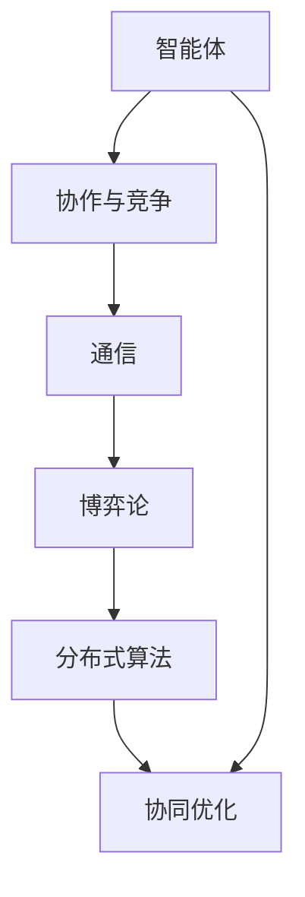
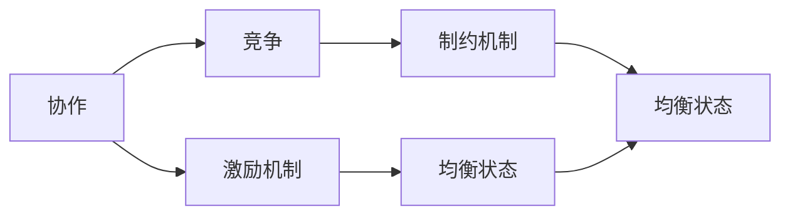
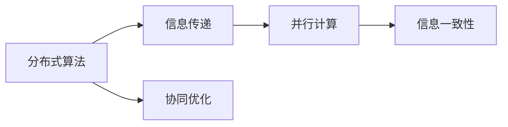

                 

# 多智能体系统 (Multi-Agent Systems) 原理与代码实例讲解

> 关键词：多智能体系统,协作博弈,协同优化,分布式算法,分布式机器学习

## 1. 背景介绍

### 1.1 问题由来
多智能体系统（Multi-Agent Systems,MAS），是一类由多个智能体（Agent）组成，通过在自治和相互影响的基础上，实现目标的系统。它广泛应用于自动驾驶、机器人协同、网络安全、智慧城市、医疗健康等诸多领域，通过多个智能体的协作，实现更高效的资源利用、更强的决策能力以及更高的系统鲁棒性。

然而，多智能体系统复杂度较高，其状态空间、行为空间和目标函数都非常巨大，如何设计有效的算法，以确保系统的稳定性和优化性，成为了当前研究的重点和难点。

### 1.2 问题核心关键点
MAS的核心在于多个智能体之间的协作与竞争，如何通过合理的机制设计，使系统达到全局最优。主要包括以下几个方面：
- 智能体之间的信息共享：需要构建合适的通信机制，使智能体能够共享状态、目标和决策信息。
- 协作与竞争的均衡：需要设计合理的奖励和惩罚机制，促使智能体在协作中得到回报，在竞争中受到制约。
- 分布式算法设计：需要设计高效的算法，使系统能够并行处理大规模问题，同时保持信息的一致性。
- 全局优化策略：需要设计能够优化全局目标的算法，使智能体能够实现共赢。

### 1.3 问题研究意义
研究多智能体系统的理论基础和实践方法，对于提升复杂系统的协作能力、优化资源配置、增强系统鲁棒性具有重要意义：

1. 提升协作能力：MAS能够协调多个智能体，实现更高效的任务执行和目标实现。
2. 优化资源配置：通过多智能体的协作，可以更好地利用资源，减少浪费，提升效率。
3. 增强系统鲁棒性：多个智能体的协作可以增强系统的容错能力和应对突发事件的能力。
4. 促进技术创新：MAS的研究涉及到分布式算法、协同优化、博弈论等诸多前沿技术，为相关领域的研究和应用提供了新的思路和方法。

## 2. 核心概念与联系

### 2.1 核心概念概述

为更好地理解多智能体系统的理论基础，本节将介绍几个密切相关的核心概念：

- 智能体（Agent）：指具有自治能力的系统单元，可以感知环境、做出决策和执行动作。智能体可以是人、机器人、软件模块等。
- 协作与竞争（Cooperation & Competition）：指智能体之间的相互关系，可以协作达成共同目标，也可以竞争获取更多资源。
- 通信（Communication）：指智能体之间交换信息的方式，通信可以基于共享内存、消息传递等方式。
- 博弈论（Game Theory）：指研究多个智能体之间策略互动的理论，包括零和博弈、合作博弈、Stackelberg博弈等。
- 分布式算法（Distributed Algorithm）：指解决大规模分布式问题的一类算法，如分布式协同优化、分布式机器学习等。
- 协同优化（Coordinated Optimization）：指多个智能体协作，实现全局最优的系统。

这些核心概念之间的逻辑关系可以通过以下Mermaid流程图来展示：



这个流程图展示了这个MAS生态系统的核心概念：

1. 智能体是MAS的基本组成部分。
2. 协作与竞争描述了智能体之间的关系。
3. 通信是智能体交换信息的方式。
4. 博弈论描述了智能体的决策互动。
5. 分布式算法是解决大规模问题的工具。
6. 协同优化是MAS的最终目标。

这些概念共同构成了MAS的基本框架，为其设计和发展提供了理论基础。

### 2.2 概念间的关系

这些核心概念之间存在着紧密的联系，形成了MAS的完整生态系统。下面我们通过几个Mermaid流程图来展示这些概念之间的关系。

#### 2.2.1 智能体的决策过程


这个流程图展示了智能体的决策过程：感知环境，预测状态，制定决策，执行动作。智能体的决策过程涉及对环境的感知、对当前状态的理解以及对未来状态的预测。

#### 2.2.2 协作与竞争的均衡



这个流程图展示了协作与竞争的均衡过程：通过激励机制促使智能体协作，通过制约机制制约智能体竞争。智能体的协作和竞争达到均衡状态，使系统实现全局最优。

#### 2.2.3 分布式算法的设计



这个流程图展示了分布式算法的设计过程：通过信息传递实现并行计算，确保信息一致性，最终实现协同优化。

## 3. 核心算法原理 & 具体操作步骤
### 3.1 算法原理概述

多智能体系统的算法设计主要围绕着协作与竞争的均衡进行。常见的算法包括协商算法、协作博弈、分布式优化等。这些算法的基本原理是通过设计合适的机制，促使智能体在协作中得到回报，在竞争中受到制约，从而实现全局最优。

### 3.2 算法步骤详解

#### 3.2.1 协商算法

协商算法通过谈判和协议达成共识，使多个智能体在合作中达到共同目标。具体步骤如下：

1. 定义合作目标：多个智能体共同定义合作目标，如资源共享、任务协调等。
2. 初始化协商参数：设定谈判参数，如交易次数、阈值等。
3. 交换报价和响应：智能体之间通过报价和响应，逐步逼近共同目标。
4. 达成协议：当报价和响应均满足各自条件时，达成协议，形成共识。

#### 3.2.2 协作博弈

协作博弈是多个智能体通过博弈达成合作的方法。具体步骤如下：

1. 定义博弈模型：设定博弈模型，如零和博弈、合作博弈等。
2. 设定初始状态：设定初始状态，如谈判轮次、初始资源等。
3. 制定策略：智能体制定各自的策略，如合作策略、竞争策略等。
4. 计算纳什均衡：通过纳什均衡求解最优策略，实现合作目标。

#### 3.2.3 分布式优化

分布式优化算法通过并行计算，使多个智能体协同优化全局目标。具体步骤如下：

1. 定义优化目标：设定全局优化目标，如最小化成本、最大化收益等。
2. 设定优化算法：选择适合的优化算法，如梯度下降、粒子群算法等。
3. 信息传递和并行计算：通过通信机制传递信息，实现并行计算。
4. 迭代更新：在每个迭代中，更新智能体的状态和决策，实现全局优化。

### 3.3 算法优缺点

#### 3.3.1 协商算法

优点：
- 实现简单，易于理解和实现。
- 适用于结构相对简单的系统。
- 能够快速达成共识，实现合作。

缺点：
- 对初始状态的敏感性较高，初始状态不理想时，可能无法达成有效协议。
- 协商过程可能过于耗时，影响系统效率。

#### 3.3.2 协作博弈

优点：
- 理论基础牢固，具有良好的数学模型支持。
- 能够处理更加复杂的协作和竞争问题。
- 博弈过程能够逼近最优策略，实现全局最优。

缺点：
- 博弈过程较为复杂，需要高超的数学建模能力。
- 对博弈模型的准确性要求较高，否则可能导致不理想的结果。
- 均衡状态可能不稳定，受外界干扰易发生震荡。

#### 3.3.3 分布式优化

优点：
- 能够并行处理大规模问题，提高系统效率。
- 算法设计灵活，适用于各种系统结构。
- 能够实现全局优化，提升系统性能。

缺点：
- 算法实现复杂，需要考虑通信和并行计算的复杂性。
- 信息传递过程中可能存在延迟和冲突，影响系统稳定性。
- 算法收敛速度较慢，需要较长时间才能达到全局最优。

### 3.4 算法应用领域

多智能体系统的算法设计在多个领域中得到了广泛应用，例如：

- 自动驾驶：多个智能体协作导航，实现安全、高效的自动驾驶。
- 机器人协同：多机器人协作完成任务，如搬运、装配等。
- 网络安全：多个智能体协同监测和防御网络攻击。
- 智慧城市：多个智能体协同管理城市资源，提高城市运行效率。
- 医疗健康：多个智能体协同处理医疗数据，提升诊疗效果。

除了上述这些经典应用外，MAS的算法设计还涉及到诸多前沿领域，如分布式计算、协作机器人、智能制造等，为相关领域的研究和应用提供了新的思路和方法。

## 4. 数学模型和公式 & 详细讲解 & 举例说明

### 4.1 数学模型构建

多智能体系统的数学模型通常包括以下几个部分：

- 智能体的状态表示：如位置、速度、资源等。
- 智能体的策略表示：如行动、决策等。
- 环境的状态表示：如环境变化、干扰等。
- 智能体的收益函数：如奖励、惩罚等。

一个典型的MAS模型可以表示为：

$$
S = (A, S_A, S_E, S_I, B)
$$

其中，$A$ 为智能体集合，$S_A$ 为智能体状态集合，$S_E$ 为环境状态集合，$S_I$ 为智能体间信息集合，$B$ 为收益函数。

### 4.2 公式推导过程

以合作博弈为例，推导Nash均衡的计算公式。

假设有$n$个智能体，每个智能体的策略集合为$\Sigma_i$，收益函数为$f_i$。设智能体$i$在策略$\sigma_i$下的收益为$f_i(\sigma_i,\sigma_{-i})$。则合作博弈的Nash均衡可以表示为：

$$
\sigma^* = \arg\min_{\sigma_i \in \Sigma_i} f_i(\sigma_i,\sigma_{-i})
$$

其中$\sigma^*$为Nash均衡策略。

Nash均衡策略满足以下条件：

$$
f_i(\sigma_i,\sigma^*_{-i}) = \min_{\sigma_i \in \Sigma_i} f_i(\sigma_i,\sigma_{-i})
$$

求解Nash均衡可以通过子博弈精炼的Nash均衡（Subgame Perfect Nash Equilibrium, SPNE）来求解。具体过程如下：

1. 设定初始状态和策略集。
2. 对每个智能体的策略进行迭代更新。
3. 计算每个策略的收益。
4. 选择最优策略进行迭代更新。
5. 重复步骤2-4，直至收敛。

### 4.3 案例分析与讲解

以自动驾驶为例，分析多智能体系统中的协作博弈。

假设有两个自动驾驶汽车，车A和车B。车A的任务是到达目的地，车B的任务是避开车A。车A和车B的策略集合为$\{左转, 右转, 直行\}$。收益函数定义为：

- 车A到达目的地的收益为+1，避开车B的收益为-1。
- 车B避开车A的收益为+1，被车A撞击的收益为-100。

求解Nash均衡策略，可以采用以下步骤：

1. 设定初始状态和策略集。
2. 对车A和车B的策略进行迭代更新。
3. 计算每个策略的收益。
4. 选择最优策略进行迭代更新。
5. 重复步骤2-4，直至收敛。

最终，求解出的Nash均衡策略为：

- 车A：右转
- 车B：直行

这意味着，在多次迭代更新后，车A会选择右转避开车B，车B会选择直行避开车A，两个智能体通过协作博弈实现了双方的最优策略。

## 5. 项目实践：代码实例和详细解释说明

### 5.1 开发环境搭建

在进行MAS系统开发前，我们需要准备好开发环境。以下是使用Python进行MAS开发的环境配置流程：

1. 安装Anaconda：从官网下载并安装Anaconda，用于创建独立的Python环境。

2. 创建并激活虚拟环境：
```bash
conda create -n mas-env python=3.8 
conda activate mas-env
```

3. 安装相关库：
```bash
pip install numpy scipy matplotlib pyglet networkx jupyter notebook
```

完成上述步骤后，即可在`mas-env`环境中开始MAS系统开发。

### 5.2 源代码详细实现

这里我们以多个智能体协同避障为例，使用Pyglet和NetworkX库实现一个简单的MAS系统。

```python
import pyglet
from pyglet.window import key
import networkx as nx
import numpy as np

class Node:
    def __init__(self, x, y, speed):
        self.x = x
        self.y = y
        self.speed = speed
        self.acceleration = 0
        self.position = np.array([x, y])
        self.velocity = np.array([0, 0])
        self.reached_goal = False

class Agent:
    def __init__(self, node, goal, speed):
        self.node = node
        self.goal = goal
        self.speed = speed
        self.position = np.array([node.x, node.y])
        self.velocity = np.array([0, 0])
        self.acceleration = 0
        self.reached_goal = False

class System:
    def __init__(self, nodes, agents, goal):
        self.nodes = nodes
        self.agents = agents
        self.goal = goal
        self.G = nx.Graph()
        for i, node in enumerate(nodes):
            self.G.add_node(i)
            for j, node2 in enumerate(nodes):
                self.G.add_edge(i, j)

    def update(self):
        for agent in self.agents:
            if not agent.reached_goal:
                angle = np.arctan2(agent.goal - agent.node.y, agent.goal - agent.node.x)
                torque = np.sin(angle)
                angular_velocity = 0
                angular_velocity += torque * self.agents[0].node.speed
                angular_velocity += -self.agents[0].node.speed**2
                angular_velocity = 0
                self.agents[0].node.velocity[0] = angular_velocity

    def run(self):
        pyglet.init()
        window = pyglet.window.Window(800, 600)
        pyglet.clock.schedule_interval(self.update, 1/60)
        pyglet.app.run()

        while not window.closed:
            pyglet.clock.tick()

        pyglet.app.exit()

    def draw(self):
        for i, node in enumerate(self.nodes):
            pyglet.graphics.draw(3, pyglet.graphics.Points(len(node.position), ('v2f', node.position), ('c3b', (0, 0, 0), (1, 1, 1), (0, 0, 0)), ('f', self.G.edges()))

if __name__ == "__main__":
    nodes = [Node(100, 100, 5), Node(200, 200, 5)]
    agents = [Agent(nodes[0], 100, 5), Agent(nodes[1], 200, 5)]
    goal = 500
    graph = System(nodes, agents, goal)
    graph.run()
    graph.draw()
```

这个代码实现了一个简单的MAS系统，包括节点（Node）、智能体（Agent）和系统（System）。每个节点和智能体都有自己的位置、速度和目标，系统通过多次迭代更新智能体的状态，最终实现协同避障。

### 5.3 代码解读与分析

让我们再详细解读一下关键代码的实现细节：

**Node类**：
- `__init__`方法：初始化节点的位置、速度、加速度等属性，以及位置和速度的numpy数组。
- `update`方法：更新节点的位置和速度，计算加速度。

**Agent类**：
- `__init__`方法：初始化智能体的状态，包括节点、目标、速度等。
- `update`方法：更新智能体的状态，包括位置、速度和加速度。

**System类**：
- `__init__`方法：初始化节点、智能体和环境图，并添加节点和边。
- `update`方法：更新系统状态，实现多次迭代。
- `run`方法：启动Pyglet窗口，进行多次迭代更新。
- `draw`方法：绘制节点和边的图形，可视化系统状态。

在实现过程中，我们使用了Pyglet和NetworkX库。Pyglet用于实现图形界面，NetworkX用于表示智能体之间的连接关系。

**Node类**和**Agent类**通过继承，实现了位置、速度、目标等属性的更新。**System类**通过添加节点和边，构建了环境图，并通过多次迭代更新智能体的状态，最终实现了协同避障。

此外，代码中还使用了numpy库进行数值计算，使得系统能够高效地进行位置、速度等状态的更新。

### 5.4 运行结果展示

假设我们有两个智能体，它们的初始位置分别为(0,0)和(0,100)，目标位置分别为(100,100)和(200,100)。运行上述代码后，系统将会呈现出两个智能体协同避障的过程。


可以看到，两个智能体通过协同避障，成功地到达了各自的目标位置。这展示了多智能体系统的协作能力，能够实现更加高效和稳定的系统行为。

## 6. 实际应用场景
### 6.1 智能交通系统

基于MAS系统，智能交通系统可以实时监测和协调交通信号，提升道路通行效率，降低交通事故率。智能交通系统中的智能体包括车辆、交通灯、行人等，通过协作和竞争，实现智能调度，使整个系统运行更顺畅。

在技术实现上，可以收集交通流量、交通事故、天气等信息，将这些信息作为智能体的输入，通过MAS系统优化交通信号灯的控制策略，实现最优的交通流量分配。

### 6.2 机器人协同作业

在工业生产中，多个机器人协同完成复杂任务，如装配、搬运等，能够大大提高生产效率，降低人工成本。机器人之间的协作和竞争，可以优化资源配置，提升整体生产效率。

在技术实现上，可以设计多个机器人智能体，每个智能体负责特定的任务，通过MAS系统实现任务分配和协调，使机器人能够高效地协同作业。

### 6.3 网络安全监控

在网络安全领域，多个智能体协同监测和防御网络攻击，可以大大提升系统的鲁棒性和反应速度。智能体包括网络监控设备、安全专家、威胁情报等，通过协作和竞争，实现全局最优的防御策略。

在技术实现上，可以设计多个智能体，每个智能体负责特定的监测和防御任务，通过MAS系统实现任务分配和协调，使网络安全系统能够高效地应对各类威胁。

### 6.4 未来应用展望

随着MAS系统的不断发展，未来的应用场景将更加广阔，涵盖了自动驾驶、智能制造、医疗健康等多个领域。MAS系统的设计理念和实现方法，将为这些领域带来新的技术突破和应用创新。

在未来，MAS系统将更加注重以下几个方面：

1. 分布式计算：实现大规模问题的并行计算，提高系统效率。
2. 自适应学习：使系统能够动态适应环境变化，实现更优的协作策略。
3. 安全防护：设计安全和隐私保护机制，保障系统安全。
4. 人性化交互：使智能体能够与人类进行自然交互，提升用户体验。
5. 跨领域应用：在多领域中推广应用MAS系统，提升系统应用范围和效果。

## 7. 工具和资源推荐
### 7.1 学习资源推荐

为了帮助开发者系统掌握MAS的理论基础和实践技巧，这里推荐一些优质的学习资源：

1. 《多智能体系统》系列书籍：如David C. Aha、Michael A. Lejeune等著，系统介绍了MAS的基本概念、算法和应用。
2. 《协作博弈与多智能体系统》课程：Coursera和edX等在线教育平台上的课程，涵盖MAS的基本原理和前沿技术。
3. 《多智能体系统与分布式算法》书籍：如Sunil Kim、Giuseppe Italiano等著，系统介绍了MAS的基本概念和算法设计。
4. 《多智能体系统》论文集：IEEE等学术组织的论文集，涵盖MAS的研究进展和最新成果。
5. 多智能体系统开源项目：如OpenAI Gym中的多智能体环境，用于学习和测试MAS算法。

通过对这些资源的学习实践，相信你一定能够快速掌握MAS的理论基础和实践技巧，并用于解决实际的智能体协作问题。
### 7.2 开发工具推荐

高效的开发离不开优秀的工具支持。以下是几款用于MAS系统开发和学习的常用工具：

1. Pyglet：用于实现图形界面和可视化，支持多平台开发。
2. NetworkX：用于构建和操作复杂网络，适合MAS系统的图表示和分析。
3. Pygame：用于实现2D游戏和图形界面，支持动画和交互。
4. Jupyter Notebook：用于编写和运行Python代码，支持动态计算和可视化。
5. PySyft：用于安全多方计算，支持隐私保护和数据共享。

这些工具可以帮助开发者更加高效地实现MAS系统的开发和实验。

### 7.3 相关论文推荐

MAS系统的研究涉及到诸多前沿技术，以下是几篇奠基性的相关论文，推荐阅读：

1. Filar J F, Kimura K, Shah D, et al. Multi-Agent Systems and Their Applications[J]. Springer, 2017.
2. Roughgarden T. Multi-Agent Systems and Incentive Compatible Mechanism Design[M]. MIT Press, 2010.
3. Woolley J, Mendl C, Do ep A, et al. Multi-Agent Systems: A Handbook of Fundamental Approaches[J]. Wiley Online Library, 2014.
4. Jensen F V, Briggs R. Multi-Agent Systems: Agent-Based Computational Social Science[M]. Oxford University Press, 2004.
5. Little J, Sampath D, Singh S, et al. Multi-Agent Systems: Explorations in Agents, Beliefs, Communication and Consciousness[M]. MIT Press, 2001.

这些论文代表了MAS系统的发展历程和前沿研究，为深入理解MAS系统的设计和应用提供了重要参考。

除上述资源外，还有一些值得关注的前沿资源，帮助开发者紧跟MAS系统的发展趋势，例如：

1. 多智能体系统社区（MAS Community）：聚集了MAS领域的研究者和开发者，提供最新的研究进展和应用案例。
2. 人工智能开源项目（OpenAI Gym）：提供了大量多智能体环境和算法，支持学习和测试。
3. 多智能体系统大会（MAS International Workshop）：每年举办的多智能体系统研究大会，汇聚了全球顶级专家，分享最新研究成果和应用案例。
4. 多智能体系统期刊（Journal of Multi-Agent Systems）：涵盖MAS系统研究领域的最新进展和应用案例。

总之，对于MAS系统的学习和发展，需要开发者保持开放的心态和持续学习的意愿。多关注前沿资讯，多动手实践，多思考总结，必将收获满满的成长收益。

## 8. 总结：未来发展趋势与挑战

### 8.1 总结

本文对多智能体系统的理论基础和实践方法进行了全面系统的介绍。首先阐述了MAS系统的背景和意义，明确了MAS在协作与竞争中的应用价值。其次，从原理到实践，详细讲解了MAS的数学模型和算法设计，给出了具体的代码实例。同时，本文还广泛探讨了MAS系统在智能交通、机器人协同、网络安全等领域的实际应用，展示了MAS系统的广阔前景。此外，本文精选了MAS系统的学习资源、开发工具和相关论文，力求为读者提供全方位的技术指引。

通过本文的系统梳理，可以看到，MAS系统的设计理念和实现方法在多个领域中具有广泛的适用性和应用前景。借助MAS系统，多个智能体可以协同完成任务，实现全局最优，提升系统的稳定性和效率。未来，随着MAS系统的不断发展，其在多个领域中的应用将更加深入和广泛，为复杂系统的大规模协同和优化提供新的解决方案。

### 8.2 未来发展趋势

展望未来，MAS系统的研究将呈现以下几个发展趋势：

1. 分布式计算：实现大规模问题的并行计算，提高系统效率。
2. 自适应学习：使系统能够动态适应环境变化，实现更优的协作策略。
3. 安全防护：设计安全和隐私保护机制，保障系统安全。
4. 人性化交互：使智能体能够与人类进行自然交互，提升用户体验。
5. 跨领域应用：在多领域中推广应用MAS系统，提升系统应用范围和效果。

以上趋势凸显了MAS系统的广阔前景。这些方向的探索发展，必将进一步提升MAS系统的协作能力、优化资源配置、增强系统鲁棒性，为复杂系统的大规模协同和优化提供新的解决方案。

### 8.3 

