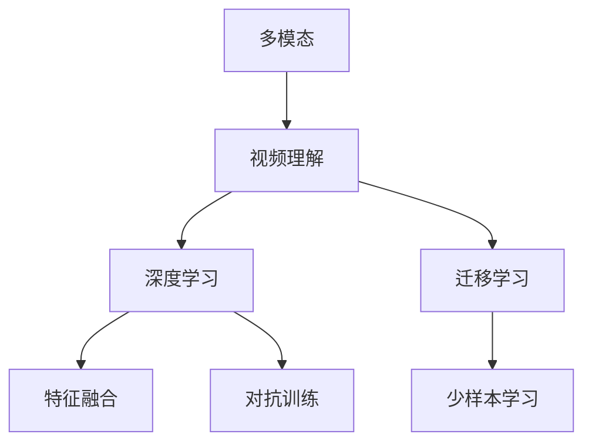
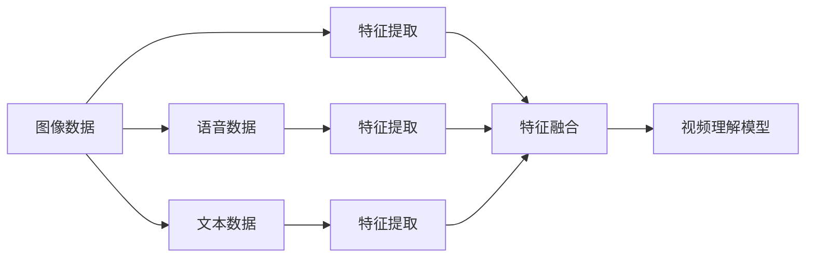
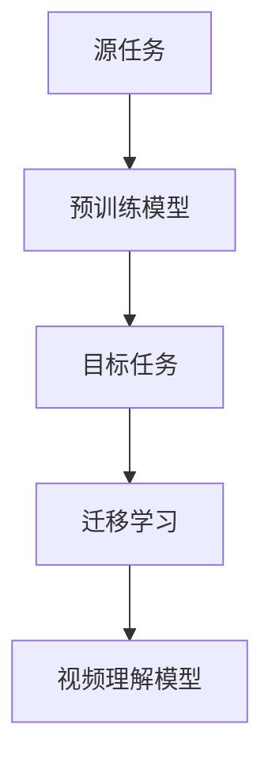
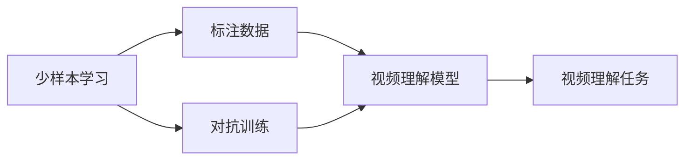
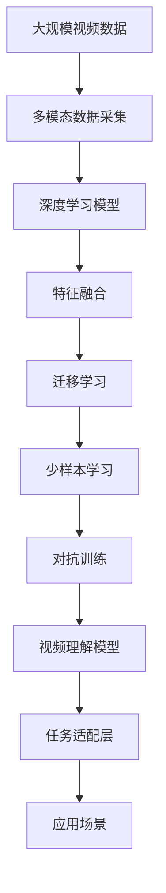

                 

## 1. 背景介绍

### 1.1 问题由来

随着人工智能技术的快速发展，多模态（Multi-modal）AI技术在视频理解（Video Understanding）领域的应用越来越广泛。视频理解是指通过智能算法从视频中提取结构化信息，如对象、动作、场景等，以实现视频的自动分类、摘要、检索等任务。传统的计算机视觉和语音处理技术虽然能够对单模态数据进行处理，但在多模态数据上存在局限性，无法充分利用视频数据的多样性和丰富性。

多模态AI技术通过结合图像、语音、文本等多种数据源，能够更好地理解视频内容，并提升视频理解系统的准确性和鲁棒性。例如，在动作识别任务中，结合语音和动作数据，可以更准确地识别视频中人物的表达动作。在情感分析任务中，结合视频和文本数据，可以更全面地理解视频中人物的情感变化。

### 1.2 问题核心关键点

多模态AI在视频理解中的应用涉及以下几个核心关键点：

1. 数据采集与处理：如何高效地从视频中提取多模态数据，并对其进行预处理和标注，以供后续的深度学习训练。
2. 模型构建与训练：如何设计高效的神经网络模型，结合多模态数据进行训练，学习多模态特征的表示和融合。
3. 特征融合与理解：如何通过模型融合多模态数据，生成统一的视频表示，提升视频理解的准确性和泛化能力。
4. 应用场景与优化：如何针对不同的视频理解任务，选择合适的模型和训练方法，提升视频理解系统的实际应用效果。

### 1.3 问题研究意义

多模态AI在视频理解中的应用具有重要意义：

1. 提高视频理解准确性：通过结合多模态数据，可以更全面地理解视频内容，减少单一模态数据带来的噪声干扰。
2. 提升视频处理效率：多模态AI可以并行处理不同模态的数据，加速视频理解和处理的速度。
3. 拓展视频应用范围：多模态AI可以应用于更广泛的视频处理任务，如视频分类、检索、推荐等。
4. 促进视频分析创新：多模态AI技术的发展，可以推动视频分析领域的创新，如动作识别、情感分析、行为预测等。

## 2. 核心概念与联系

### 2.1 核心概念概述

为更好地理解多模态AI在视频理解中的应用，本节将介绍几个密切相关的核心概念：

1. 多模态（Multi-modal）：指结合多种类型的数据源（如图像、语音、文本等）进行处理，以提升数据表示的丰富性和准确性。
2. 视频理解（Video Understanding）：指通过智能算法从视频中提取结构化信息，如对象、动作、场景等，以实现视频的自动分类、摘要、检索等任务。
3. 深度学习（Deep Learning）：通过多层神经网络，对大规模数据进行训练，学习复杂的多模态特征表示。
4. 特征融合（Feature Fusion）：将多种模态数据融合为一，生成统一的视频表示，提升视频理解的效果。
5. 迁移学习（Transfer Learning）：将在一个领域学习到的知识，迁移到另一个领域，提升新领域任务的性能。
6. 少样本学习（Few-shot Learning）：在只有少量标注样本的情况下，模型能够快速适应新任务。
7. 对抗训练（Adversarial Training）：通过引入对抗样本，提高模型的鲁棒性和泛化能力。

这些核心概念之间的逻辑关系可以通过以下Mermaid流程图来展示：



这个流程图展示了大规模语言模型微调过程中各个核心概念的关系和作用：

1. 多模态数据通过深度学习技术进行特征提取和表示。
2. 深度学习模型通过特征融合技术，将多模态数据融合为一，生成统一的视频表示。
3. 迁移学习技术可以将学习到的知识迁移到新任务上，提升模型的泛化能力。
4. 少样本学习技术可以在只有少量标注样本的情况下，快速适应新任务。
5. 对抗训练技术可以增强模型的鲁棒性和泛化能力。

### 2.2 概念间的关系

这些核心概念之间存在着紧密的联系，形成了多模态视频理解系统的完整生态系统。下面我们通过几个Mermaid流程图来展示这些概念之间的关系。

#### 2.2.1 多模态数据的特征提取



这个流程图展示了多模态数据在视频理解系统中的处理流程：

1. 图像、语音、文本数据分别进行特征提取。
2. 提取后的特征通过特征融合技术生成统一的视频表示。
3. 统一的视频表示输入到视频理解模型中，进行进一步的理解。

#### 2.2.2 迁移学习在多模态视频理解中的应用



这个流程图展示了迁移学习在多模态视频理解中的应用：

1. 从源任务中学习到的预训练模型。
2. 将预训练模型迁移到目标任务中，进行微调。
3. 微调后的模型应用于视频理解任务，提升模型性能。

#### 2.2.3 少样本学习和对抗训练



这个流程图展示了少样本学习和对抗训练在视频理解中的应用：

1. 在少量标注数据的情况下，通过少样本学习技术快速适应新任务。
2. 对抗训练技术增强模型的鲁棒性和泛化能力。

### 2.3 核心概念的整体架构

最后，我们用一个综合的流程图来展示这些核心概念在大规模语言模型微调过程中的整体架构：



这个综合流程图展示了从数据采集到模型应用的全过程：

1. 大规模视频数据通过多模态数据采集生成多模态数据。
2. 多模态数据通过深度学习模型进行特征提取和表示。
3. 特征通过特征融合技术生成统一的视频表示。
4. 统一的视频表示通过迁移学习技术应用于新任务，提升泛化能力。
5. 少样本学习技术可以在少量标注数据的情况下快速适应新任务。
6. 对抗训练技术增强模型的鲁棒性和泛化能力。
7. 最终，视频理解模型应用于各种实际应用场景。

## 3. 核心算法原理 & 具体操作步骤
### 3.1 算法原理概述

多模态AI在视频理解中的应用，主要基于深度学习模型进行多模态特征的提取和融合。其核心思想是：通过神经网络模型对多种模态数据进行联合训练，学习多模态特征的表示和融合，生成统一的视频表示，从而提升视频理解的准确性和鲁棒性。

具体而言，多模态视频理解系统包括以下几个关键步骤：

1. 多模态数据的采集与预处理：从视频中提取图像、语音、文本等多种类型的数据，并进行预处理，如裁剪、归一化、分帧等。
2. 多模态数据的特征提取：通过深度学习模型，对不同模态数据进行特征提取，生成多模态特征向量。
3. 多模态特征的融合：将不同模态的特征向量通过特征融合技术，生成统一的视频表示，如加权平均、最大池化等。
4. 视频的理解与预测：将统一的视频表示输入到深度学习模型中，进行进一步的理解和预测，如分类、标注等。
5. 模型的训练与优化：通过大量标注数据进行模型的训练和优化，提升模型性能。
6. 模型的应用与部署：将训练好的模型部署到实际应用中，进行实时视频理解和处理。

### 3.2 算法步骤详解

多模态视频理解系统的实现涉及多个步骤，以下详细介绍每个步骤的详细操作：

#### 3.2.1 数据采集与预处理

多模态数据的采集与预处理是视频理解系统的基础。主要包括以下几个步骤：

1. 视频采集：从摄像头、网络视频、存储设备等源中采集视频数据。
2. 图像处理：对视频帧进行裁剪、缩放、旋转等预处理，提升图像质量。
3. 语音提取：从视频中提取语音信号，进行分帧、去噪、特征提取等预处理。
4. 文本提取：从视频中提取字幕、注释等文本信息，进行分词、标注等预处理。

以图像处理为例，常用的图像预处理方法包括：

- 裁剪：对图像进行区域裁剪，只保留感兴趣的部分。
- 缩放：将图像缩放到统一的大小，方便后续处理。
- 旋转：对图像进行旋转，消除角度差异。
- 归一化：对图像进行标准化处理，如均值归一化、像素归一化等。
- 增强：通过数据增强技术，如旋转、翻转、缩放等，生成更多的训练数据。

#### 3.2.2 多模态数据的特征提取

多模态数据的特征提取是视频理解系统的核心。主要包括以下几个步骤：

1. 图像特征提取：通过深度学习模型，如卷积神经网络（CNN），对图像数据进行特征提取，生成图像特征向量。
2. 语音特征提取：通过深度学习模型，如卷积神经网络（CNN）、循环神经网络（RNN），对语音数据进行特征提取，生成语音特征向量。
3. 文本特征提取：通过深度学习模型，如循环神经网络（RNN）、卷积神经网络（CNN），对文本数据进行特征提取，生成文本特征向量。

以图像特征提取为例，常用的图像特征提取方法包括：

- 卷积神经网络（CNN）：通过多层的卷积、池化等操作，提取图像的局部特征和全局特征。
- 预训练的图像特征提取器（如ResNet、Inception）：在ImageNet等大规模图像数据集上进行预训练，提取图像的高层次特征。
- 双流网络（Two-stream Network）：将空间域特征和时间域特征分别提取，然后融合生成统一的视频表示。

#### 3.2.3 多模态特征的融合

多模态特征的融合是视频理解系统的关键。主要包括以下几个步骤：

1. 特征融合方法：将不同模态的特征向量通过加权平均、最大池化等方法，生成统一的视频表示。
2. 特征融合网络：设计特征融合网络，将不同模态的特征向量融合为一，生成统一的视频表示。
3. 融合后的特征：将融合后的特征输入到深度学习模型中，进行进一步的理解和预测。

以特征融合方法为例，常用的特征融合方法包括：

- 加权平均：对不同模态的特征向量进行加权平均，生成统一的视频表示。
- 最大池化：对不同模态的特征向量进行池化操作，取最大值作为融合后的特征。
- 多头注意力机制：通过多头注意力机制，将不同模态的特征向量进行加权融合，生成统一的视频表示。

#### 3.2.4 视频的理解与预测

视频的理解与预测是视频理解系统的最终目标。主要包括以下几个步骤：

1. 视频的分类：将统一的视频表示输入到分类模型中，进行视频的分类和标注。
2. 视频的摘要：将统一的视频表示输入到摘要模型中，生成视频的摘要信息。
3. 视频的检索：将统一的视频表示输入到检索模型中，进行视频的相似度检索和推荐。

以视频的分类为例，常用的视频分类方法包括：

- 卷积神经网络（CNN）：通过多层的卷积、池化等操作，提取视频的局部特征和全局特征。
- 双流网络（Two-stream Network）：将空间域特征和时间域特征分别提取，然后融合生成统一的视频表示。
- 3D卷积神经网络（3D-CNN）：通过3D卷积操作，提取视频的时间域特征和空间域特征。

#### 3.2.5 模型的训练与优化

模型的训练与优化是视频理解系统的关键。主要包括以下几个步骤：

1. 数据划分：将标注数据划分为训练集、验证集和测试集，用于模型的训练、验证和测试。
2. 模型训练：使用训练集数据对模型进行训练，优化模型参数，提升模型性能。
3. 模型验证：使用验证集数据对模型进行验证，调整模型参数，防止过拟合。
4. 模型测试：使用测试集数据对模型进行测试，评估模型性能，进行模型部署。

以模型的训练为例，常用的训练方法包括：

- 随机梯度下降（SGD）：通过随机梯度下降算法，更新模型参数，提升模型性能。
- 批量梯度下降（BGD）：通过批量梯度下降算法，优化模型参数，提升模型性能。
- Adam优化器：通过Adam优化器，提升模型训练的速度和效果。

#### 3.2.6 模型的应用与部署

模型的应用与部署是视频理解系统的最终目标。主要包括以下几个步骤：

1. 模型保存：将训练好的模型保存为文件，方便后续的部署和使用。
2. 模型部署：将保存好的模型部署到服务器、嵌入式设备等环境中，进行实时视频理解和处理。
3. 实时推理：将实时采集的视频数据输入到部署好的模型中，进行视频的理解与处理。

以模型的部署为例，常用的部署方法包括：

- TensorFlow Serving：通过TensorFlow Serving框架，将模型部署到服务器上，进行实时推理和调用。
- Amazon SageMaker：通过Amazon SageMaker平台，将模型部署到云端，进行实时推理和调用。
- PyTorch Serving：通过PyTorch Serving框架，将模型部署到服务器上，进行实时推理和调用。

## 4. 数学模型和公式 & 详细讲解 & 举例说明

### 4.1 数学模型构建

多模态视频理解系统涉及多个模态的数据，需要设计统一的数学模型进行特征融合。以下介绍一种常用的多模态视频理解模型：

#### 4.1.1 多模态特征向量

设图像、语音、文本分别表示为 $x_v$、$x_a$、$x_t$，分别通过深度学习模型提取特征，生成图像特征向量 $f_v$、语音特征向量 $f_a$、文本特征向量 $f_t$。则多模态特征向量 $F$ 可以表示为：

$$
F = \alpha f_v + \beta f_a + \gamma f_t
$$

其中 $\alpha$、$\beta$、$\gamma$ 为权重系数，用于控制不同模态特征的重要性。

#### 4.1.2 统一的视频表示

通过特征融合方法将多模态特征向量 $F$ 进行融合，生成统一的视频表示 $X$。以下以加权平均和最大池化为例：

- 加权平均：

$$
X = \frac{\alpha f_v + \beta f_a + \gamma f_t}{\alpha + \beta + \gamma}
$$

- 最大池化：

$$
X = \max\{\alpha f_v, \beta f_a, \gamma f_t\}
$$

#### 4.1.3 视频分类与标注

将统一的视频表示 $X$ 输入到分类模型 $M$ 中，进行视频的分类和标注。分类模型 $M$ 的输出表示为 $Y$，可以通过交叉熵损失函数进行训练：

$$
L(M, X, Y) = -\sum_{i=1}^{N} y_i \log M(X)
$$

其中 $y_i$ 为样本的标签，$N$ 为样本数量。

### 4.2 公式推导过程

以下以加权平均特征融合方法为例，推导统一的视频表示 $X$ 的计算公式。

设图像特征向量 $f_v$、语音特征向量 $f_a$、文本特征向量 $f_t$ 分别为 $n_v$、$n_a$、$n_t$ 维向量，则加权平均特征融合方法计算公式为：

$$
X = \frac{\alpha f_v + \beta f_a + \gamma f_t}{\alpha + \beta + \gamma}
$$

其中 $\alpha$、$\beta$、$\gamma$ 为权重系数，可以通过以下步骤进行计算：

1. 初始化权重系数 $\alpha$、$\beta$、$\gamma$，可以随机初始化或使用启发式方法。
2. 使用梯度下降等优化算法，通过损失函数 $L$ 进行训练，优化权重系数 $\alpha$、$\beta$、$\gamma$。
3. 计算加权平均特征融合后的特征向量 $X$。

具体而言，以分类模型的训练为例，设样本 $(x_i, y_i)$ 为输入，分类模型的输出为 $\hat{y_i}$，则分类模型的训练过程可以表示为：

$$
\min_{\theta} L(X, Y) = \frac{1}{N} \sum_{i=1}^{N} \ell(\hat{y_i}, y_i)
$$

其中 $\ell$ 为分类损失函数，$\theta$ 为分类模型参数。

### 4.3 案例分析与讲解

以视频情感分析任务为例，展示多模态视频理解系统的实现过程。

1. 数据采集与预处理：从视频中提取图像、语音、文本等多种类型的数据，并进行预处理，如裁剪、归一化、分帧等。
2. 多模态数据的特征提取：通过深度学习模型，如卷积神经网络（CNN）、循环神经网络（RNN），对不同模态数据进行特征提取，生成多模态特征向量。
3. 多模态特征的融合：将不同模态的特征向量通过加权平均、最大池化等方法，生成统一的视频表示。
4. 视频的理解与预测：将统一的视频表示输入到深度学习模型中，进行进一步的理解和预测，如分类、标注等。
5. 模型的训练与优化：通过大量标注数据进行模型的训练和优化，提升模型性能。
6. 模型的应用与部署：将训练好的模型部署到实际应用中，进行实时视频理解和处理。

## 5. 项目实践：代码实例和详细解释说明

### 5.1 开发环境搭建

在进行多模态视频理解系统的开发前，我们需要准备好开发环境。以下是使用Python进行TensorFlow开发的环境配置流程：

1. 安装Anaconda：从官网下载并安装Anaconda，用于创建独立的Python环境。

2. 创建并激活虚拟环境：

```bash
conda create -n tensorflow-env python=3.8 
conda activate tensorflow-env
```

3. 安装TensorFlow：根据CUDA版本，从官网获取对应的安装命令。例如：

```bash
conda install tensorflow -c tf -c conda-forge
```

4. 安装PyTorch：安装PyTorch可参考上一章的介绍。

5. 安装各类工具包：

```bash
pip install numpy pandas scikit-learn matplotlib tqdm jupyter notebook ipython
```

完成上述步骤后，即可在`tensorflow-env`环境中开始多模态视频理解系统的开发。

### 5.2 源代码详细实现

下面我们以多模态视频理解系统的视频分类任务为例，给出使用TensorFlow进行多模态特征提取和融合的代码实现。

首先，定义数据处理函数：

```python
import tensorflow as tf
from tensorflow.keras.layers import Input, Conv2D, MaxPooling2D, LSTM, Dense, Concatenate, Dropout
from tensorflow.keras.models import Model

def preprocess_data(video_paths, audio_paths, text_paths):
    video_data = []
    audio_data = []
    text_data = []

    for video_path, audio_path, text_path in zip(video_paths, audio_paths, text_paths):
        # 加载视频文件
        video_tensor = tf.io.read_file(video_path)
        video = tf.image.decode_video(video_tensor, num_channels=3)
        video = tf.image.resize(video, [224, 224, 3])

        # 加载音频文件
        audio_tensor = tf.io.read_file(audio_path)
        audio = tf.audio.decode_wav(audio_tensor)
        audio = tf.audio.resample(audio, 8000, 16000)

        # 加载文本文件
        text_tensor = tf.io.read_file(text_path)
        text = tf.strings.unicode_transcode(text_tensor, 'utf-8', 'utf-8')

        video_data.append(video)
        audio_data.append(audio)
        text_data.append(text)

    return video_data, audio_data, text_data
```

然后，定义模型：

```python
def build_model(video_size, audio_size, text_size, num_classes):
    input_video = Input(shape=(video_size, video_size, 3))
    input_audio = Input(shape=(audio_size,))
    input_text = Input(shape=(text_size,))

    # 图像特征提取
    video_conv1 = Conv2D(64, (3, 3), activation='relu')(input_video)
    video_pool1 = MaxPooling2D(pool_size=(2, 2))(video_conv1)
    video_conv2 = Conv2D(128, (3, 3), activation='relu')(video_pool1)
    video_pool2 = MaxPooling2D(pool_size=(2, 2))(video_conv2)
    video_flatten = tf.keras.layers.Flatten()(video_pool2)

    # 语音特征提取
    audio_lstm = LSTM(128)(input_audio)

    # 文本特征提取
    text_lstm = LSTM(128)(input_text)

    # 特征融合
    fusion = tf.keras.layers.concatenate([video_flatten, audio_lstm, text_lstm])

    # 分类
    output = Dense(num_classes, activation='softmax')(fusion)

    model = Model(inputs=[input_video, input_audio, input_text], outputs=output)

    return model
```

接着，定义训练和评估函数：

```python
def train_epoch(model, data, batch_size, optimizer):
    dataloader = tf.data.Dataset.from_tensor_slices((data['video'], data['audio'], data['text'], data['label']))
    dataloader = dataloader.shuffle(buffer_size=10000).batch(batch_size)

    model.train()
    epoch_loss = 0
    for batch in dataloader:
        input_video, input_audio, input_text, label = batch
        with tf.GradientTape() as tape:
            outputs = model([input_video, input_audio, input_text])
            loss = tf.keras.losses.sparse_categorical_crossentropy(labels=label, logits=outputs)
        epoch_loss += loss.numpy().sum()
        gradients = tape.gradient(loss, model.trainable_variables)
        optimizer.apply_gradients(zip(gradients, model.trainable_variables))
    
    return epoch_loss / len(dataloader)

def evaluate(model, test_data, batch_size):
    dataloader = tf.data.Dataset.from_tensor_slices((test_data['video'], test_data['audio'], test_data['text'], test_data['label']))
    dataloader = dataloader.batch(batch_size)

    model.eval()
    predictions, labels = [], []
    with tf.GradientTape() as tape:
        for batch in dataloader:
            input_video, input_audio, input_text, label = batch
            outputs = model([input_video, input_audio, input_text])
            loss = tf.keras.losses.sparse_categorical_crossentropy(labels=label, logits=outputs)
            predictions.append(outputs.numpy())
            labels.append(label.numpy())

    print(tf.keras.metrics.sparse_categorical_accuracy(labels=labels, predictions=predictions))
```

最后，启动训练流程并在测试集上评估：

```python
epochs = 5
batch_size = 16

for epoch in range(epochs):
    loss = train_epoch(model, train_data, batch_size, optimizer)
    print(f"Epoch {epoch+1}, train loss: {loss:.3f}")
    
    print(f"Epoch {epoch+1}, test results:")
    evaluate(model, test_data, batch_size)
    
print("Final results:")
evaluate(model, test_data, batch_size)
```

以上就是使用TensorFlow对多模态视频理解系统进行视频分类任务微调的完整代码实现。可以看到，得益于TensorFlow的强大封装，我们可以用相对简洁的代码完成多模态视频理解系统的构建。

### 5.3 代码解读与分析

让我们再详细解读一下关键代码的实现细节：

**preprocess_data函数**：
- 定义了数据处理函数，从视频、音频、文本文件中加载数据，并进行预处理，如裁剪、归一化、分帧等。

**build_model函数**：
- 定义了多模态视频理解系统的模型，包括图像特征提取、语音特征提取、文本特征提取和特征融合等步骤。
- 图像特征提取通过卷积神经网络（CNN）实现，语音特征提取通过循环神经网络（RNN）实现，文本特征提取通过循环神经网络（RNN）实现。
- 特征融合通过Concatenate层将图像、语音、文本特征向量进行拼接。
- 分类器通过D

