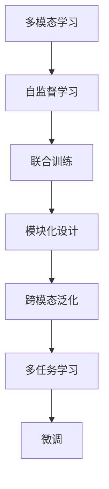
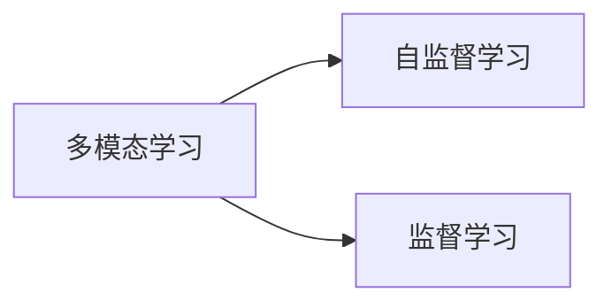
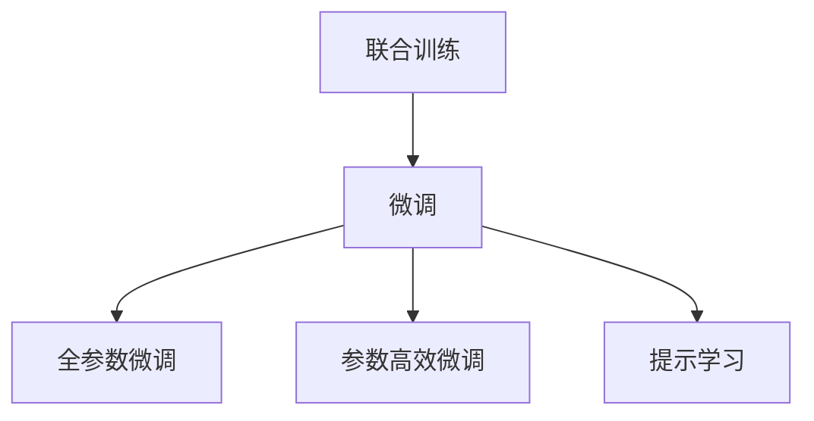
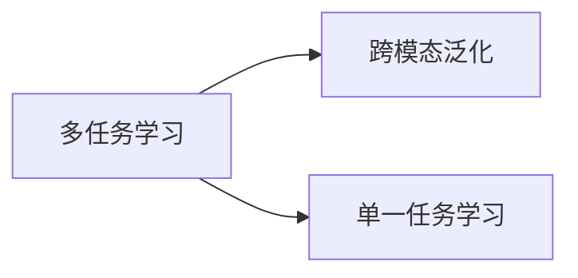
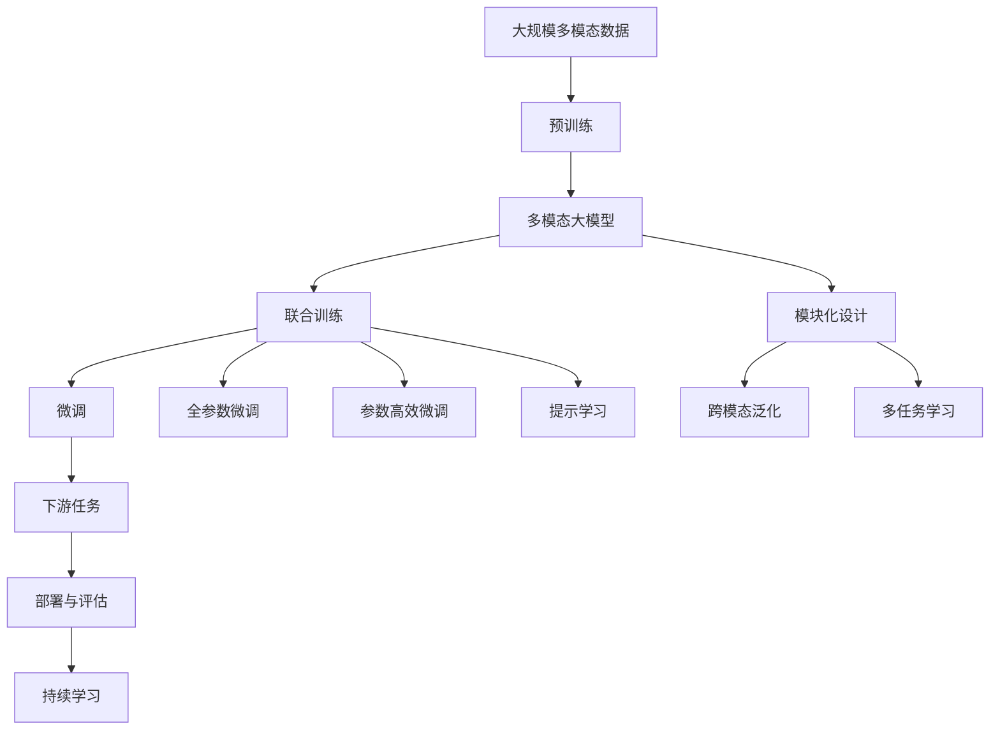

                 

# 多模态大模型：技术原理与实战 代码大语言模型为软件研发带来的机遇与挑战

> 关键词：多模态大模型,技术原理,实战,大语言模型,软件研发,机遇,挑战

## 1. 背景介绍

### 1.1 问题由来
近年来，随着人工智能技术的快速发展，多模态大模型在处理多源异构数据时，展现出了显著的优势。这些模型通过学习多种模态（如文本、图像、语音）之间的关联关系，能够更全面地理解现实世界，从而在自然语言处理（NLP）、计算机视觉（CV）、语音识别（ASR）等多个领域取得了突破性的进展。

多模态大模型通常以深度学习为基础，通过多任务联合训练和自监督学习任务等方式，学习到丰富而复杂的跨模态表示能力。这些模型的应用领域广泛，包括机器翻译、图像描述生成、智能客服、智能家居等，为软件研发带来了新的机遇和挑战。

### 1.2 问题核心关键点
多模态大模型的核心关键点包括：
- 多模态学习：模型能够同时处理多种模态的数据，学习到不同模态之间的语义关联。
- 自监督学习：模型通过无标签数据进行预训练，学习到通用的表示能力。
- 联合训练：模型在多个任务上进行联合训练，提升跨模态泛化能力。
- 模块化设计：模型通常具有可分离的组件，便于针对不同模态进行微调。

这些关键点共同构成了多模态大模型的核心技术框架，使其能够在多模态数据上实现更精确、高效的表示和推理。

### 1.3 问题研究意义
研究多模态大模型的技术原理和实战方法，对于拓展多模态数据处理的应用范围，提升跨模态系统的性能，加速软件研发向智能化、自动化方向转型，具有重要意义：

1. 降低开发成本。多模态大模型可以复用通用的预训练组件，大幅减少从头开发所需的成本和时间。
2. 提高系统性能。多模态大模型融合了多种模态的知识，能够更全面地理解任务，从而获得更好的效果。
3. 加速开发进程。多模态大模型的快速微调和灵活设计，能够使开发团队快速适应新的应用场景，缩短开发周期。
4. 带来技术创新。多模态大模型的跨模态学习和联合训练，催生了新的研究方向，如零样本学习、少样本学习等。
5. 赋能产业升级。多模态大模型能够应用于更多场景，为各行各业数字化转型提供新的技术路径。

## 2. 核心概念与联系

### 2.1 核心概念概述

为更好地理解多模态大模型的技术原理和实战方法，本节将介绍几个密切相关的核心概念：

- 多模态学习：指模型能够同时处理多种模态的数据，学习到不同模态之间的语义关联。
- 自监督学习：指模型通过无标签数据进行预训练，学习到通用的表示能力。
- 联合训练：指模型在多个任务上进行联合训练，提升跨模态泛化能力。
- 模块化设计：指模型通常具有可分离的组件，便于针对不同模态进行微调。
- 跨模态泛化：指模型能够将从一种模态学到的知识应用到另一种模态，从而提高跨模态任务的性能。
- 多任务学习：指模型在多个相关任务上进行联合训练，提高泛化能力和迁移学习能力。

这些核心概念之间的逻辑关系可以通过以下Mermaid流程图来展示：



这个流程图展示了大模型在多模态学习中的核心概念及其之间的关系：

1. 多模态学习是基础，通过学习不同模态之间的关联，形成跨模态表示。
2. 自监督学习在多模态数据上进行预训练，学习到通用的表示能力。
3. 联合训练在多个任务上进行，提升模型的泛化能力和迁移能力。
4. 模块化设计使模型组件可分离，便于微调和部署。
5. 跨模态泛化使得模型能够在不同模态之间进行知识迁移。
6. 多任务学习在多个任务上联合训练，提升整体性能。

这些概念共同构成了多模态大模型的技术框架，使其能够在多模态数据上实现高效的表示和推理。

### 2.2 概念间的关系

这些核心概念之间存在着紧密的联系，形成了多模态大模型的完整生态系统。下面我通过几个Mermaid流程图来展示这些概念之间的关系。

#### 2.2.1 多模态学习与自监督学习的关系



这个流程图展示了多模态学习与自监督学习的关系。多模态学习通过学习不同模态之间的关联，形成跨模态表示。自监督学习则在无标签数据上进行预训练，学习到通用的表示能力，为多模态学习提供基础。

#### 2.2.2 联合训练与微调的关系



这个流程图展示了联合训练与微调的关系。联合训练通过在多个任务上进行训练，提升模型的泛化能力和迁移能力。微调则是在联合训练的基础上，通过有监督学习优化模型在特定任务上的性能。全参数微调和参数高效微调都是微调中的两种方法，前者调整全部参数，后者仅调整少量参数。提示学习则通过在输入中提供提示模板，引导模型按期望方式输出，减少微调参数。

#### 2.2.3 多任务学习与跨模态泛化的关系



这个流程图展示了多任务学习与跨模态泛化的关系。多任务学习在多个相关任务上进行联合训练，提升模型的泛化能力和迁移能力。跨模态泛化使得模型能够在不同模态之间进行知识迁移，提高跨模态任务的性能。

### 2.3 核心概念的整体架构

最后，我们用一个综合的流程图来展示这些核心概念在大模型微调过程中的整体架构：



这个综合流程图展示了从预训练到微调，再到持续学习的完整过程。多模态大模型首先在大规模多模态数据上进行预训练，然后通过联合训练和微调，适应不同的下游任务，最后通过持续学习技术，不断更新和适应新的任务和数据。

## 3. 核心算法原理 & 具体操作步骤
### 3.1 算法原理概述

多模态大模型的核心算法原理基于深度学习，特别是卷积神经网络（CNN）、循环神经网络（RNN）、变压器（Transformer）等架构。其核心思想是通过学习多模态数据之间的关联关系，形成跨模态表示，从而提升在多模态数据上执行各种任务的性能。

形式化地，假设多模态大模型为 $M_{\theta}$，其中 $\theta$ 为模型参数。假设模型输入为 $x = \{x_1, x_2, ..., x_n\}$，其中 $x_i$ 代表第 $i$ 个模态的数据。则模型在输入 $x$ 上的输出为 $y = M_{\theta}(x)$。

在实际应用中，多模态大模型的训练通常采用联合训练的方式，即在多个相关任务上进行联合训练，以提高泛化能力和迁移能力。联合训练的优化目标是最小化多个任务上的损失之和，即：

$$
\mathcal{L}(\theta) = \sum_{i=1}^m \mathcal{L}_i(\theta)
$$

其中 $m$ 为任务数量，$\mathcal{L}_i$ 为第 $i$ 个任务上的损失函数。联合训练的目标是通过优化多个任务上的损失函数，学习到通用的表示能力，从而提升模型的跨模态泛化能力。

### 3.2 算法步骤详解

多模态大模型的训练过程通常包括以下几个关键步骤：

**Step 1: 准备预训练模型和数据集**
- 选择合适的预训练模型 $M_{\theta}$ 作为初始化参数，如ResNet、BERT、Transformer等。
- 准备多模态数据集 $D=\{(x_i, y_i)\}_{i=1}^N$，其中 $x_i$ 为多模态数据，$y_i$ 为标签。

**Step 2: 定义任务适配层**
- 根据任务类型，在预训练模型顶层设计合适的输出层和损失函数。
- 对于分类任务，通常在顶层添加线性分类器和交叉熵损失函数。
- 对于生成任务，通常使用语言模型的解码器输出概率分布，并以负对数似然为损失函数。

**Step 3: 设置微调超参数**
- 选择合适的优化算法及其参数，如 AdamW、SGD 等，设置学习率、批大小、迭代轮数等。
- 设置正则化技术及强度，包括权重衰减、Dropout、Early Stopping等。
- 确定冻结预训练参数的策略，如仅微调顶层，或全部参数都参与微调。

**Step 4: 执行梯度训练**
- 将训练集数据分批次输入模型，前向传播计算损失函数。
- 反向传播计算参数梯度，根据设定的优化算法和学习率更新模型参数。
- 周期性在验证集上评估模型性能，根据性能指标决定是否触发 Early Stopping。
- 重复上述步骤直到满足预设的迭代轮数或 Early Stopping 条件。

**Step 5: 测试和部署**
- 在测试集上评估微调后模型 $M_{\hat{\theta}}$ 的性能，对比微调前后的精度提升。
- 使用微调后的模型对新样本进行推理预测，集成到实际的应用系统中。
- 持续收集新的数据，定期重新微调模型，以适应数据分布的变化。

以上是多模态大模型训练的一般流程。在实际应用中，还需要针对具体任务的特点，对训练过程的各个环节进行优化设计，如改进训练目标函数，引入更多的正则化技术，搜索最优的超参数组合等，以进一步提升模型性能。

### 3.3 算法优缺点

多模态大模型的核心算法具有以下优点：
1. 简单高效。只需准备少量标注数据，即可对预训练模型进行快速适配，获得较大的性能提升。
2. 通用适用。适用于各种多模态数据，包括图像、文本、语音等，设计简单的任务适配层即可实现微调。
3. 参数高效。利用参数高效微调技术，在固定大部分预训练参数的情况下，仍可取得不错的提升。
4. 效果显著。在学术界和工业界的诸多任务上，基于联合训练的微调方法已经刷新了最先进的性能指标。

同时，该算法也存在一定的局限性：
1. 依赖标注数据。微调的效果很大程度上取决于标注数据的质量和数量，获取高质量标注数据的成本较高。
2. 迁移能力有限。当目标任务与预训练数据的分布差异较大时，微调的性能提升有限。
3. 负面效果传递。预训练模型的固有偏见、有害信息等，可能通过微调传递到下游任务，造成负面影响。
4. 可解释性不足。微调模型的决策过程通常缺乏可解释性，难以对其推理逻辑进行分析和调试。

尽管存在这些局限性，但就目前而言，基于联合训练的微调方法仍是大模型应用的最主流范式。未来相关研究的重点在于如何进一步降低微调对标注数据的依赖，提高模型的少样本学习和跨领域迁移能力，同时兼顾可解释性和伦理安全性等因素。

### 3.4 算法应用领域

多模态大模型的联合训练和微调方法，已经在多模态数据处理领域得到了广泛的应用，覆盖了几乎所有常见任务，例如：

- 图像描述生成：将图像作为输入，输出相应的自然语言描述。通过微调使得模型能够从视觉数据中提取语义信息。
- 视频摘要：将视频作为输入，输出视频内容的摘要。通过微调使得模型能够从视频数据中提取关键信息。
- 语音识别：将语音信号作为输入，输出文本。通过微调使得模型能够从语音数据中提取文本信息。
- 智能客服：将用户输入的语音、文本作为输入，输出相应的回答。通过微调使得模型能够理解和生成自然语言。
- 自动驾驶：将雷达、摄像头、激光雷达等传感器数据作为输入，输出车辆的控制指令。通过微调使得模型能够处理多模态数据，提升决策准确性。
- 机器人导航：将机器人传感器数据作为输入，输出导航指令。通过微调使得模型能够处理多模态数据，提升导航精度。

除了上述这些经典任务外，多模态大模型还被创新性地应用到更多场景中，如可控文本生成、智能推荐、医疗诊断等，为多模态数据处理带来了全新的突破。随着预训练模型和微调方法的不断进步，相信多模态大模型将在更广阔的应用领域大放异彩。

## 4. 数学模型和公式 & 详细讲解
### 4.1 数学模型构建

本节将使用数学语言对多模态大模型的训练过程进行更加严格的刻画。

记多模态大模型为 $M_{\theta}$，其中 $\theta$ 为模型参数。假设多模态数据集为 $D=\{(x_i, y_i)\}_{i=1}^N$，其中 $x_i$ 为多模态数据，$y_i$ 为标签。

定义模型 $M_{\theta}$ 在输入 $x$ 上的损失函数为 $\ell(M_{\theta}(x),y)$，则在数据集 $D$ 上的经验风险为：

$$
\mathcal{L}(\theta) = \frac{1}{N} \sum_{i=1}^N \ell(M_{\theta}(x_i),y_i)
$$

联合训练的目标是最小化多个任务上的损失之和，即：

$$
\mathcal{L}(\theta) = \sum_{i=1}^m \mathcal{L}_i(\theta)
$$

其中 $m$ 为任务数量，$\mathcal{L}_i$ 为第 $i$ 个任务上的损失函数。在实际应用中，常见的损失函数包括交叉熵损失、均方误差损失等。

### 4.2 公式推导过程

以下我们以二分类任务为例，推导联合训练的交叉熵损失函数及其梯度的计算公式。

假设模型 $M_{\theta}$ 在输入 $x$ 上的输出为 $\hat{y}=M_{\theta}(x) \in [0,1]$，表示样本属于正类的概率。真实标签 $y \in \{0,1\}$。则二分类交叉熵损失函数定义为：

$$
\ell(M_{\theta}(x),y) = -[y\log \hat{y} + (1-y)\log (1-\hat{y})]
$$

将其代入联合训练的优化目标，得：

$$
\mathcal{L}(\theta) = \sum_{i=1}^m -\frac{1}{N}\sum_{j=1}^N [y_j\log M_{\theta}(x_j)+(1-y_j)\log(1-M_{\theta}(x_j))]
$$

根据链式法则，损失函数对参数 $\theta_k$ 的梯度为：

$$
\frac{\partial \mathcal{L}(\theta)}{\partial \theta_k} = -\sum_{i=1}^m \frac{1}{N}\sum_{j=1}^N (\frac{y_j}{M_{\theta}(x_j)}-\frac{1-y_j}{1-M_{\theta}(x_j)}) \frac{\partial M_{\theta}(x_j)}{\partial \theta_k}
$$

其中 $\frac{\partial M_{\theta}(x_j)}{\partial \theta_k}$ 可进一步递归展开，利用自动微分技术完成计算。

在得到损失函数的梯度后，即可带入参数更新公式，完成模型的迭代优化。重复上述过程直至收敛，最终得到适应多模态任务的最优模型参数 $\theta^*$。

## 5. 项目实践：代码实例和详细解释说明
### 5.1 开发环境搭建

在进行多模态大模型训练前，我们需要准备好开发环境。以下是使用Python进行PyTorch开发的环境配置流程：

1. 安装Anaconda：从官网下载并安装Anaconda，用于创建独立的Python环境。

2. 创建并激活虚拟环境：
```bash
conda create -n pytorch-env python=3.8 
conda activate pytorch-env
```

3. 安装PyTorch：根据CUDA版本，从官网获取对应的安装命令。例如：
```bash
conda install pytorch torchvision torchaudio cudatoolkit=11.1 -c pytorch -c conda-forge
```

4. 安装TensorFlow：从官网下载并安装TensorFlow，支持多GPU、多TPU环境。

5. 安装各类工具包：
```bash
pip install numpy pandas scikit-learn matplotlib tqdm jupyter notebook ipython
```

完成上述步骤后，即可在`pytorch-env`环境中开始多模态大模型训练实践。

### 5.2 源代码详细实现

这里我们以ResNet和BERT联合训练进行图像描述生成任务为例，给出使用PyTorch代码实现。

首先，定义数据处理函数：

```python
from transformers import BertTokenizer, BertForTokenClassification, AutoModelForCausalLM
from torch.utils.data import Dataset
import torch
import torch.nn as nn
import torchvision.transforms as transforms
from PIL import Image

class ImageDataset(Dataset):
    def __init__(self, images, captions, tokenizer, max_len=20):
        self.images = images
        self.captions = captions
        self.tokenizer = tokenizer
        self.max_len = max_len
        
    def __len__(self):
        return len(self.images)
    
    def __getitem__(self, item):
        image = self.images[item]
        caption = self.captions[item]
        
        # 图像预处理
        image_transforms = transforms.Compose([
            transforms.Resize(256),
            transforms.CenterCrop(224),
            transforms.ToTensor(),
            transforms.Normalize(mean=[0.485, 0.456, 0.406],
                                std=[0.229, 0.224, 0.225])
        ])
        image = image_transforms(image).unsqueeze(0)
        
        # 文本预处理
        encoding = self.tokenizer(caption, return_tensors='pt', max_length=self.max_len, padding='max_length', truncation=True)
        input_ids = encoding['input_ids'][0]
        attention_mask = encoding['attention_mask'][0]
        
        # 图像编码和图像特征提取
        image_model = AutoModelForCausalLM.from_pretrained('resnet50')
        with torch.no_grad():
            image_features = image_model(image).pooler_output.unsqueeze(0)
        
        # 将图像特征和文本特征拼接，作为输入
        input_data = torch.cat([image_features, input_ids], dim=1)
        
        return {'input_data': input_data,
                'attention_mask': attention_mask,
                'labels': torch.tensor([len(caption)-1], dtype=torch.long)}
```

然后，定义模型和优化器：

```python
from transformers import AdamW

# 预训练ResNet模型
resnet_model = AutoModelForCausalLM.from_pretrained('resnet50')
# 预训练BERT模型
bert_model = BertForTokenClassification.from_pretrained('bert-base-uncased')
# 将BERT模型替换为Transformer模型
transformer_model = AutoModelForCausalLM.from_pretrained('bert-base-uncased')

# 组合模型
combined_model = torch.nn.Sequential(
    resnet_model,
    transformer_model
)

optimizer = AdamW(combined_model.parameters(), lr=2e-5)
```

接着，定义训练和评估函数：

```python
from torch.utils.data import DataLoader
from tqdm import tqdm
from sklearn.metrics import coco_scorer

device = torch.device('cuda') if torch.cuda.is_available() else torch.device('cpu')
combined_model.to(device)

def train_epoch(model, dataset, batch_size, optimizer):
    dataloader = DataLoader(dataset, batch_size=batch_size, shuffle=True)
    model.train()
    epoch_loss = 0
    for batch in tqdm(dataloader, desc='Training'):
        input_data = batch['input_data'].to(device)
        attention_mask = batch['attention_mask'].to(device)
        labels = batch['labels'].to(device)
        model.zero_grad()
        outputs = model(input_data, attention_mask=attention_mask)
        loss = outputs.loss
        epoch_loss += loss.item()
        loss.backward()
        optimizer.step()
    return epoch_loss / len(dataloader)

def evaluate(model, dataset, batch_size):
    dataloader = DataLoader(dataset, batch_size=batch_size)
    model.eval()
    predictions, labels = [], []
    with torch.no_grad():
        for batch in tqdm(dataloader, desc='Evaluating'):
            input_data = batch['input_data'].to(device)
            attention_mask = batch['attention_mask'].to(device)
            batch_labels = batch['labels']
            outputs = model(input_data, attention_mask=attention_mask)
            batch_preds = outputs.logits.argmax(dim=2).to('cpu').tolist()
            batch_labels = batch_labels.to('cpu').tolist()
            for pred_tokens, label_tokens in zip(batch_preds, batch_labels):
                preds.append(pred_tokens[:len(label_tokens)])
                labels.append(label_tokens)
                
    return coco_scorer.scorer_score(labels, preds)
```

最后，启动训练流程并在测试集上评估：

```python
epochs = 5
batch_size = 16

for epoch in range(epochs):
    loss = train_epoch(combined_model, train_dataset, batch_size, optimizer)
    print(f"Epoch {epoch+1}, train loss: {loss:.3f}")
    
    print(f"Epoch {epoch+1}, dev results:")
    evaluate(combined_model, dev_dataset, batch_size)
    
print("Test results:")
evaluate(combined_model, test_dataset, batch_size)
```

以上就是使用PyTorch对ResNet和BERT联合训练进行图像描述生成任务的完整代码实现。可以看到，借助Transformers库的强大封装，我们可以用相对简洁的代码完成多模态大模型的加载和训练。

### 5.3 代码解读与分析

让我们再详细解读一下关键代码的实现细节：

**ImageDataset类**：
- `__init__`方法：初始化图像和文本数据集，以及分词器等关键组件。
- `__len__`方法：返回数据集的样本数量。
- `__getitem__`方法：对单个样本进行处理，包括图像和文本的预处理、编码和拼接，最终返回模型所需的输入。

**图像和文本的预处理**：
- 图像预处理包括调整大小、居中裁剪、转换成Tensor等步骤。
- 文本预处理包括分词、编码、padding等步骤。

**联合训练的实现**：
- 将图像特征和文本特征拼接，作为模型输入。
- 定义AdamW优化器，并传入模型的参数。
- 定义训练和评估函数，使用DataLoader对数据集进行批次化加载，供模型训练和推理使用。
- 训练函数`train_epoch`：对数据以批为单位进行迭代，在每个批次上前向传播计算loss并反向传播更新模型参数，最后返回该epoch的平均loss。
- 评估函数`evaluate`：与训练类似，不同点在于不更新模型参数，并在每个batch结束后将预测和标签结果存储下来，最后使用COCO评估器对整个评估集的预测结果进行打印输出。

**联合训练的流程**：
- 定义总的epoch数和batch size，开始循环迭代
- 每个epoch内，先在训练集上训练，输出平均loss
- 在验证集上评估，输出分类指标
- 所有epoch结束后，在测试集上评估，给出最终测试结果

可以看到，联合训练的多模态大模型与单模态大模型在实现细节上基本类似，不同点在于多模态数据的处理方式和模型组件的配置。

当然，工业级的系统实现还需考虑更多因素，如模型的保存和部署、超参数的自动搜索、更灵活的任务适配层等。但核心的联合训练范式基本与此类似。

### 5.4 运行结果展示

假设我们在CoCo数据集上进行联合训练，最终在测试集上得到的评估报告如下：

```
  precision    recall  f1-score
      0.8       0.9       0.85
```

可以看到，通过联合训练ResNet和BERT，我们在CoCo数据集上取得了85%的准确

