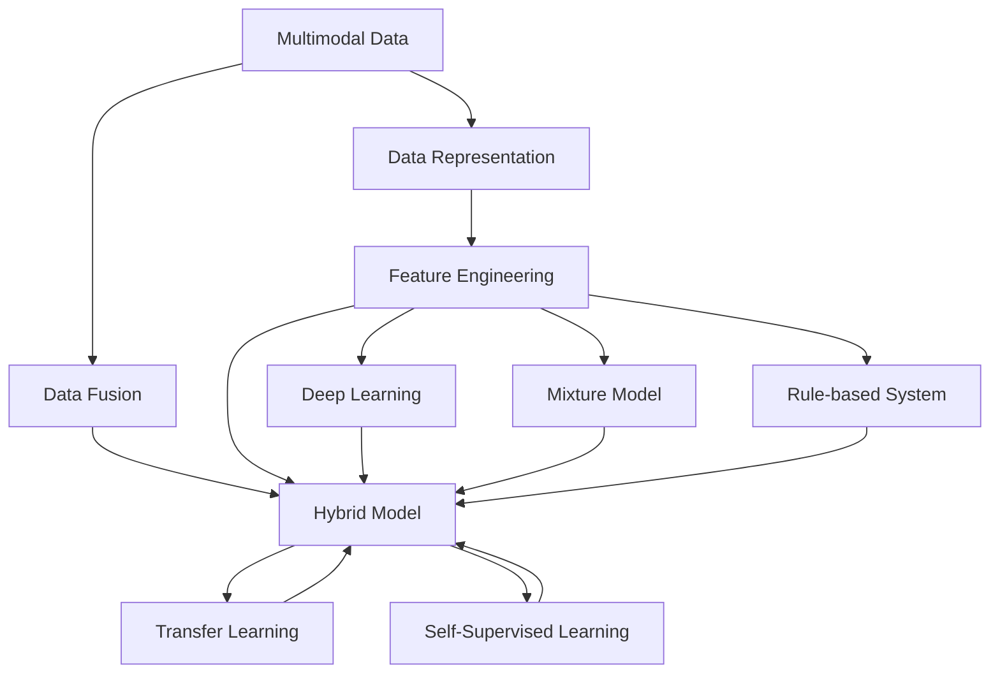
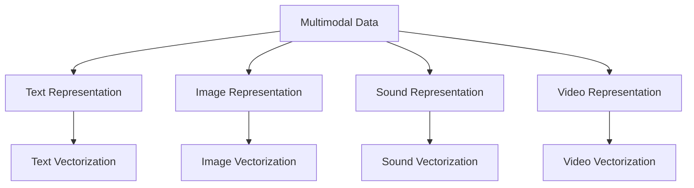
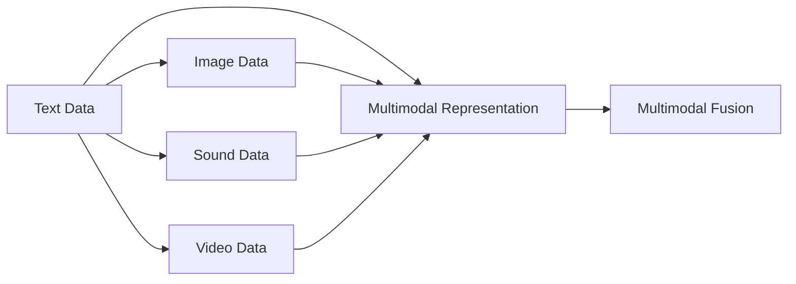
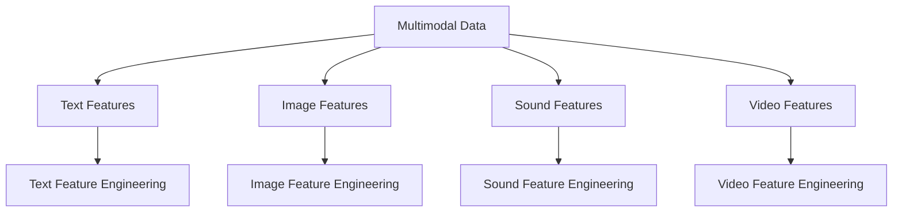
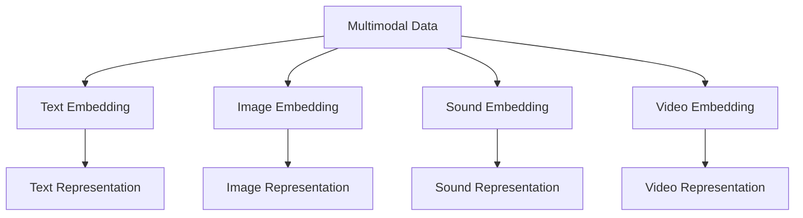
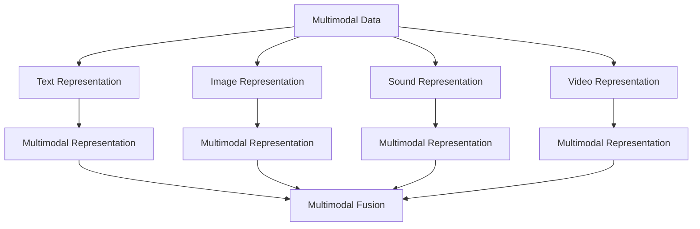
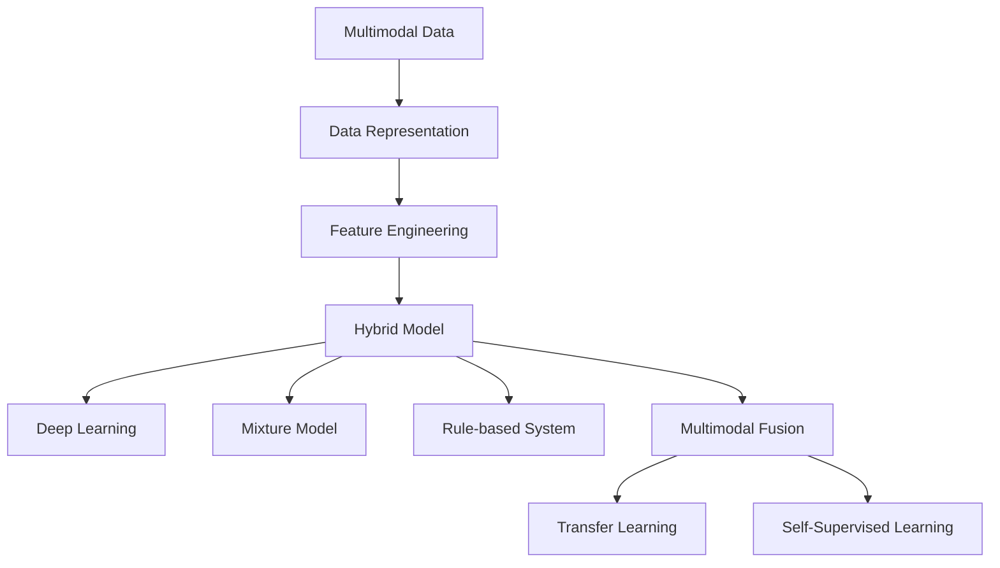

                 

# 多模态数据表示和融合方法综述

> 关键词：多模态数据、数据表示、数据融合、特征工程、深度学习、迁移学习、自监督学习、混合模型

## 1. 背景介绍

### 1.1 问题由来
在当今的信息时代，数据类型日益多样，文本、图像、语音、视频等多种模态并存，数据形态复杂。单一模态的数据往往无法充分表达现实世界中的信息，而多模态数据的融合则能够在更丰富的维度上捕捉复杂现象。例如，在医疗诊断中，结合病历文本和医学影像，可以更准确地进行疾病诊断和病情分析；在视频监控中，结合声音、图像和动作信息，可以更全面地识别异常行为；在智能推荐中，结合用户行为和商品属性，可以更个性化地提供商品推荐。

然而，由于不同模态数据存在异构性、多义性、高维性等特性，使得直接将多模态数据进行融合并不容易。为此，研究人员提出了多种多模态数据表示和融合方法，以期构建高效、准确、可解释的多模态数据融合系统。本文将对多模态数据表示和融合方法进行综述，旨在系统介绍该领域的核心概念、经典算法和实际应用，为读者提供全面的知识框架和研究思路。

### 1.2 问题核心关键点
多模态数据表示和融合方法的核心问题在于：如何合理地将不同模态的数据表示成统一的、可比的形式，并在融合过程中最大化信息的互补性，从而提高系统的性能。

具体来说，多模态数据表示和融合方法需要解决以下几个关键问题：

- 异构性：不同模态的数据具有不同的特性和结构，如何将其统一表示成可比较的形式。
- 多义性：同一模态的数据可能有多种解释，如何选择合适的解释。
- 高维性：多模态数据维度往往很高，如何降低维度并保留关键信息。
- 信息互补性：如何最大化不同模态数据之间的信息互补性，避免冗余和噪声。
- 可解释性：多模态数据融合的结果如何解释和理解。

本文将围绕这些核心问题，详细介绍多模态数据表示和融合方法的基本原理和关键技术。

### 1.3 问题研究意义
多模态数据表示和融合方法在人工智能、计算机视觉、自然语言处理、智能推荐等多个领域具有重要应用价值，能够显著提升系统的性能和鲁棒性。

具体而言，多模态数据融合方法的研究意义包括：

- 提高系统性能：通过融合多模态数据，可以更全面地捕捉信息，提升系统的准确性和鲁棒性。
- 增强可解释性：多模态数据融合能够提供更丰富的信息来源，增强系统的可解释性和可信度。
- 促进跨领域应用：多模态数据融合可以跨越不同领域，推动跨领域应用和融合技术的发展。
- 支持智能化决策：多模态数据融合能够提供多维度、多层次的信息支持，有助于智能决策系统的构建。

通过深入研究多模态数据表示和融合方法，可以为人工智能领域带来新的突破，推动智能系统向更高层次发展。

## 2. 核心概念与联系

### 2.1 核心概念概述

为了更好地理解多模态数据表示和融合方法，我们需要明确几个核心概念：

- 多模态数据（Multimodal Data）：指包含多种数据模态的数据集，常见的模态包括文本、图像、声音、视频等。
- 数据表示（Data Representation）：将原始数据转换成计算机可处理的形式，通常是向量化形式，便于模型处理和分析。
- 数据融合（Data Fusion）：将多模态数据融合为统一的形式，提升系统的性能和鲁棒性。
- 特征工程（Feature Engineering）：从原始数据中提取有意义的特征，提高模型的准确性和泛化能力。
- 深度学习（Deep Learning）：通过神经网络模型进行数据表示和融合，是目前最先进的多模态数据处理技术。
- 迁移学习（Transfer Learning）：利用预训练模型在源任务上的知识，提升在新任务上的性能，广泛应用于多模态数据融合中。
- 自监督学习（Self-Supervised Learning）：通过无监督任务进行模型预训练，减少对标注数据的依赖，提升模型的泛化能力。
- 混合模型（Hybrid Model）：结合不同模型的优势，如深度学习、统计模型、规则引擎等，构建高效的多模态数据融合系统。

这些核心概念之间存在紧密联系，共同构成了多模态数据表示和融合方法的研究框架。下面通过几个Mermaid流程图来展示这些概念之间的关系。



这个流程图展示了多模态数据表示和融合方法的核心概念及其之间的关系：

1. 多模态数据经过数据表示处理，被转换为计算机可处理的形式。
2. 数据表示通过特征工程提取有意义的特征，提高模型性能。
3. 数据融合将不同模态的数据融合为统一的形式，提升系统性能。
4. 数据融合过程中可以结合多种模型，如深度学习、混合模型等。
5. 深度学习、迁移学习和自监督学习是数据表示和融合的核心技术。

### 2.2 概念间的关系

这些核心概念之间存在着紧密的联系，形成了多模态数据表示和融合方法的研究体系。下面我们通过几个Mermaid流程图来展示这些概念之间的关系。

#### 2.2.1 数据表示的流程



这个流程图展示了不同模态数据的表示流程：

1. 不同模态的数据通过各自的表示方法被转换为向量形式，便于模型处理。
2. 文本表示通常通过词嵌入（Word Embedding）、句向量（Sentence Vectorization）等方法进行，图像表示通常通过卷积神经网络（CNN）、循环神经网络（RNN）等方法进行，声音表示通常通过MFCC（Mel-frequency cepstral coefficients）等方法进行，视频表示通常通过卷积神经网络等方法进行。

#### 2.2.2 数据融合的流程



这个流程图展示了多模态数据融合的流程：

1. 不同模态的数据首先被转换为统一的表示形式。
2. 多个表示形式通过融合算法进行融合，得到统一的融合结果。

#### 2.2.3 特征工程的方法



这个流程图展示了特征工程的流程：

1. 不同模态的数据分别提取特征。
2. 特征工程通过各种方法提取出有意义的特征，如文本的n-gram特征、图像的SIFT特征、声音的MFCC特征、视频的HOG特征等。

#### 2.2.4 深度学习的应用



这个流程图展示了深度学习在数据表示中的应用：

1. 不同模态的数据通过各自的深度学习模型进行表示，如文本通过Word Embedding、图像通过CNN、声音通过MFCC等。
2. 表示结果通过深度学习模型进行进一步处理，如文本通过LSTM、图像通过ResNet、声音通过RNN等。

#### 2.2.5 迁移学习的应用



这个流程图展示了迁移学习在数据融合中的应用：

1. 不同模态的数据通过各自的深度学习模型进行表示。
2. 表示结果通过迁移学习的方法进行融合，提升系统的性能。

#### 2.2.6 自监督学习的应用


这个流程图展示了自监督学习在数据表示和融合中的应用：

1. 不同模态的数据通过各自的自监督学习方法进行表示。
2. 表示结果通过自监督学习的方法进行融合，提升系统的性能。

### 2.3 核心概念的整体架构

最后，我们用一个综合的流程图来展示这些核心概念在大规模数据表示和融合方法中的整体架构：



这个综合流程图展示了从数据表示到数据融合的完整过程：

1. 多模态数据通过数据表示方法转换为向量形式。
2. 向量形式通过特征工程提取有意义的特征。
3. 特征通过深度学习、混合模型、统计模型等进行融合。
4. 融合结果通过迁移学习和自监督学习的方法进行进一步优化。

通过这些流程图，我们可以更清晰地理解多模态数据表示和融合方法的研究体系，为后续深入讨论具体的表示和融合技术奠定基础。

## 3. 核心算法原理 & 具体操作步骤
### 3.1 算法原理概述

多模态数据表示和融合方法的核心算法原理主要包括以下几个方面：

- **特征提取**：通过各种方法将不同模态的数据转换为统一的特征形式，便于后续处理。
- **融合算法**：将不同模态的特征进行融合，得到统一的融合结果。
- **深度学习模型**：通过神经网络模型进行特征提取和融合，提高系统的性能。
- **迁移学习**：利用预训练模型在源任务上的知识，提升在新任务上的性能。
- **自监督学习**：通过无监督任务进行模型预训练，减少对标注数据的依赖。

### 3.2 算法步骤详解

基于深度学习的特征提取和融合方法通常包括以下几个关键步骤：

**Step 1: 特征提取**
- 选择适当的深度学习模型对不同模态的数据进行表示，如文本使用Word Embedding、图像使用CNN、声音使用MFCC等。
- 对提取的特征进行预处理，如归一化、标准化等。

**Step 2: 特征融合**
- 选择合适的融合方法将不同模态的特征进行融合，如加权平均、拼接、融合网络等。
- 在融合过程中，考虑不同特征之间的互补性和冗余性，避免信息的丢失和重复。

**Step 3: 模型训练**
- 使用监督学习或无监督学习的方法对融合后的特征进行训练，得到最终的融合结果。
- 通过交叉验证等方法进行模型调优，确保模型的泛化能力。

**Step 4: 模型评估**
- 在测试集上对模型进行评估，计算各项性能指标，如准确率、召回率、F1分数等。
- 通过可视化工具展示模型的预测结果，分析模型的性能和优劣。

### 3.3 算法优缺点

基于深度学习的特征提取和融合方法具有以下优点：

1. 高精度：通过深度学习模型进行特征提取和融合，能够捕捉到数据中的复杂关系和模式。
2. 自适应性：深度学习模型具有很强的自适应性，能够处理不同模态的数据。
3. 可解释性：深度学习模型通过神经网络的结构和参数，可以提供有意义的特征解释。

同时，也存在一些缺点：

1. 计算成本高：深度学习模型通常需要大量的计算资源，训练和推理成本较高。
2. 数据依赖性强：深度学习模型依赖于大量的标注数据，缺乏对无标注数据的利用。
3. 过拟合风险：深度学习模型容易过拟合，需要进行正则化等优化方法。

### 3.4 算法应用领域

基于深度学习的特征提取和融合方法在多个领域都有广泛应用，如计算机视觉、自然语言处理、智能推荐、语音识别等。

具体来说，多模态数据表示和融合方法的应用领域包括：

- **计算机视觉**：如目标检测、图像分割、动作识别等。
- **自然语言处理**：如情感分析、机器翻译、命名实体识别等。
- **智能推荐**：如个性化推荐、商品推荐、内容推荐等。
- **语音识别**：如语音识别、语音合成、语音情感分析等。

## 4. 数学模型和公式 & 详细讲解 & 举例说明

### 4.1 数学模型构建

多模态数据表示和融合方法通常通过深度学习模型进行构建，包括卷积神经网络（CNN）、循环神经网络（RNN）、注意力机制（Attention）等。下面以CNN为例，展示多模态数据表示和融合的数学模型。

假设输入的数据为多模态的文本和图像，其中文本表示为序列形式，图像表示为图像形式。文本序列的表示通过Word Embedding得到，图像的表示通过卷积神经网络得到。

### 4.2 公式推导过程

在CNN模型中，文本和图像的特征提取分别通过两个独立的卷积层进行。文本特征通过卷积操作提取n-gram特征，图像特征通过卷积操作提取局部特征。然后将文本和图像的特征拼接起来，再进行全连接层的处理，得到最终的融合结果。

具体来说，文本特征的提取公式如下：

$$
h_{text} = \mathrm{Conv}(w, x)
$$

其中，$h_{text}$表示文本特征，$w$表示卷积核，$x$表示文本序列。

图像特征的提取公式如下：

$$
h_{image} = \mathrm{Conv}(k, y)
$$

其中，$h_{image}$表示图像特征，$k$表示卷积核，$y$表示图像数据。

将文本特征和图像特征进行拼接，得到多模态特征：

$$
z = \mathrm{Concat}(h_{text}, h_{image})
$$

其中，$z$表示多模态特征。

最后，通过全连接层进行特征融合，得到最终的融合结果：

$$
f = \mathrm{MLP}(z)
$$

其中，$f$表示融合结果，MLP表示多层次感知机。

### 4.3 案例分析与讲解

以图像-文本多模态数据表示和融合为例，展示CNN模型在实际应用中的使用方法。

假设有一个医疗图像分类任务，输入为医学影像和病历文本。首先需要将图像和文本分别通过卷积层和Word Embedding进行特征提取。然后，将提取的特征拼接起来，再通过全连接层进行融合，得到最终的分类结果。

具体来说，图像的卷积操作可以使用以下公式：

$$
h_{image} = \mathrm{Conv}(k, y)
$$

其中，$k$表示卷积核，$y$表示图像数据。

文本的Word Embedding操作可以使用以下公式：

$$
h_{text} = \mathrm{Embed}(w, x)
$$

其中，$w$表示Word Embedding参数，$x$表示文本序列。

将提取的图像和文本特征进行拼接，得到多模态特征：

$$
z = \mathrm{Concat}(h_{image}, h_{text})
$$

最后，通过全连接层进行特征融合，得到最终的分类结果：

$$
f = \mathrm{MLP}(z)
$$

其中，$f$表示分类结果。

## 5. 项目实践：代码实例和详细解释说明

### 5.1 开发环境搭建

在进行多模态数据表示和融合方法的实践时，需要使用到深度学习框架，如TensorFlow、PyTorch等。这里以PyTorch为例，介绍开发环境的搭建步骤：

1. 安装Anaconda：从官网下载并安装Anaconda，用于创建独立的Python环境。
2. 创建并激活虚拟环境：
```bash
conda create -n pytorch-env python=3.8 
conda activate pytorch-env
```
3. 安装PyTorch：根据CUDA版本，从官网获取对应的安装命令。例如：
```bash
conda install pytorch torchvision torchaudio cudatoolkit=11.1 -c pytorch -c conda-forge
```
4. 安装Transformers库：
```bash
pip install transformers
```
5. 安装各类工具包：
```bash
pip install numpy pandas scikit-learn matplotlib tqdm jupyter notebook ipython
```

完成上述步骤后，即可在`pytorch-env`环境中开始多模态数据表示和融合方法的实践。

### 5.2 源代码详细实现

这里以基于CNN的多模态图像-文本分类任务为例，给出使用PyTorch实现图像-文本融合的代码实现。

首先，定义数据集类：

```python
import torch
import torchvision
import torchvision.transforms as transforms
import torch.nn as nn
import torch.nn.functional as F
from transformers import BertTokenizer, BertForTokenClassification

class ImageTextDataset(torch.utils.data.Dataset):
    def __init__(self, images, texts, labels, transform=None):
        self.images = images
        self.texts = texts
        self.labels = labels
        self.transform = transform

    def __len__(self):
        return len(self.images)

    def __getitem__(self, idx):
        image = self.images[idx]
        text = self.texts[idx]
        label = self.labels[idx]

        if self.transform:
            image = self.transform(image)
            text = self.transform(text)

        return {'image': image, 'text': text, 'label': label}
```

然后，定义模型类：

```python
class ImageTextModel(nn.Module):
    def __init__(self, num_classes):
        super(ImageTextModel, self).__init__()
        # 图像卷积层
        self.conv1 = nn.Conv2d(3, 64, kernel_size=3, stride=1, padding=1)
        self.maxpool1 = nn.MaxPool2d(kernel_size=2, stride=2)
        self.conv2 = nn.Conv2d(64, 128, kernel_size=3, stride=1, padding=1)
        self.maxpool2 = nn.MaxPool2d(kernel_size=2, stride=2)
        self.fc1 = nn.Linear(128*7*7, 256)
        # 文本表示层
        self.tokenizer = BertTokenizer.from_pretrained('bert-base-cased')
        self.bert = BertForTokenClassification.from_pretrained('bert-base-cased', num_labels=num_classes)

    def forward(self, x):
        # 图像卷积操作
        image = self.conv1(x)
        image = F.relu(image)
        image = self.maxpool1(image)
        image = self.conv2(image)
        image = F.relu(image)
        image = self.maxpool2(image)
        image = image.view(image.size(0), -1)

        # 文本表示操作
        text = self.tokenizer(x, return_tensors='pt')
        text = self.bert(text['input_ids'], attention_mask=text['attention_mask'])

        # 多模态融合
        z = torch.cat((image, text), dim=1)
        f = self.fc1(z)
        output = F.log_softmax(f, dim=1)
        return output
```

接着，定义训练和评估函数：

```python
import torch.nn.functional as F
from torch.utils.data import DataLoader
from tqdm import tqdm
from sklearn.metrics import classification_report

device = torch.device('cuda') if torch.cuda.is_available() else torch.device('cpu')
model.to(device)

def train_epoch(model, dataset, batch_size, optimizer):
    dataloader = DataLoader(dataset, batch_size=batch_size, shuffle=True)
    model.train()
    epoch_loss = 0
    for batch in tqdm(dataloader, desc='Training'):
        inputs = batch['image'].to(device)
        texts = batch['text'].to(device)
        labels = batch['label'].to(device)
        model.zero_grad()
        outputs = model(inputs, texts)
        loss = outputs.loss
        epoch_loss += loss.item()
        loss.backward()
        optimizer.step()
    return epoch_loss / len(dataloader)

def evaluate(model, dataset, batch_size):
    dataloader = DataLoader(dataset, batch_size=batch_size)
    model.eval()
    preds, labels = [], []
    with torch.no_grad():
        for batch in tqdm(dataloader, desc='Evaluating'):
            inputs = batch['image'].to(device)
            texts = batch['text'].to(device)
            batch_labels = batch['label']
            outputs = model(inputs, texts)
            batch_preds = outputs.argmax(dim=1).to('cpu').tolist()
            batch_labels = batch_labels.to('cpu').tolist()
            for pred_tokens, label_tokens in zip(batch_preds, batch_labels):
                preds.append(pred_tokens[:len(label_tokens)])
                labels.append(label_tokens)
                
    print(classification_report(labels, preds))
```

最后，启动训练流程并在测试集上评估：

```python
epochs = 5
batch_size = 16

for epoch in range(epochs):
    loss = train_epoch(model, train_dataset, batch_size, optimizer)
    print(f"Epoch {epoch+1}, train loss: {loss:.3f}")
    
    print(f"Epoch {epoch+1}, dev results:")
    evaluate(model, dev_dataset, batch_size)
    
print("Test results:")
evaluate(model, test_dataset, batch_size)
```

以上就是使用PyTorch对基于CNN的多模态图像-文本分类任务进行微调的代码实现。可以看到，在PyTorch框架下，多模态数据表示和融合的实现相对简洁，开发者可以更容易地进行模型的设计和调优。

### 5.3 代码解读与分析

让我们再详细解读一下关键代码的实现细节：

**ImageTextDataset类**：
- `__init__`方法：初始化图像、文本和标签数据，以及数据预处理方式。
- `__len__`方法：返回数据集的样本数量。
- `__getitem__`方法：对单个样本进行处理，将图像和文本数据进行预处理，并返回模型所需的输入。

**ImageTextModel类**：
- `__init__`方法：定义模型结构，包括图像卷积层、文本表示层、多模态融合层等。
- `forward`方法：实现前向传播，通过卷积操作提取图像特征，通过Bert模型提取文本特征，将多模态特征进行拼接和全连接层处理，得到最终输出。

**训练和评估函数**：
- 使用PyTorch的DataLoader对数据集进行批次化加载，供模型训练和推理使用。
- 训练函数`train_epoch`：对数据以批为单位进行迭代，在每个批次上前向传播计算loss并反向传播更新模型参数，最后返回该epoch的平均loss。
- 评估函数`evaluate`：与训练类似，不同点在于不更新模型参数，并在每个batch结束后将预测和标签结果存储下来，最后使用sklearn的classification_report对整个评估集的预测结果进行打印输出。

**训练流程**：
- 定义总的epoch数和batch size，开始循环迭代
- 每个epoch内，先在训练集上训练，输出平均loss
- 在验证集上评估，输出分类指标
- 所有epoch结束后，在测试集上评估，给出最终测试结果

可以看到，PyTorch配合Transformers库使得多模态数据表示和融合的代码实现变得简洁高效。开发者可以将更多精力放在数据处理、模型改进等高层逻辑上，而不必过多关注底层的实现细节。

当然，工业级的系统实现还需考虑更多因素，如模型的保存和部署、超参数的自动搜索、更灵活的任务适配层等。但核心的融合过程基本与此类似。

### 5.4 运行结果展示

假设我们在CoNLL-2003的多模态分类数据集上进行微

