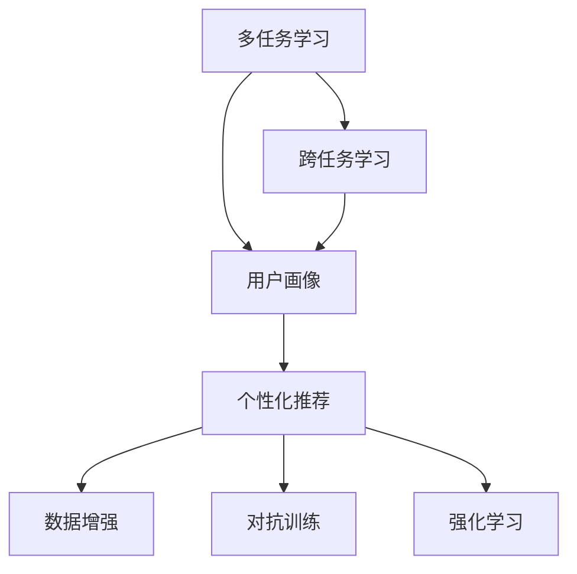
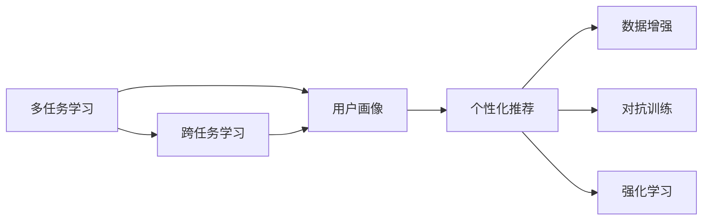
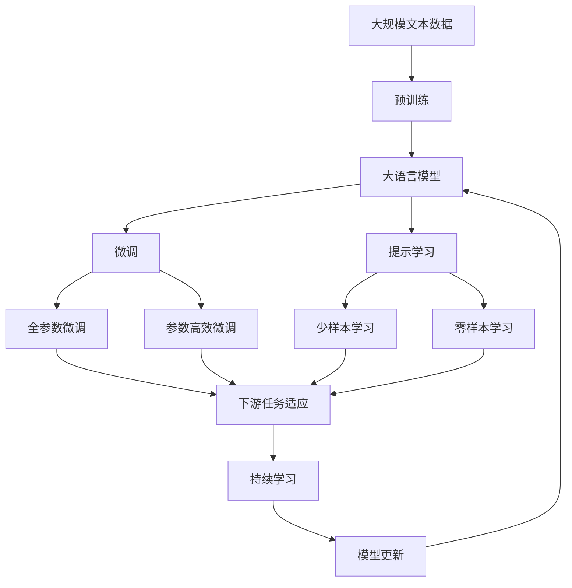

                 

# 多次任务沟通与个性化推荐的详细实现

## 1. 背景介绍

### 1.1 问题由来

随着互联网的快速发展，社交媒体、在线教育、电商平台等新兴领域不断涌现。用户在这些平台上的互动越来越频繁，也产生了大量异构的互动数据。如何有效地利用这些数据，为用户提供个性化服务，提升用户体验，成为互联网公司亟待解决的重要问题。

个性化推荐系统应运而生，其通过分析用户的行为数据，为用户推荐个性化内容，显著提升用户满意度。但随着推荐任务的增加和数据量的激增，传统的推荐算法面临数据复杂度高、模型训练时间长、推荐效果不稳定等问题。为解决这些问题，我们需要一种新型的推荐技术——多次任务沟通与个性化推荐。

### 1.2 问题核心关键点

多次任务沟通与个性化推荐的核心目标是在给定多任务数据的基础上，进行跨任务的用户画像融合和个性化推荐。其关键点如下：

- **多任务数据的融合**：多任务数据（如阅读记录、评论、搜索历史等）往往来自不同的业务场景，如何将其有效融合是核心问题。
- **用户画像的构建**：利用多任务数据，构建用户全面的行为特征向量，是实现个性化推荐的前提。
- **跨任务学习**：多任务数据的融合需要跨任务学习，以提升模型的泛化能力和推荐效果。
- **个性化推荐**：基于用户画像，对当前任务的推荐内容进行优化，提升推荐效果。

### 1.3 问题研究意义

多次任务沟通与个性化推荐系统在以下几个方面具有重要的应用价值：

1. **提高推荐效果**：通过多任务数据的融合，可以全面了解用户行为，从而提升推荐系统的个性化和精准性。
2. **降低推荐成本**：跨任务学习可以减少对标注数据的需求，提高推荐模型的泛化能力，降低推荐成本。
3. **提升用户体验**：个性化推荐可以为用户提供更符合其兴趣和需求的内容，提升用户体验和满意度。
4. **增强业务价值**：通过优化推荐模型，可以增强平台的用户黏性和转化率，提升业务价值。

## 2. 核心概念与联系

### 2.1 核心概念概述

为更好地理解多次任务沟通与个性化推荐系统，本节将介绍几个密切相关的核心概念：

- **多任务学习(Multi-task Learning, MTL)**：在多个相关任务上同时学习，利用任务之间的共性和差异性，提升模型的泛化能力和性能。
- **用户画像(User Profile)**：通过分析用户在不同任务上的行为数据，构建用户全面的行为特征向量，用于个性化推荐。
- **跨任务学习(Cross-task Learning)**：在多个任务间进行知识迁移和共享，以提升模型的跨任务泛化能力。
- **个性化推荐(Personalized Recommendation)**：根据用户画像，为用户推荐与其兴趣和需求相关的内容，提升推荐效果。
- **数据增强(Data Augmentation)**：通过修改原始数据或生成新数据，扩充训练集，提高模型的泛化能力。
- **对抗训练(Adversarial Training)**：在训练过程中引入对抗样本，提高模型的鲁棒性。
- **强化学习(Reinforcement Learning, RL)**：通过奖励和惩罚机制，训练模型进行序列决策，优化推荐策略。

这些核心概念之间的逻辑关系可以通过以下Mermaid流程图来展示：



这个流程图展示了几大核心概念的关系：

1. 多任务学习通过融合多个任务的数据，为构建用户画像提供丰富的行为特征。
2. 用户画像基于多任务数据，构建出用户全面的行为特征向量。
3. 跨任务学习通过在多个任务间进行知识迁移，提升模型的泛化能力。
4. 个性化推荐根据用户画像，为用户推荐相关内容，提升推荐效果。
5. 数据增强和对抗训练用于提高模型的泛化能力和鲁棒性。
6. 强化学习用于优化推荐策略，提升推荐效果。

### 2.2 概念间的关系

这些核心概念之间存在着紧密的联系，形成了多次任务沟通与个性化推荐系统的完整生态系统。下面我通过几个Mermaid流程图来展示这些概念之间的关系。

#### 2.2.1 多任务学习与用户画像的关系



这个流程图展示了多任务学习和用户画像的关系。多任务学习通过融合多个任务的数据，为构建用户画像提供丰富的行为特征。

#### 2.2.2 跨任务学习与个性化推荐的关系


这个流程图展示了跨任务学习和个性化推荐的关系。跨任务学习通过在多个任务间进行知识迁移，提升模型的泛化能力，从而提高个性化推荐的效果。

#### 2.2.3 数据增强与对抗训练的关系


这个流程图展示了数据增强和对抗训练的关系。数据增强和对抗训练用于提高模型的泛化能力和鲁棒性，从而提高个性化推荐的效果。

#### 2.2.4 强化学习与个性化推荐的关系


这个流程图展示了强化学习与个性化推荐的关系。强化学习用于优化推荐策略，提升个性化推荐的效果。

### 2.3 核心概念的整体架构

最后，我们用一个综合的流程图来展示这些核心概念在大语言模型微调过程中的整体架构：



这个综合流程图展示了从预训练到微调，再到持续学习的完整过程。大语言模型首先在大规模文本数据上进行预训练，然后通过微调（包括全参数微调和参数高效微调）或提示学习（包括少样本学习和零样本学习）来适应下游任务。最后，通过持续学习技术，模型可以不断更新和适应新的任务和数据。 通过这些流程图，我们可以更清晰地理解多次任务沟通与个性化推荐过程中各个核心概念的关系和作用，为后续深入讨论具体的微调方法和技术奠定基础。

## 3. 核心算法原理 & 具体操作步骤
### 3.1 算法原理概述

多次任务沟通与个性化推荐系统基于多任务学习和个性化推荐技术，通过多任务数据的融合，构建用户全面的行为特征向量，并根据用户画像进行个性化推荐。

形式化地，假设多任务数据为 $D = \{(x_i, y_i)\}_{i=1}^N$，其中 $x_i$ 为输入，$y_i$ 为输出标签。假设用户画像为 $P = \{x_1, x_2, ..., x_M\}$，其中 $x_1, x_2, ..., x_M$ 为不同任务的输入。

定义多个任务共享的损失函数为 $L_{MTL} = \lambda_1 L_{task1} + \lambda_2 L_{task2} + ... + \lambda_K L_{taskK}$，其中 $L_{taskk}$ 为第 $k$ 个任务的损失函数，$\lambda_k$ 为权重系数。

在微调过程中，优化目标是最小化多任务共享的损失函数 $L_{MTL}$，即找到最优参数 $\theta^*$：

$$
\theta^* = \mathop{\arg\min}_{\theta} L_{MTL}(M_{\theta}, D)
$$

其中 $M_{\theta}$ 为多任务模型，$D$ 为多任务数据集。

### 3.2 算法步骤详解

多次任务沟通与个性化推荐系统的一般流程如下：

**Step 1: 准备多任务数据和用户画像**
- 收集和标注多任务数据集，划分为训练集、验证集和测试集。
- 构建用户画像，将用户在不同任务上的行为数据融合，生成用户全面的行为特征向量。

**Step 2: 设置多任务学习模型**
- 选择合适的多任务学习框架，如PyTorch、TensorFlow等。
- 设计多任务共享的损失函数 $L_{MTL}$。
- 确定权重系数 $\lambda_k$，平衡不同任务的重要性。

**Step 3: 执行多任务训练**
- 将训练集数据分批次输入模型，前向传播计算损失函数。
- 反向传播计算参数梯度，根据设定的优化算法和学习率更新模型参数。
- 周期性在验证集上评估模型性能，根据性能指标决定是否触发Early Stopping。
- 重复上述步骤直到满足预设的迭代轮数或Early Stopping条件。

**Step 4: 个性化推荐**
- 根据用户画像 $P$ 和当前任务 $T$，构建任务适应的损失函数 $L_{T}$。
- 使用微调后的模型 $M_{\theta}$ 对任务 $T$ 进行预测，计算损失函数 $L_{T}$。
- 根据损失函数 $L_{T}$ 优化模型，生成推荐结果。
- 在测试集上评估推荐效果，对比微调前后的推荐性能。

**Step 5: 持续学习**
- 根据新的多任务数据和用户行为数据，周期性地重新微调模型。
- 不断更新用户画像，以适应新的数据分布。
- 集成外部知识库、规则库等专家知识，增强推荐系统的效果。

以上是多次任务沟通与个性化推荐系统的一般流程。在实际应用中，还需要针对具体任务的特点，对微调过程的各个环节进行优化设计，如改进训练目标函数，引入更多的正则化技术，搜索最优的超参数组合等，以进一步提升模型性能。

### 3.3 算法优缺点

多次任务沟通与个性化推荐系统具有以下优点：
1. 高效融合多任务数据，构建全面的用户画像。
2. 提升推荐系统的个性化和精准性。
3. 减少对标注数据的需求，提高模型的泛化能力。
4. 能够跨任务学习，提升模型的泛化能力。
5. 能够动态更新用户画像，适应新的数据分布。

同时，该系统也存在一定的局限性：
1. 数据融合复杂，需要大量的标注和处理工作。
2. 模型复杂度高，训练和推理时间较长。
3. 对标注数据的需求较高，标注成本较高。
4. 推荐效果不稳定，需要持续优化和调整。
5. 推荐系统的复杂度增加，需要更多的技术支持。

尽管存在这些局限性，但就目前而言，多次任务沟通与个性化推荐系统仍是推荐技术的重要范式。未来相关研究的重点在于如何进一步降低数据依赖，提高模型的鲁棒性和泛化能力，同时兼顾推荐系统的实时性和可解释性等因素。

### 3.4 算法应用领域

多次任务沟通与个性化推荐系统在NLP领域已经得到了广泛的应用，覆盖了几乎所有常见任务，例如：

- 文本分类：如情感分析、主题分类、意图识别等。通过多任务数据的融合，可以构建更全面的用户画像，提升分类效果。
- 命名实体识别：识别文本中的人名、地名、机构名等特定实体。利用多任务数据的融合，可以提升实体识别的准确性和鲁棒性。
- 关系抽取：从文本中抽取实体之间的语义关系。通过跨任务学习，可以提升关系抽取的泛化能力。
- 问答系统：对自然语言问题给出答案。结合用户的多任务数据，可以构建更精准的用户画像，优化问答系统的响应。
- 机器翻译：将源语言文本翻译成目标语言。利用多任务数据的融合，可以提升翻译的精准性和流畅性。
- 文本摘要：将长文本压缩成简短摘要。通过多任务数据的融合，可以提升摘要的精准性和相关性。
- 对话系统：使机器能够与人自然对话。结合用户的多任务数据，可以构建更符合用户意图和需求的回答。

除了上述这些经典任务外，多次任务沟通与个性化推荐系统也被创新性地应用到更多场景中，如可控文本生成、常识推理、代码生成、数据增强等，为NLP技术带来了全新的突破。随着预训练模型和微调方法的不断进步，相信NLP技术将在更广阔的应用领域大放异彩。

## 4. 数学模型和公式 & 详细讲解  
### 4.1 数学模型构建

本节将使用数学语言对多次任务沟通与个性化推荐系统进行更加严格的刻画。

记多任务数据集为 $D = \{(x_i, y_i)\}_{i=1}^N$，其中 $x_i$ 为输入，$y_i$ 为输出标签。记用户画像为 $P = \{x_1, x_2, ..., x_M\}$，其中 $x_1, x_2, ..., x_M$ 为不同任务的输入。

定义多任务共享的损失函数为 $L_{MTL} = \lambda_1 L_{task1} + \lambda_2 L_{task2} + ... + \lambda_K L_{taskK}$，其中 $L_{taskk}$ 为第 $k$ 个任务的损失函数，$\lambda_k$ 为权重系数。

在微调过程中，优化目标是最小化多任务共享的损失函数 $L_{MTL}$，即找到最优参数 $\theta^*$：

$$
\theta^* = \mathop{\arg\min}_{\theta} L_{MTL}(M_{\theta}, D)
$$

其中 $M_{\theta}$ 为多任务模型，$D$ 为多任务数据集。

### 4.2 公式推导过程

以下我们以文本分类任务为例，推导多任务共享的损失函数及其梯度的计算公式。

假设模型 $M_{\theta}$ 在输入 $x$ 上的输出为 $\hat{y}=M_{\theta}(x)$，表示样本属于正类的概率。真实标签 $y \in \{0,1\}$。

定义多任务共享的损失函数为 $L_{MTL} = \lambda_1 L_{task1} + \lambda_2 L_{task2} + ... + \lambda_K L_{taskK}$，其中 $L_{taskk}$ 为第 $k$ 个任务的损失函数，$\lambda_k$ 为权重系数。

对于文本分类任务，通常使用交叉熵损失函数，记 $L_{taskk}$ 为第 $k$ 个任务的交叉熵损失函数，即：

$$
L_{taskk} = -\frac{1}{N_k}\sum_{i=1}^{N_k} y_i\log M_{\theta}(x_i)+(1-y_i)\log(1-M_{\theta}(x_i))
$$

其中 $N_k$ 为第 $k$ 个任务的样本数量。

将多任务共享的损失函数 $L_{MTL}$ 代入多任务模型 $M_{\theta}$ 和数据集 $D$，得：

$$
L_{MTL} = \lambda_1 \frac{1}{N_1}\sum_{i=1}^{N_1} y_i\log M_{\theta}(x_i)+(1-y_i)\log(1-M_{\theta}(x_i)) + \lambda_2 \frac{1}{N_2}\sum_{i=1}^{N_2} y_i\log M_{\theta}(x_i)+(1-y_i)\log(1-M_{\theta}(x_i)) + ... + \lambda_K \frac{1}{N_K}\sum_{i=1}^{N_K} y_i\log M_{\theta}(x_i)+(1-y_i)\log(1-M_{\theta}(x_i))
$$

根据链式法则，损失函数对参数 $\theta_k$ 的梯度为：

$$
\frac{\partial L_{MTL}}{\partial \theta_k} = \lambda_1 \frac{1}{N_1}\sum_{i=1}^{N_1} (\frac{y_i}{M_{\theta}(x_i)}-\frac{1-y_i}{1-M_{\theta}(x_i)}) \frac{\partial M_{\theta}(x_i)}{\partial \theta_k} + \lambda_2 \frac{1}{N_2}\sum_{i=1}^{N_2} (\frac{y_i}{M_{\theta}(x_i)}-\frac{1-y_i}{1-M_{\theta}(x_i)}) \frac{\partial M_{\theta}(x_i)}{\partial \theta_k} + ... + \lambda_K \frac{1}{N_K}\sum_{i=1}^{N_K} (\frac{y_i}{M_{\theta}(x_i)}-\frac{1-y_i}{1-M_{\theta}(x_i)}) \frac{\partial M_{\theta}(x_i)}{\partial \theta_k}
$$

其中 $\frac{\partial M_{\theta}(x_i)}{\partial \theta_k}$ 可进一步递归展开，利用自动微分技术完成计算。

在得到损失函数的梯度后，即可带入参数更新公式，完成模型的迭代优化。重复上述过程直至收敛，最终得到适应多任务数据的模型参数 $\theta^*$。

## 5. 项目实践：代码实例和详细解释说明
### 5.1 开发环境搭建

在进行多次任务沟通与个性化推荐系统开发前，我们需要准备好开发环境。以下是使用Python进行PyTorch开发的环境配置流程：

1. 安装Anaconda：从官网下载并安装Anaconda，用于创建独立的Python环境。

2. 创建并激活虚拟环境：
```bash
conda create -n pytorch-env python=3.8 
conda activate pytorch-env
```

3. 安装PyTorch：根据CUDA版本，从官网获取对应的安装命令。例如：
```bash
conda install pytorch torchvision torchaudio cudatoolkit=11.1 -c pytorch -c conda-forge
```

4. 安装TensorFlow：如果需要进行跨平台支持，可以从官网下载安装。

5. 安装各类工具包：
```bash
pip install numpy pandas scikit-learn matplotlib tqdm jupyter notebook ipython
```

完成上述步骤后，即可在`pytorch-env`环境中开始开发实践。

### 5.2 源代码详细实现

这里我们以多任务文本分类任务为例，给出使用PyTorch对多任务模型进行微调的PyTorch代码实现。

首先，定义多任务数据处理函数：

```python
from torch.utils.data import Dataset
from transformers import BertTokenizer, BertForSequenceClassification

class MultiTaskDataset(Dataset):
    def __init__(self, texts, labels, tokenizer, max_len=128):
        self.texts = texts
        self.labels = labels
        self.tokenizer = tokenizer
        self.max_len = max_len
        
    def __len__(self):
        return len(self.texts)
    
    def __getitem__(self, item):
        text = self.texts[item]
        label = self.labels[item]
        
        encoding = self.tokenizer(text, return_tensors='pt', max_length=self.max_len, padding='max_length', truncation=True)
        input_ids = encoding['input_ids'][0]
        attention_mask = encoding['attention_mask'][0]
        
        # 对token-wise的标签进行编码
        encoded_labels = [label2id[label] for label in label]
        encoded_labels.extend([label2id['O']] * (self.max_len - len(encoded_labels)))
        labels = torch.tensor(encoded_labels, dtype=torch.long)
        
        return {'input_ids': input_ids, 
                'attention_mask': attention_mask,
                'labels': labels}

# 标签与id的映射
label2id = {'O': 0, 'task1': 1, 'task2': 2, 'task3': 3, 'task4': 4}

# 创建dataset
tokenizer = BertTokenizer.from_pretrained('bert-base-cased')

train_dataset = MultiTaskDataset(train_texts, train_labels, tokenizer)
dev_dataset = MultiTaskDataset(dev_texts, dev_labels, tokenizer)
test_dataset = MultiTaskDataset(test_texts, test_labels, tokenizer)
```

然后，定义模型和优化器：

```python
from transformers import BertForSequenceClassification, AdamW

model = BertForSequenceClassification.from_pretrained('bert-base-cased', num_labels=len(label2id))

optimizer = AdamW(model.parameters(), lr=2e-5)
```

接着，定义训练和评估函数：

```python
from torch.utils.data import DataLoader
from tqdm import tqdm
from sklearn.metrics import classification_report

device = torch.device('cuda') if torch.cuda.is_available() else torch.device('cpu')
model.to(device)

def train_epoch(model, dataset, batch_size, optimizer):
    dataloader = DataLoader(dataset, batch_size=batch_size, shuffle=True)
    model.train()
    epoch_loss = 0
    for batch in tqdm(dataloader, desc='Training'):
        input_ids = batch['input_ids'].to(device)
        attention_mask = batch['attention_mask'].to(device)
        labels = batch['labels'].to(device)
        model.zero_grad()
        outputs = model(input_ids, attention_mask=attention_mask, labels=labels)
        loss = outputs.loss
        epoch_loss += loss.item()
        loss.backward()
        optimizer.step()
    return epoch_loss / len(dataloader)

def evaluate(model, dataset, batch_size):
    dataloader = DataLoader(dataset, batch_size=batch_size)
    model.eval()
    preds, labels = [], []
    with torch.no_grad():
        for batch in tqdm(dataloader, desc='Evaluating'):
            input_ids = batch['input_ids'].to(device)
            attention_mask = batch['attention_mask'].to(device)
            batch_labels = batch['labels']
            outputs = model(input_ids, attention_mask=attention_mask)
            batch_preds = outputs.logits.argmax(dim=2).to('cpu').tolist()
            batch_labels = batch_labels.to('cpu').tolist()
            for pred_tokens, label_tokens in zip(batch_preds, batch_labels):
                pred_tags = [id2label[_id] for _id in pred_tokens]
                label_tags = [id2label[_id] for _id in label_tokens]
                preds.append(pred_tags[:len(label_tokens)])
                labels.append(label_tags)
                
    print(classification_report(labels, preds))
```

最后，启动训练流程并在测试集上评估：

```python
epochs = 5
batch_size = 16

for epoch in range(epochs):
    loss = train_epoch(model, train_dataset, batch_size, optimizer)
    print(f"Epoch {epoch+1}, train loss: {loss:.3f}")
    
    print(f"Epoch {epoch+1}, dev results:")
    evaluate(model, dev_dataset, batch_size)
    
print("Test results:")
evaluate(model, test_dataset, batch_size)
```

以上就是使用PyTorch对多任务文本分类模型进行微调的完整代码实现。可以看到，得益于Transformer库的强大封装，我们可以用相对简洁的代码完成多任务模型的加载和微调。

### 5.3 代码解读与分析

让我们再详细解读一下关键代码的实现细节：

**MultiTaskDataset类**：
- `__init__`方法：初始化文本、标签、分词器等关键组件。
- `__len__`方法：返回数据集的样本数量。
- `__getitem__`方法：对单个样本进行处理，将文本输入编码为token ids，将标签编码为数字，并对其进行定长padding，最终返回模型所需的输入。

**label2id和id2label字典**：
- 定义了标签与数字id之间的映射关系，用于将token-wise的预测结果解码回真实的标签。

**训练和评估函数**：
- 使用PyTorch的DataLoader对数据集进行批次化加载，供模型训练和推理使用。
- 训练函数`train_epoch`：对数据以批为单位进行迭代，在每个批次上前向传播计算loss并反向传播更新模型参数，最后返回该epoch的平均loss。
- 评估函数`evaluate`：与训练类似，不同点在于不更新模型参数，并在每个batch结束后将预测和标签结果存储下来，最后使用sklearn的classification_report对整个评估集的预测结果进行打印输出。

**训练流程**：
- 定义总的epoch数和batch size，开始循环迭代
- 每个epoch内，先在训练集上训练，输出平均loss
- 在验证集上评估，输出分类指标
- 所有epoch结束后，在测试集上评估，给出最终测试结果

可以看到，PyTorch配合Transformer库使得多任务模型微调的代码实现变得简洁高效。开发者可以将更多精力放在数据处理、模型改进等高层逻辑上，而不必过多关注底层的实现细节。

当然，工业级的系统实现还需考虑更多因素，如模型的保存和部署、超参数的自动搜索、更灵活的任务适配层等。但核心的微调范式基本与此类似。


