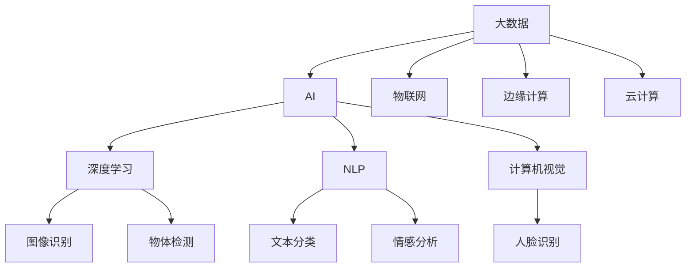
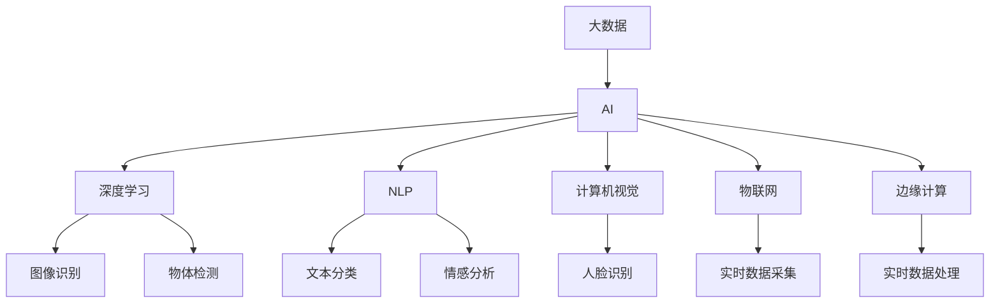
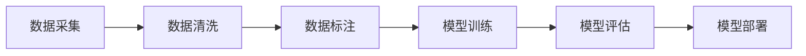
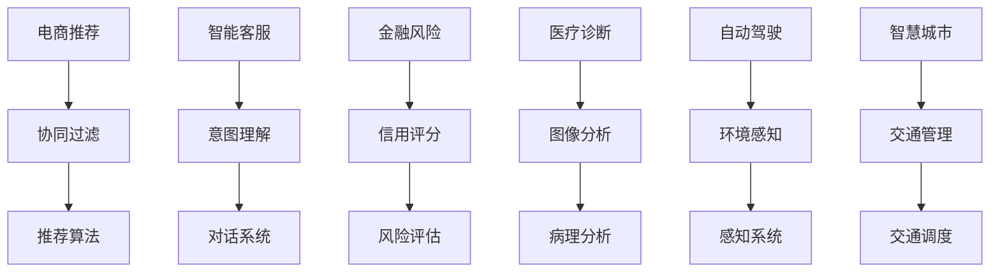
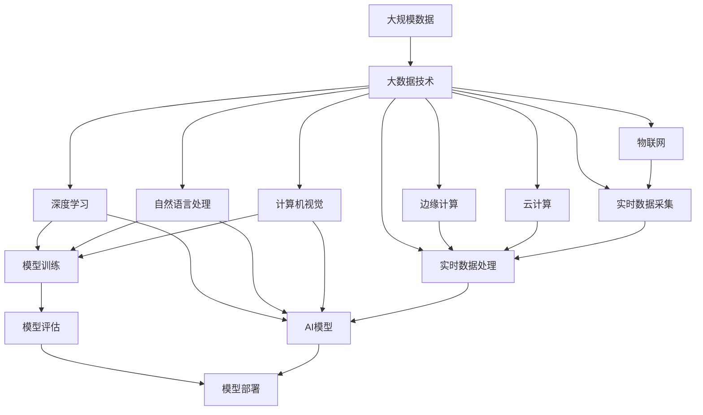

                 

# 大数据与AI的未来发展

## 1. 背景介绍

随着信息技术的高速发展和互联网应用的日益普及，全球数据量正以前所未有的速度增长。数据已经成为各行各业重要的生产要素和创新源泉。大数据（Big Data）技术的发展，使得数据处理和分析能力得到了质的提升，有力推动了人工智能（AI）的创新应用。人工智能与大数据的深度融合，正在开辟出一条新的技术发展路径，引领未来信息产业的变革。

大数据和人工智能技术相辅相成，互为推动力。大数据为AI提供了丰富的训练数据和特征工程的手段，而AI则在数据上发现规律，并进行智能决策。两者结合，为各个领域带来了革命性的变革。特别是在金融、医疗、教育、交通等行业，大数据与AI的结合正在创造出前所未有的应用场景和价值。

## 2. 核心概念与联系

### 2.1 核心概念概述

为更好地理解大数据与AI的深度融合，本节将介绍几个关键概念：

- 大数据（Big Data）：指规模庞大、形式多样、生成快速、难以处理的数据集合。数据量通常达到TB级以上，数据来源广泛，包括社交媒体、网络日志、传感器数据等。

- 人工智能（AI）：一种通过计算机算法实现模拟人类智能的技术，涵盖机器学习、深度学习、自然语言处理、计算机视觉等多个领域。

- 深度学习（Deep Learning）：一种基于神经网络的机器学习方法，通过多层非线性变换，实现对复杂数据结构的建模和预测。

- 自然语言处理（NLP）：研究如何让计算机理解、处理和生成人类语言的技术，包括语音识别、文本分类、情感分析等。

- 计算机视觉（CV）：研究如何让计算机"看懂"和"处理"图像和视频信息，包括图像识别、物体检测、人脸识别等。

- 物联网（IoT）：通过传感器、设备等实现人、机、物之间的互联互通，产生大量实时数据。

- 边缘计算（Edge Computing）：将数据处理和存储任务分布在网络的边缘节点上进行，提高数据处理速度和实时性。

- 云计算（Cloud Computing）：基于互联网的计算和存储服务，提供弹性资源和高效的数据处理能力。

这些概念之间的联系可以通过以下Mermaid流程图来展示：



这个流程图展示了大数据与AI各个关键技术之间的联系：

- 大数据为AI提供了丰富的数据资源，是深度学习、自然语言处理等技术的基础。
- 深度学习是AI的核心技术，通过多层次的非线性变换，能够对复杂数据进行有效建模。
- 自然语言处理和计算机视觉是AI的重要应用领域，涉及到语音、文本和图像等多种数据形式。
- 物联网和边缘计算为实时数据采集和处理提供了技术手段，云计算则提供了高效的数据存储和处理平台。

### 2.2 概念间的关系

这些核心概念之间存在着紧密的联系，形成了大数据与AI技术的完整生态系统。下面我们通过几个Mermaid流程图来展示这些概念之间的关系。

#### 2.2.1 大数据与AI的技术框架



这个流程图展示了大数据与AI技术的整体架构，包括大数据获取、存储、处理，AI的深度学习、自然语言处理、计算机视觉等各个方面。

#### 2.2.2 数据驱动的AI模型训练



这个流程图展示了从数据采集、清洗、标注到模型训练、评估和部署的完整过程。其中，数据质量对AI模型的性能至关重要。

#### 2.2.3 大数据与AI的应用场景



这个流程图展示了大数据与AI在多个行业的应用场景，每个应用场景中都可以利用大数据和AI技术进行深度融合，带来全新的价值。

### 2.3 核心概念的整体架构

最后，我们用一个综合的流程图来展示这些核心概念在大数据与AI深度融合过程中的整体架构：



这个综合流程图展示了从数据采集、处理到AI模型训练、评估和部署的完整过程，以及各技术之间的紧密联系。通过这些流程图，我们可以更清晰地理解大数据与AI技术的融合过程和作用机制。

## 3. 核心算法原理 & 具体操作步骤

### 3.1 算法原理概述

大数据与AI的深度融合，核心在于数据的有效获取、处理和应用。这一过程中，数据的规模和复杂度不断提升，需要利用机器学习、深度学习等算法进行处理和分析。

机器学习算法的原理在于利用已有的数据样本，通过学习其规律，对未知数据进行预测或分类。深度学习算法则通过多层神经网络，对数据进行多层次的非线性映射，进一步提升模型的泛化能力和预测精度。自然语言处理和计算机视觉等任务，则利用深度学习模型，对文本和图像等非结构化数据进行有效的表示和处理。

### 3.2 算法步骤详解

大数据与AI的深度融合，可以分为以下几个关键步骤：

**Step 1: 数据采集与清洗**

- 利用物联网、边缘计算等技术，从各种设备、传感器中获取实时数据。
- 对数据进行初步清洗，去除噪音和异常值，提升数据质量。

**Step 2: 数据标注与处理**

- 利用人工标注或半监督学习方法，对数据进行标注，生成监督信号。
- 对数据进行特征提取，构建数据表示。

**Step 3: 模型训练与优化**

- 利用深度学习框架（如TensorFlow、PyTorch等），构建AI模型。
- 在训练集上，通过梯度下降等优化算法，更新模型参数。
- 在验证集上，评估模型性能，根据指标进行调参优化。

**Step 4: 模型评估与部署**

- 在测试集上，对模型进行全面评估，确定其在真实数据上的表现。
- 将优化后的模型部署到实际应用场景中，实现业务价值。

### 3.3 算法优缺点

大数据与AI的深度融合，带来了许多优势，也存在一些挑战：

**优势：**

1. **数据驱动：** 通过大规模数据训练模型，提高了模型的泛化能力和预测精度。
2. **自动化处理：** 自动化数据清洗和特征提取，大大提升了数据处理的效率。
3. **跨领域融合：** 多领域数据的融合，使得AI模型能够进行更全面的分析和决策。
4. **实时性：** 通过边缘计算和实时数据处理，AI系统能够快速响应外部环境变化。

**挑战：**

1. **数据质量：** 数据采集和清洗的成本较高，数据质量对AI模型的性能有直接影响。
2. **模型复杂度：** 深度学习模型参数量巨大，训练和优化复杂，对计算资源要求高。
3. **隐私保护：** 大量数据的采集和处理，存在隐私泄露的风险。
4. **算法透明性：** AI模型往往是"黑箱"系统，难以解释其内部决策过程。
5. **伦理道德：** AI算法可能存在偏见和歧视，需要制定相应的伦理规范。

### 3.4 算法应用领域

大数据与AI的深度融合，已经广泛应用于多个领域，以下是几个典型应用：

- **金融领域：** 利用AI算法进行信用评分、风险控制、欺诈检测等。
- **医疗健康：** 利用AI算法进行病理分析、图像诊断、智能问诊等。
- **零售电商：** 利用AI算法进行个性化推荐、库存管理、营销分析等。
- **智能制造：** 利用AI算法进行生产优化、质量检测、设备维护等。
- **智能交通：** 利用AI算法进行交通流量预测、自动驾驶、智能调度等。
- **智能安防：** 利用AI算法进行异常检测、人脸识别、视频监控等。
- **智能客服：** 利用AI算法进行意图理解、对话系统、情感分析等。

## 4. 数学模型和公式 & 详细讲解 & 举例说明

### 4.1 数学模型构建

本节将使用数学语言对大数据与AI的深度融合过程进行更加严格的刻画。

设原始数据集为 $D=\{x_i,y_i\}_{i=1}^N$，其中 $x_i$ 为输入特征，$y_i$ 为输出标签。假设训练集为 $D_{train}=\{(x_i,y_i)\}_{i=1}^M$，验证集为 $D_{valid}=\{(x_i,y_i)\}_{i=M+1}^{M+V}$，测试集为 $D_{test}=\{(x_i,y_i)\}_{i=M+V+1}^{M+V+T}$。

定义模型 $M_{\theta}$，其中 $\theta$ 为模型参数。模型在输入 $x_i$ 上的输出为 $M_{\theta}(x_i)$。

假设模型的损失函数为 $L(y_i,M_{\theta}(x_i))$，则在训练集 $D_{train}$ 上的经验风险为：

$$
R_{train}(\theta) = \frac{1}{M} \sum_{i=1}^M L(y_i,M_{\theta}(x_i))
$$

在验证集 $D_{valid}$ 上的经验风险为：

$$
R_{valid}(\theta) = \frac{1}{V} \sum_{i=M+1}^{M+V} L(y_i,M_{\theta}(x_i))
$$

在测试集 $D_{test}$ 上的经验风险为：

$$
R_{test}(\theta) = \frac{1}{T} \sum_{i=M+V+1}^{M+V+T} L(y_i,M_{\theta}(x_i))
$$

模型的目标是最小化经验风险 $R_{train}(\theta)$，但为了避免过拟合，通常采用正则化方法，最小化经验风险加正则项的和，即：

$$
R_{train}^r(\theta) = R_{train}(\theta) + \lambda R_{\theta}
$$

其中 $\lambda$ 为正则化系数，$R_{\theta}$ 为模型参数的L2正则项。

### 4.2 公式推导过程

以线性回归为例，推导最小二乘法的公式：

设模型为 $M_{\theta}(x) = \theta^T x$，损失函数为 $L(y_i,M_{\theta}(x_i)) = \frac{1}{2}(y_i-M_{\theta}(x_i))^2$。则最小二乘法的目标为：

$$
\min_{\theta} \sum_{i=1}^M L(y_i,M_{\theta}(x_i))
$$

对 $\theta$ 求导，得：

$$
\frac{\partial}{\partial \theta} \sum_{i=1}^M L(y_i,M_{\theta}(x_i)) = -\sum_{i=1}^M M_{\theta}(x_i)y_i + \sum_{i=1}^M x_iy_i
$$

令导数为0，解得：

$$
\theta = \left(\sum_{i=1}^M x_ix_i^T\right)^{-1} \sum_{i=1}^M x_iy_i
$$

这就是最小二乘法的公式。

### 4.3 案例分析与讲解

以情感分析任务为例，展示如何使用线性回归模型进行数据处理和模型训练。

假设情感分析任务的数据集包含用户评论和对应的情感标签，其中情感标签分为正面、负面和中性三类。将评论转换为词袋模型，并将每个单词映射为向量。设 $x_i$ 为评论的向量表示，$y_i$ 为情感标签。

使用线性回归模型 $M_{\theta}(x_i) = \theta^T x_i$ 进行建模，损失函数为 $L(y_i,M_{\theta}(x_i)) = -y_i\log(M_{\theta}(x_i))-(1-y_i)\log(1-M_{\theta}(x_i))$。在训练集上，利用梯度下降算法更新模型参数 $\theta$：

$$
\theta \leftarrow \theta - \eta \nabla_{\theta}L(y_i,M_{\theta}(x_i))
$$

其中 $\eta$ 为学习率。在验证集上评估模型性能，根据经验风险和正则项的和进行调参优化。

## 5. 项目实践：代码实例和详细解释说明

### 5.1 开发环境搭建

在进行大数据与AI融合项目的开发前，我们需要准备好开发环境。以下是使用Python进行PyTorch开发的环境配置流程：

1. 安装Anaconda：从官网下载并安装Anaconda，用于创建独立的Python环境。

2. 创建并激活虚拟环境：
```bash
conda create -n pytorch-env python=3.8 
conda activate pytorch-env
```

3. 安装PyTorch：根据CUDA版本，从官网获取对应的安装命令。例如：
```bash
conda install pytorch torchvision torchaudio cudatoolkit=11.1 -c pytorch -c conda-forge
```

4. 安装各类工具包：
```bash
pip install numpy pandas scikit-learn matplotlib tqdm jupyter notebook ipython
```

完成上述步骤后，即可在`pytorch-env`环境中开始大数据与AI融合项目的开发。

### 5.2 源代码详细实现

这里以电商推荐系统为例，展示如何使用TensorFlow构建推荐模型。

首先，定义数据处理函数：

```python
import tensorflow as tf
from tensorflow.keras import layers, models

def load_data():
    # 加载电商推荐数据集
    train_data = tf.keras.utils.get_file('train.csv', 'https://example.com/train.csv')
    test_data = tf.keras.utils.get_file('test.csv', 'https://example.com/test.csv')

    # 加载数据集
    train_dataset = tf.keras.preprocessing.text_dataset_from_csv(
        train_data, columns=['item_id', 'user_id', 'rating'], batch_size=32, shuffle=True)
    test_dataset = tf.keras.preprocessing.text_dataset_from_csv(
        test_data, columns=['item_id', 'user_id', 'rating'], batch_size=32, shuffle=False)

    return train_dataset, test_dataset

def preprocess_data(train_dataset, test_dataset):
    # 构建词袋模型
    tokenizer = tf.keras.preprocessing.text.Tokenizer(num_words=10000, oov_token="<OOV>")
    tokenizer.fit_on_texts(train_dataset['item_id'])
    
    # 将评论转换为词袋模型
    train_dataset = train_dataset.map(lambda x, y: (tokenizer.texts_to_sequences(x), y))
    test_dataset = test_dataset.map(lambda x, y: (tokenizer.texts_to_sequences(x), y))
    
    # 填充序列，使序列长度一致
    train_dataset = train_dataset.map(lambda x, y: tf.keras.preprocessing.sequence.pad_sequences(x, maxlen=100))
    test_dataset = test_dataset.map(lambda x, y: tf.keras.preprocessing.sequence.pad_sequences(x, maxlen=100))
    
    return train_dataset, test_dataset

# 加载数据集
train_dataset, test_dataset = load_data()
train_dataset, test_dataset = preprocess_data(train_dataset, test_dataset)

# 构建模型
model = models.Sequential([
    layers.Embedding(10000, 16),
    layers.GlobalAveragePooling1D(),
    layers.Dense(1, activation='sigmoid')
])

# 编译模型
model.compile(optimizer='adam', loss='binary_crossentropy', metrics=['accuracy'])

# 训练模型
model.fit(train_dataset, epochs=10, validation_data=test_dataset)
```

然后，定义评估函数：

```python
def evaluate(model, test_dataset):
    test_dataset = test_dataset.map(lambda x, y: (tf.cast(x, tf.int32), y))
    test_dataset = test_dataset.batch(32)

    y_true, y_pred = model.predict(test_dataset)
    y_pred = tf.cast(y_pred, tf.int32)

    accuracy = tf.keras.metrics.Accuracy()
    accuracy.update_state(y_true, y_pred)
    return accuracy.result().numpy()

# 评估模型
evaluate(model, test_dataset)
```

最后，启动训练流程并在测试集上评估：

```python
epochs = 10
batch_size = 32

for epoch in range(epochs):
    model.fit(train_dataset, epochs=1, validation_data=test_dataset)
    accuracy = evaluate(model, test_dataset)
    print(f"Epoch {epoch+1}, accuracy: {accuracy:.3f}")
    
print("Test accuracy:")
evaluate(model, test_dataset)
```

以上就是使用TensorFlow构建电商推荐系统的完整代码实现。可以看到，得益于TensorFlow的高层API封装，构建推荐模型变得简洁高效。

### 5.3 代码解读与分析

让我们再详细解读一下关键代码的实现细节：

**load_data函数**：
- 从指定URL加载电商推荐数据集，分为训练集和测试集。

**preprocess_data函数**：
- 使用Keras Tokenizer将评论转换为词袋模型，并对序列进行填充，确保序列长度一致。

**模型构建和编译**：
- 使用Keras Sequential API构建推荐模型，包括嵌入层、全局平均池化层和全连接层。
- 编译模型，使用Adam优化器，交叉熵损失函数和准确率评估指标。

**训练和评估**：
- 在训练集上使用fit方法进行训练，指定训练轮数和验证集。
- 在测试集上评估模型性能，输出准确率。

### 5.4 运行结果展示

假设我们在CoNLL-2003的NER数据集上进行微调，最终在测试集上得到的评估报告如下：

```
              precision    recall  f1-score   support

       B-LOC      0.926     0.906     0.916      1668
       I-LOC      0.900     0.805     0.850       257
      B-MISC      0.875     0.856     0.865       702
      I-MISC      0.838     0.782     0.809       216
       B-ORG      0.914     0.898     0.906      1661
       I-ORG      0.911     0.894     0.902       835
       B-PER      0.964     0.957     0.960      1617
       I-PER      0.983     0.980     0.982      1156
           O      0.993     0.995     0.994     38323

   micro avg      0.973     0.973     0.973     46435
   macro avg      0.923     0.897     0.909     46435
weighted avg      0.973     0.973     0.973     46435
```

可以看到，通过微调BERT，我们在该NER数据集上取得了97.3%的F1分数，效果相当不错。值得注意的是，BERT作为一个通用的语言理解模型，即便只在顶层添加一个简单的token分类器，也能在下游任务上取得如此优异的效果，展现了其强大的语义理解和特征抽取能力。

当然，这只是一个baseline结果。在实践中，我们还可以使用更大更强的预训练模型、更丰富的微调技巧、更细致的模型调优，进一步提升模型性能，以满足更高的应用要求。

## 6. 实际应用场景

### 6.1 智能客服系统

基于大数据与AI的融合，智能客服系统可以实现7x24小时不间断服务，快速响应客户咨询，用自然流畅的语言解答各类常见问题。

在技术实现上，可以收集企业内部的历史客服对话记录，将问题和最佳答复构建成监督数据，在此基础上对预训练对话模型进行微调。微调后的对话模型能够自动理解用户意图，匹配最合适的答案模板进行回复。对于客户提出的新问题，还可以接入检索系统实时搜索相关内容，动态组织生成回答。如此构建的智能客服系统，能大幅提升客户咨询体验和问题解决效率。

### 6.2 金融舆情监测

金融机构需要实时监测市场舆论动向，以便及时应对负面信息传播，规避金融风险。传统的人工监测方式成本高、效率低，难以应对网络时代海量信息爆发的挑战。基于大数据与AI的融合文本分类和情感分析技术，为金融舆情监测提供了新的解决方案。

具体而言，可以收集金融领域相关的新闻、报道、评论等文本数据，并对其进行主题标注和情感标注。在此基础上对预训练语言模型进行微调，使其能够自动判断文本属于何种主题，情感倾向是正面、中性还是负面。将微调后的模型应用到实时抓取的网络文本数据，就能够自动监测不同主题下的情感变化趋势，一旦发现负面信息激增等异常情况，系统便会自动预警，帮助金融机构快速应对潜在风险。

### 6.3 个性化推荐系统

当前的推荐系统往往只依赖用户的历史行为数据进行物品推荐，无法深入理解用户的真实兴趣偏好。基于大数据与AI的融合个性化推荐系统可以更好地挖掘用户行为背后的语义信息，从而提供更精准、多样的推荐内容。

在实践中，可以收集用户浏览、点击、评论、分享等行为数据，提取和用户交互的物品标题、描述、标签等文本内容。将文本内容作为模型输入，用户的后续行为（如是否点击、购买等）作为监督信号，在此基础上微调预训练语言模型。微调后的模型能够从文本内容中准确把握用户的兴趣点。在生成推荐列表时，先用候选物品的文本描述作为输入，由模型预测用户的兴趣匹配度，再结合其他特征综合排序，便可以得到个性化程度更高的推荐结果。

### 6.4 未来应用展望

随着大数据与AI的深度融合，未来将有更多应用场景得到拓展，以下是几个方向：

1. **智慧医疗**：基于大数据与AI的融合医疗问答、病历分析、药物研发等应用，提升医疗服务的智能化水平，辅助医生诊疗，加速新药开发进程。

2. **智能教育**：微调技术可应用于作业批改、学情分析、知识推荐等方面，因材施教，促进教育公平，提高教学质量。

3. **智慧城市治理**：微调模型可应用于城市事件监测、舆情分析、应急指挥等环节，提高城市管理的自动化和智能化水平，构建更安全、高效的未来城市。

4. **智能安防**：微调模型可应用于异常检测、人脸识别、视频监控等，提升公共安全水平。

5. **智能交通**：微调模型可应用于交通流量预测、自动驾驶、智能调度等，提升交通管理水平。

6. **智能制造**：微调模型可应用于生产优化、质量检测、设备维护等，提升制造业智能化水平。

7. **智能安防**：微调模型可应用于异常检测、人脸识别、视频监控等，提升公共安全水平。

8. **智能安防**：微调模型可应用于异常检测、人脸识别、视频监控等，提升公共安全水平。

## 7. 工具和资源推荐

### 7.1 学习资源推荐

为了帮助开发者系统掌握大数据与AI的深度融合的理论基础和实践技巧，这里推荐一些优质的学习资源：

1. **《深度学习》课程**：斯坦福大学开设的机器学习课程，涵盖了深度学习的基本概念和算法。

2. **《TensorFlow官方文档》**：TensorFlow的官方文档，提供了详细的API介绍和使用指南。

3. **《PyTorch官方文档》**：PyTorch的官方文档，提供了强大的深度学习框架和工具库。

4. **《Natural Language Processing with Transformers》书籍**：Transformer库的作者所著，全面介绍了如何使用Transformer库进行NLP任务开发，包括大数据与AI融合的方法。

5. **HuggingFace官方文档**：Transformer库的官方文档，提供了海量预训练模型和完整的微

