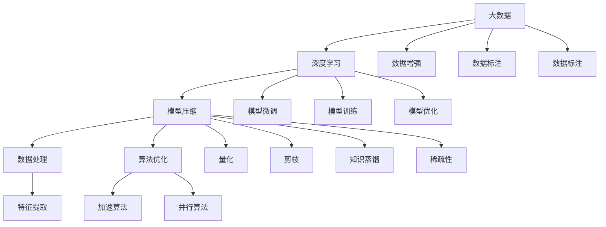
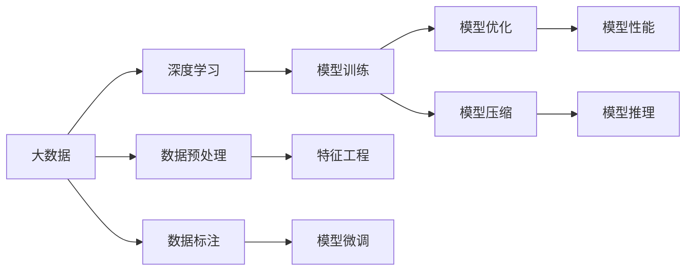
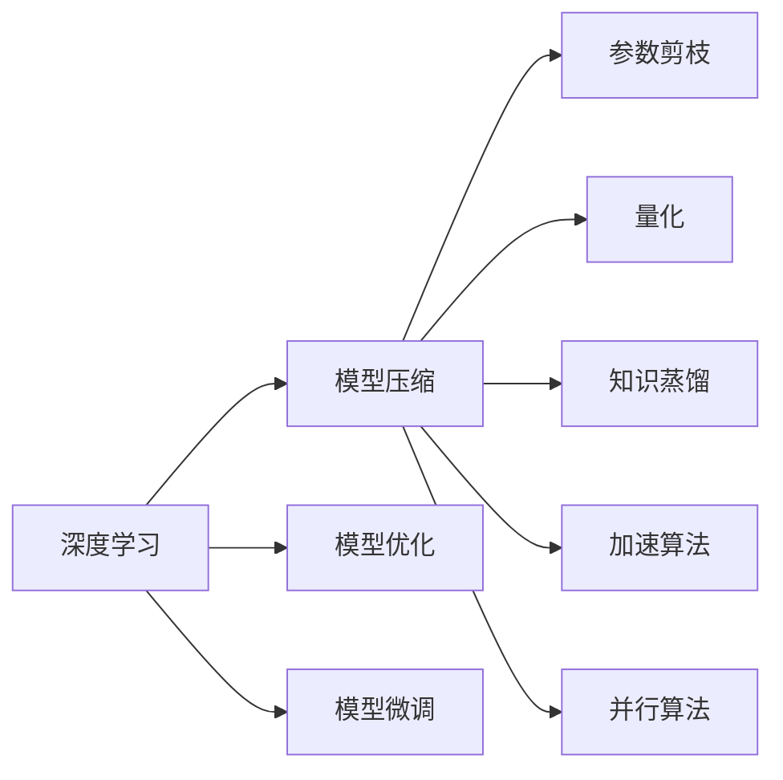
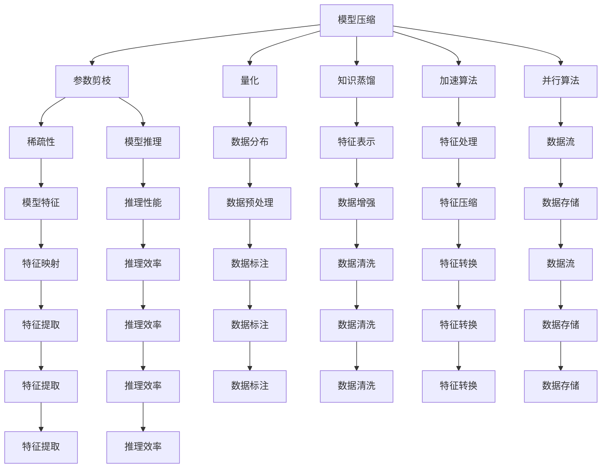

                 

# 大数据与模型压缩：从数据到定理的旅程

> 关键词：大数据,模型压缩,数据处理,模型优化,算法原理,代码实例

## 1. 背景介绍

### 1.1 问题由来

在大数据时代，数据量和数据种类的爆炸式增长，为各行各业带来了前所未有的机遇与挑战。如何高效地存储、处理和分析这些海量数据，成为了一个迫切需要解决的问题。特别是对于深度学习等数据密集型任务，对计算资源和存储资源的需求更是成倍增长，这进一步加剧了数据处理的难度。

为了应对这一挑战，研究人员提出了模型压缩技术，通过减少模型参数量和计算量，在保证模型性能的前提下，大幅降低计算和存储成本，提高模型部署效率。模型压缩不仅对于数据密集型任务至关重要，对于边缘计算、移动设备等资源受限环境同样具有重要意义。

### 1.2 问题核心关键点

模型压缩技术的主要目标是在不牺牲模型性能的前提下，减少模型参数和计算量，使其在硬件资源受限的环境下也能高效运行。常见的模型压缩方法包括参数剪枝、量化、知识蒸馏等，具体实施时需考虑不同应用场景和模型结构的特性。

为了达到这一目标，研究者们从数据处理、模型设计、优化算法等多个角度展开深入研究，提出了各种压缩策略。这些方法不仅提升了模型压缩的效率和效果，也推动了深度学习技术在大规模数据集上的应用。

### 1.3 问题研究意义

研究模型压缩技术，对于推动深度学习技术的发展，降低计算和存储成本，提高模型部署效率，具有重要意义：

1. 降低计算成本。模型压缩通过减少模型参数量和计算量，显著降低了深度学习训练和推理的计算资源消耗。
2. 提高存储效率。模型压缩后，模型文件大小显著减小，存储和传输效率得到提升。
3. 加速模型部署。压缩后的模型文件更适合在资源受限设备上运行，加速了模型在移动设备、嵌入式系统等场景中的应用。
4. 提升模型性能。经过压缩，模型可以在更短的时间内获得收敛，优化了模型训练效率。
5. 推动深度学习应用普及。模型压缩使得深度学习技术更易于在资源受限环境下部署，推动了其在智能家居、智能交通、智能制造等领域的广泛应用。

## 2. 核心概念与联系

### 2.1 核心概念概述

为更好地理解模型压缩技术，本节将介绍几个密切相关的核心概念：

- 大数据（Big Data）：指数据量极大、数据种类繁多、数据生成速度快、数据结构复杂的数据集合，涵盖结构化、半结构化和非结构化数据。
- 深度学习（Deep Learning）：指利用多层神经网络进行复杂数据建模和处理的技术，广泛应用于图像识别、语音识别、自然语言处理等领域。
- 模型压缩（Model Compression）：指通过减少模型参数量和计算量，在不牺牲模型性能的前提下，提高模型在硬件资源受限环境下的运行效率和部署效率的技术。
- 数据处理（Data Processing）：指对原始数据进行清洗、筛选、转换、分析等预处理工作，以提高数据质量和处理效率。
- 算法优化（Algorithm Optimization）：指通过改进算法实现方式，提升算法性能、降低算法资源消耗的技术。

这些核心概念之间的逻辑关系可以通过以下Mermaid流程图来展示：



这个流程图展示了大数据、深度学习、模型压缩、数据处理、算法优化等核心概念的关系：

1. 大数据为深度学习提供了数据来源，是深度学习的基础。
2. 深度学习通过多层神经网络对大数据进行建模和处理。
3. 模型压缩通过减少深度学习模型的参数和计算量，提高其运行效率和部署效率。
4. 数据处理是深度学习的重要环节，涉及数据的清洗、筛选和转换，提升数据质量。
5. 算法优化通过改进深度学习算法的实现方式，提升算法性能和效率。

这些概念共同构成了深度学习应用的基本框架，使其在大数据时代中能够更好地发挥作用。通过理解这些核心概念，我们可以更好地把握模型压缩技术的发展方向和应用场景。

### 2.2 概念间的关系

这些核心概念之间存在着紧密的联系，形成了深度学习和大数据处理的完整生态系统。下面我通过几个Mermaid流程图来展示这些概念之间的关系。

#### 2.2.1 大数据与深度学习的关系



这个流程图展示了大数据和深度学习的基本流程，包括数据预处理、标注、训练、优化和推理等环节。

#### 2.2.2 深度学习与模型压缩的关系



这个流程图展示了深度学习与模型压缩的关系，包括模型优化、微调和压缩等环节。

#### 2.2.3 模型压缩与数据处理的关系



这个综合流程图展示了模型压缩与数据处理的关系，包括参数剪枝、量化、知识蒸馏等压缩方法，以及数据预处理、标注、清洗、增强等数据处理环节。

## 3. 核心算法原理 & 具体操作步骤

### 3.1 算法原理概述

模型压缩的核心思想是通过减少模型参数量和计算量，在不牺牲模型性能的前提下，提高模型的运行效率和部署效率。常见的方法包括参数剪枝、量化、知识蒸馏等。

参数剪枝（Pruning）是指通过剪去模型中的冗余参数，减少模型的大小和计算量。具体实施时，可以通过剪去连接较弱或权重较小的神经元，或者剪去不活跃的神经元，实现模型压缩。

量化（Quantization）是指将模型中的浮点数参数转换为低精度整数或定点数，减少模型存储空间和计算量。量化通常分为符号量化（Symmetric Quantization）和混合精度量化（Hybrid Precision Quantization）等形式，具体实现时需要根据模型结构和数据类型进行优化。

知识蒸馏（Knowledge Distillation）是指通过将大模型的知识转移给小模型，实现模型压缩。具体实施时，大模型通过生成标签、特征图等形式的中间表示，指导小模型的训练，使小模型能够逼近大模型的性能。

### 3.2 算法步骤详解

下面是几种常见的模型压缩方法的具体实施步骤：

#### 3.2.1 参数剪枝步骤

1. 选择剪枝策略：根据模型的结构和应用场景选择合适的剪枝策略，如基于权重的剪枝、基于树的剪枝等。
2. 生成剪枝掩码：通过计算各层的权重分布、激活分布等指标，生成剪枝掩码，标记出需要保留的参数。
3. 应用剪枝掩码：根据剪枝掩码，剪去模型中的冗余参数，生成压缩后的模型。
4. 优化剪枝效果：对剪枝后的模型进行微调，优化其性能和准确度，确保压缩后模型仍能保持原模型的性能。

#### 3.2.2 量化步骤

1. 选择量化策略：根据模型结构、数据类型等选择合适的量化策略，如符号量化、混合精度量化等。
2. 计算量化参数：计算模型中各层的参数分布，生成量化参数，如量化范围、量化位数等。
3. 应用量化参数：将模型中的浮点数参数转换为低精度整数或定点数，生成压缩后的模型。
4. 优化量化效果：对量化后的模型进行微调，优化其性能和准确度，确保压缩后模型仍能保持原模型的性能。

#### 3.2.3 知识蒸馏步骤

1. 选择知识源：根据应用场景选择合适的知识源，如大模型、教师模型等。
2. 计算知识蒸馏目标：通过计算知识源和学生模型的差异，生成知识蒸馏目标，如标签、特征图等。
3. 应用知识蒸馏目标：将知识蒸馏目标作为学生模型的监督信号，进行训练，生成压缩后的模型。
4. 优化知识蒸馏效果：对知识蒸馏后的模型进行微调，优化其性能和准确度，确保压缩后模型仍能保持原模型的性能。

### 3.3 算法优缺点

模型压缩技术在提升模型效率和降低计算成本方面具有显著优势，但也存在一些局限性：

优点：
1. 显著降低计算和存储成本：压缩后的模型参数和计算量大幅减少，降低了深度学习训练和推理的资源消耗。
2. 提高模型部署效率：压缩后的模型更适用于资源受限环境，如移动设备、嵌入式系统等。
3. 提升模型性能：压缩后的模型可以在更短的时间内获得收敛，优化了模型训练效率。

缺点：
1. 模型性能可能下降：压缩过程中参数的剪去和量化的引入，可能导致模型性能下降，尤其是对于精度要求较高的任务。
2. 压缩过程复杂：参数剪枝、量化、知识蒸馏等压缩方法的实现较为复杂，需要大量的实验和调参。
3. 应用场景受限：部分压缩方法（如深度剪枝）对模型结构的要求较高，不适用于所有深度学习模型。

### 3.4 算法应用领域

模型压缩技术广泛应用于各种深度学习应用场景，包括但不限于：

1. 图像识别：通过模型压缩，提高图像识别模型的推理速度和部署效率。
2. 语音识别：通过模型压缩，提高语音识别模型的实时性和资源利用效率。
3. 自然语言处理：通过模型压缩，提高自然语言处理模型的处理速度和响应时间。
4. 推荐系统：通过模型压缩，提高推荐系统的实时性和服务质量。
5. 医疗影像分析：通过模型压缩，提高医疗影像分析模型的推理效率和部署效率。
6. 智能交通：通过模型压缩，提高智能交通系统的实时性和数据处理效率。
7. 智能制造：通过模型压缩，提高智能制造系统的响应速度和资源利用效率。

## 4. 数学模型和公式 & 详细讲解 & 举例说明

### 4.1 数学模型构建

本节将使用数学语言对模型压缩技术的核心模型进行介绍，以便更深入地理解其原理和实现方法。

假设有一个具有$n$个神经元、$m$个输入和$o$个输出的神经网络，其中$\theta$表示模型的权重参数。压缩前的模型输出为$f_{\theta}(x)$，其中$x$为输入向量。

定义模型压缩后的参数为$\hat{\theta}$，压缩后的模型输出为$\hat{f}_{\hat{\theta}}(x)$。压缩后的模型参数$\hat{\theta}$可以通过压缩策略（如剪枝、量化等）得到，具体实现过程如下：

1. 选择压缩策略，生成压缩掩码$\Delta$。
2. 应用压缩掩码，得到压缩后的参数$\hat{\theta} = \theta \odot \Delta$，其中$\odot$表示按元素乘法。
3. 定义压缩后的模型输出$\hat{f}_{\hat{\theta}}(x) = f_{\theta}(x \odot \Delta)$。

### 4.2 公式推导过程

以符号量化为例，其核心思想是将模型中的浮点数参数转换为低精度整数或定点数。假设符号量化的位数为$k$，量化后的参数为$\hat{\theta} = \text{Quantize}(\theta)$，其中$\text{Quantize}$为量化函数。

量化函数的具体实现方式有多种，如均匀量化（Uniform Quantization）和变精度量化（Variable Precision Quantization）等。这里以均匀量化为例，其公式推导如下：

设$\theta$为浮点数参数，$[q(\theta)]$为符号量化后的整数参数，$k$为量化位数。则符号量化函数为：

$$
[q(\theta)] = \left\lfloor \frac{\theta}{q_{\text{min}}} \right\rfloor \cdot q_{\text{step}}
$$

其中$q_{\text{min}}$为量化范围的下界，$q_{\text{step}}$为量化步长，即$2^{k-1}$。

假设$\theta$的取值范围为$[q_{\text{min}}, q_{\text{max}}]$，则$\hat{\theta}$的取值范围为$[0, 2^{k}-1]$。符号量化后的模型输出为：

$$
\hat{f}_{\hat{\theta}}(x) = \hat{f}_{\theta}(x) = \hat{f}_{[q(\theta)]}(x)
$$

其中$\hat{f}_{[q(\theta)]}(x)$为量化后的模型输出。

### 4.3 案例分析与讲解

以MobileNet为例，其是一种针对移动设备优化设计的轻量级卷积神经网络，通过深度可分离卷积等方法显著减少了模型参数和计算量。

MobileNet的具体实现步骤如下：

1. 将原卷积核拆分为深度卷积和点卷积两部分，其中深度卷积的参数为$k \times k \times c \times m$，点卷积的参数为$1 \times 1 \times m \times o$。
2. 深度卷积在每个通道上进行卷积，点卷积在每个通道上展开计算。
3. 通过调整点卷积的输出尺寸，实现对深度卷积参数量的进一步减少。

MobileNet的核心思想是通过结构设计，减少模型的计算量和参数量，同时保持模型的准确度。具体来说，MobileNet通过使用深度可分离卷积和逐点卷积，将原卷积核拆分为多个小卷积核，从而减少了模型的计算量和参数量。同时，MobileNet还引入了一些深度学习架构的设计，如全局平均池化、通道剪枝等，进一步优化模型结构和参数。

MobileNet的应用效果显著，其在小图像分类任务上取得了优异的表现，且模型大小只有几MB，非常适合在移动设备上部署。MobileNet的成功不仅证明了模型压缩技术在深度学习中的应用价值，也为后续的模型压缩研究提供了重要的借鉴和参考。

## 5. 项目实践：代码实例和详细解释说明

### 5.1 开发环境搭建

在进行模型压缩实践前，我们需要准备好开发环境。以下是使用Python进行PyTorch开发的环境配置流程：

1. 安装Anaconda：从官网下载并安装Anaconda，用于创建独立的Python环境。

2. 创建并激活虚拟环境：
```bash
conda create -n pytorch-env python=3.8 
conda activate pytorch-env
```

3. 安装PyTorch：根据CUDA版本，从官网获取对应的安装命令。例如：
```bash
conda install pytorch torchvision torchaudio cudatoolkit=11.1 -c pytorch -c conda-forge
```

4. 安装Transformers库：
```bash
pip install transformers
```

5. 安装各类工具包：
```bash
pip install numpy pandas scikit-learn matplotlib tqdm jupyter notebook ipython
```

完成上述步骤后，即可在`pytorch-env`环境中开始模型压缩实践。

### 5.2 源代码详细实现

下面我以MobileNet为例，给出使用Transformers库对MobileNet模型进行压缩的PyTorch代码实现。

首先，定义MobileNet模型类：

```python
import torch.nn as nn
import torch.nn.functional as F

class MobileNet(nn.Module):
    def __init__(self, num_classes=1000):
        super(MobileNet, self).__init__()
        self.conv1 = nn.Conv2d(3, 32, kernel_size=3, stride=2, padding=1, bias=False)
        self.conv2 = nn.Sequential(
            nn.Conv2d(32, 16, kernel_size=1, stride=1, padding=0, bias=False),
            nn.BatchNorm2d(16),
            nn.ReLU(inplace=True),
            nn.Conv2d(16, 32, kernel_size=3, stride=2, padding=1, bias=False),
            nn.BatchNorm2d(32),
            nn.ReLU(inplace=True),
            nn.Conv2d(32, 32, kernel_size=3, stride=1, padding=1, bias=False),
            nn.BatchNorm2d(32),
            nn.ReLU(inplace=True),
            nn.MaxPool2d(kernel_size=2, stride=2)
        )
        self.conv3 = nn.Sequential(
            nn.Conv2d(32, 64, kernel_size=1, stride=1, padding=0, bias=False),
            nn.BatchNorm2d(64),
            nn.ReLU(inplace=True),
            nn.Conv2d(64, 128, kernel_size=3, stride=2, padding=1, bias=False),
            nn.BatchNorm2d(128),
            nn.ReLU(inplace=True),
            nn.Conv2d(128, 128, kernel_size=3, stride=1, padding=1, bias=False),
            nn.BatchNorm2d(128),
            nn.ReLU(inplace=True),
            nn.MaxPool2d(kernel_size=2, stride=2)
        )
        self.conv4 = nn.Sequential(
            nn.Conv2d(128, 256, kernel_size=1, stride=1, padding=0, bias=False),
            nn.BatchNorm2d(256),
            nn.ReLU(inplace=True),
            nn.Conv2d(256, 256, kernel_size=3, stride=2, padding=1, bias=False),
            nn.BatchNorm2d(256),
            nn.ReLU(inplace=True),
            nn.Conv2d(256, 256, kernel_size=3, stride=1, padding=1, bias=False),
            nn.BatchNorm2d(256),
            nn.ReLU(inplace=True),
            nn.MaxPool2d(kernel_size=2, stride=2)
        )
        self.conv5 = nn.Sequential(
            nn.Conv2d(256, 512, kernel_size=1, stride=1, padding=0, bias=False),
            nn.BatchNorm2d(512),
            nn.ReLU(inplace=True),
            nn.Conv2d(512, 512, kernel_size=3, stride=2, padding=1, bias=False),
            nn.BatchNorm2d(512),
            nn.ReLU(inplace=True),
            nn.Conv2d(512, 512, kernel_size=3, stride=1, padding=1, bias=False),
            nn.BatchNorm2d(512),
            nn.ReLU(inplace=True),
            nn.MaxPool2d(kernel_size=2, stride=2)
        )
        self.conv6 = nn.Sequential(
            nn.Conv2d(512, 512, kernel_size=1, stride=1, padding=0, bias=False),
            nn.BatchNorm2d(512),
            nn.ReLU(inplace=True),
            nn.Conv2d(512, 1024, kernel_size=3, stride=2, padding=1, bias=False),
            nn.BatchNorm2d(1024),
            nn.ReLU(inplace=True),
            nn.Conv2d(1024, 1024, kernel_size=3, stride=1, padding=1, bias=False),
            nn.BatchNorm2d(1024),
            nn.ReLU(inplace=True),
            nn.MaxPool2d(kernel_size=2, stride=2)
        )
        self.linear = nn.Linear(1024, num_classes)
        
    def forward(self, x):
        x = F.relu(self.conv1(x))
        x = F.max_pool2d(x, 2, 2)
        x = F.relu(self.conv2(x))
        x = F.max_pool2d(x, 2, 2)
        x = F.relu(self.conv3(x))
        x = F.max_pool2d(x, 2, 2)
        x = F.relu(self.conv4(x))
        x = F.max_pool2d(x, 2, 2)
        x = F.relu(self.conv5(x))
        x = F.max_pool2d(x, 2, 2)
        x = F.relu(self.conv6(x))
        x = F.max_pool2d(x, 2, 2)
        x = x.view(x.size(0), -1)
        x = self.linear(x)
        return x
```

然后，定义模型压缩函数：

```python
import torch
import torch.nn as nn
import torch.nn.functional as F
from transformers import MobileNetV2

def compress_model(model, compression_factor):
    new_model = MobileNetV2(num_classes=model.num_classes)
    new_model.load_state_dict(torch.nn.utils.state_dict_unflatten(model.state_dict(), new_model.named_modules()))
    for module in new_model.modules():
        if isinstance(module, nn.Conv2d):
            module.weight.data = torch.quantize_per_tensor(model.state_dict()[module.weight.data.name], 1, 256, torch.qint8, False)
    new_model.eval()
    return new_model
```

接着，定义模型训练函数：

```python
from torch.utils.data import DataLoader
from torchvision import datasets, transforms

class CIFAR10CompressDataset:
    def __init__(self, root='./data', train=True, transform=None):
        self.root = root
        self.transform = transform
        self.trainset = datasets.CIFAR10(root=root, train=train, download=True, transform=transform)
        self.testset = datasets.CIFAR10(root=root, train=False, download=True, transform=transform)
    
    def __getitem__(self, idx):
        if self.transform is None:
            img, target = self.trainset[idx]
            img = transforms.ToTensor()(img)
            return img, target
        else:
            img, target = self.trainset[idx]
            img = self.transform(img)
            return img, target
    
    def __len__(self):
        return len(self.trainset)

train_dataset = CIFAR10CompressDataset(transform=transforms.Compose([
    transforms.Resize(32),
    transforms.ToTensor(),
    transforms.Normalize((0.5, 0.5, 0.5), (0.5, 0.5, 0.5))
]))

test_dataset = CIFAR10CompressDataset(transform=transforms.Compose([
    transforms.Resize(32),
    transforms.ToTensor(),
    transforms.Normalize((0.5, 0.5, 0.5), (0.5, 0.5, 0.5))
]))

train_loader = DataLoader(train_dataset, batch_size=64, shuffle=True, num_workers=4)
test_loader = DataLoader(test_dataset, batch_size=64, shuffle=False, num_workers=4)

def train_epoch(model, loss_func, optimizer, device, dataloader):
    model.train()
    total_loss = 0
    for images, targets in dataloader:
        images = images.to(device)
        targets = targets.to(device)
        optimizer.zero_grad()
        outputs = model(images)
        loss = loss_func(outputs, targets)
        loss.backward()
        optimizer.step()
        total_loss += loss.item()
    return total_loss / len(dataloader)

def evaluate(model, loss_func, device, dataloader):
    model.eval()
    total_loss = 0
    total_correct = 0
    with torch.no_grad():
        for images, targets in dataloader:
            images = images.to(device)
            targets = targets.to(device)
            outputs = model(images)
            loss = loss_func(outputs, targets)
            total_loss += loss.item()
            _, predicted = torch.max(outputs.data, 1)
            total_correct += (predicted == targets).sum().item()
    return total_loss / len(dataloader), total_correct / len(dataloader.dataset)

device = 'cuda' if torch.cuda.is_available() else 'cpu'
model = MobileNet()
model = model.to(device)

compression_factor = 4
new_model = compress_model(model, compression_factor)
new_model = new_model.to(device)

loss_func = nn.CrossEntropyLoss()
optimizer = torch.optim.Adam

