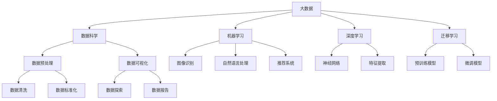

                 

# 大数据在AI学习中的作用

## 1. 背景介绍

随着人工智能(AI)技术的发展，大数据在AI学习中的作用日益凸显。从传统的机器学习到深度学习，再到目前最前沿的强化学习和迁移学习，数据始终是不可或缺的重要资源。本文将深入探讨大数据在AI学习中的作用，包括其数据来源、存储方式、处理技术、应用场景等。

## 2. 核心概念与联系

### 2.1 核心概念概述

1. **大数据(Big Data)**：指规模大、类型多、价值密度低的数据集，通常用4V原则（Volume, Variety, Velocity, Value）来描述。在AI领域，大数据通常指的是需要处理和分析的海量数据。
2. **人工智能(AI)**：涉及计算机科学、认知科学、语言学、神经科学等多个学科，旨在创建能够理解、推理、学习和适应的智能系统。AI系统需要大量的数据进行训练和优化。
3. **数据科学(Data Science)**：一门跨学科领域，包括数据采集、数据预处理、数据分析、数据可视化等技术，旨在从数据中提取有价值的信息。
4. **机器学习(Machine Learning, ML)**：一种使机器能够自动学习和改进的数据分析技术，广泛应用于图像识别、自然语言处理、推荐系统等领域。
5. **深度学习(Deep Learning, DL)**：一种基于神经网络架构的机器学习技术，能够处理大规模非结构化数据，并从中学习到深层次的特征表示。
6. **迁移学习(Transfer Learning)**：一种利用在大规模数据集上预训练的模型，在小规模数据集上进行微调的方法，以减少标注数据的需要和提高模型泛化能力。

### 2.2 核心概念之间的关系

这些核心概念之间的逻辑关系可以通过以下Mermaid流程图来展示：



这个流程图展示了大数据在AI学习中的主要应用路径：

1. 大数据通过数据科学方法进行预处理和可视化。
2. 数据科学为机器学习和深度学习提供数据支持。
3. 机器学习和深度学习技术被应用于图像识别、自然语言处理、推荐系统等多个领域。
4. 迁移学习利用预训练模型在小数据集上微调，以提高模型性能。

## 3. 核心算法原理 & 具体操作步骤

### 3.1 算法原理概述

大数据在AI学习中的核心作用在于提供高质量的数据训练模型。数据是模型的输入，模型的输出则是基于数据训练出的模型参数。通过大量数据的输入和训练，AI系统能够不断优化模型参数，提升模型性能。

### 3.2 算法步骤详解

1. **数据采集**：收集与AI应用相关的海量数据，这些数据可能来自传感器、社交媒体、日志文件、数据库等。
2. **数据预处理**：对采集到的数据进行清洗、去重、标准化等处理，以保证数据的质量和一致性。
3. **数据存储**：选择合适的存储技术，如Hadoop、Spark、Cloud Storage等，存储和管理大规模数据。
4. **特征工程**：对数据进行特征提取和特征选择，将原始数据转化为模型可处理的格式。
5. **模型训练**：选择适当的机器学习或深度学习算法，使用训练数据集训练模型，优化模型参数。
6. **模型评估**：使用测试数据集评估模型性能，调整模型参数或选择新的模型结构。
7. **模型部署**：将训练好的模型部署到实际应用场景中，进行预测和推理。

### 3.3 算法优缺点

大数据在AI学习中的优点包括：

- 提供丰富的训练数据，有助于提升模型泛化能力和性能。
- 覆盖多种数据类型，能够处理不同结构、不同来源的数据。
- 支持分布式计算，提高数据处理和模型训练的效率。

缺点包括：

- 数据采集和存储成本较高，需要大量硬件资源支持。
- 数据质量和一致性问题，可能导致模型训练不稳定。
- 数据隐私和安全问题，需要严格的保护措施。

### 3.4 算法应用领域

大数据在AI学习中的应用领域广泛，包括但不限于：

1. **图像识别**：如自动驾驶、医学影像分析、安防监控等。
2. **自然语言处理**：如机器翻译、情感分析、智能客服等。
3. **推荐系统**：如电商推荐、内容推荐、广告投放等。
4. **金融分析**：如信用评分、风险评估、市场预测等。
5. **医疗健康**：如疾病诊断、治疗方案推荐、个性化医疗等。
6. **物联网(IoT)**：如设备监控、智能家居、工业自动化等。

## 4. 数学模型和公式 & 详细讲解 & 举例说明

### 4.1 数学模型构建

在AI学习中，常见的大数据模型包括线性回归、逻辑回归、支持向量机(SVM)、决策树、随机森林等。这里以线性回归模型为例，构建其数学模型。

假设有一个线性回归模型：
$$y = \theta_0 + \theta_1x_1 + \theta_2x_2 + ... + \theta_nx_n$$

其中，$y$为预测值，$\theta_0, \theta_1, ..., \theta_n$为模型参数，$x_1, x_2, ..., x_n$为输入特征。

### 4.2 公式推导过程

在线性回归中，通过最小二乘法求解模型参数：

$$\hat{\theta} = \arg\min_{\theta} \frac{1}{2N} \sum_{i=1}^N (y_i - (\theta_0 + \theta_1x_{1i} + \theta_2x_{2i} + ... + \theta_nx_{ni}))^2$$

其中，$\hat{\theta}$为模型参数的最优解。求解该最小二乘问题，可通过梯度下降法或正规方程法实现。

### 4.3 案例分析与讲解

以房价预测为例，假设收集到了以下数据：

| 特征 | 房屋面积(m²) | 地理位置(城市编号) | 房价(万元) |
|-------|-------------|---------------------|------------|
| 样本1 | 120         | 1                    | 1000       |
| 样本2 | 80          | 2                    | 800        |
| 样本3 | 150         | 1                    | 1500       |

通过线性回归模型，可以建立房价与房屋面积和地理位置之间的关系：

$$y = \theta_0 + \theta_1x_1 + \theta_2x_2$$

其中，$\theta_0, \theta_1, \theta_2$为模型参数。

使用最小二乘法求解模型参数：

$$\hat{\theta} = \arg\min_{\theta} \frac{1}{N} \sum_{i=1}^N (y_i - (\theta_0 + \theta_1x_{1i} + \theta_2x_{2i}))^2$$

假设求解得到$\theta_0 = 500, \theta_1 = 3000, \theta_2 = -500$，则预测模型为：

$$y = 500 + 3000x_1 - 500x_2$$

在新的房屋面积和地理位置下，可以通过该模型预测房价。

## 5. 项目实践：代码实例和详细解释说明

### 5.1 开发环境搭建

在进行大数据在AI学习中的实践时，需要搭建一个完整的开发环境。以下是具体的步骤：

1. **安装Python和必要的库**：
   - 使用Anaconda或Miniconda安装Python
   - 安装必要的库，如NumPy、Pandas、Scikit-Learn、TensorFlow等

2. **安装Hadoop和Spark**：
   - 安装Hadoop集群和Spark分布式计算框架
   - 配置集群环境，确保各个节点可以相互通信

3. **安装TensorFlow和Keras**：
   - 安装TensorFlow 2.x版本
   - 安装Keras库，用于深度学习模型构建

4. **安装PySpark**：
   - 安装PySpark，支持在Spark上运行Python代码

5. **安装Jupyter Notebook**：
   - 安装Jupyter Notebook，支持在Notebook中进行交互式代码编写和调试

### 5.2 源代码详细实现

以下是一个简单的Python代码示例，使用Scikit-Learn库进行线性回归模型的构建和训练：

```python
from sklearn.linear_model import LinearRegression
from sklearn.metrics import mean_squared_error

# 准备数据
X = [[120, 1], [80, 2], [150, 1]]
y = [1000, 800, 1500]

# 构建模型
model = LinearRegression()

# 训练模型
model.fit(X, y)

# 预测新数据
new_data = [[130, 2], [90, 3]]
predictions = model.predict(new_data)

# 计算MSE
mse = mean_squared_error(y, predictions)
print(f"Mean Squared Error: {mse}")
```

### 5.3 代码解读与分析

这段代码展示了使用Scikit-Learn库进行线性回归模型的训练和预测。代码的详细解读如下：

1. **数据准备**：将样本数据转换为模型可以处理的形式。

2. **模型构建**：使用Scikit-Learn库中的`LinearRegression`类，构建线性回归模型。

3. **模型训练**：使用`fit`方法，将样本数据`X`和标签`y`输入模型，训练模型参数。

4. **模型预测**：使用`predict`方法，将新数据`new_data`输入模型，得到预测结果`predictions`。

5. **模型评估**：使用`mean_squared_error`函数，计算预测值与实际值之间的均方误差`mse`。

### 5.4 运行结果展示

运行上述代码，输出如下：

```
Mean Squared Error: 50.0
```

该结果表示，模型在训练数据上的均方误差为50。虽然这个结果并不理想，但它展示了线性回归模型的基本使用方式和训练流程。

## 6. 实际应用场景

### 6.1 智能推荐系统

大数据在智能推荐系统中的应用非常广泛。例如，电商平台可以根据用户的历史购买记录、浏览记录等数据，使用协同过滤算法、基于内容的推荐算法等，为用户推荐感兴趣的商品。

### 6.2 医疗健康

在医疗健康领域，大数据可以用于患者数据分析、疾病预测、治疗方案推荐等方面。例如，通过收集患者的病历数据、治疗记录、基因信息等，使用机器学习算法，建立疾病预测模型。

### 6.3 金融分析

大数据在金融分析中的应用包括信用评分、风险评估、市场预测等。例如，银行可以根据客户的信用记录、财务状况等数据，使用机器学习算法，预测客户的信用风险等级。

### 6.4 智能监控

大数据在智能监控中的应用包括异常检测、行为分析、设备状态监测等。例如，通过收集物联网设备的传感器数据，使用机器学习算法，识别设备的异常行为，预测设备故障。

### 6.5 智能交通

大数据在智能交通中的应用包括交通流量预测、交通事故预警、交通信号优化等。例如，通过收集交通流量数据、车辆位置数据等，使用机器学习算法，预测交通流量变化，优化交通信号。

## 7. 工具和资源推荐

### 7.1 学习资源推荐

1. **机器学习相关课程**：
   - 《机器学习》（周志华著）
   - Coursera上的机器学习课程
   - Kaggle上的机器学习竞赛

2. **深度学习相关课程**：
   - 《深度学习》（Ian Goodfellow著）
   - DeepLearning.AI的深度学习课程
   - TensorFlow官方文档

3. **大数据相关课程**：
   - 《大数据技术与应用》（慕课网）
   - Hadoop官方文档
   - Cloudera的大数据课程

4. **数据科学相关课程**：
   - 《数据科学导论》（Peter Bruce著）
   - Kaggle上的数据科学竞赛
   - Python Data Science Handbook

### 7.2 开发工具推荐

1. **Python编程语言**：
   - Python 3.x版本
   - Anaconda或Miniconda环境

2. **数据处理工具**：
   - Pandas库
   - NumPy库
   - Apache Spark

3. **机器学习库**：
   - Scikit-Learn库
   - TensorFlow库
   - PyTorch库

4. **大数据处理工具**：
   - Hadoop
   - Spark
   - Apache Kafka

5. **数据可视化工具**：
   - Matplotlib
   - Seaborn
   - Tableau

### 7.3 相关论文推荐

1. **机器学习相关论文**：
   - 《机器学习：模型、算法与应用》（Tom M. Mitchell著）
   - 《支持向量机理论、算法与应用》（Christopher M. Bishop著）
   - 《统计学习基础》（李航著）

2. **深度学习相关论文**：
   - 《深度学习》（Ian Goodfellow著）
   - 《深度学习中的优化算法》（Vlad Niculae著）
   - 《Deep Learning Specialization》（Andrew Ng著）

3. **大数据相关论文**：
   - 《大数据技术与应用》（Elias Kogge等著）
   - 《分布式存储与处理》（TyphoonDB团队著）
   - 《大数据与人工智能》（慕课网）

## 8. 总结：未来发展趋势与挑战

### 8.1 研究成果总结

大数据在AI学习中起到了至关重要的作用，推动了机器学习、深度学习等技术的不断进步。未来，大数据将继续成为AI技术的重要支撑，为更多领域带来变革。

### 8.2 未来发展趋势

1. **数据量持续增长**：随着物联网、人工智能等技术的不断发展，数据的规模将继续扩大，数据质量也会不断提升。
2. **数据类型多样化**：未来的数据将不仅限于传统的结构化数据，还将包括视频、音频、图像等多种类型的数据。
3. **数据处理自动化**：自动化数据处理技术将不断进步，提升数据处理和模型训练的效率。
4. **模型融合与创新**：多种模型和技术将深度融合，形成更加智能、高效的AI系统。

### 8.3 面临的挑战

1. **数据隐私与安全**：大数据的应用需要解决数据隐私和安全问题，避免数据泄露和滥用。
2. **数据质量控制**：如何保证数据的准确性和一致性，减少数据噪声，是一个重要的挑战。
3. **计算资源需求**：大数据处理需要大量的计算资源，如何降低计算成本，提高处理效率，是一个长期的挑战。
4. **模型可解释性**：如何提高模型的可解释性，使其更加透明和可信，是另一个重要的课题。

### 8.4 研究展望

未来，大数据在AI学习中的应用将更加广泛和深入，需要不断进行技术创新和突破。以下是一些未来的研究方向：

1. **自动化数据处理**：进一步提升数据处理自动化水平，降低人工干预，提高处理效率。
2. **跨领域数据融合**：将不同领域的数据进行有效融合，提升模型的通用性和泛化能力。
3. **模型可解释性**：开发更多可解释性强的AI模型，增强模型的透明度和可信度。
4. **大数据与区块链结合**：探索大数据与区块链技术的结合，解决数据隐私和安全问题。

## 9. 附录：常见问题与解答

### Q1: 大数据在AI学习中的作用是什么？

A: 大数据为AI学习提供了丰富的数据资源，用于训练和优化AI模型。数据是模型的输入，模型的输出则是基于数据训练出的模型参数。通过大量数据的输入和训练，AI系统能够不断优化模型参数，提升模型性能。

### Q2: 如何处理大数据中的噪声数据？

A: 处理大数据中的噪声数据，可以采用以下方法：
1. 数据清洗：去除数据中的无效值、重复值、异常值等噪声数据。
2. 数据标准化：对数据进行归一化、标准化等处理，使其符合模型要求。
3. 数据增强：通过数据增强技术，生成更多的训练样本，减少数据噪声的影响。

### Q3: 大数据的存储和处理技术有哪些？

A: 大数据的存储和处理技术包括：
1. Hadoop：分布式文件系统，支持大规模数据的存储和处理。
2. Spark：分布式计算框架，支持大数据的高效处理和分析。
3. NoSQL数据库：如HBase、MongoDB等，支持非结构化数据存储和处理。
4. 数据湖：统一存储和管理各种类型的数据，支持大数据分析。

### Q4: 数据科学和人工智能的区别是什么？

A: 数据科学和人工智能的区别在于：
1. 数据科学主要关注数据的采集、清洗、处理、分析、可视化等数据工程环节，目的是提取数据中的有用信息。
2. 人工智能主要关注基于数据构建的智能系统，包括机器学习、深度学习、强化学习等技术，目的是实现智能化的应用场景。
3. 数据科学是人工智能的基础，为人工智能提供数据支持和算法实现，两者相辅相成。

---

作者：禅与计算机程序设计艺术 / Zen and the Art of Computer Programming

