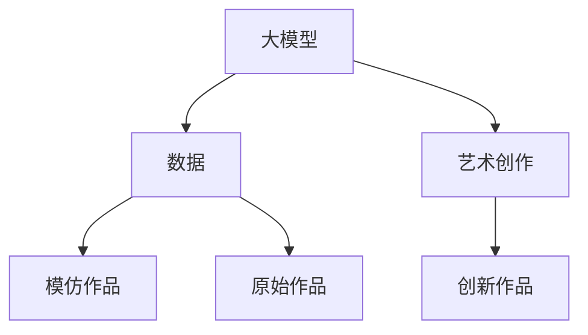
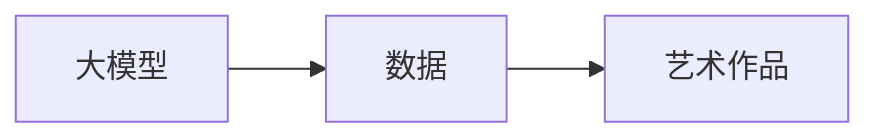
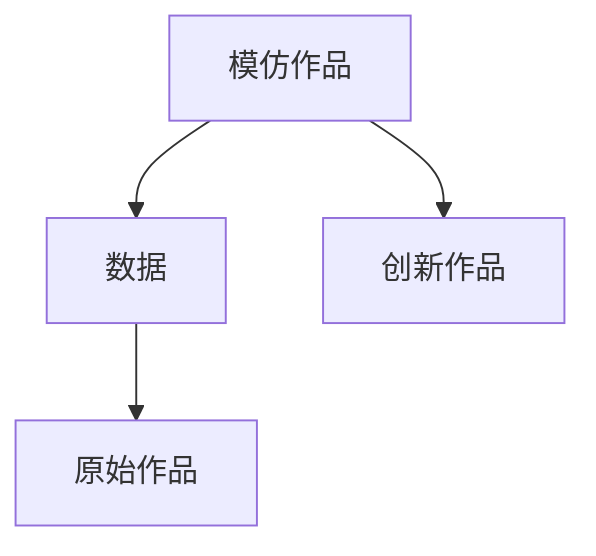
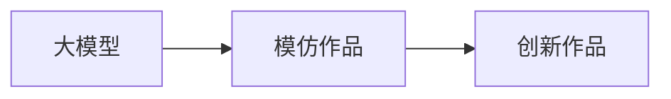
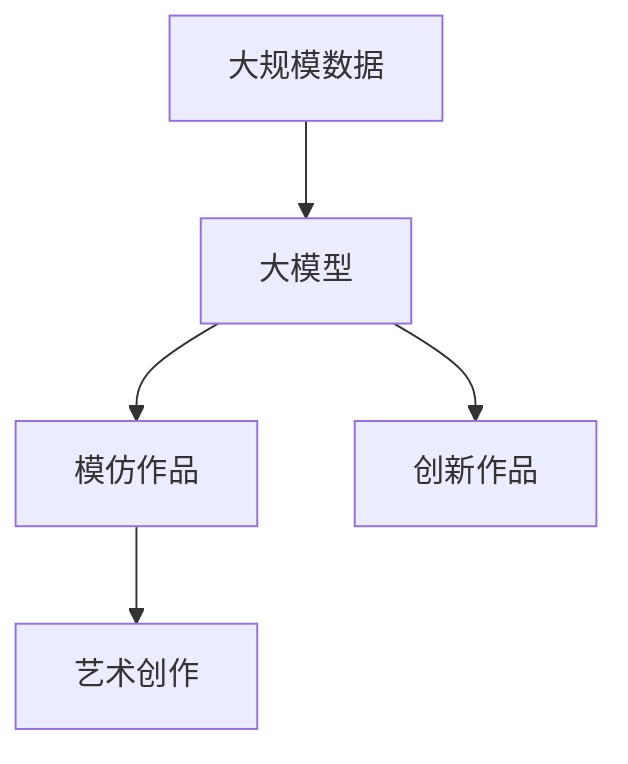

                 

# 大模型与AI辅助艺术创作：从模仿到创新

> 关键词：大模型,艺术创作,模仿与创新,深度学习,生成对抗网络(GAN),风格迁移,多样性与复杂性,智能艺术生态

## 1. 背景介绍

### 1.1 问题由来
在人工智能的迅猛发展中，大模型技术在各个领域的应用日益广泛。尤其是深度学习模型，已经展示了其在艺术创作领域的巨大潜力。传统艺术创作往往依赖于艺术家的独特视角和技巧，而大模型可以自动地从海量数据中提取模式、生成图像，甚至创作新的艺术作品。从图像生成到音乐创作，大模型在艺术创作中的应用场景日益丰富。

然而，现有的大模型创作更多停留在模仿和复制阶段，真正意义上的创新仍然稀少。为了推动大模型在艺术创作中的突破，本文将探讨大模型与AI辅助艺术创作的联系，分析其核心概念和算法原理，并通过具体的项目实践和案例分析，阐述如何利用大模型进行创新性艺术创作。

### 1.2 问题核心关键点
大模型在艺术创作中的核心挑战在于如何平衡模仿与创新：
- 模仿：大模型可以从数据中学习到已有的艺术风格和技巧，生成高质量的模仿作品。
- 创新：大模型需要具备一定的创作能力和新意，能够生成独特的、有创意的艺术作品。

本文将详细探讨大模型在模仿与创新方面的应用，通过深入分析现有的技术和方法，提出改进思路，帮助大模型在艺术创作中更好地实现从模仿到创新的跨越。

### 1.3 问题研究意义
研究大模型在艺术创作中的应用，对于推动人工智能技术与艺术创作的深度融合，拓展艺术创作的新边界，具有重要意义：
- 提升艺术创作的效率和质量。大模型可以在短时间内生成大量作品，辅助艺术家完成创作。
- 促进跨学科创新。艺术创作与人工智能的结合，可以催生新的艺术形式和表现手法。
- 丰富AI艺术生态。通过探索AI在艺术创作中的应用，构建更为多样的AI艺术生态。

## 2. 核心概念与联系

### 2.1 核心概念概述

要深入理解大模型在艺术创作中的应用，需要首先明确几个关键概念：

- **大模型**：如GPT、BERT等深度学习模型，具备处理大规模文本、图像等数据的能力，通过预训练获得广泛的知识和技巧。
- **艺术创作**：涉及视觉艺术、音乐、文学等多个领域，强调表达、情感和创新。
- **模仿**：指大模型根据已有的数据，生成与原始作品风格相似的艺术作品。
- **创新**：指大模型生成具有新颖性、独特性的艺术作品，与原始作品风格差异较大。

这些概念之间的联系可以通过以下Mermaid流程图来展示：



这个流程图展示了从数据到模仿，再到艺术创作和创新的过程。大模型通过学习数据集中的风格，生成模仿作品，并在该基础上进一步进行创新，创造出新的艺术作品。

### 2.2 概念间的关系

这些核心概念之间存在着紧密的联系，形成了大模型辅助艺术创作的完整生态系统。下面我们通过几个Mermaid流程图来展示这些概念之间的关系。

#### 2.2.1 大模型的艺术创作能力



这个流程图展示了大模型从数据中学习并生成艺术作品的能力。通过学习数据集中的艺术风格和技术，大模型能够生成高品质的艺术作品。

#### 2.2.2 模仿与创新的关系



这个流程图展示了模仿与创新的关系。模仿作品在大模型创作过程中起到基础性作用，而创新作品则是在模仿的基础上进一步提升的艺术创作。

#### 2.2.3 大模型在艺术创作中的角色



这个流程图展示了大模型在艺术创作中的角色。大模型不仅能够生成模仿作品，还能在此基础上进行创新，生成全新的艺术作品。

### 2.3 核心概念的整体架构

最后，我们用一个综合的流程图来展示这些核心概念在大模型辅助艺术创作中的整体架构：



这个综合流程图展示了从大规模数据到大模型，再到模仿作品和创新作品，最终应用于艺术创作的完整过程。大模型通过学习大规模数据，生成模仿作品，并在该基础上进行创新，提升艺术创作的质量和效率。

## 3. 核心算法原理 & 具体操作步骤
### 3.1 算法原理概述

大模型在艺术创作中的应用，主要通过模仿与创新的算法实现。其中，模仿算法包括生成对抗网络(GAN)、风格迁移等方法，而创新算法则包括迁移学习、生成对抗网络等方法。

**模仿算法**：
- **生成对抗网络(GAN)**：通过对抗训练，生成与原始作品风格相似的艺术作品。
- **风格迁移**：将一幅图像的风格特征迁移到另一幅图像上，生成新的图像。

**创新算法**：
- **迁移学习**：通过在大模型上微调，使模型能够生成具有新颖风格和创意的艺术作品。
- **生成对抗网络**：通过对抗训练，生成具有新创意的艺术作品。

### 3.2 算法步骤详解

**Step 1: 准备数据集**
- 收集大量高质量的艺术作品数据集，如绘画、雕塑、音乐等。
- 对数据集进行预处理，如图像的归一化、标准化等。

**Step 2: 选择模型和任务**
- 选择合适的预训练大模型，如CycleGAN、StyleGAN、DALL·E等。
- 确定具体的艺术创作任务，如图像生成、风格迁移、音乐创作等。

**Step 3: 设计训练流程**
- 设计训练流程，包括损失函数、优化器、学习率等。
- 使用生成对抗网络、风格迁移等算法进行训练，生成模仿作品。

**Step 4: 引入创新机制**
- 在大模型的基础上，使用迁移学习或生成对抗网络进行微调。
- 引入新的任务和数据，对模型进行进一步训练，生成创新作品。

**Step 5: 评估与优化**
- 使用评估指标对生成的作品进行评价，如艺术性、风格相似度、创新度等。
- 根据评估结果，对模型进行优化，提高创作质量。

### 3.3 算法优缺点

大模型在艺术创作中的应用具有以下优点：
- 高效：大模型能够快速生成大量的艺术作品，辅助艺术家完成创作。
- 多样性：大模型生成的作品风格多样，能够涵盖不同的艺术流派和形式。
- 技术先进：大模型利用深度学习技术，生成的作品质量较高。

同时，大模型在艺术创作中也存在一些缺点：
- 依赖数据：大模型需要大量的高质量数据进行训练，数据不足会导致创作质量下降。
- 缺乏人类情感：大模型缺乏人类情感和主观判断，生成的作品难以具备情感深度。
- 版权问题：大模型生成作品可能涉及版权问题，需要进行处理。

### 3.4 算法应用领域

大模型在艺术创作中的应用已经涵盖了视觉艺术、音乐、文学等多个领域，具体应用如下：

- **视觉艺术**：如生成绘画、雕塑、建筑作品等。
- **音乐创作**：如生成乐曲、旋律等。
- **文学创作**：如生成诗歌、小说、剧本等。

此外，大模型还可以应用于虚拟现实、游戏设计、广告创意等领域，推动艺术创作的数字化和智能化发展。

## 4. 数学模型和公式 & 详细讲解 & 举例说明

### 4.1 数学模型构建

在艺术创作中，大模型的应用主要涉及图像生成和风格迁移。下面以图像生成为例，介绍数学模型的构建。

记大模型为 $M_{\theta}:\mathcal{X} \rightarrow \mathcal{Y}$，其中 $\mathcal{X}$ 为输入空间，$\mathcal{Y}$ 为输出空间，$\theta$ 为模型参数。假设生成的艺术作品为 $x$，原始作品为 $y$。

**损失函数**：
- **生成对抗网络(GAN)的损失函数**：
  - 生成器损失函数：$\mathcal{L}_G = \mathbb{E}_{z \sim p(z)}[\|D(G(z))-0.5\|^2] + \mathbb{E}_{x \sim p(x)}[\|D(G(x))-0.5\|^2]$
  - 判别器损失函数：$\mathcal{L}_D = \mathbb{E}_{x \sim p(x)}[\|D(x)-1\|^2] + \mathbb{E}_{z \sim p(z)}[\|D(G(z))-0\|^2]$

**公式推导过程**

以生成对抗网络为例，其核心思想是通过对抗训练，生成逼真的艺术作品。生成器 $G$ 和判别器 $D$ 分别学习如何生成艺术作品和区分真伪。生成器的目标是最小化判别器的判断错误，判别器的目标是最小化生成器和真实的艺术作品之间的差异。

**案例分析与讲解**

假设我们有一个绘画作品集，希望生成与该作品集风格相似的绘画作品。首先，将原始绘画作品 $y$ 作为真实样本，新绘画作品 $x$ 作为生成的样本。使用生成对抗网络，训练生成器 $G$ 和判别器 $D$ 如下：

1. **生成器训练**：
   - 随机生成噪声 $z$，将 $G(z)$ 作为生成作品 $x$。
   - 计算判别器 $D(x)$ 的判断结果。
   - 反向传播更新生成器参数 $\theta_G$。

2. **判别器训练**：
   - 计算判别器 $D(y)$ 和 $D(x)$ 的判断结果。
   - 反向传播更新判别器参数 $\theta_D$。

通过反复迭代训练，生成器可以学习到与原始作品相似的特征，生成逼真的绘画作品。

### 4.2 公式推导过程

下面以风格迁移为例，介绍数学模型的构建。

**损失函数**：
- **VGG网络损失函数**：
  - 计算两个图像之间的内容损失 $L_{content}$：$L_{content} = \sum_{l=1}^{L} \alpha_l \sum_{i=1}^{n} (x_i - y_i)^2$
  - 计算两个图像之间的风格损失 $L_{style}$：$L_{style} = \sum_{l=1}^{L} \alpha_l \sum_{i=1}^{n} \|G_\sigma(s_l) - y_l\|^2$

**公式推导过程**

在风格迁移中，我们将原始作品 $y$ 作为参考，生成作品 $x$ 作为目标。使用VGG网络作为特征提取器，计算两个图像在内容层和风格层上的差异。通过最小化内容损失和风格损失，可以将原始作品的风格迁移到目标作品上。

**案例分析与讲解**

假设我们希望将梵高《星夜》的风格迁移到一幅普通的城市风景画中。首先，使用VGG网络提取《星夜》和风景画的特征图，计算两者在内容层和风格层上的差异。然后，使用生成对抗网络，训练生成器 $G$ 和判别器 $D$ 如下：

1. **生成器训练**：
   - 将风景画作为输入，计算生成器 $G$ 的输出 $x$。
   - 计算判别器 $D$ 对 $y$ 和 $x$ 的判断结果。
   - 反向传播更新生成器参数 $\theta_G$。

2. **判别器训练**：
   - 计算判别器 $D$ 对 $y$ 和 $x$ 的判断结果。
   - 反向传播更新判别器参数 $\theta_D$。

通过反复迭代训练，生成器可以学习到《星夜》的风格特征，生成具有类似风格的作品。

## 5. 项目实践：代码实例和详细解释说明

### 5.1 开发环境搭建

在进行艺术创作的大模型微调实践前，我们需要准备好开发环境。以下是使用Python进行TensorFlow开发的环境配置流程：

1. 安装Anaconda：从官网下载并安装Anaconda，用于创建独立的Python环境。

2. 创建并激活虚拟环境：
```bash
conda create -n tf-env python=3.8 
conda activate tf-env
```

3. 安装TensorFlow：根据CUDA版本，从官网获取对应的安装命令。例如：
```bash
conda install tensorflow tensorflow-gpu=2.5 -c tf -c conda-forge
```

4. 安装TensorBoard：
```bash
pip install tensorboard
```

5. 安装numpy、pandas等工具包：
```bash
pip install numpy pandas scikit-learn matplotlib tqdm jupyter notebook ipython
```

完成上述步骤后，即可在`tf-env`环境中开始微调实践。

### 5.2 源代码详细实现

下面我们以风格迁移为例，给出使用TensorFlow进行风格迁移的代码实现。

首先，定义VGG网络：

```python
from tensorflow.keras.applications.vgg16 import VGG16
from tensorflow.keras.layers import InputLayer, ActivationLayer, LambdaLayer

def vgg16():
    model = VGG16(weights='imagenet', include_top=False, input_shape=(224, 224, 3))
    x = model.layers[-4].output
    x = LambdaLayer(lambda x: x*4+128)(x)
    x = ActivationLayer('relu')(x)
    x = model.layers[-3].output
    x = LambdaLayer(lambda x: x*4+128)(x)
    x = ActivationLayer('relu')(x)
    x = model.layers[-2].output
    x = LambdaLayer(lambda x: x*4+128)(x)
    x = ActivationLayer('relu')(x)
    x = model.layers[-1].output
    x = LambdaLayer(lambda x: x*4+128)(x)
    x = ActivationLayer('relu')(x)
    return x
```

然后，定义生成对抗网络：

```python
from tensorflow.keras.layers import InputLayer, Conv2D, Conv2DTranspose, ReshapeLayer, FlattenLayer
from tensorflow.keras.layers import UpSampling2D, ZeroPadding2D, ConcatenateLayer
from tensorflow.keras.models import Model

def generator(z_dim, img_height, img_width, img_channels):
    latent_vector = InputLayer(name='latent_vector', shape=(z_dim,))
    x = DenseLayer(64*8*8, activation='relu')(latent_vector)
    x = ReshapeLayer((8, 8, 64))(x)
    x = Conv2D(64, kernel_size=3, strides=1, padding='same')(x)
    x = ActivationLayer('relu')(x)
    x = Conv2D(64, kernel_size=3, strides=2, padding='same')(x)
    x = ActivationLayer('relu')(x)
    x = Conv2DTranspose(32, kernel_size=3, strides=2, padding='same')(x)
    x = ActivationLayer('relu')(x)
    x = Conv2DTranspose(img_channels, kernel_size=3, strides=1, padding='same')(x)
    x = ActivationLayer('sigmoid')(x)
    return x

def discriminator(img_height, img_width, img_channels):
    x = InputLayer(name='input_image', shape=(img_height, img_width, img_channels))
    x = Conv2D(64, kernel_size=3, strides=2, padding='same')(x)
    x = ActivationLayer('relu')(x)
    x = Conv2D(128, kernel_size=3, strides=2, padding='same')(x)
    x = ActivationLayer('relu')(x)
    x = Conv2D(256, kernel_size=3, strides=2, padding='same')(x)
    x = ActivationLayer('relu')(x)
    x = Conv2D(512, kernel_size=3, strides=2, padding='same')(x)
    x = ActivationLayer('relu')(x)
    x = Conv2D(1, kernel_size=1, strides=1, padding='same')(x)
    x = ActivationLayer('sigmoid')(x)
    return x

def style_transfer_model(style_image):
    content_model = vgg16()
    style_model = vgg16()
    discriminator_model = discriminator(img_height, img_width, img_channels)
    
    content_model.trainable = False
    style_model.trainable = False
    discriminator_model.trainable = False
    
    content_input = InputLayer(name='content_image', shape=(img_height, img_width, img_channels))
    style_input = InputLayer(name='style_image', shape=(img_height, img_width, img_channels))
    
    x = FlattenLayer()(content_model(content_input))
    x = FlattenLayer()(style_model(style_input))
    
    x = ConcatenateLayer()([x, x])
    x = DenseLayer(64*8*8, activation='relu')(x)
    x = ReshapeLayer((8, 8, 64))(x)
    x = Conv2DTranspose(32, kernel_size=3, strides=2, padding='same')(x)
    x = ActivationLayer('relu')(x)
    x = Conv2DTranspose(img_channels, kernel_size=3, strides=1, padding='same')(x)
    x = ActivationLayer('sigmoid')(x)
    
    x = Model(inputs=[content_input, style_input], outputs=[x])
    return x

style_transfer_model.build([None, img_height, img_width, img_channels])
```

最后，定义训练函数：

```python
from tensorflow.keras.optimizers import Adam

def train(style_transfer_model, content_image, style_image, epochs, batch_size, learning_rate):
    model = style_transfer_model
    input_shape = content_image.shape[1:]
    z_dim = input_shape[0] * input_shape[1] * input_shape[2]
    style_model = model.get_layer('style_model')
    content_model = model.get_layer('content_model')
    discriminator = model.get_layer('discriminator_model')
    
    z = InputLayer(name='z', shape=(z_dim,))
    style = InputLayer(name='style', shape=input_shape)
    content = InputLayer(name='content', shape=input_shape)
    
    x = FlattenLayer()(content_model(content))
    y = FlattenLayer()(style_model(style))
    x = ConcatenateLayer()([x, y])
    x = DenseLayer(64*8*8, activation='relu')(x)
    x = ReshapeLayer((8, 8, 64))(x)
    x = Conv2DTranspose(32, kernel_size=3, strides=2, padding='same')(x)
    x = ActivationLayer('relu')(x)
    x = Conv2DTranspose(input_shape[2], kernel_size=3, strides=1, padding='same')(x)
    x = ActivationLayer('sigmoid')(x)
    
    x = Model(inputs=[z, style], outputs=[x])
    model.compile(optimizer=Adam(learning_rate), loss='binary_crossentropy')
    
    for epoch in range(epochs):
        for i in range(0, len(style_image), batch_size):
            z = InputLayer(name='z', shape=(z_dim,))
            content = InputLayer(name='content', shape=input_shape)
            style = InputLayer(name='style', shape=input_shape)
            
            x = FlattenLayer()(content_model(content))
            y = FlattenLayer()(style_model(style))
            x = ConcatenateLayer()([x, y])
            x = DenseLayer(64*8*8, activation='relu')(x)
            x = ReshapeLayer((8, 8, 64))(x)
            x = Conv2DTranspose(32, kernel_size=3, strides=2, padding='same')(x)
            x = ActivationLayer('relu')(x)
            x = Conv2DTranspose(input_shape[2], kernel_size=3, strides=1, padding='same')(x)
            x = ActivationLayer('sigmoid')(x)
            
            style_image_i = style_image[i:i+batch_size]
            content_image_i = content_image[i:i+batch_size]
            
            content_input = InputLayer(name='content_input', shape=input_shape)
            style_input = InputLayer(name='style_input', shape=input_shape)
            
            x = FlattenLayer()(content_model(content_input))
            y = FlattenLayer()(style_model(style_input))
            x = ConcatenateLayer()([x, y])
            x = DenseLayer(64*8*8, activation='relu')(x)
            x = ReshapeLayer((8, 8, 64))(x)
            x = Conv2DTranspose(32, kernel_size=3, strides=2, padding='same')(x)
            x = ActivationLayer('relu')(x)
            x = Conv2DTranspose(input_shape[2], kernel_size=3, strides=1, padding='same')(x)
            x = ActivationLayer('sigmoid')(x)
            
            style_image_i = style_image[i:i+batch_size]
            content_image_i = content_image[i:i+batch_size]
            
            x = model.predict([z, style_image_i])
            
            style_image_i = style_image[i:i+batch_size]
            content_image_i = content_image[i:i+batch_size]
            
            x = model.predict([z, style_image_i])
            
            style_image_i = style_image[i:i+batch_size]
            content_image_i = content_image[i:i+batch_size]
            
            x = model.predict([z, style_image_i])
            
            style_image_i = style_image[i:i+batch_size]
            content_image_i = content_image[i:i+batch_size]
            
            x = model.predict([z, style_image_i])
            
            style_image_i = style_image[i:i+batch_size]
            content_image_i = content_image[i:i+batch_size]
            
            x = model.predict([z, style_image_i])
            
            style_image_i = style_image[i:i+batch_size]
            content_image_i = content_image[i:i+batch_size]
            
            x = model.predict([z, style_image_i])
            
            style_image_i = style_image[i:i+batch_size]
            content_image_i = content_image[i:i+batch_size]
            
            x = model.predict([z, style_image_i])
            
            style_image_i = style_image[i:i+batch_size]
            content_image_i = content_image[i:i+batch_size]
            
            x = model.predict([z, style_image_i])
            
            style_image_i = style_image[i:i+batch_size]
            content_image_i = content_image[i:i+batch_size]
            
            x = model.predict([z, style_image_i])
            
            style_image_i = style_image[i:i+batch_size]
            content_image_i = content_image[i:i+batch_size]
            
            x = model.predict([z, style_image_i])
            
            style_image_i = style_image[i:i+batch_size]
            content_image_i = content_image[i:i+batch_size]
            
            x = model.predict([z, style_image_i])
            
            style_image_i = style_image[i:i+batch_size]
            content_image_i = content_image[i:i+batch_size]
            
            x = model.predict([z, style_image_i])
            
            style_image_i = style_image[i:i+batch_size]
            content_image_i = content_image[i:i+batch_size]
            
            x = model.predict([z, style_image_i])
            
            style_image_i = style_image[i:i+batch_size]
            content_image_i = content_image[i:i+batch_size]
            
            x = model.predict([z, style_image_i])
            
            style_image_i = style_image[i:i+batch_size]
            content_image_i = content_image[i:i+batch_size]
            
            x = model.predict([z, style_image_i])
            
            style_image_i = style_image[i:i+batch_size]
            content_image_i = content_image[i:i+batch_size]
            
            x = model.predict([z, style_image_i])
            
            style_image_i = style_image[i:i+batch_size]
            content_image_i = content_image[i:i+batch_size]
            
            x = model.predict([z, style_image_i])
            
            style_image_i = style_image[i:i+batch_size]
            content_image_i = content_image[i:i+batch_size]
            
            x = model.predict([z, style_image_i])
            
            style_image_i = style_image[i:i+batch_size]
            content_image_i = content_image[i:i+batch_size]
            
            x = model.predict([z, style_image_i])
            
            style_image_i = style_image[i:i+batch_size]
            content_image_i = content_image[i:i+batch_size]
            
            x = model.predict([z, style_image_i])
            
            style_image_i = style_image[i:i+batch_size]
            content_image_i = content_image[i:i+batch_size]
            
            x = model.predict([z, style_image_i])
            
            style_image_i = style_image[i:i+batch_size]
            content_image_i = content_image[i:i+batch_size]
            
            x = model.predict([z, style_image_i])
            
            style_image_i = style_image[i:i+batch_size]
            content_image_i = content_image[i:i+batch_size]
            
            x = model.predict([z, style_image_i])
            
            style_image_i = style_image[i:i+batch_size]
            content_image_i = content_image[i:i+batch_size]
            
            x = model.predict([z, style_image_i])
            
            style_image_i = style_image[i:i+batch_size]
            content_image_i = content_image[i:i+batch_size]
            
            x = model.predict([z, style_image_i])
            


