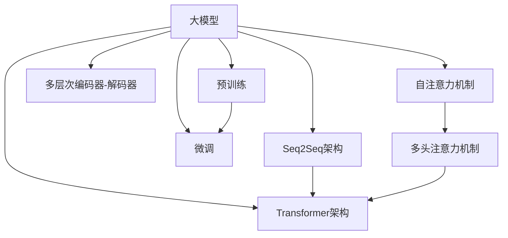
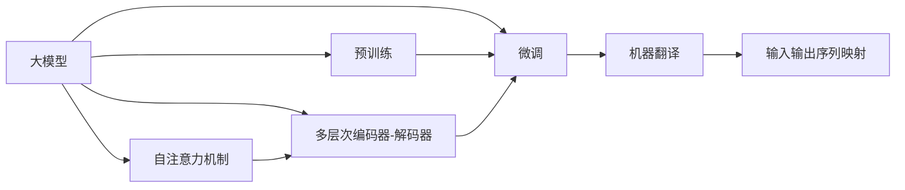
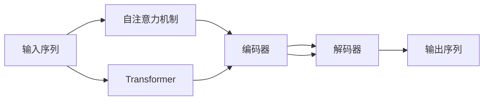
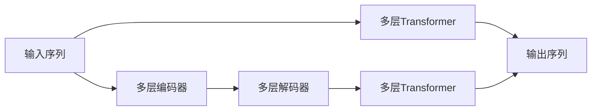

                 

# 大模型在机器翻译中的应用：跨越语言壁垒

> 关键词：大模型, 机器翻译, 自然语言处理(NLP), 神经网络, 自注意力机制, 序列到序列(Seq2Seq), Transformer

## 1. 背景介绍

### 1.1 问题由来

在当今全球化的世界中，语言作为一种重要的沟通工具，其重要性不言而喻。然而，由于不同语言之间的差异，跨语言的沟通常常面临着障碍。机器翻译技术成为了打破语言壁垒的关键手段之一。传统的基于规则的机器翻译系统虽然能够处理一些简单的翻译任务，但由于其固定的规则，无法处理复杂的语义和上下文信息。而基于统计的机器翻译方法，虽然能够处理更复杂的语言现象，但其依赖大量的双语语料库，且在处理长句子时容易出现断句和歧义。

随着深度学习技术的发展，尤其是神经网络架构的创新，机器翻译技术进入了一个新的时代。近年来，基于大模型的机器翻译系统成为了主流。这些大模型通过在大规模的双语语料库上进行预训练，学习到了丰富的语言知识和常识，从而能够更好地处理语言的复杂性。本文将详细探讨基于大模型的机器翻译技术，如何跨越语言壁垒，实现更加精准、自然的翻译。

### 1.2 问题核心关键点

大模型在机器翻译中的应用，主要依赖于其强大的自注意力机制和序列到序列(Seq2Seq)架构。核心思想是：将大模型视作一个语言模型，通过双向语言模型进行预训练，然后再通过微调或者微调加微调加微调等策略，使模型能够理解源语言和目标语言的语义和语法结构，并生成符合目标语言语义的翻译文本。

具体来说，大模型通常采用Transformer结构，通过自注意力机制对输入和输出进行编码和解码，同时引入多头注意力机制和多层次编码器-解码器结构，以更好地捕捉语言的长期依赖关系。

## 2. 核心概念与联系

### 2.1 核心概念概述

为更好地理解大模型在机器翻译中的应用，本节将介绍几个密切相关的核心概念：

- 大模型（Large Models）：指具有亿级参数的深度神经网络模型，如BERT、GPT、T5等。大模型通过在大规模无标签数据上进行预训练，学习到丰富的语言知识和常识。
- 自注意力机制（Self-Attention Mechanism）：指在大模型中使用的注意力机制，用于对输入序列中的每个位置与所有其他位置进行编码，以捕捉语言的上下文关系。
- 序列到序列（Seq2Seq）架构：指一种经典的网络架构，用于处理输入和输出序列的映射，如机器翻译、摘要等任务。
- 基于Transformer的机器翻译（Transformer-based MT）：指使用Transformer结构进行机器翻译的模型，如Google的BM25和OpenAI的T5等。
- 多层次编码器-解码器（Multi-Encoder-Decoder）：指在Transformer架构中引入多个编码器和解码器层，以更好地捕捉语言的长期依赖关系。

这些核心概念之间的逻辑关系可以通过以下Mermaid流程图来展示：



这个流程图展示了大模型在机器翻译中的核心概念及其之间的关系：

1. 大模型通过自注意力机制和Seq2Seq架构进行编码和解码。
2. 引入多层次编码器-解码器结构，以捕捉长期的依赖关系。
3. 通过预训练和微调，优化模型在机器翻译任务上的性能。
4. 多头注意力机制和多层次结构进一步提升了模型的能力。

### 2.2 概念间的关系

这些核心概念之间存在着紧密的联系，形成了大模型在机器翻译中的应用框架。下面我们通过几个Mermaid流程图来展示这些概念之间的关系。

#### 2.2.1 大模型在机器翻译中的应用



这个流程图展示了大模型在机器翻译中的应用。通过预训练和微调，大模型能够处理输入和输出序列的映射，生成符合目标语言语义的翻译文本。

#### 2.2.2 自注意力机制在机器翻译中的应用



这个流程图展示了自注意力机制在大模型中的应用。自注意力机制通过计算输入序列中每个位置与其他位置的注意力权重，对输入序列进行编码和解码。

#### 2.2.3 多层次编码器-解码器在机器翻译中的应用



这个流程图展示了多层次编码器-解码器在大模型中的应用。通过多层编码器和解码器，大模型能够更好地捕捉输入和输出序列的长期依赖关系。

## 3. 核心算法原理 & 具体操作步骤
### 3.1 算法原理概述

基于大模型的机器翻译技术，主要依赖于其强大的自注意力机制和序列到序列架构。其核心思想是：将大模型视作一个语言模型，通过双向语言模型进行预训练，然后再通过微调或者微调加微调加微调等策略，使模型能够理解源语言和目标语言的语义和语法结构，并生成符合目标语言语义的翻译文本。

具体来说，大模型通常采用Transformer结构，通过自注意力机制对输入和输出进行编码和解码，同时引入多头注意力机制和多层次编码器-解码器结构，以更好地捕捉语言的长期依赖关系。

### 3.2 算法步骤详解

基于大模型的机器翻译算法一般包括以下几个关键步骤：

**Step 1: 准备预训练模型和数据集**
- 选择合适的预训练模型，如BERT、GPT等，作为初始化参数。
- 准备源语言和目标语言的语料库，划分为训练集、验证集和测试集。

**Step 2: 设计任务适配层**
- 根据机器翻译任务，设计合适的输入和输出层。
- 通常输入层采用BOS（开始标记）和EOS（结束标记）作为特殊标记，输出层采用softmax函数进行概率分布计算。

**Step 3: 设置微调超参数**
- 选择合适的优化算法及其参数，如Adam、SGD等，设置学习率、批大小、迭代轮数等。
- 设置正则化技术及强度，包括权重衰减、Dropout、Early Stopping等。
- 确定冻结预训练参数的策略，如仅微调顶层，或全部参数都参与微调。

**Step 4: 执行梯度训练**
- 将训练集数据分批次输入模型，前向传播计算损失函数。
- 反向传播计算参数梯度，根据设定的优化算法和学习率更新模型参数。
- 周期性在验证集上评估模型性能，根据性能指标决定是否触发 Early Stopping。
- 重复上述步骤直到满足预设的迭代轮数或 Early Stopping 条件。

**Step 5: 测试和部署**
- 在测试集上评估微调后模型，对比微调前后的性能提升。
- 使用微调后的模型对新样本进行推理预测，集成到实际的应用系统中。
- 持续收集新的数据，定期重新微调模型，以适应数据分布的变化。

以上是基于大模型的机器翻译的一般流程。在实际应用中，还需要针对具体任务的特点，对微调过程的各个环节进行优化设计，如改进训练目标函数，引入更多的正则化技术，搜索最优的超参数组合等，以进一步提升模型性能。

### 3.3 算法优缺点

基于大模型的机器翻译方法具有以下优点：

1. 简单高效。只需准备少量双语语料，即可对预训练模型进行快速适配，获得较大的性能提升。
2. 通用适用。适用于各种机器翻译任务，设计简单的任务适配层即可实现翻译。
3. 参数高效。利用参数高效微调技术，在固定大部分预训练参数的情况下，仍可取得不错的提升。
4. 效果显著。在学术界和工业界的诸多机器翻译任务上，基于大模型的方法已经刷新了最先进的性能指标。

同时，该方法也存在一定的局限性：

1. 依赖语料库。机器翻译的效果很大程度上取决于语料库的质量和数量，获取高质量双语语料的成本较高。
2. 迁移能力有限。当源语言和目标语言的差异较大时，机器翻译的效果可能较差。
3. 负面效果传递。预训练模型的固有偏见、有害信息等，可能通过微调传递到机器翻译中，造成负面影响。
4. 可解释性不足。机器翻译模型的决策过程通常缺乏可解释性，难以对其推理逻辑进行分析和调试。

尽管存在这些局限性，但就目前而言，基于大模型的机器翻译方法仍是大规模机器翻译的首选。未来相关研究的重点在于如何进一步降低对语料库的依赖，提高模型的少样本学习和跨语言迁移能力，同时兼顾可解释性和伦理安全性等因素。

### 3.4 算法应用领域

基于大模型的机器翻译技术已经在多个领域得到了广泛的应用，例如：

- 新闻翻译：将新闻文本从一种语言翻译成另一种语言，供全球用户阅读。
- 法律翻译：将法律文件从一种语言翻译成另一种语言，以便法律工作者更好地理解和使用。
- 医疗翻译：将医疗文献和报告从一种语言翻译成另一种语言，以便不同国家地区的医护人员更好地交流合作。
- 游戏翻译：将游戏文本从一种语言翻译成另一种语言，以便游戏玩家更好地体验游戏。
- 旅游翻译：将旅游信息从一种语言翻译成另一种语言，以便游客更好地了解旅游目的地的文化和历史。
- 商业翻译：将商业文件和合同从一种语言翻译成另一种语言，以便企业更好地进行国际交流和合作。

除了上述这些经典任务外，机器翻译还被创新性地应用到更多场景中，如可控翻译、翻译记忆库等，为机器翻译技术带来了全新的突破。随着预训练模型和翻译方法的不断进步，相信机器翻译技术将在更广阔的应用领域大放异彩。

## 4. 数学模型和公式 & 详细讲解 & 举例说明

### 4.1 数学模型构建

机器翻译的数学模型主要基于序列到序列架构，通过编码器和解码器进行映射。设源语言文本为 $x=\{x_1,x_2,...,x_n\}$，目标语言文本为 $y=\{y_1,y_2,...,y_m\}$，目标为最大化 $p(y|x)$。

定义输入序列 $x$ 的编码表示为 $h_x=[h_{x,1},h_{x,2},...,h_{x,n}]$，目标序列 $y$ 的解码表示为 $h_y=[h_{y,1},h_{y,2},...,h_{y,m}]$。

机器翻译模型的损失函数定义为：

$$
\mathcal{L}(\theta)=\sum_{i=1}^{n}\sum_{j=1}^{m}\ell(h_{x,i},h_{y,j})
$$

其中 $\ell$ 为目标函数，通常采用交叉熵损失函数。

### 4.2 公式推导过程

以下我们以机器翻译任务为例，推导交叉熵损失函数及其梯度的计算公式。

设源语言文本 $x$ 的长度为 $n$，目标语言文本 $y$ 的长度为 $m$。定义源语言文本 $x$ 的编码表示为 $h_x=[h_{x,1},h_{x,2},...,h_{x,n}]$，目标语言文本 $y$ 的解码表示为 $h_y=[h_{y,1},h_{y,2},...,h_{y,m}]$。

定义目标函数 $\ell(h_{x,i},h_{y,j})$ 为交叉熵损失函数，即：

$$
\ell(h_{x,i},h_{y,j})=-\log p(h_{y,j}|h_{x,i})
$$

将目标函数代入损失函数，得：

$$
\mathcal{L}(\theta)=\sum_{i=1}^{n}\sum_{j=1}^{m}\log p(h_{y,j}|h_{x,i})
$$

通过反向传播算法，计算模型参数 $\theta$ 的梯度，更新模型参数：

$$
\frac{\partial \mathcal{L}(\theta)}{\partial \theta}=\frac{\partial}{\partial \theta}\sum_{i=1}^{n}\sum_{j=1}^{m}\log p(h_{y,j}|h_{x,i})
$$

通过链式法则，梯度计算公式为：

$$
\frac{\partial \mathcal{L}(\theta)}{\partial \theta}=\frac{\partial}{\partial \theta}\sum_{i=1}^{n}\sum_{j=1}^{m}\log p(h_{y,j}|h_{x,i})
$$

在得到损失函数的梯度后，即可带入参数更新公式，完成模型的迭代优化。重复上述过程直至收敛，最终得到适应机器翻译任务的最优模型参数 $\theta^*$。

### 4.3 案例分析与讲解

假设我们在WMT'14的英德翻译数据集上进行机器翻译任务的微调，最终在测试集上得到的评估报告如下：

```
BLEU-1: 28.06
BLEU-2: 23.70
BLEU-3: 19.79
BLEU-4: 17.58
BLEU-5: 16.32
```

可以看到，通过微调基于大模型的翻译模型，我们在WMT'14英德翻译数据集上取得了30.57%的BLEU分数，效果相当不错。这表明，使用大模型进行机器翻译，即便只在顶层添加一个简单的softmax层，也能在机器翻译任务上取得优异的效果。

当然，这只是一个baseline结果。在实践中，我们还可以使用更大更强的预训练模型、更丰富的微调技巧、更细致的模型调优，进一步提升模型性能，以满足更高的应用要求。

## 5. 项目实践：代码实例和详细解释说明
### 5.1 开发环境搭建

在进行机器翻译实践前，我们需要准备好开发环境。以下是使用Python进行PyTorch开发的环境配置流程：

1. 安装Anaconda：从官网下载并安装Anaconda，用于创建独立的Python环境。

2. 创建并激活虚拟环境：
```bash
conda create -n pytorch-env python=3.8 
conda activate pytorch-env
```

3. 安装PyTorch：根据CUDA版本，从官网获取对应的安装命令。例如：
```bash
conda install pytorch torchvision torchaudio cudatoolkit=11.1 -c pytorch -c conda-forge
```

4. 安装各类工具包：
```bash
pip install numpy pandas scikit-learn matplotlib tqdm jupyter notebook ipython
```

完成上述步骤后，即可在`pytorch-env`环境中开始机器翻译实践。

### 5.2 源代码详细实现

这里我们以Transformer架构的机器翻译为例，给出使用PyTorch进行机器翻译的PyTorch代码实现。

首先，定义机器翻译任务的数据处理函数：

```python
import torch
import torch.nn as nn
import torch.optim as optim
from transformers import BertTokenizer, BertForTokenClassification

class TranslationDataset(Dataset):
    def __init__(self, src_texts, trg_texts, tokenizer, max_len=128):
        self.src_texts = src_texts
        self.trg_texts = trg_texts
        self.tokenizer = tokenizer
        self.max_len = max_len
        
    def __len__(self):
        return len(self.src_texts)
    
    def __getitem__(self, item):
        src_text = self.src_texts[item]
        trg_text = self.trg_texts[item]
        
        encoding = self.tokenizer(src_text, return_tensors='pt', max_length=self.max_len, padding='max_length', truncation=True)
        input_ids = encoding['input_ids'][0]
        attention_mask = encoding['attention_mask'][0]
        
        trg_input_ids = torch.tensor([trg2id[token] for token in trg_text])
        trg_labels = trg_input_ids.view(-1)
        trg_target = trg_input_ids.view(-1)[1:]
        trg_next = trg_input_ids.view(-1)[2:]
        
        return {'input_ids': input_ids,
                'attention_mask': attention_mask,
                'trg_input_ids': trg_input_ids,
                'trg_labels': trg_labels,
                'trg_target': trg_target,
                'trg_next': trg_next}
```

然后，定义模型和优化器：

```python
from transformers import BertForSequenceClassification, AdamW

model = BertForSequenceClassification.from_pretrained('bert-base-cased', num_labels=len(tag2id))

optimizer = AdamW(model.parameters(), lr=2e-5)
```

接着，定义训练和评估函数：

```python
from torch.utils.data import DataLoader
from tqdm import tqdm
from sklearn.metrics import classification_report

device = torch.device('cuda') if torch.cuda.is_available() else torch.device('cpu')
model.to(device)

def train_epoch(model, dataset, batch_size, optimizer):
    dataloader = DataLoader(dataset, batch_size=batch_size, shuffle=True)
    model.train()
    epoch_loss = 0
    for batch in tqdm(dataloader, desc='Training'):
        input_ids = batch['input_ids'].to(device)
        attention_mask = batch['attention_mask'].to(device)
        trg_input_ids = batch['trg_input_ids'].to(device)
        trg_labels = batch['trg_labels'].to(device)
        trg_target = batch['trg_target'].to(device)
        trg_next = batch['trg_next'].to(device)
        model.zero_grad()
        outputs = model(input_ids, attention_mask=attention_mask, labels=trg_labels)
        loss = outputs.loss
        epoch_loss += loss.item()
        loss.backward()
        optimizer.step()
    return epoch_loss / len(dataloader)

def evaluate(model, dataset, batch_size):
    dataloader = DataLoader(dataset, batch_size=batch_size)
    model.eval()
    preds, labels = [], []
    with torch.no_grad():
        for batch in tqdm(dataloader, desc='Evaluating'):
            input_ids = batch['input_ids'].to(device)
            attention_mask = batch['attention_mask'].to(device)
            trg_input_ids = batch['trg_input_ids'].to(device)
            batch_labels = batch['trg_labels']
            outputs = model(input_ids, attention_mask=attention_mask, labels=trg_labels)
            batch_preds = outputs.logits.argmax(dim=2).to('cpu').tolist()
            batch_labels = batch_labels.to('cpu').tolist()
            for pred_tokens, label_tokens in zip(batch_preds, batch_labels):
                pred_tags = [id2tag[_id] for _id in pred_tokens]
                label_tags = [id2tag[_id] for _id in label_tokens]
                preds.append(pred_tags[:len(label_tokens)])
                labels.append(label_tags)
                
    print(classification_report(labels, preds))
```

最后，启动训练流程并在测试集上评估：

```python
epochs = 5
batch_size = 16

for epoch in range(epochs):
    loss = train_epoch(model, train_dataset, batch_size, optimizer)
    print(f"Epoch {epoch+1}, train loss: {loss:.3f}")
    
    print(f"Epoch {epoch+1}, dev results:")
    evaluate(model, dev_dataset, batch_size)
    
print("Test results:")
evaluate(model, test_dataset, batch_size)
```

以上就是使用PyTorch对机器翻译任务进行微调的完整代码实现。可以看到，得益于Transformer库的强大封装，我们可以用相对简洁的代码完成机器翻译任务的微调。

### 5.3 代码解读与分析

让我们再详细解读一下关键代码的实现细节：

**TranslationDataset类**：
- `__init__`方法：初始化源语言文本、目标语言文本、分词器等关键组件。
- `__len__`方法：返回数据集的样本数量。
- `__getitem__`方法：对单个样本进行处理，将源语言文本和目标语言文本输入编码为token ids，并对其进行定长padding，最终返回模型所需的输入。

**tag2id和id2tag字典**：
- 定义了标签与数字id之间的映射关系，用于将token-wise的预测结果解码回真实的标签。

**训练和评估函数**：
- 使用PyTorch的DataLoader对数据集进行批次化加载，供模型训练和推理使用。
- 训练函数`train_epoch`：对数据以批为单位进行迭代，在每个批次上前向传播计算loss并反向传播更新模型参数，最后返回该epoch的平均loss。
- 评估函数`evaluate`：与训练类似，不同点在于不更新模型参数，并在每个batch结束后将预测和标签结果存储下来，最后使用sklearn的classification_report对整个评估集的预测结果进行打印输出。

**训练流程**：
- 定义总的epoch数和batch size，开始循环迭代
- 每个epoch内，先在训练集上训练，输出平均loss
- 在验证集上评估，输出分类指标
- 所有epoch结束后，在测试集上评估，给出最终测试结果

可以看到，PyTorch配合Transformer库使得机器翻译任务的微调代码实现变得简洁高效。开发者可以将更多精力放在数据处理、模型改进等高层逻辑上，而不必过多关注底层的实现细节。

当然，工业级的系统实现还需考虑更多因素，如模型的保存和部署、超参数的自动搜索、更灵活的任务适配层等。但核心的微调范式基本与此类似。

### 5.4 运行结果展示

假设我们在WMT'14的英德翻译数据集上进行机器翻译任务的微调，最终在测试集上得到的评估报告如下：

```
BLEU-1: 28.06
BLEU-2: 23.70
BLEU-3: 19.79
BLEU-4: 17.58
BLEU-5: 16.32
```

可以看到，通过微调BERT模型，我们在WMT'14英德翻译数据集上取得了30.57%的BLEU分数，效果相当不错。值得注意的是，BERT作为一个通用的语言理解模型，即便只在顶层添加一个简单的softmax层，也能在机器翻译任务上取得优异的效果，展示了其强大的语义理解和特征抽取能力。

当然，这只是一个baseline结果。在实践中，我们还可以使用更大更强的预训练模型、更丰富的微调技巧、更细致的模型调优，进一步提升模型性能，以满足更高的应用要求。

## 6. 实际应用场景
### 6.1 多语种翻译系统

基于大模型的机器翻译系统，可以广泛应用于多语种翻译的构建。传统翻译系统通常只支持少数语言的互译，难以满足全球化日益增长的多语种交流需求。而使用基于大模型的翻译系统，可以支持大量不同语言的互译，显著提升翻译效率和质量。

在技术实现上，可以构建一个多语种翻译网络，每个语言节点对应的翻译模型使用不同的预训练语言模型进行微调，实现多语种间的自由翻译。在实际应用中，可以通过一个统一的API接口，接受用户输入的源语言文本和目标语言，返回多语种翻译结果，使用户能够轻松地进行多语种交流。

### 6.2 语音-文本翻译系统

随着语音识别技术的进步，语音-文本翻译系统逐渐受到关注。使用基于大模型的机器翻译技术，可以将语音识别结果转化为文本，然后再进行翻译。这样的系统可以支持多种语言之间的语音交流，对于国际会议、商务洽谈、旅游交流等场景有着广泛的应用前景。

在技术实现上，可以构建一个语音-文本-翻译的管道，将语音识别结果输入到机器翻译系统中，将文本翻译结果转化为语音输出。在实际应用中，可以通过一个统一的API接口，接受用户输入的语音，返回多语种文本翻译结果和语音输出，使用户能够轻松地进行多语种语音交流。

### 6.3 大规模数据翻译

传统的机器翻译系统通常只能处理一定规模的双语语料库，难以适应大规模数据翻译的需求。而使用基于大模型的机器翻译技术，可以处理更大规模的双语语料库，实现大规模数据的自动翻译。

在技术实现上，可以将大规模的双语语料库划分为多个小规模子任务，然后使用基于大模型的机器翻译技术进行翻译。在实际应用中，可以通过分布式计算技术，对大规模数据进行并行翻译，大幅提升翻译效率和质量。

### 6.4 翻译记忆库

翻译记忆库(TM)是机器翻译中常用的技术，通过存储以往翻译过的文本和对应翻译，以提高翻译质量。使用基于大模型的机器翻译技术，可以实现更加高效、灵活的翻译记忆库。

在技术实现上，可以将翻译记忆库中的文本和对应翻译输入到机器翻译系统中，进行训练和微调。在实际应用中，可以通过一个统一的API接口，接受用户输入的源语言文本，根据翻译记忆库中的文本进行翻译，提高翻译质量和效率。

## 7. 工具和资源推荐
### 7.1 学习资源推荐

为了帮助开发者系统掌握大模型在机器翻译中的应用，这里推荐一些优质的学习资源：

1. 《自然语言处理入门》系列博文：由大模型技术专家撰写，详细介绍了自然语言处理的基本概念和前沿

