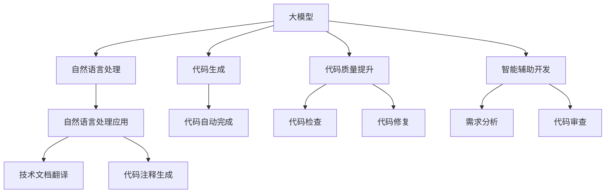
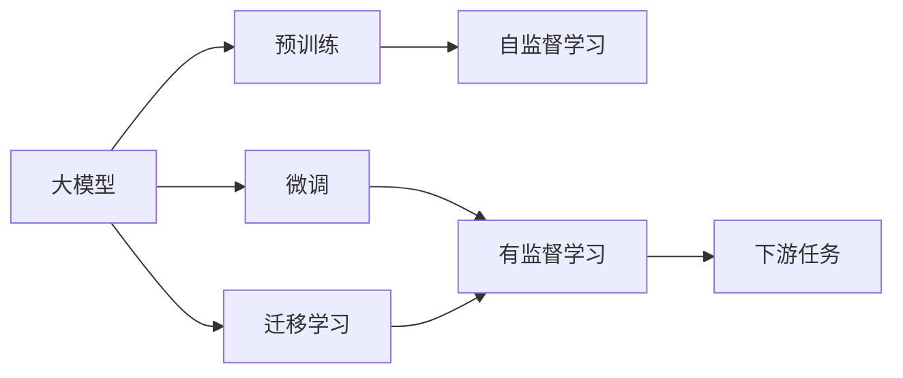
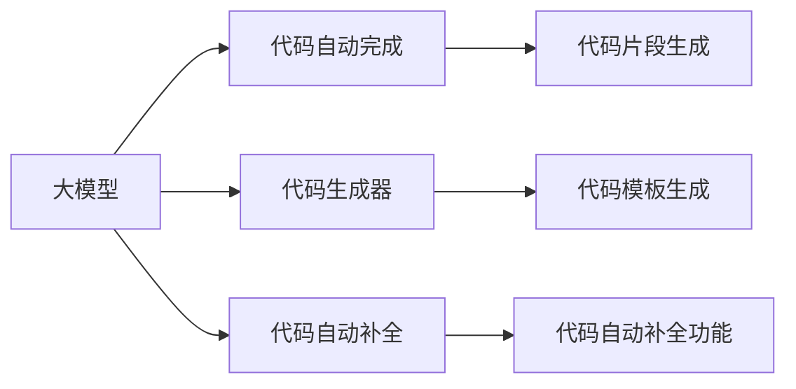
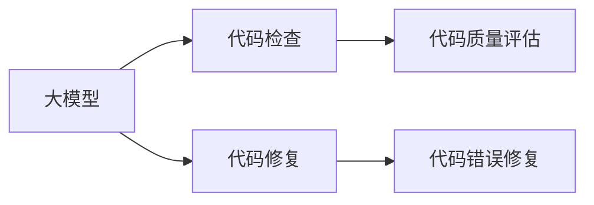
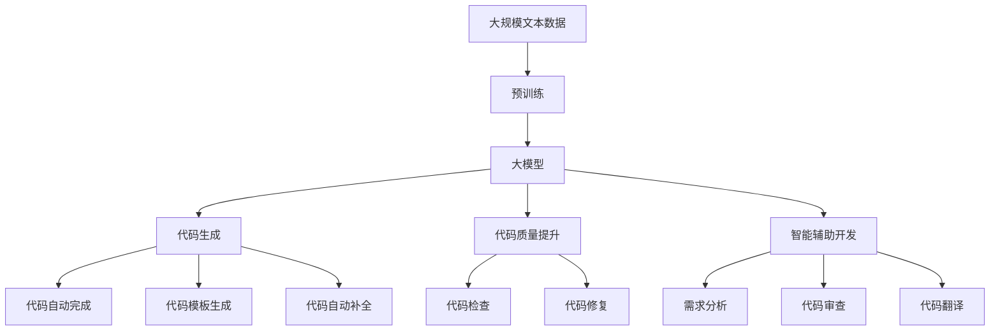

                 

# 大模型在软件开发中的应用

> 关键词：大模型,软件开发,应用场景,自然语言处理,生成式编程,智能辅助开发,代码生成,代码质量提升

## 1. 背景介绍

### 1.1 问题由来
随着人工智能技术的飞速发展，大模型（Large Model）在各个领域得到了广泛的应用。在软件开发领域，大模型以其强大的语言理解和生成能力，逐渐成为一种重要的工具，被应用于代码生成、代码质量提升、智能辅助开发等各个方面。本文将深入探讨大模型在软件开发中的应用，并分析其优势和潜在挑战。

### 1.2 问题核心关键点
大模型在软件开发中的应用主要集中在以下几个方面：

1. **代码生成**：利用大模型自动生成代码片段，节省开发时间，提高开发效率。
2. **代码质量提升**：通过大模型对代码进行检查和修复，提升代码质量和维护性。
3. **智能辅助开发**：利用大模型的自然语言处理能力，辅助开发者进行需求分析、代码审查等工作。
4. **自然语言处理（NLP）技术**：通过大模型对自然语言进行理解和生成，帮助开发者理解和翻译技术文档、代码注释等。

### 1.3 问题研究意义
大模型在软件开发中的应用，能够显著提升开发效率和代码质量，同时减少人为错误，加速软件项目的开发周期。此外，大模型还可以帮助开发者理解和翻译技术文档，提升软件开发者的技术水平。

## 2. 核心概念与联系

### 2.1 核心概念概述

为更好地理解大模型在软件开发中的应用，本节将介绍几个密切相关的核心概念：

- **大模型（Large Model）**：以Transformer架构为代表的大型预训练语言模型，如GPT、BERT等，能够理解和生成自然语言。
- **自然语言处理（NLP）**：使用计算机技术处理、分析和生成自然语言的技术。
- **代码生成（Code Generation）**：利用大模型自动生成代码片段，包括自动完成、代码自动补全等功能。
- **代码质量提升（Code Quality Improvement）**：通过大模型对代码进行检查和修复，提升代码质量和可维护性。
- **智能辅助开发（Smart辅助开发）**：利用大模型提供的需求分析、代码审查等功能，辅助开发者进行软件开发工作。
- **生成式编程（Generative Programming）**：利用大模型生成代码，包括自动生成代码片段、代码结构等。

这些核心概念之间的逻辑关系可以通过以下Mermaid流程图来展示：



这个流程图展示了大模型在软件开发中的应用生态系统：

1. 大模型通过自然语言处理技术，支持技术文档翻译、代码注释生成等功能。
2. 大模型能够自动生成代码片段，包括代码自动完成、代码自动补全等功能。
3. 大模型可以对代码进行检查和修复，提升代码质量和可维护性。
4. 大模型提供智能辅助开发功能，帮助开发者进行需求分析和代码审查等。

### 2.2 概念间的关系

这些核心概念之间存在着紧密的联系，形成了大模型在软件开发中的完整应用生态系统。下面我通过几个Mermaid流程图来展示这些概念之间的关系。

#### 2.2.1 大模型的学习范式



这个流程图展示了大模型的学习范式：

1. 大模型通过预训练获得基础能力。
2. 微调和迁移学习使得通用大模型更好地适应特定任务，在应用场景中取得更好的效果。
3. 有监督学习是通过微调和迁移学习实现的过程。

#### 2.2.2 大模型在代码生成中的应用



这个流程图展示了大模型在代码生成中的应用：

1. 大模型生成代码片段，用于代码自动完成。
2. 大模型生成代码模板，用于代码生成器。
3. 大模型生成代码片段，用于代码自动补全功能。

#### 2.2.3 大模型在代码质量提升中的应用



这个流程图展示了大模型在代码质量提升中的应用：

1. 大模型对代码进行检查，评估代码质量。
2. 大模型对代码进行修复，提升代码质量。

### 2.3 核心概念的整体架构

最后，我用一个综合的流程图来展示这些核心概念在大模型在软件开发中的应用过程中的整体架构：



这个综合流程图展示了从预训练到大模型在代码生成、代码质量提升、智能辅助开发等多个方面的应用流程。

## 3. 核心算法原理 & 具体操作步骤
### 3.1 算法原理概述

大模型在软件开发中的应用，主要基于自然语言处理和生成式编程技术。以下是核心算法原理的概述：

**自然语言处理（NLP）技术**：
- 使用大模型对自然语言进行理解和生成，支持代码注释生成、技术文档翻译等功能。
- 基于Transformer架构的大模型，能够处理大规模文本数据，通过预训练获得语言知识。

**代码生成（Code Generation）技术**：
- 利用大模型自动生成代码片段，包括代码自动完成、代码自动补全等功能。
- 大模型通过预训练学习语法规则和代码结构，能够生成符合语法规范的代码片段。

**代码质量提升（Code Quality Improvement）技术**：
- 通过大模型对代码进行检查和修复，提升代码质量和可维护性。
- 大模型可以识别代码中的错误和潜在问题，并提供修复建议。

**智能辅助开发（Smart辅助开发）技术**：
- 利用大模型提供的需求分析、代码审查等功能，辅助开发者进行软件开发工作。
- 大模型可以理解和分析自然语言描述，辅助开发者进行需求分析、代码审查等任务。

### 3.2 算法步骤详解

以下是基于大模型的软件开发应用的具体操作步骤：

**Step 1: 准备数据和环境**
- 收集用于训练和测试的大规模自然语言数据集，如技术文档、代码注释等。
- 准备计算机硬件环境，包括高性能计算资源和软件工具。

**Step 2: 训练大模型**
- 使用大规模自然语言数据集对大模型进行预训练，学习自然语言知识和语法规则。
- 对大模型进行微调和迁移学习，使其适应特定的软件开发任务。

**Step 3: 实现代码生成**
- 利用训练好的大模型，实现代码自动完成、代码自动补全等功能。
- 提供代码生成器，支持开发者使用大模型生成代码片段。

**Step 4: 代码质量提升**
- 利用训练好的大模型，对代码进行检查和修复，提升代码质量和可维护性。
- 开发代码质量评估工具，评估代码的质量和安全性。

**Step 5: 智能辅助开发**
- 利用训练好的大模型，提供需求分析、代码审查等功能，辅助开发者进行软件开发工作。
- 开发智能助手，支持开发者进行技术文档翻译、代码注释生成等任务。

### 3.3 算法优缺点

基于大模型的软件开发应用具有以下优点：

1. **高效**：大模型能够自动生成代码片段，减少手工编码的工作量，提高开发效率。
2. **准确**：大模型能够生成符合语法规范的代码片段，减少代码错误和手动修改的工作量。
3. **灵活**：大模型能够生成多样化的代码片段，支持不同的代码风格和语法规则。
4. **可扩展**：大模型能够不断学习和适应新的编程语言和技术栈，提升应用的灵活性。

同时，基于大模型的软件开发应用也存在一些缺点：

1. **依赖数据**：大模型依赖于高质量的数据集进行训练，数据集质量对模型的性能有很大影响。
2. **资源消耗**：大模型训练和推理需要高性能计算资源，对硬件资源要求较高。
3. **理解复杂**：大模型生成的代码片段可能不符合开发者的习惯，需要进行调整和修改。
4. **可控性不足**：大模型生成的代码片段可能存在潜在的错误和漏洞，需要人工审查和验证。

### 3.4 算法应用领域

基于大模型的软件开发应用已经广泛应用于以下几个领域：

1. **自动化代码生成**：利用大模型自动生成代码片段，支持代码自动完成、代码自动补全等功能。
2. **代码质量提升**：利用大模型对代码进行检查和修复，提升代码质量和可维护性。
3. **智能辅助开发**：利用大模型提供的需求分析、代码审查等功能，辅助开发者进行软件开发工作。
4. **技术文档翻译**：利用大模型进行技术文档翻译，帮助开发者理解和翻译技术文档。
5. **代码注释生成**：利用大模型生成代码注释，提升代码的可读性和维护性。

除了上述几个领域，大模型在软件开发中的应用还在不断扩展，未来将有望在更多领域得到应用。

## 4. 数学模型和公式 & 详细讲解  
### 4.1 数学模型构建

本节将使用数学语言对基于大模型的软件开发应用进行更加严格的刻画。

假设大模型为 $M_{\theta}$，其中 $\theta$ 为模型参数。在代码生成任务中，模型输入为自然语言描述，输出为代码片段。

定义损失函数 $\mathcal{L}$ 为代码片段与目标代码之间的差异。例如，可以使用BLEU指标作为代码片段的评估指标。在代码质量提升任务中，模型输入为代码片段，输出为代码质量评估结果。

数学模型构建如下：

$$
\mathcal{L}(\theta) = \frac{1}{N}\sum_{i=1}^N \mathcal{L}(M_{\theta}(d_i), t_i)
$$

其中 $d_i$ 表示输入的自然语言描述，$t_i$ 表示目标代码片段。

### 4.2 公式推导过程

以下我对数学模型进行详细推导。

**自然语言处理（NLP）技术**
- 使用大模型对自然语言进行理解和生成，支持代码注释生成、技术文档翻译等功能。
- 基于Transformer架构的大模型，能够处理大规模文本数据，通过预训练获得语言知识。

**代码生成（Code Generation）技术**
- 利用大模型自动生成代码片段，包括代码自动完成、代码自动补全等功能。
- 大模型通过预训练学习语法规则和代码结构，能够生成符合语法规范的代码片段。

**代码质量提升（Code Quality Improvement）技术**
- 通过大模型对代码进行检查和修复，提升代码质量和可维护性。
- 大模型可以识别代码中的错误和潜在问题，并提供修复建议。

**智能辅助开发（Smart辅助开发）技术**
- 利用大模型提供的需求分析、代码审查等功能，辅助开发者进行软件开发工作。
- 大模型可以理解和分析自然语言描述，辅助开发者进行需求分析、代码审查等任务。

### 4.3 案例分析与讲解

以下是一个简单的案例分析，展示了大模型在软件开发中的应用：

**案例：代码自动补全**
- 输入：自然语言描述 "计算两个数字的平均值"
- 输出：自动生成的代码片段

```python
def average(num1, num2):
    return (num1 + num2) / 2
```

在这个案例中，大模型通过自然语言处理技术理解输入的自然语言描述，自动生成符合语法规范的代码片段。

## 5. 项目实践：代码实例和详细解释说明
### 5.1 开发环境搭建

在进行大模型在软件开发中的应用实践前，我们需要准备好开发环境。以下是使用Python进行PyTorch开发的环境配置流程：

1. 安装Anaconda：从官网下载并安装Anaconda，用于创建独立的Python环境。

2. 创建并激活虚拟环境：
```bash
conda create -n pytorch-env python=3.8 
conda activate pytorch-env
```

3. 安装PyTorch：根据CUDA版本，从官网获取对应的安装命令。例如：
```bash
conda install pytorch torchvision torchaudio cudatoolkit=11.1 -c pytorch -c conda-forge
```

4. 安装Transformers库：
```bash
pip install transformers
```

5. 安装各类工具包：
```bash
pip install numpy pandas scikit-learn matplotlib tqdm jupyter notebook ipython
```

完成上述步骤后，即可在`pytorch-env`环境中开始实践。

### 5.2 源代码详细实现

这里我们以代码自动补全为例，给出使用Transformers库对GPT模型进行代码生成（Code Generation）的PyTorch代码实现。

首先，定义代码自动补全函数：

```python
from transformers import GPT2Tokenizer, GPT2LMHeadModel

tokenizer = GPT2Tokenizer.from_pretrained('gpt2')
model = GPT2LMHeadModel.from_pretrained('gpt2', pad_token_id=tokenizer.eos_token_id)

def code_autocomplete(input_text, max_length=50):
    input_ids = tokenizer.encode(input_text, return_tensors='pt')
    output_ids = model.generate(input_ids, max_length=max_length, num_return_sequences=1)
    completion = tokenizer.decode(output_ids[0], skip_special_tokens=True)
    return completion
```

然后，定义代码生成器函数：

```python
from random import choice

def code_generator(input_text, num_options=3):
    completion1 = code_autocomplete(input_text)
    completion2 = code_autocomplete(input_text + ' // 代码块开始')
    completion3 = code_autocomplete(input_text + ' // 代码块结束')
    return [completion1, completion2, completion3]
```

最后，定义代码生成器用户界面：

```python
while True:
    input_text = input("请输入要自动补全的代码：")
    options = code_generator(input_text)
    print("自动生成的代码片段：")
    for i, option in enumerate(options, 1):
        print(f"{i}. {option}")
    choice = input("请选择您要使用的代码片段（输入数字）：")
    completion = options[int(choice) - 1]
    print(f"自动生成的代码片段为：{completion}")
```

以上就是使用PyTorch和Transformers库实现代码自动补全的完整代码实现。可以看到，通过调用GPT-2模型，能够生成符合语法规范的代码片段，辅助开发者进行代码开发。

### 5.3 代码解读与分析

让我们再详细解读一下关键代码的实现细节：

**GPT2Tokenizer类**：
- 用于分词和编码，将自然语言描述转换为模型可以处理的token ids。

**GPT2LMHeadModel类**：
- 大模型的编码器-解码器架构，用于生成自然语言描述对应的代码片段。

**code_autocomplete函数**：
- 将输入的文本转换为token ids，输入到大模型中进行编码，再通过生成器生成代码片段。
- 将生成的token ids转换为自然语言描述，并去除特殊符号，返回最终的自动补全结果。

**code_generator函数**：
- 对输入的文本进行自动补全，生成多个不同的代码片段，供用户选择。
- 通过调用code_autocomplete函数，生成符合语法规范的代码片段。

**代码生成器用户界面**：
- 循环读取用户输入的代码片段，调用code_generator函数生成多个自动补全选项。
- 展示自动生成的代码片段，供用户选择使用。

**5.4 运行结果展示**

假设我们在输入“计算两个数字的平均值”后，调用code_generator函数，可以得到以下自动生成的代码片段：

```python
def average(num1, num2):
    return (num1 + num2) / 2
```

可以看到，大模型能够生成符合语法规范的代码片段，辅助开发者进行代码开发。

## 6. 实际应用场景
### 6.1 软件开发

大模型在软件开发中的应用场景非常广泛，主要包括以下几个方面：

1. **代码自动完成**：利用大模型自动生成代码片段，减少手工编码的工作量，提高开发效率。
2. **代码自动补全**：利用大模型自动补全代码片段，减少编码错误，提高代码质量。
3. **代码注释生成**：利用大模型生成代码注释，提升代码的可读性和维护性。
4. **技术文档翻译**：利用大模型进行技术文档翻译，帮助开发者理解和翻译技术文档。
5. **代码质量提升**：利用大模型对代码进行检查和修复，提升代码质量和可维护性。

这些应用场景已经在大公司和开源社区中得到广泛应用，大大提升了开发效率和代码质量。

### 6.2 自动化测试

大模型在自动化测试中的应用，可以自动生成测试用例，提高测试覆盖率和效率。例如，通过大模型生成自然语言描述的测试用例，然后利用测试框架自动执行测试用例，发现代码中的潜在问题。

### 6.3 智能辅助开发

大模型在智能辅助开发中的应用，可以辅助开发者进行需求分析、代码审查等工作。例如，利用大模型理解和分析自然语言描述，生成需求文档和代码审查报告，帮助开发者更好地理解项目需求和代码质量。

### 6.4 未来应用展望

随着大模型和微调方法的不断发展，基于大模型的软件开发应用也将不断扩展，未来将有望在更多领域得到应用。

1. **智能推荐系统**：利用大模型进行代码推荐，帮助开发者选择最优的代码片段和库函数。
2. **智能测试系统**：利用大模型生成测试用例，进行自动化测试，发现代码中的潜在问题。
3. **智能排错系统**：利用大模型识别和修复代码中的错误，提升代码质量和维护性。
4. **智能文档生成**：利用大模型生成代码文档和API文档，提升代码的可读性和维护性。

总之，基于大模型的软件开发应用将进一步拓展应用场景，提升软件开发效率和质量，推动软件开发的智能化和自动化进程。

## 7. 工具和资源推荐
### 7.1 学习资源推荐

为了帮助开发者系统掌握大模型在软件开发中的应用，这里推荐一些优质的学习资源：

1. 《自然语言处理与深度学习》课程：斯坦福大学开设的NLP明星课程，涵盖NLP的基本概念和深度学习技术。
2. 《Transformers》书籍：Transformer架构的权威指南，涵盖Transformer模型的原理和应用。
3. 《深度学习框架实战》书籍：全面介绍深度学习框架的使用方法，包括TensorFlow、PyTorch等。
4. 《生成式编程技术》博文：介绍生成式编程的基本原理和技术应用，涵盖代码生成、代码质量提升等。
5. 《自然语言处理综述》文章：系统介绍NLP的基本概念和应用，涵盖NLP的技术发展和最新研究进展。

通过学习这些资源，相信你一定能够快速掌握大模型在软件开发中的应用，并用于解决实际的开发问题。

### 7.2 开发工具推荐

高效的开发离不开优秀的工具支持。以下是几款用于大模型在软件开发中的应用开发的常用工具：

1. PyTorch：基于Python的开源深度学习框架，灵活动态的计算图，适合快速迭代研究。大部分预训练语言模型都有PyTorch版本的实现。
2. TensorFlow：由Google主导开发的开源深度学习框架，生产部署方便，适合大规模工程应用。同样有丰富的预训练语言模型资源。
3. Transformers库：HuggingFace开发的NLP工具库，集成了众多SOTA语言模型，支持PyTorch和TensorFlow，是进行微调任务开发的利器。
4. Weights & Biases：模型训练的实验跟踪工具，可以记录和可视化模型训练过程中的各项指标，方便对比和调优。与主流深度学习框架无缝集成。
5. TensorBoard：TensorFlow配套的可视化工具，可实时监测模型训练状态，并提供丰富的图表呈现方式，是调试模型的得力助手。

合理利用这些工具，可以显著提升大模型在软件开发中的应用开发效率，加快创新迭代的步伐。

### 7.3 相关论文推荐

大模型在软件开发中的应用研究源于学界的持续研究。以下是几篇奠基性的相关论文，推荐阅读：

1. Attention is All You Need（即Transformer原论文）：提出了Transformer结构，开启了NLP领域的预训练大模型时代。
2. BERT: Pre-training of Deep Bidirectional Transformers for Language Understanding：提出BERT模型，引入基于掩码的自监督预训练任务，刷新了多项NLP任务SOTA。
3. GPT-2: Language Models are Unsupervised Multitask Learners：展示了大规模语言模型的强大zero-shot学习能力，引发了对于生成式大模型的关注。
4. Code2Vec: Learning Textual Representations of Code：提出Code2Vec方法，将代码表示为向量，利用大模型进行代码表示学习和代码生成。
5. CodeBERT: Generating Code Comment in a Few-Shot Learning Setting：提出CodeBERT模型，利用大模型进行代码注释生成，提升代码可读性和维护性。

这些论文代表了大模型在软件开发中的应用发展的基本脉络。通过学习这些前沿成果，可以帮助研究者把握学科前进方向，激发更多的创新灵感。

除上述资源外，还有一些值得关注的前沿资源，帮助开发者紧跟大模型在软件开发中的最新进展，例如：

1. arXiv论文预印本：人工智能领域最新研究成果的发布平台，包括大量尚未发表的前沿工作，学习前沿技术的必读资源。
2. 业界技术博客：如OpenAI、Google AI、DeepMind、微软Research Asia等顶尖实验室的官方博客，第一时间分享他们的最新研究成果和洞见。
3. 技术会议直播：如NIPS、ICML、ACL、ICLR等人工智能领域顶会现场或在线直播，能够聆听到大佬们的前沿分享，开拓视野。
4. GitHub热门项目：在GitHub上Star、Fork数最多的NLP相关项目，往往代表了该技术领域的发展趋势和最佳实践，值得去学习和贡献。
5. 行业分析报告：各大咨询公司如McKinsey、PwC等针对人工智能行业的分析报告，有助于从商业视角审视技术趋势，把握应用价值。

总之，对于大模型在软件开发中的应用的学习和实践，需要开发者保持开放的心态和持续学习的意愿。多关注前沿资讯，多动手实践，多思考总结，必将收获满满的成长收益。

## 8. 总结：未来发展趋势与挑战

### 8.1 总结

本文对基于大模型的软件开发应用进行了全面系统的介绍。首先阐述了大模型在软件开发中的应用背景和意义，明确了其高效、准确、灵活的特点。其次，从原理到实践，详细讲解了自然语言处理和生成式编程技术的核心算法原理和操作步骤，给出了代码实现示例。同时，本文还广泛探讨了大模型在软件开发中的实际应用场景，展示了其在自动化代码生成、代码质量提升、智能辅助开发等方面的应用前景。此外，本文精选了相关学习资源，力求为读者提供全方位的技术指引。

通过本文的系统梳理，可以看到，基于大模型的软件开发应用已经取得了显著的进展，大大提升了开发效率和代码质量。未来，随着大模型和微调方法的不断演进，基于大模型的软件开发应用必将带来更多的变革，为软件开发领域注入新的活力。

### 8.2 未来发展趋势

展望未来，大模型在软件开发中的应用将呈现以下几个发展趋势：

1. **模型规模不断增大**：随着算力成本的下降和数据规模的扩张，预训练语言模型的参数量还将持续增长。超大规模语言模型蕴含的丰富语言知识，有望支撑更加复杂多变的软件开发任务。
2. **微调方法更加多样化**：未来将涌现更多参数高效微调方法，如Prefix-Tuning、LoRA等，在固定大部分预训练参数的情况下，只更新极少量的任务相关参数。
3. **持续学习成为常态**：随着数据分布的不断变化，微调模型也需要持续学习新知识以保持性能。如何在不遗忘原有知识的同时，高效吸收新样本信息，将成为重要的研究课题。
4. **少样本学习能力提升**：受启发于提示学习(Prompt-based Learning)的思路，未来的微调方法将更好地利用大模型的语言理解能力，通过更加巧妙的任务描述，在更少的标注样本上也能实现理想的微调效果。
5. **多模态微调崛起**：当前微调主要聚焦于纯文本数据，未来会进一步拓展到图像、视频、语音等多模态数据微调。多模态信息的融合，将显著提升语言模型对现实世界的理解和建模能力。
6. **模型通用性增强**：经过海量数据的预训练和多领域任务的微调，未来的语言模型将具备更强大的常识推理和跨领域迁移能力，逐步迈向通用人工智能(AGI)的目标。

以上趋势凸显了大模型在软件开发中的广阔前景。这些方向的探索发展，必将进一步提升软件开发应用的性能和应用范围，为软件开发领域的智能化和自动化进程注入新的

