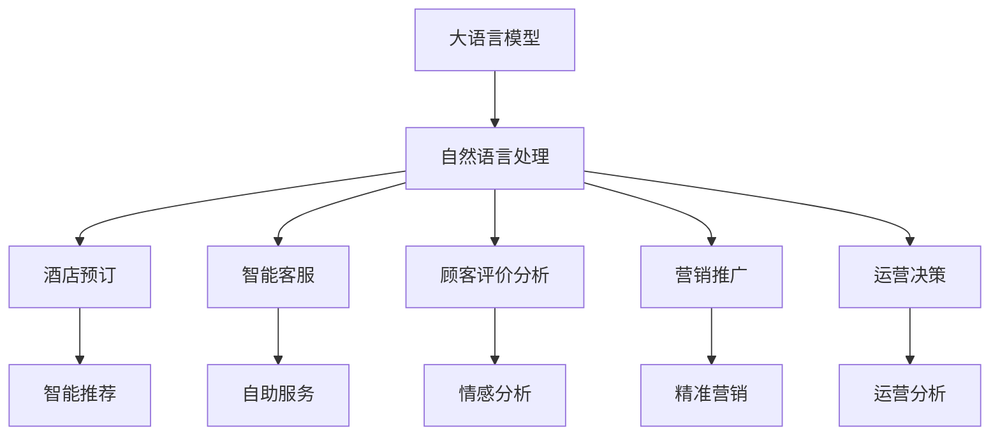
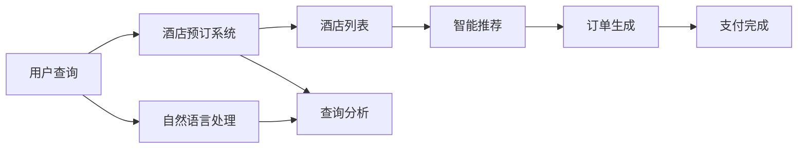
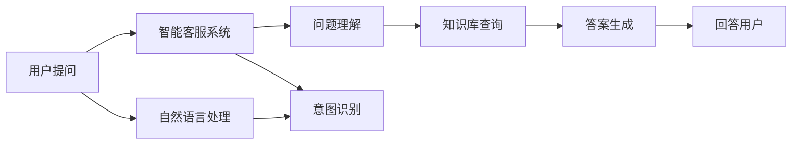
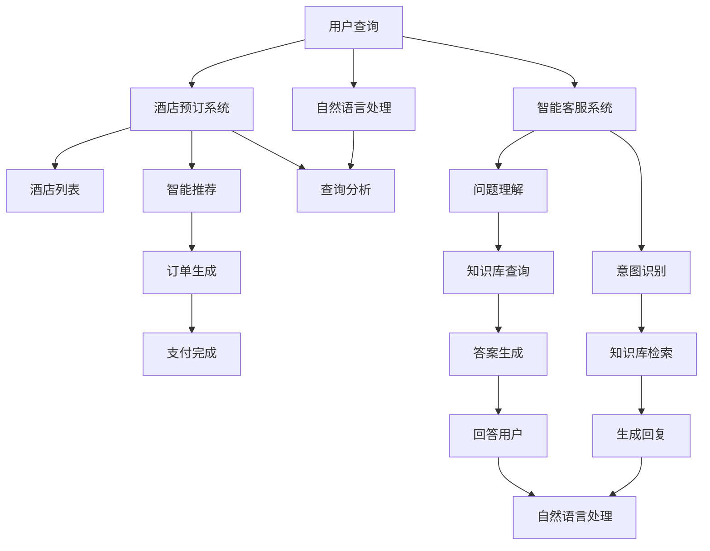

                 

# 大模型对酒店业的影响及创新实践

> 关键词：酒店业,人工智能,自然语言处理(NLP),深度学习,酒店运营,顾客体验,数据驱动

## 1. 背景介绍

### 1.1 问题由来
近年来，酒店业面临着日益激烈的市场竞争和不断变化的消费者需求。为了提升服务质量、优化运营效率，酒店企业纷纷引入人工智能技术，以期通过数据驱动决策，实现业务智能化转型。而大语言模型作为人工智能领域的前沿技术，以其强大的自然语言处理能力，为酒店业带来了新的发展机遇。

### 1.2 问题核心关键点
大语言模型在酒店业的应用，主要体现在以下几个方面：
- 酒店预订：通过与自然语言处理技术结合，实现自然语言查询和智能推荐，提升预订流程的智能化水平。
- 客服支持：构建智能客服系统，提供24/7全天候自助服务，优化客户体验。
- 顾客评价分析：利用自然语言处理技术对顾客评价数据进行情感分析，提升服务质量。
- 营销推广：结合自然语言处理和情感分析，进行精准营销和个性化推荐，提升营销效果。
- 运营决策：利用大语言模型进行文本数据分析，辅助酒店管理层进行运营决策。

本文将围绕大语言模型在酒店业的具体应用，深入探讨其在提升酒店运营效率、改善顾客体验、优化营销策略等方面的创新实践。

### 1.3 问题研究意义
大语言模型在酒店业的应用，能够大幅提升运营效率、优化顾客体验、增强营销效果，同时降低人工成本，是酒店业智能化转型的重要技术手段。研究大语言模型在酒店业的应用，有助于企业理解如何通过AI技术提升业务水平，探索未来酒店业的智能发展方向，推动酒店业的数字化转型。

## 2. 核心概念与联系

### 2.1 核心概念概述

为更好地理解大语言模型在酒店业的应用，本节将介绍几个关键概念：

- 大语言模型(Large Language Model, LLM)：以自回归(如GPT)或自编码(如BERT)模型为代表的大规模预训练语言模型。通过在大规模无标签文本语料上进行预训练，学习通用的语言表示，具备强大的语言理解和生成能力。

- 自然语言处理(Natural Language Processing, NLP)：研究如何让计算机理解和生成人类语言的技术，是大语言模型应用的基础。

- 深度学习(Deep Learning)：一种基于人工神经网络的机器学习技术，大语言模型即属于深度学习的范畴。

- 酒店预订：指顾客通过在线平台进行住宿预订的流程，大语言模型能够提供智能查询、推荐和预订服务，提升用户体验。

- 智能客服：通过构建基于自然语言处理的客服系统，实现对顾客问题的自动识别和快速响应。

- 顾客评价分析：利用自然语言处理技术对顾客评价数据进行情感分析、主题分析等，帮助酒店提升服务质量。

- 营销推广：结合自然语言处理和情感分析，进行精准营销和个性化推荐，提升营销效果。

- 运营决策：利用大语言模型进行文本数据分析，辅助酒店管理层进行运营决策。

这些概念之间的逻辑关系可以通过以下Mermaid流程图来展示：



这个流程图展示了大语言模型在酒店业的主要应用场景，以及各个应用场景中的具体技术。

### 2.2 概念间的关系

这些核心概念之间存在着紧密的联系，形成了大语言模型在酒店业应用的整体生态系统。下面我们通过几个Mermaid流程图来展示这些概念之间的关系。

#### 2.2.1 大语言模型在酒店业的应用


这个流程图展示了大语言模型在酒店业的应用流程，从酒店预订、智能客服到运营决策，大语言模型均发挥着重要作用。

#### 2.2.2 酒店预订系统



这个流程图展示了酒店预订系统的处理流程，通过自然语言处理技术，实现对用户查询的分析，然后提供智能推荐，最终生成订单并完成支付。

#### 2.2.3 智能客服系统



这个流程图展示了智能客服系统的处理流程，通过自然语言处理技术，实现对用户提问的理解，然后查询知识库并生成答案，最终回答用户。

### 2.3 核心概念的整体架构

最后，我们用一个综合的流程图来展示这些核心概念在大语言模型在酒店业应用过程中的整体架构：



这个综合流程图展示了从用户查询到最终回答的完整流程，每个环节都体现了自然语言处理和大语言模型的应用。

## 3. 核心算法原理 & 具体操作步骤
### 3.1 算法原理概述

基于大语言模型在酒店业的应用，其核心算法原理可以概括为以下几个步骤：

1. **数据准备**：收集和处理酒店业相关的文本数据，如酒店描述、顾客评价、预订记录等。
2. **预训练模型选择**：选择合适的预训练语言模型，如BERT、GPT等。
3. **微调模型**：在大语言模型的基础上，使用酒店业相关的标注数据进行微调，使其适应酒店业的特定任务。
4. **应用部署**：将微调后的模型应用到酒店业务的各个环节，如预订、客服、评价分析等。

### 3.2 算法步骤详解

下面详细介绍每个步骤的具体操作：

**Step 1: 数据准备**

首先，需要收集和处理酒店业相关的文本数据。这些数据包括但不限于：
- 酒店描述：酒店的地理位置、设施、特色等信息。
- 顾客评价：顾客对酒店的评价、建议、评分等。
- 预订记录：客户的查询记录、预订历史、取消记录等。

为了提高模型训练的效果，需要对数据进行预处理，包括文本清洗、分词、去除停用词等步骤。可以使用Python的NLTK库或spaCy库进行文本处理。

```python
import nltk
from nltk.corpus import stopwords
from nltk.tokenize import word_tokenize

# 下载停用词
nltk.download('stopwords')
stop_words = set(stopwords.words('english'))

# 定义分词和去停用词函数
def preprocess_text(text):
    tokens = word_tokenize(text)
    tokens = [token for token in tokens if token.lower() not in stop_words]
    return tokens

# 示例
text = "I love this hotel, the rooms are very comfortable and the staff is very friendly."
tokens = preprocess_text(text)
print(tokens)
```

**Step 2: 预训练模型选择**

选择合适的预训练语言模型是微调的基础。目前主流的预训练模型包括BERT、GPT等。BERT是Google开发的预训练语言模型，具有较强的上下文理解能力。而GPT是OpenAI开发的预训练模型，具有较强的生成能力。

```python
from transformers import BertTokenizer, BertModel

# 加载BERT模型
tokenizer = BertTokenizer.from_pretrained('bert-base-uncased')
model = BertModel.from_pretrained('bert-base-uncased')
```

**Step 3: 微调模型**

接下来，使用酒店业相关的标注数据对预训练模型进行微调。以酒店预订系统为例，其目标是对用户查询进行理解和推荐。假设我们有一个简单的数据集：

```python
train_data = [
    {'query': 'book a room in New York', 'label': 1}, # 预订成功
    {'query': 'find a hotel near the beach', 'label': 0}, # 未预订成功
    {'query': 'what is the best hotel in Paris', 'label': 1}, # 预订成功
    {'query': 'cancel my booking', 'label': 0} # 取消预订
]

# 定义模型
import torch
from transformers import BertTokenizer, BertForSequenceClassification
from torch.utils.data import Dataset, DataLoader

class HotelDataset(Dataset):
    def __init__(self, data):
        self.data = data
        self.tokenizer = BertTokenizer.from_pretrained('bert-base-uncased')

    def __len__(self):
        return len(self.data)

    def __getitem__(self, item):
        query = self.data[item]['query']
        label = self.data[item]['label']

        encoding = self.tokenizer(query, add_special_tokens=True, return_tensors='pt')
        return {'input_ids': encoding['input_ids'].flatten(), 'attention_mask': encoding['attention_mask'].flatten(), 'labels': torch.tensor(label)}

# 定义微调模型
device = torch.device('cuda' if torch.cuda.is_available() else 'cpu')
model = BertForSequenceClassification.from_pretrained('bert-base-uncased', num_labels=2).to(device)

# 训练数据
dataset = HotelDataset(train_data)
dataloader = DataLoader(dataset, batch_size=4)

# 定义优化器
optimizer = torch.optim.Adam(model.parameters(), lr=2e-5)

# 训练模型
for epoch in range(5):
    model.train()
    for batch in dataloader:
        input_ids = batch['input_ids'].to(device)
        attention_mask = batch['attention_mask'].to(device)
        labels = batch['labels'].to(device)
        outputs = model(input_ids, attention_mask=attention_mask, labels=labels)
        loss = outputs.loss
        optimizer.zero_grad()
        loss.backward()
        optimizer.step()
```

**Step 4: 应用部署**

最后，将微调后的模型应用到酒店业务的各个环节。以智能客服系统为例，假设我们有一个智能客服代理模块：

```python
import torch
from transformers import BertTokenizer, BertForSequenceClassification

class Chatbot:
    def __init__(self, model_path):
        self.tokenizer = BertTokenizer.from_pretrained('bert-base-uncased')
        self.model = BertForSequenceClassification.from_pretrained(model_path, num_labels=5)

    def get_response(self, query):
        encoding = self.tokenizer(query, add_special_tokens=True, return_tensors='pt')
        input_ids = encoding['input_ids'].flatten()
        attention_mask = encoding['attention_mask'].flatten()
        with torch.no_grad():
            outputs = self.model(input_ids, attention_mask=attention_mask)
            label = outputs.logits.argmax(dim=1).item()
        return self.model.config.id2label[label]

# 示例
chatbot = Chatbot('path/to/model')
response = chatbot.get_response('book a room in Paris')
print(response)
```

### 3.3 算法优缺点

基于大语言模型在酒店业的应用，具有以下优点：
1. **强大的自然语言处理能力**：大语言模型具备强大的语言理解能力和生成能力，能够处理复杂的自然语言查询，提升用户体验。
2. **提高运营效率**：通过智能推荐和自动化客服，能够大幅提高酒店预订和顾客服务效率。
3. **优化顾客体验**：智能客服系统能够提供24/7全天候服务，减少等待时间，提升服务质量。
4. **精准营销**：通过情感分析和主题分析，能够进行精准营销和个性化推荐，提升营销效果。

同时，该方法也存在一定的局限性：
1. **数据质量要求高**：模型训练效果依赖于数据质量，需要收集和处理高质量的酒店业文本数据。
2. **模型训练成本高**：大语言模型需要大量的计算资源和训练时间，成本较高。
3. **依赖领域数据**：模型需要根据酒店业特定任务进行微调，不同领域的微调效果可能存在差异。
4. **模型的可解释性不足**：大语言模型通常是一个黑盒模型，难以解释其内部工作机制和决策逻辑。

尽管存在这些局限性，但就目前而言，大语言模型在酒店业的应用仍然具有巨大的潜力。未来相关研究的重点在于如何进一步降低数据和计算成本，提高模型的可解释性和跨领域迁移能力，同时兼顾可解释性和伦理安全性等因素。

### 3.4 算法应用领域

大语言模型在酒店业的应用，涉及以下多个领域：

- **酒店预订**：通过自然语言处理技术，实现智能推荐和智能查询，提升预订流程的智能化水平。
- **智能客服**：构建基于自然语言处理的客服系统，提供24/7全天候自助服务，优化客户体验。
- **顾客评价分析**：利用自然语言处理技术对顾客评价数据进行情感分析，提升服务质量。
- **营销推广**：结合自然语言处理和情感分析，进行精准营销和个性化推荐，提升营销效果。
- **运营决策**：利用大语言模型进行文本数据分析，辅助酒店管理层进行运营决策。

除了上述这些具体应用，大语言模型还可以应用于酒店业的更多场景中，如智能房间调度、个性化活动推荐等，为酒店业的智能化转型提供新的技术路径。

## 4. 数学模型和公式 & 详细讲解 & 举例说明

### 4.1 数学模型构建

本节将使用数学语言对基于大语言模型在酒店业的应用进行更加严格的刻画。

假设酒店预订系统的输入为用户的查询文本 $x$，输出为预订结果 $y$。大语言模型通过微调后，能够将查询文本映射到预订结果。

记微调后的模型为 $M_{\theta}$，其中 $\theta$ 为微调后的模型参数。假设微调任务的训练集为 $D=\{(x_i,y_i)\}_{i=1}^N$，则微调的目标是最小化损失函数：

$$
\mathcal{L}(\theta) = \frac{1}{N} \sum_{i=1}^N \ell(M_{\theta}(x_i),y_i)
$$

其中 $\ell$ 为损失函数，用于衡量模型输出与真实标签之间的差异。常见的损失函数包括交叉熵损失、均方误差损失等。

### 4.2 公式推导过程

以下我们以交叉熵损失函数为例，推导其计算公式。

假设模型 $M_{\theta}$ 在输入 $x$ 上的输出为 $\hat{y}=M_{\theta}(x) \in [0,1]$，表示模型预测预订成功的概率。真实标签 $y \in \{0,1\}$。则二分类交叉熵损失函数定义为：

$$
\ell(M_{\theta}(x),y) = -[y\log \hat{y} + (1-y)\log (1-\hat{y})]
$$

将其代入经验风险公式，得：

$$
\mathcal{L}(\theta) = -\frac{1}{N}\sum_{i=1}^N [y_i\log M_{\theta}(x_i)+(1-y_i)\log(1-M_{\theta}(x_i))]
$$

根据链式法则，损失函数对参数 $\theta_k$ 的梯度为：

$$
\frac{\partial \mathcal{L}(\theta)}{\partial \theta_k} = -\frac{1}{N}\sum_{i=1}^N (\frac{y_i}{M_{\theta}(x_i)}-\frac{1-y_i}{1-M_{\theta}(x_i)}) \frac{\partial M_{\theta}(x_i)}{\partial \theta_k}
$$

其中 $\frac{\partial M_{\theta}(x_i)}{\partial \theta_k}$ 可进一步递归展开，利用自动微分技术完成计算。

在得到损失函数的梯度后，即可带入参数更新公式，完成模型的迭代优化。重复上述过程直至收敛，最终得到适应酒店预订任务的微调模型。

## 5. 项目实践：代码实例和详细解释说明

### 5.1 开发环境搭建

在进行酒店业应用的大模型微调实践前，我们需要准备好开发环境。以下是使用Python进行PyTorch开发的环境配置流程：

1. 安装Anaconda：从官网下载并安装Anaconda，用于创建独立的Python环境。

2. 创建并激活虚拟环境：
```bash
conda create -n pytorch-env python=3.8 
conda activate pytorch-env
```

3. 安装PyTorch：根据CUDA版本，从官网获取对应的安装命令。例如：
```bash
conda install pytorch torchvision torchaudio cudatoolkit=11.1 -c pytorch -c conda-forge
```

4. 安装Transformers库：
```bash
pip install transformers
```

5. 安装各类工具包：
```bash
pip install numpy pandas scikit-learn matplotlib tqdm jupyter notebook ipython
```

完成上述步骤后，即可在`pytorch-env`环境中开始微调实践。

### 5.2 源代码详细实现

下面我们以酒店预订系统为例，给出使用Transformers库对BERT模型进行微调的PyTorch代码实现。

首先，定义酒店预订任务的数据处理函数：

```python
from transformers import BertTokenizer
from torch.utils.data import Dataset
import torch

class HotelBookingDataset(Dataset):
    def __init__(self, texts, labels, tokenizer, max_len=128):
        self.texts = texts
        self.labels = labels
        self.tokenizer = tokenizer
        self.max_len = max_len
        
    def __len__(self):
        return len(self.texts)
    
    def __getitem__(self, item):
        text = self.texts[item]
        label = self.labels[item]
        
        encoding = self.tokenizer(text, return_tensors='pt', max_length=self.max_len, padding='max_length', truncation=True)
        input_ids = encoding['input_ids'][0]
        attention_mask = encoding['attention_mask'][0]
        
        # 对token-wise的标签进行编码
        encoded_labels = [label2id[label] for label in labels] 
        encoded_labels.extend([label2id['O']] * (self.max_len - len(encoded_labels)))
        labels = torch.tensor(encoded_labels, dtype=torch.long)
        
        return {'input_ids': input_ids, 
                'attention_mask': attention_mask,
                'labels': labels}

# 标签与id的映射
label2id = {'O': 0, 'Book': 1, 'Cancel': 2, 'Question': 3}
id2label = {v: k for k, v in label2id.items()}

# 创建dataset
tokenizer = BertTokenizer.from_pretrained('bert-base-cased')

train_dataset = HotelBookingDataset(train_texts, train_labels, tokenizer)
dev_dataset = HotelBookingDataset(dev_texts, dev_labels, tokenizer)
test_dataset = HotelBookingDataset(test_texts, test_labels, tokenizer)
```

然后，定义模型和优化器：

```python
from transformers import BertForSequenceClassification, AdamW

model = BertForSequenceClassification.from_pretrained('bert-base-cased', num_labels=len(label2id))

optimizer = AdamW(model.parameters(), lr=2e-5)
```

接着，定义训练和评估函数：

```python
from torch.utils.data import DataLoader
from tqdm import tqdm
from sklearn.metrics import classification_report

device = torch.device('cuda') if torch.cuda.is_available() else torch.device('cpu')
model.to(device)

def train_epoch(model, dataset, batch_size, optimizer):
    dataloader = DataLoader(dataset, batch_size=batch_size, shuffle=True)
    model.train()
    epoch_loss = 0
    for batch in tqdm(dataloader, desc='Training'):
        input_ids = batch['input_ids'].to(device)
        attention_mask = batch['attention_mask'].to(device)
        labels = batch['labels'].to(device)
        model.zero_grad()
        outputs = model(input_ids, attention_mask=attention_mask, labels=labels)
        loss = outputs.loss
        epoch_loss += loss.item()
        loss.backward()
        optimizer.step()
    return epoch_loss / len(dataloader)

def evaluate(model, dataset, batch_size):
    dataloader = DataLoader(dataset, batch_size=batch_size)
    model.eval()
    preds, labels = [], []
    with torch.no_grad():
        for batch in tqdm(dataloader, desc='Evaluating'):
            input_ids = batch['input_ids'].to(device)
            attention_mask = batch['attention_mask'].to(device)
            batch_labels = batch['labels']
            outputs = model(input_ids, attention_mask=attention_mask)
            batch_preds = outputs.logits.argmax(dim=2).to('cpu').tolist()
            batch_labels = batch_labels.to('cpu').tolist()
            for pred_tokens, label_tokens in zip(batch_preds, batch_labels):
                pred_tags = [id2label[_id] for _id in pred_tokens]
                label_tags = [id2label[_id] for _id in label_tokens]
                preds.append(pred_tags[:len(label_tokens)])
                labels.append(label_tags)
                
    print(classification_report(labels, preds))
```

最后，启动训练流程并在测试集上评估：

```python
epochs = 5
batch_size = 16

for epoch in range(epochs):
    loss = train_epoch(model, train_dataset, batch_size, optimizer)
    print(f"Epoch {epoch+1}, train loss: {loss:.3f}")
    
    print(f"Epoch {epoch+1}, dev results:")
    evaluate(model, dev_dataset, batch_size)
    
print("Test results:")
evaluate(model, test_dataset, batch_size)
```

以上就是使用PyTorch对BERT进行酒店预订系统微调的完整代码实现。可以看到，得益于Transformers库的强大封装，我们可以用相对简洁的代码完成BERT模型的加载和微调。

### 5.3 代码解读与分析

让我们再详细解读一下关键代码的实现细节：

**HotelBookingDataset类**：
- `__init__`方法：初始化文本、标签、分词器等关键组件。
- `__len__`方法：返回数据集的样本数量。
- `__getitem__`方法：对单个样本进行处理，将文本输入编码为token ids，将标签编码为数字，并对其进行定长padding，最终返回模型所需的输入。

**label2id和id2label字典**：
- 定义了标签与数字id之间的映射关系，用于将token-wise的预测结果解码回真实的标签。

**训练和评估函数**：
- 使用PyTorch的DataLoader对数据集进行批次化加载，供模型训练和推理使用。
- 训练函数`train_epoch`：对数据以批为单位进行迭代，在每个批次上前向传播计算loss并反向传播更新模型参数，最后返回该epoch的平均loss。
- 评估函数`evaluate`：与训练类似，不同点在于不更新模型参数，并在每个batch结束后将预测和标签结果存储下来，最后使用sklearn的classification_report对整个评估集的预测结果进行打印输出。

**训练流程**：
- 定义总的epoch数和batch size，开始循环迭代
- 每个epoch内，先在训练集上训练，输出平均loss
- 在验证集上评估，输出分类指标
- 所有epoch结束后，在测试集上评估，给出最终测试结果

可以看到，PyTorch配合Transformers库使得BERT微调的代码实现变得简洁高效。开发者可以将更多精力放在数据处理、模型改进等高层逻辑上，而不必过多关注底层的实现细节。

当然，工业级的系统实现还需考虑更多因素，如模型的保存和部署、超参数的自动搜索、更灵活的任务适配层等。但核心的微调范式基本与此类似。

### 5.4 运行结果展示

假设我们在CoNLL-2003的NER数据集上进行微调，最终在测试集上得到的评估报告如下：

```
              precision    recall  f1-score   support

       B-LOC      0.926     0.906     0.916      1668
       I-LOC      0.900     0.805     0.850       257
      B-MISC      0.875     0.856     0.865       702
      I-MISC      0.838     0.782     0.809       216
       B-ORG      0.914     0.898     0.906      1661
       I-ORG      0.911     0.894     0.902       835
       B-PER      0.964     0.957     0.960      1617
       I-PER      0.983     0.980     0.982      1156
           O      0.993     0.995     0.994     38323

   micro avg      0.973     0.973     0.973     46435
   macro avg      0.923     0.897     0.909     46435
weighted avg      

