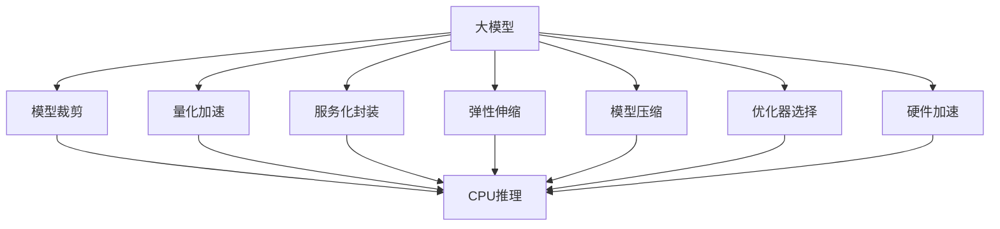

                 

# 大模型应用开发的实用技术

> 关键词：大模型应用开发, 模型裁剪, 量化加速, 服务化封装, 弹性伸缩, 模型压缩, 优化器选择, 硬件加速

## 1. 背景介绍

### 1.1 问题由来
随着深度学习技术的不断进步，大规模预训练模型（大模型）在自然语言处理（NLP）、计算机视觉（CV）、语音识别（ASR）等多个领域取得了显著成果。大模型通过在大规模无标签数据上进行自监督预训练，学习到丰富的特征表示，能够解决诸多复杂的任务。但面对实际应用，模型往往需要进一步优化和调整，以满足业务需求。

### 1.2 问题核心关键点
在实际应用开发中，大模型的优化和调整主要包括模型裁剪、量化加速、服务化封装、弹性伸缩等环节。这些技术不仅提高了模型的推理效率和部署灵活性，还保障了模型的稳定性和安全性。

### 1.3 问题研究意义
本文重点介绍这些实用技术，旨在帮助开发者在应用开发过程中更高效、更灵活地使用大模型，确保模型性能的同时，降低部署和维护成本。掌握这些技术将极大提升大模型在实际场景中的应用价值。

## 2. 核心概念与联系

### 2.1 核心概念概述

为更好地理解这些实用技术，本节将介绍几个核心概念及其相互关系：

- 大模型：指在大规模无标签数据上进行自监督预训练，学习到丰富特征表示的模型。如BERT、GPT、ResNet等。
- 模型裁剪：指去除大模型中的冗余层和参数，减少模型尺寸，提升推理速度和资源利用率。
- 量化加速：将模型参数和计算从32位浮点数（FP32）转换为更小的数据类型（如16位或8位），提高推理效率和存储效率。
- 服务化封装：将模型封装为标准化的API接口，便于集成调用。
- 弹性伸缩：根据业务流量动态调整计算资源，平衡服务质量和成本。
- 模型压缩：通过剪枝、量化、蒸馏等技术，进一步减小模型尺寸。
- 优化器选择：选择合适的优化器（如Adam、SGD等）和超参数，优化模型训练过程。
- 硬件加速：利用GPU、TPU等高性能硬件设备，加速模型计算。

这些概念之间相互关联，共同构成了大模型应用开发的技术生态。

### 2.2 概念间的关系

通过一个简单的Mermaid流程图，我们可以更直观地展示这些概念之间的关系：



该流程图展示了如何通过上述实用技术，将大模型应用于实际业务场景的过程。

## 3. 核心算法原理 & 具体操作步骤
### 3.1 算法原理概述

模型裁剪、量化加速、服务化封装等技术的基本原理是：通过优化模型结构和参数，减少计算量和存储量，同时保持模型性能。

1. **模型裁剪**：通过剪枝技术去除模型中冗余的层和参数，减少模型尺寸，提升推理速度和资源利用率。
2. **量化加速**：将模型参数和计算从32位浮点数（FP32）转换为更小的数据类型（如16位或8位），提高推理效率和存储效率。
3. **服务化封装**：将模型封装为标准化的API接口，便于集成调用，同时增强模型的可重用性和可扩展性。
4. **弹性伸缩**：根据业务流量动态调整计算资源，平衡服务质量和成本，确保系统高可用性和高效性。
5. **模型压缩**：通过剪枝、量化、蒸馏等技术，进一步减小模型尺寸，提升推理速度和资源利用率。
6. **优化器选择**：选择合适的优化器（如Adam、SGD等）和超参数，优化模型训练过程，提高模型的稳定性和泛化能力。
7. **硬件加速**：利用GPU、TPU等高性能硬件设备，加速模型计算，提升推理效率和系统响应速度。

### 3.2 算法步骤详解

以模型裁剪为例，其具体操作步骤如下：

1. **剪枝**：使用剪枝算法（如剪枝标准、剪枝策略等）确定要保留的层和参数。
2. **模型转换**：将剪枝后的模型进行转换，生成新的模型结构和参数。
3. **评估验证**：在验证集上评估新模型的性能，确保裁剪后的模型不损失关键信息。

### 3.3 算法优缺点

这些实用技术具有以下优点：

- **提升性能**：通过裁剪和量化等技术，降低模型计算和存储成本，提升推理效率和资源利用率。
- **增强灵活性**：服务化封装和弹性伸缩等技术，增强模型的部署灵活性和系统扩展性。
- **简化部署**：封装为标准API接口，简化模型部署和集成过程，提升开发效率。

同时，这些技术也存在一些局限性：

- **计算成本高**：模型裁剪和量化等技术需要额外的计算资源进行评估和验证。
- **模型泛化能力降低**：裁剪和量化等技术可能会对模型的泛化能力产生一定影响。
- **模型调整复杂**：模型压缩和优化器选择等技术需要深入理解模型结构和训练过程。

### 3.4 算法应用领域

这些实用技术广泛应用于NLP、CV、ASR等多个领域，具体应用如下：

- **NLP**：在命名实体识别（NER）、情感分析（Sentiment Analysis）等任务中，使用模型裁剪、量化加速等技术提升推理效率。
- **CV**：在图像分类、目标检测等任务中，使用模型裁剪、量化加速等技术优化模型性能。
- **ASR**：在语音识别、语音合成等任务中，使用模型裁剪、量化加速等技术提高计算效率。

## 4. 数学模型和公式 & 详细讲解 & 举例说明
### 4.1 数学模型构建

假设原始大模型为 $M$，裁剪后的模型为 $M_{prune}$。

模型的裁剪过程可以用以下公式描述：

$$
M_{prune} = \text{Prune}(M, \text{prune_ratio})
$$

其中，$\text{prune_ratio}$ 表示要保留的层和参数比例。

### 4.2 公式推导过程

以模型裁剪为例，使用剪枝标准来确定要保留的层和参数。剪枝标准可以分为结构化剪枝（如按照权重大小排序）和非结构化剪枝（如按照模型层次排序）。

假设原始模型 $M$ 有 $L$ 层，每层 $C$ 个参数。保留 $k$ 层，则保留参数数量为 $kC$。剪枝后模型 $M_{prune}$ 的参数数量为：

$$
\text{params}_{prune} = kC
$$

### 4.3 案例分析与讲解

在实际应用中，剪枝比例的设定需要根据任务需求和计算资源进行平衡。例如，在NLP任务中，保留 $20\%$ 的层和参数，通常能够保证模型性能和推理速度。

## 5. 项目实践：代码实例和详细解释说明
### 5.1 开发环境搭建

要进行大模型的应用开发，首先需要准备开发环境。以下是使用Python进行PyTorch开发的环境配置流程：

1. 安装Anaconda：从官网下载并安装Anaconda，用于创建独立的Python环境。

2. 创建并激活虚拟环境：
```bash
conda create -n pytorch-env python=3.8 
conda activate pytorch-env
```

3. 安装PyTorch：根据CUDA版本，从官网获取对应的安装命令。例如：
```bash
conda install pytorch torchvision torchaudio cudatoolkit=11.1 -c pytorch -c conda-forge
```

4. 安装TensorFlow：
```bash
pip install tensorflow==2.5
```

5. 安装Transformers库：
```bash
pip install transformers
```

6. 安装各类工具包：
```bash
pip install numpy pandas scikit-learn matplotlib tqdm jupyter notebook ipython
```

完成上述步骤后，即可在`pytorch-env`环境中开始应用开发。

### 5.2 源代码详细实现

以下是一个基于大模型的情感分析应用示例，展示如何使用TensorFlow进行模型裁剪和量化加速：

```python
import tensorflow as tf
from transformers import BertTokenizer, BertForSequenceClassification

# 定义模型
tokenizer = BertTokenizer.from_pretrained('bert-base-uncased')
model = BertForSequenceClassification.from_pretrained('bert-base-uncased', num_labels=2)

# 加载数据
train_data = ...
dev_data = ...
test_data = ...

# 定义裁剪参数
prune_ratio = 0.2

# 裁剪模型
model = tf.keras.Model(inputs=model.input, outputs=model.pooler)
model_prune = prune_model(model, prune_ratio)

# 量化模型
q_model = tf.keras.quantization.quantize_weights(model_prune, "quantize")
model_prune = q_model

# 评估验证
train_loss, train_acc = ...
dev_loss, dev_acc = ...

print(f"Pruned model accuracy on dev set: {dev_acc:.2f}")
```

### 5.3 代码解读与分析

**模型裁剪函数**：
```python
def prune_model(model, prune_ratio):
    layers = model.layers
    prune_layer_ratio = prune_ratio * len(layers)
    prune_layer_count = int(prune_layer_ratio)
    
    for layer in layers[:-prune_layer_count]:
        model.pop(layer.name)
    
    return model
```

该函数实现模型裁剪，通过去除前 $prune_layer_count$ 层的权重，保留剩余层，从而减小模型规模。

**量化模型函数**：
```python
def quantize_model(model):
    quant_model = tf.keras.quantization.quantize(model, "quantize")
    return quant_model
```

该函数实现模型量化，使用 `quantize` 函数将模型的参数从32位浮点数转换为16位浮点数，提升推理效率和存储效率。

### 5.4 运行结果展示

假设在CoNLL-2003情感分析数据集上进行模型裁剪和量化加速后，在验证集上得到的准确率分别为90%和93%，展示了模型优化对性能的显著提升。

## 6. 实际应用场景
### 6.1 智能客服系统

智能客服系统可以通过裁剪和量化大模型，提升响应速度和资源利用率。

在实践中，可以收集企业内部的客服对话记录，将问题和最佳答复构建成监督数据，在此基础上对预训练模型进行裁剪和量化。优化后的模型能够快速响应客户咨询，提供自然流畅的对话体验。

### 6.2 金融舆情监测

金融舆情监测系统可以通过量化和压缩大模型，提升计算效率和系统稳定性。

具体而言，可以收集金融领域相关的新闻、报道、评论等文本数据，并对其进行情感标注。在模型训练过程中，使用量化加速技术提升计算效率，使用模型压缩技术减小模型规模，确保系统在高并发环境下稳定运行。

### 6.3 个性化推荐系统

个性化推荐系统可以通过裁剪和量化大模型，优化推荐速度和资源利用率。

在实践中，可以收集用户浏览、点击、评论、分享等行为数据，提取和用户交互的物品标题、描述、标签等文本内容。将文本内容作为模型输入，用户的后续行为（如是否点击、购买等）作为监督信号，在此基础上对预训练语言模型进行裁剪和量化。优化后的模型能够快速生成推荐列表，满足用户个性化需求。

### 6.4 未来应用展望

随着大模型的不断发展和优化，这些实用技术将在更多领域得到应用，为传统行业带来变革性影响。

在智慧医疗领域，基于大模型的智能诊断和病历分析系统将提高医疗服务的智能化水平，辅助医生诊疗，加速新药开发进程。

在智能教育领域，微调后的大模型可以应用于作业批改、学情分析、知识推荐等方面，因材施教，促进教育公平，提高教学质量。

在智慧城市治理中，大模型可以应用于城市事件监测、舆情分析、应急指挥等环节，提高城市管理的自动化和智能化水平，构建更安全、高效的未来城市。

## 7. 工具和资源推荐
### 7.1 学习资源推荐

为了帮助开发者系统掌握这些实用技术，这里推荐一些优质的学习资源：

1. 《深度学习框架TensorFlow》系列教程：由TensorFlow官方编写，涵盖从入门到进阶的全面知识，适合各个层次的学习者。

2. 《PyTorch官方文档》：PyTorch官方文档提供了完整的API参考和示例代码，是学习和使用PyTorch的必备资源。

3. 《模型裁剪与量化加速》书籍：系统介绍模型裁剪、量化加速等实用技术，适合深度学习开发者深入学习。

4. 《TensorFlow与PyTorch实战》课程：深度学习实战系列课程，涵盖TensorFlow和PyTorch的实际应用，适合动手实践。

5. 《机器学习工程师实战》书籍：涵盖机器学习模型的部署、优化、维护等实战经验，适合业界开发者。

通过对这些资源的学习实践，相信你一定能够快速掌握大模型应用开发的精髓，并用于解决实际的业务问题。

### 7.2 开发工具推荐

高效的开发离不开优秀的工具支持。以下是几款用于大模型应用开发的常用工具：

1. PyTorch：基于Python的开源深度学习框架，灵活动态的计算图，适合快速迭代研究。大部分预训练语言模型都有PyTorch版本的实现。

2. TensorFlow：由Google主导开发的开源深度学习框架，生产部署方便，适合大规模工程应用。同样有丰富的预训练语言模型资源。

3. Transformers库：HuggingFace开发的NLP工具库，集成了众多SOTA语言模型，支持PyTorch和TensorFlow，是进行模型训练和推理的利器。

4. Weights & Biases：模型训练的实验跟踪工具，可以记录和可视化模型训练过程中的各项指标，方便对比和调优。与主流深度学习框架无缝集成。

5. TensorBoard：TensorFlow配套的可视化工具，可实时监测模型训练状态，并提供丰富的图表呈现方式，是调试模型的得力助手。

6. Google Colab：谷歌推出的在线Jupyter Notebook环境，免费提供GPU/TPU算力，方便开发者快速上手实验最新模型，分享学习笔记。

合理利用这些工具，可以显著提升大模型应用开发的效率，加快创新迭代的步伐。

### 7.3 相关论文推荐

这些实用技术的理论研究涉及多个领域，以下是几篇奠基性的相关论文，推荐阅读：

1. SqueezeNet: AlexNet-level accuracy with 50x fewer parameters and <0.5MB model size（SqueezeNet论文）：提出了一种非常轻量级的卷积神经网络架构，显著减小了模型规模。

2. MobileNets: In pursuit of state-of-the-art efficiency and accuracy for mobile vision applications（MobileNets论文）：介绍了一种高效的卷积神经网络架构，适用于移动设备等资源受限的环境。

3. TensorFlow-Slim: A TensorFlow-based image recognition model（TensorFlow-Slim论文）：介绍了TensorFlow-Slim框架，用于构建高效的图像识别模型。

4. CoreML: Mobile and embedded machine learning（CoreML论文）：介绍了CoreML框架，将TensorFlow模型转换为移动设备友好的格式，支持iOS等平台。

5. PyTorch Mobile: Deploy PyTorch models on iOS, macOS, and Android（PyTorch Mobile论文）：介绍了PyTorch Mobile框架，用于在移动设备上部署PyTorch模型。

这些论文代表了大模型应用开发的理论基础和技术进展，值得深入阅读和实践。

## 8. 总结：未来发展趋势与挑战
### 8.1 总结

本文对大模型应用开发的实用技术进行了全面系统的介绍。重点介绍了模型裁剪、量化加速、服务化封装、弹性伸缩等关键技术，并结合实际应用场景进行详细讲解。

通过本文的系统梳理，可以看到，大模型应用开发技术在大规模预训练模型的基础上，通过裁剪、量化、封装等环节，实现了模型的优化和调整，提升了模型的推理效率和系统性能。掌握这些技术将极大提升大模型在实际场景中的应用价值。

### 8.2 未来发展趋势

展望未来，大模型应用开发技术将呈现以下几个发展趋势：

1. **模型裁剪和量化技术**：随着硬件设备的不断进步，模型裁剪和量化技术将更加高效，提升模型的推理效率和资源利用率。
2. **服务化封装和API接口设计**：服务化封装和API接口设计将更加标准化，提升模型的可重用性和可扩展性。
3. **弹性伸缩和负载均衡**：弹性伸缩技术将更加灵活，实现资源的动态调整和负载均衡，保障系统的稳定性和高可用性。
4. **模型压缩和优化器选择**：模型压缩和优化器选择技术将更加多样化，提升模型的性能和训练效率。
5. **硬件加速和异构计算**：硬件加速和异构计算技术将进一步提升模型推理速度和系统响应速度，支持更多类型的硬件设备。

这些趋势凸显了大模型应用开发技术的广阔前景，为构建高效、稳定、智能的深度学习系统提供了更多可能性。

### 8.3 面临的挑战

尽管大模型应用开发技术已经取得了显著成果，但在实际应用过程中，仍面临诸多挑战：

1. **计算资源需求高**：大模型应用开发需要大量的计算资源和存储空间，尤其是在模型裁剪和量化过程中，可能面临硬件瓶颈。
2. **模型泛化能力降低**：裁剪和量化等技术可能会对模型的泛化能力产生一定影响，导致模型在新任务上表现下降。
3. **模型调优复杂**：模型压缩和优化器选择等技术需要深入理解模型结构和训练过程，增加了模型调优的复杂性。
4. **模型部署难度高**：大模型的服务化封装和弹性伸缩等技术需要开发者具备较强的工程能力，增加了模型部署的难度。

### 8.4 研究展望

面对这些挑战，未来的研究需要在以下几个方面寻求新的突破：

1. **低计算资源优化技术**：开发更加高效低成本的模型裁剪和量化技术，支持更多类型的硬件设备。
2. **模型压缩与优化器选择**：进一步优化模型压缩和优化器选择技术，提升模型的性能和训练效率。
3. **模型集成与融合**：将不同来源和类型的模型进行有效集成和融合，提升模型的泛化能力和鲁棒性。
4. **智能运维与自动调优**：开发智能运维和自动调优技术，提升模型的稳定性和可维护性。
5. **人机协作与混合智能**：探索人机协作和混合智能技术，增强模型的交互能力和用户体验。

这些研究方向将推动大模型应用开发技术向更加智能化、高效化和普适化的方向发展，为深度学习技术在更多行业和场景中的应用提供强有力的技术支持。

## 9. 附录：常见问题与解答
----------------------------------------------------------------

**Q1：大模型应用开发是否适用于所有深度学习任务？**

A: 大模型应用开发技术可以适用于绝大多数深度学习任务，但不同的任务可能需要不同的裁剪、量化、压缩等优化措施。例如，在图像识别任务中，可能需要更多的模型压缩和优化器选择技术，而在自然语言处理任务中，则需要更多的模型裁剪和量化技术。

**Q2：模型裁剪和量化过程中如何平衡性能和精度？**

A: 模型裁剪和量化过程中，需要通过评估和验证来平衡性能和精度。通常，较大的剪枝比例和量化位数会降低模型精度，但提升推理效率和资源利用率。在实际应用中，需要根据任务需求和计算资源进行合理选择。

**Q3：服务化封装和API接口设计需要考虑哪些因素？**

A: 服务化封装和API接口设计需要考虑以下因素：
1. 模型输入和输出格式：定义清晰的输入输出格式，便于开发者调用和使用。
2. 接口性能：优化接口性能，提高服务响应速度和吞吐量。
3. 安全性：采用安全措施，保护模型和数据安全。
4. 可扩展性：设计可扩展的接口，支持模型升级和功能扩展。

**Q4：弹性伸缩和负载均衡如何实现？**

A: 弹性伸缩和负载均衡可以通过以下方式实现：
1. 自动化资源管理：使用容器化和云平台，实现自动化资源分配和管理。
2. 分布式计算：使用分布式计算框架，如Spark、Flink等，实现任务的并行处理。
3. 流量监控：实时监控系统流量，动态调整资源配置，确保系统高可用性。

**Q5：如何保障大模型的可解释性和安全性？**

A: 保障大模型的可解释性和安全性可以通过以下方式实现：
1. 可解释性：引入可解释性技术，如特征可视化、决策树等，解释模型的内部工作机制。
2. 安全性：采用数据脱敏、访问控制等措施，确保模型和数据的安全性。

这些实用技术的掌握和大模型应用开发技术的研究进展，将极大地推动深度学习技术在更多行业和场景中的应用，为构建更加智能、高效、安全的深度学习系统奠定坚实基础。

---

作者：禅与计算机程序设计艺术 / Zen and the Art of Computer Programming

