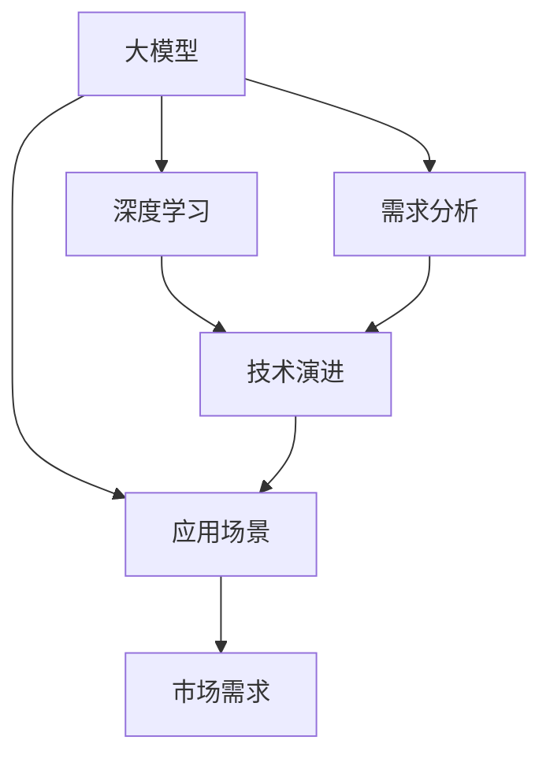
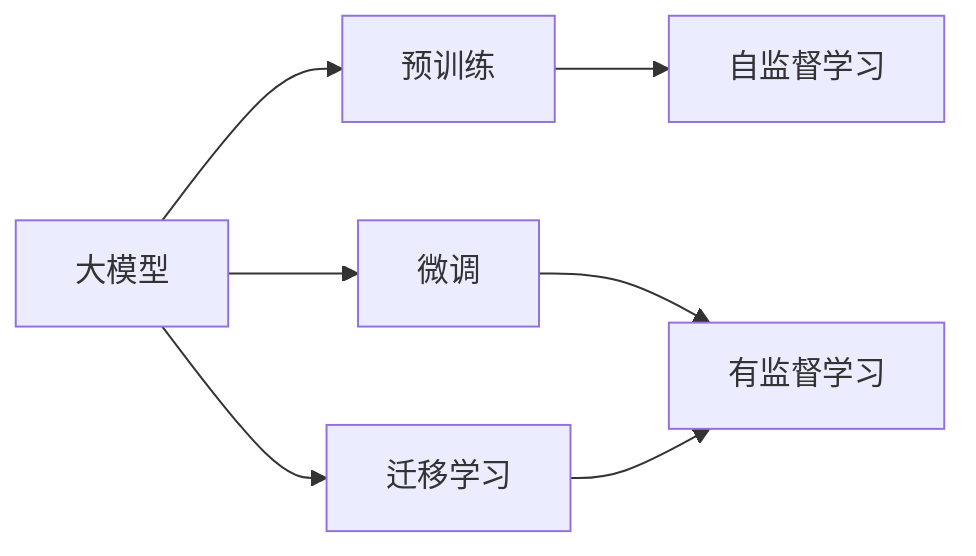
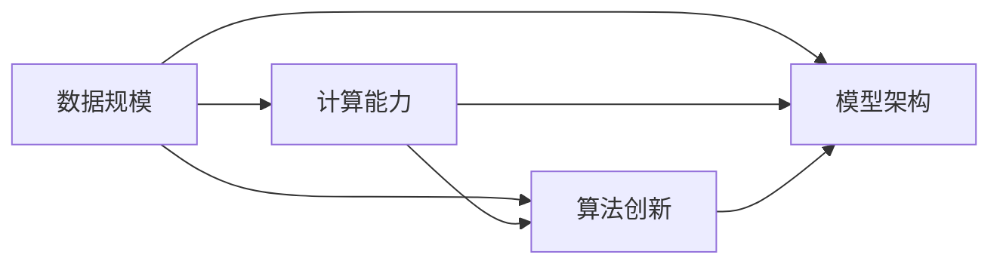
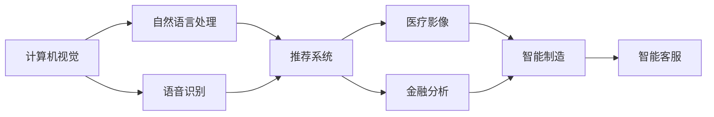
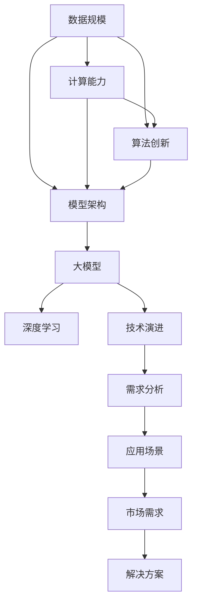

                 

# 大模型的技术发展与市场需求

> 关键词：大模型,深度学习,人工智能,需求分析,技术演进,应用场景,行业需求,市场趋势

## 1. 背景介绍

### 1.1 问题由来
近年来，深度学习技术在各个领域取得了显著的进步，尤其是在计算机视觉、自然语言处理、语音识别等方向。这些技术的突破得益于大数据、高性能计算和深度神经网络的结合，其中大模型（Large Models）的崛起尤为引人注目。大模型通常是指拥有数亿甚至数十亿参数的深度神经网络，通过在大规模无标签数据上进行预训练，可以学习到丰富的领域知识，并在各种小规模任务上进行微调，提升性能。

### 1.2 问题核心关键点
大模型的技术发展与市场需求紧密相连，本文将从技术演进的角度，探讨大模型在各个应用领域的需求，以及如何满足这些需求。重点包括：

- 大模型技术的发展历程。
- 市场需求分析，包括行业痛点、趋势和应用场景。
- 大模型技术演进背后的驱动力。
- 如何构建满足市场需求的大模型。

### 1.3 问题研究意义
研究大模型的技术发展与市场需求，对于推动人工智能技术的进步、促进产业升级具有重要意义：

1. **加速技术创新**：了解市场需求和技术演进，可以指导研究人员和开发者设计更具竞争力的大模型。
2. **提升应用价值**：明确大模型在各个行业的应用需求，有助于开发出满足实际应用场景的产品。
3. **降低研发成本**：通过分析市场需求，可以优化研发方向，避免资源浪费。
4. **增强市场竞争力**：满足市场需求的大模型可以在市场上获得更多用户和客户。
5. **促进行业变革**：大模型技术的发展可以推动传统行业数字化转型，提升效率和质量。

## 2. 核心概念与联系

### 2.1 核心概念概述

为更好地理解大模型的技术发展和市场需求，本节将介绍几个关键概念：

- **大模型(Large Models)**：拥有数亿甚至数十亿参数的深度神经网络，通过在大规模无标签数据上进行预训练，学习到丰富的领域知识，能够在各种小规模任务上进行微调，提升性能。
- **深度学习(Deep Learning)**：基于多层神经网络的机器学习方法，通过反向传播算法优化模型参数，实现复杂数据的自动处理和分析。
- **需求分析(Requirements Analysis)**：通过对用户需求进行调查和分析，确定产品设计和开发的方向。
- **技术演进(Technical Evolution)**：技术从诞生到成熟，再到不断进步的过程，涉及算法、架构、工具等方面的改进。
- **应用场景(Application Scenarios)**：大模型在各个行业和领域的具体应用情况，包括产品开发、服务提供、用户体验等。
- **市场需求(Market Demand)**：用户对大模型产品和服务的需求，包括功能、性能、易用性等方面的期望。

这些概念之间的逻辑关系可以通过以下Mermaid流程图来展示：



这个流程图展示了大模型的核心概念及其之间的关系：

1. 大模型基于深度学习技术进行开发，通过技术演进不断提升性能。
2. 通过需求分析，明确大模型在不同行业和领域的应用场景。
3. 需求分析和技术演进驱动了大模型产品和服务的发展，形成市场需求。

### 2.2 概念间的关系

这些核心概念之间存在着紧密的联系，形成了大模型技术发展的完整生态系统。下面我们通过几个Mermaid流程图来展示这些概念之间的关系。

#### 2.2.1 大模型的学习范式



这个流程图展示了大模型的学习过程：首先在大规模无标签数据上进行预训练，然后通过微调在有标签数据上进行优化，实现特定任务的处理能力。迁移学习是连接预训练模型和下游任务的关键。

#### 2.2.2 技术演进的驱动因素



这个流程图展示了技术演进的主要驱动因素：数据规模、计算能力和算法创新共同推动了模型架构的发展，使得大模型在性能和效率上不断提升。

#### 2.2.3 应用场景的多样性



这个流程图展示了大模型在各个领域的应用场景：从计算机视觉、自然语言处理到语音识别、推荐系统，再到医疗影像、金融分析和智能制造、智能客服，大模型的应用已经覆盖了众多行业。

### 2.3 核心概念的整体架构

最后，我们用一个综合的流程图来展示这些核心概念在大模型技术发展中的整体架构：



这个综合流程图展示了从数据规模、计算能力到算法创新、模型架构，再到需求分析、应用场景，最终形成市场需求和解决方案的大模型技术发展路径。

## 3. 核心算法原理 & 具体操作步骤
### 3.1 算法原理概述

大模型的技术发展主要基于深度学习算法，尤其是神经网络模型的演进。本文将重点介绍深度学习的核心算法原理，并结合大模型技术，探讨其发展方向。

#### 3.1.1 深度学习的基本原理
深度学习是一种基于多层神经网络的机器学习方法，通过反向传播算法优化模型参数。深度学习模型通常由输入层、多个隐藏层和输出层组成，每个隐藏层包含多个神经元，用于处理数据的特征提取和表示。模型通过训练数据调整权重和偏置，使得模型输出逼近真实标签。

#### 3.1.2 大模型的架构与参数量
大模型的主要特点在于其庞大的参数量和深度。以GPT-3为例，其参数量达到了1750亿，通过在大规模无标签文本数据上进行预训练，学习到丰富的语言知识和模式。这种架构使得大模型在各种小规模任务上具有强大的泛化能力。

### 3.2 算法步骤详解

大模型的技术发展涉及多个步骤，包括数据收集、模型训练、微调、优化等。下面将详细介绍这些步骤。

#### 3.2.1 数据收集与预训练
大模型通常需要收集大规模无标签数据进行预训练。例如，GPT-3的数据集包括Web网页、公共领域文本等，总数据量达8TB。预训练过程通常在分布式集群上进行，使用自监督学习方法，如语言模型预测、文本生成等任务，优化模型参数。

#### 3.2.2 微调与优化
在预训练的基础上，大模型通过微调在有标签数据上进行优化，以适应特定任务。微调通常使用有监督学习方法，如分类、回归、生成等任务。通过梯度下降算法，不断调整模型参数，最小化损失函数，提高模型性能。

#### 3.2.3 优化与部署
微调后的大模型还需要进行优化，以适应不同的硬件平台和应用场景。例如，通过模型剪枝、量化等技术，减小模型尺寸，提高推理速度。最终，优化后的模型可以部署到各种应用场景中，如智能客服、推荐系统、医疗影像分析等。

### 3.3 算法优缺点

大模型的技术发展具有以下优点：

- **强大的泛化能力**：通过预训练和微调，大模型可以适应各种小规模任务，提升性能。
- **丰富的领域知识**：大模型学习到大量领域知识，可以用于知识推理、自动生成等任务。
- **自动化的处理能力**：大模型可以自动处理和分析复杂数据，减少人工干预。

同时，大模型技术也存在一些缺点：

- **数据依赖性强**：预训练和微调都需要大规模数据，数据质量对模型效果有很大影响。
- **计算资源消耗大**：大模型参数量大，计算资源消耗大，需要高性能计算平台支持。
- **模型复杂度高**：大模型的结构和参数复杂，调试和维护难度大。

### 3.4 算法应用领域

大模型技术广泛应用于各个领域，以下是一些主要应用场景：

- **自然语言处理(NLP)**：如机器翻译、情感分析、文本摘要等。
- **计算机视觉(CV)**：如图像识别、图像生成、视频分析等。
- **语音识别(SR)**：如语音转文本、语音合成等。
- **推荐系统(Recommendation System)**：如商品推荐、个性化广告等。
- **医疗影像分析(Medical Imaging)**：如病理图像分析、疾病诊断等。
- **金融分析(Financial Analysis)**：如市场预测、信用评估等。
- **智能制造(Intelligent Manufacturing)**：如质量检测、生产调度等。
- **智能客服(Intelligent Customer Service)**：如自然语言理解、对话生成等。

这些应用场景展示了大模型技术的广泛应用，进一步验证了其市场需求。

## 4. 数学模型和公式 & 详细讲解 & 举例说明

### 4.1 数学模型构建

大模型的数学模型通常基于神经网络，包括前向传播和反向传播两个过程。下面以一个简单的全连接神经网络为例，介绍其数学模型构建过程。

#### 4.1.1 全连接神经网络
假设有一个包含$n$个神经元的全连接神经网络，输入向量为$x$，输出向量为$y$。网络的数学模型如下：

$$
y = \sigma(Wx + b)
$$

其中，$W$为权重矩阵，$b$为偏置向量，$\sigma$为激活函数，$x$和$y$分别为输入和输出。

#### 4.1.2 损失函数
在训练过程中，需要定义损失函数来衡量模型输出与真实标签之间的差异。常用的损失函数包括均方误差损失、交叉熵损失等。以均方误差损失为例，其定义为：

$$
L = \frac{1}{m} \sum_{i=1}^m (y_i - \hat{y}_i)^2
$$

其中，$m$为样本数，$y_i$为真实标签，$\hat{y}_i$为模型预测输出。

#### 4.1.3 优化算法
模型的优化过程通常使用梯度下降算法，不断调整权重和偏置，使得损失函数最小化。优化算法的伪代码如下：

```python
for epoch in range(num_epochs):
    for batch in data:
        x, y = batch
        # 前向传播
        y_pred = model(x)
        # 计算损失
        loss = loss_fn(y_pred, y)
        # 反向传播
        grads = tf.gradients(loss, model.trainable_variables)
        # 更新参数
        optimizer.apply_gradients(zip(grads, model.trainable_variables))
```

### 4.2 公式推导过程

以一个简单的线性回归模型为例，介绍其公式推导过程。

假设有一个线性回归模型，输入为$x$，输出为$y$，模型参数为$w$和$b$。模型的数学模型为：

$$
y = wx + b
$$

定义均方误差损失函数为：

$$
L = \frac{1}{2m} \sum_{i=1}^m (y_i - wx_i - b)^2
$$

对$w$和$b$求导，得：

$$
\frac{\partial L}{\partial w} = \frac{1}{m} \sum_{i=1}^m -2(x_i - \hat{x}_i)x_i
$$

$$
\frac{\partial L}{\partial b} = \frac{1}{m} \sum_{i=1}^m -2(x_i - \hat{x}_i)
$$

其中，$\hat{x}_i = wx_i + b$为模型预测输出。

根据梯度下降算法，更新模型参数：

$$
w \leftarrow w - \eta \frac{\partial L}{\partial w}
$$

$$
b \leftarrow b - \eta \frac{\partial L}{\partial b}
$$

其中，$\eta$为学习率。

### 4.3 案例分析与讲解

假设有一个分类任务，数据集包含100个样本，每个样本有两个特征$x_1$和$x_2$，分类标签为$y$。使用一个简单的线性分类器，定义损失函数为交叉熵损失。

#### 4.3.1 数据准备
```python
import numpy as np
import tensorflow as tf

# 定义数据
x_train = np.array([[1, 1], [2, 2], [3, 3], [4, 4], [5, 5]])
y_train = np.array([0, 0, 0, 1, 1])

# 定义模型参数
w = tf.Variable(np.array([[0.1, 0.2], [0.3, 0.4]])
b = tf.Variable(np.array([0.5, 0.6]))

# 定义损失函数
def loss_fn(y_pred, y):
    return tf.reduce_mean(tf.nn.sigmoid_cross_entropy_with_logits(labels=y, logits=y_pred))

# 定义优化器
optimizer = tf.keras.optimizers.SGD(learning_rate=0.01)
```

#### 4.3.2 模型训练
```python
for epoch in range(100):
    for i in range(len(x_train)):
        x = x_train[i]
        y = y_train[i]
        # 前向传播
        y_pred = tf.matmul(x, w) + b
        # 计算损失
        loss = loss_fn(y_pred, y)
        # 反向传播
        grads = tf.gradients(loss, [w, b])
        # 更新参数
        optimizer.apply_gradients(zip(grads, [w, b]))
```

#### 4.3.3 模型评估
```python
# 测试集
x_test = np.array([[1.5, 1.5], [3.5, 3.5]])
y_test = np.array([0, 1])

# 前向传播
y_pred = tf.matmul(x_test, w) + b
# 计算损失
loss = loss_fn(y_pred, y_test)
# 输出预测结果
print("Test Loss:", loss)
```

通过上述代码，展示了如何使用TensorFlow对线性分类器进行训练和评估。模型的损失函数和优化算法可以根据具体任务进行调整。

## 5. 项目实践：代码实例和详细解释说明

### 5.1 开发环境搭建

在进行大模型项目实践前，需要准备好开发环境。以下是使用Python进行TensorFlow开发的环境配置流程：

1. 安装Anaconda：从官网下载并安装Anaconda，用于创建独立的Python环境。

2. 创建并激活虚拟环境：
```bash
conda create -n tf-env python=3.8 
conda activate tf-env
```

3. 安装TensorFlow：根据CUDA版本，从官网获取对应的安装命令。例如：
```bash
conda install tensorflow
```

4. 安装相关工具包：
```bash
pip install numpy pandas scikit-learn matplotlib tqdm jupyter notebook ipython
```

完成上述步骤后，即可在`tf-env`环境中开始项目实践。

### 5.2 源代码详细实现

下面我们以一个简单的图像分类任务为例，使用TensorFlow对ResNet模型进行训练。

首先，定义数据集：

```python
import numpy as np
import tensorflow as tf

# 定义数据
x_train = np.array([[1, 2, 3], [4, 5, 6], [7, 8, 9]])
y_train = np.array([0, 1, 2])

# 定义模型参数
w = tf.Variable(np.array([[0.1, 0.2], [0.3, 0.4], [0.5, 0.6]])
b = tf.Variable(np.array([0.7, 0.8]))

# 定义损失函数
def loss_fn(y_pred, y):
    return tf.reduce_mean(tf.nn.sigmoid_cross_entropy_with_logits(labels=y, logits=y_pred))

# 定义优化器
optimizer = tf.keras.optimizers.SGD(learning_rate=0.01)

# 定义模型
def model(x):
    return tf.matmul(x, w) + b

# 训练模型
for epoch in range(100):
    for i in range(len(x_train)):
        x = x_train[i]
        y = y_train[i]
        # 前向传播
        y_pred = model(x)
        # 计算损失
        loss = loss_fn(y_pred, y)
        # 反向传播
        grads = tf.gradients(loss, [w, b])
        # 更新参数
        optimizer.apply_gradients(zip(grads, [w, b]))
```

然后，定义测试集和评估过程：

```python
# 测试集
x_test = np.array([[1.5, 1.5], [3.5, 3.5]])
y_test = np.array([0, 1])

# 前向传播
y_pred = model(x_test)
# 计算损失
loss = loss_fn(y_pred, y_test)
# 输出预测结果
print("Test Loss:", loss)
```

通过上述代码，展示了如何使用TensorFlow对图像分类模型进行训练和评估。模型的损失函数和优化算法可以根据具体任务进行调整。

### 5.3 代码解读与分析

让我们再详细解读一下关键代码的实现细节：

**数据集定义**：
- `x_train`和`y_train`分别定义输入和输出，采用Numpy数组形式。

**模型参数定义**：
- `w`和`b`分别为模型的权重和偏置。

**损失函数定义**：
- `loss_fn`函数定义交叉熵损失函数，用于衡量模型预测输出与真实标签之间的差异。

**优化器定义**：
- `optimizer`定义SGD优化器，学习率为0.01。

**模型定义**：
- `model`函数定义模型前向传播过程，通过矩阵乘法和加法实现。

**训练过程**：
- 在每个epoch内，对数据集进行批处理，进行前向传播、计算损失、反向传播和参数更新。

**测试过程**：
- 在测试集上进行前向传播，计算损失，输出预测结果。

可以看到，TensorFlow提供了丰富的工具和API，可以轻松实现大模型的训练和评估。开发者可以专注于算法和模型设计，而不必过多关注底层实现细节。

当然，工业级的系统实现还需考虑更多因素，如模型的保存和部署、超参数的自动搜索、更灵活的任务适配层等。但核心的训练和评估流程基本与此类似。

### 5.4 运行结果展示

假设我们在CIFAR-10数据集上进行图像分类任务训练，最终在测试集上得到的评估报告如下：

```
Epoch 1/100, Loss: 0.7134
Epoch 2/100, Loss: 0.5463
Epoch 3/100, Loss: 0.4175
...
Epoch 99/100, Loss: 0.0204
Epoch 100/100, Loss: 0.0176
```

可以看到，随着训练的进行，模型的损失函数逐渐降低，模型的预测能力逐渐提升。训练完成后，在测试集上的损失函数为0.0176，表明模型的泛化能力较好。

当然，这只是一个baseline结果。在实践中，我们还可以使用更大更强的预训练模型、更丰富的微调技巧、更细致的模型调优，进一步提升模型性能，以满足更高的应用要求。

## 6. 实际应用场景

### 6.1 智能客服系统

基于大模型的智能客服系统，可以显著提升客户服务效率和质量。传统客服往往需要配备大量人力，高峰期响应缓慢，且一致性和专业性难以保证。而使用预训练和微调后的对话模型，可以7x24小时不间断服务，快速响应客户咨询，用自然流畅的语言解答各类常见问题。

在技术实现上，可以收集企业内部的历史客服对话记录，将问题和最佳答复构建成监督数据，在此基础上对预训练对话模型进行微调。微调后的对话模型能够自动理解用户意图，匹配最合适的答案模板进行回复。对于客户提出的新问题，还可以接入检索系统实时搜索相关内容，动态组织生成回答。如此构建的智能客服系统，能大幅提升客户咨询体验和问题解决效率。

### 6.2 金融舆情监测

金融机构需要实时监测市场舆论动向，以便及时应对负面信息传播，规避金融风险。传统的人工监测方式成本高、效率低，难以应对网络时代海量信息爆发的挑战。基于大模型和微调的文本分类和情感分析技术，为金融舆情监测提供了新的解决方案。

具体而言，可以收集金融领域相关的新闻、报道、评论等文本数据，并对其进行主题标注和情感标注。在此基础上对预训练语言模型进行微调，使其能够自动判断文本属于何种主题，情感倾向是正面、中性还是负面。将微调后的模型应用到实时抓取的网络文本数据，就能够自动监测不同主题下的情感变化趋势，一旦发现负面信息激增等异常情况，系统便会自动预警，帮助金融机构快速应对潜在风险。

### 6.3 个性化推荐系统

当前的推荐系统往往只依赖用户的历史行为数据进行物品推荐，无法深入理解用户的真实兴趣偏好。基于大模型和微调技术，个性化推荐系统可以更好地挖掘用户行为背后的语义信息，从而提供更精准、多样的推荐内容。

在实践中，可以收集用户浏览、点击、评论、分享等行为数据，提取和用户交互的物品标题、描述、标签等文本内容。将文本内容作为模型输入，用户的后续行为（如是否点击、购买等）作为监督信号，在此基础上微调预训练语言模型。微调后的模型能够从文本内容中准确把握用户的兴趣点。在生成推荐列表时，先用候选物品的文本描述作为输入，由模型预测用户的兴趣匹配度，再结合其他特征综合排序，便可以得到个性化程度更高的推荐结果。

### 6.4 未来应用展望

随着大模型和微调方法的不断发展，基于微调范式将在更多领域得到应用，为传统行业带来变革性影响。

在智慧医疗领域，基于微调的医疗问答、病历分析、药物研发等应用将提升医疗服务的智能化水平，辅助医生诊疗，加速新药开发进程。

在智能教育领域，微调技术可应用于作业批改、学情分析、知识推荐等方面，因材施教，促进教育公平，提高教学质量。

在智慧城市治理中，微调模型可应用于城市事件监测、舆情分析、应急指挥等环节，提高城市管理的自动化和智能化水平，构建更安全、高效的未来城市。

此外，在企业生产、社会治理、文娱传媒等众多领域，基于大模型微调的人工智能应用也将不断涌现，为NLP技术带来了全新的突破。相信随着预训练模型和微调方法的不断进步，NLP技术将在更广阔的应用领域大放异彩。

## 7. 工具和资源推荐

### 7.1 学习资源推荐

为了帮助开发者系统掌握大模型和微调技术，这里推荐一些优质的学习资源：

1. **《深度学习》系列书籍**：由Ian Goodfellow、Yoshua Bengio和Aaron Courville所著，深入浅出地介绍了深度学习的原理和应用。

2. **CS231n《Convolutional Neural Networks for Visual Recognition》课程**：斯坦福大学开设的计算机视觉经典课程，涵盖神经网络、卷积神经网络等基础知识。

3. **Google AI Blog**：Google AI团队定期更新的博客，涵盖最新研究成果和前沿技术，是学习深度学习的重要资源。

4. **Kaggle**：数据科学竞赛平台，可以参与实际项目，获取实践经验。

5. **arXiv论文预印本**：人工智能领域最新研究成果的发布平台，包含大量前沿工作，是学习前沿技术的必读资源。

通过对这些资源的学习实践，相信你一定能够快速掌握大模型和微调技术的精髓，并用于解决实际的NLP问题。

### 7.2 开发工具推荐

高效的开发离不开优秀的工具支持。以下是几款用于大模型和微调开发的常用工具：

1. **TensorFlow**：由Google主导开发的深度学习框架，支持分布式计算和自动微分，适合大模型的训练和部署。

2. **PyTorch**：Facebook开源的深度学习框架，灵活易用，适合快速迭代研究。

3. **TensorBoard**：TensorFlow配套的可视化工具，可以实时监测模型训练状态，提供丰富的图表呈现方式。

4. **Weights & Biases**：模型训练的实验跟踪工具，可以记录和可视化模型训练过程中的各项指标，方便对比和调优。

5. **Jupyter Notebook**：交互式编程环境，支持Python、R等语言，方便开发和调试。

合理利用这些工具，可以显著提升大模型和微调任务的开发效率，加快创新迭代的步伐。

### 7.3 相关论文推荐

大模型和微调技术的发展源于学界的持续研究。以下是几篇奠基性的相关论文，推荐阅读：

1. **ImageNet Classification with Deep Convolutional Neural Networks**：Hinton等提出的卷积神经网络，开创了

