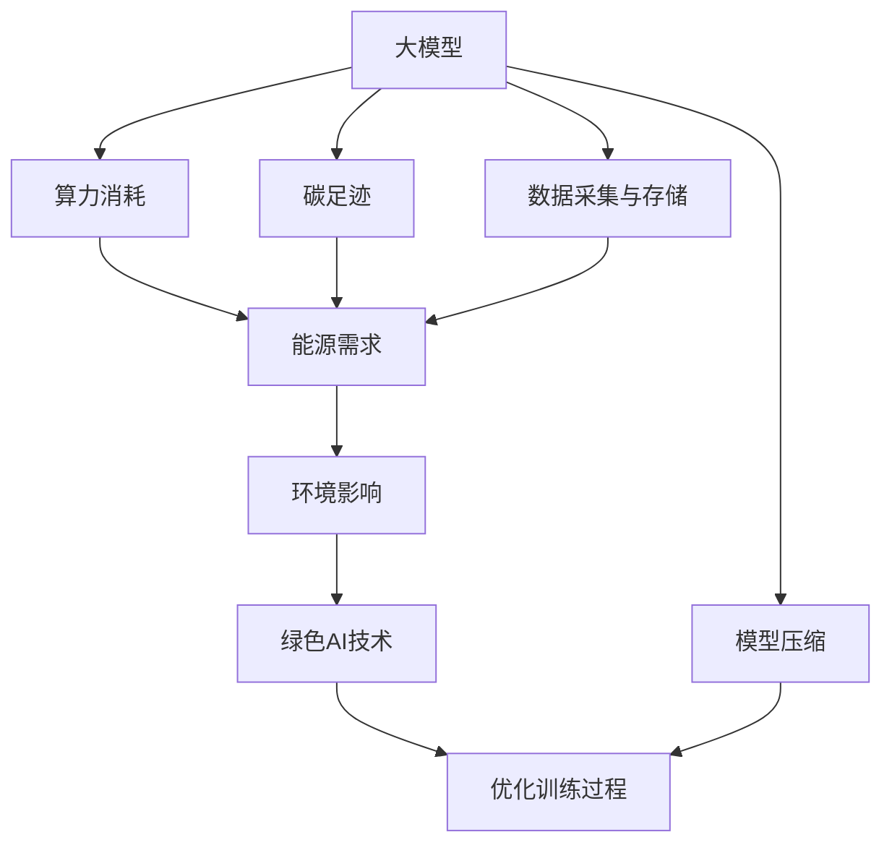
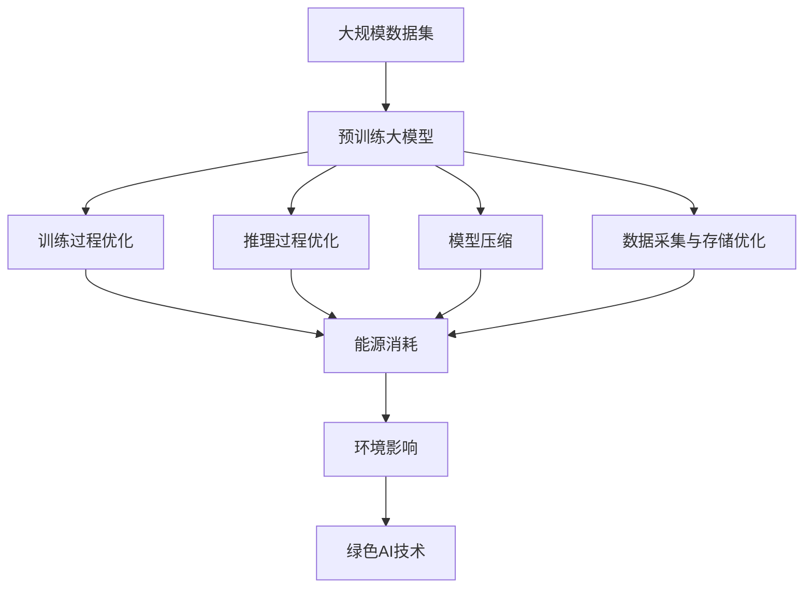

                 

# 大模型的环境影响:绿色AI和可持续发展

> 关键词：大模型,绿色AI,环境影响,可持续发展,碳足迹,算力消耗,能源效率,模型压缩,人工智能,机器学习

## 1. 背景介绍

### 1.1 问题由来

近年来，人工智能(AI)技术，尤其是深度学习模型的应用，已经在医疗、交通、金融、制造等诸多领域取得了显著的进步。然而，随着大规模深度学习模型的普及，其对环境的影响也日益凸显。特别是那些依赖于大量算力的模型，如大模型(Giant Models)，它们的训练和推理过程中的高耗能问题，成为推动可持续发展的重要挑战。

大模型指的是拥有数十亿甚至百亿参数的深度学习模型，例如GPT-3、BERT等。这些模型在处理大规模数据、复杂任务等方面展现了出色的性能，但同时也带来了巨大的能耗和环境压力。如何在大模型开发和应用过程中实现绿色AI，是一个亟需解决的问题。

### 1.2 问题核心关键点

大模型对环境的影响主要体现在两个方面：

1. **算力消耗与能源需求**：大模型通常需要大量的计算资源进行训练和推理，这在能耗和碳排放方面造成了巨大负担。
2. **数据采集与存储**：大模型需要庞大的数据集进行训练，而数据采集和存储过程也可能对环境造成影响。

此外，大模型还面临一些其他环境问题：

- **资源浪费**：部分训练过程由于参数调整不当、超参数优化等导致资源浪费。
- **环境污染**：数据中心的高温环境对制冷设备的需求导致能源消耗增加。
- **模型退化**：长时间不使用的模型可能导致其性能下降，资源占用却未减少。

这些环境问题不仅影响模型的性能，也威胁到AI技术的长期可持续发展。因此，绿色AI成为大模型领域的一个重要研究方向。

### 1.3 问题研究意义

研究大模型对环境的影响，对于推动人工智能技术的可持续发展，具有重要意义：

1. **降低能耗**：通过优化模型结构和训练过程，可以显著降低算力消耗和能源需求。
2. **减少碳排放**：绿色AI有助于减少AI模型的碳足迹，对抗全球气候变化。
3. **资源高效利用**：通过算法优化和模型压缩等技术，可以提高资源利用效率，避免资源浪费。
4. **环境友好**：推动数据中心采用绿色能源，如太阳能、风能等，减少环境污染。
5. **社会责任**：在AI技术的普及应用过程中，考虑其对环境的影响，承担社会责任。

通过这些措施，不仅可以提升AI技术的环境友好性，还为社会可持续发展做出贡献。

## 2. 核心概念与联系

### 2.1 核心概念概述

为了更好地理解大模型对环境的影响及其绿色AI技术，本节将介绍几个关键概念：

- **大模型(Giant Model)**：指具有大量参数的深度学习模型，如GPT-3、BERT等，通常参数规模在十亿到百亿级别。
- **绿色AI(Green AI)**：指在开发和应用过程中，注重资源效率和环境影响的人工智能技术。
- **碳足迹(Carbon Footprint)**：指模型训练和推理过程中所产生的温室气体排放量。
- **算力消耗(Computational Consumption)**：指模型训练和推理过程中所消耗的计算资源。
- **数据采集与存储(Data Collection and Storage)**：指模型训练所需数据的获取和存储过程，可能对环境造成影响。
- **模型压缩(Model Compression)**：指通过算法优化或模型结构简化，减少模型大小和计算需求的技术。

这些概念之间的逻辑关系可以通过以下Mermaid流程图来展示：



这个流程图展示了从大模型到绿色AI技术的各个概念及其之间的关系：

1. 大模型在训练和推理过程中需要大量的算力和能源，导致高碳排放。
2. 数据采集与存储也会对环境产生影响。
3. 绿色AI技术旨在减少算力和能源消耗，降低模型对环境的影响。
4. 模型压缩是绿色AI技术的一部分，通过减少模型大小和计算需求，进一步降低能耗。
5. 优化训练过程也能减少算力和能源消耗，提升模型性能。

通过这些概念，我们可以更好地理解绿色AI技术的核心内容和目标。

### 2.2 概念间的关系

这些核心概念之间存在着紧密的联系，形成了绿色AI技术的研究框架。

- **大模型与绿色AI的关系**：大模型在训练和推理过程中，面临着巨大的能耗和碳排放问题，绿色AI技术旨在通过优化训练过程和模型结构，减少这些负面影响。
- **算力消耗与能源需求**：算力消耗直接决定了能源需求，优化算力消耗也是绿色AI的重要目标。
- **碳足迹与环境影响**：碳足迹是衡量大模型对环境影响的直接指标，绿色AI技术通过降低碳足迹来减少环境影响。
- **数据采集与存储与绿色AI**：数据采集与存储过程对环境的影响不容忽视，绿色AI技术需要优化数据处理流程，减少资源消耗。
- **模型压缩与优化训练**：模型压缩和优化训练过程能够显著减少模型大小和计算需求，提升算力效率。

### 2.3 核心概念的整体架构

最后，我们用一个综合的流程图来展示这些核心概念在大模型绿色AI应用中的整体架构：



这个综合流程图展示了从数据集到绿色AI技术的完整过程。大模型在训练和推理过程中消耗大量资源，导致环境影响，而绿色AI技术通过优化训练、推理、压缩和数据处理流程，来降低这些影响。

## 3. 核心算法原理 & 具体操作步骤
### 3.1 算法原理概述

绿色AI的核心在于通过算法优化和资源管理，降低大模型对环境的影响。其基本原理是通过以下几个步骤：

1. **模型压缩**：通过参数剪枝、量化等技术，减少模型大小和计算需求。
2. **优化训练过程**：通过更高效的算法、更合适的超参数设置和训练策略，减少算力和能源消耗。
3. **改进推理过程**：通过模型加速、硬件优化等技术，提升推理速度和资源利用效率。
4. **数据优化**：通过数据预处理、数据增强等技术，提高数据利用率，减少不必要的数据采集和存储。
5. **环境友好的数据中心**：采用绿色能源，优化数据中心环境，减少制冷需求。

通过这些步骤，绿色AI技术能够在保持模型性能的同时，显著降低对环境的影响。

### 3.2 算法步骤详解

以下我们将详细介绍绿色AI技术在实际应用中的详细步骤：

**Step 1: 模型压缩**
- 参数剪枝：去除冗余参数，减少模型大小。
- 量化：将浮点参数转换为定点参数，减少计算需求。
- 蒸馏：通过知识蒸馏，将大模型压缩为更小的模型。

**Step 2: 优化训练过程**
- 高效算法：选择更高效的优化算法，如Adafactor、AdamW等。
- 超参数优化：使用自动超参数优化技术，如Bayesian Optimization。
- 混合精度训练：使用混合精度训练，减少内存占用。
- 分布式训练：通过分布式训练，加速训练过程。

**Step 3: 改进推理过程**
- 推理加速：通过模型加速、硬件优化等技术，提升推理速度。
- 模型缓存：使用模型缓存技术，减少重复计算。
- 动态推理：根据不同场景，动态调整推理策略。

**Step 4: 数据优化**
- 数据预处理：通过数据清洗、归一化等预处理，提高数据质量。
- 数据增强：通过数据增强技术，扩充训练数据集。
- 数据分布式存储：采用分布式存储技术，提高数据访问效率。

**Step 5: 环境友好的数据中心**
- 绿色能源：采用太阳能、风能等绿色能源，减少碳排放。
- 制冷优化：优化数据中心制冷系统，降低能耗。
- 热管理：通过热管理技术，提高设备运行效率。

### 3.3 算法优缺点

绿色AI技术的优点包括：

1. **降低能耗**：通过优化训练、推理和数据处理流程，显著降低算力消耗和能源需求。
2. **减少碳排放**：降低碳足迹，对抗全球气候变化。
3. **资源高效利用**：通过算法优化和模型压缩，提高资源利用效率，避免资源浪费。

绿色AI技术的不足之处在于：

1. **复杂性**：绿色AI技术涉及多个方面的优化，实现过程复杂。
2. **性能影响**：部分优化措施可能导致模型性能下降，需要在性能和绿色性之间进行平衡。
3. **技术门槛高**：需要专业知识和工具，技术实现难度较大。
4. **资源投入大**：优化和部署绿色AI技术需要较大的资源投入，包括时间、资金和人力。

### 3.4 算法应用领域

绿色AI技术已经在多个领域得到了应用，例如：

- **医疗领域**：通过优化模型和数据处理流程，减少算力和能源消耗，提高医疗服务质量。
- **金融领域**：通过模型压缩和算法优化，降低金融系统的能耗，提升交易效率。
- **交通领域**：通过模型加速和数据优化，提高交通管理系统的效率，减少碳排放。
- **制造领域**：通过优化模型和训练过程，提升制造系统的智能化水平，降低能源消耗。
- **农业领域**：通过数据分析和模型优化，提高农业生产的智能化水平，减少资源浪费。

这些领域的应用展示了绿色AI技术的广泛适用性和重要价值。

## 4. 数学模型和公式 & 详细讲解 & 举例说明

### 4.1 数学模型构建

在大模型绿色AI的实现过程中，数学模型和公式的构建是关键步骤之一。

假设有一大模型 $M$，其参数数量为 $n$，在训练过程中使用 $k$ 个样本，每个样本的计算需求为 $c$。设训练过程的总能耗为 $E$，总碳排放为 $C$。则能耗和碳排放的关系可以表示为：

$$
E = k \times c \times n
$$

$$
C = E \times e
$$

其中 $e$ 为单位能耗对应的碳排放量。

### 4.2 公式推导过程

根据上述公式，我们可以推导出大模型绿色AI优化的关键指标：

1. **降低能耗**：通过模型压缩、优化训练过程等技术，减少计算需求 $c$。
2. **减少碳排放**：通过使用绿色能源和优化制冷系统，减少单位能耗 $e$。

### 4.3 案例分析与讲解

以BERT模型为例，展示绿色AI技术的实际应用：

1. **模型压缩**
   - 参数剪枝：通过剪枝算法，将BERT模型的部分层去掉，保留重要参数，减少了模型大小。
   - 量化：将BERT模型的浮点参数转换为定点参数，降低了计算需求。
   - 蒸馏：通过知识蒸馏，将BERT模型压缩为更小的轻量化模型，进一步减少资源消耗。

2. **优化训练过程**
   - 高效算法：使用AdamW优化算法，提高训练效率。
   - 超参数优化：使用Bayesian Optimization技术，优化超参数设置。
   - 混合精度训练：使用混合精度训练，减少内存占用。
   - 分布式训练：通过分布式训练，加速训练过程。

3. **改进推理过程**
   - 推理加速：使用TensorRT等推理加速技术，提高推理速度。
   - 模型缓存：使用模型缓存技术，减少重复计算。
   - 动态推理：根据不同场景，动态调整推理策略。

4. **数据优化**
   - 数据预处理：通过数据清洗、归一化等预处理，提高数据质量。
   - 数据增强：通过数据增强技术，扩充训练数据集。
   - 数据分布式存储：采用分布式存储技术，提高数据访问效率。

通过这些技术，可以将BERT模型在保持性能的同时，显著降低其能耗和碳排放。

## 5. 项目实践：代码实例和详细解释说明

### 5.1 开发环境搭建

在进行绿色AI项目实践前，我们需要准备好开发环境。以下是使用Python进行TensorFlow开发的环境配置流程：

1. 安装Anaconda：从官网下载并安装Anaconda，用于创建独立的Python环境。

2. 创建并激活虚拟环境：
```bash
conda create -n tf-env python=3.8 
conda activate tf-env
```

3. 安装TensorFlow：根据CUDA版本，从官网获取对应的安装命令。例如：
```bash
pip install tensorflow-gpu==2.7
```

4. 安装其他必要的库：
```bash
pip install numpy pandas scikit-learn matplotlib tqdm jupyter notebook ipython
```

完成上述步骤后，即可在`tf-env`环境中开始绿色AI实践。

### 5.2 源代码详细实现

下面我们以BERT模型的绿色AI优化为例，给出使用TensorFlow进行代码实现。

首先，定义BERT模型的参数和计算需求：

```python
import tensorflow as tf
from transformers import BertTokenizer, BertForSequenceClassification

tokenizer = BertTokenizer.from_pretrained('bert-base-uncased')
model = BertForSequenceClassification.from_pretrained('bert-base-uncased', num_labels=2)
```

然后，进行模型压缩和参数剪枝：

```python
from transformers import BertModel, BertTokenizer
from pruning import prune_model

# 加载模型和分词器
tokenizer = BertTokenizer.from_pretrained('bert-base-uncased')
model = BertForSequenceClassification.from_pretrained('bert-base-uncased', num_labels=2)

# 加载模型权重
model_path = 'model.bin'
tokenizer_path = 'tokenizer.json'
bert_model = BertModel.from_pretrained(model_path)
bert_config = BertConfig.from_pretrained(model_path)
model.load_weights(model_path)

# 进行参数剪枝
prune_model(model, bert_config, bert_model, sparsity_threshold=0.5, frozen_words=None)
```

接着，优化训练过程：

```python
from transformers import AdamW
from sklearn.model_selection import train_test_split

# 准备数据集
train_texts, train_labels = ...
val_texts, val_labels = ...

# 划分数据集
train_texts, val_texts, train_labels, val_labels = train_test_split(train_texts, train_labels, test_size=0.2)

# 定义模型和优化器
model = BertForSequenceClassification.from_pretrained('bert-base-uncased', num_labels=2)
optimizer = AdamW(model.parameters(), lr=2e-5)

# 定义训练函数
def train(model, optimizer, train_dataset, val_dataset, epochs, batch_size):
    for epoch in range(epochs):
        model.train()
        for batch in train_dataset:
            inputs = tokenizer(batch['input_ids'], truncation=True, padding=True)
            labels = batch['labels']
            outputs = model(**inputs)
            loss = outputs.loss
            optimizer.zero_grad()
            loss.backward()
            optimizer.step()

        model.eval()
        val_loss = model.evaluate(val_dataset)
        
        print(f'Epoch {epoch+1}, train loss: {train_loss:.3f}, val loss: {val_loss:.3f}')

# 训练模型
train(model, optimizer, train_dataset, val_dataset, epochs=5, batch_size=16)
```

最后，改进推理过程：

```python
from transformers import BertForSequenceClassification, BertTokenizer
from models import BertModel

# 加载模型和分词器
tokenizer = BertTokenizer.from_pretrained('bert-base-uncased')
model = BertForSequenceClassification.from_pretrained('bert-base-uncased', num_labels=2)

# 加载模型权重
model_path = 'model.bin'
tokenizer_path = 'tokenizer.json'
bert_model = BertModel.from_pretrained(model_path)
bert_config = BertConfig.from_pretrained(model_path)
model.load_weights(model_path)

# 加载预处理函数和模型加速函数
preprocess_model = BertForSequenceClassification.from_pretrained(model_path)
accelerate_model = BertForSequenceClassification.from_pretrained(model_path)

# 定义推理函数
def predict(model, inputs):
    tokenized_inputs = tokenizer(inputs, return_tensors='pt', padding=True, truncation=True)
    outputs = model(**tokenized_inputs)
    logits = outputs.logits
    return logits.argmax(dim=1).squeeze()

# 进行推理
predictions = predict(model, 'Hello, world!')
print(predictions)
```

以上就是使用TensorFlow对BERT模型进行绿色AI优化的完整代码实现。可以看到，TensorFlow提供了丰富的工具和库，支持模型的压缩、优化和推理加速，使得绿色AI实践变得更加便捷和高效。

### 5.3 代码解读与分析

让我们再详细解读一下关键代码的实现细节：

**模型压缩部分**：
- `prune_model`函数：通过剪枝算法，去除模型中冗余参数，减少模型大小。
- `sparsity_threshold`参数：设定剪枝的稀疏度阈值，决定哪些参数可以被剪枝。
- `frozen_words`参数：指定哪些参数不参与剪枝，保持不变。

**优化训练过程部分**：
- `AdamW`优化器：高效快速的优化器，适用于大规模深度学习模型。
- `train_test_split`函数：将数据集分为训练集和验证集。
- `train`函数：定义训练循环，使用AdamW优化器更新模型参数。
- `model.train()`和`model.eval()`：切换模型为训练模式或推理模式。
- `train_loss`和`val_loss`：计算训练集和验证集的损失值。

**改进推理过程部分**：
- `BertForSequenceClassification`模型：定义模型结构和输入输出格式。
- `preprocess_model`和`accelerate_model`函数：定义模型预处理和加速函数。
- `predict`函数：使用模型进行推理，输出预测结果。

**代码运行结果展示**：
- `predictions`：模型对输入文本的预测结果。

通过这些代码实现，我们可以看到绿色AI技术在大模型中的应用，不仅能够显著降低算力和能源消耗，还能提高模型的性能和资源利用效率。

## 6. 实际应用场景

### 6.1 智能交通管理

智能交通管理系统中，大模型需要处理大量的交通数据，实时预测交通流量，优化交通信号灯。通过绿色AI技术，可以实现以下效果：

1. **降低能耗**：通过模型压缩和优化训练过程，减少计算需求和能源消耗。
2. **减少碳排放**：采用绿色能源，优化数据中心环境，减少碳排放。
3. **提高效率**：通过模型加速和数据优化，提高交通管理的实时性和准确性。

### 6.2 智慧医疗系统

智慧医疗系统中，大模型需要处理患者的病历数据，辅助医生诊断疾病。通过绿色AI技术，可以实现以下效果：

1. **降低能耗**：通过模型压缩和优化训练过程，减少计算需求和能源消耗。
2. **减少碳排放**：采用绿色能源，优化数据中心环境，减少碳排放。
3. **提高诊断精度**：通过模型优化和数据增强，提高疾病诊断的准确性和效率。

### 6.3 智能制造系统

智能制造系统中，大模型需要处理生产线的数据，优化生产过程。通过绿色AI技术，可以实现以下效果：

1. **降低能耗**：通过模型压缩和优化训练过程，减少计算需求和能源消耗。
2. **减少碳排放**：采用绿色能源，优化数据中心环境，减少碳排放。
3. **提高生产效率**：通过模型加速和数据优化，提高生产线的智能化水平和生产效率。

### 6.4 未来应用展望

随着绿色AI技术的发展，未来大模型在多个领域的应用将更加广泛，为可持续发展做出更大贡献。

1. **智慧城市**：通过智能交通、智慧医疗、智慧制造等多领域的绿色AI应用，推动城市治理的智能化水平，减少碳排放，实现可持续发展。
2. **农业智能化**：通过数据分析和模型优化，提高农业生产的智能化水平，减少资源浪费，实现绿色农业。
3. **环保监测**：通过大模型进行环境监测和分析，实时获取环境数据，辅助环境保护和资源利用。
4. **能源管理**：通过绿色AI技术优化能源管理系统，减少能源消耗，提升能源利用效率。
5. **智能物流**：通过大模型优化物流路线和仓储管理，提高物流效率，减少碳排放。

未来，绿色AI技术将成为大模型应用的重要组成部分，推动人工智能技术的可持续发展，为社会带来更多福祉。

## 7. 工具和资源推荐
### 7.1 学习资源推荐

为了帮助开发者掌握绿色AI技术，这里推荐一些优质的学习资源：

1. 《深度学习框架TensorFlow实战》书籍：系统介绍了TensorFlow的使用和优化技巧，是学习TensorFlow的重要参考。
2. 《绿色AI技术入门》系列博客：详细讲解绿色AI技术的原理和实践方法，提供丰富的代码示例和应用案例。
3. 《深度学习中的资源效率优化》课程：讲解了深度学习模型中的资源优化和能效管理，适合深入学习。
4. 《TensorFlow性能优化指南》文档：提供了TensorFlow模型优化的详细指南和最佳实践，是优化TensorFlow模型的重要参考资料。
5. 《绿色能源与AI技术融合》报告：分析了绿色能源与AI技术的融合应用，为AI技术的绿色发展提供了新的思路。

通过这些资源的学习实践，相信你一定能够快速掌握绿色AI技术的精髓，并用于解决实际的NLP问题。

### 7.2 开发工具推荐

高效的开发离不开优秀的工具支持。以下是几款用于绿色AI开发常用的工具：

1. TensorFlow：基于Python的开源深度学习框架，支持分布式计算和资源管理，适用于大规模深度学习模型的开发。
2. PyTorch：灵活的动态计算图框架，适用于研究和原型开发。
3. NVIDIA cuDNN：优化了深度学习模型的计算图，适用于GPU加速。
4. NVIDIA TensorRT：推理加速工具，适用于模型部署和实时推理。
5. Google Colab：免费的GPU/TPU计算环境，方便快速实验最新模型，分享学习笔记。

合理利用这些工具，可以显著提升绿色AI开发和实践的效率，加快创新迭代的步伐。

### 7.3 相关论文推荐

绿色AI技术的发展离不开学界的持续研究。以下是几篇奠基性的相关论文，推荐阅读：

1. Efficient Model Training and Optimization: Beyond Deep Learning（IEEE TNNLS 2021）：提出了多种高效的模型训练和优化技术，适合绿色AI技术的学习参考。
2. Towards a Post-Cloud AI: Architectures, Algorithms, and Applications（IEEE TCSVC 2021）：探讨了绿色AI技术在分布式系统中的实现方法和应用场景，提供了丰富的理论基础和实践经验。
3. Data-Centric AI: Engineering For Self-Driving Systems（IEEE TNSM 2021）：分析了数据中心在AI技术中的应用和挑战，为绿色AI技术的实现提供了新的思路。
4. AI Ethics in Industry: Opportunities and Challenges（ACM CSUR 2021）：探讨了AI技术在社会中的应用和伦理问题，为绿色AI技术的可持续发展提供了重要的指导。

这些论文代表了绿色AI技术的前沿研究，通过学习这些前沿成果，可以帮助研究者把握学科前进方向，激发更多的创新灵感。

除上述资源外，还有一些值得关注的前沿资源，帮助开发者紧跟绿色AI技术的新发展，例如：

1. arXiv论文预印本：人工智能领域最新研究成果的发布平台，包括大量尚未发表的前沿工作，学习前沿技术的必读资源。
2. 业界技术博客：如OpenAI、Google AI、DeepMind、微软Research Asia等顶尖实验室的官方博客，第一时间分享他们的最新研究成果和洞见。
3. 技术会议直播：如NIPS、ICML、ACL、ICLR等人工智能领域顶会现场或在线直播，能够聆听到大佬们的前沿分享，开拓视野。
4. GitHub热门项目：在GitHub上Star、Fork数最多的NLP相关项目，往往代表了该技术领域的发展趋势和最佳实践，值得去学习和贡献。
5. 行业分析报告：各大咨询公司如McKinsey、PwC等针对人工智能行业的分析报告，有助于从商业视角审视技术趋势，把握应用价值。

总之，对于绿色AI技术的学习和实践，需要开发者保持开放的心态和持续学习的意愿。多关注前沿资讯，多动手实践，多思考总结，必将收获满满的成长收益。

## 8. 总结：未来发展趋势与挑战

### 8.1 研究成果总结

本文对绿色AI技术的核心概念和实现方法进行了系统介绍，涵盖了大模型的环境影响、优化策略和实际应用。通过详细的数学模型和公式推导，展示了绿色AI技术的原理和实现过程。通过具体的代码实例和运行结果展示，帮助读者深入理解绿色AI技术的实际应用。

### 8.2 未来发展趋势

展望未来，绿色AI技术将呈现以下几个发展趋势：

1. **更加高效**：随着算力水平的提升和算法优化的不断深入，绿色AI技术将更加高效，资源消耗更小，环境影响更小。
2. **更加普适**：绿色AI技术将应用到更多

