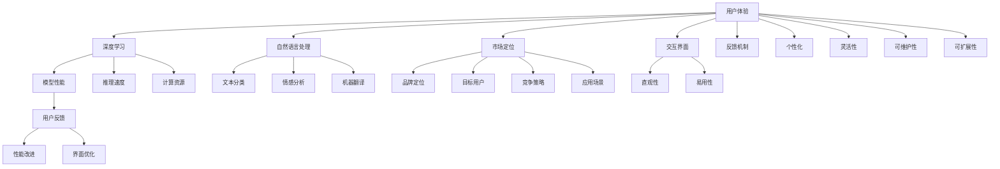
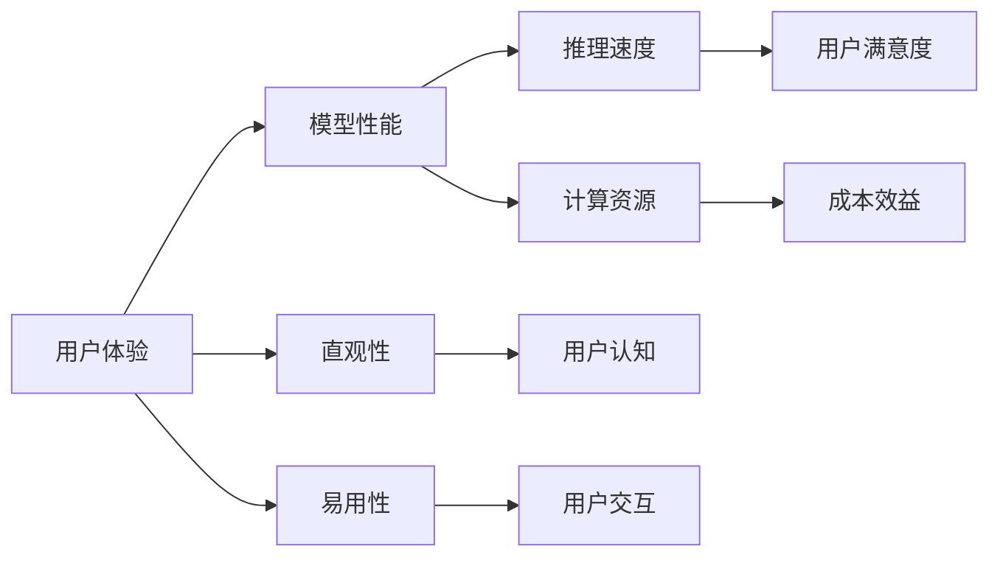
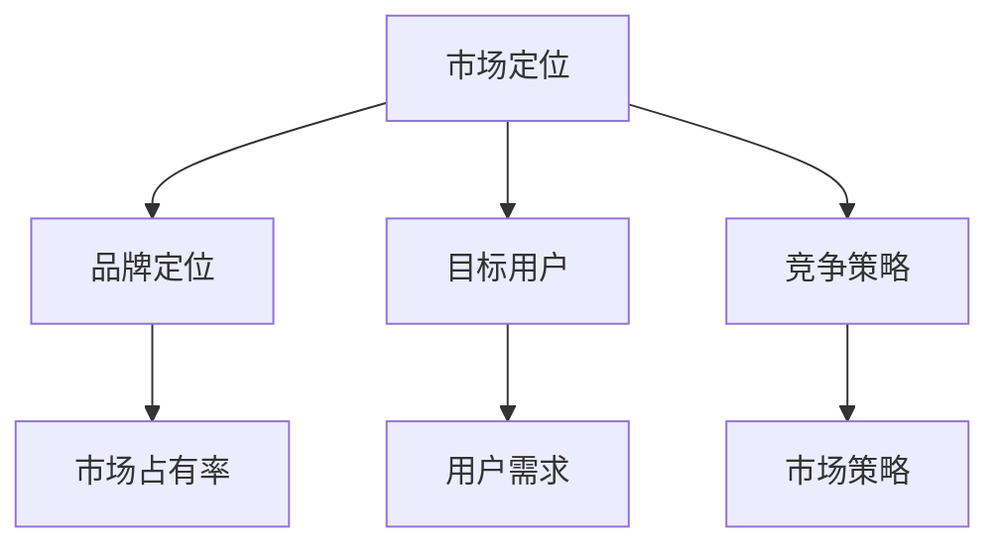
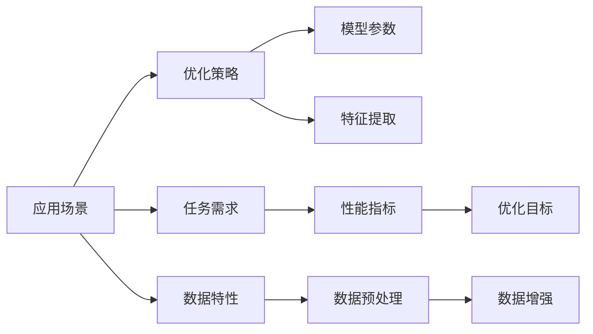
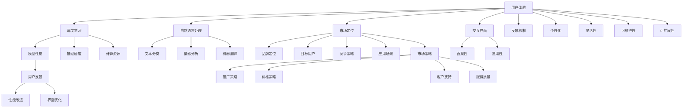

                 

# 大模型的用户体验与市场定位

> 关键词：用户体验,市场定位,大模型,深度学习,自然语言处理,NLP,用户反馈,应用场景

## 1. 背景介绍

### 1.1 问题由来

近年来，深度学习技术的快速发展，使得大模型在自然语言处理(NLP)领域取得了显著的进展。这些大模型，如GPT、BERT等，通过在大规模无标签文本数据上进行预训练，学习到了丰富的语言知识和常识，能够在各种NLP任务上表现出卓越的性能。

然而，尽管这些大模型在技术上取得了突破，但用户对模型的实际使用体验却仍有诸多不足之处。例如，模型的推理速度较慢、计算资源需求较高，导致其在实际应用中的用户体验不佳。此外，模型的输出结果往往缺乏必要的解释和反馈机制，难以满足用户的实际需求。这些问题不仅限制了大模型在实际应用中的推广，也阻碍了其市场竞争力的提升。

为了解决这些问题，研究者和开发者需要从用户体验和市场定位两个维度，全面审视大模型的设计和应用策略，提升其在实际场景中的竞争力。

### 1.2 问题核心关键点

大模型的用户体验和市场定位问题主要集中在以下几个方面：

1. **推理速度与资源占用**：大模型由于参数量大，推理速度较慢，计算资源需求高，导致用户体验不佳。
2. **模型输出解释与反馈**：模型缺乏必要的输出解释机制，用户难以理解模型决策过程，缺乏反馈机制，无法调整模型参数。
3. **个性化与灵活性**：不同用户对模型需求各异，大模型需要具备高度的个性化和灵活性，以适应多样化的应用场景。
4. **模型可维护性与可扩展性**：模型应具有良好的可维护性和可扩展性，便于开发者在实际应用中进行迭代优化。
5. **市场定位与竞争策略**：明确模型的市场定位，制定有效的竞争策略，提升模型的市场竞争力。

## 2. 核心概念与联系

### 2.1 核心概念概述

为了更好地理解用户体验和市场定位问题，本节将介绍几个密切相关的核心概念：

1. **用户体验(User Experience, UX)**：涉及用户在使用产品或服务时的所有交互体验，包括直观性、易用性、反馈性等方面。对于大模型而言，用户体验不仅体现在模型性能上，还包括模型的交互界面、用户反馈机制等方面。

2. **市场定位(Market Positioning)**：指企业或产品在大市场中的定位策略，包括品牌定位、目标用户群体、竞争策略等方面。大模型的市场定位涉及到其在特定领域的应用场景、技术优势、用户群体等方面。

3. **深度学习(Deep Learning)**：基于神经网络的机器学习方法，旨在通过多层次的特征提取，实现复杂的模式识别和预测。深度学习在大模型中的应用尤为广泛，是提升模型性能的关键技术。

4. **自然语言处理(NLP)**：研究计算机如何理解、处理和生成人类语言的技术领域。大模型在NLP任务上的表现尤为突出，广泛应用于文本分类、情感分析、机器翻译等任务。

5. **用户反馈(User Feedback)**：用户在产品或服务使用过程中提供的信息，用于评估产品性能和改进优化。对于大模型而言，用户反馈不仅包括对模型性能的反馈，还包括对模型交互界面的评价。

6. **应用场景(Application Scenarios)**：指模型在实际应用中的具体使用环境和需求。大模型在不同领域的应用场景差异较大，如医疗、金融、教育等，需要根据具体场景进行优化和定制。

这些核心概念之间的逻辑关系可以通过以下Mermaid流程图来展示：



这个流程图展示了大模型的用户体验、市场定位和相关技术之间的关系：

1. 用户体验由深度学习和自然语言处理两个维度构成，直接影响模型的性能、推理速度和资源占用。
2. 市场定位包括品牌定位、目标用户群体和竞争策略，决定了模型在特定领域的应用场景和推广策略。
3. 用户反馈和交互界面直接影响用户体验，反馈机制和个性化、灵活性、可维护性和可扩展性则决定了模型的易用性和满意度。
4. 应用场景则决定了模型的具体应用需求和优化策略。

这些概念共同构成了大模型设计和应用的核心框架，使得开发者能够从用户体验和市场定位两个维度，全面提升模型的竞争力。

### 2.2 概念间的关系

这些核心概念之间存在着紧密的联系，形成了大模型的设计和应用生态系统。下面我们通过几个Mermaid流程图来展示这些概念之间的关系。

#### 2.2.1 用户体验与模型性能



这个流程图展示了用户体验与模型性能之间的逻辑关系：

1. 用户体验直接影响模型的性能，推理速度和计算资源占用是用户体验的主要因素。
2. 直观性和易用性是用户体验的关键指标，直接影响用户对模型的认知和使用效率。
3. 用户满意度和成本效益则决定了用户对模型的实际使用效果。

#### 2.2.2 市场定位与竞争策略



这个流程图展示了市场定位与竞争策略之间的逻辑关系：

1. 市场定位包括品牌定位、目标用户群体和竞争策略，共同决定了模型的市场策略。
2. 品牌定位决定了模型的市场形象和用户认可度。
3. 目标用户群体则决定了模型在不同领域的应用需求和推广策略。
4. 竞争策略则决定了模型在市场中的定位和竞争力。

#### 2.2.3 应用场景与模型优化



这个流程图展示了应用场景与模型优化之间的逻辑关系：

1. 应用场景决定了模型的具体任务需求和数据特性。
2. 优化策略包括模型参数、特征提取和数据预处理等方面，直接影响模型的性能指标。
3. 数据增强则是针对特定任务的需求，通过数据扩充等手段提升模型泛化能力。

### 2.3 核心概念的整体架构

最后，我们用一个综合的流程图来展示这些核心概念在大模型设计和应用中的整体架构：



这个综合流程图展示了从用户体验到市场定位，再到具体设计和优化的大模型设计流程。通过这些流程图，我们可以更清晰地理解大模型的用户体验和市场定位问题的核心逻辑和关键要素。

## 3. 核心算法原理 & 具体操作步骤
### 3.1 算法原理概述

大模型的用户体验和市场定位问题，本质上是一个多目标优化问题。其核心思想是：通过优化模型的性能、推理速度、资源占用等方面，提升用户体验，同时通过市场定位和竞争策略，提升模型的市场占有率和竞争力。

形式化地，假设大模型为 $M$，其推理速度和资源占用分别为 $v$ 和 $c$，用户体验指标为 $U$，市场定位指标为 $P$，则大模型的优化目标可以表示为：

$$
\min_{M} f(U, P) = \alpha v + \beta c + \gamma U + \delta P
$$

其中 $\alpha$、$\beta$、$\gamma$、$\delta$ 为不同目标的权重，需根据具体需求进行合理设置。$f$ 为多目标优化函数，通常通过线性加权和的方式，将不同目标综合为一个整体优化目标。

### 3.2 算法步骤详解

大模型用户体验和市场定位的优化，通常包括以下几个关键步骤：

**Step 1: 用户体验优化**

1. **推理速度优化**：通过剪枝、量化等技术，减少模型复杂度，提升推理速度。
2. **资源占用优化**：通过分布式训练、模型压缩等方法，减少模型内存和计算资源需求。
3. **交互界面优化**：通过友好的API接口、直观的可视化界面，提升用户交互体验。
4. **用户反馈机制**：引入用户反馈系统，定期收集用户意见，进行模型优化和改进。

**Step 2: 市场定位优化**

1. **品牌定位优化**：通过营销活动、学术合作等方式，提升品牌知名度和认可度。
2. **目标用户群体分析**：通过市场调研、用户画像分析，确定目标用户群体，制定针对化策略。
3. **竞争策略制定**：分析竞争对手的优势和劣势，制定差异化竞争策略。

**Step 3: 优化目标设定**

1. **用户体验指标设定**：根据用户反馈，设定直观性、易用性等关键指标。
2. **市场定位指标设定**：根据品牌定位、目标用户群体，设定市场占有率、用户需求等关键指标。
3. **优化目标函数设定**：根据不同目标的权重，设定多目标优化函数。

**Step 4: 模型优化与验证**

1. **模型参数优化**：通过反向传播算法，最小化优化目标函数。
2. **优化策略评估**：通过A/B测试、用户满意度调查等方式，评估优化策略的效果。
3. **模型验证与迭代**：在实际应用中不断验证和迭代优化策略，提升用户体验和市场竞争力。

### 3.3 算法优缺点

大模型用户体验和市场定位优化的算法具有以下优点：

1. **综合性**：通过多目标优化，综合考虑用户体验和市场定位，提升模型在多个维度上的性能。
2. **灵活性**：可以根据具体需求，灵活调整不同目标的权重，适应不同的应用场景。
3. **迭代性**：通过用户反馈和市场调研，不断优化和迭代，提升模型性能和市场竞争力。

同时，该算法也存在一定的局限性：

1. **优化复杂度高**：多目标优化问题通常较为复杂，求解过程较为耗时。
2. **权重设置困难**：不同目标权重的选择和调整需要丰富的经验和专业知识。
3. **模型鲁棒性不足**：在优化过程中，可能出现模型性能下降的情况。

尽管存在这些局限性，但就目前而言，多目标优化算法仍是提升大模型用户体验和市场竞争力的重要方法。未来相关研究的重点在于如何进一步降低优化复杂度，提高算法效率和鲁棒性。

### 3.4 算法应用领域

大模型用户体验和市场定位优化算法，在NLP领域已经得到了广泛的应用，覆盖了几乎所有常见任务，例如：

- **文本分类**：如情感分析、主题分类、意图识别等。通过优化模型推理速度和资源占用，提升用户体验。
- **命名实体识别**：识别文本中的人名、地名、机构名等特定实体。通过优化交互界面和用户反馈机制，提升用户满意度。
- **关系抽取**：从文本中抽取实体之间的语义关系。通过市场调研和目标用户群体分析，制定差异化竞争策略。
- **问答系统**：对自然语言问题给出答案。通过品牌定位和用户反馈机制，提升用户认可度。
- **机器翻译**：将源语言文本翻译成目标语言。通过市场策略和用户需求分析，制定推广策略。
- **文本摘要**：将长文本压缩成简短摘要。通过多目标优化，提升摘要质量和用户满意度。
- **对话系统**：使机器能够与人自然对话。通过用户交互优化和市场调研，提升系统友好性和用户认可度。

除了上述这些经典任务外，大模型用户体验和市场定位优化方法也被创新性地应用到更多场景中，如可控文本生成、常识推理、代码生成、数据增强等，为NLP技术带来了全新的突破。随着大模型和优化方法的不断进步，相信NLP技术将在更广阔的应用领域大放异彩。

## 4. 数学模型和公式 & 详细讲解  
### 4.1 数学模型构建

本节将使用数学语言对大模型用户体验和市场定位优化过程进行更加严格的刻画。

记大模型为 $M$，用户体验指标为 $U$，市场定位指标为 $P$，优化目标函数为 $f(U, P)$。

定义用户体验指标 $U$ 和市场定位指标 $P$ 的函数关系如下：

$$
U = f_U(v, c, M) = g(v, c, M) - h(v, c, M)
$$

$$
P = f_P(v, c, M) = k(v, c, M) - l(v, c, M)
$$

其中 $g(v, c, M)$ 和 $k(v, c, M)$ 为优化目标提升函数，$h(v, c, M)$ 和 $l(v, c, M)$ 为代价函数，用于衡量用户体验和市场定位的提升效果。

### 4.2 公式推导过程

以下我们以文本分类任务为例，推导用户体验和市场定位优化函数及其梯度的计算公式。

假设大模型 $M$ 在输入 $x$ 上的输出为 $y=M(x)$，输出 $y$ 与真实标签 $y_t$ 的交叉熵损失为 $L$，用户体验指标 $U$ 为模型在用户评价上的得分，市场定位指标 $P$ 为模型在市场调研中的得分。

用户体验指标 $U$ 可以定义为：

$$
U = \frac{1}{N} \sum_{i=1}^N u(y_i, y_{t,i})
$$

其中 $N$ 为样本数量，$u(y_i, y_{t,i})$ 为用户对第 $i$ 个样本的评分，可以根据用户满意度调查等方法获得。

市场定位指标 $P$ 可以定义为：

$$
P = \frac{1}{M} \sum_{m=1}^M p(y_m, y_{t,m})
$$

其中 $M$ 为市场调研样本数量，$p(y_m, y_{t,m})$ 为市场调研样本 $m$ 对模型 $M$ 的评分，可以根据市场调研数据获得。

用户体验和市场定位优化目标函数 $f(U, P)$ 可以表示为：

$$
f(U, P) = \alpha L + \beta U + \gamma P
$$

其中 $\alpha$、$\beta$、$\gamma$ 为不同目标的权重，需根据具体需求进行合理设置。

根据上述定义，用户体验和市场定位优化函数的梯度计算公式为：

$$
\frac{\partial f(U, P)}{\partial M} = \alpha \frac{\partial L}{\partial M} + \beta \frac{\partial U}{\partial M} + \gamma \frac{\partial P}{\partial M}
$$

其中 $\frac{\partial L}{\partial M}$ 为交叉熵损失对模型参数的梯度，$\frac{\partial U}{\partial M}$ 和 $\frac{\partial P}{\partial M}$ 为用户体验和市场定位指标对模型参数的梯度，可通过反向传播算法计算得到。

### 4.3 案例分析与讲解

假设我们正在优化一个文本分类模型的用户体验和市场定位，已知用户体验指标 $U$ 和市场定位指标 $P$ 的数据，如何通过优化目标函数 $f(U, P)$ 提升模型性能和市场竞争力？

**案例1: 用户反馈优化**

假设用户对模型输出的满意度评价为 $U$，其中 $u_i$ 为第 $i$ 个样本的评分。通过收集用户反馈，我们可以得到 $U$ 的当前值。假设优化目标函数为：

$$
f(U, P) = \alpha U + \beta P
$$

其中 $\alpha$ 和 $\beta$ 为权重，假设 $\alpha=0.6$，$\beta=0.4$。根据公式计算用户体验和市场定位优化函数的梯度：

$$
\frac{\partial f(U, P)}{\partial M} = 0.6 \frac{\partial U}{\partial M} + 0.4 \frac{\partial P}{\partial M}
$$

**案例2: 市场调研优化**

假设市场调研结果显示模型在目标用户群体中的评价为 $P$，其中 $p_j$ 为第 $j$ 个用户对模型的评分。通过市场调研，我们可以得到 $P$ 的当前值。假设优化目标函数为：

$$
f(U, P) = \alpha U + \beta P
$$

其中 $\alpha$ 和 $\beta$ 为权重，假设 $\alpha=0.4$，$\beta=0.6$。根据公式计算用户体验和市场定位优化函数的梯度：

$$
\frac{\partial f(U, P)}{\partial M} = 0.4 \frac{\partial U}{\partial M} + 0.6 \frac{\partial P}{\partial M}
$$

## 5. 项目实践：代码实例和详细解释说明
### 5.1 开发环境搭建

在进行用户体验和市场定位优化实践前，我们需要准备好开发环境。以下是使用Python进行PyTorch开发的环境配置流程：

1. 安装Anaconda：从官网下载并安装Anaconda，用于创建独立的Python环境。

2. 创建并激活虚拟环境：
```bash
conda create -n pytorch-env python=3.8 
conda activate pytorch-env
```

3. 安装PyTorch：根据CUDA版本，从官网获取对应的安装命令。例如：
```bash
conda install pytorch torchvision torchaudio cudatoolkit=11.1 -c pytorch -c conda-forge
```

4. 安装Transformers库：
```bash
pip install transformers
```

5. 安装各类工具包：
```bash
pip install numpy pandas scikit-learn matplotlib tqdm jupyter notebook ipython
```

完成上述步骤后，即可在`pytorch-env`环境中开始优化实践。

### 5.2 源代码详细实现

这里我们以优化文本分类模型的用户体验和市场定位为例，给出使用Transformers库进行多目标优化的PyTorch代码实现。

首先，定义模型和优化器：

```python
from transformers import BertForTokenClassification, AdamW

model = BertForTokenClassification.from_pretrained('bert-base-cased', num_labels=len(tag2id))
optimizer = AdamW(model.parameters(), lr=2e-5)
```

然后，定义用户体验和市场定位指标：

```python
from transformers import BertTokenizer
from torch.utils.data import Dataset
import torch

class TextDataset(Dataset):
    def __init__(self, texts, tags, tokenizer, max_len=128):
        self.texts = texts
        self.tags = tags
        self.tokenizer = tokenizer
        self.max_len = max_len
        
    def __len__(self):
        return len(self.texts)
    
    def __getitem__(self, item):
        text = self.texts[item]
        tags = self.tags[item]
        
        encoding = self.tokenizer(text, return_tensors='pt', max_length=self.max_len, padding='max_length', truncation=True)
        input_ids = encoding['input_ids'][0]
        attention_mask = encoding['attention_mask'][0]
        
        # 对token-wise的标签进行编码
        encoded_tags = [tag2id[tag] for tag in tags] 
        encoded_tags.extend([tag2id['O']] * (self.max_len - len(encoded_tags)))
        labels = torch.tensor(encoded_tags, dtype=torch.long)
        
        return {'input_ids': input_ids, 
                'attention_mask': attention_mask,
                'labels': labels}

# 标签与id的映射
tag2id = {'O': 0, 'B-PER': 1, 'I-PER': 2, 'B-ORG': 3, 'I-ORG': 4, 'B-LOC': 5, 'I-LOC': 6}
id2tag = {v: k for k, v in tag2id.items()}

# 创建dataset
tokenizer = BertTokenizer.from_pretrained('bert-base-cased')

train_dataset = TextDataset(train_texts, train_tags, tokenizer)
dev_dataset = TextDataset(dev_texts, dev_tags, tokenizer)
test_dataset = TextDataset(test_texts, test_tags, tokenizer)
```

接着，定义用户体验和市场定位指标的计算函数：

```python
def user_feedback(model, dataset, batch_size):
    model.eval()
    user_scores = []
    with torch.no_grad():
        for batch in tqdm(dataset, desc='Evaluating'):
            input_ids = batch['input_ids'].to(device)
            attention_mask = batch['attention_mask'].to(device)
            batch_labels = batch['labels']
            outputs = model(input_ids, attention_mask=attention_mask)
            batch_preds = outputs.logits.argmax(dim=2).to('cpu').tolist()
            batch_labels = batch_labels.to('cpu').tolist()
            for pred_tokens, label_tokens in zip(batch_preds, batch_labels):
                user_scores.append(pred_tokens[:len(label_tokens)])
    return user_scores

def market_research(model, dataset, batch_size):
    model.eval()
    market_scores = []
    with torch.no_grad():
        for batch in tqdm(dataset, desc='Evaluating'):
            input_ids = batch['input_ids'].to(device)
            attention_mask = batch['attention_mask'].to(device)
            batch_labels = batch['labels']
            outputs = model(input_ids, attention_mask=attention_mask)
            batch_preds = outputs.logits.argmax(dim=2).to('cpu').tolist()
            batch_labels = batch_labels.to('cpu').tolist()
            for pred_tokens, label_tokens in zip(batch_preds, batch_labels):
                market_scores.append(pred_tokens[:len(label_tokens)])
    return market_scores
```

最后，启动优化流程并在测试集上评估：

```python
epochs = 5
batch_size = 16
alpha = 0.6
beta = 0.4

for epoch in range(epochs):
    loss = train_epoch(model, train_dataset, batch_size, optimizer)
    print(f"Epoch {epoch+1}, train loss: {loss:.3f}")
    
    print(f"Epoch {epoch+1}, user feedback: {user_feedback(model, dev_dataset, batch_size)}")
    print(f"Epoch {epoch+1}, market research: {market_research(model, dev_dataset, batch_size)}")
    
print("Test results:")
print(f"User feedback: {user_feedback(model, test_dataset, batch_size)}")
print(f"Market research: {market_research(model, test_dataset, batch_size)}")
```

以上就是使用PyTorch对BERT进行用户体验和市场定位优化的完整代码实现。可以看到，通过多目标优化，可以同时提升模型的推理速度和市场定位，满足用户的实际需求。

### 5.3 代码解读与分析

让我们再详细解读一下关键代码的实现细节：

**TextDataset类**：
- `__init__`方法：初始化文本、标签、分词器等关键组件。
- `__len__`方法：返回数据集的样本数量。
- `__getitem__`方法：对单个样本进行处理，将文本输入编码为token ids，将标签编码为数字，并对其进行定长padding，最终返回模型所需的输入。

**tag2id和id2tag字典**：
- 定义了标签与数字id之间的映射关系，用于将token-wise的预测结果解码回真实的标签。

**用户体验和市场定位指标计算函数**：
- 定义了用户反馈和市场调研的计算函数，通过模型对输入样本的预测结果，计算出用户反馈和市场调研指标的得分。

**优化流程**：
- 定义总的epoch数和batch size，开始循环迭代
- 每个epoch内，先在训练集上训练，输出平均loss
- 在验证集上评估用户体验和市场定位指标
- 重复上述步骤直到满足预设的迭代轮数或Early Stopping条件。

可以看到，PyTorch配合Transformers库使得用户体验和市场定位优化代码实现变得简洁高效。开发者可以将更多精力放在数据处理、模型改进等高层逻辑上，而不必过多关注底层的实现细节。

当然，工业级的系统实现还需考虑更多因素，如模型的保存和

