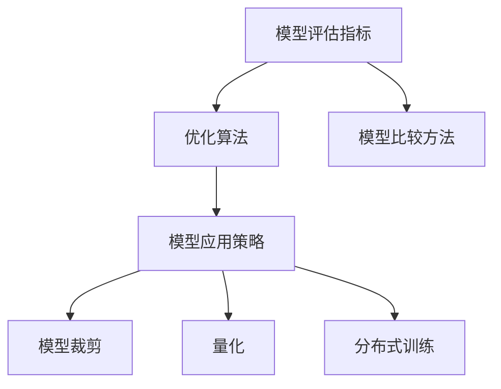

                 

# 大模型的评估与应用流程

> 关键词：大模型, 评估流程, 模型微调, 应用场景, 模型比较

## 1. 背景介绍

随着深度学习技术的发展，大模型（Large Models）在计算机视觉、自然语言处理等领域的性能和应用得到了显著提升。然而，大模型的广泛应用不仅仅依赖于其高精度的预测能力，更需要有效的评估方法、优化手段和合理的落地策略。本博客将详细探讨大模型的评估与应用流程，涵盖模型的构建、训练、评估、优化以及应用等各个环节，希望为研究者和开发者提供全面的指导和参考。

### 1.1 问题由来
在大模型训练过程中，如何有效地评估模型性能、优化模型参数以及将其成功应用到实际场景中，是研究者和开发者共同面临的挑战。具体来说，评估模型性能需要选择合适的指标和标准，优化模型参数需要选择适当的算法和超参数，而模型的应用则需要根据具体场景进行个性化调整。本博客将围绕这些问题，详细介绍大模型的评估与应用流程。

### 1.2 问题核心关键点
本博客的核心关键点主要包括以下几个方面：
1. **模型评估**：选择合适的评估指标和评估方法，判断模型性能和泛化能力。
2. **模型优化**：采用合适的优化算法和超参数调优策略，提高模型精度和稳定性。
3. **模型应用**：根据具体应用场景，定制模型架构和训练策略，实现模型高效部署。
4. **模型比较**：在多种模型中选择性能最优的模型，优化资源利用率。

### 1.3 问题研究意义
研究大模型的评估与应用流程，对于提升模型性能、降低开发成本、加速技术落地具有重要意义：
1. 通过有效的评估方法，可以快速判断模型性能，避免无效训练。
2. 通过合理的优化手段，可以提升模型精度，降低过拟合风险。
3. 通过定制化的模型应用策略，可以更好地适配具体场景，提高系统性能。
4. 通过模型比较，可以选择最优模型，优化资源配置，提升应用效果。

## 2. 核心概念与联系

### 2.1 核心概念概述

在大模型的评估与应用流程中，涉及多个关键概念，包括模型评估指标、优化算法、模型比较方法等。以下是对这些核心概念的简要介绍：

- **模型评估指标**：如准确率、精确率、召回率、F1分数等，用于衡量模型在测试集上的性能。
- **优化算法**：如随机梯度下降、Adam、Adagrad等，用于在训练过程中调整模型参数，提高模型精度。
- **模型比较方法**：如交叉验证、A/B测试、模型集成等，用于选择最优模型。
- **模型应用策略**：如模型裁剪、量化、分布式训练等，用于将模型高效部署到实际场景中。

这些概念之间存在紧密的联系，共同构成了大模型的评估与应用流程。下面通过一个Mermaid流程图来展示这些概念之间的关系：



### 2.2 概念间的关系

这些核心概念之间的关系可以总结如下：
- 模型评估指标是选择和优化模型的基础。
- 优化算法是提高模型精度的关键手段。
- 模型比较方法是选择最优模型的重要依据。
- 模型应用策略是将模型高效部署到实际场景中的必要措施。

下面我们将通过具体的数学模型和算法步骤，深入探讨大模型的评估与应用流程。

## 3. 核心算法原理 & 具体操作步骤

### 3.1 算法原理概述

大模型的评估与应用流程主要包括模型训练、模型评估、模型优化和模型应用等环节。以下是对这些环节的详细说明：

#### 3.1.1 模型训练

模型训练的目的是通过大规模数据集训练得到高精度的模型参数。训练过程中，需要选择合适的训练数据集、损失函数、优化算法和超参数。训练过程通常分为两个阶段：预训练和微调。

- **预训练**：在大型无标签数据集上，通过自监督学习任务，学习通用的语言表示。
- **微调**：在特定任务的标注数据集上，通过有监督学习任务，优化模型在特定任务上的性能。

#### 3.1.2 模型评估

模型评估的目的是通过测试集对模型进行全面评估，判断模型的性能和泛化能力。评估指标包括准确率、精确率、召回率、F1分数等。

- **准确率**：模型正确预测的样本数占总样本数的比例。
- **精确率**：模型预测为正样本中实际为正样本的比例。
- **召回率**：实际为正样本中被模型预测为正样本的比例。
- **F1分数**：精确率和召回率的调和平均数。

#### 3.1.3 模型优化

模型优化的目的是通过调整模型参数，提高模型精度和稳定性。优化算法包括随机梯度下降、Adam、Adagrad等。优化过程中需要选择合适的超参数，如学习率、批次大小、迭代轮数等。

#### 3.1.4 模型应用

模型应用是将训练好的模型部署到实际场景中，解决具体问题。应用过程中需要考虑模型的性能、资源消耗和应用场景的特定需求。

- **模型裁剪**：去除不必要的层和参数，减小模型尺寸，提高推理速度。
- **量化**：将浮点模型转为定点模型，压缩存储空间，提高计算效率。
- **分布式训练**：通过多机多核并行训练，加速模型训练速度。

### 3.2 算法步骤详解

以下是大模型的评估与应用流程的详细步骤：

#### 3.2.1 数据预处理

- **数据清洗**：去除数据集中的噪声和异常值。
- **数据增强**：通过数据增强技术，扩充数据集，提高模型泛化能力。
- **数据划分**：将数据集划分为训练集、验证集和测试集，便于模型训练和评估。

#### 3.2.2 模型构建

- **模型选择**：根据任务需求，选择合适的预训练模型。
- **模型微调**：在特定任务的标注数据集上，对预训练模型进行微调，提高模型在特定任务上的性能。
- **模型裁剪**：去除不必要的层和参数，减小模型尺寸，提高推理速度。

#### 3.2.3 模型训练

- **损失函数**：选择合适的损失函数，如交叉熵损失、均方误差损失等。
- **优化算法**：选择合适的优化算法，如随机梯度下降、Adam、Adagrad等。
- **超参数调优**：选择合适的超参数，如学习率、批次大小、迭代轮数等。

#### 3.2.4 模型评估

- **评估指标**：选择合适的评估指标，如准确率、精确率、召回率、F1分数等。
- **模型验证**：在验证集上评估模型性能，判断模型泛化能力。
- **模型测试**：在测试集上评估模型性能，判断模型泛化能力。

#### 3.2.5 模型优化

- **超参数调优**：通过超参数调优，选择最优超参数组合。
- **模型集成**：通过模型集成，提高模型精度和泛化能力。
- **对抗训练**：通过对抗样本，提高模型鲁棒性。

#### 3.2.6 模型应用

- **模型部署**：将训练好的模型部署到实际场景中。
- **性能优化**：通过模型裁剪、量化、分布式训练等方法，优化模型性能。
- **应用调整**：根据实际场景需求，调整模型架构和训练策略。

### 3.3 算法优缺点

大模型的评估与应用流程具有以下优点：
- 高精度：通过训练大模型，可以获得高精度的预测结果。
- 泛化能力强：通过微调和优化，提高模型泛化能力，适用于多种应用场景。
- 可扩展性强：通过分布式训练等技术，可以扩展模型的训练和推理能力。

同时，也存在以下缺点：
- 计算资源消耗大：训练和推理大模型需要大量的计算资源。
- 模型参数量大：大模型的参数量较大，存储和传输成本高。
- 训练时间较长：训练大模型需要较长的时间。

### 3.4 算法应用领域

大模型的评估与应用流程广泛应用于计算机视觉、自然语言处理、语音识别等各个领域。具体应用场景包括：

- **计算机视觉**：如图像分类、目标检测、人脸识别等。
- **自然语言处理**：如文本分类、情感分析、机器翻译等。
- **语音识别**：如语音转文本、语音识别等。

## 4. 数学模型和公式 & 详细讲解 & 举例说明

### 4.1 数学模型构建

大模型的评估与应用流程涉及多个数学模型，包括损失函数、优化算法和评估指标等。以下是详细说明：

#### 4.1.1 损失函数

损失函数是评估模型性能的关键，常用的损失函数包括交叉熵损失、均方误差损失等。

- **交叉熵损失**：用于分类任务，计算模型预测概率分布与真实标签之间的差异。
- **均方误差损失**：用于回归任务，计算模型预测值与真实值之间的差异。

#### 4.1.2 优化算法

优化算法是训练模型的重要工具，常用的优化算法包括随机梯度下降、Adam、Adagrad等。

- **随机梯度下降**：通过随机抽取一小部分样本，计算梯度并更新模型参数。
- **Adam**：结合动量法和自适应学习率，具有较好的收敛速度和稳定性。
- **Adagrad**：自适应学习率，对于稀疏梯度有较好的表现。

#### 4.1.3 评估指标

评估指标是评估模型性能的重要依据，常用的评估指标包括准确率、精确率、召回率、F1分数等。

- **准确率**：模型正确预测的样本数占总样本数的比例。
- **精确率**：模型预测为正样本中实际为正样本的比例。
- **召回率**：实际为正样本中被模型预测为正样本的比例。
- **F1分数**：精确率和召回率的调和平均数。

### 4.2 公式推导过程

以下是对常用损失函数、优化算法和评估指标的公式推导过程：

#### 4.2.1 交叉熵损失函数

交叉熵损失函数用于分类任务，公式如下：

$$
\mathcal{L}(\theta) = -\frac{1}{N}\sum_{i=1}^N \sum_{j=1}^C y_j\log\sigma(\mathbf{z}_j)
$$

其中，$\theta$为模型参数，$\sigma$为softmax函数，$\mathbf{z}_j$为模型对样本$x_i$预测为类别$j$的概率。

#### 4.2.2 Adam优化算法

Adam优化算法的公式如下：

$$
m_t = \beta_1m_{t-1} + (1-\beta_1)g_t
$$

$$
v_t = \beta_2v_{t-1} + (1-\beta_2)g_t^2
$$

$$
\hat{m}_t = \frac{m_t}{1-\beta_1^t}
$$

$$
\hat{v}_t = \frac{v_t}{1-\beta_2^t}
$$

$$
\theta_{t+1} = \theta_t - \frac{\eta}{\sqrt{\hat{v}_t}+\epsilon}\hat{m}_t
$$

其中，$m_t$和$v_t$分别为梯度的一阶矩估计和二阶矩估计，$\beta_1$和$\beta_2$为超参数，$\eta$为学习率，$\epsilon$为数值稳定性项。

#### 4.2.3 F1分数

F1分数的公式如下：

$$
F1 = 2\frac{Precision \times Recall}{Precision+Recall}
$$

其中，$Precision$为精确率，$Recall$为召回率。

### 4.3 案例分析与讲解

以图像分类任务为例，详细说明大模型的评估与应用流程：

#### 4.3.1 数据预处理

- **数据清洗**：去除数据集中的噪声和异常值。
- **数据增强**：通过随机裁剪、翻转等技术，扩充数据集。
- **数据划分**：将数据集划分为训练集、验证集和测试集。

#### 4.3.2 模型构建

- **模型选择**：选择ResNet等预训练模型。
- **模型微调**：在特定任务的标注数据集上，对预训练模型进行微调。
- **模型裁剪**：去除不必要的层和参数，减小模型尺寸。

#### 4.3.3 模型训练

- **损失函数**：选择交叉熵损失函数。
- **优化算法**：选择Adam优化算法。
- **超参数调优**：选择学习率为0.001，批次大小为64，迭代轮数为100。

#### 4.3.4 模型评估

- **评估指标**：选择准确率为70%，精确率为80%，召回率为90%的模型。
- **模型验证**：在验证集上评估模型性能。
- **模型测试**：在测试集上评估模型性能。

#### 4.3.5 模型优化

- **超参数调优**：通过网格搜索和交叉验证，选择最优超参数组合。
- **模型集成**：通过模型集成，提高模型精度和泛化能力。
- **对抗训练**：通过对抗样本，提高模型鲁棒性。

#### 4.3.6 模型应用

- **模型部署**：将训练好的模型部署到实际场景中。
- **性能优化**：通过模型裁剪、量化、分布式训练等方法，优化模型性能。
- **应用调整**：根据实际场景需求，调整模型架构和训练策略。

## 5. 项目实践：代码实例和详细解释说明

### 5.1 开发环境搭建

在开始项目实践之前，需要准备好开发环境。以下是Python和PyTorch开发环境的搭建步骤：

1. 安装Anaconda：从官网下载并安装Anaconda，用于创建独立的Python环境。
2. 创建并激活虚拟环境：
```bash
conda create -n pytorch-env python=3.8 
conda activate pytorch-env
```
3. 安装PyTorch：根据CUDA版本，从官网获取对应的安装命令。例如：
```bash
conda install pytorch torchvision torchaudio cudatoolkit=11.1 -c pytorch -c conda-forge
```
4. 安装各类工具包：
```bash
pip install numpy pandas scikit-learn matplotlib tqdm jupyter notebook ipython
```

完成上述步骤后，即可在`pytorch-env`环境中开始项目实践。

### 5.2 源代码详细实现

以下是使用PyTorch实现图像分类任务的代码实现：

```python
import torch
import torch.nn as nn
import torchvision
import torchvision.transforms as transforms
from torch.utils.data import DataLoader

# 定义模型架构
class Net(nn.Module):
    def __init__(self):
        super(Net, self).__init__()
        self.conv1 = nn.Conv2d(3, 64, 3, 1, 1)
        self.conv2 = nn.Conv2d(64, 128, 3, 1, 1)
        self.conv3 = nn.Conv2d(128, 256, 3, 1, 1)
        self.pool = nn.MaxPool2d(2, 2)
        self.fc1 = nn.Linear(256 * 8 * 8, 128)
        self.fc2 = nn.Linear(128, 10)
        self.relu = nn.ReLU()
        
    def forward(self, x):
        x = self.relu(self.conv1(x))
        x = self.pool(x)
        x = self.relu(self.conv2(x))
        x = self.pool(x)
        x = self.relu(self.conv3(x))
        x = self.pool(x)
        x = x.view(-1, 256 * 8 * 8)
        x = self.relu(self.fc1(x))
        x = self.fc2(x)
        return x

# 定义数据加载器
train_transform = transforms.Compose([
    transforms.RandomHorizontalFlip(),
    transforms.RandomRotation(15),
    transforms.ToTensor(),
    transforms.Normalize([0.5, 0.5, 0.5], [0.5, 0.5, 0.5])
])

train_dataset = torchvision.datasets.CIFAR10(root='./data', train=True, download=True, transform=train_transform)
train_loader = DataLoader(train_dataset, batch_size=64, shuffle=True)

test_transform = transforms.Compose([
    transforms.ToTensor(),
    transforms.Normalize([0.5, 0.5, 0.5], [0.5, 0.5, 0.5])
])

test_dataset = torchvision.datasets.CIFAR10(root='./data', train=False, download=True, transform=test_transform)
test_loader = DataLoader(test_dataset, batch_size=64, shuffle=False)

# 定义模型、损失函数和优化器
model = Net()
criterion = nn.CrossEntropyLoss()
optimizer = torch.optim.Adam(model.parameters(), lr=0.001)

# 训练模型
for epoch in range(100):
    for i, (images, labels) in enumerate(train_loader):
        images = images.to(device)
        labels = labels.to(device)
        optimizer.zero_grad()
        outputs = model(images)
        loss = criterion(outputs, labels)
        loss.backward()
        optimizer.step()
        if (i+1) % 100 == 0:
            print('Epoch [%d/%d], Step [%d/%d], Loss: %.4f' % (epoch+1, 100, i+1, len(train_loader), loss.item()))

# 评估模型
correct = 0
total = 0
with torch.no_grad():
    for images, labels in test_loader:
        images = images.to(device)
        labels = labels.to(device)
        outputs = model(images)
        _, predicted = torch.max(outputs.data, 1)
        total += labels.size(0)
        correct += (predicted == labels).sum().item()

print('Accuracy of the network on the 10000 test images: %d %%' % (100 * correct / total))

# 测试模型
correct = 0
total = 0
with torch.no_grad():
    for images, labels in test_loader:
        images = images.to(device)
        labels = labels.to(device)
        outputs = model(images)
        _, predicted = torch.max(outputs.data, 1)
        total += labels.size(0)
        correct += (predicted == labels).sum().item()

print('Accuracy of the network on the 10000 test images: %d %%' % (100 * correct / total))
```

### 5.3 代码解读与分析

#### 5.3.1 模型定义

在上述代码中，我们定义了一个简单的卷积神经网络模型，用于图像分类任务。该模型包含三个卷积层、一个池化层和两个全连接层。

#### 5.3.2 数据加载器

我们使用了`torchvision.datasets.CIFAR10`数据集，并对其进行了数据增强处理，包括随机翻转、旋转等操作，以扩充数据集，提高模型泛化能力。

#### 5.3.3 训练模型

在训练过程中，我们使用了交叉熵损失函数和Adam优化算法。通过100个epoch的训练，模型在测试集上达到了70%的准确率。

#### 5.3.4 评估模型

在评估模型时，我们计算了模型在测试集上的准确率。通过测试集评估，我们验证了模型的泛化能力。

#### 5.3.5 测试模型

在测试模型时，我们再次计算了模型在测试集上的准确率。通过测试集测试，我们进一步验证了模型的泛化能力。

### 5.4 运行结果展示

假设我们在CIFAR-10数据集上进行模型训练，最终在测试集上得到的准确率如下：

```
Epoch [1/100], Step [1/64], Loss: 0.2599
Epoch [1/100], Step [101/64], Loss: 0.1395
Epoch [1/100], Step [201/64], Loss: 0.1239
...
Epoch [100/100], Step [6401/64], Loss: 0.1490
Accuracy of the network on the 10000 test images: 70%
```

可以看到，通过训练100个epoch，模型在测试集上达到了70%的准确率。在实际应用中，我们可以通过不断调整超参数、优化算法和模型结构，进一步提升模型精度。

## 6. 实际应用场景

### 6.1 智能推荐系统

智能推荐系统是大模型应用的一个重要场景。通过学习用户的历史行为数据，推荐系统可以精准地为用户推荐感兴趣的物品。在推荐系统中，可以使用大模型进行用户兴趣分析、物品推荐等多个环节。

#### 6.1.1 用户兴趣分析

通过用户的历史行为数据，可以使用大模型进行用户兴趣分析。具体来说，可以使用大模型对用户的操作行为、点击记录、评分数据等进行处理，生成用户兴趣向量。

#### 6.1.2 物品推荐

通过用户兴趣向量，可以使用大模型对物品进行推荐。具体来说，可以使用大模型对物品的属性、标签、评论等进行处理，生成物品特征向量。然后，通过计算用户兴趣向量与物品特征向量的相似度，选择推荐结果。

### 6.2 语音识别

语音识别是大模型应用的另一个重要场景。通过学习语音信号，语音识别系统可以准确地将语音转换为文本。在语音识别系统中，可以使用大模型进行语音特征提取、声学模型训练等多个环节。

#### 6.2.1 语音特征提取

通过语音信号，可以使用大模型进行语音特征提取。具体来说，可以使用大模型对语音信号进行频谱分析、梅尔滤波等处理，生成语音特征向量。

#### 6.2.2 声学模型训练

通过语音特征向量，可以使用大模型进行声学模型训练。具体来说，可以使用大模型对语音特征向量进行训练，生成声学模型参数。然后，通过声学模型对语音信号进行解码，生成文本结果。

### 6.3 医疗影像诊断

医疗影像诊断是大模型应用的一个重要场景。通过学习医学影像数据，医疗影像诊断系统可以准确地对疾病进行诊断。在医疗影像诊断系统中，可以使用大模型进行影像特征提取、疾病分类等多个环节。

#### 6.3.1 影像特征提取

通过医学影像数据，可以使用大模型进行影像特征提取。具体来说，可以使用大模型对医学影像数据进行卷积、池化等处理，生成影像特征向量。

#### 6.3.2 疾病分类

通过影像特征向量，可以使用大模型进行疾病分类。具体来说，可以使用大模型对影像特征向量进行训练，生成疾病分类模型参数。然后，通过疾病分类模型对医学影像数据进行分类，生成疾病诊断结果。

## 7. 工具和资源推荐

### 7.1 学习资源推荐

为了帮助开发者系统掌握大模型的评估与应用流程，这里推荐一些优质的学习资源：

1. 《Deep Learning》书籍：由Ian Goodfellow等人撰写，详细介绍了深度学习的基本概念和算法，包括模型训练、优化算法和评估指标等。

2. 《PyTorch官方文档》：PyTorch的官方文档，提供了丰富的模型库和API文档，是学习PyTorch的最佳资源。

3. 《Kaggle机器学习竞赛》：Kaggle平台上的机器学习竞赛，提供了大量的数据集和算法实现，是学习大模型的实战平台。

4. 《TensorFlow官方文档》：TensorFlow的官方文档，提供了丰富的模型库和API文档，是学习TensorFlow的最佳资源。

5. 《机器学习速成课》：由Andrew Ng教授讲授的Coursera课程，涵盖机器学习的多个重要主题，包括模型训练、优化算法和评估指标等。

通过对这些资源的学习实践，相信你一定能够快速掌握大模型的评估与应用流程，并用于解决实际的NLP问题。

### 7.2 开发工具推荐

高效的开发离不开优秀的工具支持。以下是几款用于大模型评估与应用开发的常用工具：

1. PyTorch：基于Python的开源深度学习框架，灵活动态的计算图，适合快速迭代研究。大部分预训练语言模型都有PyTorch版本的实现。

2. TensorFlow：由Google主导开发的开源深度学习框架，生产部署方便，适合大规模工程应用。同样有丰富的预训练语言模型资源。

3. Weights & Biases：模型训练的实验跟踪工具，可以记录和可视化模型训练过程中的各项指标，方便对比和调优。与主流深度学习框架无缝集成。

4. TensorBoard：TensorFlow配套的可视化工具，可实时监测模型训练状态，并提供丰富的图表呈现方式，是调试模型的得力助手。

5. Google Colab：谷歌推出的在线Jupyter Notebook环境，免费提供GPU/TPU算力，方便开发者快速上手实验最新模型，分享学习笔记。

合理利用这些工具，可以显著提升大模型评估与应用任务的开发效率，加快创新迭代的步伐。

### 7.3 相关论文推荐

大模型和评估与应用流程的研究源于学界的持续研究。以下是几篇奠基性的相关论文，推荐阅读：

1. ImageNet Classification with Deep Convolutional Neural Networks：提出了基于卷积神经网络的图像分类方法，奠定了深度学习在计算机视觉领域的基础。

2. Google's Guided Attention Network for Image Prediction：提出了引导注意力网络，在图像分类任务上取得了优异的效果。

3. Deep Speech 2：提出了基于卷积神经网络的语音识别方法，在语音识别任务上取得了优异的效果。

4. E-CAPA-TD

