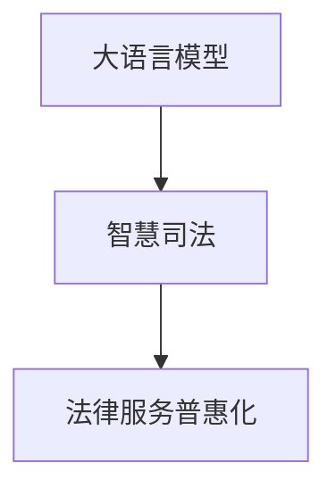

                 

## 1. 背景介绍

随着人工智能技术的快速发展，大语言模型在各个领域的应用日益广泛，尤其是司法领域。智慧司法（Smart Justice）是大数据、人工智能与司法业务深度融合的产物，通过数据驱动和智能决策，大大提升了司法审判的效率和公正性。本文将深入探讨大模型如何赋能智慧司法，同时阐述创业者如何在智慧司法领域推动法律服务的普惠化。

## 2. 核心概念与联系

### 2.1 核心概念概述

#### 2.1.1 大语言模型（Large Language Models, LLMs）

大语言模型是一种基于深度学习技术的大型神经网络模型，能够理解和生成自然语言。LLMs通过大规模无标签文本数据的预训练，学习了丰富的语言知识和常识，具备强大的语言理解与生成能力。

#### 2.1.2 智慧司法（Smart Justice）

智慧司法是指将大数据、人工智能等现代信息技术应用到司法领域，实现司法信息的智能化管理、案件的智能判决、风险预警、智能卷宗管理等，提升司法工作的效率和公正性。

#### 2.1.3 法律服务普惠化（Legal Service Inclusion）

法律服务普惠化是指通过技术手段，使法律服务能够覆盖到社会各阶层，尤其是对弱势群体，提供公平、透明、高效的服务，促进社会的公平正义。

### 2.2 核心概念的关系

大语言模型作为智慧司法的核心技术之一，为司法信息的智能化管理、案件的智能判决提供了强有力的支持。通过大语言模型的微调，司法系统能够快速、准确地处理大量案件数据，提升司法效率和公正性。同时，智慧司法也为大语言模型的应用提供了广阔的空间，促进了大语言模型在法律领域的落地和普及。法律服务的普惠化则通过智慧司法的推动，让更多人能够享受到高质量的法律服务。

以下是一个Mermaid流程图，展示了大语言模型、智慧司法和法律服务普惠化之间的关系：



## 3. 核心算法原理 & 具体操作步骤

### 3.1 算法原理概述

大模型在司法领域的应用主要体现在以下几个方面：

1. **智能审判支持**：大模型可以用于自动生成司法文书、分析案件证据、预测案件判决结果等。
2. **智能卷宗管理**：大模型可以帮助整理和管理卷宗信息，辅助法官快速查阅相关资料。
3. **风险预警与防范**：大模型可以对历史案件数据进行分析，预测潜在的司法风险，帮助司法机关提前防范。
4. **法律知识图谱构建**：大模型可以构建法律领域的知识图谱，为法律服务和司法决策提供支持。

### 3.2 算法步骤详解

智慧司法系统通常包括数据收集、预处理、模型训练与微调、智能应用等多个环节。以下是智慧司法系统的主要步骤：

1. **数据收集与预处理**：
   - 收集司法系统中的各种数据，包括案件文书、卷宗信息、判决结果等。
   - 对数据进行清洗、标注和预处理，构建高质量的数据集。

2. **模型选择与训练**：
   - 选择合适的预训练大语言模型，如BERT、GPT等。
   - 在大规模无标签文本数据上进行预训练，学习通用的语言表示。
   - 在司法领域的有标签数据集上进行微调，使其具备司法领域的知识。

3. **智能应用开发**：
   - 开发智能审判支持系统，实现自动生成司法文书、分析案件证据等功能。
   - 开发智能卷宗管理系统，帮助法官快速查阅卷宗信息。
   - 开发风险预警系统，预测司法风险。
   - 构建法律知识图谱，为法律服务提供支持。

4. **系统集成与部署**：
   - 将各模块集成到司法信息系统中。
   - 在实际司法场景中部署应用，进行评估和优化。

### 3.3 算法优缺点

#### 3.3.1 优点

1. **提升司法效率**：大模型可以快速处理大量司法数据，减少法官的工作量，提升司法效率。
2. **提高司法公正性**：通过智能分析案件证据和文书，减少人为因素对司法公正的影响。
3. **辅助法官决策**：大模型可以提供辅助法官决策的依据，减少决策失误。
4. **普惠化法律服务**：通过技术手段，提供公平、透明、高效的法律服务。

#### 3.3.2 缺点

1. **数据质量依赖性高**：大模型的效果很大程度上依赖于数据的质量和数量。
2. **模型复杂度大**：大语言模型的参数量庞大，对计算资源和存储空间要求高。
3. **模型可解释性不足**：大模型通常是"黑盒"系统，难以解释其内部工作机制。
4. **安全性问题**：大模型的应用可能带来数据安全和隐私问题。

### 3.4 算法应用领域

大语言模型在司法领域的应用主要包括以下几个方面：

1. **智能审判支持**：包括自动生成司法文书、分析案件证据、预测判决结果等。
2. **智能卷宗管理**：帮助整理和管理卷宗信息，快速查阅相关资料。
3. **风险预警与防范**：对历史案件数据进行分析，预测潜在的司法风险。
4. **法律知识图谱构建**：构建法律领域的知识图谱，为法律服务和司法决策提供支持。
5. **法律咨询机器人**：构建智能法律咨询机器人，提供24小时法律咨询服务。

## 4. 数学模型和公式 & 详细讲解

### 4.1 数学模型构建

假设司法系统中存在大量的案件文书 $D=\{d_1, d_2, ..., d_N\}$，其中 $d_i$ 表示第 $i$ 个案件的文书。构建一个智能审判支持系统，需要对文书进行自然语言处理，提取案件关键信息，并进行智能分析。

假设选择的预训练大语言模型为 $M_{\theta}$，其中 $\theta$ 为模型参数。通过对案件文书进行微调，使其具备司法领域的知识，构建智能审判支持系统。

### 4.2 公式推导过程

智能审判支持系统的微调过程可以表示为：

1. **特征提取**：
   $$
   F_{\theta}(d_i) = M_{\theta}(d_i)
   $$

   其中 $F_{\theta}(d_i)$ 表示模型对案件文书 $d_i$ 的特征提取结果。

2. **智能分析**：
   - 预测判决结果：
   $$
   \hat{y_i} = \sigma(W_F F_{\theta}(d_i) + b_F)
   $$

     其中 $W_F$ 和 $b_F$ 为线性分类器的权重和偏置，$\sigma$ 为激活函数。

   - 分析案件证据：
   $$
   E_j(d_i) = M_{\theta}(d_i, e_j)
   $$

     其中 $e_j$ 表示案件证据，$E_j(d_i)$ 表示模型对证据的分析结果。

3. **损失函数**：
   - 预测判决结果的损失函数为交叉熵损失：
   $$
   L_{pred} = -\frac{1}{N} \sum_{i=1}^{N} y_i \log \hat{y_i} + (1-y_i) \log (1-\hat{y_i})
   $$

     其中 $y_i$ 为真实判决结果，$\hat{y_i}$ 为模型预测结果。

   - 分析案件证据的损失函数为均方误差损失：
   $$
   L_{evid} = \frac{1}{N} \sum_{i=1}^{N} ||E_i(d_i) - \hat{E_i}(d_i)||_2^2
   $$

     其中 $E_i(d_i)$ 为模型对案件文书 $d_i$ 的证据分析结果，$\hat{E_i}(d_i)$ 为真实证据分析结果。

4. **微调目标函数**：
   $$
   \mathcal{L} = \alpha L_{pred} + (1-\alpha) L_{evid}
   $$

     其中 $\alpha$ 为调节两个损失函数权重的系数。

### 4.3 案例分析与讲解

假设我们选择预训练模型BERT，并针对智能审判支持系统进行微调。在司法领域有标签数据集上进行微调，构建一个预测判决结果的系统。数据集包含案件文书和判决结果，我们将使用其中的文书数据进行特征提取和智能分析。

构建智能审判支持系统的主要步骤包括：

1. **数据预处理**：对案件文书进行分词、去除停用词等预处理。
2. **特征提取**：使用BERT模型对文书进行特征提取，得到 $F_{\theta}(d_i)$。
3. **模型训练**：使用预测判决结果的损失函数 $L_{pred}$ 进行训练，调整模型参数 $\theta$。
4. **智能分析**：对证据进行分析，得到 $E_j(d_i)$。
5. **评估与优化**：在测试集上进行评估，调整模型参数和训练参数，优化模型性能。

## 5. 项目实践：代码实例和详细解释说明

### 5.1 开发环境搭建

以下是使用Python进行PyTorch开发的开发环境配置流程：

1. 安装Anaconda：从官网下载并安装Anaconda，用于创建独立的Python环境。
2. 创建并激活虚拟环境：
   ```bash
   conda create -n pytorch-env python=3.8 
   conda activate pytorch-env
   ```

3. 安装PyTorch：根据CUDA版本，从官网获取对应的安装命令。例如：
   ```bash
   conda install pytorch torchvision torchaudio cudatoolkit=11.1 -c pytorch -c conda-forge
   ```

4. 安装Transformers库：
   ```bash
   pip install transformers
   ```

5. 安装各类工具包：
   ```bash
   pip install numpy pandas scikit-learn matplotlib tqdm jupyter notebook ipython
   ```

完成上述步骤后，即可在`pytorch-env`环境中开始开发。

### 5.2 源代码详细实现

以下是使用Transformers库对BERT模型进行司法领域微调的PyTorch代码实现。

```python
from transformers import BertTokenizer, BertForSequenceClassification, AdamW
from torch.utils.data import Dataset, DataLoader
from sklearn.metrics import accuracy_score

class JudicialDataset(Dataset):
    def __init__(self, texts, labels, tokenizer, max_len=128):
        self.texts = texts
        self.labels = labels
        self.tokenizer = tokenizer
        self.max_len = max_len
        
    def __len__(self):
        return len(self.texts)
    
    def __getitem__(self, item):
        text = self.texts[item]
        label = self.labels[item]
        
        encoding = self.tokenizer(text, return_tensors='pt', max_length=self.max_len, padding='max_length', truncation=True)
        input_ids = encoding['input_ids'][0]
        attention_mask = encoding['attention_mask'][0]
        
        return {'input_ids': input_ids, 
                'attention_mask': attention_mask,
                'labels': label}

# 标签与id的映射
label2id = {'判有罪': 1, '判无罪': 0}
id2label = {v: k for k, v in label2id.items()}

# 创建dataset
tokenizer = BertTokenizer.from_pretrained('bert-base-cased')

train_dataset = JudicialDataset(train_texts, train_labels, tokenizer)
dev_dataset = JudicialDataset(dev_texts, dev_labels, tokenizer)
test_dataset = JudicialDataset(test_texts, test_labels, tokenizer)

# 模型与优化器
model = BertForSequenceClassification.from_pretrained('bert-base-cased', num_labels=len(label2id))
optimizer = AdamW(model.parameters(), lr=2e-5)

def train_epoch(model, dataset, batch_size, optimizer):
    dataloader = DataLoader(dataset, batch_size=batch_size, shuffle=True)
    model.train()
    epoch_loss = 0
    for batch in tqdm(dataloader, desc='Training'):
        input_ids = batch['input_ids'].to(device)
        attention_mask = batch['attention_mask'].to(device)
        labels = batch['labels'].to(device)
        model.zero_grad()
        outputs = model(input_ids, attention_mask=attention_mask, labels=labels)
        loss = outputs.loss
        epoch_loss += loss.item()
        loss.backward()
        optimizer.step()
    return epoch_loss / len(dataloader)

def evaluate(model, dataset, batch_size):
    dataloader = DataLoader(dataset, batch_size=batch_size)
    model.eval()
    preds, labels = [], []
    with torch.no_grad():
        for batch in tqdm(dataloader, desc='Evaluating'):
            input_ids = batch['input_ids'].to(device)
            attention_mask = batch['attention_mask'].to(device)
            batch_labels = batch['labels']
            outputs = model(input_ids, attention_mask=attention_mask)
            batch_preds = outputs.logits.argmax(dim=2).to('cpu').tolist()
            batch_labels = batch_labels.to('cpu').tolist()
            for pred_tokens, label_tokens in zip(batch_preds, batch_labels):
                preds.append(pred_tokens[0])
                labels.append(label_tokens[0])
                
    return accuracy_score(labels, preds)

# 训练与评估
epochs = 5
batch_size = 16

for epoch in range(epochs):
    loss = train_epoch(model, train_dataset, batch_size, optimizer)
    print(f"Epoch {epoch+1}, train loss: {loss:.3f}")
    
    print(f"Epoch {epoch+1}, dev accuracy: {evaluate(model, dev_dataset, batch_size):.2f}")
    
print(f"Epoch {epochs}, test accuracy: {evaluate(model, test_dataset, batch_size):.2f}")
```

### 5.3 代码解读与分析

让我们再详细解读一下关键代码的实现细节：

**JudicialDataset类**：
- `__init__`方法：初始化文本、标签、分词器等关键组件。
- `__len__`方法：返回数据集的样本数量。
- `__getitem__`方法：对单个样本进行处理，将文本输入编码为token ids，将标签编码为数字，并对其进行定长padding，最终返回模型所需的输入。

**label2id和id2label字典**：
- 定义了标签与数字id之间的映射关系，用于将模型预测结果解码为实际的判决结果。

**训练和评估函数**：
- 使用PyTorch的DataLoader对数据集进行批次化加载，供模型训练和推理使用。
- 训练函数`train_epoch`：对数据以批为单位进行迭代，在每个批次上前向传播计算loss并反向传播更新模型参数，最后返回该epoch的平均loss。
- 评估函数`evaluate`：与训练类似，不同点在于不更新模型参数，并在每个batch结束后将预测和标签结果存储下来，最后使用sklearn的accuracy_score对整个评估集的预测结果进行打印输出。

**训练流程**：
- 定义总的epoch数和batch size，开始循环迭代
- 每个epoch内，先在训练集上训练，输出平均loss
- 在验证集上评估，输出准确率
- 所有epoch结束后，在测试集上评估，给出最终的测试准确率

可以看到，使用PyTorch和Transformers库进行司法领域大语言模型的微调，代码实现相对简单，易于上手。开发者可以根据具体需求进行相应的修改和扩展，实现更复杂的智能应用。

## 6. 实际应用场景

### 6.1 智能审判支持

智能审判支持系统可以帮助法官快速处理案件，减少工作量，提升司法效率。例如：

- **自动生成司法文书**：通过对案件文书进行特征提取和智能分析，自动生成判决书、裁定书等司法文书。
- **案件证据分析**：对案件证据进行智能分析，提取关键信息，辅助法官快速作出判决。

### 6.2 智能卷宗管理

智能卷宗管理系统可以帮助法官快速查阅案件信息，提高工作效率。例如：

- **智能卷宗搜索**：通过自然语言查询，快速找到相关案件卷宗，辅助法官查阅案件信息。
- **卷宗内容提取**：自动提取卷宗中的关键信息，生成结构化的案件信息，方便法官快速阅读。

### 6.3 风险预警与防范

风险预警系统可以预测潜在的司法风险，帮助司法机关提前防范。例如：

- **案件风险评估**：通过分析案件特征和历史数据，预测案件的诉讼风险，提前采取防范措施。
- **案件分类预警**：根据案件类型和特征，进行分类预警，帮助司法机关识别高风险案件。

### 6.4 未来应用展望

未来，智慧司法系统将在以下方面进行发展：

1. **智能辅助决策**：通过大模型提供智能决策支持，减少人为因素对司法公正的影响。
2. **多模态司法信息融合**：结合语音、视频等多模态信息，提升司法信息的全面性和准确性。
3. **隐私保护与数据安全**：加强对司法数据的隐私保护，防止数据泄露和滥用。
4. **普惠化法律服务**：通过智能法律咨询机器人，提供24小时法律咨询服务，覆盖更多人群。
5. **智能风险预警**：基于大模型对司法风险进行预测和防范，提高司法系统的稳定性和公正性。

## 7. 工具和资源推荐

### 7.1 学习资源推荐

为了帮助开发者系统掌握大语言模型在司法领域的应用，以下是一些优质的学习资源：

1. 《智慧司法：大数据与人工智能技术》系列博文：由行业专家撰写，深入介绍智慧司法的核心技术和大模型应用。
2. 《Python深度学习》课程：斯坦福大学开设的深度学习入门课程，详细讲解Python和PyTorch的使用。
3. 《深度学习与司法应用》书籍：全面介绍深度学习技术在司法领域的应用，涵盖智能审判、智能卷宗管理等多个方面。
4. 最高人民法院司法大数据管理司网站：提供丰富的司法大数据资源和应用案例，了解司法领域的实际应用。

通过对这些资源的学习实践，相信你一定能够掌握大语言模型在司法领域的应用技巧，并用于解决实际的司法问题。

### 7.2 开发工具推荐

高效的开发离不开优秀的工具支持。以下是几款用于大语言模型微调开发的常用工具：

1. PyTorch：基于Python的开源深度学习框架，灵活动态的计算图，适合快速迭代研究。大部分预训练语言模型都有PyTorch版本的实现。
2. TensorFlow：由Google主导开发的开源深度学习框架，生产部署方便，适合大规模工程应用。同样有丰富的预训练语言模型资源。
3. Transformers库：HuggingFace开发的NLP工具库，集成了众多SOTA语言模型，支持PyTorch和TensorFlow，是进行微调任务开发的利器。
4. Weights & Biases：模型训练的实验跟踪工具，可以记录和可视化模型训练过程中的各项指标，方便对比和调优。与主流深度学习框架无缝集成。
5. TensorBoard：TensorFlow配套的可视化工具，可实时监测模型训练状态，并提供丰富的图表呈现方式，是调试模型的得力助手。
6. Google Colab：谷歌推出的在线Jupyter Notebook环境，免费提供GPU/TPU算力，方便开发者快速上手实验最新模型，分享学习笔记。

合理利用这些工具，可以显著提升大语言模型微调任务的开发效率，加快创新迭代的步伐。

### 7.3 相关论文推荐

大语言模型在司法领域的应用源于学界的持续研究。以下是几篇奠基性的相关论文，推荐阅读：

1. Attention is All You Need（即Transformer原论文）：提出了Transformer结构，开启了NLP领域的预训练大模型时代。
2. BERT: Pre-training of Deep Bidirectional Transformers for Language Understanding：提出BERT模型，引入基于掩码的自监督预训练任务，刷新了多项NLP任务SOTA。
3. Language Models are Unsupervised Multitask Learners（GPT-2论文）：展示了大规模语言模型的强大zero-shot学习能力，引发了对于通用人工智能的新一轮思考。
4. Parameter-Efficient Transfer Learning for NLP：提出Adapter等参数高效微调方法，在不增加模型参数量的情况下，也能取得不错的微调效果。
5. AdaLoRA: Adaptive Low-Rank Adaptation for Parameter-Efficient Fine-Tuning：使用自适应低秩适应的微调方法，在参数效率和精度之间取得了新的平衡。

这些论文代表了大语言模型微调技术的发展脉络。通过学习这些前沿成果，可以帮助研究者把握学科前进方向，激发更多的创新灵感。

除上述资源外，还有一些值得关注的前沿资源，帮助开发者紧跟大语言模型微调技术的最新进展，例如：

1. arXiv论文预印本：人工智能领域最新研究成果的发布平台，包括大量尚未发表的前沿工作，学习前沿技术的必读资源。
2. 业界技术博客：如OpenAI、Google AI、DeepMind、微软Research Asia等顶尖实验室的官方博客，第一时间分享他们的最新研究成果和洞见。
3. 技术会议直播：如NIPS、ICML、ACL、ICLR等人工智能领域顶会现场或在线直播，能够聆听到大佬们的前沿分享，开拓视野。
4. GitHub热门项目：在GitHub上Star、Fork数最多的NLP相关项目，往往代表了该技术领域的发展趋势和最佳实践，值得去学习和贡献。
5. 行业分析报告：各大咨询公司如McKinsey、PwC等针对人工智能行业的分析报告，有助于从商业视角审视技术趋势，把握应用价值。

总之，对于大语言模型微调技术的学习和实践，需要开发者保持开放的心态和持续学习的意愿。多关注前沿资讯，多动手实践，多思考总结，必将收获满满的成长收益。

## 8. 总结：未来发展趋势与挑战

### 8.1 总结

本文对基于大语言模型在司法领域的应用进行了全面系统的介绍。首先阐述了大语言模型和微调技术的研究背景和意义，明确了微调在拓展预训练模型应用、提升司法效率和公正性方面的独特价值。其次，从原理到实践，详细讲解了司法领域大语言模型的微调过程，给出了司法领域微调任务的完整代码实例。同时，本文还探讨了大语言模型在司法领域的应用前景，展示了其在智能审判支持、智能卷宗管理、风险预警等方面的广泛应用，并展望了未来发展趋势。

通过本文的系统梳理，可以看到，基于大语言模型的微调技术在司法领域的应用前景广阔，将大大提升司法审判的效率和公正性，为社会公平正义注入新动力。创业者应抓住这一机遇，推动法律服务普惠化，助力司法系统的智能化转型。

### 8.2 未来发展趋势

未来，智慧司法系统将在以下方面进行发展：

1. **智能辅助决策**：通过大模型提供智能决策支持，减少人为因素对司法公正的影响。
2. **多模态司法信息融合**：结合语音、视频等多模态信息，提升司法信息的全面性和准确性。
3. **隐私保护与数据安全**：加强对司法数据的隐私保护，防止数据泄露和滥用。
4. **普惠化法律服务**：通过智能法律咨询机器人，提供24小时法律咨询服务，覆盖更多人群。
5. **智能风险预警**：基于大模型对司法风险进行预测和防范，提高司法系统的稳定性和公正性。

### 8.3 面临的挑战

尽管大语言模型在司法领域的应用前景广阔，但在迈向更加智能化、普惠化应用的过程中，仍面临诸多挑战：

1. **数据隐私和安全问题**：司法数据涉及敏感信息，数据隐私和安全问题尤为突出。如何在保障数据隐私的同时，充分利用数据价值，是一个重要课题。
2. **数据质量和标注问题**：司法数据质量参差不齐，标注成本高，数据量和质量对模型效果影响显著。如何提升数据质量，降低标注成本，是一个重要课题。
3. **模型复杂度和计算成本**：大语言模型参数量庞大，对计算资源和存储空间要求高。如何优化模型结构和计算图，降低计算成本，是一个重要课题。
4. **模型可解释性和可控性**：大模型通常是"黑盒"系统，难以解释其内部工作机制。如何赋予模型更强的可解释性和可控性，是一个重要课题。

### 8.4 研究展望

面对智慧司法系统面临的挑战，未来的研究需要在以下几个方面寻求新的突破：

1. **隐私保护与数据安全**：开发基于区块链等技术的隐私保护方法，确保司法数据的安全性。
2. **数据质量提升**：开发数据清洗和标注工具，提升司法数据的质量和数量。
3. **模型简化与优化**：开发更加轻量级的模型结构，降低计算成本，提高模型的部署效率。
4. **模型可解释性增强**：引入因果分析和可解释性方法，增强模型输出的可解释性和可控性。

这些研究方向的探索，必将引领智慧司法系统迈向更高的台阶，为构建安全、可靠、可解释、可控的智能系统铺平道路。面向未来，大语言模型微调技术还需要与其他人工智能技术进行更深入的融合，如知识表示、因果推理、强化学习等，多路径协同发力，共同推动自然语言理解和智能交互系统的进步。只有勇于创新、敢于突破，才能不断拓展语言模型的边界，让智能技术更好地造福司法系统和社会。

## 9. 附录：常见问题与解答

**Q1：大语言模型在司法领域的应用存在哪些风险？**

A: 大语言模型在司法领域的应用存在以下风险：

1. **数据偏见和歧视**：大模型可能学习到数据中的偏见和歧视，输出结果可能存在歧视性。
2. **隐私和安全问题**：司法数据涉及敏感信息，数据隐私和安全问题尤为突出。
3. **算法透明度和可解释性**：大模型通常是"黑盒"系统，难以解释其内部工作机制。
4. **模型泛化

