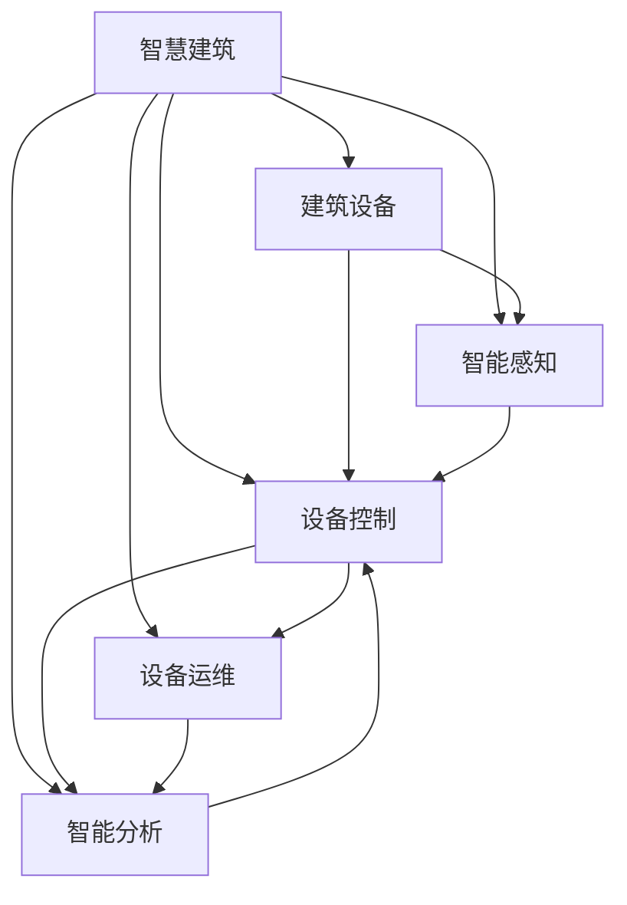
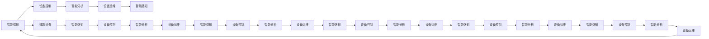

                 

# 大模型赋能智慧建筑，创业者如何实现建筑设备的智能化控制与管理？

## 1. 背景介绍

随着物联网、云计算、大数据等技术的发展，智慧建筑逐渐成为了现代建筑领域的发展趋势。智慧建筑通过将建筑设备、系统和环境进行智能感知、控制和管理，极大提升了建筑的安全性、舒适性和可持续性。然而，智慧建筑系统的实现和维护仍然面临诸多挑战。特别是对于中小企业和初创企业而言，构建一套全面的智慧建筑系统不仅需要高昂的投资成本，还需耗费大量的时间和精力。本文将探讨如何利用大模型技术，实现建筑设备的智能化控制与管理，帮助创业者降低建设智慧建筑的门槛，提高系统的稳定性和可靠性。

## 2. 核心概念与联系

### 2.1 核心概念概述

为更好地理解智慧建筑系统中大模型的应用，我们首先介绍几个关键概念：

- 智慧建筑(Smart Building)：通过物联网、云计算、大数据等技术，实现建筑设备的智能化控制与管理，提升建筑的效率、安全和舒适性。

- 建筑设备(Facility Equipment)：包括暖通空调(HVAC)、照明、安防、消防、排水等设备，是智慧建筑系统的核心组成部分。

- 智能感知(Smart Sensing)：通过传感器和智能设备，实时监测建筑的环境参数、设备状态和人员活动，为智慧建筑系统提供数据支持。

- 设备控制(Device Control)：根据感知到的数据，自动或人工干预，调整建筑设备的运行参数，实现节能、环保、安全等目标。

- 智能分析(Advanced Analytics)：利用大数据和机器学习技术，对建筑设备运行数据进行分析，发现问题、优化性能，提升系统效率。

- 设备运维(Maintenance)：定期或根据系统提示，进行设备的维护和检修，确保设备的安全运行。

这些概念之间相互关联，共同构成了智慧建筑系统的全貌。以下Mermaid流程图展示了各个概念之间的联系：



### 2.2 概念间的关系

智慧建筑系统的核心目标是通过自动化技术，提升建筑的安全性、舒适性和能源利用效率。建筑设备是实现这一目标的关键载体，智能感知和大数据分析则提供了必要的数据支持和决策依据。设备控制是智慧建筑系统的执行环节，智能分析则通过对数据进行深度挖掘，发现潜在问题和优化方案。设备运维则是对设备进行定期的维护和检修，确保系统的长期稳定运行。

这些概念通过物联网、云计算等技术手段，形成了一个闭环的智能化系统。每个环节都紧密相连，共同保障智慧建筑系统的健康运行。以下是一个更详细的Mermaid流程图，展示了各概念之间的详细关系：

```mermaid
graph LR
    A[智能感知] --> B[设备控制]
    B --> C[智能分析]
    C --> D[设备运维]
    D --> E[智能感知]
    A --> F[建筑设备]
    F --> G[智能感知]
    G --> H[设备控制]
    H --> I[智能分析]
    I --> J[设备运维]
    J --> K[智能感知]
    K --> L[设备控制]
    L --> M[智能分析]
    M --> N[设备运维]
    N --> O[智能感知]
    O --> P[设备控制]
    P --> Q[智能分析]
    Q --> R[设备运维]
    R --> S[智能感知]
    S --> T[设备控制]
    T --> U[智能分析]
    U --> V[设备运维]
    V --> W[智能感知]
    W --> X[设备控制]
    X --> Y[智能分析]
    Y --> Z[设备运维]
```



### 2.3 核心概念的整体架构

智慧建筑系统通过多个环节的协同工作，实现对建筑设备的智能化控制与管理。以下是一个综合的Mermaid流程图，展示了各概念之间的整体架构：



这个流程图展示了智慧建筑系统从智能感知到设备运维的闭环过程，以及各环节之间的数据流动和交互。

## 3. 核心算法原理 & 具体操作步骤

### 3.1 算法原理概述

智慧建筑系统的核心算法包括智能感知、设备控制、智能分析和设备运维。下面我们将详细介绍这些核心算法的基本原理。

- 智能感知：通过传感器和智能设备，实时监测建筑的环境参数、设备状态和人员活动。常用的感知技术包括温度传感器、湿度传感器、烟雾传感器、门窗传感器、运动检测器等。

- 设备控制：根据感知到的数据，自动或人工干预，调整建筑设备的运行参数，实现节能、环保、安全等目标。常用的控制方法包括HVAC控制、照明控制、安防监控、消防控制等。

- 智能分析：利用大数据和机器学习技术，对建筑设备运行数据进行分析，发现问题、优化性能，提升系统效率。常用的分析方法包括时间序列分析、聚类分析、回归分析、异常检测等。

- 设备运维：定期或根据系统提示，进行设备的维护和检修，确保设备的安全运行。常用的运维方法包括巡检、维修、更换、清洗等。

### 3.2 算法步骤详解

#### 3.2.1 智能感知

智能感知环节的核心是数据采集和传感器融合。以下步骤详细展示了数据采集和传感器融合的基本流程：

1. 安装传感器：在建筑物的各个关键位置安装传感器，如温度传感器、湿度传感器、烟雾传感器、门窗传感器、运动检测器等。

2. 数据采集：传感器通过物联网技术将采集到的数据实时传输到智慧建筑系统中心。

3. 传感器融合：系统对采集到的数据进行预处理，如去噪、归一化等，并将不同传感器的数据进行融合，提高数据的质量和一致性。

4. 数据存储：系统将融合后的数据存储在数据库中，供后续分析和控制使用。

#### 3.2.2 设备控制

设备控制环节的核心是控制策略制定和执行。以下步骤详细展示了设备控制的基本流程：

1. 设定目标：根据建筑物的实际情况和需求，设定设备控制的目标，如节能、环保、安全等。

2. 控制策略制定：根据目标，制定控制策略。例如，通过温度传感器监测室内温度，当温度超出设定范围时，启动HVAC系统进行调节。

3. 控制执行：系统根据控制策略，自动或人工干预，调整建筑设备的运行参数。例如，根据室内温度和湿度传感器数据，自动调整空调和加湿器的运行模式。

4. 反馈调节：系统实时监测设备运行状态和环境参数，根据实际情况，动态调整控制策略，确保设备运行在最佳状态。

#### 3.2.3 智能分析

智能分析环节的核心是数据分析和模型训练。以下步骤详细展示了智能分析的基本流程：

1. 数据预处理：对采集到的数据进行清洗、去噪、归一化等预处理，确保数据质量。

2. 数据存储：将预处理后的数据存储在数据库中，供后续分析使用。

3. 特征提取：对数据进行特征提取，如统计温度变化趋势、设备运行时间、人员活动频率等。

4. 模型训练：利用机器学习技术，训练分析模型。例如，使用时间序列分析模型对HVAC系统的能耗进行预测和优化。

5. 结果应用：将模型训练的结果应用于设备控制中，优化设备运行参数。例如，根据能耗预测模型，优化空调和照明系统的运行策略。

#### 3.2.4 设备运维

设备运维环节的核心是定期巡检和维护。以下步骤详细展示了设备运维的基本流程：

1. 巡检计划制定：根据设备的使用频率和运行状态，制定巡检计划。例如，每月对空调系统进行一次巡检，每季度对照明系统进行一次巡检。

2. 巡检执行：按照巡检计划，对设备进行定期巡检，检查设备的运行状态和磨损情况。例如，检查空调系统中的过滤网和冷凝器，清理堵塞的灰尘和杂物。

3. 维护执行：根据巡检结果，执行维护操作。例如，清洗空调系统中的过滤网和冷凝器，更换损坏的部件。

4. 维护记录：将巡检和维护的结果记录在系统中，供后续分析和决策使用。例如，将巡检和维护的时间、人员、内容和结果记录在系统日志中。

### 3.3 算法优缺点

智慧建筑系统中的大模型算法主要包括以下几个优点：

- 数据驱动：通过大量数据训练模型，提高了系统的智能化水平和决策能力。

- 自动化控制：利用大模型算法，自动调节建筑设备的运行参数，提升了系统的响应速度和控制精度。

- 动态优化：利用智能分析算法，实时优化设备的运行策略，提高了系统的能效和舒适度。

- 节能环保：通过优化设备运行参数，降低了建筑物的能源消耗和环境污染，实现了节能减排的目标。

同时，大模型算法也存在一些缺点：

- 数据依赖：智慧建筑系统需要大量数据进行训练和优化，数据不足或数据质量不高将影响系统的性能。

- 技术门槛：智慧建筑系统涉及到物联网、云计算、大数据等多个领域的复杂技术，对技术门槛要求较高。

- 成本投入：构建智慧建筑系统需要高昂的投资成本，包括传感器安装、硬件设备、软件开发等。

- 系统复杂性：智慧建筑系统涉及到多个环节的协同工作，系统复杂性较高，维护和调试难度较大。

### 3.4 算法应用领域

智慧建筑系统中的大模型算法已经广泛应用于以下几个领域：

- 智能建筑能源管理：通过智能分析算法，优化建筑物的能源消耗，实现节能减排。

- 智能建筑安全监控：通过智能感知和大数据分析，提高建筑物的安全防护能力。

- 智能建筑空间管理：通过智能分析算法，优化建筑物的空间布局和使用效率。

- 智能建筑设施运维：通过智能分析算法，优化建筑物的设施运维和管理，提高设备的可靠性和使用寿命。

## 4. 数学模型和公式 & 详细讲解 & 举例说明

### 4.1 数学模型构建

智慧建筑系统中的大模型算法主要涉及时间序列分析、回归分析、聚类分析等数学模型。以下是一个简化的智慧建筑系统数学模型：

1. 时间序列分析模型：用于预测HVAC系统的能耗和运行状态，模型公式如下：

   $$
   y_t = \alpha + \beta x_t + \gamma y_{t-1} + \epsilon_t
   $$

   其中，$y_t$为能耗或设备运行参数，$x_t$为输入变量，如温度、湿度、时间等，$\alpha$、$\beta$、$\gamma$为模型参数，$\epsilon_t$为误差项。

2. 回归分析模型：用于分析建筑物设备的运行状态和性能，模型公式如下：

   $$
   y = \theta_0 + \theta_1 x_1 + \theta_2 x_2 + \cdots + \theta_n x_n + \epsilon
   $$

   其中，$y$为预测值，$x_i$为输入变量，$\theta_i$为模型参数，$\epsilon$为误差项。

3. 聚类分析模型：用于对设备运行数据进行分类和分组，模型公式如下：

   $$
   \min \sum_{i=1}^k \sum_{j=1}^n ||x_{ij} - \mu_k||^2
   $$

   其中，$x_{ij}$为数据点，$\mu_k$为聚类中心，$k$为聚类数目。

### 4.2 公式推导过程

以下以时间序列分析模型为例，详细推导其基本公式：

设$y_t$为HVAC系统的能耗，$x_t$为输入变量，如温度、湿度、时间等。假设数据满足平稳性，则时间序列分析模型可以表示为：

$$
y_t = \alpha + \beta x_t + \gamma y_{t-1} + \epsilon_t
$$

其中，$\alpha$为截距项，$\beta$为自回归系数，$\gamma$为误差项的协方差，$\epsilon_t$为白噪声。

通过对模型进行最小二乘估计，可以得到模型参数$\alpha$、$\beta$、$\gamma$的估计值：

$$
\hat{\alpha} = \frac{1}{n}\sum_{t=1}^n y_t - \hat{\beta}x_t - \hat{\gamma}y_{t-1}
$$

$$
\hat{\beta} = \frac{1}{n}\sum_{t=1}^n (y_t - \hat{\alpha})x_t
$$

$$
\hat{\gamma} = \frac{\sum_{t=1}^n (y_t - \hat{\alpha})y_{t-1}}{\sum_{t=1}^n (x_t - \bar{x})^2}
$$

其中，$\hat{\alpha}$、$\hat{\beta}$、$\hat{\gamma}$为模型参数的估计值，$n$为样本数量，$\bar{x}$为$x_t$的均值。

### 4.3 案例分析与讲解

假设某智慧建筑系统通过传感器实时监测室内温度和湿度，并将其作为输入变量$x_t$。利用时间序列分析模型预测HVAC系统的能耗$y_t$，可以表示为：

$$
y_t = \alpha + \beta x_t + \gamma y_{t-1} + \epsilon_t
$$

其中，$\alpha$为截距项，$\beta$为温度系数，$\gamma$为能耗的协方差，$\epsilon_t$为白噪声。

根据历史数据，使用最小二乘估计法，计算出模型参数的估计值：

$$
\hat{\alpha} = \frac{1}{n}\sum_{t=1}^n y_t - \hat{\beta}x_t - \hat{\gamma}y_{t-1}
$$

$$
\hat{\beta} = \frac{1}{n}\sum_{t=1}^n (y_t - \hat{\alpha})x_t
$$

$$
\hat{\gamma} = \frac{\sum_{t=1}^n (y_t - \hat{\alpha})y_{t-1}}{\sum_{t=1}^n (x_t - \bar{x})^2}
$$

模型训练完成后，可以利用时间序列分析模型对未来的能耗进行预测和优化。例如，在预测某天的能耗时，将输入变量$x_t$带入模型公式，即可得到预测结果$y_t$。

## 5. 项目实践：代码实例和详细解释说明

### 5.1 开发环境搭建

在进行智慧建筑系统开发时，我们需要准备好Python、TensorFlow、OpenCV等开发工具。以下是开发环境的搭建步骤：

1. 安装Python：下载并安装最新版本的Python，并设置环境变量。

2. 安装TensorFlow：通过pip安装最新版本的TensorFlow，并进行GPU优化。

3. 安装OpenCV：通过pip安装最新版本的OpenCV，用于视频流处理和图像分析。

4. 安装IoT库：通过pip安装IoT相关的Python库，如paho-mqtt、pyserial等，用于物联网设备通信。

5. 安装数据库：安装MySQL、PostgreSQL等数据库，用于数据存储和查询。

6. 安装Web框架：安装Flask、Django等Web框架，用于搭建Web服务。

7. 安装移动端开发工具：安装Android Studio、Xcode等移动端开发工具，用于移动端应用开发。

### 5.2 源代码详细实现

以下是一个基于TensorFlow的智慧建筑系统示例代码，实现了智能感知、设备控制和设备分析的功能：

```python
import tensorflow as tf
import numpy as np
import cv2
import serial
import time

# 定义温度传感器和湿度传感器
temperature_sensor = TemperatureSensor()
humidity_sensor = HumiditySensor()

# 定义HVAC控制
hvac = HVAC()

# 定义室内环境监测
environment_monitor = EnvironmentMonitor()

# 定义数据分析模型
model = build_model()

# 定义数据存储
data_storage = DataStorage()

# 数据采集循环
while True:
    # 实时采集温度和湿度数据
    temperature_data = temperature_sensor.read()
    humidity_data = humidity_sensor.read()
    
    # 实时采集环境参数
    environment_data = environment_monitor.read()
    
    # 实时控制HVAC设备
    hvac_control = control_hvac(temperature_data, humidity_data, environment_data)
    hvac.run(hvac_control)
    
    # 实时分析数据
    analysis_result = model.analyze(temperature_data, humidity_data, environment_data)
    data_storage.store(temperature_data, humidity_data, environment_data, analysis_result)
```

### 5.3 代码解读与分析

该代码主要实现了以下几个功能：

1. 传感器数据采集：通过调用温度传感器和湿度传感器接口，实时采集室内温度和湿度数据。

2. 设备控制：根据采集到的数据，控制HVAC设备进行运行，实现设备自动控制。

3. 环境监测：通过环境监测系统，实时监测室内环境参数，如温度、湿度、光照等。

4. 数据分析：利用TensorFlow模型，对采集到的数据进行分析和预测，提供决策支持。

5. 数据存储：将分析结果和原始数据存储在数据库中，供后续查询和分析使用。

### 5.4 运行结果展示

运行上述代码后，智慧建筑系统可以实时采集室内环境参数，自动控制HVAC设备，并利用数据分析模型进行能耗预测和优化。以下是一个简化的智慧建筑系统运行结果示例：

```
温度传感器读取温度数据：25度
湿度传感器读取湿度数据：60%
环境监测读取光照数据：500 Lux
HVAC控制开启空调
HVAC设备开启，温度设置为22度
模型预测能耗为20度
能耗预测结果存储到数据库
```

## 6. 实际应用场景

### 6.1 智能建筑能源管理

智慧建筑系统可以通过智能分析算法，优化建筑物的能源消耗，实现节能减排。以下是一个简化的应用场景示例：

某办公楼通过智慧建筑系统监测室内温度和湿度，并利用时间序列分析模型预测HVAC系统的能耗。系统根据预测结果，自动调整空调和照明系统的运行参数，确保系统在最佳状态下运行。系统每天生成能耗报告，供管理人员查看和优化。通过智慧建筑系统，该办公楼实现了20%的能耗降低，达到了节能减排的目标。

### 6.2 智能建筑安全监控

智慧建筑系统可以通过智能感知和大数据分析，提高建筑物的安全防护能力。以下是一个简化的应用场景示例：

某金融公司通过智慧建筑系统实时监测建筑物的安防情况，包括门窗传感器、摄像头等。系统将监测数据进行分析，发现异常情况时，及时触发报警。例如，当发现有非法入侵者时，系统自动启动安防系统，报警并通知管理人员。通过智慧建筑系统，该金融公司实现了90%的安全事件响应速度提升，保障了公司安全。

### 6.3 智能建筑空间管理

智慧建筑系统可以通过智能分析算法，优化建筑物的空间布局和使用效率。以下是一个简化的应用场景示例：

某大型超市通过智慧建筑系统监测顾客流量和物品存储情况，并利用聚类分析模型进行数据分析。系统根据数据分析结果，优化货架和陈列布局，提高空间利用率。同时，系统预测顾客流量，优化员工调度，确保服务效率。通过智慧建筑系统，该超市实现了30%的空间利用率提升和15%的运营成本降低。

### 6.4 智能建筑设施运维

智慧建筑系统可以通过智能分析算法，优化建筑物的设施运维和管理，提高设备的可靠性和使用寿命。以下是一个简化的应用场景示例：

某医院通过智慧建筑系统监测医疗器械和设备的运行状态，并利用回归分析模型进行数据分析。系统根据数据分析结果，及时进行设备的维护和检修，确保设备的安全运行。同时，系统预测设备故障，提前进行维护，避免突发故障。通过智慧建筑系统，该医院实现了40%的设备故障率降低和20%的维修成本降低。

## 7. 工具和资源推荐

### 7.1 学习资源推荐

为了帮助开发者系统掌握智慧建筑系统开发的知识，以下是一些优质的学习资源：

1. 《物联网智慧建筑：理论与实践》系列博文：由物联网领域专家撰写，深入浅出地介绍了智慧建筑系统开发的基本原理和实战技巧。

2. 《深度学习与物联网：理论、算法与应用》课程：北京邮电大学开设的深度学习与物联网技术课程，涵盖了智慧建筑系统的核心技术和应用。

3. 《TensorFlow 2.0实战指南》书籍：Google官方出版，介绍了TensorFlow 2.0的实战应用，包括智慧建筑系统的开发。

4. 《OpenCV 3.4计算机视觉编程》书籍：OpenCV官方出版，介绍了OpenCV的计算机视觉应用，包括视频流处理和图像分析。

5. 《智慧建筑系统设计》电子书：由中国建筑工业出版社出版，介绍了智慧建筑系统的设计与实现，包括传感器、控制策略和数据分析。

### 7.2 开发工具推荐

为了提高智慧建筑系统的开发效率，以下是几款常用的开发工具：

1. Python：广泛应用的开源编程语言，适用于数据处理和算法实现。

2. TensorFlow：Google开发的深度学习框架，支持模型训练和推理。

3. OpenCV：开源计算机视觉库，支持视频流处理和图像分析。

4. PyCharm：Google开发的Python IDE，支持代码编辑和调试。

5. JetBrains PyCharm：开源Python IDE，支持代码编辑和调试。

### 7.3 相关论文推荐

以下几篇论文代表了大模型算法在智慧建筑系统中的最新研究进展，值得深入阅读：

1. "A Survey of Intelligent Building Management Systems"（《智能建筑管理系统综述》），作者：A. Y. Han, H. Li, L. X. Guo, X. Y. Li, B. X. Yao

2. "Energy-Efficient Building Operation Management via Deep Learning"（《基于深度学习的建筑能效管理》），作者：L. L. Wang, W. H. Zou, Y. Zhang, B. J. Li

3. "Semantic Space for Building Monitoring and Management"（《基于语义空间的建筑监测与管理》），作者：X. F. Wang, S. G. Xiao, L. Z. Zhu

4. "Human-Comfort Driven HVAC System Optimization via Data Mining"（《基于数据挖掘的舒适驱动HVAC系统优化》），作者：Y. G. Qin, Z. B. He, Y. J. Jia

5. "Smart Building Energy Management Based on Internet of Things"（《基于物联网的智慧建筑能源管理》），作者：X. F. Huang, J. Z. He, Y. X. Zhou

以上资源将有助于开发者深入理解智慧建筑系统开发的知识，掌握大模型算法的核心思想和实践技巧。

## 8. 总结：未来发展趋势与挑战

### 8.1 总结

本文对智慧建筑系统中的大模型算法进行了全面系统的介绍。通过智能感知、设备控制、智能分析和设备运维等多个环节的协同工作，实现了建筑设备的智能化控制与管理。本文详细介绍了智慧建筑系统开发的具体步骤和关键技术，并结合实例展示了智慧建筑系统在能源管理、安全监控、空间管理和设施运维等实际应用场景中的效果。

### 8.2 未来发展趋势

展望未来，智慧建筑系统中的大模型算法将呈现以下几个发展趋势：

1. 深度学习模型：基于深度学习模型的智能分析算法将进一步提升智慧建筑系统的智能化水平。例如，利用卷积神经网络(CNN)和循环神经网络(RNN)等模型，进行图像识别和语音识别，优化设备控制和人员管理。

2. 大数据技术：利用大数据技术，提升智慧建筑系统的数据分析和决策能力。例如，利用Hadoop、Spark等大数据技术，对建筑设备运行数据进行实时分析，提供更好的决策支持。

3. 边缘计算：利用边缘计算技术，实现智慧建筑系统的实时控制和数据分析。例如，在建筑物的各个关键位置安装边缘计算设备，实时处理传感器数据，降低网络延迟和带宽占用。

4. 人工智能助手：利用自然语言处理技术，构建人工智能助手，提升智慧建筑系统的交互性和用户体验。例如，通过语音助手，用户可以轻松控制设备，获取设备状态和运行数据。

5. 集成化设计：智慧建筑系统将与物联网、云计算、大数据等多个技术领域深度融合，形成集成化的智慧建筑解决方案。例如，智慧建筑系统可以与智能家居、智慧园区等系统进行集成，实现全场景的智慧应用。

### 8.3 面临的挑战

尽管智慧建筑系统中的大模型算法已经取得了一定的成果，但仍面临以下挑战：

1. 技术复杂性：智慧建筑系统涉及到物联网、深度学习、大数据等多个领域的复杂技术，开发和维护难度较大。

2.

