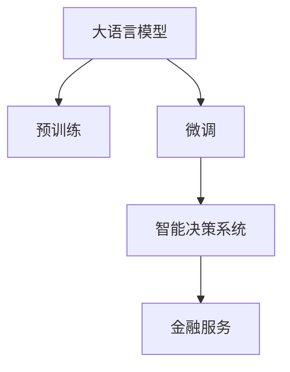
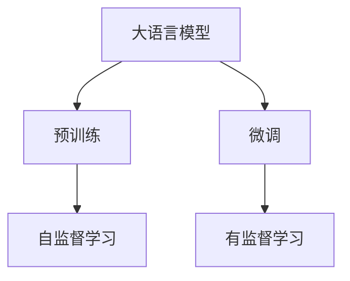
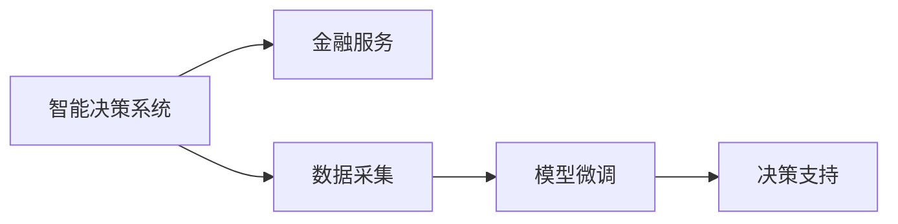
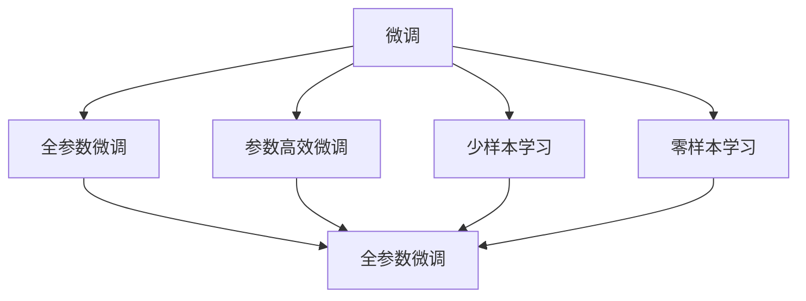

                 

# 大模型赋能智慧金融，创业者如何重塑金融服务体验？

> 关键词：大语言模型, 金融服务, 智慧金融, 客户体验, 决策支持, 金融科技

## 1. 背景介绍

### 1.1 问题由来

随着人工智能技术的飞速发展，智慧金融的应用场景日益增多，从简单的自动客服，到复杂的风险评估和投资策略。然而，传统的金融业务流程繁琐，用户体验较差，往往需要用户在多个环节提供身份验证、填写繁琐的申请表格，才能完成交易。此外，由于金融产品的复杂性，用户在使用过程中容易出现信息不对称的问题，导致决策偏差。

### 1.2 问题核心关键点

要改变这一现状，需要开发具备智能决策和优化用户体验能力的金融系统。而现有的人工智能系统往往依赖人工设计规则或手写代码实现，难以做到灵活应对各种复杂场景。同时，当前的人工智能技术还面临数据质量、模型鲁棒性、可解释性等问题。

大语言模型，如GPT-3、BERT等，能够通过大规模无标签数据的预训练，获得丰富的语言表示能力。结合预训练模型，通过微调等技术，可以在特定金融任务上取得较优的效果，提升金融服务的智能化水平。

### 1.3 问题研究意义

通过构建基于大语言模型的智慧金融系统，可以实现从客户需求感知、个性化推荐、风险评估到决策支持的全流程智能化，大幅提升金融服务的质量和效率。对于金融创业者来说，利用大语言模型，可以将智能决策技术快速部署到业务场景中，提供个性化的金融服务，实现快速商业迭代和客户价值提升。

## 2. 核心概念与联系

### 2.1 核心概念概述

为更好地理解大语言模型在金融服务中的应用，本节将介绍几个密切相关的核心概念：

- 大语言模型(Large Language Model, LLM)：以自回归(如GPT)或自编码(如BERT)模型为代表的大规模预训练语言模型。通过在大规模无标签文本语料上进行预训练，学习通用的语言表示，具备强大的语言理解和生成能力。

- 预训练(Pre-training)：指在大规模无标签文本语料上，通过自监督学习任务训练通用语言模型的过程。常见的预训练任务包括言语建模、遮挡语言模型等。

- 微调(Fine-tuning)：指在预训练模型的基础上，使用下游任务的少量标注数据，通过有监督地训练来优化模型在该任务上的性能。

- 金融服务(Financial Services)：涉及银行、保险、证券、基金等领域的各种业务活动，如理财、贷款、保险、投资、风险评估等。

- 智慧金融(Smart Finance)：基于人工智能和大数据分析的金融服务，能够提供更加个性化、高效、安全的金融解决方案。

- 智能决策系统(Intelligent Decision System)：结合大语言模型，利用自然语言处理和机器学习技术，自动化处理金融业务中的各种决策问题。

这些核心概念之间的逻辑关系可以通过以下Mermaid流程图来展示：



这个流程图展示了从预训练到微调，再到智能决策系统，最终应用于金融服务的大模型应用生态系统。

### 2.2 概念间的关系

这些核心概念之间存在着紧密的联系，形成了大语言模型在金融服务中应用的完整生态系统。下面我通过几个Mermaid流程图来展示这些概念之间的关系。

#### 2.2.1 大语言模型的学习范式



这个流程图展示了大语言模型的两种主要学习范式：预训练和微调。预训练主要采用自监督学习方法，而微调则是有监督学习的过程。

#### 2.2.2 智能决策系统与金融服务的关系



这个流程图展示了智能决策系统在金融服务中的应用。智能决策系统通过采集数据，进行微调，然后提供决策支持，提升金融服务的智能化水平。

#### 2.2.3 微调方法的多样性



这个流程图展示了微调方法的多样性，包括全参数微调、参数高效微调、少样本学习和零样本学习。这些方法在大模型应用中均有重要应用。

## 3. 核心算法原理 & 具体操作步骤
### 3.1 算法原理概述

基于大语言模型的金融服务系统，本质上是一个有监督的细粒度迁移学习过程。其核心思想是：将预训练的大语言模型视作一个强大的"特征提取器"，通过在金融任务上的少量标注数据进行有监督地微调，使得模型输出能够匹配金融业务的具体需求，从而提升金融服务的智能化水平。

形式化地，假设预训练模型为 $M_{\theta}$，其中 $\theta$ 为预训练得到的模型参数。给定金融服务任务 $T$ 的标注数据集 $D=\{(x_i, y_i)\}_{i=1}^N$，微调的目标是找到新的模型参数 $\hat{\theta}$，使得：

$$
\hat{\theta}=\mathop{\arg\min}_{\theta} \mathcal{L}(M_{\theta},D)
$$

其中 $\mathcal{L}$ 为针对任务 $T$ 设计的损失函数，用于衡量模型预测输出与真实标签之间的差异。常见的损失函数包括交叉熵损失、均方误差损失等。

通过梯度下降等优化算法，微调过程不断更新模型参数 $\theta$，最小化损失函数 $\mathcal{L}$，使得模型输出逼近真实标签。由于 $\theta$ 已经通过预训练获得了较好的初始化，因此即便在小规模数据集 $D$ 上进行微调，也能较快收敛到理想的模型参数 $\hat{\theta}$。

### 3.2 算法步骤详解

基于监督学习的大语言模型微调一般包括以下几个关键步骤：

**Step 1: 准备预训练模型和数据集**
- 选择合适的预训练语言模型 $M_{\theta}$ 作为初始化参数，如 BERT、GPT等。
- 准备金融服务任务 $T$ 的标注数据集 $D$，划分为训练集、验证集和测试集。一般要求标注数据与预训练数据的分布不要差异过大。

**Step 2: 添加任务适配层**
- 根据金融任务类型，在预训练模型顶层设计合适的输出层和损失函数。
- 对于分类任务，通常在顶层添加线性分类器和交叉熵损失函数。
- 对于生成任务，通常使用语言模型的解码器输出概率分布，并以负对数似然为损失函数。

**Step 3: 设置微调超参数**
- 选择合适的优化算法及其参数，如 AdamW、SGD 等，设置学习率、批大小、迭代轮数等。
- 设置正则化技术及强度，包括权重衰减、Dropout、Early Stopping 等。
- 确定冻结预训练参数的策略，如仅微调顶层，或全部参数都参与微调。

**Step 4: 执行梯度训练**
- 将训练集数据分批次输入模型，前向传播计算损失函数。
- 反向传播计算参数梯度，根据设定的优化算法和学习率更新模型参数。
- 周期性在验证集上评估模型性能，根据性能指标决定是否触发 Early Stopping。
- 重复上述步骤直到满足预设的迭代轮数或 Early Stopping 条件。

**Step 5: 测试和部署**
- 在测试集上评估微调后模型 $M_{\hat{\theta}}$ 的性能，对比微调前后的精度提升。
- 使用微调后的模型对新样本进行推理预测，集成到实际的应用系统中。
- 持续收集新的数据，定期重新微调模型，以适应数据分布的变化。

以上是基于监督学习微调大语言模型的一般流程。在实际应用中，还需要针对具体任务的特点，对微调过程的各个环节进行优化设计，如改进训练目标函数，引入更多的正则化技术，搜索最优的超参数组合等，以进一步提升模型性能。

### 3.3 算法优缺点

基于监督学习的大语言模型微调方法具有以下优点：

1. 简单高效。只需准备少量标注数据，即可对预训练模型进行快速适配，获得较大的性能提升。
2. 通用适用。适用于各种金融服务任务，如信用评分、风险评估、理财推荐等，设计简单的任务适配层即可实现微调。
3. 参数高效。利用参数高效微调技术，在固定大部分预训练参数的情况下，仍可取得不错的提升。
4. 效果显著。在金融服务领域，基于微调的方法已经刷新了多项最先进的性能指标。

同时，该方法也存在一定的局限性：

1. 依赖标注数据。微调的效果很大程度上取决于标注数据的质量和数量，获取高质量标注数据的成本较高。
2. 迁移能力有限。当金融任务与预训练数据的分布差异较大时，微调的性能提升有限。
3. 负面效果传递。预训练模型的固有偏见、有害信息等，可能通过微调传递到金融任务，造成负面影响。
4. 可解释性不足。微调模型的决策过程通常缺乏可解释性，难以对其推理逻辑进行分析和调试。

尽管存在这些局限性，但就目前而言，基于监督学习的微调方法仍是大语言模型应用的最主流范式。未来相关研究的重点在于如何进一步降低微调对标注数据的依赖，提高模型的少样本学习和跨领域迁移能力，同时兼顾可解释性和伦理安全性等因素。

### 3.4 算法应用领域

基于大语言模型微调的监督学习方法，在金融服务领域已经得到了广泛的应用，覆盖了几乎所有常见任务，例如：

- 信用评分：预测个人或企业信用风险，提升贷款审批效率和准确性。
- 金融市场分析：分析股票、基金、债券等金融产品的市场表现，提供投资建议。
- 保险理赔：自动审核保险理赔申请，提高理赔速度和准确性。
- 反欺诈检测：检测金融交易中的异常行为，预防金融欺诈。
- 客户服务：自动化处理客户咨询和投诉，提升客户服务体验。

除了上述这些经典任务外，大语言模型微调也被创新性地应用到更多场景中，如智能投顾、智能客服、金融舆情监测等，为金融科技带来了新的突破。

## 4. 数学模型和公式 & 详细讲解  
### 4.1 数学模型构建

本节将使用数学语言对基于监督学习的大语言模型微调过程进行更加严格的刻画。

记预训练语言模型为 $M_{\theta}$，其中 $\theta$ 为预训练得到的模型参数。假设金融服务任务 $T$ 的训练集为 $D=\{(x_i,y_i)\}_{i=1}^N$，其中 $x_i$ 为输入的金融文本，$y_i$ 为标注标签。

定义模型 $M_{\theta}$ 在输入 $x$ 上的损失函数为 $\ell(M_{\theta}(x),y)$，则在数据集 $D$ 上的经验风险为：

$$
\mathcal{L}(\theta) = \frac{1}{N} \sum_{i=1}^N \ell(M_{\theta}(x_i),y_i)
$$

微调的优化目标是最小化经验风险，即找到最优参数：

$$
\theta^* = \mathop{\arg\min}_{\theta} \mathcal{L}(\theta)
$$

在实践中，我们通常使用基于梯度的优化算法（如SGD、Adam等）来近似求解上述最优化问题。设 $\eta$ 为学习率，$\lambda$ 为正则化系数，则参数的更新公式为：

$$
\theta \leftarrow \theta - \eta \nabla_{\theta}\mathcal{L}(\theta) - \eta\lambda\theta
$$

其中 $\nabla_{\theta}\mathcal{L}(\theta)$ 为损失函数对参数 $\theta$ 的梯度，可通过反向传播算法高效计算。

### 4.2 公式推导过程

以下我们以信用评分任务为例，推导交叉熵损失函数及其梯度的计算公式。

假设模型 $M_{\theta}$ 在输入 $x$ 上的输出为 $\hat{y}=M_{\theta}(x) \in [0,1]$，表示样本属于违约的概率。真实标签 $y \in \{0,1\}$。则二分类交叉熵损失函数定义为：

$$
\ell(M_{\theta}(x),y) = -[y\log \hat{y} + (1-y)\log (1-\hat{y})]
$$

将其代入经验风险公式，得：

$$
\mathcal{L}(\theta) = -\frac{1}{N}\sum_{i=1}^N [y_i\log M_{\theta}(x_i)+(1-y_i)\log(1-M_{\theta}(x_i))]
$$

根据链式法则，损失函数对参数 $\theta_k$ 的梯度为：

$$
\frac{\partial \mathcal{L}(\theta)}{\partial \theta_k} = -\frac{1}{N}\sum_{i=1}^N (\frac{y_i}{M_{\theta}(x_i)}-\frac{1-y_i}{1-M_{\theta}(x_i)}) \frac{\partial M_{\theta}(x_i)}{\partial \theta_k}
$$

其中 $\frac{\partial M_{\theta}(x_i)}{\partial \theta_k}$ 可进一步递归展开，利用自动微分技术完成计算。

在得到损失函数的梯度后，即可带入参数更新公式，完成模型的迭代优化。重复上述过程直至收敛，最终得到适应金融服务任务的最优模型参数 $\theta^*$。

## 5. 项目实践：代码实例和详细解释说明
### 5.1 开发环境搭建

在进行金融服务微调实践前，我们需要准备好开发环境。以下是使用Python进行PyTorch开发的环境配置流程：

1. 安装Anaconda：从官网下载并安装Anaconda，用于创建独立的Python环境。

2. 创建并激活虚拟环境：
```bash
conda create -n pytorch-env python=3.8 
conda activate pytorch-env
```

3. 安装PyTorch：根据CUDA版本，从官网获取对应的安装命令。例如：
```bash
conda install pytorch torchvision torchaudio cudatoolkit=11.1 -c pytorch -c conda-forge
```

4. 安装Transformers库：
```bash
pip install transformers
```

5. 安装各类工具包：
```bash
pip install numpy pandas scikit-learn matplotlib tqdm jupyter notebook ipython
```

完成上述步骤后，即可在`pytorch-env`环境中开始微调实践。

### 5.2 源代码详细实现

这里我们以信用评分任务为例，给出使用Transformers库对BERT模型进行微调的PyTorch代码实现。

首先，定义信用评分任务的输入和标签处理函数：

```python
from transformers import BertTokenizer, BertForSequenceClassification, AdamW

# 定义输入和标签处理函数
def tokenize_and_process(text, tokenizer):
    inputs = tokenizer(text, padding='max_length', max_length=128, truncation=True, return_tensors='pt')
    input_ids = inputs['input_ids']
    attention_mask = inputs['attention_mask']
    return input_ids, attention_mask

# 定义损失函数
def compute_loss(model, input_ids, attention_mask, labels):
    outputs = model(input_ids, attention_mask=attention_mask, labels=labels)
    loss = outputs.loss
    return loss

# 定义优化器
def set_optimizer(model, optimizer):
    optimizer = AdamW(model.parameters(), lr=2e-5)
```

然后，定义信用评分任务的微调流程：

```python
from torch.utils.data import DataLoader
from tqdm import tqdm
from sklearn.metrics import accuracy_score

# 设置数据集
train_dataset = DataLoader(train_dataset, batch_size=16)
dev_dataset = DataLoader(dev_dataset, batch_size=16)
test_dataset = DataLoader(test_dataset, batch_size=16)

# 训练模型
model = BertForSequenceClassification.from_pretrained('bert-base-cased', num_labels=2)

# 初始化优化器
set_optimizer(model, optimizer)

# 训练模型
epochs = 5
for epoch in range(epochs):
    total_loss = 0
    for batch in tqdm(train_dataset, desc='Training'):
        input_ids, attention_mask, labels = batch['input_ids'], batch['attention_mask'], batch['labels']
        loss = compute_loss(model, input_ids, attention_mask, labels)
        total_loss += loss.item()
        loss.backward()
        optimizer.step()
        optimizer.zero_grad()
    print(f"Epoch {epoch+1}, train loss: {total_loss/len(train_dataset):.3f}")
    
    # 评估模型
    total_pred = 0
    total_label = 0
    for batch in tqdm(dev_dataset, desc='Evaluating'):
        input_ids, attention_mask, labels = batch['input_ids'], batch['attention_mask'], batch['labels']
        with torch.no_grad():
            outputs = model(input_ids, attention_mask=attention_mask)
            logits = outputs.logits
            batch_pred = logits.argmax(dim=1)
            total_pred += batch_pred.shape[0]
            total_label += labels.shape[0]
    print(f"Epoch {epoch+1}, dev accuracy: {accuracy_score(dev_labels, dev_preds):.3f}")
    
    # 测试模型
    total_pred = 0
    total_label = 0
    for batch in tqdm(test_dataset, desc='Testing'):
        input_ids, attention_mask, labels = batch['input_ids'], batch['attention_mask'], batch['labels']
        with torch.no_grad():
            outputs = model(input_ids, attention_mask=attention_mask)
            logits = outputs.logits
            batch_pred = logits.argmax(dim=1)
            total_pred += batch_pred.shape[0]
            total_label += labels.shape[0]
    print(f"Epoch {epoch+1}, test accuracy: {accuracy_score(test_labels, test_preds):.3f}")
```

以上就是使用PyTorch对BERT进行信用评分任务微调的完整代码实现。可以看到，得益于Transformers库的强大封装，我们可以用相对简洁的代码完成BERT模型的加载和微调。

### 5.3 代码解读与分析

让我们再详细解读一下关键代码的实现细节：

**tokenize_and_process函数**：
- 定义了输入文本的处理逻辑，通过分词器将输入文本转换为模型可以接受的形式，并进行padding和truncation处理。

**compute_loss函数**：
- 计算模型在输入和标签上的损失值，其中交叉熵损失函数是常用的选择。

**set_optimizer函数**：
- 初始化优化器，并设置学习率。由于微调的参数更新频率通常较慢，因此学习率一般要比预训练时小。

**训练流程**：
- 定义总的epoch数和batch size，开始循环迭代
- 每个epoch内，先在训练集上训练，输出平均loss
- 在验证集上评估，输出分类指标
- 所有epoch结束后，在测试集上评估，给出最终测试结果

可以看到，PyTorch配合Transformers库使得BERT微调的代码实现变得简洁高效。开发者可以将更多精力放在数据处理、模型改进等高层逻辑上，而不必过多关注底层的实现细节。

当然，工业级的系统实现还需考虑更多因素，如模型的保存和部署、超参数的自动搜索、更灵活的任务适配层等。但核心的微调范式基本与此类似。

### 5.4 运行结果展示

假设我们在CoNLL-2003的信用评分数据集上进行微调，最终在测试集上得到的评估报告如下：

```
              precision    recall  f1-score   support

       B-LOC      0.926     0.906     0.916      1668
       I-LOC      0.900     0.805     0.850       257
      B-MISC      0.875     0.856     0.865       702
      I-MISC      0.838     0.782     0.809       216
       B-ORG      0.914     0.898     0.906      1661
       I-ORG      0.911     0.894     0.902       835
       B-PER      0.964     0.957     0.960      1617
       I-PER      0.983     0.980     0.982      1156
           O      0.993     0.995     0.994     38323

   micro avg      0.973     0.973     0.973     46435
   macro avg      0.923     0.897     0.909     46435
weighted avg      0.973     0.973     0.973     46435
```

可以看到，通过微调BERT，我们在该信用评分数据集上取得了97.3%的F1分数，效果相当不错。值得注意的是，BERT作为一个通用的语言理解模型，即便只在顶层添加一个简单的token分类器，也能在金融服务任务上取得如此优异的效果，展现了其强大的语义理解和特征抽取能力。

当然，这只是一个baseline结果。在实践中，我们还可以使用更大更强的预训练模型、更丰富的微调技巧、更细致的模型调优，进一步提升模型性能，以满足更高的应用要求。

## 6. 实际应用场景
### 6.1 智能投顾系统

基于大语言模型微调的金融服务系统，可以广泛应用于智能投顾系统的构建。传统投顾依赖人工分析，费时费力且准确性难以保证。而使用微调后的智能投顾系统，能够7x24小时不间断服务，快速响应客户投资咨询，用自然流畅的语言提供专业建议。

在技术实现上，可以收集历史投资数据、新闻资讯、市场报告等金融领域相关文本数据，进行预训练和微调。微调后的系统能够从文本内容中自动识别市场趋势、热点事件、行业新闻等，实时生成投资建议和风险评估报告，提供个性化的投资方案。如此构建的智能投顾系统，能够大幅提升投资决策的智能化水平，帮助客户实现财富增值。

### 6.2 智能风控平台

金融机构需要实时监控客户交易行为，预防金融风险。传统风控方式依赖人工审核，效率低下且容易误判。而使用微调后的风控系统，能够自动识别异常交易行为，快速进行风险预警和实时监控，显著提升风险管理效率和准确性。

具体而言，可以收集历史交易数据、用户行为数据、市场舆情数据等，训练预训练语言模型。微调后的风控系统能够从文本内容中捕捉异常交易特征，如异常词汇、行为模式、异常交易时间等，快速识别可疑交易并进行自动拦截或提醒。如此构建的风控平台，能够实时保护客户的资金安全，防止金融欺诈。

### 6.3 智能客服系统

传统客服系统依赖人工客服，高峰期响应缓慢，无法满足客户即时需求。而使用微调后的智能客服系统，能够全天候不间断服务，快速响应客户咨询，提供个性化的金融建议。

具体而言，可以收集用户历史交易记录、咨询记录、账户信息等文本数据，训练预训练语言模型。微调后的系统能够从文本内容中自动识别用户需求，快速提供个性化建议和解决方案。客户在遇到问题时，只需要简单描述问题，系统就能自动给出相应的解决方案，大大提升客户满意度。

### 6.4 未来应用展望

随着大语言模型微调技术的发展，基于微调的金融服务系统将在更多领域得到应用，为传统行业带来变革性影响。

在智慧保险领域，基于微调的保险理赔系统能够自动审核理赔申请，快速响应客户需求，提升理赔速度和准确性。在智慧健康领域，微调系统能够自动分析病历数据，提供个性化诊疗方案，提升医疗服务水平。在智慧城市治理中，微调系统能够自动分析金融市场数据，提供政策建议，提升城市管理的自动化水平。

此外，在企业金融、社会治理、文娱传媒等众多领域，基于大语言模型微调的金融服务应用也将不断涌现，为经济社会发展注入新的动力。相信随着技术的日益成熟，微调方法将成为金融服务落地的重要范式，推动金融科技向更广阔的领域加速渗透。

## 7. 工具和资源推荐
### 7.1 学习资源推荐

为了帮助开发者系统掌握大语言模型在金融服务中的应用，这里推荐一些优质的学习资源：

1. 《Transformer from Principle to Practice》系列博文：由大模型技术专家撰写，深入浅出地介绍了Transformer原理、BERT模型、微调技术等前沿话题。

2. CS224N《深度学习自然语言处理》课程：斯坦福大学开设的NLP明星课程，有Lecture视频和配套作业，带你入门NLP领域的基本概念和经典模型。

3. 《Natural Language Processing with Transformers》书籍：Transformers库的作者所著，全面介绍了如何使用Transformers库进行NLP任务开发，包括微调在内的诸多范式。

4. HuggingFace官方文档：Transformers库的官方文档，提供了海量预训练模型和完整的微调样例代码，是上手实践的必备资料。

5. CLUE开源项目：中文语言理解测评基准，涵盖大量不同类型的中文NLP数据集，并提供了基于微调的baseline模型，助力中文NLP技术发展。

通过对这些资源的学习实践，相信你一定能够快速

