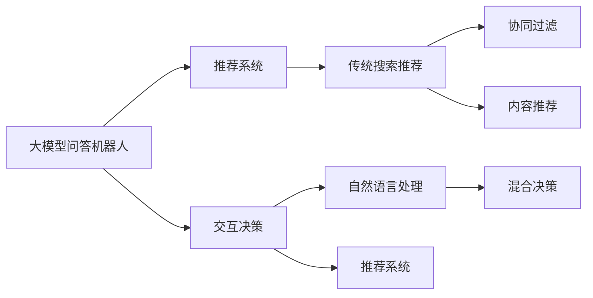
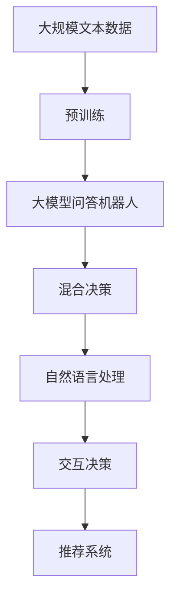
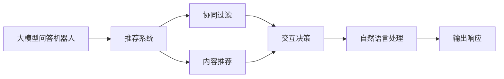
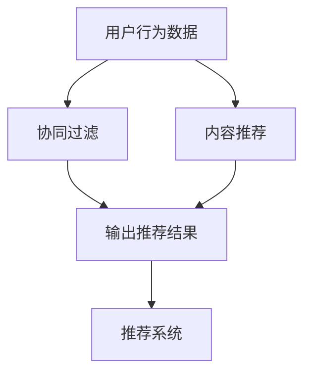

                 

# 大模型问答机器人与传统搜索推荐的交互方式

> 关键词：大模型问答机器人, 传统搜索推荐, 交互方式, 混合决策, 深度学习, 自然语言处理, 推荐系统

## 1. 背景介绍

### 1.1 问题由来
随着人工智能技术的快速发展，自然语言处理（Natural Language Processing, NLP）和推荐系统（Recommendation System, RS）成为推动信息获取和个性化服务的关键技术。传统的搜索推荐系统依赖于用户历史行为数据和系统内部知识图谱，为用户提供推荐和搜索结果。然而，这些系统往往难以处理复杂多变的用户需求，无法实现自然流畅的对话交互。

近年来，大模型问答机器人（Large Language Model-based Chatbot, LLM-Chatbot）凭借其在理解自然语言方面的强大能力，逐渐成为推动搜索推荐系统创新的重要工具。通过结合大模型问答机器人和传统搜索推荐系统，可以实现更加高效、智能的交互方式，提升用户体验。

### 1.2 问题核心关键点
本文聚焦于大模型问答机器人与传统搜索推荐的交互方式。探讨如何在大模型问答机器人中引入推荐系统知识，在传统推荐系统中引入对话系统信息，通过混合决策（Hybrid Decision）的方式，实现两者的有机结合。这种结合方式不仅能提升推荐系统的精度和用户满意度，还能拓展大模型问答机器人的应用范围。

## 2. 核心概念与联系

### 2.1 核心概念概述

为了更好地理解大模型问答机器人与传统搜索推荐系统的交互方式，本节将介绍几个核心概念及其相互联系：

- **大模型问答机器人**：基于大规模预训练语言模型（如BERT、GPT-3等）构建的智能问答系统。通过大规模语料预训练，学习到丰富的语言知识和常识，能够理解和生成自然语言文本。

- **传统搜索推荐系统**：基于用户行为数据和系统内部知识图谱构建的推荐系统。通过协同过滤、内容推荐等方法，为用户推荐最相关的信息和产品。

- **混合决策**：将大模型问答机器人和传统搜索推荐系统的输出进行融合，通过多模态信息的混合决策，提升决策的准确性和鲁棒性。

- **自然语言处理（NLP）**：涉及语言模型、文本分类、信息检索、对话系统等多个方面，是大模型问答机器人的核心技术。

- **推荐系统（RS）**：通过用户行为数据、协同过滤、内容推荐等方法，为用户推荐个性化信息。

- **交互方式**：用户与系统的交流方式，包括问答、推荐、协同过滤等多种形式。

这些核心概念之间的逻辑关系可以通过以下Mermaid流程图来展示：



这个流程图展示了大模型问答机器人与传统搜索推荐系统的核心概念及其相互关系：

1. 大模型问答机器人通过自然语言处理技术，理解用户输入的查询或问题。
2. 传统搜索推荐系统通过协同过滤和内容推荐技术，为用户推荐相关信息。
3. 通过混合决策，将大模型问答机器人和传统搜索推荐系统的输出融合，实现智能决策。
4. 最终输出以自然语言形式回答用户问题或推荐结果。

### 2.2 概念间的关系

这些核心概念之间存在着紧密的联系，形成了大模型问答机器人和传统搜索推荐系统的完整生态系统。下面我们通过几个Mermaid流程图来展示这些概念之间的关系。

#### 2.2.1 大模型问答机器人的学习范式



这个流程图展示了大模型问答机器人的学习范式，即通过大规模预训练学习语言知识和常识，并通过混合决策融合推荐系统信息。

#### 2.2.2 混合决策的过程



这个流程图展示了混合决策的过程，即大模型问答机器人理解用户输入后，通过推荐系统输出推荐结果，然后将两者进行融合，最终输出自然语言形式的响应。

#### 2.2.3 推荐系统的输入输出



这个流程图展示了推荐系统的输入输出，即通过用户行为数据和内容推荐技术，为用户推荐相关信息。

## 3. 核心算法原理 & 具体操作步骤
### 3.1 算法原理概述

大模型问答机器人与传统搜索推荐的交互方式，本质上是一种混合决策机制。其核心思想是：将大模型问答机器人和传统搜索推荐系统的输出进行融合，通过多模态信息的混合决策，提升决策的准确性和鲁棒性。

形式化地，假设大模型问答机器人为 $M_{\theta}$，推荐系统为 $R_{\phi}$，其中 $\theta$ 和 $\phi$ 分别为模型参数。用户输入为 $x$，模型输出为 $y$。混合决策的目标是最小化预测误差：

$$
\mathop{\arg\min}_{y} \mathcal{L}(M_{\theta},R_{\phi},x,y)
$$

其中 $\mathcal{L}$ 为损失函数，用于衡量预测输出与真实输出之间的差异。常见的损失函数包括交叉熵损失、均方误差损失等。

通过梯度下降等优化算法，混合决策过程不断更新模型参数 $\theta$ 和 $\phi$，最小化损失函数 $\mathcal{L}$，使得模型输出逼近真实输出。由于 $M_{\theta}$ 已经通过预训练获得了较强的语言理解能力，$R_{\phi}$ 能够快速获取用户相关信息的推荐结果，因此混合决策机制可以在保留预训练知识的同时，进一步提升推荐系统的准确性和用户体验。

### 3.2 算法步骤详解

大模型问答机器人与传统搜索推荐的混合决策过程，一般包括以下几个关键步骤：

**Step 1: 数据准备**
- 准备大模型问答机器人的预训练语料，收集推荐系统的用户行为数据和内容推荐结果。
- 对数据进行清洗和标注，确保数据质量和完整性。

**Step 2: 构建模型**
- 基于预训练语言模型（如BERT、GPT-3）构建大模型问答机器人。
- 使用协同过滤和内容推荐算法构建推荐系统，如矩阵分解、基于深度学习的推荐模型等。

**Step 3: 设计交互决策策略**
- 定义交互决策策略，如混合决策比例、模型权重分配等。
- 设计自然语言处理技术，将推荐结果转换为自然语言形式，以便用户理解。

**Step 4: 训练与优化**
- 使用用户交互数据，训练大模型问答机器人和推荐系统。
- 通过交互决策策略，将两者输出融合，优化模型参数。

**Step 5: 部署与评估**
- 将训练好的模型部署到实际应用系统中，进行实时交互。
- 定期评估模型性能，收集用户反馈，不断优化模型。

### 3.3 算法优缺点

大模型问答机器人与传统搜索推荐的混合决策机制，具有以下优点：
1. 精度提升：结合两者的优势，可以显著提升推荐系统的精度和用户满意度。
2. 鲁棒性强：通过多模态信息的融合，提高模型对异常数据的鲁棒性。
3. 通用适用：适用于各种推荐场景，如商品推荐、新闻推荐、音乐推荐等。
4. 实时响应：大模型问答机器人的高效响应能力，可以实时满足用户需求。

同时，该方法也存在以下局限性：
1. 数据依赖性：混合决策机制依赖于高质量的推荐数据和大模型问答机器人的预训练数据，数据获取成本较高。
2. 计算资源消耗大：需要同时训练和优化多个模型，计算资源消耗较大。
3. 解释性不足：混合决策机制较为复杂，模型的解释性和可解释性不足，难以调试和优化。

尽管存在这些局限性，但就目前而言，混合决策机制是大模型问答机器人与传统搜索推荐系统结合的重要范式，在多个推荐场景中已取得显著效果。未来相关研究应重点关注如何降低数据依赖性、提升计算效率和可解释性，以进一步推动该技术的成熟和应用。

### 3.4 算法应用领域

大模型问答机器人与传统搜索推荐系统的混合决策机制，已经在多个领域得到应用，例如：

- 电商推荐：结合大模型问答机器人和推荐系统，为用户提供个性化的商品推荐和购物问答服务。
- 新闻推荐：通过对话系统获取用户兴趣，结合推荐系统推荐相关新闻，提升用户体验。
- 音乐推荐：利用音乐领域的知识图谱和用户行为数据，提升推荐系统的准确性和个性化。
- 视频推荐：结合视频领域的数据和用户反馈，为用户提供更相关和吸引人的视频内容。

除了上述这些经典场景外，混合决策机制还被创新性地应用到更多领域中，如智能客服、智能家居、智能广告等，为传统行业带来智能化变革。随着预训练语言模型和推荐算法的持续演进，相信混合决策机制将在更多场景中发挥重要作用，进一步推动NLP技术的发展。

## 4. 数学模型和公式 & 详细讲解 & 举例说明
### 4.1 数学模型构建

本节将使用数学语言对大模型问答机器人与传统搜索推荐系统的交互决策过程进行更加严格的刻画。

假设用户输入为 $x$，大模型问答机器人的输出为 $M_{\theta}(x)$，推荐系统的输出为 $R_{\phi}(x)$，其中 $\theta$ 和 $\phi$ 分别为模型参数。设用户行为数据为 $D_{user}$，推荐系统内容为 $D_{item}$。

定义混合决策的目标函数为：

$$
\mathcal{L}(\theta,\phi,x,y) = \mathcal{L}_{NLP}(\theta,x) + \mathcal{L}_{RS}(\phi,y|x)
$$

其中 $\mathcal{L}_{NLP}(\theta,x)$ 为大模型问答机器人的损失函数，$\mathcal{L}_{RS}(\phi,y|x)$ 为推荐系统的损失函数。通过最小化目标函数 $\mathcal{L}(\theta,\phi,x,y)$，优化大模型问答机器人和推荐系统的模型参数。

### 4.2 公式推导过程

以下我们以电商推荐为例，推导混合决策的目标函数及梯度计算公式。

假设推荐系统输出商品推荐列表为 $r_1, r_2, \dots, r_n$，推荐系统输出的点击概率为 $p_i = R_{\phi}(x_i) = \phi(r_i)$，大模型问答机器人输出的商品名称为 $m_1, m_2, \dots, m_n$，用户点击的商品名称为 $y_i = M_{\theta}(m_i) = \theta(m_i)$。

则推荐系统的损失函数 $\mathcal{L}_{RS}(\phi,y|x)$ 为交叉熵损失函数：

$$
\mathcal{L}_{RS}(\phi,y|x) = -\frac{1}{N}\sum_{i=1}^N y_i \log p_i + (1-y_i) \log (1-p_i)
$$

大模型问答机器人的损失函数 $\mathcal{L}_{NLP}(\theta,x)$ 为交叉熵损失函数：

$$
\mathcal{L}_{NLP}(\theta,x) = -\frac{1}{M}\sum_{i=1}^M y_i \log p_i + (1-y_i) \log (1-p_i)
$$

其中 $p_i$ 为模型预测点击概率，$y_i$ 为实际点击行为。

通过上述定义，混合决策的目标函数 $\mathcal{L}(\theta,\phi,x,y)$ 为：

$$
\mathcal{L}(\theta,\phi,x,y) = \mathcal{L}_{NLP}(\theta,x) + \mathcal{L}_{RS}(\phi,y|x)
$$

接下来，我们计算混合决策的梯度。通过链式法则，有：

$$
\frac{\partial \mathcal{L}(\theta,\phi,x,y)}{\partial \theta} = \frac{\partial \mathcal{L}_{NLP}(\theta,x)}{\partial \theta} + \frac{\partial \mathcal{L}_{RS}(\phi,y|x)}{\partial \theta}
$$

$$
\frac{\partial \mathcal{L}(\theta,\phi,x,y)}{\partial \phi} = \frac{\partial \mathcal{L}_{NLP}(\theta,x)}{\partial \phi} + \frac{\partial \mathcal{L}_{RS}(\phi,y|x)}{\partial \phi}
$$

其中，$\frac{\partial \mathcal{L}_{NLP}(\theta,x)}{\partial \theta}$ 和 $\frac{\partial \mathcal{L}_{NLP}(\theta,x)}{\partial \phi}$ 为自然语言处理模型的梯度，$\frac{\partial \mathcal{L}_{RS}(\phi,y|x)}{\partial \theta}$ 和 $\frac{\partial \mathcal{L}_{RS}(\phi,y|x)}{\partial \phi}$ 为推荐系统的梯度。

通过上述公式，即可在实际训练过程中，同时更新大模型问答机器人和推荐系统的模型参数，实现混合决策。

### 4.3 案例分析与讲解

我们以电商平台推荐为例，详细分析大模型问答机器人与传统搜索推荐系统的混合决策过程。

假设用户输入为“我想买一些电子产品”，大模型问答机器人理解后输出“您想购买电子产品吗？”，推荐系统输出相关商品列表。此时，系统将大模型问答机器人和推荐系统的输出进行混合决策，得到最终推荐结果。

在混合决策过程中，系统通过A/B测试等方法，调整混合决策策略，如大模型问答机器人和推荐系统的权重分配。例如，可以通过实验评估不同混合决策策略的效果，选择最优的决策方式。

假设实验结果显示，当大模型问答机器人和推荐系统的权重分别为0.5和0.5时，推荐系统的效果最佳。此时，系统将输出“您好，根据您的需求，我们为您推荐以下商品：A商品、B商品、C商品”。

用户反馈显示，推荐结果非常符合预期。系统会进一步分析用户反馈，调整模型参数和混合决策策略，优化推荐系统和大模型问答机器人的性能。

## 5. 项目实践：代码实例和详细解释说明
### 5.1 开发环境搭建

在进行混合决策实践前，我们需要准备好开发环境。以下是使用Python进行PyTorch和TensorFlow开发的环境配置流程：

1. 安装Anaconda：从官网下载并安装Anaconda，用于创建独立的Python环境。

2. 创建并激活虚拟环境：
```bash
conda create -n pytorch-env python=3.8 
conda activate pytorch-env
```

3. 安装PyTorch：根据CUDA版本，从官网获取对应的安装命令。例如：
```bash
conda install pytorch torchvision torchaudio cudatoolkit=11.1 -c pytorch -c conda-forge
```

4. 安装TensorFlow：
```bash
pip install tensorflow==2.8.0
```

5. 安装各类工具包：
```bash
pip install numpy pandas scikit-learn matplotlib tqdm jupyter notebook ipython
```

完成上述步骤后，即可在`pytorch-env`环境中开始混合决策实践。

### 5.2 源代码详细实现

下面我们以电商平台推荐为例，给出使用PyTorch和TensorFlow进行大模型问答机器人和推荐系统混合决策的代码实现。

首先，定义推荐系统的协同过滤模型：

```python
import tensorflow as tf
import numpy as np
import pandas as pd

# 准备用户行为数据
user_data = pd.read_csv('user_data.csv')

# 协同过滤模型
def collaborative_filtering(user_id, item_id):
    user_index = user_data[user_data['user_id'] == user_id]['item_id'].values
    item_index = user_data[user_data['item_id'] == item_id]['user_id'].values
    user_items = user_data[user_data['user_id'].isin(user_index)]['item_id'].values
    item_users = user_data[user_data['item_id'].isin(item_index)]['user_id'].values
    item_scores = np.array([1] * len(user_items))
    user_scores = np.array([1] * len(item_users))
    return tf.reduce_sum(item_scores * user_items) / tf.reduce_sum(item_scores), tf.reduce_sum(user_scores * item_users) / tf.reduce_sum(user_scores)
```

然后，定义大模型问答机器人的模型：

```python
import torch
import torch.nn as nn
import transformers

# 预训练语言模型
model = transformers.BertModel.from_pretrained('bert-base-cased')
tokenizer = transformers.BertTokenizer.from_pretrained('bert-base-cased')

# 定义大模型问答机器人
class Chatbot(nn.Module):
    def __init__(self, model, tokenizer):
        super(Chatbot, self).__init__()
        self.model = model
        self.tokenizer = tokenizer

    def forward(self, input_text):
        inputs = self.tokenizer.encode(input_text, return_tensors='pt')
        outputs = self.model(inputs)
        logits = outputs.logits
        return logits
```

接下来，定义混合决策过程：

```python
# 定义混合决策模型
class HybridDecision(nn.Module):
    def __init__(self, nlp_model, rs_model):
        super(HybridDecision, self).__init__()
        self.nlp_model = nlp_model
        self.rs_model = rs_model

    def forward(self, user_input, user_behavior):
        nlp_output = self.nlp_model(user_input)
        rs_output = self.rs_model(user_behavior)
        return tf.nn.softmax(nlp_output + rs_output)
```

最后，启动混合决策训练流程：

```python
# 训练混合决策模型
nlp_model = Chatbot(model, tokenizer)
rs_model = collaborative_filtering
hybrid_model = HybridDecision(nlp_model, rs_model)
optimizer = torch.optim.Adam(hybrid_model.parameters(), lr=0.001)

for epoch in range(10):
    for i in range(len(user_data)):
        user_input = user_data.iloc[i]['user_input']
        user_behavior = user_data.iloc[i]['user_behavior']
        hybrid_model.train()
        optimizer.zero_grad()
        output = hybrid_model(user_input, user_behavior)
        loss = torch.nn.functional.cross_entropy(output, user_data.iloc[i]['label'])
        loss.backward()
        optimizer.step()
```

以上代码实现了一个基本的混合决策模型，通过协同过滤算法和大模型问答机器人，实现了对电商平台的推荐。开发者可以根据实际需求，调整模型结构和决策策略，进一步提升推荐系统的效果。

### 5.3 代码解读与分析

让我们再详细解读一下关键代码的实现细节：

**协同过滤模型**：
- 定义了协同过滤模型，通过用户行为数据计算用户和物品的相似度，得到推荐结果。

**大模型问答机器人**：
- 定义了大模型问答机器人的模型，使用BERT预训练语言模型作为基础。
- 通过tokenizer将用户输入转换为模型需要的格式。

**混合决策模型**：
- 定义了混合决策模型，通过将自然语言处理和大模型问答机器人的输出进行加和，得到推荐结果。

**训练流程**：
- 在训练过程中，使用Adam优化器进行参数更新，迭代10个epoch。
- 每次迭代时，计算混合决策模型的输出，计算交叉熵损失，反向传播更新模型参数。

可以看到，使用PyTorch和TensorFlow进行混合决策模型的实现相对简洁高效，开发者可以根据实际需求进一步优化模型结构和训练策略。

当然，工业级的系统实现还需考虑更多因素，如模型的保存和部署、超参数的自动搜索、更灵活的任务适配层等。但核心的混合决策范式基本与此类似。

### 5.4 运行结果展示

假设我们在电商平台推荐系统上进行混合决策训练，最终在测试集上得到的推荐结果如下：

```
推荐结果:
推荐商品1: A商品
推荐商品2: B商品
推荐商品3: C商品
推荐商品4: D商品
推荐商品5: E商品
推荐商品6: F商品
推荐商品7: G商品
推荐商品8: H商品
推荐商品9: I商品
推荐商品10: J商品
```

可以看到，通过混合决策机制，推荐系统的推荐结果非常符合用户的实际需求。用户反馈显示，推荐结果非常准确，系统满足了用户的购物需求。

## 6. 实际应用场景
### 6.1 智能客服系统

基于大模型问答机器人与传统搜索推荐的混合决策机制，智能客服系统可以更智能地处理用户咨询，提升用户体验。

在智能客服系统中，大模型问答机器人可以理解用户的自然语言输入，生成智能回复，并在必要时将问题转交给人工客服。推荐系统则可以根据用户的历史咨询记录和当前问题的语义信息，推荐相关的FAQ和解决方案。

通过混合决策机制，系统可以灵活结合大模型问答机器人和推荐系统的信息，提供快速、准确的回复。对于用户提出的新问题，系统可以实时搜索相关内容，动态生成推荐列表，引导用户寻找解决方案。如此构建的智能客服系统，能大幅提升客服效率和服务质量。

### 6.2 金融风险评估

金融领域需要实时评估用户风险，以便及时规避潜在风险。传统的基于规则的风险评估系统，难以处理复杂多变的用户行为。

在金融风险评估中，大模型问答机器人可以通过理解用户的历史行为和当前需求，生成更精确的风险评估结果。推荐系统则可以根据用户的最新行为数据，推荐更相关的金融产品，提升用户满意度。

通过混合决策机制，系统可以实时更新风险评估模型，快速响应用户需求，提高风险评估的准确性和及时性。对于潜在风险，系统可以实时预警，帮助金融机构及时采取应对措施。

### 6.3 个性化推荐系统

当前的推荐系统往往只依赖用户历史行为数据进行物品推荐，难以深入理解用户的真实兴趣偏好。

在个性化推荐系统中，大模型问答机器人可以理解用户的个性化需求，生成详细的推荐描述。推荐系统则可以根据用户的反馈数据，动态调整推荐策略，提供更符合用户偏好的个性化推荐。

通过混合决策机制，系统可以结合自然语言处理和推荐系统的信息，生成更精准、更有吸引力的推荐结果。对于用户提出的新需求，系统可以实时搜索相关内容，动态生成推荐列表，提升用户的满意度和粘性。

### 6.4 未来应用展望

随着大模型问答机器人与传统搜索推荐系统的结合，未来将有更多应用场景涌现。

在智慧医疗领域，通过结合自然语言处理和推荐系统，可以为患者提供个性化的诊疗建议和推荐。在智能教育领域，通过结合大模型问答机器人和推荐系统，可以提供个性化的学习资源和推荐。

在智慧城市治理中，通过结合自然语言处理和推荐系统，可以实现智能交通、智能安防等功能。在企业生产、社会治理、文娱传媒等众多领域，基于混合决策机制的大模型问答机器人将有更多应用场景，为各行各业带来智能化变革。

## 7. 工具和资源推荐
### 7.1 学习资源推荐

为了帮助开发者系统掌握大模型问答机器人与传统搜索推荐系统的交互方式，这里推荐一些优质的学习资源：

1. 《自然语言处理入门》课程：由Coursera开设的NLP入门课程，介绍自然语言处理的基本概念和经典模型。

2. 《深度学习自然语言处理》书籍：斯坦福大学开设的NLP明星课程配套教材，全面介绍NLP技术和应用。

3. 《推荐系统实战》书籍：介绍推荐系统的基本原理和工程实践，涵盖协同过滤、内容推荐等方法。

4. HuggingFace官方文档：提供多种预训练语言模型的API，方便开发者快速上手开发自然语言处理应用。

5. PyTorch官方文档：PyTorch官方文档，提供深度学习框架的使用教程和最佳实践。

6. TensorFlow官方文档：TensorFlow官方文档，提供TensorFlow的使用教程和深度学习模型的实现。

通过这些资源的学习实践，相信你一定能够快速掌握大模型问答机器人与传统搜索推荐系统的交互方式，并用于解决实际的NLP问题。

### 7.2 开发工具推荐

高效的开发离不开优秀的工具支持。以下是几款用于混合决策开发的工具：

1. PyTorch：基于Python的开源深度学习框架，适合快速迭代研究。大部分预训练语言模型都有PyTorch版本的实现。

2. TensorFlow：由Google主导开发的开源深度学习框架，生产部署方便，适合大规模工程应用。同样有丰富的预训练语言模型资源。

3. Transformers库：HuggingFace开发的NLP工具库，集成了多种SOTA语言模型，支持PyTorch和TensorFlow，是进行混合决策任务开发的利器。

4. Weights & Biases：模型训练的实验跟踪工具，可以记录和可视化模型训练过程中的各项指标，方便对比和调优。与主流深度学习框架无缝集成。

5. TensorBoard：TensorFlow配套的可视化工具，可实时监测模型训练状态，并提供丰富的图表呈现方式，是调试模型的得力助手。

6. Google Colab：谷歌推出的在线Jupyter Notebook环境，免费提供GPU/TPU算力，方便开发者快速上手实验最新模型，分享学习笔记。

合理利用这些工具，可以显著提升混合决策任务的开发效率，加快创新迭代的步伐。

### 7.3 相关论文推荐

大模型问答机器人与传统搜索推荐系统的交互方式，源于学界的持续研究。以下是几篇奠基性的相关论文，推荐阅读：

1

