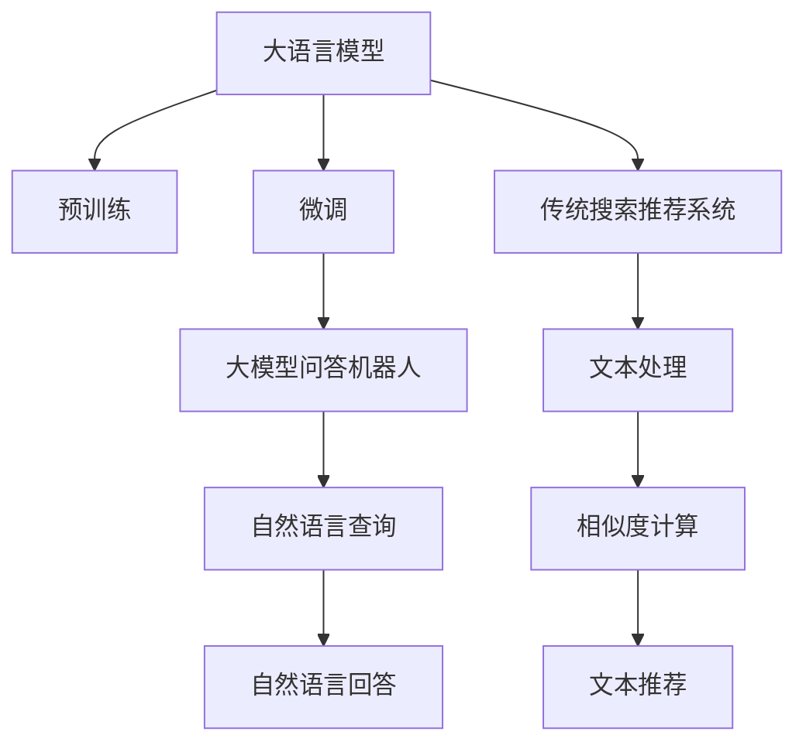
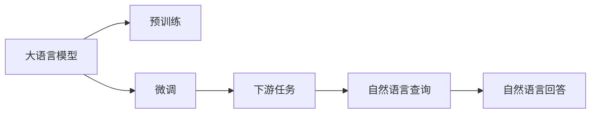
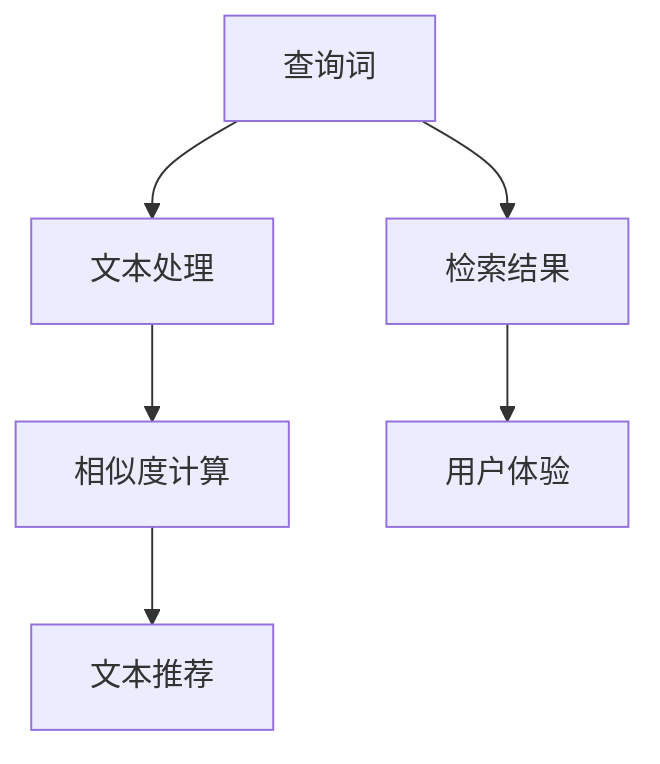
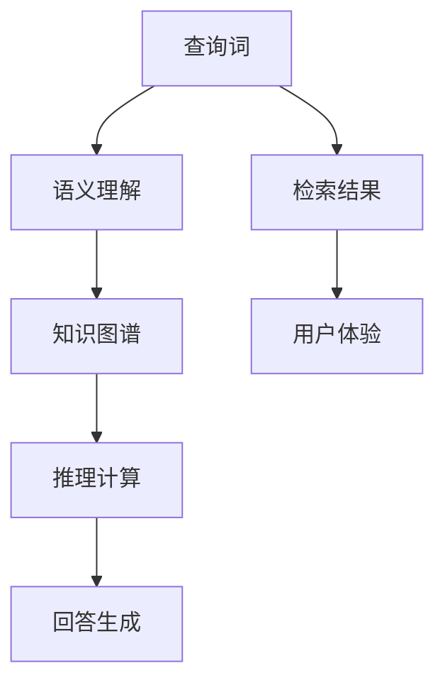

                 

# 大模型问答机器人与传统搜索推荐的处理方式

## 1. 背景介绍

### 1.1 问题由来
随着人工智能技术的迅速发展，大模型问答机器人和传统搜索推荐系统在用户信息检索和智能交互中扮演着越来越重要的角色。大模型问答机器人利用大语言模型（Large Language Models, LLMs）作为核心组件，通过理解自然语言查询并生成自然语言回答，为人类提供即时的知识获取服务。而传统搜索推荐系统则主要依赖于文本检索和相似度计算，通过匹配查询词与文本内容，将相关信息推荐给用户。

尽管两者目的相似，但在实现机制和应用场景上存在显著差异。大模型问答机器人通常需要在自然语言理解和生成方面具备高精度和流畅性，而传统搜索推荐系统则侧重于快速和高效的文本匹配和推荐。这种差异导致两者在技术实现、性能优化和应用效果上需要采取不同的策略。

### 1.2 问题核心关键点
为了在复杂的自然语言处理任务中取得优异效果，大模型问答机器人通常采用基于监督学习的微调方法，通过大量标注数据对大语言模型进行微调，使其能够准确理解并生成与查询相关的内容。而传统搜索推荐系统则更注重文本处理和相似度计算，通过关键词匹配、TF-IDF、语义检索等技术，实现高效的文本检索和推荐。

两者的核心关键点在于：
- 大模型问答机器人依赖于大语言模型和微调技术，需要在自然语言理解和生成上取得高精度。
- 传统搜索推荐系统侧重于文本检索和相似度计算，需要在快速、高效的文本匹配和推荐上取得优异效果。

### 1.3 问题研究意义
研究大模型问答机器人和传统搜索推荐的处理方式，对于提升用户信息检索和智能交互的效率、准确性和可理解性具有重要意义：

1. 提升信息检索的准确性：通过对比两种处理方式，可以找到更高效的文本匹配和推荐方法，减少用户搜索的迭代次数，提高检索结果的相关性和准确性。
2. 增强用户交互的自然性：大模型问答机器人能够理解和生成自然语言，为人工交互提供更直观和便捷的体验。
3. 优化推荐系统的个性化：传统搜索推荐系统可以结合大模型问答机器人的知识图谱和语义理解能力，提供更个性化、多样化的推荐内容。
4. 推动技术进步：通过对比和分析，可以总结出两者的优缺点，促进技术的进步和融合。
5. 促进应用落地：为不同应用场景选择合适的处理方式，加快人工智能技术的实际应用落地。

## 2. 核心概念与联系

### 2.1 核心概念概述

为更好地理解大模型问答机器人和传统搜索推荐的处理方式，本节将介绍几个密切相关的核心概念：

- 大语言模型(Large Language Model, LLM)：以自回归(如GPT)或自编码(如BERT)模型为代表的大规模预训练语言模型。通过在大规模无标签文本语料上进行预训练，学习通用的语言表示，具备强大的语言理解和生成能力。
- 微调(Fine-tuning)：指在预训练模型的基础上，使用下游任务的少量标注数据，通过有监督地训练来优化模型在特定任务上的性能。通常只需要调整顶层分类器或解码器，并以较小的学习率更新全部或部分的模型参数。
- 大模型问答机器人(QA Robots)：利用大语言模型作为核心组件，通过理解自然语言查询并生成自然语言回答，为人类提供即时的知识获取服务。
- 传统搜索推荐系统(Search & Recommendation Systems, SRS)：通过文本处理和相似度计算，实现高效的文本匹配和推荐。
- 知识图谱(Knowledge Graphs)：由节点和边组成的图结构，用于表示实体之间的关系，支持复杂的查询和推理。
- 语义检索(Semantic Search)：利用自然语言处理技术，将文本与查询进行语义匹配，实现更精确的检索和推荐。

这些核心概念之间的逻辑关系可以通过以下Mermaid流程图来展示：



这个流程图展示了大语言模型、微调、大模型问答机器人、传统搜索推荐系统以及知识图谱、语义检索等概念之间的联系。

### 2.2 概念间的关系

这些核心概念之间存在着紧密的联系，形成了两种处理方式的整体生态系统。下面我通过几个Mermaid流程图来展示这些概念之间的关系。

#### 2.2.1 大语言模型的学习范式



这个流程图展示了大语言模型的预训练和微调过程。大语言模型通过预训练获得基础能力，然后通过微调适应特定任务。

#### 2.2.2 传统搜索推荐系统的工作流程



这个流程图展示了传统搜索推荐系统的工作流程，即通过查询词进行文本处理和相似度计算，生成文本推荐，最终反馈给用户。

#### 2.2.3 知识图谱在大模型问答机器人中的应用



这个流程图展示了知识图谱在大模型问答机器人中的应用，即通过语义理解获取知识图谱中的信息，进行推理计算，生成自然语言回答。

## 3. 核心算法原理 & 具体操作步骤

### 3.1 算法原理概述

大模型问答机器人和传统搜索推荐系统的核心算法原理分别是基于监督学习的微调和基于文本处理的相似度计算。

**大模型问答机器人的微调算法原理：**

大模型问答机器人的核心是大语言模型，其微调算法原理如下：

1. **数据准备**：收集与目标问答任务相关的标注数据集，包括问题-答案对。标注数据通常需要经过标注员手动标注。

2. **模型初始化**：将预训练大语言模型作为初始模型。预训练模型已经在大规模无标签数据上进行了学习，具备丰富的语言知识和语义表示。

3. **任务适配层**：根据目标问答任务，添加合适的任务适配层。任务适配层通常包括输入编码器、输出解码器和损失函数。

4. **微调训练**：使用标注数据集对预训练模型进行微调。微调过程中，模型的参数会被更新以适应新的任务，优化损失函数以提升模型在目标任务上的表现。

5. **模型评估与部署**：微调完成后，对模型进行评估。如果评估结果满意，将模型部署到生产环境中，供用户使用。

**传统搜索推荐系统的相似度计算算法原理：**

传统搜索推荐系统的核心是基于文本处理的相似度计算，其算法原理如下：

1. **文本处理**：将查询词和文本内容进行分词、去除停用词、词向量化等预处理操作。

2. **相似度计算**：使用TF-IDF、BM25等算法，计算查询词与文本内容的相似度。相似度计算通常包括词袋模型、词向量模型、语义模型等。

3. **检索与排序**：根据相似度排序，选择最相关的文本作为检索结果。排序算法包括基于余弦相似度、排序网络等。

4. **推荐生成**：将检索结果返回给用户，并根据用户的行为反馈进行推荐更新。推荐算法包括基于协同过滤、基于内容的推荐等。

### 3.2 算法步骤详解

**大模型问答机器人的微调步骤：**

1. **数据准备**：收集并准备与目标问答任务相关的标注数据集，包括问题-答案对。数据集应涵盖多种问答类型，如事实性问答、知识图谱问答等。

2. **模型初始化**：选择合适的预训练大语言模型，如BERT、GPT等。将预训练模型作为初始化参数。

3. **任务适配层设计**：根据目标问答任务，设计合适的任务适配层。任务适配层通常包括输入编码器、输出解码器和损失函数。输入编码器负责将查询词和上下文语境转换为模型可处理的向量表示。输出解码器负责将向量表示转换为自然语言回答。损失函数用于衡量模型预测与真实答案之间的差异。

4. **微调训练**：使用标注数据集对预训练模型进行微调。微调过程中，模型的参数会被更新以适应新的任务。通常使用小学习率进行微调，以避免破坏预训练权重。微调过程中，需要注意正则化技术、对抗训练等，以避免过拟合。

5. **模型评估与部署**：微调完成后，对模型进行评估。如果评估结果满意，将模型部署到生产环境中，供用户使用。

**传统搜索推荐系统的相似度计算步骤：**

1. **文本处理**：将查询词和文本内容进行分词、去除停用词、词向量化等预处理操作。文本处理过程中，需要使用合适的分词工具，如jieba、NLTK等。

2. **相似度计算**：使用TF-IDF、BM25等算法，计算查询词与文本内容的相似度。相似度计算过程中，需要使用合适的向量表示方法，如词袋模型、TF-IDF、词向量模型等。

3. **检索与排序**：根据相似度排序，选择最相关的文本作为检索结果。排序算法包括基于余弦相似度、排序网络等。检索过程中，需要注意过滤掉不相关或低质量的结果。

4. **推荐生成**：将检索结果返回给用户，并根据用户的行为反馈进行推荐更新。推荐算法包括基于协同过滤、基于内容的推荐等。推荐过程中，需要注意实时性和个性化。

### 3.3 算法优缺点

**大模型问答机器人的优缺点：**

- **优点**：
  1. 理解自然语言查询的能力强，能够生成流畅自然的回答。
  2. 可以处理多种问答类型，如事实性问答、知识图谱问答等。
  3. 能够进行语义推理，提供更准确的答案。
  4. 基于监督学习，模型效果稳定可靠。

- **缺点**：
  1. 依赖标注数据，获取高质量标注数据成本高。
  2. 微调模型参数量较大，训练和推理资源消耗大。
  3. 模型解释性较差，难以解释其推理过程。
  4. 泛化能力有限，难以处理未见过的任务。

**传统搜索推荐系统的优缺点：**

- **优点**：
  1. 算法简单高效，可以快速匹配查询词与文本内容。
  2. 基于文本处理，对标注数据需求低，适用于数据量较小的应用。
  3. 推荐算法多样，可以根据不同需求选择。
  4. 实时性较好，能够快速响应用户查询。

- **缺点**：
  1. 理解自然语言的能力较弱，生成的文本质量较差。
  2. 处理复杂问答任务时，效果有限。
  3. 难以进行语义推理，无法处理未见过的查询词。
  4. 算法黑盒性强，难以解释其推理过程。

### 3.4 算法应用领域

**大模型问答机器人的应用领域：**

- 知识图谱问答系统：利用知识图谱和语义理解，回答关于事实性知识的问题。
- 医疗问答系统：通过理解自然语言查询，提供医疗咨询和建议。
- 客服机器人：回答用户的常见问题和疑难解答，提升客户服务体验。
- 教育问答系统：回答学生的学习问题，提供个性化的学习建议。

**传统搜索推荐系统的应用领域：**

- 电商平台推荐系统：根据用户浏览和购买行为，推荐相关商品。
- 新闻推荐系统：根据用户阅读行为，推荐相关新闻文章。
- 社交网络推荐系统：根据用户兴趣，推荐相关朋友和内容。
- 音乐推荐系统：根据用户听歌行为，推荐相关音乐。

## 4. 数学模型和公式 & 详细讲解 & 举例说明

### 4.1 数学模型构建

**大模型问答机器人的数学模型构建：**

大模型问答机器人的数学模型包括输入编码器、输出解码器和损失函数。

- **输入编码器**：将查询词和上下文语境转换为向量表示。假设查询词为$q$，上下文语境为$c$，输入编码器的数学模型为：

  $$
  h_q = \text{Enc}(q)
  $$
  
  $$
  h_c = \text{Enc}(c)
  $$
  
  其中，$\text{Enc}$为输入编码器，$h_q$和$h_c$为查询词和上下文语境的向量表示。

- **输出解码器**：将向量表示转换为自然语言回答。假设答案为$a$，输出解码器的数学模型为：

  $$
  h_a = \text{Dec}(h_q, h_c)
  $$
  
  其中，$\text{Dec}$为输出解码器，$h_a$为答案的向量表示。

- **损失函数**：衡量模型预测与真实答案之间的差异。假设真实答案为$y$，损失函数的数学模型为：

  $$
  \mathcal{L} = \text{Cross-Entropy}(h_a, y)
  $$
  
  其中，$\text{Cross-Entropy}$为交叉熵损失函数。

**传统搜索推荐系统的数学模型构建：**

传统搜索推荐系统的数学模型包括文本处理、相似度计算和排序算法。

- **文本处理**：将查询词和文本内容进行分词、去除停用词、词向量化等预处理操作。假设查询词为$q$，文本内容为$d$，文本处理的数学模型为：

  $$
  q_t = \text{Tokenize}(q)
  $$
  
  $$
  d_t = \text{Tokenize}(d)
  $$
  
  $$
  q_w = \text{Vectorize}(q_t)
  $$
  
  $$
  d_w = \text{Vectorize}(d_t)
  $$
  
  其中，$q_t$和$d_t$为查询词和文本内容的词序列，$q_w$和$d_w$为查询词和文本内容的词向量表示。

- **相似度计算**：使用TF-IDF、BM25等算法，计算查询词与文本内容的相似度。假设相似度为$s$，相似度计算的数学模型为：

  $$
  s = \text{Similarity}(q_w, d_w)
  $$
  
  其中，$\text{Similarity}$为相似度计算函数，如TF-IDF、BM25等。

- **排序算法**：根据相似度排序，选择最相关的文本作为检索结果。假设排序结果为$r$，排序算法的数学模型为：

  $$
  r = \text{Sort}(s)
  $$
  
  其中，$\text{Sort}$为排序算法。

### 4.2 公式推导过程

**大模型问答机器人的公式推导过程：**

假设查询词为$q$，上下文语境为$c$，答案为$a$，大模型问答机器人的数学模型为：

- **输入编码器**：

  $$
  h_q = \text{Enc}(q)
  $$
  
  $$
  h_c = \text{Enc}(c)
  $$

- **输出解码器**：

  $$
  h_a = \text{Dec}(h_q, h_c)
  $$

- **损失函数**：

  $$
  \mathcal{L} = \text{Cross-Entropy}(h_a, y)
  $$

**传统搜索推荐系统的公式推导过程：**

假设查询词为$q$，文本内容为$d$，文本处理后的词向量为$q_w$和$d_w$，相似度为$s$，排序结果为$r$，传统搜索推荐系统的数学模型为：

- **文本处理**：

  $$
  q_t = \text{Tokenize}(q)
  $$
  
  $$
  d_t = \text{Tokenize}(d)
  $$
  
  $$
  q_w = \text{Vectorize}(q_t)
  $$
  
  $$
  d_w = \text{Vectorize}(d_t)
  $$

- **相似度计算**：

  $$
  s = \text{Similarity}(q_w, d_w)
  $$

- **排序算法**：

  $$
  r = \text{Sort}(s)
  $$

### 4.3 案例分析与讲解

**案例1：事实性问答系统**

事实性问答系统是知识图谱问答系统的一种，用于回答关于事实性知识的问题。假设查询词为“谁是美国第一任总统”，上下文语境为“美国总统”，答案为“乔治·华盛顿”，我们可以使用大模型问答机器人的数学模型进行推理计算。

1. **输入编码器**：将查询词和上下文语境转换为向量表示。

  $$
  h_q = \text{Enc}("谁是美国第一任总统")
  $$
  
  $$
  h_c = \text{Enc}("美国总统")
  $$

2. **输出解码器**：将向量表示转换为自然语言回答。

  $$
  h_a = \text{Dec}(h_q, h_c)
  $$

3. **损失函数**：衡量模型预测与真实答案之间的差异。

  $$
  \mathcal{L} = \text{Cross-Entropy}(h_a, "乔治·华盛顿")
  $$

**案例2：电商平台推荐系统**

电商平台推荐系统用于根据用户浏览和购买行为，推荐相关商品。假设用户浏览的商品序列为["手机", "电脑", "鞋子"]，电商平台推荐系统可以使用传统搜索推荐系统的相似度计算和排序算法。

1. **文本处理**：将用户浏览的商品序列和商品内容进行分词、去除停用词、词向量化等预处理操作。

  $$
  q_t = \text{Tokenize}(["手机", "电脑", "鞋子"])
  $$
  
  $$
  d_t = \text{Tokenize}([商品1, 商品2, 商品3])
  $$
  
  $$
  q_w = \text{Vectorize}(q_t)
  $$
  
  $$
  d_w = \text{Vectorize}(d_t)
  $$

2. **相似度计算**：使用TF-IDF、BM25等算法，计算用户浏览的商品序列与商品内容的相似度。

  $$
  s = \text{Similarity}(q_w, d_w)
  $$

3. **排序算法**：根据相似度排序，选择最相关的商品作为推荐结果。

  $$
  r = \text{Sort}(s)
  $$

## 5. 项目实践：代码实例和详细解释说明

### 5.1 开发环境搭建

在进行项目实践前，我们需要准备好开发环境。以下是使用Python进行PyTorch开发的环境配置流程：

1. 安装Anaconda：从官网下载并安装Anaconda，用于创建独立的Python环境。

2. 创建并激活虚拟环境：
```bash
conda create -n pytorch-env python=3.8 
conda activate pytorch-env
```

3. 安装PyTorch：根据CUDA版本，从官网获取对应的安装命令。例如：
```bash
conda install pytorch torchvision torchaudio cudatoolkit=11.1 -c pytorch -c conda-forge
```

4. 安装Transformers库：
```bash
pip install transformers
```

5. 安装各类工具包：
```bash
pip install numpy pandas scikit-learn matplotlib tqdm jupyter notebook ipython
```

完成上述步骤后，即可在`pytorch-env`环境中开始项目实践。

### 5.2 源代码详细实现

这里我们以事实性问答系统为例，给出使用Transformers库对BERT模型进行微调的PyTorch代码实现。

首先，定义事实性问答任务的标注数据：

```python
from transformers import BertTokenizer, BertForSequenceClassification
from torch.utils.data import Dataset
import torch

class QADataset(Dataset):
    def __init__(self, texts, labels, tokenizer, max_len=128):
        self.texts = texts
        self.labels = labels
        self.tokenizer = tokenizer
        self.max_len = max_len
        
    def __len__(self):
        return len(self.texts)
    
    def __getitem__(self, item):
        text = self.texts[item]
        label = self.labels[item]
        
        encoding = self.tokenizer(text, return_tensors='pt', max_length=self.max_len, padding='max_length', truncation=True)
        input_ids = encoding['input_ids'][0]
        attention_mask = encoding['attention_mask'][0]
        
        # 对标签进行编码
        encoded_label = label2id[label]  # 假设已经定义了标签与id的映射
        labels = torch.tensor(encoded_label, dtype=torch.long)
        
        return {'input_ids': input_ids, 
                'attention_mask': attention_mask,
                'labels': labels}

# 标签与id的映射
label2id = {'乔治·华盛顿': 0, '托马斯·杰斐逊': 1, '詹姆斯·麦迪逊': 2}
id2label = {v: k for k, v in label2id.items()}

# 创建dataset
tokenizer = BertTokenizer.from_pretrained('bert-base-cased')

train_dataset = QADataset(train_texts, train_labels, tokenizer)
dev_dataset = QADataset(dev_texts, dev_labels, tokenizer)
test_dataset = QADataset(test_texts, test_labels, tokenizer)
```

然后，定义模型和优化器：

```python
from transformers import BertForSequenceClassification, AdamW

model = BertForSequenceClassification.from_pretrained('bert-base-cased', num_labels=len(label2id))

optimizer = AdamW(model.parameters(), lr=2e-5)
```

接着，定义训练和评估函数：

```python
from torch.utils.data import DataLoader
from tqdm import tqdm
from sklearn.metrics import classification_report

device = torch.device('cuda') if torch.cuda.is_available() else torch.device('cpu')
model.to(device)

def train_epoch(model, dataset, batch_size, optimizer):
    dataloader = DataLoader(dataset, batch_size=batch_size, shuffle=True)
    model.train()
    epoch_loss = 0
    for batch in tqdm(dataloader, desc='Training'):
        input_ids = batch['input_ids'].to(device)
        attention_mask = batch['attention_mask'].to(device)
        labels = batch['labels'].to(device)
        model.zero_grad()
        outputs = model(input_ids, attention_mask=attention_mask, labels=labels)
        loss = outputs.loss
        epoch_loss += loss.item()
        loss.backward()
        optimizer.step()
    return epoch_loss / len(dataloader)

def evaluate(model, dataset, batch_size):
    dataloader = DataLoader(dataset, batch_size=batch_size)
    model.eval()
    preds, labels = [], []
    with torch.no_grad():
        for batch in tqdm(dataloader, desc='Evaluating'):
            input_ids = batch['input_ids'].to(device)
            attention_mask = batch['attention_mask'].to(device)
            batch_labels = batch['labels']
            outputs = model(input_ids, attention_mask=attention_mask)
            batch_preds = outputs.logits.argmax(dim=2).to('cpu').tolist()
            batch_labels = batch_labels.to('cpu').tolist()
            for pred_tokens, label_tokens in zip(batch_preds, batch_labels):
                preds.append(pred_tokens[:len(label_tokens)])
                labels.append(label_tokens)
                
    print(classification_report(labels, preds))
```

最后，启动训练流程并在测试集上评估：

```python
epochs = 5
batch_size = 16

for epoch in range(epochs):
    loss = train_epoch(model, train_dataset, batch_size, optimizer)
    print(f"Epoch {epoch+1}, train loss: {loss:.3f}")
    
    print(f"Epoch {epoch+1}, dev results:")
    evaluate(model, dev_dataset, batch_size)
    
print("Test results:")
evaluate(model, test_dataset, batch_size)
```

以上就是使用PyTorch对BERT进行事实性问答系统微调的完整代码实现。可以看到，得益于Transformers库的强大封装，我们可以用相对简洁的代码完成BERT模型的加载和微调。

### 5.3 代码解读与分析

让我们再详细解读一下关键代码的实现细节：

**QADataset类**：
- `__init__`方法：初始化文本、标签、分词器等关键组件。
- `__len__`方法：返回数据集的样本数量。
- `__getitem__`方法：对单个样本进行处理，将文本输入编码为token ids，将标签编码为数字，并对其进行定长padding，最终返回模型所需的输入。

**label2id和id2label字典**：
- 定义了标签与数字id之间的映射关系，用于将标签解码为数字。

**训练和评估函数**：
- 使用PyTorch的DataLoader对数据集进行批次化加载，供模型训练和推理使用。
- 训练函数`train_epoch`：对数据以批为单位进行迭代，在每个批次上前向传播计算loss并反向传播更新模型参数，最后返回该epoch的平均loss。
- 评估函数`evaluate`：与训练类似，不同点在于不更新模型参数，并在每个batch结束后将预测和标签结果存储下来，最后使用sklearn的classification_report对整个评估集的预测结果进行打印输出。

**训练流程**：
- 定义总的epoch数和batch size，开始循环迭代
- 每个epoch

