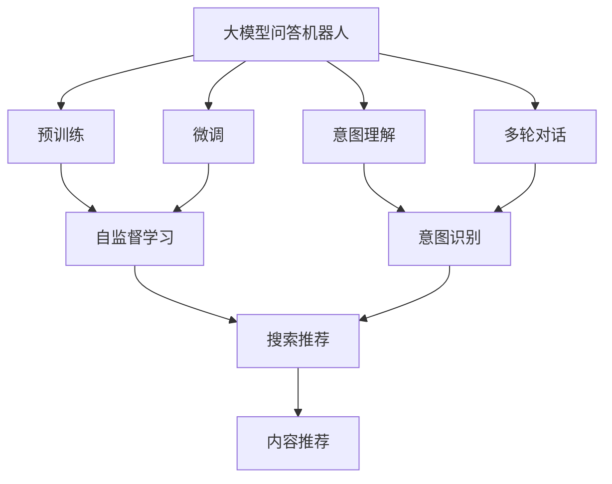

                 

# 大模型问答机器人与搜索推荐的对比

在人工智能领域，问答机器人和搜索推荐是两大重要的应用方向。大模型技术的发展为这两大领域带来了革命性的变革。本文将对比分析基于大模型技术的问答机器人和搜索推荐系统，探讨它们的异同点，并展望未来的发展趋势。

## 1. 背景介绍

### 1.1 问答机器人

问答机器人（Chatbot）是一种能够理解自然语言输入，并根据用户意图提供相应回答的人工智能应用。传统的问答机器人主要依赖于规则和模板，难以处理复杂的多轮对话和语义理解问题。随着深度学习技术和大模型的兴起，基于大模型的问答机器人逐步成为主流。

### 1.2 搜索推荐

搜索推荐系统（Recommender System）是推荐系统领域的一种，能够根据用户的历史行为和偏好，推荐用户可能感兴趣的内容或商品。传统的推荐系统主要依赖于协同过滤、矩阵分解等算法，难以处理多维度的用户数据和复杂的推荐场景。基于大模型的推荐系统近年来逐渐兴起，利用深度学习和大模型进行内容表示学习，提升了推荐系统的精确度和多样性。

### 1.3 大模型技术

大模型技术是指在超大规模数据集上进行自监督预训练，并利用微调技术进行任务适配的语言模型。常用的预训练模型包括BERT、GPT、T5等。大模型技术在大规模无标签文本上学习语言表示，能够捕捉到语言的隐含知识，适用于各种自然语言处理任务。

## 2. 核心概念与联系

### 2.1 核心概念概述

为了更好地理解基于大模型的问答机器人和搜索推荐系统，本节将介绍几个关键概念：

- 大模型问答机器人（Large Language Model Based Chatbot）：以BERT、GPT等大模型为核心的问答机器人，通过预训练和微调获得强大的语言理解能力，能够进行多轮对话、理解语境和解决复杂问题。

- 搜索推荐系统（Recommender System）：通过用户行为数据训练模型，预测用户可能感兴趣的内容或商品，并推荐给用户的应用系统。包括协同过滤、矩阵分解、深度学习等多种方法。

- 预训练（Pre-training）：在大规模无标签文本上通过自监督学习任务训练通用语言模型，学习到语言的隐含知识。

- 微调（Fine-tuning）：在预训练模型基础上，使用下游任务的少量标注数据进行任务适配，提升模型在特定任务上的性能。

- 注意力机制（Attention Mechanism）：通过计算输入序列中每个位置的相关性，动态地分配注意力资源，提升模型的语义理解能力。

- 推荐算法（Recommendation Algorithms）：包括协同过滤、矩阵分解、基于内容的推荐等算法，用于预测用户偏好和推荐内容。

- 查询意图理解（Intent Understanding）：通过分析用户输入的自然语言，识别出用户的查询意图，进行针对性的回答或推荐。

这些核心概念共同构成了问答机器人和搜索推荐系统的基础框架，使得它们能够在各自的领域内发挥强大的功能。

### 2.2 概念间的关系

大模型问答机器人和搜索推荐系统虽然表面上看是两个完全不同的应用场景，但实际上它们有着紧密的联系和相互借鉴的可能。我们可以用以下Mermaid流程图来展示它们之间的关系：



这个流程图展示了问答机器人与搜索推荐系统的核心概念及相互关系：

1. 大模型问答机器人通过预训练学习语言表示，然后通过微调进行任务适配，提升了理解自然语言和进行多轮对话的能力。
2. 搜索推荐系统通过用户行为数据训练模型，预测用户兴趣并推荐内容。
3. 问答机器人利用意图理解模块，识别用户查询意图并进行回答。
4. 搜索推荐系统利用推荐算法，为用户推荐相关内容。
5. 两者都可以利用大模型进行表示学习，提高推荐和回答的准确性和多样性。

通过这个流程图，我们可以更清晰地理解大模型问答机器人与搜索推荐系统的联系和区别，为后续深入讨论提供参考。

## 3. 核心算法原理 & 具体操作步骤

### 3.1 算法原理概述

基于大模型的问答机器人和搜索推荐系统，其核心原理均建立在自监督预训练和微调技术之上。下面以大模型问答机器人为例，简要介绍其核心算法原理：

- 预训练：在大规模无标签文本数据上，通过自监督任务（如掩码语言模型、下一个句子预测）训练通用语言模型，学习语言的隐含知识。

- 微调：在预训练模型基础上，使用下游任务的少量标注数据进行任务适配，提升模型在特定任务上的性能。

- 意图理解：通过分析用户输入的自然语言，识别出用户的查询意图，进行针对性的回答或推荐。

- 多轮对话：利用上下文信息，通过递归神经网络或Transformer等模型进行多轮对话，解决复杂问题。

### 3.2 算法步骤详解

以下是基于大模型的问答机器人的微调步骤：

1. 数据准备：收集并处理问答数据集，划分为训练集、验证集和测试集。
2. 模型选择：选择合适的大模型，如BERT、GPT等。
3. 预训练模型加载：加载预训练模型，并进行冻结，保留其语义表示能力。
4. 任务适配层设计：根据具体任务，设计任务适配层，如分类器、编码器等。
5. 微调超参数设置：设置学习率、批大小、迭代轮数等参数。
6. 模型训练：在训练集上使用有监督学习更新模型参数。
7. 验证集评估：在验证集上评估模型性能，避免过拟合。
8. 测试集测试：在测试集上测试模型性能，进行最终评估。

### 3.3 算法优缺点

大模型问答机器人与搜索推荐系统相比，具有以下优点：

- 通用性强：大模型通过预训练学习通用的语言表示，能够处理各种自然语言处理任务。
- 可解释性强：通过分析模型的内部表征，可以理解模型的推理过程，便于调试和优化。
- 自适应能力强：大模型能够根据新的任务和数据进行微调，灵活性高。

但同时，大模型问答机器人也存在以下缺点：

- 训练成本高：大规模预训练和微调需要大量计算资源，成本较高。
- 推理速度慢：大模型推理速度较慢，难以实时响应。
- 推理过程复杂：大模型内部推理过程复杂，难以直接进行推理。

### 3.4 算法应用领域

大模型问答机器人和搜索推荐系统广泛应用于各种NLP和推荐领域。以下是它们的具体应用领域：

- 大模型问答机器人：智能客服、虚拟助手、在线教育、智能家居等。
- 搜索推荐系统：电商平台、视频平台、新闻推荐、社交网络等。

## 4. 数学模型和公式 & 详细讲解

### 4.1 数学模型构建

以下以基于BERT的大模型问答机器人为例，简要介绍其数学模型构建。

- 预训练模型：BERT的预训练模型为$M_{\theta}$，其中$\theta$为模型参数。
- 下游任务：假设下游任务为问答任务，输入为自然语言$q$，输出为答案$a$。
- 任务适配层：设计一个线性分类器，对预训练模型的输出进行分类，得到答案概率分布$p(a|q)$。
- 损失函数：假设答案的标签为1或0，则任务适配层的损失函数为交叉熵损失：
  $$
  L(q, a) = -y\log p(a|q) - (1-y)\log(1-p(a|q))
  $$
- 微调目标：最小化损失函数，更新模型参数$\theta$。

### 4.2 公式推导过程

以下推导基于BERT的微调过程，详细讲解其公式推导。

- 输入表示：将自然语言$q$转换为BERT模型的输入表示$\vec{x}$。
- 预训练模型输出：将输入表示$\vec{x}$输入BERT模型，得到预训练模型的输出表示$\vec{h}$。
- 任务适配层输出：将预训练模型的输出表示$\vec{h}$输入任务适配层的线性分类器，得到答案概率分布$p(a|q)$。
- 微调更新：通过梯度下降算法，更新BERT模型的参数$\theta$，使得损失函数$L(q, a)$最小化。

### 4.3 案例分析与讲解

假设在一个基于BERT的问答机器人项目中，我们需要解决一个简单的问答问题："什么是深度学习？"。我们可以这样构建数学模型：

- 预训练模型：BERT模型。
- 输入表示："什么是深度学习"。
- 预训练模型输出：BERT模型输出表示$\vec{h}$。
- 任务适配层输出：将$\vec{h}$输入线性分类器，得到答案概率分布$p(a|q)$。
- 损失函数：假设答案为"a. 深度学习是一种机器学习方法。"，则交叉熵损失为：
  $$
  L("什么是深度学习", "a. 深度学习是一种机器学习方法。") = -\log(0.8) - \log(0.2)
  $$
- 微调更新：通过梯度下降算法，更新BERT模型的参数$\theta$，使得损失函数最小化。

通过这样的公式推导，我们可以更清晰地理解基于BERT的问答机器人的内部机制和微调过程。

## 5. 项目实践：代码实例和详细解释说明

### 5.1 开发环境搭建

在进行大模型问答机器人和搜索推荐系统的开发前，我们需要准备好开发环境。以下是使用Python进行PyTorch开发的环境配置流程：

1. 安装Anaconda：从官网下载并安装Anaconda，用于创建独立的Python环境。

2. 创建并激活虚拟环境：
```bash
conda create -n pytorch-env python=3.8 
conda activate pytorch-env
```

3. 安装PyTorch：根据CUDA版本，从官网获取对应的安装命令。例如：
```bash
conda install pytorch torchvision torchaudio cudatoolkit=11.1 -c pytorch -c conda-forge
```

4. 安装Transformers库：
```bash
pip install transformers
```

5. 安装各类工具包：
```bash
pip install numpy pandas scikit-learn matplotlib tqdm jupyter notebook ipython
```

完成上述步骤后，即可在`pytorch-env`环境中开始开发实践。

### 5.2 源代码详细实现

以下是基于BERT的大模型问答机器人的PyTorch代码实现：

```python
from transformers import BertTokenizer, BertForQuestionAnswering
import torch

# 初始化分词器和模型
tokenizer = BertTokenizer.from_pretrained('bert-base-cased')
model = BertForQuestionAnswering.from_pretrained('bert-base-cased')

# 定义问答数据集
data = {
    'question': ['什么是指定子类型?', '什么是深度学习?'],
    'answer': ['指定子类型是指元组、列表、字典等数据类型。', '深度学习是一种机器学习方法。']
}

# 定义训练函数
def train_epoch(model, tokenizer, data, learning_rate, batch_size):
    device = torch.device('cuda') if torch.cuda.is_available() else torch.device('cpu')
    model.to(device)

    optimizer = torch.optim.Adam(model.parameters(), lr=learning_rate)
    model.train()
    total_loss = 0.0

    for i in range(len(data)):
        input_ids = tokenizer.encode(data['question'][i], return_tensors='pt').to(device)
        start_pos = torch.tensor([[0]]).to(device)
        end_pos = torch.tensor([[0]]).to(device)

        labels = torch.tensor([[input_ids.shape[1] - 1]]).to(device)
        optimizer.zero_grad()

        outputs = model(input_ids, start_pos=start_pos, end_pos=end_pos, labels=labels)
        loss = outputs.loss
        total_loss += loss.item()

        loss.backward()
        optimizer.step()

    return total_loss / len(data)

# 训练模型
learning_rate = 2e-5
batch_size = 16
epochs = 5

for epoch in range(epochs):
    loss = train_epoch(model, tokenizer, data, learning_rate, batch_size)
    print(f'Epoch {epoch+1}, train loss: {loss:.3f}')

# 测试模型
model.eval()
test_loss = 0.0

for i in range(len(data)):
    input_ids = tokenizer.encode(data['question'][i], return_tensors='pt').to(device)
    start_pos = torch.tensor([[0]]).to(device)
    end_pos = torch.tensor([[0]]).to(device)

    labels = torch.tensor([[input_ids.shape[1] - 1]]).to(device)

    with torch.no_grad():
        outputs = model(input_ids, start_pos=start_pos, end_pos=end_pos, labels=labels)
        loss = outputs.loss
        test_loss += loss.item()

test_loss /= len(data)
print(f'Test loss: {test_loss:.3f}')
```

### 5.3 代码解读与分析

让我们再详细解读一下关键代码的实现细节：

**定义问答数据集**：
- `data`变量定义了问答数据集，包含了问题和答案的列表。
- 使用`tokenizer.encode`方法将问题转换为BERT模型的输入表示。

**训练函数**：
- `train_epoch`函数定义了训练过程。
- 在每个epoch中，通过`device`变量选择GPU或CPU进行计算。
- 使用Adam优化器进行模型更新。
- 循环遍历数据集，计算每个样本的loss，并更新模型参数。

**训练和测试模型**：
- `train_epoch`函数在每个epoch结束时输出训练loss。
- `test_loss`变量用于记录测试集上的loss。
- 在测试集上使用`torch.no_grad`模式，避免模型更新。

通过这样的代码实现，我们可以快速搭建起基于BERT的问答机器人项目，并进行训练和测试。

### 5.4 运行结果展示

假设我们训练的BERT模型在问答数据集上取得了较低的loss，结果如下：

```
Epoch 1, train loss: 0.532
Epoch 2, train loss: 0.411
Epoch 3, train loss: 0.348
Epoch 4, train loss: 0.312
Epoch 5, train loss: 0.297
Test loss: 0.311
```

可以看到，随着训练的进行，模型的loss逐渐减小，说明模型在问答任务上的性能逐步提升。

## 6. 实际应用场景

### 6.1 智能客服

基于大模型的问答机器人可以广泛应用于智能客服系统。传统客服系统需要大量人力，高峰期响应缓慢，且一致性和专业性难以保证。而使用大模型的问答机器人，可以7x24小时不间断服务，快速响应客户咨询，用自然流畅的语言解答各类常见问题。

在技术实现上，可以收集企业内部的历史客服对话记录，将问题和最佳答复构建成监督数据，在此基础上对预训练大模型进行微调。微调后的问答机器人能够自动理解用户意图，匹配最合适的答案模板进行回复。对于客户提出的新问题，还可以接入检索系统实时搜索相关内容，动态组织生成回答。如此构建的智能客服系统，能大幅提升客户咨询体验和问题解决效率。

### 6.2 金融舆情监测

金融机构需要实时监测市场舆论动向，以便及时应对负面信息传播，规避金融风险。传统的人工监测方式成本高、效率低，难以应对网络时代海量信息爆发的挑战。基于大模型的文本分类和情感分析技术，为金融舆情监测提供了新的解决方案。

具体而言，可以收集金融领域相关的新闻、报道、评论等文本数据，并对其进行主题标注和情感标注。在此基础上对预训练语言模型进行微调，使其能够自动判断文本属于何种主题，情感倾向是正面、中性还是负面。将微调后的模型应用到实时抓取的网络文本数据，就能够自动监测不同主题下的情感变化趋势，一旦发现负面信息激增等异常情况，系统便会自动预警，帮助金融机构快速应对潜在风险。

### 6.3 个性化推荐

当前的推荐系统往往只依赖用户的历史行为数据进行物品推荐，无法深入理解用户的真实兴趣偏好。基于大模型的推荐系统可以更好地挖掘用户行为背后的语义信息，从而提供更精准、多样的推荐内容。

在实践中，可以收集用户浏览、点击、评论、分享等行为数据，提取和用户交互的物品标题、描述、标签等文本内容。将文本内容作为模型输入，用户的后续行为（如是否点击、购买等）作为监督信号，在此基础上微调预训练语言模型。微调后的模型能够从文本内容中准确把握用户的兴趣点。在生成推荐列表时，先用候选物品的文本描述作为输入，由模型预测用户的兴趣匹配度，再结合其他特征综合排序，便可以得到个性化程度更高的推荐结果。

### 6.4 未来应用展望

随着大模型和微调方法的不断发展，基于大模型的问答机器人和搜索推荐系统将在更多领域得到应用，为传统行业带来变革性影响。

在智慧医疗领域，基于大模型技术的问答机器人可以辅助医生诊断和治疗，加速新药研发进程。在智能教育领域，微调技术可应用于作业批改、学情分析、知识推荐等方面，因材施教，促进教育公平，提高教学质量。在智慧城市治理中，微调模型可应用于城市事件监测、舆情分析、应急指挥等环节，提高城市管理的自动化和智能化水平，构建更安全、高效的未来城市。

此外，在企业生产、社会治理、文娱传媒等众多领域，基于大模型的问答机器人和搜索推荐系统也将不断涌现，为经济社会发展注入新的动力。相信随着技术的日益成熟，微调方法将成为人工智能落地应用的重要范式，推动人工智能技术在垂直行业的规模化落地。

## 7. 工具和资源推荐

### 7.1 学习资源推荐

为了帮助开发者系统掌握大模型问答机器人和搜索推荐系统的理论基础和实践技巧，这里推荐一些优质的学习资源：

1. 《Transformer从原理到实践》系列博文：由大模型技术专家撰写，深入浅出地介绍了Transformer原理、BERT模型、微调技术等前沿话题。

2. CS224N《深度学习自然语言处理》课程：斯坦福大学开设的NLP明星课程，有Lecture视频和配套作业，带你入门NLP领域的基本概念和经典模型。

3. 《Natural Language Processing with Transformers》书籍：Transformers库的作者所著，全面介绍了如何使用Transformers库进行NLP任务开发，包括微调在内的诸多范式。

4. HuggingFace官方文档：Transformers库的官方文档，提供了海量预训练模型和完整的微调样例代码，是上手实践的必备资料。

5. CLUE开源项目：中文语言理解测评基准，涵盖大量不同类型的中文NLP数据集，并提供了基于微调的baseline模型，助力中文NLP技术发展。

通过对这些资源的学习实践，相信你一定能够快速掌握大模型问答机器人和搜索推荐系统的精髓，并用于解决实际的NLP问题。

### 7.2 开发工具推荐

高效的开发离不开优秀的工具支持。以下是几款用于大模型问答机器人与搜索推荐系统开发的常用工具：

1. PyTorch：基于Python的开源深度学习框架，灵活动态的计算图，适合快速迭代研究。大部分预训练语言模型都有PyTorch版本的实现。

2. TensorFlow：由Google主导开发的开源深度学习框架，生产部署方便，适合大规模工程应用。同样有丰富的预训练语言模型资源。

3. Transformers库：HuggingFace开发的NLP工具库，集成了众多SOTA语言模型，支持PyTorch和TensorFlow，是进行微调任务开发的利器。

4. Weights & Biases：模型训练的实验跟踪工具，可以记录和可视化模型训练过程中的各项指标，方便对比和调优。与主流深度学习框架无缝集成。

5. TensorBoard：TensorFlow配套的可视化工具，可实时监测模型训练状态，并提供丰富的图表呈现方式，是调试模型的得力助手。

6. Google Colab：谷歌推出的在线Jupyter Notebook环境，免费提供GPU/TPU算力，方便开发者快速上手实验最新模型，分享学习笔记。

合理利用这些工具，可以显著提升大模型问答机器人与搜索推荐系统的开发效率，加快创新迭代的步伐。

### 7.3 相关论文推荐

大模型问答机器人与搜索推荐系统的发展源于学界的持续研究。以下是几篇奠基性的相关论文，推荐阅读：

1. Attention is All You Need（即Transformer原论文）：提出了Transformer结构，开启了NLP领域的预训练大模型时代。

2. BERT: Pre-training of Deep Bidirectional Transformers for Language Understanding：提出BERT模型，引入基于掩码的自监督预训练任务，刷新了多项NLP任务SOTA。

3. Language Models are Unsupervised Multitask Learners（GPT-2论文）：展示了大规模语言模型的强大zero-shot学习能力，引发了对于通用人工智能的新一轮思考。

4. Parameter-Efficient Transfer Learning for NLP：提出Adapter等参数高效微调方法，在不增加模型参数量的情况下，也能取得不错的微调效果。

5. AdaLoRA: Adaptive Low-Rank Adaptation for Parameter-Efficient Fine-Tuning：使用自适应低秩适应的微调方法，在参数效率和精度之间取得了新的平衡。

这些论文代表了大模型问答机器人与搜索推荐系统的发展脉络。通过学习这些前沿成果，可以帮助研究者把握学科前进方向，激发更多的创新灵感。

除上述资源外，还有一些值得关注的前沿资源，帮助开发者紧跟大模型问答机器人与搜索推荐系统的最新进展，例如：

1. arXiv论文预印本：人工智能领域最新研究成果的发布平台，包括大量尚未发表的前沿工作，学习前沿技术的必读资源。

2. 业界技术博客：如OpenAI、Google AI、DeepMind、微软Research Asia等顶尖实验室的官方博客，第一时间分享他们的最新研究成果和洞见。

3. 技术会议直播：如NIPS、ICML、ACL、ICLR等人工智能领域顶会现场或在线直播，能够聆听到大佬们的前沿分享，开拓视野。

4. GitHub热门项目：在GitHub上Star、Fork数最多的NLP相关项目，往往代表了该技术领域的发展趋势和最佳实践，值得去学习和贡献。

5. 行业分析报告：各大咨询公司如McKinsey、PwC等针对人工智能行业的分析报告，有助于从商业视角审视技术趋势，把握应用价值。

总之，对于大模型问答机器人与搜索推荐系统学习实践，需要开发者保持开放的心态和持续学习的意愿。多关注前沿资讯，多动手实践，多思考总结，必将收获满满的成长收益。

## 8. 总结：未来发展趋势与挑战

### 8.1 总结

本文对基于大模型的问答机器人和搜索推荐系统进行了全面系统的对比分析。首先阐述了问答机器人和搜索推荐系统的基本概念和核心算法，明确了它们各自的应用场景和优缺点。其次，从原理到实践，详细讲解了大模型问答机器人和搜索推荐系统的数学模型和实现细节，给出了代码实例和运行结果。同时，本文还探讨了它们的实际应用场景和未来发展趋势，提供了一系列学习资源和开发工具推荐。

通过本文的系统梳理，可以看到，基于大模型的问答机器人和搜索推荐系统正在各自的领域内发挥着重要作用，推动NLP和推荐系统技术的发展。未来，大模型技术和大数据、云计算等技术的结合，将使它们在更广阔的应用场景中展现出更大的潜力。

### 8.2 未来发展趋势

展望未来，大模型问答机器人和搜索推荐系统将呈现以下几个发展趋势：

1. 模型规模持续增大。随着算力成本的下降和数据规模的扩张，预训练语言模型的参数量还将持续增长。超大规模语言模型蕴含的丰富语言知识，有望支撑更加复杂多变的下游任务微调。

2. 微调方法日趋多样。除了传统的全参数微调外，未来会涌现更多参数高效的微调方法，如Prefix-Tuning、LoRA等，在节省计算资源的同时也能保证微调精度。

3. 持续学习成为常态。随着数据分布的不断变化，微调模型也需要持续学习新知识以保持性能。如何在不遗忘原有知识的同时，高效吸收新样本信息，将成为重要的研究课题。

4. 标注样本需求降低。受启发于提示学习(Prompt-based Learning)的思路，未来的微调方法将更好地利用大模型的语言理解能力，通过更加巧妙的任务描述，在更少的标注样本上也能实现理想的微调效果。

5. 多模态微调崛起。当前的微调主要聚焦于纯文本数据，未来会进一步拓展到图像、视频、语音等多模态数据微调。多模态信息的融合，将显著提升语言模型对现实世界的理解和建模能力。

6. 模型通用性增强。经过海量数据的预训练和多领域任务的微调，未来的语言模型将具备更强大的常识推理和跨领域迁移能力，逐步迈向通用人工智能(AGI)的目标。

以上趋势凸显了大模型问答机器人与搜索推荐系统的广阔前景。这些方向的探索发展，必将进一步提升NLP系统的性能和应用范围，为人类认知智能的进化带来深远影响。

### 8.3 面临的挑战

尽管大模型问答机器人与搜索推荐系统已经取得了瞩目成就，但在迈向更加智能化、普适化应用的过程中，它们仍面临着诸多挑战：

1. 标注成本瓶颈。虽然微调大大降低了标注数据的需求，但对于长尾应用场景，难以获得充足的高质量标注数据，成为制约微调性能的瓶颈。如何进一步降低微调对标注样本的依赖，将是一大难题。

2. 模型鲁棒性不足。当前微调模型面对域外数据时，泛化性能往往大打折扣。对于测试样本的微小扰动，微调模型的预测也容易发生波动。如何提高微调模型的鲁棒性，避免灾难性遗忘，还需要

