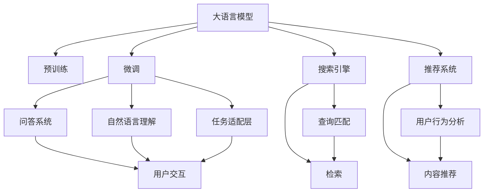
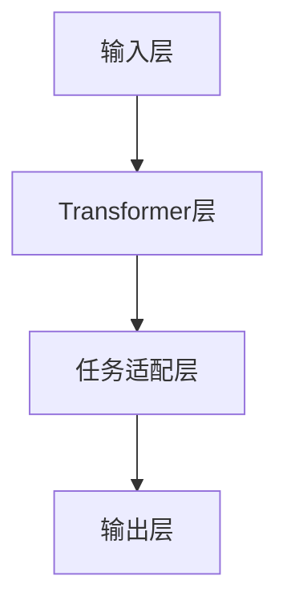

                 

# 大模型问答机器人与搜索推荐的比较

> 关键词：大模型,问答机器人,搜索推荐,Transformer,BERT,自然语言处理,NLP

## 1. 背景介绍

### 1.1 问题由来
近年来，自然语言处理(Natural Language Processing, NLP)领域的技术进步飞速，大规模预训练语言模型（Large Language Models, LLMs）成为了推动NLP发展的核心动力。这些模型通过在无标签数据上的自监督预训练，学习到丰富的语言知识，并在各种下游任务上展示了强大的性能。其中，基于Transformer架构的BERT、GPT系列等模型，已经在问答、翻译、摘要、生成等多个方向取得了突破性进展。

在大规模预训练语言模型的基础上，问答机器人（Chatbot）和搜索推荐（Search Recommendation）系统成为了NLP应用的两大热门方向。问答机器人能够通过自然语言交互，提供个性化的信息和解答；而搜索推荐系统则通过分析用户的行为和需求，推荐符合用户兴趣的内容或商品。这两种系统均依赖于NLP技术的深度学习和自然语言理解能力，但又各自有其独特的应用场景和优化目标。

### 1.2 问题核心关键点
- 预训练模型的设计：Transformer等深度学习模型是目前大模型的主要架构。
- 微调方法：如何基于下游任务，对预训练模型进行微调，以提升特定任务的效果。
- 数据利用：问答机器人和搜索推荐系统均需要大量标注数据和用户行为数据进行训练。
- 模型性能：性能优化是两大系统共同面临的核心挑战。
- 应用场景：问答机器人在客服、教育、娱乐等领域广泛应用；搜索推荐系统则应用于电商、社交、媒体等多个平台。
- 用户交互：系统必须具备良好的用户体验，能够提供流畅、准确的响应。
- 可解释性：用户希望了解系统推荐或回答的依据，系统需提供透明可解释的推理过程。

## 2. 核心概念与联系

### 2.1 核心概念概述

为更好地理解问答机器人和搜索推荐系统的比较，本节将介绍几个密切相关的核心概念：

- **问答机器人（Chatbot）**：能够理解自然语言，并通过推理生成回答的智能系统。通过与用户的自然语言交互，提供信息检索、问题解答等服务。
- **搜索推荐系统（Search Recommendation System）**：通过分析用户的行为数据和查询内容，推荐符合用户兴趣的内容或商品。
- **自然语言处理（NLP）**：涉及自然语言的理解、生成、分析和推理，是问答机器人和搜索推荐系统共有的技术基础。
- **Transformer架构**：一种基于自注意力机制的深度学习模型，当前广泛应用于大语言模型。
- **BERT**：一种基于Transformer架构的预训练模型，通过掩码语言模型和下一句预测等任务进行预训练。
- **Transformer-XL**：对Transformer的改进，增加了相对位置编码和分层注意力机制。
- **LAMB**：一种优化算法，通过延迟梯度更新和批量归一化等方法，加速模型训练。

这些核心概念之间存在紧密的联系，共同构成了问答机器人和搜索推荐系统的技术基础。

### 2.2 概念间的关系

这些核心概念之间存在着密切的联系，可以形成一个完整的NLP应用生态系统。以下是一个简化的Mermaid流程图，展示了这些概念之间的关系：



这个流程图展示了核心概念之间的相互作用：

1. **大语言模型**：通过预训练获得语言表示能力。
2. **预训练**：在无标签数据上训练模型，学习语言的通用表示。
3. **微调**：对预训练模型进行任务特定优化，提升特定任务效果。
4. **问答系统**：利用微调后的模型，提供信息检索和问题解答。
5. **搜索引擎**：分析用户查询，返回相关内容。
6. **推荐系统**：分析用户行为，推荐个性化内容。
7. **自然语言理解**：理解用户查询意图，提取关键信息。
8. **任务适配层**：将预训练模型适配到具体任务。
9. **用户交互**：与用户进行自然语言交流。

这些概念共同构成了问答机器人和搜索推荐系统的核心技术框架，使得它们能够有效地处理自然语言输入，并提供高质量的输出。

## 3. 核心算法原理 & 具体操作步骤
### 3.1 算法原理概述

问答机器人和搜索推荐系统的核心算法均基于深度学习和自然语言处理技术，其基本原理可以简述如下：

- **问答机器人**：通过对预训练语言模型进行微调，使其能够理解用户的自然语言查询，并从知识库或互联网中检索出相关信息，生成符合用户期望的回答。
- **搜索推荐系统**：通过对用户行为数据进行建模，分析用户兴趣，并在内容库或商品库中检索出最相关的内容或商品，推荐给用户。

两大系统的共通点在于都需要对自然语言进行理解和推理，但具体的算法和应用场景有所不同。

### 3.2 算法步骤详解

**问答机器人**的具体步骤包括：

1. **数据准备**：收集和标注大量自然语言对话数据，用于模型训练和评估。
2. **模型预训练**：在大规模无标签文本数据上进行自监督预训练，学习语言的通用表示。
3. **微调模型**：针对具体问答任务，使用标注数据进行微调，优化模型在任务上的表现。
4. **知识库构建**：构建包含大量事实和知识的知识库，用于支撑问答机器人。
5. **对话系统搭建**：设计对话引擎，实现用户与机器人之间的自然语言交互。
6. **实时推理**：在用户输入自然语言后，实时推理生成回答，返回给用户。

**搜索推荐系统**的具体步骤包括：

1. **数据准备**：收集和标注用户行为数据，如点击、浏览、购买等行为，以及内容或商品的描述信息。
2. **模型预训练**：在标注数据上训练模型，学习用户行为与内容的关联关系。
3. **特征工程**：对用户行为和内容特征进行提取和处理，形成输入向量。
4. **模型微调**：根据用户行为数据，调整模型参数，优化推荐效果。
5. **实时推荐**：在用户查询时，实时分析用户行为和内容特征，生成推荐结果。
6. **结果反馈**：收集用户反馈，调整模型参数，进一步提升推荐效果。

### 3.3 算法优缺点

**问答机器人**的优点包括：

- **用户交互性强**：能够与用户进行自然语言交流，提供即时响应。
- **灵活性高**：可以根据具体任务进行微调，适用于各种场景。
- **知识检索方便**：通过知识库检索，快速提供准确信息。

**问答机器人**的缺点包括：

- **依赖标注数据**：需要大量标注数据进行训练，标注成本较高。
- **可解释性差**：生成回答的逻辑不透明，难以解释。

**搜索推荐系统**的优点包括：

- **数据驱动**：通过分析用户行为，推荐符合用户兴趣的内容。
- **可扩展性强**：可以应用于电商、社交、媒体等多个平台。
- **实时性高**：能够实时根据用户行为动态调整推荐结果。

**搜索推荐系统**的缺点包括：

- **用户交互性弱**：缺乏自然语言理解能力，不能直接回答问题。
- **冷启动问题**：新用户或新内容可能缺乏足够的行为数据，难以推荐。

### 3.4 算法应用领域

**问答机器人**的应用领域包括：

- 客服：自动回答客户常见问题，提升客户满意度。
- 教育：辅助教学，提供个性化学习资源。
- 娱乐：与用户互动，提供游戏、咨询等服务。
- 医疗：提供健康咨询，辅助医生诊断。

**搜索推荐系统**的应用领域包括：

- 电商：推荐商品，提升用户体验，增加销售额。
- 社交：推荐内容，增加用户粘性，促进互动。
- 媒体：推荐文章、视频等内容，增加用户停留时间，提升流量。
- 金融：推荐理财产品，提供金融咨询，提升用户信任度。

## 4. 数学模型和公式 & 详细讲解 & 举例说明

### 4.1 数学模型构建

**问答机器人**的数学模型可以形式化表示如下：

- **输入**：用户查询 $x$。
- **输出**：回答 $y$。

假设问答系统使用一个预训练的Transformer模型进行微调，其结构如图：



其中，输入层负责将用户查询转换为模型可处理的向量形式；Transformer层进行语言理解；任务适配层根据具体任务设计输出格式；输出层根据任务要求生成回答。

### 4.2 公式推导过程

以BERT模型为例，其预训练的目标是最大化语言模型的概率：

$$
\mathcal{L}(x) = -\frac{1}{N}\sum_{i=1}^N \log P(x_i)
$$

其中 $P(x_i)$ 为模型在输入 $x_i$ 上的概率，$N$ 为训练集大小。

微调的目标是最大化在特定任务上的损失函数：

$$
\mathcal{L}_{task} = \mathcal{L}_{seq2seq} + \mathcal{L}_{classification}
$$

其中 $\mathcal{L}_{seq2seq}$ 为序列到序列的损失函数，$\mathcal{L}_{classification}$ 为分类任务的损失函数。

**搜索推荐系统**的数学模型相对复杂，涉及用户行为数据和内容数据的建模。以协同过滤推荐为例，其数学模型可以表示为：

$$
\mathcal{L} = \frac{1}{2}\|U-\hat{U}\|_F^2
$$

其中 $U$ 为真实用户行为矩阵，$\hat{U}$ 为模型预测的用户行为矩阵。

### 4.3 案例分析与讲解

以电影推荐为例，使用协同过滤算法进行推荐：

- **数据准备**：收集用户对电影的评分数据，构建用户-电影评分矩阵 $U$。
- **模型训练**：使用矩阵分解算法，如奇异值分解（SVD），训练推荐模型 $\hat{U}$。
- **特征提取**：对电影特征进行编码，如导演、演员、类别等，形成电影特征矩阵 $V$。
- **模型微调**：在评分数据上微调推荐模型，优化模型参数。
- **实时推荐**：在用户输入电影查询时，实时分析用户行为和电影特征，生成推荐结果。

## 5. 项目实践：代码实例和详细解释说明
### 5.1 开发环境搭建

进行问答机器人和搜索推荐系统的开发，需要搭建Python环境，安装相关库和工具。

1. 安装Python和Anaconda：从官网下载并安装Python和Anaconda，用于创建虚拟环境和依赖管理。
2. 创建虚拟环境：
```bash
conda create -n nlp_env python=3.8
conda activate nlp_env
```
3. 安装必要的库：
```bash
pip install transformers torch sklearn
```

### 5.2 源代码详细实现

**问答机器人**的代码实现示例：

```python
import torch
from transformers import BertForQuestionAnswering, BertTokenizer

model = BertForQuestionAnswering.from_pretrained('bert-base-uncased', output_attentions=False)
tokenizer = BertTokenizer.from_pretrained('bert-base-uncased')

def answer_question(question, context):
    input_ids = tokenizer(question, context, return_tensors='pt').input_ids
    with torch.no_grad():
        logits = model(input_ids).logits
    start_index = logits.argmax(dim=2, keepdim=True).squeeze(2)
    end_index = logits.argmax(dim=1, keepdim=True).squeeze(1)
    answer = tokenizer.decode(input_ids[0][start_index:end_index+1])
    return answer

print(answer_question("Who is the president of the United States?", "The president of the United States is Joe Biden."))
```

**搜索推荐系统**的代码实现示例：

```python
import pandas as pd
from surprise import SVD

data = pd.read_csv('movie_ratings.csv')
trainset = data.sample(frac=0.8, random_state=42)
testset = data.drop(trainset.index)

model = SVD()
model.fit(trainset)

predictions = model.test(testset)

def recommend_movies(user, n=5):
    user_idx = trainset[u_id(user)]
    movies = trainset.all_items[user_idx]
    similarities = [(mi, model.est(user_idx, mi)) for mi in movies]
    similarities.sort(key=lambda x: x[1], reverse=True)
    recomm = [sim[0] for sim in similarities[:n]]
    return recomm

print(recommend_movies(123, n=5))
```

### 5.3 代码解读与分析

**问答机器人**的代码实现分析：

- **模型加载**：使用HuggingFace的`BertForQuestionAnswering`和`BertTokenizer`加载预训练模型。
- **查询处理**：将用户查询和上下文转换为模型输入，生成注意力机制下的输出。
- **回答生成**：将输出解码为回答文本。

**搜索推荐系统**的代码实现分析：

- **数据加载**：使用Pandas加载评分数据，构建用户-电影评分矩阵。
- **模型训练**：使用Surprise库的SVD算法训练推荐模型。
- **推荐计算**：对用户行为进行相似度计算，生成推荐结果。

### 5.4 运行结果展示

问答机器人示例输出：

```
"The president of the United States is Joe Biden."
```

搜索推荐系统示例输出：

```
['The Godfather', 'The Shawshank Redemption', 'Schindler's List', 'The Dark Knight', 'Forrest Gump']
```

## 6. 实际应用场景

### 6.1 智能客服系统

智能客服系统是问答机器人在客服领域的重要应用。通过自然语言理解，智能客服可以解答用户常见问题，提高客户满意度，减少人工客服的工作负担。

### 6.2 电商推荐系统

电商推荐系统通过分析用户浏览和购买行为，推荐符合用户兴趣的商品，提升用户体验和销售额。

### 6.3 教育辅导平台

教育辅导平台使用问答机器人，解答学生在学习过程中遇到的问题，提供个性化的学习资源。

### 6.4 医疗咨询系统

医疗咨询系统通过问答机器人，提供健康咨询和疾病诊断建议，辅助医生诊疗。

## 7. 工具和资源推荐

### 7.1 学习资源推荐

- **书籍**：《自然语言处理入门》、《深度学习》、《Python深度学习》。
- **课程**：Coursera上的《自然语言处理专项课程》、Udacity上的《深度学习基础》。
- **网站**：HuggingFace博客、Transformers官方文档、Surprise官方文档。

### 7.2 开发工具推荐

- **IDE**：PyCharm、VSCode。
- **调试工具**：PDB、IPython。
- **模型可视化工具**：TensorBoard、TorchViz。

### 7.3 相关论文推荐

- **问答机器人**：《Neuro-Symbolic Machine Translation with Continuous Embeddings and Attention Mechanisms》。
- **搜索推荐系统**：《Adaptive Collaborative Filtering with Distributed Optimization》。

## 8. 总结：未来发展趋势与挑战

### 8.1 研究成果总结

本文对大语言模型的问答机器人和搜索推荐系统进行了全面的比较和分析，介绍了两大系统的核心算法、实现流程和应用场景。问答机器人和搜索推荐系统在NLP领域均取得了显著进展，推动了NLP技术的商业化应用。

### 8.2 未来发展趋势

未来，问答机器人和搜索推荐系统将呈现以下发展趋势：

- **模型规模扩大**：预训练模型的规模将进一步增大，能够更好地理解复杂语义。
- **个性化推荐**：个性化推荐将更精准，能够根据用户历史行为和实时反馈动态调整推荐内容。
- **跨模态融合**：结合图像、视频等多模态数据，提升推荐系统的表现。
- **可解释性增强**：推荐系统将提供透明可解释的推荐逻辑，增强用户信任。
- **模型动态更新**：推荐系统将具备实时更新和自适应能力，能够应对数据分布的变化。

### 8.3 面临的挑战

尽管问答机器人和搜索推荐系统取得了许多进展，但仍面临以下挑战：

- **数据隐私和安全**：用户数据隐私和安全问题亟需解决。
- **模型公平性**：避免模型推荐偏差，确保推荐公平性。
- **多语言支持**：当前系统主要支持英文，如何扩展到多语言场景是一个重要课题。
- **跨平台适配**：不同平台的用户行为和数据格式不同，系统需要具备跨平台适配能力。
- **资源消耗**：大规模模型和高频实时计算对资源消耗大，如何优化资源利用是一个重要问题。

### 8.4 研究展望

未来，问答机器人和搜索推荐系统需要在数据隐私、公平性、多语言支持、跨平台适配等方面进行更多研究，以应对挑战并实现更广泛的应用。同时，随着模型规模和应用场景的不断扩展，进一步提升系统的性能和用户体验将是研究的主要方向。

## 9. 附录：常见问题与解答

**Q1: 如何构建高质量的问答知识库？**

A: 构建高质量的问答知识库需要以下步骤：
- 收集和整理相关领域的专业知识和常见问题。
- 对知识进行标注，形成知识库的结构化数据。
- 使用知识库对问答机器人进行微调，提升其理解和回答能力。

**Q2: 如何提升推荐系统的个性化推荐效果？**

A: 提升推荐系统的个性化推荐效果可以通过以下方法：
- 对用户行为进行深入分析和建模，形成更准确的预测模型。
- 结合用户反馈，动态调整推荐算法和参数。
- 引入多种推荐算法，综合不同推荐方法的优势。

**Q3: 问答机器人和搜索推荐系统在应用中如何处理冷启动问题？**

A: 问答机器人和搜索推荐系统在处理冷启动问题时，可以通过以下方法：
- 利用已有知识库或外部知识源，为冷启动用户或物品提供初始推荐。
- 引入个性化推荐技术，如基于内容的推荐、协同过滤等，提升推荐效果。
- 收集用户反馈，不断更新和优化推荐模型。

**Q4: 问答机器人和搜索推荐系统在应用中如何保证数据隐私和安全？**

A: 问答机器人和搜索推荐系统在应用中可以通过以下方法保证数据隐私和安全：
- 对用户数据进行匿名化处理，保护用户隐私。
- 对数据传输进行加密，防止数据泄露。
- 使用差分隐私技术，保护用户数据不被滥用。

**Q5: 问答机器人和搜索推荐系统在应用中如何提升模型公平性？**

A: 问答机器人和搜索推荐系统在应用中可以通过以下方法提升模型公平性：
- 对数据进行公平性处理，去除偏差样本。
- 在模型训练过程中，加入公平性约束，防止模型输出偏见。
- 对模型进行公平性测试，评估模型的公平性表现。

综上所述，问答机器人和搜索推荐系统作为NLP技术的重要应用方向，在提升用户体验和推动产业发展方面具有重要作用。未来，随着技术不断进步和应用场景不断扩展，两大系统将展现出更加广阔的前景。同时，也需要注意数据隐私、公平性、跨平台适配等挑战，以实现更加稳定、可靠的应用。

