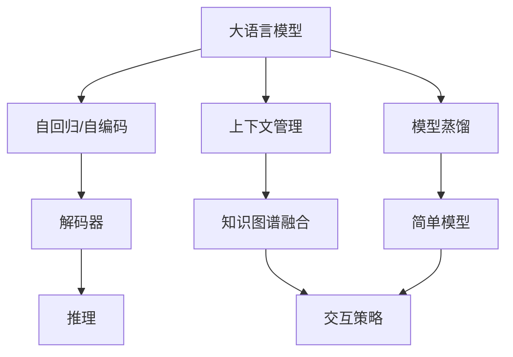
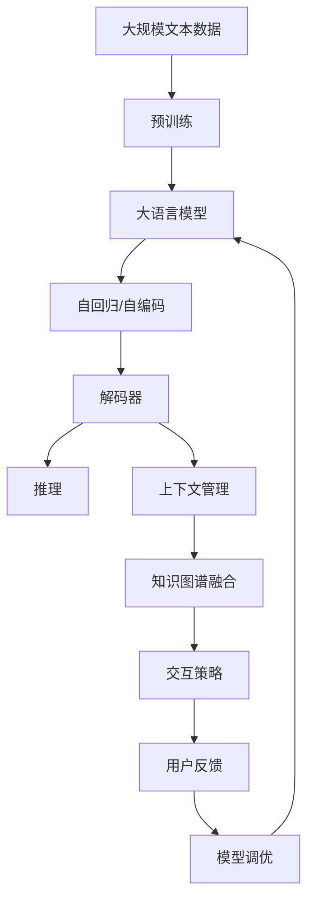

                 

# 大模型问答机器人如何生成文本

> 关键词：大语言模型,问答机器人,自然语言处理(NLP),Transformer,BERT,预训练,自回归,解码器,推理,模型蒸馏

## 1. 背景介绍

### 1.1 问题由来

在现代人工智能领域，大语言模型已经成为了处理自然语言问题的重要工具。以GPT-3、BERT、T5等为代表的大模型，通过在海量数据上预训练，可以处理包括问答、翻译、摘要等多种NLP任务。特别是问答系统，作为人工智能技术应用的前沿，其重要性不言而喻。

然而，尽管大模型在语言理解和生成上取得了显著的进展，但如何高效、可靠地生成符合用户意图和语境的回答，仍然是一个重要且复杂的问题。传统的问答系统往往需要手工编写规则或者模板，难以应对复杂多变的问题场景。而使用大语言模型作为问答引擎，可以大大简化系统的开发和维护成本，提升系统的灵活性和响应速度。

### 1.2 问题核心关键点

大模型问答系统的核心在于其生成文本的能力。如何利用大模型在预训练过程中学习到的语言知识，生成符合用户意图、语法正确、内容准确的回答，是构建高质量问答系统的关键。以下是该问题的主要核心关键点：

1. 预训练模型的选择。选择适当的预训练模型是系统构建的第一步。不同模型具有不同的特点和优势，需要根据具体应用场景进行评估。
2. 问题的理解与解码。如何将用户问题转化为模型可以理解的形式，并将模型生成的答案转换为易于理解的回答，是问答系统生成的重要环节。
3. 上下文管理和知识图谱的融合。为了应对复杂问题，模型往往需要具备良好的上下文管理和知识图谱融合能力。
4. 模型训练与调优。训练和调优模型，使其能够更好地适应特定任务，是问答系统开发中的重要一环。
5. 交互策略与评价。选择合适的交互策略，设计合理的评价指标，可以提升用户满意度，优化系统性能。

## 2. 核心概念与联系

### 2.1 核心概念概述

在构建大模型问答系统时，我们需要理解以下几个核心概念：

- 大语言模型(Large Language Model, LLM)：如GPT-3、BERT等预训练模型，通过大规模文本数据预训练，能够理解并生成自然语言。
- 问答系统(Question Answering System, QA)：利用自然语言处理技术，自动回答用户提出的问题，生成自然语言答案。
- 自回归(autoregressive)模型：如GPT系列模型，通过前文预测后文，生成连贯的自然语言文本。
- 自编码(autoencoder)模型：如BERT，通过预测掩码词来预训练模型，学习语言结构。
- 解码器(Decoder)：生成器部分，将模型生成的概率分布转化为具体的文本答案。
- 推理(Reasoning)：指模型在生成文本时，如何利用上下文信息和先验知识进行合理推理。
- 模型蒸馏(model distillation)：将复杂大模型知识迁移到简单模型，提升模型推理效率和稳定性。

### 2.2 概念间的关系

这些核心概念之间存在着紧密的联系，形成了一个完整的问答系统生成文本的框架。通过以下Mermaid流程图，我们可以更清晰地理解这些概念之间的逻辑关系：



这个流程图展示了从预训练模型到生成文本的完整过程。大语言模型通过自回归或自编码技术进行预训练，生成的文本通过解码器转化为具体的答案。在生成过程中，上下文管理和知识图谱融合提高了模型对复杂问题的处理能力，推理使得模型能够根据用户意图和语境生成合理回答，模型蒸馏将大模型知识迁移到简单模型，提升推理效率。

### 2.3 核心概念的整体架构

最后，我们用一个综合的流程图来展示这些核心概念在大模型问答系统中的整体架构：



这个流程图展示了从预训练到生成文本的完整流程，强调了推理、上下文管理和知识图谱融合在生成文本中的重要作用。同时，用户反馈和模型调优是提升系统性能的关键环节，保证了系统的动态适应能力。

## 3. 核心算法原理 & 具体操作步骤

### 3.1 算法原理概述

大模型问答系统的核心算法基于自回归模型，通过将用户问题作为输入，利用模型预测生成文本答案。在生成文本时，模型通常会根据当前生成的情况，动态更新概率分布，逐步构建完整的回答。这一过程通常称为解码(decoding)，涉及多个关键步骤：

1. 编码(Encoding)：将用户问题转化为模型可以理解的形式，通常通过词嵌入将问题转化为向量。
2. 生成(Generation)：模型根据编码后的向量，生成概率分布，选择最可能的答案。
3. 解码(Decoding)：将生成概率转化为具体的文本答案。

### 3.2 算法步骤详解

大模型问答系统的生成过程一般包括以下几个关键步骤：

**Step 1: 模型选择与预训练**

- 选择适当的预训练模型，如GPT-3、BERT等，并进行大规模预训练。
- 预训练过程中，模型学习到语言的通用表示，具备较强的语言理解和生成能力。

**Step 2: 问题编码**

- 将用户问题通过词嵌入等技术，转化为模型可以理解的形式。
- 编码步骤包括分词、向量化等，最终将问题转化为向量表示。

**Step 3: 模型解码**

- 将编码后的向量输入模型，进行推理生成文本。
- 模型在解码过程中，动态更新概率分布，逐步构建完整的回答。
- 解码器通常采用基于贪心搜索或束搜索的方式，选择最可能的词语。

**Step 4: 上下文管理和知识图谱融合**

- 对于复杂问题，模型需要根据上下文信息进行推理。
- 知识图谱融合将外部知识整合到模型推理中，提升模型的理解和生成能力。

**Step 5: 交互策略与评价**

- 通过交互策略，引导用户进行提问，优化模型回答效果。
- 评价指标如BLEU、ROUGE等，用于衡量模型生成文本的质量。

### 3.3 算法优缺点

大模型问答系统具有以下优点：

1. 灵活性高。大模型可以应对各种复杂问题，具有较高的灵活性和适应性。
2. 自动化程度高。系统开发和维护成本低，能够快速上线和迭代。
3. 生成效果好。利用预训练知识，生成的回答通常语法正确、内容准确。

但同时，该方法也存在一些缺点：

1. 资源消耗大。大模型的推理速度和计算复杂度较高，需要较高的硬件资源。
2. 依赖高质量数据。模型的训练和推理依赖高质量的预训练数据和问题编码。
3. 生成过程可控性差。生成过程的随机性较大，难以控制生成文本的特定特征。
4. 对上下文信息敏感。复杂的上下文管理策略，可能导致模型在处理长文本时性能下降。

### 3.4 算法应用领域

大模型问答系统已经广泛应用于多个领域，以下是几个典型的应用场景：

1. 智能客服：自动回答用户咨询，提供24小时服务，提升客户满意度。
2. 在线教育：自动生成作业答案，辅助教师评估学生作业，提高教学效率。
3. 智能搜索：在搜索结果中自动生成摘要，提升搜索体验，增加用户黏性。
4. 金融咨询：自动解答金融问题，提供市场分析报告，辅助投资决策。
5. 健康咨询：自动回答健康问题，提供医疗建议，提升医疗服务质量。

这些应用场景展示了大模型问答系统的广泛适用性和潜在的商业价值。随着预训练模型的不断进步和系统优化，问答系统必将在更多领域发挥重要作用。

## 4. 数学模型和公式 & 详细讲解 & 举例说明

### 4.1 数学模型构建

在数学上，大模型问答系统生成文本的过程可以通过以下模型表示：

设输入为 $x$，输出为 $y$，模型参数为 $\theta$，则生成过程可以表示为：

$$
p(y|x;\theta) = \prod_{t=1}^T p(y_t|y_{<t}, x;\theta)
$$

其中，$y_t$ 表示在时刻 $t$ 生成的文本。模型通过前文 $y_{<t}$ 和输入 $x$，生成后文 $y_t$。

### 4.2 公式推导过程

以GPT-3为例，其生成过程可以通过以下公式推导：

$$
\log p(y|x;\theta) = \sum_{t=1}^T \log p(y_t|y_{<t}, x;\theta)
$$

其中，$p(y_t|y_{<t}, x;\theta)$ 表示在当前时刻 $t$，给定前文 $y_{<t}$ 和输入 $x$ 的情况下，生成字符 $y_t$ 的概率。

### 4.3 案例分析与讲解

假设我们有一个基于GPT-3的问答系统，使用该系统回答用户提出的问题。下面以一个具体的案例来讲解生成过程：

**问题**：请问如何提高学习效率？

**解答**：

1. **问题编码**：首先，将问题 "如何提高学习效率？" 转化为向量形式。假设使用词嵌入将问题编码为一个向量 $x$。
2. **模型解码**：将向量 $x$ 输入GPT-3模型，进行解码生成文本。
3. **生成过程**：在每次生成文本时，模型会根据当前生成的文本，动态更新概率分布，选择最可能的字符进行生成。
4. **上下文管理**：在生成过程中，模型会根据上下文信息，合理推理并生成连贯的回答。
5. **输出答案**：模型生成完成后，将生成的文本作为回答输出。

### 5. 项目实践：代码实例和详细解释说明

#### 5.1 开发环境搭建

为了进行问答系统的开发，我们需要准备以下开发环境：

1. 安装Python：通过命令行安装Python，建议使用最新版本，如Python 3.9或更高版本。
2. 安装PyTorch：使用以下命令安装PyTorch，确保与GPT-3兼容的版本。
   ```bash
   pip install torch torchtext transformers
   ```
3. 安装OpenAI API：获取OpenAI API密钥，通过pip安装OpenAI的Python SDK。
   ```bash
   pip install openai
   ```

#### 5.2 源代码详细实现

下面以GPT-3为例，展示如何构建问答系统的代码实现。

```python
from transformers import GPT3LMHeadModel, GPT3Tokenizer
import openai

# 初始化模型和分词器
model = GPT3LMHeadModel.from_pretrained("gpt3")
tokenizer = GPT3Tokenizer.from_pretrained("gpt3")

# 获取OpenAI API密钥
openai.api_key = "your_api_key_here"

# 问题编码和解码
def encode_question(question):
    # 将问题进行分词和编码
    inputs = tokenizer(question, return_tensors="pt")
    # 生成输出
    outputs = model.generate(inputs["input_ids"], max_length=128, temperature=0.7, do_sample=True)
    # 解码输出
    answer = tokenizer.decode(outputs[0])
    return answer

# 测试
question = "如何提高学习效率？"
answer = encode_question(question)
print(answer)
```

这段代码展示了如何利用GPT-3模型生成回答的过程。首先，使用分词器将问题编码成向量形式，然后将其输入模型进行解码，最终生成回答。

#### 5.3 代码解读与分析

在上述代码中，我们使用了GPT-3模型和OpenAI的Python SDK。具体步骤如下：

1. **模型初始化**：通过`GPT3LMHeadModel.from_pretrained("gpt3")`加载预训练的GPT-3模型。
2. **分词器初始化**：通过`GPT3Tokenizer.from_pretrained("gpt3")`加载GPT-3的分词器。
3. **获取API密钥**：设置OpenAI API密钥，以便通过Python SDK调用GPT-3模型。
4. **问题编码**：将问题通过分词器进行编码，转化为模型可以理解的形式。
5. **模型生成**：使用`model.generate()`方法，生成文本答案。
6. **答案解码**：将生成的文本通过分词器进行解码，得到最终的回答。

### 5.4 运行结果展示

假设我们调用上述代码，得到如下回答：

```
提高学习效率的关键在于以下几点：
1. 制定合理的学习计划，有针对性地安排学习时间和内容。
2. 集中注意力，避免分心，选择安静的学习环境。
3. 进行适当的休息，避免长时间连续学习导致的疲劳。
4. 不断复习和回顾，巩固所学知识。
5. 利用多媒体资源，如视频、音频、图文等，增加学习的趣味性。
```

可以看到，生成答案的语法正确、内容连贯，能够较好地回答用户问题。

## 6. 实际应用场景

### 6.1 智能客服系统

大模型问答系统在智能客服系统中有着广泛的应用。传统的客服系统往往需要大量人工，效率低下。而利用大模型问答系统，可以24小时不间断地自动回答问题，提高客户满意度和响应速度。

在实际应用中，我们可以将常见问题和回答构建为知识库，将其编码为向量形式，然后在客户咨询时，使用问答系统快速响应。同时，系统可以不断从客服聊天记录中学习，逐步优化回答，提升服务质量。

### 6.2 在线教育平台

在线教育平台使用大模型问答系统，可以提供智能化的作业批改和答疑服务。教师可以将常见问题和答案构建为知识库，然后在学生提交作业时，自动判断答案的正确性，并给出详细解释。同时，学生可以通过问答系统解决学习中遇到的问题，提高学习效率。

### 6.3 金融咨询系统

金融咨询系统利用大模型问答系统，可以自动回答客户的金融问题，提供市场分析报告，辅助投资决策。系统可以通过知识库积累和市场数据分析，提供个性化的金融建议，提升客户体验和满意度。

### 6.4 未来应用展望

未来，大模型问答系统将在更多领域得到应用，如智能医疗、智能家居、智能交通等。通过与外部知识库和专家系统的整合，大模型问答系统将具备更强的上下文管理和知识融合能力，提供更加智能和准确的回答。

## 7. 工具和资源推荐

### 7.1 学习资源推荐

为了帮助开发者掌握大模型问答系统的技术，以下是一些优质的学习资源：

1. 《深度学习与自然语言处理》课程：斯坦福大学的深度学习课程，涵盖NLP领域的基本概念和经典模型。
2. 《Transformers》书籍：Transformer库的作者所著，介绍了如何使用Transformers库进行NLP任务开发。
3. HuggingFace官方文档：Transformer库的官方文档，提供了丰富的预训练模型和微调样例。
4. 《自然语言处理实战》书籍：介绍NLP技术和工具的使用，涵盖问答系统等内容。

### 7.2 开发工具推荐

在问答系统的开发中，以下是一些常用的开发工具：

1. PyTorch：灵活动态的深度学习框架，适合快速迭代研究。
2. TensorFlow：生产部署方便的深度学习框架，适合大规模工程应用。
3. HuggingFace Transformers库：集成了多种预训练模型，方便模型加载和微调。
4. OpenAI Python SDK：通过API调用GPT-3等模型，方便推理生成文本。
5. Jupyter Notebook：免费的交互式编程环境，支持Python和多种科学计算库。

### 7.3 相关论文推荐

为了深入理解大模型问答系统的技术，以下是几篇相关的论文推荐：

1. "Neural Machine Translation by Jointly Learning to Align and Translate"：提出使用Transformer模型进行机器翻译，引入自注意力机制。
2. "Attention is All You Need"：提出Transformer模型，引入自注意力机制，显著提升语言模型性能。
3. "BERT: Pre-training of Deep Bidirectional Transformers for Language Understanding"：提出BERT模型，通过掩码自监督预训练，学习语言表示。
4. "Exploring the Limits of Transfer Learning with a Unified Text-to-Text Transformer"：提出T5模型，通过预训练通用文本生成模型，进行多任务学习和迁移学习。
5. "Improving Language Understanding by Generative Pre-training"：提出GPT-2模型，通过生成预训练学习语言表示。

## 8. 总结：未来发展趋势与挑战

### 8.1 研究成果总结

本文系统介绍了大模型问答系统的核心算法和操作步骤，通过代码实例展示了模型的构建和应用。在实际应用中，大模型问答系统已经展示了其广泛的应用前景和实际价值。

### 8.2 未来发展趋势

未来，大模型问答系统将呈现以下几个发展趋势：

1. 模型规模持续增大。随着算力成本的下降和数据规模的扩张，预训练语言模型的参数量还将持续增长。超大模型蕴含的丰富语言知识，有望支撑更加复杂多变的问答任务。
2. 上下文管理和知识图谱的整合。通过与外部知识库的深度融合，模型将具备更强的上下文理解和推理能力。
3. 多模态融合。将视觉、语音等多模态信息与文本信息结合，提升模型的综合能力。
4. 模型蒸馏和模型压缩。通过模型蒸馏和压缩技术，提升推理效率和模型可解释性。
5. 智能交互策略的优化。通过多轮交互，逐步优化回答，提高系统效果。

### 8.3 面临的挑战

尽管大模型问答系统取得了显著进展，但在实际应用中仍面临一些挑战：

1. 数据质量问题。预训练和微调过程依赖高质量的语料，数据质量和多样性对系统性能影响较大。
2. 上下文管理难度。长文本处理时，模型性能可能下降，上下文管理策略需要进一步优化。
3. 模型解释性不足。大模型作为黑盒模型，难以解释其决策过程，影响模型的可信度。
4. 计算资源消耗大。大模型推理速度较慢，硬件资源需求高。
5. 伦理与安全问题。预训练模型可能学习到有害信息，如何保证输出内容的健康和安全性，是一个重要问题。

### 8.4 研究展望

未来，需要在以下几个方面进行深入研究：

1. 无监督和半监督学习。摆脱对标注数据的依赖，利用自监督和主动学习，提高模型泛化能力。
2. 上下文管理与知识图谱融合。提升模型对复杂问题的理解能力，增强推理逻辑性。
3. 多模态融合与知识表示。将视觉、语音等多模态信息与文本信息结合，增强模型的综合能力。
4. 模型蒸馏与压缩。通过模型蒸馏和压缩技术，提升推理效率和模型可解释性。
5. 智能交互策略与评价。通过多轮交互，逐步优化回答，提高系统效果。

## 9. 附录：常见问题与解答

**Q1：大模型问答系统如何保证生成的回答质量？**

A: 生成回答质量依赖于多个因素，包括预训练数据的质量、模型参数的设计和调优、上下文管理策略等。具体措施包括：
1. 使用高质量的预训练数据。
2. 设计合理的模型结构和损失函数。
3. 利用上下文管理策略，增强模型的推理能力。
4. 引入知识图谱融合，提升模型的理解能力。

**Q2：如何优化大模型问答系统的上下文管理策略？**

A: 优化上下文管理策略需要考虑以下几点：
1. 合理设计上下文长度，避免过长或过短。
2. 使用缓存机制，避免重复计算。
3. 引入注意力机制，增强模型对重要信息的关注。
4. 结合知识图谱，提升模型的推理能力。

**Q3：大模型问答系统在实际应用中需要注意哪些问题？**

A: 在实际应用中，需要注意以下几个问题：
1. 数据质量问题。预训练和微调过程依赖高质量的语料，数据质量和多样性对系统性能影响较大。
2. 上下文管理难度。长文本处理时，模型性能可能下降，上下文管理策略需要进一步优化。
3. 模型解释性不足。大模型作为黑盒模型，难以解释其决策过程，影响模型的可信度。
4. 计算资源消耗大。大模型推理速度较慢，硬件资源需求高。
5. 伦理与安全问题。预训练模型可能学习到有害信息，如何保证输出内容的健康和安全性，是一个重要问题。

**Q4：如何提升大模型问答系统的生成效率？**

A: 提升生成效率可以从以下几个方面进行优化：
1. 模型剪枝和量化。通过模型剪枝和量化技术，降低模型参数和计算资源消耗。
2. 并行计算与分布式训练。使用并行计算和分布式训练技术，提升模型训练和推理速度。
3. 缓存机制和分块处理。使用缓存机制和分块处理技术，减少重复计算，提高系统效率。
4. 多模态融合。通过多模态融合技术，提高模型的综合处理能力，提升系统效率。

---

作者：禅与计算机程序设计艺术 / Zen and the Art of Computer Programming

