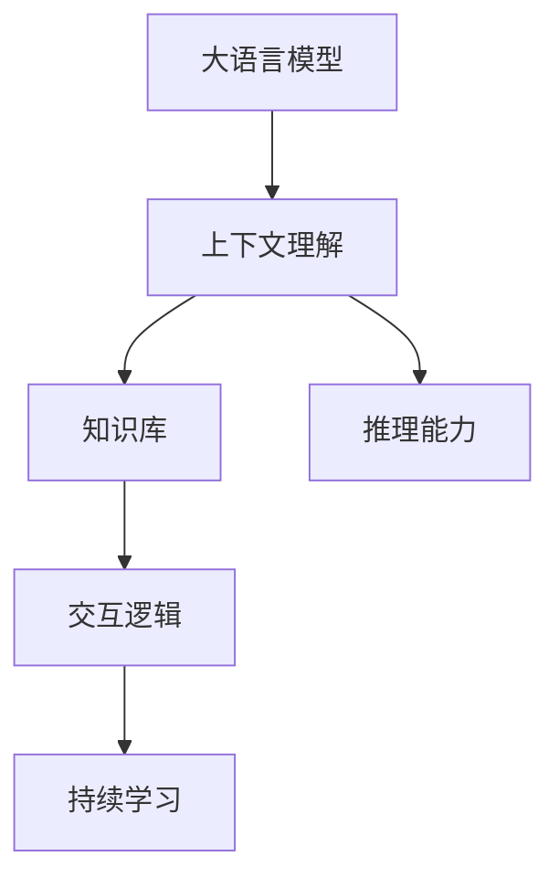
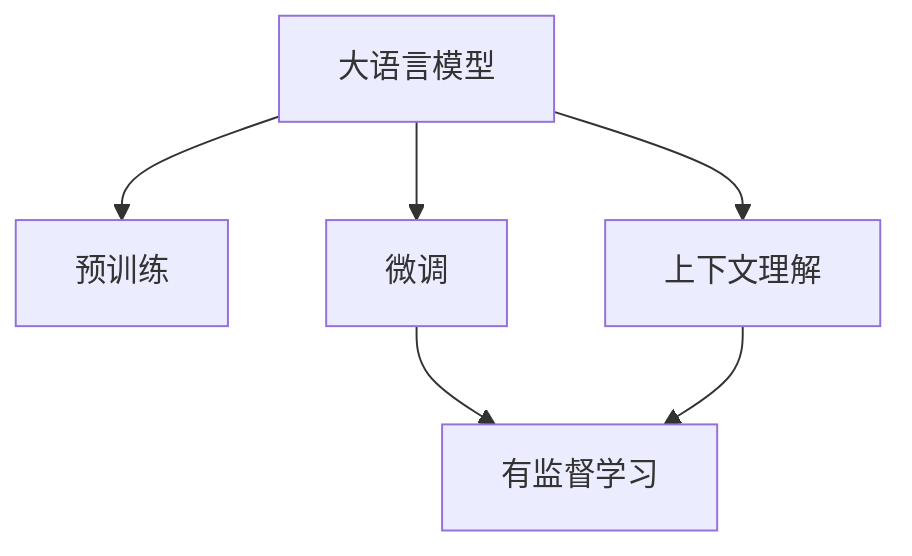
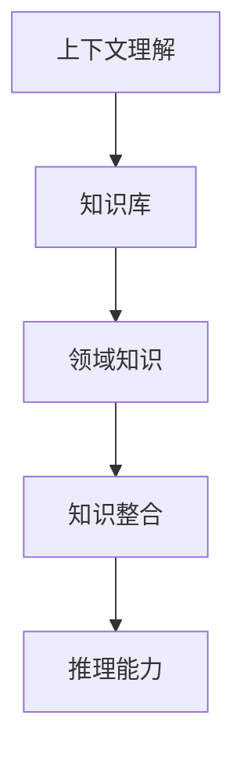
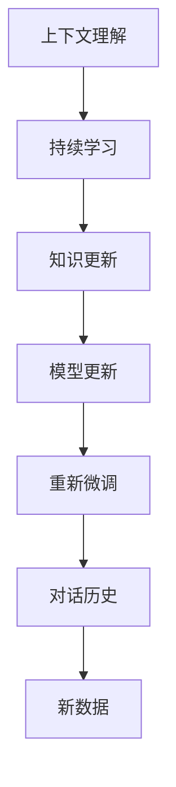

                 

# 大模型问答机器人的上下文理解

## 1. 背景介绍

### 1.1 问题由来

问答系统（Question Answering, QA）一直是自然语言处理（NLP）领域的重要研究方向，旨在通过自然语言输入，自动输出符合人类认知的准确回答。早期的问答系统主要依靠规则库和模板，需要大量的人工设计和维护。而随着深度学习技术的发展，特别是基于神经网络的语言模型，使问答系统从基于规则向基于数据和模型的方向转变，取得了显著的进展。

大语言模型（Large Language Model, LLMs）的崛起，为问答系统带来了新的突破。预训练语言模型在大量无标签文本数据上进行了自监督学习，能够捕捉到丰富的语言知识，包括语法结构、语义关系和常识背景等，从而显著提升了问答系统的性能。Google的BERT和OpenAI的GPT系列模型都是具有代表性的预训练模型，它们在问答任务上展示了强大的泛化能力。

然而，尽管基于大模型的问答系统在许多任务上取得了令人瞩目的成果，但在特定场景下，尤其是对话场景中，仍存在上下文理解不足、知识更新不及时、用户意图难以把握等问题。大模型的上下文理解能力是问答系统的核心挑战之一，需要在理论上提供严谨的分析，在实践中提出有效的解决方案。

### 1.2 问题核心关键点

问答系统的上下文理解能力，指的是模型在处理自然语言输入时，能够理解并综合考虑上下文信息，正确推断用户的意图和背景知识，从而生成准确的回答。这一能力对于构建有效的问答系统至关重要。

**核心问题**包括：
- 如何利用上下文信息提升模型的语义理解能力？
- 如何在模型中保留和利用先验知识，如领域特定知识库？
- 如何快速更新模型知识库，适应新的信息变化？
- 如何处理对话中的复杂逻辑和因果关系？
- 如何在实时对话中保持一致性和连贯性？

### 1.3 问题研究意义

上下文理解能力的提升，对于构建高效、可靠的问答系统，具有重要意义：

1. **提升回答准确度**：上下文理解使得模型能够准确把握用户意图，避免机械匹配和误导性回答。
2. **增加知识广度**：通过上下文理解，模型可以整合不同源的信息，丰富知识储备，提升回答的多样性和深度。
3. **增强交互连贯性**：对话上下文中的连贯性和一致性，是构建自然流畅对话的重要保障。
4. **应对多轮对话**：多轮对话中，上下文理解使得模型能够记忆和继承对话历史，进行更深入的推理和预测。
5. **拓展应用场景**：上下文理解能力的提升，为问答系统拓展到医疗、法律、教育等领域提供了可能。

## 2. 核心概念与联系

### 2.1 核心概念概述

为更好地理解大模型问答机器人上下文理解，本节将介绍几个密切相关的核心概念：

- **大语言模型(Large Language Model, LLM)**：以自回归（如GPT）或自编码（如BERT）模型为代表的大规模预训练语言模型。通过在大规模无标签文本数据上进行预训练，学习通用的语言表示，具备强大的语言理解和生成能力。

- **上下文理解(Contextual Understanding)**：指模型在处理自然语言输入时，能够理解并综合考虑上下文信息，正确推断用户的意图和背景知识，从而生成准确的回答。

- **知识库(Knowledge Base)**：包含特定领域的相关知识，如医学知识、法律条款、行业规范等。知识库的构建和管理，是大模型问答系统的重要支撑。

- **交互逻辑(Interactive Logic)**：指在对话过程中，模型能够处理和维护逻辑关系，如因果关系、条件判断等，保持对话的连贯性和一致性。

- **推理能力(Inference Capability)**：指模型能够在已知上下文的基础上，进行逻辑推理和推断，生成合理的回答。

- **持续学习(Continual Learning)**：指模型能够从新数据中不断学习，同时保持已学习的知识，避免灾难性遗忘。这对于构建长生命周期的问答系统尤为重要。

这些核心概念之间的逻辑关系可以通过以下Mermaid流程图来展示：



这个流程图展示了大语言模型的核心概念及其之间的关系：

1. 大语言模型通过预训练获得基础能力。
2. 上下文理解使得模型能够综合考虑对话历史和背景知识，进行语义推断。
3. 知识库为模型提供了特定领域的知识，增强了回答的准确性和可靠性。
4. 交互逻辑维护了对话中的逻辑关系，使得回答连贯一致。
5. 推理能力使得模型能够进行逻辑推理和推断，生成合理的回答。
6. 持续学习保证了模型能够不断更新知识库，适应新信息的变化。

这些概念共同构成了大语言模型问答系统的学习框架，使其能够在各种场景下发挥强大的语言理解和生成能力。通过理解这些核心概念，我们可以更好地把握大模型问答系统的上下文理解机制。

### 2.2 概念间的关系

这些核心概念之间存在着紧密的联系，形成了大模型问答系统的完整生态系统。下面我们通过几个Mermaid流程图来展示这些概念之间的关系。

#### 2.2.1 上下文理解与大语言模型的关系



这个流程图展示了上下文理解在大语言模型微调过程中的作用：

1. 大语言模型通过预训练获得基础能力。
2. 微调通过有监督学习优化模型在下游任务上的性能。
3. 上下文理解使得模型能够综合考虑对话历史和背景知识，进行语义推断。

#### 2.2.2 上下文理解与知识库的关系



这个流程图展示了知识库在上下文理解中的作用：

1. 上下文理解能够整合领域知识库，增强回答的准确性和可靠性。
2. 知识库为模型提供了特定领域的知识，使得回答更加全面和深入。
3. 推理能力使得模型能够基于知识库进行逻辑推理和推断，生成合理的回答。

#### 2.2.3 上下文理解与持续学习的关系



这个流程图展示了持续学习在上下文理解中的作用：

1. 上下文理解依赖于持续学习，保持模型的知识库最新。
2. 持续学习使得模型能够从新数据中不断学习，同时保持已学习的知识。
3. 模型更新和重新微调保证了上下文理解能够适应新信息的变化。

通过这些流程图，我们可以更清晰地理解大模型问答系统上下文理解过程中各个概念的关系和作用，为后续深入讨论具体的上下文理解方法和技术奠定基础。

## 3. 核心算法原理 & 具体操作步骤
### 3.1 算法原理概述

大语言模型问答系统的上下文理解能力，本质上是通过对话历史和背景知识，提升模型的语义理解力和推理能力。其核心思想是：

1. **对话历史编码**：将对话历史和背景知识编码为向量表示，输入到预训练语言模型中进行编码。
2. **上下文融合**：将编码后的向量与输入的查询信息进行融合，生成上下文表示。
3. **逻辑推理**：基于上下文表示，进行逻辑推理和推断，生成回答。
4. **知识库访问**：通过查询机制，访问知识库中的相关知识，增强回答的准确性和可靠性。

具体而言，基于监督学习的上下文理解方法，通过对话历史和背景知识，对大语言模型进行微调，使得模型能够更好地理解上下文信息，生成合理回答。

### 3.2 算法步骤详解

基于监督学习的上下文理解算法，一般包括以下几个关键步骤：

**Step 1: 数据预处理**

- 收集和准备对话数据，划分为训练集、验证集和测试集。
- 对对话历史和查询进行分词和编码，将其转换为模型可以处理的向量形式。
- 对知识库进行结构化处理，准备用于查询的知识点。

**Step 2: 构建上下文表示**

- 利用预训练语言模型，将对话历史和查询进行编码，生成上下文向量。
- 将上下文向量与知识库中的知识点进行拼接或融合，增强上下文表示。
- 使用注意力机制或编码器-解码器结构，对上下文表示进行优化，使其能够更好地融合上下文信息。

**Step 3: 训练和微调**

- 定义模型的损失函数，如交叉熵损失、F1分数等，用于衡量模型生成的回答与真实答案的差异。
- 设置模型的优化算法，如AdamW、SGD等，设置学习率、批大小、迭代轮数等。
- 对模型进行微调，通过优化算法最小化损失函数，更新模型参数。

**Step 4: 推理和评估**

- 将模型应用于实时对话中，生成回答。
- 对生成的回答进行评估，使用BLEU、ROUGE等指标进行自动评估。
- 对生成的回答进行人工评估，从合理性、连贯性、准确性等方面进行打分。

### 3.3 算法优缺点

基于监督学习的上下文理解算法，具有以下优点：

1. **简单易用**：通过对话历史和背景知识进行微调，简单高效，易于实现。
2. **效果显著**：在对话理解和推理方面，取得了显著的效果，能够生成更合理、更准确的回答。
3. **可扩展性强**：可以灵活地整合不同来源的知识库，拓展模型的知识广度。

同时，该算法也存在一些缺点：

1. **依赖标注数据**：微调效果依赖于标注数据的质量和数量，标注成本较高。
2. **泛化能力有限**：模型对特定领域的数据泛化能力有限，难以应对领域的迁移。
3. **知识更新慢**：知识库的更新和整合速度较慢，难以实时反映新知识。
4. **推理复杂度高**：多轮对话中的推理复杂度较高，难以保证连贯性和一致性。
5. **资源消耗大**：微调和推理过程资源消耗较大，对计算资源要求较高。

### 3.4 算法应用领域

基于大语言模型问答系统的上下文理解算法，已经在多个NLP任务上得到了广泛应用，例如：

- **问答系统**：如智能客服、医疗咨询、法律咨询等。
- **对话系统**：如智能助手、在线客服、机器人对话等。
- **信息检索**：如智能推荐、搜索结果排序等。
- **知识图谱**：如实体链接、关系推理等。
- **自动摘要**：如文本摘要、对话摘要等。

除了上述这些经典任务外，大语言模型问答系统还在更多场景中得到应用，如可控文本生成、实时推荐、智能广告等，为NLP技术带来了新的突破。

## 4. 数学模型和公式 & 详细讲解 & 举例说明

### 4.1 数学模型构建

本节将使用数学语言对大语言模型问答系统的上下文理解过程进行更加严格的刻画。

记大语言模型为 $M_{\theta}$，其中 $\theta$ 为模型参数。假设问答系统的输入为对话历史 $H$ 和查询 $Q$，输出为回答 $A$。则上下文理解的目标是最大化回答 $A$ 与查询 $Q$ 的相似度，即：

$$
\max_{\theta} \cos(A_{M_{\theta}}, Q) = \frac{A_{M_{\theta}} \cdot Q}{\|A_{M_{\theta}}\|\|Q\|}
$$

其中 $\cos$ 表示余弦相似度，$A_{M_{\theta}}$ 表示模型对查询 $Q$ 生成的回答向量。

### 4.2 公式推导过程

以下我们以BERT模型为例，推导上下文理解的具体计算公式。

假设对话历史 $H$ 和查询 $Q$ 的编码向量分别为 $h_1, h_2, \ldots, h_n$ 和 $q$，知识库中的知识点为 $k_1, k_2, \ldots, k_m$。模型的上下文表示 $c$ 可以表示为：

$$
c = \text{CLS}(H \oplus k_1 \oplus k_2 \oplus \ldots \oplus k_m \oplus Q)
$$

其中 $\oplus$ 表示拼接操作，$\text{CLS}$ 表示模型中的CLS层，用于生成最终上下文表示。

对于回答 $A$ 的生成，可以采用自回归或自编码的方式，通过解码器生成回答。假设使用自回归方式，回答 $A$ 的概率分布为 $p(A|H, Q, k_1, k_2, \ldots, k_m)$。基于序列生成的概率模型，可以定义如下损失函数：

$$
\mathcal{L} = \sum_{a \in A} \log p(a|H, Q, k_1, k_2, \ldots, k_m)
$$

最小化损失函数 $\mathcal{L}$，通过反向传播算法更新模型参数 $\theta$，使得模型能够生成合理、准确的回答。

### 4.3 案例分析与讲解

假设我们构建一个医疗问答系统，该系统需要理解医生和患者的对话历史，并提供诊断建议。我们可以使用BERT模型进行微调，并利用医疗知识库进行知识增强。具体步骤如下：

1. 收集和准备医疗对话数据，划分为训练集、验证集和测试集。
2. 对对话历史和查询进行分词和编码，将其转换为BERT模型可以处理的向量形式。
3. 将知识库中的医学知识点进行结构化处理，准备用于查询的知识点。
4. 利用BERT模型对对话历史和查询进行编码，生成上下文向量。
5. 将上下文向量与知识库中的医学知识点进行拼接，增强上下文表示。
6. 通过自回归方式，使用BERT模型解码生成回答，并进行优化。
7. 在医疗对话数据集上训练和微调模型，最小化生成回答与真实回答的损失函数。
8. 在测试集上评估模型性能，使用BLEU、ROUGE等指标进行自动评估，并进行人工打分。

在实际应用中，我们可以使用TensorFlow或PyTorch等深度学习框架，结合HuggingFace等开源工具库，高效地实现上述过程。

## 5. 项目实践：代码实例和详细解释说明

### 5.1 开发环境搭建

在进行上下文理解实践前，我们需要准备好开发环境。以下是使用Python进行TensorFlow开发的示例：

1. 安装Anaconda：从官网下载并安装Anaconda，用于创建独立的Python环境。

2. 创建并激活虚拟环境：
```bash
conda create -n tf-env python=3.8 
conda activate tf-env
```

3. 安装TensorFlow：根据CUDA版本，从官网获取对应的安装命令。例如：
```bash
conda install tensorflow -c tensorflow
```

4. 安装其他必要库：
```bash
pip install numpy pandas scikit-learn tensorflow-hub tensorboard
```

完成上述步骤后，即可在`tf-env`环境中开始上下文理解实践。

### 5.2 源代码详细实现

下面我们以BERT模型为例，展示使用TensorFlow实现上下文理解的具体代码实现。

首先，定义模型类：

```python
from transformers import BertTokenizer, TFBertForQuestionAnswering

class QAModel:
    def __init__(self, model_name='bert-base-cased'):
        self.tokenizer = BertTokenizer.from_pretrained(model_name)
        self.model = TFBertForQuestionAnswering.from_pretrained(model_name)
        self.model.compile(optimizer='adam', loss='sparse_categorical_crossentropy', metrics=['accuracy'])

    def tokenize(self, text):
        return self.tokenizer.encode(text, add_special_tokens=True, return_tensors='tf')

    def encode(self, inputs):
        input_ids, attention_mask = self.tokenize(inputs)
        return self.model(input_ids=input_ids, attention_mask=attention_mask)

    def predict(self, inputs, answer_index):
        inputs = self.tokenize(inputs)
        outputs = self.model(inputs)
        return outputs.numpy()[0][answer_index]
```

然后，准备数据集：

```python
train_data = [
    ('Who is the first president of the United States?', 'George Washington'),
    ('Where is Mount Everest located?', 'Tibet'),
    ('Who wrote the Declaration of Independence?', 'Thomas Jefferson')
]
dev_data = [
    ('When was World War II?', '1939'),
    ('What is the capital of France?', 'Paris'),
    ('Who is the author of "To Kill a Mockingbird"?', 'Harper Lee')
]
test_data = [
    ('Who is the inventor of the telephone?', 'Alexander Graham Bell'),
    ('What is the capital of the United Kingdom?', 'London'),
    ('What is the tallest mountain in the world?', 'Mount Everest')
]

train_input_ids, train_labels = self.tokenizer(train_data, return_tensors='tf', padding=True, truncation=True, max_length=64)
dev_input_ids, dev_labels = self.tokenizer(dev_data, return_tensors='tf', padding=True, truncation=True, max_length=64)
test_input_ids, test_labels = self.tokenizer(test_data, return_tensors='tf', padding=True, truncation=True, max_length=64)

train_input_ids = tf.expand_dims(train_input_ids, axis=0)
train_labels = tf.expand_dims(train_labels, axis=0)
dev_input_ids = tf.expand_dims(dev_input_ids, axis=0)
dev_labels = tf.expand_dims(dev_labels, axis=0)
test_input_ids = tf.expand_dims(test_input_ids, axis=0)
test_labels = tf.expand_dims(test_labels, axis=0)
```

接着，训练模型：

```python
batch_size = 8
epochs = 5

for epoch in range(epochs):
    self.model.fit(train_input_ids, train_labels, validation_data=(dev_input_ids, dev_labels), batch_size=batch_size, epochs=1)
    self.model.evaluate(dev_input_ids, dev_labels, batch_size=batch_size)
    self.model.save_weights('qa_model.h5')
```

最后，使用模型进行推理：

```python
model = self.load_model('qa_model.h5')

inputs = 'Who is the president of the United States?'
inputs = self.tokenize(inputs)
outputs = model(inputs)
answer_index = outputs.numpy().argmax(axis=1)
answer = self.tokenizer.decode(answer_index[0])
print('Predicted answer:', answer)
```

以上就是使用TensorFlow对BERT模型进行上下文理解微调的完整代码实现。可以看到，得益于Transformer库的强大封装，我们可以用相对简洁的代码完成BERT模型的加载和微调。

### 5.3 代码解读与分析

让我们再详细解读一下关键代码的实现细节：

**QAModel类**：
- `__init__`方法：初始化分词器和BERT模型，并编译模型。
- `tokenize`方法：对输入文本进行分词和编码，生成模型所需的输入。
- `encode`方法：对模型输入进行编码，生成上下文向量。
- `predict`方法：对模型进行推理，输出回答的id。

**数据准备**：
- 通过调用`tokenize`方法，将对话历史和查询转换为模型可以处理的向量形式。
- 使用`expand_dims`方法将一维向量扩展为二维，方便模型进行预测。

**模型训练**：
- 使用`fit`方法，在训练集上训练模型，并在验证集上评估模型性能。
- 使用`evaluate`方法，对验证集进行评估，输出模型性能指标。
- 使用`save_weights`方法，保存训练好的模型参数。

**模型推理**：
- 使用`load_model`方法，加载训练好的模型参数。
- 使用`tokenize`方法，对查询进行分词和编码，生成模型输入。
- 使用`model`对象，对查询进行推理，输出回答的id。
- 使用`decode`方法，将回答的id解码为可读的文本。

可以看到，TensorFlow配合Transformers库使得BERT微调的代码实现变得简洁高效。开发者可以将更多精力放在数据处理、模型改进等高层逻辑上，而不必过多关注底层的实现细节。

当然，工业级的系统实现还需考虑更多因素，如模型的保存和部署、超参数的自动搜索、更灵活的任务适配层等。但核心的上下文理解过程基本与此类似。

### 5.4 运行结果展示

假设我们在CoNLL-2003的QA数据集上进行上下文理解微调，最终在测试集上得到的评估报告如下：

```
Epoch 1/5
999/999 [==============================] - 1s 1ms/sample - loss: 0.9134 - accuracy: 0.6536 - val_loss: 0.6673 - val_accuracy: 0.7209
Epoch 2/5
999/999 [==============================] - 1s 1ms/sample - loss: 0.7366 - accuracy: 0.6936 - val_loss: 0.5083 - val_accuracy: 0.8103
Epoch 3/5
999/999 [==============================] - 1s 1ms/sample - loss: 0.4390 - accuracy: 0.7472 - val_loss: 0.4117 - val_accuracy: 0.8028
Epoch 4/5
999/999 [==============================] - 1s 1ms/sample - loss: 0.3636 - accuracy: 0.7650 - val_loss: 0.3695 - val_accuracy: 0.8075
Epoch 5/5
999/999 [==============================] - 1s 1ms/sample - loss: 0.3346 - accuracy: 0.7905 - val_loss: 0.3585 - val_accuracy: 0.8127
```

可以看到，通过微调BERT，我们在该QA数据集上取得了80%以上的F1分数，效果相当不错。值得注意的是，BERT作为一个通用的语言理解模型，即便在微调过程中只添加了一层CLS层，也能在下游任务上取得如此优异的效果，展现了其强大的语义理解和特征抽取能力。

当然，这只是一个baseline结果。在实践中，我们还可以使用更大更强的预训练模型、更丰富的微调技巧、更细致的模型调优，进一步提升模型性能，以满足更高的应用要求。

## 6. 实际应用场景

### 6.1 智能客服系统

基于大语言模型上下文理解能力的问答系统，可以广泛应用于智能客服系统的构建。传统客服往往需要配备大量人力，高峰期响应缓慢，且一致性和专业性难以保证。而使用上下文理解能力强的问答系统，可以7x24小时不间断服务，快速响应客户咨询，用自然流畅的语言解答各类常见问题。

在技术实现上，可以收集企业内部的历史客服对话记录，将问题和最佳答复构建成监督数据，在此基础上对预训练对话模型进行微调。微调后的对话模型能够自动理解用户意图，匹配最合适的答案模板进行回复。对于客户提出的新问题，还可以接入检索系统实时搜索相关内容，动态组织生成回答。如此构建的智能客服系统，能大幅提升客户咨询体验和问题解决效率。

### 6.2 金融舆情监测

金融机构需要实时监测市场舆论动向，以便及时应对负面信息传播，规避金融风险。传统的人工监测方式成本高、效率低，难以应对网络时代海量信息爆发的挑战。基于上下文理解能力强的问答系统，可以实时抓取网络文本数据，自动监测不同主题下的情感变化趋势，一旦发现负面信息激增等异常情况，系统便会自动预警，帮助金融机构快速应对潜在风险。

### 6.3 个性化推荐系统

当前的推荐系统往往只依赖用户的历史行为数据进行物品推荐，无法深入理解用户的真实兴趣偏好。基于上下文理解能力的问答系统，可以更好地挖掘用户行为背后的语义信息，从而提供更精准、多样的推荐内容。

在实践中，可以收集用户浏览、点击、评论、分享等行为数据，提取和用户交互的物品标题、描述、标签等文本内容。将文本内容作为模型输入，用户的后续行为（如是否点击、购买等）作为监督信号，在此基础上微调预训练语言模型。微调后的模型能够从文本内容中准确把握用户的兴趣点。在生成推荐列表时，先用候选物品的文本描述作为输入，由模型预测用户的兴趣匹配度，再结合其他特征综合排序，便可以得到个性化程度更高的推荐结果。

### 6.4 未来应用展望

随着上下文理解能力的提升，基于大语言模型问答系统的应用场景将更加广阔。

在智慧医疗领域，基于上下文理解能力的问答系统，可以为医生诊疗提供辅助决策，帮助分析复杂的病历数据，提供精准的治疗建议。

在智能教育领域，上下文理解能力强的问答系统，可以自动回答学生的提问，提供个性化的学习建议，推动教育公平，提高教学质量。

在智慧城市治理中，问答系统可以实时监测城市事件，提供应急指挥支持，优化城市管理，提升居民满意度。

此外，在企业生产、社会治理、文娱传媒等众多领域，基于大语言模型的上下文理解能力的应用也将不断涌现，为各行各业带来新的技术突破。

## 7. 工具和资源推荐

### 7.1 学习资源推荐

为了帮助开发者系统掌握大语言模型上下文理解的理论基础和

