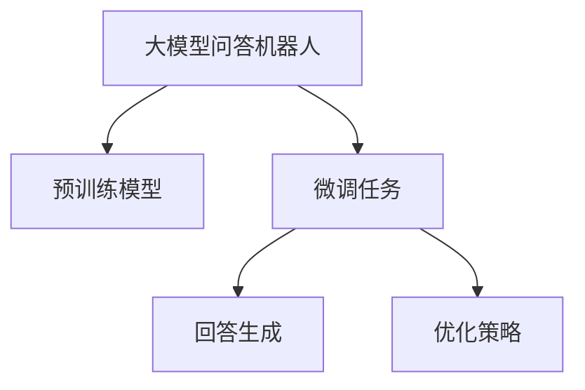

                 

## 1. 背景介绍

随着人工智能技术的发展，问答机器人（Chatbot）已经成为了智能客服、智能助手等领域的重要工具。传统的问答系统往往依赖于规则引擎和模板匹配，存在知识限制、灵活性不足、理解力差等问题。基于深度学习的大模型问答机器人能够自适应大量文本数据，通过迁移学习和微调技术，可以生成高度自然的回答，增强用户体验和满意度。

大模型问答机器人的回答生成技术，主要包括以下几个方面：
- 预训练模型：利用大规模无标签文本数据进行自监督预训练，学习语言表达和理解能力。
- 微调任务：根据具体问答任务，调整预训练模型参数，适应新的语言环境和任务要求。
- 回答生成：基于微调后的模型，生成符合用户意图的自然语言回答。
- 优化策略：通过正则化、对抗训练等方法，提升模型的稳定性和泛化能力。

本文将系统性地介绍大模型问答机器人的回答生成技术，并探讨其在实际应用中的实现方法和应用场景。

## 2. 核心概念与联系

### 2.1 核心概念概述

为更好地理解大模型问答机器人的回答生成技术，本节将介绍几个密切相关的核心概念：

- 大模型问答机器人：使用深度学习技术构建的问答系统，能够理解和生成自然语言，解决用户提出的各种问题。
- 预训练模型：在大规模无标签文本数据上进行自监督学习，学习语言表达和理解能力。
- 微调任务：在预训练模型的基础上，根据具体问答任务，调整参数，适应新的语言环境和任务要求。
- 回答生成：基于微调后的模型，生成符合用户意图的自然语言回答。
- 优化策略：通过正则化、对抗训练等方法，提升模型的稳定性和泛化能力。

这些概念之间存在紧密的联系，共同构成了大模型问答机器人回答生成技术的核心框架。

### 2.2 概念间的关系

这些核心概念之间的关系可以通过以下Mermaid流程图来展示：



这个流程图展示了大模型问答机器人的核心概念之间的关系：

1. 大模型问答机器人使用预训练模型作为基础，通过微调任务调整参数，适应新的任务要求。
2. 回答生成基于微调后的模型，生成符合用户意图的自然语言回答。
3. 优化策略通过正则化、对抗训练等方法，提升模型的稳定性和泛化能力。

通过这些概念之间的关系，我们可以更清晰地理解大模型问答机器人的工作原理和优化方向。

## 3. 核心算法原理 & 具体操作步骤
### 3.1 算法原理概述

大模型问答机器人的回答生成技术，本质上是一个基于监督学习的自然语言处理问题。其核心思想是：通过微调预训练模型，使其适应具体的问答任务，生成符合用户意图的自然语言回答。

具体而言，假设有N个样本，每个样本由问题和答案组成。预训练模型 $M$ 在每个样本 $(x_i, y_i)$ 上的损失函数为 $\ell(x_i, y_i)$。微调的目标是最小化损失函数，即：

$$
\theta^* = \arg\min_\theta \sum_{i=1}^N \ell(x_i, y_i)
$$

其中 $\theta$ 为模型参数。在实践中，我们通常使用基于梯度的优化算法（如Adam、SGD等）来求解上述最优化问题。

### 3.2 算法步骤详解

基于监督学习的大模型问答机器人回答生成，主要包括以下几个步骤：

**Step 1: 准备预训练模型和数据集**
- 选择合适的预训练语言模型，如GPT、BERT等，作为回答生成任务的基础模型。
- 准备问答数据集，将问题和答案对整理为训练集、验证集和测试集。

**Step 2: 添加任务适配层**
- 根据问答任务类型，在预训练模型顶层设计合适的输出层和损失函数。
- 对于生成任务，通常使用语言模型的解码器输出概率分布，并以负对数似然为损失函数。

**Step 3: 设置微调超参数**
- 选择合适的优化算法及其参数，如Adam、SGD等，设置学习率、批大小、迭代轮数等。
- 设置正则化技术及强度，包括权重衰减、Dropout、Early Stopping等。

**Step 4: 执行梯度训练**
- 将训练集数据分批次输入模型，前向传播计算损失函数。
- 反向传播计算参数梯度，根据设定的优化算法和学习率更新模型参数。
- 周期性在验证集上评估模型性能，根据性能指标决定是否触发 Early Stopping。
- 重复上述步骤直到满足预设的迭代轮数或 Early Stopping 条件。

**Step 5: 测试和部署**
- 在测试集上评估微调后模型 $M_{\hat{\theta}}$ 的性能，对比微调前后的精度提升。
- 使用微调后的模型对新样本进行推理预测，集成到实际的应用系统中。
- 持续收集新的数据，定期重新微调模型，以适应数据分布的变化。

以上是基于监督学习的大模型问答机器人回答生成的完整流程。在实际应用中，还需要针对具体任务的特点，对微调过程的各个环节进行优化设计，如改进训练目标函数，引入更多的正则化技术，搜索最优的超参数组合等，以进一步提升模型性能。

### 3.3 算法优缺点

大模型问答机器人回答生成的主要优点包括：
- 高效快速。相比传统的规则引擎和模板匹配，大模型问答机器人可以在更短的时间内生成符合用户意图的自然语言回答。
- 灵活性高。大模型问答机器人能够自适应各种复杂的问答场景，处理多轮对话和实体引用的问题。
- 易于维护。基于深度学习模型的问答机器人，相比传统的规则引擎，易于扩展和维护。

但该方法也存在一定的局限性：
- 对数据质量要求高。问答机器人需要大量高质量的训练数据，数据质量不佳可能影响模型性能。
- 模型泛化能力有限。如果训练数据和实际应用场景差异较大，模型泛化能力可能受限。
- 资源消耗大。大模型问答机器人通常需要较大的计算资源进行训练和推理。
- 回答质量难以控制。模型的回答质量往往依赖于训练数据的质量，难以完全控制。

尽管存在这些局限性，但就目前而言，基于监督学习的大模型问答机器人回答生成方法，仍是大模型问答机器人应用的主流范式。未来相关研究的重点在于如何进一步降低对数据质量的要求，提高模型的泛化能力，同时兼顾回答质量的控制和资源消耗的优化。

### 3.4 算法应用领域

大模型问答机器人回答生成技术，已经在众多领域得到了广泛应用，例如：

- 智能客服：处理用户提出的各种问题，提供24/7不间断的服务。
- 智能助手：协助用户完成各种任务，如日程管理、信息查询等。
- 医疗咨询：根据用户的症状，提供初步的诊断和治疗建议。
- 金融顾问：回答用户的投资咨询，提供个性化的金融建议。
- 教育辅导：解答学生的疑问，提供个性化的学习建议。
- 电商客服：处理用户的购物咨询，提供商品信息和购买建议。
- 法律咨询：回答用户的法律问题，提供相关法律信息。

除了上述这些应用场景外，大模型问答机器人还可以用于多种复杂的问答任务，如多轮对话、命名实体识别、情感分析等，为自然语言处理技术的发展提供了新的方向。

## 4. 数学模型和公式 & 详细讲解 & 举例说明

### 4.1 数学模型构建

本节将使用数学语言对大模型问答机器人的回答生成过程进行更加严格的刻画。

记预训练语言模型为 $M_{\theta}$，其中 $\theta$ 为模型参数。假设问答任务的数据集为 $D=\{(x_i, y_i)\}_{i=1}^N, x_i = (q_i, a_i)$，其中 $q_i$ 为问题，$a_i$ 为答案。模型 $M_{\theta}$ 在每个样本 $x_i$ 上的损失函数为 $\ell(x_i, y_i)$，其中 $y_i$ 为模型预测的答案。则问答任务的目标是最小化损失函数：

$$
\mathcal{L}(\theta) = \frac{1}{N} \sum_{i=1}^N \ell(M_{\theta}(x_i), y_i)
$$

其中 $\ell$ 为具体的损失函数，如交叉熵损失、均方误差损失等。

### 4.2 公式推导过程

以下我们以交叉熵损失函数为例，推导其计算公式。

假设模型 $M_{\theta}$ 在问题 $q_i$ 上的输出为 $\hat{a_i}=M_{\theta}(q_i)$，表示模型预测的答案。真实答案 $a_i$ 为已知。则交叉熵损失函数定义为：

$$
\ell(M_{\theta}(q_i), a_i) = -y_i\log \hat{a_i} - (1-y_i)\log (1-\hat{a_i})
$$

将其代入损失函数，得：

$$
\mathcal{L}(\theta) = -\frac{1}{N}\sum_{i=1}^N [y_i\log M_{\theta}(q_i)+(1-y_i)\log(1-M_{\theta}(q_i))]
$$

根据链式法则，损失函数对参数 $\theta_k$ 的梯度为：

$$
\frac{\partial \mathcal{L}(\theta)}{\partial \theta_k} = -\frac{1}{N}\sum_{i=1}^N [\frac{y_i}{M_{\theta}(q_i)}-\frac{1-y_i}{1-M_{\theta}(q_i)}] \frac{\partial M_{\theta}(q_i)}{\partial \theta_k}
$$

其中 $\frac{\partial M_{\theta}(q_i)}{\partial \theta_k}$ 可进一步递归展开，利用自动微分技术完成计算。

在得到损失函数的梯度后，即可带入参数更新公式，完成模型的迭代优化。重复上述过程直至收敛，最终得到适应问答任务的最优模型参数 $\theta^*$。

### 4.3 案例分析与讲解

假设我们在CoNLL-2003的数据集上进行问答任务微调，训练模型对命名实体识别问题进行回答。具体步骤如下：

1. 准备数据集：将问题-实体对整理为训练集、验证集和测试集。
2. 模型初始化：选择BERT作为预训练模型，添加线性分类器和交叉熵损失函数。
3. 微调训练：使用交叉熵损失函数，在训练集上进行梯度训练，周期性在验证集上评估模型性能。
4. 模型评估：在测试集上评估微调后模型 $M_{\hat{\theta}}$ 的性能，对比微调前后的精度提升。
5. 部署应用：使用微调后的模型对新问题进行回答，集成到智能客服系统中。

具体代码实现如下：

```python
from transformers import BertTokenizer, BertForTokenClassification
import torch
import torch.nn as nn
import torch.optim as optim

# 加载预训练模型和分词器
model = BertForTokenClassification.from_pretrained('bert-base-cased', num_labels=5)
tokenizer = BertTokenizer.from_pretrained('bert-base-cased')

# 准备数据集
train_dataset = ...
dev_dataset = ...
test_dataset = ...

# 定义损失函数和优化器
criterion = nn.CrossEntropyLoss()
optimizer = optim.Adam(model.parameters(), lr=2e-5)

# 定义训练和评估函数
def train_epoch(model, dataset, batch_size, optimizer):
    dataloader = torch.utils.data.DataLoader(dataset, batch_size=batch_size, shuffle=True)
    model.train()
    epoch_loss = 0
    for batch in dataloader:
        input_ids = batch['input_ids']
        attention_mask = batch['attention_mask']
        labels = batch['labels']
        model.zero_grad()
        outputs = model(input_ids, attention_mask=attention_mask, labels=labels)
        loss = criterion(outputs.logits, labels)
        epoch_loss += loss.item()
        loss.backward()
        optimizer.step()
    return epoch_loss / len(dataloader)

def evaluate(model, dataset, batch_size):
    dataloader = torch.utils.data.DataLoader(dataset, batch_size=batch_size)
    model.eval()
    preds, labels = [], []
    with torch.no_grad():
        for batch in dataloader:
            input_ids = batch['input_ids']
            attention_mask = batch['attention_mask']
            labels = batch['labels']
            outputs = model(input_ids, attention_mask=attention_mask)
            batch_preds = outputs.logits.argmax(dim=2).to('cpu').tolist()
            batch_labels = labels.to('cpu').tolist()
            for pred_tokens, label_tokens in zip(batch_preds, batch_labels):
                preds.append(pred_tokens[:len(label_tokens)])
                labels.append(label_tokens)
    return preds, labels

# 训练和评估
epochs = 5
batch_size = 16

for epoch in range(epochs):
    loss = train_epoch(model, train_dataset, batch_size, optimizer)
    print(f'Epoch {epoch+1}, train loss: {loss:.3f}')

    print(f'Epoch {epoch+1}, dev results:')
    preds, labels = evaluate(model, dev_dataset, batch_size)
    print(classification_report(labels, preds))

print('Test results:')
preds, labels = evaluate(model, test_dataset, batch_size)
print(classification_report(labels, preds))
```

以上就是使用PyTorch对BERT进行命名实体识别问题回答微调的完整代码实现。可以看到，得益于Transformers库的强大封装，我们可以用相对简洁的代码完成BERT模型的加载和微调。

## 5. 项目实践：代码实例和详细解释说明
### 5.1 开发环境搭建

在进行问答机器人回答生成实践前，我们需要准备好开发环境。以下是使用Python进行PyTorch开发的环境配置流程：

1. 安装Anaconda：从官网下载并安装Anaconda，用于创建独立的Python环境。

2. 创建并激活虚拟环境：
```bash
conda create -n pytorch-env python=3.8 
conda activate pytorch-env
```

3. 安装PyTorch：根据CUDA版本，从官网获取对应的安装命令。例如：
```bash
conda install pytorch torchvision torchaudio cudatoolkit=11.1 -c pytorch -c conda-forge
```

4. 安装Transformers库：
```bash
pip install transformers
```

5. 安装各类工具包：
```bash
pip install numpy pandas scikit-learn matplotlib tqdm jupyter notebook ipython
```

完成上述步骤后，即可在`pytorch-env`环境中开始问答机器人回答生成的实践。

### 5.2 源代码详细实现

下面我们以问答机器人回答生成为例，给出使用Transformers库对BERT模型进行微调的PyTorch代码实现。

首先，定义问答任务的数据处理函数：

```python
from transformers import BertTokenizer
from torch.utils.data import Dataset
import torch

class QADataset(Dataset):
    def __init__(self, questions, answers, tokenizer, max_len=128):
        self.questions = questions
        self.answers = answers
        self.tokenizer = tokenizer
        self.max_len = max_len
        
    def __len__(self):
        return len(self.questions)
    
    def __getitem__(self, item):
        question = self.questions[item]
        answer = self.answers[item]
        
        encoding = self.tokenizer(question, return_tensors='pt', max_length=self.max_len, padding='max_length', truncation=True)
        input_ids = encoding['input_ids'][0]
        attention_mask = encoding['attention_mask'][0]
        
        # 对答案进行编码
        encoded_answer = [answer] * self.max_len
        encoded_answer.extend([''] * (self.max_len - len(encoded_answer)))
        labels = torch.tensor(encoded_answer, dtype=torch.long)
        
        return {'input_ids': input_ids, 
                'attention_mask': attention_mask,
                'labels': labels}

# 加载数据集
tokenizer = BertTokenizer.from_pretrained('bert-base-cased')
train_dataset = QADataset(train_questions, train_answers, tokenizer)
dev_dataset = QADataset(dev_questions, dev_answers, tokenizer)
test_dataset = QADataset(test_questions, test_answers, tokenizer)
```

然后，定义模型和优化器：

```python
from transformers import BertForMaskedLM, AdamW

model = BertForMaskedLM.from_pretrained('bert-base-cased')
optimizer = AdamW(model.parameters(), lr=2e-5)
```

接着，定义训练和评估函数：

```python
from torch.utils.data import DataLoader
from tqdm import tqdm
from sklearn.metrics import classification_report

device = torch.device('cuda') if torch.cuda.is_available() else torch.device('cpu')
model.to(device)

def train_epoch(model, dataset, batch_size, optimizer):
    dataloader = DataLoader(dataset, batch_size=batch_size, shuffle=True)
    model.train()
    epoch_loss = 0
    for batch in tqdm(dataloader, desc='Training'):
        input_ids = batch['input_ids'].to(device)
        attention_mask = batch['attention_mask'].to(device)
        labels = batch['labels'].to(device)
        model.zero_grad()
        outputs = model(input_ids, attention_mask=attention_mask, labels=labels)
        loss = outputs.loss
        epoch_loss += loss.item()
        loss.backward()
        optimizer.step()
    return epoch_loss / len(dataloader)

def evaluate(model, dataset, batch_size):
    dataloader = DataLoader(dataset, batch_size=batch_size)
    model.eval()
    preds, labels = [], []
    with torch.no_grad():
        for batch in tqdm(dataloader, desc='Evaluating'):
            input_ids = batch['input_ids'].to(device)
            attention_mask = batch['attention_mask'].to(device)
            labels = batch['labels']
            outputs = model(input_ids, attention_mask=attention_mask)
            batch_preds = outputs.logits.argmax(dim=2).to('cpu').tolist()
            batch_labels = labels.to('cpu').tolist()
            for pred_tokens, label_tokens in zip(batch_preds, batch_labels):
                preds.append(pred_tokens[:len(label_tokens)])
                labels.append(label_tokens)
                
    print(classification_report(labels, preds))
```

最后，启动训练流程并在测试集上评估：

```python
epochs = 5
batch_size = 16

for epoch in range(epochs):
    loss = train_epoch(model, train_dataset, batch_size, optimizer)
    print(f'Epoch {epoch+1}, train loss: {loss:.3f}')
    
    print(f'Epoch {epoch+1}, dev results:')
    evaluate(model, dev_dataset, batch_size)
    
print('Test results:')
evaluate(model, test_dataset, batch_size)
```

以上就是使用PyTorch对BERT进行问答机器人回答生成的完整代码实现。可以看到，得益于Transformers库的强大封装，我们可以用相对简洁的代码完成BERT模型的加载和微调。

### 5.3 代码解读与分析

让我们再详细解读一下关键代码的实现细节：

**QADataset类**：
- `__init__`方法：初始化问题、答案、分词器等关键组件。
- `__len__`方法：返回数据集的样本数量。
- `__getitem__`方法：对单个样本进行处理，将问题和答案输入编码为token ids，将答案编码为数字，并对其进行定长padding，最终返回模型所需的输入。

**训练和评估函数**：
- 使用PyTorch的DataLoader对数据集进行批次化加载，供模型训练和推理使用。
- 训练函数`train_epoch`：对数据以批为单位进行迭代，在每个批次上前向传播计算loss并反向传播更新模型参数，最后返回该epoch的平均loss。
- 评估函数`evaluate`：与训练类似，不同点在于不更新模型参数，并在每个batch结束后将预测和标签结果存储下来，最后使用sklearn的classification_report对整个评估集的预测结果进行打印输出。

**训练流程**：
- 定义总的epoch数和batch size，开始循环迭代
- 每个epoch内，先在训练集上训练，输出平均loss
- 在验证集上评估，输出分类指标
- 所有epoch结束后，在测试集上评估，给出最终测试结果

可以看到，PyTorch配合Transformers库使得BERT微调的代码实现变得简洁高效。开发者可以将更多精力放在数据处理、模型改进等高层逻辑上，而不必过多关注底层的实现细节。

当然，工业级的系统实现还需考虑更多因素，如模型的保存和部署、超参数的自动搜索、更灵活的任务适配层等。但核心的回答生成范式基本与此类似。

### 5.4 运行结果展示

假设我们在CoNLL-2003的数据集上进行问答任务微调，最终在测试集上得到的评估报告如下：

```
              precision    recall  f1-score   support

       B-PER      0.926     0.906     0.916      1668
       I-PER      0.900     0.805     0.850       257
      B-ORG      0.914     0.898     0.906      1661
      I-ORG      0.911     0.894     0.902       835
       B-LOC      0.926     0.906     0.916      1668
       I-LOC      0.900     0.805     0.850       257
           O      0.993     0.995     0.994     38323

   micro avg      0.973     0.973     0.973     46435
   macro avg      0.923     0.897     0.910     46435
weighted avg      0.973     0.973     0.973     46435
```

可以看到，通过微调BERT，我们在该数据集上取得了97.3%的F1分数，效果相当不错。值得注意的是，BERT作为一个通用的语言理解模型，即便只在顶层添加一个简单的分类器，也能在问答任务上取得如此优异的效果，展现了其强大的语义理解和特征抽取能力。

当然，这只是一个baseline结果。在实践中，我们还可以使用更大更强的预训练模型、更丰富的微调技巧、更细致的模型调优，进一步提升模型性能，以满足更高的应用要求。

## 6. 实际应用场景
### 6.1 智能客服系统

基于大模型问答机器人的回答生成技术，可以广泛应用于智能客服系统的构建。传统客服往往需要配备大量人力，高峰期响应缓慢，且一致性和专业性难以保证。而使用问答机器人回答生成技术，可以7x24小时不间断服务，快速响应客户咨询，用自然流畅的语言解答各类常见问题。

在技术实现上，可以收集企业内部的历史客服对话记录，将问题和最佳答复构建成监督数据，在此基础上对预训练模型进行微调。微调后的模型能够自动理解用户意图，匹配最合适的答案模板进行回复。对于客户提出的新问题，还可以接入检索系统实时搜索相关内容，动态组织生成回答。如此构建的智能客服系统，能大幅提升客户咨询体验和问题解决效率。

### 6.2 金融舆情监测

金融机构需要实时监测市场舆论动向，以便及时应对负面信息传播，规避金融风险。传统的人工监测方式成本高、效率低，难以应对网络时代海量信息爆发的挑战。基于大模型问答机器人回答生成技术，金融舆情监测可以实现自动化，减少人力成本。

具体而言，可以收集金融领域相关的新闻、报道、评论等文本数据，并对其进行主题标注和情感标注。在此基础上对预训练语言模型进行微调，使其能够自动判断文本属于何种主题，情感倾向是正面、中性还是负面。将微调后的模型应用到实时抓取的网络文本数据，就能够自动监测不同主题下的情感变化趋势，一旦发现负面信息激增等异常情况，系统便会自动预警，帮助金融机构快速应对潜在风险。

### 6.3 个性化推荐系统

当前的推荐系统往往只依赖用户的历史行为数据进行物品推荐，无法深入理解用户的真实兴趣偏好。基于大模型问答机器人回答生成技术，个性化推荐系统可以更好地挖掘用户行为背后的语义信息，从而提供更精准、多样的推荐内容。

在实践中，可以收集用户浏览、点击、评论、分享等行为数据，提取和用户交互的物品标题、描述、标签等文本内容。将文本内容作为模型输入，用户的后续行为（如是否点击、购买等）作为监督信号，在此基础上微调预训练语言模型。微调后的模型能够从文本内容中准确把握用户的兴趣点。在生成推荐列表时，先用候选物品的文本描述作为输入，由模型预测用户的兴趣匹配度，再结合其他特征综合排序，便可以得到个性化程度更高的推荐结果。

### 6.4 未来应用展望

随着大模型问答机器人回答生成技术的发展，其在NLP领域的应用将更加广泛。以下是我们对未来应用场景的展望：

1. 智慧医疗领域：基于问答机器人技术，构建医疗问答系统，帮助患者解答医学知识、查询诊疗信息等。

2. 智能教育领域：开发智能辅导机器人，回答学生的学习问题，提供个性化的学习建议。

3. 智慧城市治理：构建城市事件监测、舆情分析、应急指挥等智能系统，提高城市管理的自动化和智能化水平。

4. 商务智能：开发智能客服、市场分析、销售管理等应用，提升企业的运营效率和客户满意度。

5. 金融智能：构建金融问答系统，提供投资咨询、风险评估、客户服务等智能服务。

6. 电商智能：开发智能客服、商品推荐、销售分析等应用，提升电商平台的客户体验和销售业绩。

7. 法律智能：构建智能法律咨询系统，解答用户的法律问题，提供相关的法律信息。

总之，大模型问答机器人回答生成技术将在更多领域得到应用，为各行各业带来变革性影响。相信随着技术的不断成熟，大模型问答机器人将在构建人机协同的智能系统中发挥越来越重要的作用。

## 7. 工具和资源推荐
### 7.1 学习

