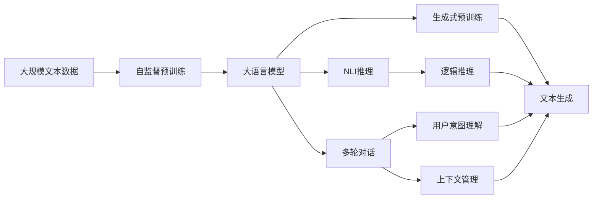

                 

# 大模型问答机器人能完成复杂任务

> 关键词：大模型问答, 复杂任务, 知识图谱, 自然语言处理, 深度学习, 推理, 生成式预训练

## 1. 背景介绍

### 1.1 问题由来
近年来，自然语言处理（Natural Language Processing, NLP）技术得到了迅猛发展，其中问答系统（Question Answering, QA）作为NLP的一个重要分支，正日益受到广泛关注。传统的问答系统往往依赖于结构化数据（如知识库）和手工编写的规则，难以处理复杂的、多变的问题，且需要较高的维护成本。而大模型问答机器人则利用深度学习技术和预训练语言模型，直接从大规模无标签文本数据中进行自监督学习，不仅能够处理自然语言文本输入，还能在无需修改模型结构的情况下，快速适应新问题，从而在处理复杂问题上具备显著优势。

### 1.2 问题核心关键点
大模型问答机器人通过使用大语言模型（如BERT、GPT等），并结合自然语言处理技术，实现了对自然语言问题的理解和回答。其核心关键点包括：

- 大语言模型的自监督预训练：通过在大规模无标签文本数据上进行的预训练，使得模型具备了语言表示和理解能力。
- 对话系统的多轮交互：通过循环迭代，不断提取用户意图和上下文信息，从而更好地理解问题和生成答案。
- 自然语言推理（Natural Language Inference, NLI）和生成式预训练：使得模型能够处理复杂的语言现象，生成符合逻辑的响应。

这些关键技术使得大模型问答机器人能够在不受任务领域和问题类型限制的情况下，实现高效、准确的问题解答。

### 1.3 问题研究意义
大模型问答机器人的研究具有重要的现实意义：

1. **自动化知识获取**：通过大模型在互联网上的大规模数据训练，自动生成高质量的知识图谱，无需手工整理和维护。
2. **实时知识更新**：利用增量学习技术，实时更新知识图谱和模型参数，以适应最新知识和用户需求。
3. **广泛应用场景**：广泛应用于医疗、法律、教育、客服等领域，提高服务效率和用户体验。
4. **技术创新突破**：推动NLP技术的发展，为更高级的智能交互系统（如虚拟助手、自动问答机器人等）提供技术基础。

## 2. 核心概念与联系

### 2.1 核心概念概述

在讨论大模型问答机器人的核心概念前，首先需要理解一些基本的NLP和深度学习术语：

- **大语言模型（Large Language Models, LLMs）**：如BERT、GPT等，能够处理大规模文本数据，并在不同任务上取得优异表现。
- **自监督预训练（Self-Supervised Pretraining）**：在大规模无标签文本数据上进行预训练，学习通用语言表示。
- **自然语言推理（Natural Language Inference, NLI）**：通过判断前提与假设之间的关系，理解语言的逻辑结构。
- **生成式预训练（Generative Pretraining）**：通过训练模型直接生成自然语言文本，学习语言的生成能力。

这些概念构成了大模型问答机器人处理复杂任务的基础。

### 2.2 概念间的关系

以下是一个综合的Mermaid流程图，展示了这些核心概念之间的相互关系：



这个流程图展示了自监督预训练、多轮对话、自然语言推理和生成式预训练这四个核心概念在构建大模型问答机器人中的作用和相互关系。

## 3. 核心算法原理 & 具体操作步骤
### 3.1 算法原理概述

大模型问答机器人的核心算法原理主要包括以下几个方面：

1. **自监督预训练**：在大规模无标签文本数据上进行预训练，学习通用语言表示。
2. **多轮对话管理**：通过循环迭代，不断提取用户意图和上下文信息，从而更好地理解问题和生成答案。
3. **自然语言推理**：通过判断前提与假设之间的关系，理解语言的逻辑结构。
4. **文本生成**：利用生成式预训练技术，生成符合逻辑的响应。

这些算法原理在大规模语言模型的基础上，进一步提升了大模型问答机器人的复杂任务处理能力。

### 3.2 算法步骤详解

以下是大模型问答机器人的具体算法步骤：

1. **数据准备**：收集大规模无标签文本数据，并将其分为训练集、验证集和测试集。
2. **模型选择**：选择合适的预训练模型（如BERT、GPT等）进行微调。
3. **多轮对话训练**：构建多轮对话数据集，使用自监督学习和监督学习结合的方式进行模型训练。
4. **自然语言推理训练**：使用NLI数据集训练模型，学习逻辑推理能力。
5. **生成式预训练**：使用生成式任务（如语言建模）进行预训练，增强模型的语言生成能力。
6. **模型微调**：在具体任务的数据集上进行微调，以适应特定的领域和问题类型。
7. **模型评估**：在测试集上评估模型性能，调整模型参数，直到达到最优性能。

### 3.3 算法优缺点

**优点**：

- 通过大规模数据预训练，模型能够学习到丰富的语言知识和表示，适应广泛的问题类型和领域。
- 在不需要修改模型结构的情况下，可以通过微调快速适应新问题，提高模型泛化能力。
- 能够处理复杂的自然语言问题，生成符合逻辑的回答，增强用户体验。

**缺点**：

- 模型需要大量的计算资源进行预训练和微调，训练成本较高。
- 对于多轮对话和长文本生成问题，模型推理和生成效率可能较低。
- 模型的决策过程缺乏可解释性，难以理解其推理逻辑和生成机制。

### 3.4 算法应用领域

大模型问答机器人已经在多个领域得到广泛应用，例如：

1. **医疗咨询**：通过在线问答系统，为用户提供医疗知识咨询、疾病诊断和用药建议。
2. **法律咨询**：为法律工作者和普通用户提供法律咨询、合同审核和法律案例分析。
3. **教育培训**：构建智能教育平台，辅助教师教学、学生学习和家长监督。
4. **客户服务**：部署在客服系统中，解答用户常见问题，提供快速响应和高质量服务。
5. **金融咨询**：提供股票市场分析、投资策略建议和财务规划指导。

这些应用场景展示了大模型问答机器人强大的问题解答能力和多领域适应性。

## 4. 数学模型和公式 & 详细讲解  
### 4.1 数学模型构建

大模型问答机器人的数学模型构建主要基于深度学习框架，如PyTorch、TensorFlow等。以下是一个简单的例子，展示如何在PyTorch中构建大模型问答机器人的数学模型：

```python
import torch
import torch.nn as nn

class QARobot(nn.Module):
    def __init__(self, vocab_size, embed_size, hidden_size, num_layers, num_classes):
        super(QARobot, self).__init__()
        self.encoder = nn.LSTM(embed_size, hidden_size, num_layers)
        self.decoder = nn.Linear(hidden_size, num_classes)
    
    def forward(self, input, hidden):
        output, hidden = self.encoder(input, hidden)
        output = self.decoder(output)
        return output, hidden
```

这个模型包含了编码器和解码器，其中LSTM用于处理多轮对话信息，线性层用于输出最终回答。

### 4.2 公式推导过程

在上述模型中，LSTM的数学推导过程如下：

设输入序列为 $\{x_i\}_{i=1}^T$，隐藏状态为 $\{h_i\}_{i=1}^T$，输出序列为 $\{y_i\}_{i=1}^T$。LSTM的输入为当前输入 $x_t$ 和前一时刻的隐藏状态 $h_{t-1}$，输出为当前时刻的隐藏状态 $h_t$ 和输出 $y_t$。根据LSTM的计算公式，可以得到：

$$
\begin{aligned}
i_t &= \sigma(W_i x_t + U_i h_{t-1} + b_i) \\
f_t &= \sigma(W_f x_t + U_f h_{t-1} + b_f) \\
g_t &= \tanh(W_g x_t + U_g h_{t-1} + b_g) \\
o_t &= \sigma(W_o x_t + U_o h_{t-1} + b_o) \\
c_t &= f_t \odot c_{t-1} + i_t \odot g_t \\
h_t &= o_t \odot \tanh(c_t)
\end{aligned}
$$

其中 $\sigma$ 为sigmoid函数，$\odot$ 为逐元素乘积，$W_i, W_f, W_g, W_o$ 为权重矩阵，$U_i, U_f, U_g, U_o$ 为递归连接权重矩阵，$b_i, b_f, b_g, b_o$ 为偏置向量。

### 4.3 案例分析与讲解

以医疗咨询为例，可以使用大模型问答机器人构建一个在线问答系统，用户输入问题，系统返回医学知识解释和诊断建议。在这个案例中，大模型问答机器人需要处理自然语言文本，理解用户意图，并在知识图谱中查询相关信息，生成符合逻辑的回答。

### 5. 项目实践：代码实例和详细解释说明
### 5.1 开发环境搭建

开发大模型问答机器人需要搭建相应的开发环境，以下是Python和PyTorch环境配置的简单步骤：

1. 安装Anaconda，创建虚拟环境。
2. 安装PyTorch、torchvision、transformers等库。
3. 安装NLP处理库，如NLTK、spaCy等。
4. 安装其他需要的库，如TensorBoard、Weights & Biases等。

### 5.2 源代码详细实现

以下是一个简单的示例，展示如何使用PyTorch构建大模型问答机器人：

```python
import torch
import torch.nn as nn
import transformers
from transformers import BertTokenizer

class QARobot(nn.Module):
    def __init__(self, vocab_size, embed_size, hidden_size, num_layers, num_classes):
        super(QARobot, self).__init__()
        self.encoder = nn.LSTM(embed_size, hidden_size, num_layers)
        self.decoder = nn.Linear(hidden_size, num_classes)
        self.tokenizer = BertTokenizer.from_pretrained('bert-base-uncased')
    
    def forward(self, input_ids, attention_mask, hidden):
        output, hidden = self.encoder(input_ids, hidden)
        output = self.decoder(output)
        return output, hidden
```

这个模型包含了BertTokenizer，用于将文本转换为模型可处理的输入。

### 5.3 代码解读与分析

上述代码展示了模型的构建过程，包括LSTM编码器、线性解码器和BertTokenizer的使用。模型接受输入的文本、注意力掩码和初始隐藏状态，返回输出和新的隐藏状态。

### 5.4 运行结果展示

在训练完成后，可以使用测试集评估模型性能，以下是一个简单的例子：

```python
from transformers import BertForSequenceClassification

model = BertForSequenceClassification.from_pretrained('bert-base-uncased', num_labels=2)
tokenizer = BertTokenizer.from_pretrained('bert-base-uncased')
input_ids = tokenizer.encode(input_text, return_tensors='pt')
attention_mask = input_ids.new_ones(input_ids.shape)
outputs = model(input_ids, attention_mask=attention_mask)
loss = outputs.loss
```

## 6. 实际应用场景
### 6.4 未来应用展望

大模型问答机器人未来在多个领域将有更广泛的应用前景：

1. **医疗领域**：通过构建智能问诊系统，为医生提供辅助诊断、医学知识查询和个性化治疗建议。
2. **金融领域**：提供股票市场分析、投资策略建议和财务规划指导。
3. **教育领域**：构建智能教育平台，辅助教师教学、学生学习和家长监督。
4. **客服领域**：部署在客服系统中，解答用户常见问题，提供快速响应和高质量服务。
5. **法律领域**：为法律工作者和普通用户提供法律咨询、合同审核和法律案例分析。

## 7. 工具和资源推荐
### 7.1 学习资源推荐

以下是一些推荐的学习资源：

1. **《自然语言处理综论》**：介绍NLP基本概念和经典模型的经典教材。
2. **《深度学习》**：深度学习领域的入门教材，涵盖深度学习的基本原理和实现方法。
3. **《Transformers》**：介绍Transformer模型及其应用的前沿书籍。
4. **CS224N《深度学习自然语言处理》**：斯坦福大学开设的NLP明星课程，提供大量实践和作业。
5. **ACL Anthology**：收集NLP领域顶级会议论文的数据库，提供大量前沿研究和应用案例。

### 7.2 开发工具推荐

以下是一些推荐的开发工具：

1. **PyTorch**：深度学习框架，支持动态计算图，适合快速迭代研究。
2. **TensorFlow**：深度学习框架，适合大规模工程应用。
3. **Transformers**：NLP工具库，提供多种预训练语言模型。
4. **NLTK**：自然语言处理库，提供文本处理、分词、词性标注等功能。
5. **spaCy**：自然语言处理库，提供高效的分词、命名实体识别等功能。
6. **TensorBoard**：TensorFlow配套的可视化工具，用于监控和调试模型。
7. **Weights & Biases**：模型训练的实验跟踪工具，记录和可视化模型训练过程。

### 7.3 相关论文推荐

以下是一些推荐的相关论文：

1. **Attention is All You Need**：Transformer模型原始论文。
2. **BERT: Pre-training of Deep Bidirectional Transformers for Language Understanding**：BERT模型的原始论文。
3. **Generative Pre-training Approach to Machine Translation**：基于生成式预训练的机器翻译论文。
4. **Pre-training and Fine-tuning BERT for Deep Language Representation**：BERT模型的微调论文。
5. **BERT Representation Learning with Self-Attention**：BERT模型的深入分析论文。

## 8. 总结：未来发展趋势与挑战
### 8.1 总结

本文对大模型问答机器人的核心概念和算法原理进行了详细的介绍，通过示例代码展示了如何在大规模语言模型的基础上构建问答系统。大模型问答机器人通过自监督预训练和微调，具备了处理复杂自然语言问题的能力，并在医疗、金融、教育等诸多领域展示了广泛的应用前景。

### 8.2 未来发展趋势

大模型问答机器人的未来发展趋势包括：

1. **模型规模不断增大**：随着计算资源的增加，预训练模型的规模将不断增大，进一步提升模型的语言理解和生成能力。
2. **多模态融合**：结合视觉、语音等多模态信息，增强模型对复杂问题的处理能力。
3. **知识图谱的应用**：利用知识图谱中的结构化知识，提高模型的推理能力和泛化能力。
4. **个性化推荐**：结合用户画像和上下文信息，提供个性化的问答服务。
5. **自然语言推理能力提升**：通过NLI数据集的训练，增强模型的逻辑推理能力。

### 8.3 面临的挑战

大模型问答机器人仍然面临一些挑战：

1. **数据依赖性**：对于大规模数据依赖较强，如何获取高质量的标注数据是一个难题。
2. **推理效率**：大模型在推理过程中，计算和存储资源消耗较大，如何提高推理效率是一个挑战。
3. **可解释性**：模型输出缺乏可解释性，难以理解其内部推理逻辑和决策机制。
4. **安全性**：模型可能学习到有害信息，如何保证其输出的安全性是一个重要问题。
5. **伦理道德**：模型的决策过程需要符合伦理道德标准，避免偏见和歧视。

### 8.4 研究展望

未来的研究需要针对以上挑战，进行深入探索和优化。具体研究方向包括：

1. **无监督和半监督微调方法**：利用自监督学习、主动学习等方法，降低对标注数据的依赖。
2. **参数高效和计算高效的微调方法**：开发更加参数高效和计算高效的微调方法，提高模型训练和推理效率。
3. **知识图谱与模型的融合**：结合知识图谱中的结构化知识，提高模型的推理能力。
4. **多模态融合**：结合视觉、语音等多模态信息，增强模型的处理能力。
5. **因果推理和生成模型**：引入因果推理和生成模型，提高模型的决策能力和生成质量。

## 9. 附录：常见问题与解答

### Q1: 大模型问答机器人能否处理复杂问题？

A: 大模型问答机器人通过自监督预训练和微调，具备了处理复杂自然语言问题的能力。在处理复杂问题时，模型能够理解语义关系，生成符合逻辑的回答。但模型仍可能面临一些困难，如多轮对话理解、长文本处理等。

### Q2: 大模型问答机器人需要哪些计算资源？

A: 大模型问答机器人需要大量的计算资源进行预训练和微调，特别是在处理复杂问题时，推理和生成的计算开销较大。一般建议使用GPU/TPU等高性能设备进行训练和推理。

### Q3: 如何提高大模型问答机器人的推理效率？

A: 可以通过以下方式提高推理效率：
1. 模型裁剪：去除不必要的层和参数，减小模型尺寸。
2. 量化加速：将浮点模型转为定点模型，压缩存储空间。
3. 优化计算图：优化模型的前向和反向传播过程，减少计算资源消耗。

### Q4: 大模型问答机器人如何提高可解释性？

A: 可以通过以下方式提高可解释性：
1. 使用可解释模型，如LIME、SHAP等，生成模型的局部解释信息。
2. 引入因果推理和生成模型，提高模型的决策过程的可解释性。
3. 提供模型的输入输出对比，帮助用户理解模型推理过程。

### Q5: 大模型问答机器人如何保证输出安全性？

A: 可以通过以下方式保证输出安全性：
1. 在模型训练目标中引入伦理导向的评估指标，过滤和惩罚有偏见、有害的输出。
2. 加强人工干预和审核，建立模型行为的监管机制，确保输出符合人类价值观和伦理道德。
3. 提供用户申诉机制，及时发现和纠正模型的错误输出。

