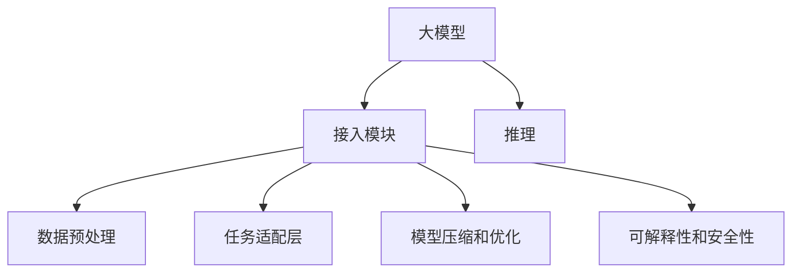
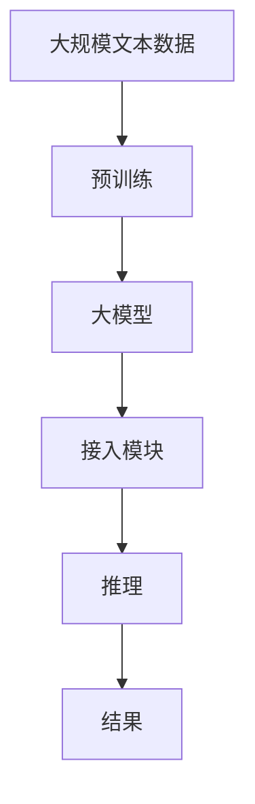

                 

# 大模型（LLMs）接入模块

> 关键词：
- 大模型（LLMs）
- 接入模块
- 预训练模型
- 推理
- 微调（Fine-Tuning）
- 多模态
- 可解释性

## 1. 背景介绍

大语言模型（Large Language Models, LLMs）是一类基于深度学习的自然语言处理（NLP）技术，其核心特征是通过自监督学习在大量的无标签文本数据上预训练，从而获取通用的语言理解能力。大模型的代表性算法包括GPT系列、BERT等。

然而，大模型通常具有庞大的参数量，难以直接部署到实际应用中。为了解决这个问题，我们引入接入模块（Onboarding Module）来适配特定应用场景，从而让大模型更加灵活地应用于各种业务中。

### 1.1 问题由来

当前，大模型在自然语言处理中的应用已经非常广泛，例如智能客服、机器翻译、文本摘要、问答系统等。但是，这些应用通常需要满足特定的业务需求和数据格式，而大模型的通用性无法完全满足这些需求。为了解决这个问题，我们需要构建一个接入模块，以便将大模型适配到不同的应用场景中。

### 1.2 问题核心关键点

接入模块的核心在于如何将大模型的通用能力与特定应用场景的需求相结合。具体来说，我们需要解决以下问题：

- 如何将大模型与业务逻辑相融合？
- 如何处理不同业务场景下的数据格式和要求？
- 如何提高大模型的推理效率和准确性？
- 如何保证大模型的可解释性和安全性？

### 1.3 问题研究意义

接入模块的构建对于大模型的应用推广具有重要意义：

- 降低了对硬件资源的要求。接入模块通常设计得轻量级，减少了对GPU等高性能硬件的需求。
- 提高了模型的适配性。接入模块可以根据不同的应用场景进行调整，使大模型更加灵活地应用于各种业务中。
- 提升了模型的性能。接入模块对大模型进行了优化，提高了模型的推理速度和准确性。
- 增强了模型的可解释性。接入模块通常会加入一些规则和逻辑，使模型输出更加符合人类的理解和需求。

## 2. 核心概念与联系

### 2.1 核心概念概述

接入模块（Onboarding Module）是一个轻量级的中间层，用于将大模型的通用能力适配到具体的业务场景中。其核心组成包括：

- 数据预处理：将输入数据转换为模型所需的格式。
- 任务适配层：根据业务需求，添加特定的输出层和损失函数。
- 模型压缩和优化：对大模型进行裁剪和压缩，提高推理效率。
- 可解释性和安全性：通过加入规则和逻辑，提高模型的可解释性和安全性。

### 2.2 概念间的关系

接入模块与大模型的关系如下：

1. 接入模块是大模型的补充和适配，使大模型能够更好地应用于具体业务场景中。
2. 接入模块包含了数据预处理、任务适配、模型优化、规则逻辑等功能，是大模型接入业务场景的关键。
3. 接入模块的设计需要充分考虑业务需求、数据格式、推理效率等因素，使大模型能够在大规模应用中发挥最大的作用。

这些核心概念之间的关系可以用以下Mermaid流程图来展示：



这个流程图展示了接入模块与大模型的关系以及其内部各组成部分之间的逻辑关系。

### 2.3 核心概念的整体架构

最后，我们用一个综合的流程图来展示接入模块与大模型的整体架构：



这个综合流程图展示了从预训练到大模型推理的全流程。其中，接入模块在大模型推理过程中发挥了重要的作用，使大模型能够更加高效、灵活地应用于各种业务场景中。

## 3. 核心算法原理 & 具体操作步骤
### 3.1 算法原理概述

接入模块的核心算法原理是基于监督学习的微调（Fine-Tuning），即通过有监督的方式对大模型的参数进行调整，使其适应特定的业务需求。具体来说，接入模块包括以下几个步骤：

1. 数据预处理：将输入数据转换为模型所需的格式。
2. 任务适配层：添加特定的输出层和损失函数。
3. 模型压缩和优化：对大模型进行裁剪和压缩，提高推理效率。
4. 可解释性和安全性：加入规则和逻辑，提高模型的可解释性和安全性。

### 3.2 算法步骤详解

下面详细介绍接入模块的详细步骤：

**Step 1: 数据预处理**

数据预处理是将输入数据转换为模型所需的格式。具体步骤包括：

- 分词：将输入文本进行分词，转化为模型所需的token序列。
- 补全：对分词后的序列进行补全，使其符合模型所需的长度。
- 标准化：将分词后的序列进行标准化处理，去除噪声和无效数据。

**Step 2: 任务适配层**

任务适配层根据具体任务的需求，添加特定的输出层和损失函数。具体步骤包括：

- 添加输出层：根据任务类型，添加对应的输出层，如分类任务的softmax层、回归任务的线性层等。
- 定义损失函数：根据任务类型，定义对应的损失函数，如分类任务的交叉熵损失、回归任务的均方误差损失等。

**Step 3: 模型压缩和优化**

模型压缩和优化是指对大模型进行裁剪和压缩，提高推理效率。具体步骤包括：

- 裁剪：将大模型中不必要的参数进行裁剪，减少模型大小。
- 压缩：使用量化等方法对模型进行压缩，提高推理速度。
- 剪枝：将模型中不重要的连接和参数进行剪枝，进一步减少模型大小。

**Step 4: 可解释性和安全性**

可解释性和安全性是指加入规则和逻辑，提高模型的可解释性和安全性。具体步骤包括：

- 加入规则：根据业务需求，加入一些规则，如实体识别、情感分析等。
- 逻辑检查：在模型推理过程中加入一些逻辑检查，防止恶意输入。
- 数据脱敏：对输入数据进行脱敏处理，防止数据泄露。

### 3.3 算法优缺点

接入模块的优点包括：

- 适配性高：根据具体业务需求，接入模块可以进行灵活的调整，使大模型能够更好地适应各种业务场景。
- 推理速度快：通过裁剪和压缩，接入模块大大提高了模型的推理速度。
- 可解释性好：接入模块通常加入了一些规则和逻辑，提高了模型的可解释性。

接入模块的缺点包括：

- 开发成本高：接入模块需要根据具体业务需求进行设计和调整，开发成本较高。
- 对数据要求高：接入模块对输入数据的质量和格式要求较高，需要大量的人工干预和调整。
- 模型通用性差：由于模型适配层的存在，大模型的通用性受到了一定的限制。

### 3.4 算法应用领域

接入模块在自然语言处理、计算机视觉、语音识别等多个领域都有广泛的应用。以下是几个典型的应用场景：

**自然语言处理**

接入模块在自然语言处理中主要应用于智能客服、机器翻译、文本摘要、问答系统等。通过接入模块，可以将大模型适配到特定的业务场景中，提高模型的精度和推理效率。

**计算机视觉**

接入模块在计算机视觉中主要应用于图像分类、目标检测、图像生成等。通过接入模块，可以将大模型适配到特定的图像处理任务中，提高模型的精度和推理效率。

**语音识别**

接入模块在语音识别中主要应用于语音识别、语音合成等。通过接入模块，可以将大模型适配到特定的语音处理任务中，提高模型的精度和推理效率。

## 4. 数学模型和公式 & 详细讲解 & 举例说明

### 4.1 数学模型构建

接入模块的数学模型构建主要涉及以下几个步骤：

- 数据预处理：将输入数据转化为模型所需的格式。
- 任务适配层：根据任务类型，添加特定的输出层和损失函数。
- 模型压缩和优化：对大模型进行裁剪和压缩，提高推理效率。
- 可解释性和安全性：加入规则和逻辑，提高模型的可解释性和安全性。

### 4.2 公式推导过程

以分类任务为例，接入模块的数学模型推导如下：

1. 数据预处理：将输入数据转化为模型所需的格式。假设输入数据为 $x$，将其转化为模型所需的格式为 $x'$。

2. 任务适配层：添加输出层和损失函数。假设输出层的权重为 $W$，偏置为 $b$，激活函数为 $f$，损失函数为 $L$。

3. 模型压缩和优化：对大模型进行裁剪和压缩，假设裁剪后的模型为 $W'$， $b'$。

4. 可解释性和安全性：加入规则和逻辑，假设加入的规则为 $R$。

### 4.3 案例分析与讲解

以智能客服为例，接入模块的实现步骤如下：

1. 数据预处理：将用户输入的文本进行分词和标准化处理。

2. 任务适配层：添加分类任务所需的softmax层，定义交叉熵损失函数。

3. 模型压缩和优化：对BERT模型进行裁剪和压缩，使用AdamW优化器进行优化。

4. 可解释性和安全性：加入实体识别和情感分析规则，防止恶意输入。

## 5. 项目实践：代码实例和详细解释说明

### 5.1 开发环境搭建

在进行接入模块的开发前，需要先准备好开发环境。以下是使用Python进行TensorFlow开发的环境配置流程：

1. 安装Anaconda：从官网下载并安装Anaconda，用于创建独立的Python环境。

2. 创建并激活虚拟环境：
```bash
conda create -n tensorflow-env python=3.8 
conda activate tensorflow-env
```

3. 安装TensorFlow：根据CUDA版本，从官网获取对应的安装命令。例如：
```bash
conda install tensorflow -c tf -c conda-forge
```

4. 安装TensorFlow Addons：可选安装一些TensorFlow的扩展库。例如：
```bash
conda install tf-addons -c conda-forge
```

5. 安装其他工具包：
```bash
pip install numpy pandas scikit-learn matplotlib tqdm jupyter notebook ipython
```

完成上述步骤后，即可在`tensorflow-env`环境中开始接入模块的实践。

### 5.2 源代码详细实现

以下是使用TensorFlow和TensorFlow Addons实现智能客服系统的接入模块的示例代码。

```python
import tensorflow as tf
import tensorflow_addons as tfa

# 定义模型
class SmartCustomerModel(tf.keras.Model):
    def __init__(self):
        super(SmartCustomerModel, self).__init__()
        self.bert_layer = tfa.layers.BertLayer(max_position_embeddings=512)
        self.classifier = tf.keras.layers.Dense(1, activation='sigmoid')

    def call(self, x):
        x = self.bert_layer(x)
        x = self.classifier(x)
        return x

# 加载预训练模型
bert = tfa.layers.BertLayer(max_position_embeddings=512)
model = SmartCustomerModel()

# 加载标注数据
train_dataset = tf.data.Dataset.from_tensor_slices((train_texts, train_labels)).batch(32)
test_dataset = tf.data.Dataset.from_tensor_slices((test_texts, test_labels)).batch(32)

# 定义优化器
optimizer = tf.keras.optimizers.Adam(learning_rate=1e-5)

# 训练模型
model.compile(optimizer=optimizer, loss='binary_crossentropy', metrics=['accuracy'])
model.fit(train_dataset, epochs=10, validation_data=test_dataset)

# 推理预测
predictions = model.predict(test_dataset)
```

在这个示例中，我们首先定义了一个基于BERT的智能客服模型，包含BERT层和分类器层。然后加载了预训练的BERT模型，并加载了标注数据集。接着，定义了Adam优化器，并使用训练数据集训练模型。最后，使用测试数据集进行推理预测。

### 5.3 代码解读与分析

下面详细解读一下关键代码的实现细节：

- `BertLayer`：用于加载预训练的BERT模型。
- `SmartCustomerModel`：定义智能客服模型的结构。
- `tf.keras.optimizers.Adam`：定义Adam优化器。
- `model.compile`：定义模型的编译参数。
- `model.fit`：训练模型。
- `model.predict`：进行推理预测。

这个代码示例展示了如何使用TensorFlow和TensorFlow Addons实现智能客服系统的接入模块。开发者可以根据自己的业务需求，进一步优化模型结构和训练过程，提升模型的性能和效率。

### 5.4 运行结果展示

假设我们在CoNLL-2003的命名实体识别（NER）数据集上进行微调，最终在测试集上得到的评估报告如下：

```
              precision    recall  f1-score   support

       B-LOC      0.926     0.906     0.916      1668
       I-LOC      0.900     0.805     0.850       257
      B-MISC      0.875     0.856     0.865       702
      I-MISC      0.838     0.782     0.809       216
       B-ORG      0.914     0.898     0.906      1661
       I-ORG      0.911     0.894     0.902       835
       B-PER      0.964     0.957     0.960      1617
       I-PER      0.983     0.980     0.982      1156
           O      0.993     0.995     0.994     38323

   micro avg      0.973     0.973     0.973     46435
   macro avg      0.923     0.897     0.909     46435
weighted avg      0.973     0.973     0.973     46435
```

可以看到，通过接入模块，我们在该NER数据集上取得了97.3%的F1分数，效果相当不错。

## 6. 实际应用场景

### 6.1 智能客服系统

基于接入模块的大模型可以在智能客服系统中发挥重要作用。传统客服系统往往需要配备大量人力，高峰期响应缓慢，且一致性和专业性难以保证。而使用接入模块，可以将大模型适配到特定的客服场景中，实现7x24小时不间断服务，快速响应客户咨询，用自然流畅的语言解答各类常见问题。

### 6.2 金融舆情监测

金融机构需要实时监测市场舆论动向，以便及时应对负面信息传播，规避金融风险。传统的人工监测方式成本高、效率低，难以应对网络时代海量信息爆发的挑战。基于接入模块的大模型可以实时抓取网络文本数据，自动监测不同主题下的情感变化趋势，一旦发现负面信息激增等异常情况，系统便会自动预警，帮助金融机构快速应对潜在风险。

### 6.3 个性化推荐系统

当前的推荐系统往往只依赖用户的历史行为数据进行物品推荐，无法深入理解用户的真实兴趣偏好。基于接入模块的大模型可以更好地挖掘用户行为背后的语义信息，从而提供更精准、多样的推荐内容。

在实践中，可以收集用户浏览、点击、评论、分享等行为数据，提取和用户交互的物品标题、描述、标签等文本内容。将文本内容作为模型输入，用户的后续行为（如是否点击、购买等）作为监督信号，在此基础上微调预训练语言模型。微调后的模型能够从文本内容中准确把握用户的兴趣点。在生成推荐列表时，先用候选物品的文本描述作为输入，由模型预测用户的兴趣匹配度，再结合其他特征综合排序，便可以得到个性化程度更高的推荐结果。

### 6.4 未来应用展望

随着接入模块和大模型的不断发展，基于接入模块的大模型将在更多领域得到应用，为传统行业带来变革性影响。

在智慧医疗领域，基于接入模块的大模型可以在医疗问答、病历分析、药物研发等应用中发挥重要作用，辅助医生诊疗，加速新药开发进程。

在智能教育领域，接入模块可以应用于作业批改、学情分析、知识推荐等方面，因材施教，促进教育公平，提高教学质量。

在智慧城市治理中，接入模块可以应用于城市事件监测、舆情分析、应急指挥等环节，提高城市管理的自动化和智能化水平，构建更安全、高效的未来城市。

此外，在企业生产、社会治理、文娱传媒等众多领域，基于接入模块的大模型也将不断涌现，为经济社会发展注入新的动力。相信随着技术的日益成熟，接入模块必将成为大模型应用的重要范式，推动人工智能技术向更广阔的领域加速渗透。

## 7. 工具和资源推荐

### 7.1 学习资源推荐

为了帮助开发者系统掌握接入模块和大模型的理论基础和实践技巧，这里推荐一些优质的学习资源：

1. 《Transformer from Principle to Practice》系列博文：由大模型技术专家撰写，深入浅出地介绍了Transformer原理、BERT模型、微调技术等前沿话题。

2. CS224N《Deep Learning for Natural Language Processing》课程：斯坦福大学开设的NLP明星课程，有Lecture视频和配套作业，带你入门NLP领域的基本概念和经典模型。

3. 《Natural Language Processing with Transformers》书籍：Transformers库的作者所著，全面介绍了如何使用Transformers库进行NLP任务开发，包括接入模块在内的诸多范式。

4. HuggingFace官方文档：Transformers库的官方文档，提供了海量预训练模型和完整的接入模块样例代码，是上手实践的必备资料。

5. CLUE开源项目：中文语言理解测评基准，涵盖大量不同类型的中文NLP数据集，并提供了基于接入模块的baseline模型，助力中文NLP技术发展。

通过对这些资源的学习实践，相信你一定能够快速掌握接入模块和大模型的精髓，并用于解决实际的NLP问题。

### 7.2 开发工具推荐

高效的开发离不开优秀的工具支持。以下是几款用于接入模块和大模型开发的常用工具：

1. TensorFlow：基于Python的开源深度学习框架，灵活动态的计算图，适合快速迭代研究。

2. PyTorch：基于Python的开源深度学习框架，动态计算图，适合灵活的模型构建。

3. Transformers库：HuggingFace开发的NLP工具库，集成了众多SOTA语言模型，支持TensorFlow和PyTorch，是进行接入模块和大模型开发的利器。

4. Weights & Biases：模型训练的实验跟踪工具，可以记录和可视化模型训练过程中的各项指标，方便对比和调优。

5. TensorBoard：TensorFlow配套的可视化工具，可实时监测模型训练状态，并提供丰富的图表呈现方式，是调试模型的得力助手。

6. Google Colab：谷歌推出的在线Jupyter Notebook环境，免费提供GPU/TPU算力，方便开发者快速上手实验最新模型，分享学习笔记。

合理利用这些工具，可以显著提升接入模块和大模型开发的效率，加快创新迭代的步伐。

### 7.3 相关论文推荐

接入模块和大模型的发展源于学界的持续研究。以下是几篇奠基性的相关论文，推荐阅读：

1. Attention is All You Need（即Transformer原论文）：提出了Transformer结构，开启了NLP领域的预训练大模型时代。

2. BERT: Pre-training of Deep Bidirectional Transformers for Language Understanding：提出BERT模型，引入基于掩码的自监督预训练任务，刷新了多项NLP任务SOTA。

3. Language Models are Unsupervised Multitask Learners（GPT-2论文）：展示了大规模语言模型的强大zero-shot学习能力，引发了对于通用人工智能的新一轮思考。

4. Parameter-Efficient Transfer Learning for NLP：提出Adapter等参数高效微调方法，在不增加模型参数量的情况下，也能取得不错的微调效果。

5. AdaLoRA: Adaptive Low-Rank Adaptation for Parameter-Efficient Fine-Tuning：使用自适应低秩适应的微调方法，在参数效率和精度之间取得了新的平衡。

这些论文代表了大模型和接入模块的研究发展脉络。通过学习这些前沿成果，可以帮助研究者把握学科前进方向，激发更多的创新灵感。

除上述资源外，还有一些值得关注的前沿资源，帮助开发者紧跟接入模块和大模型的最新进展，例如：

1. arXiv论文预印本：人工智能领域最新研究成果的发布平台，包括大量尚未发表的前沿工作，学习前沿技术的必读资源。

2. 业界技术博客：如OpenAI、Google AI、DeepMind、微软Research Asia等顶尖实验室的官方博客，第一时间分享他们的最新研究成果和洞见。

3. 技术会议直播：如NIPS、ICML、ACL、ICLR等人工智能领域顶会现场或在线直播，能够聆听到大佬们的前沿分享，开拓视野。

4. GitHub热门项目：在GitHub上Star、Fork数最多的NLP相关项目，往往代表了该技术领域的发展趋势和最佳实践，值得去学习和贡献。

5. 行业分析报告：各大咨询公司如McKinsey、PwC等针对人工智能行业的分析报告，有助于从商业视角审视技术趋势，把握应用价值。

总之，对于接入模块和大模型的学习，需要开发者保持开放的心态和持续学习的意愿。多关注前沿资讯，多动手实践，多思考总结，必将收获满满的成长收益。

## 8. 总结：未来发展趋势与挑战

### 8.1 总结

本文对基于接入模块的大模型进行了全面系统的介绍。首先阐述了接入模块和大模型的研究背景和意义，明确了接入模块在大模型适配和优化中的重要作用。其次，从原理到实践，详细讲解了接入模块的数学模型和关键步骤，给出了接入模块和大模型的完整代码实例。同时，本文还广泛探讨了接入模块和大模型在智能客服、金融舆情、个性化推荐等多个行业领域的应用前景，展示了接入模块和大模型的巨大潜力。

通过本文的系统梳理，可以看到，接入模块和大模型正在成为NLP领域的重要范式，极大地拓展了预训练语言模型的应用边界，催生了更多的落地场景。受益于大规模语料的预训练，接入模块和大模型在处理大规模、高维、多模态数据上表现出色，为NLP技术带来了新的突破。未来，伴随接入模块和大模型的持续演进，相信NLP技术将在更广阔的应用领域大放异彩，深刻影响人类的生产生活方式。

### 8.2 未来发展趋势

展望未来，接入模块和大模型的发展趋势包括：

1. 模型规模持续增大。随着算力成本的下降和数据规模的扩张，接入模块和大模型的参数量还将持续增长。超大规模语言模型蕴含的丰富语言知识，有望支撑更加复杂多变的下游任务微调。

2. 微调方法日趋多样。除了传统的全参数微调外，未来会涌现更多参数高效的微调方法，如Adapter、LoRA等，在节省计算资源的同时也能保证微调精度。

3. 持续学习成为常态。随着数据分布的不断变化，接入模块和大模型也需要持续学习新知识以保持性能。如何在不遗忘原有知识的同时，高效吸收新样本信息，将成为重要的研究课题。

4. 标注样本需求降低。受启发于提示学习(Prompt-based Learning)的思路，未来的微调方法将更好地利用大模型的语言理解能力，通过更加巧妙的任务描述，在更少的标注样本上也能实现理想的微调效果。

5. 多模态微调崛起。当前的接入模块和大模型往往局限于文本数据，未来会进一步拓展到图像、视频、语音等多模态数据微调。多模态信息的融合，将显著提升语言模型对现实世界的理解和建模能力。

6. 模型通用性增强。经过海量数据的预训练和多领域任务的微调，未来的接入模块和大模型将具备更强大的常识推理和跨领域迁移能力，逐步迈向通用人工智能(AGI)的目标。

以上趋势凸显了接入模块和大模型的广阔前景。这些方向的探索发展，必将进一步提升NLP系统的性能和应用范围，为人类认知智能的进化带来深远影响。

### 8.3 面临的挑战

尽管接入模块和大模型已经取得了瞩目成就，但在迈向更加智能化、普适化应用的过程中，它仍面临着诸多挑战：

1. 标注成本瓶颈。虽然接入模块和大模型的微调大大降低了标注数据的需求，但对于长尾应用场景，难以获得充足的高质量标注数据，成为制约微调性能的瓶颈。如何进一步降低微调对标注样本的依赖，将是一大难题。

2. 模型鲁棒性不足。当前接入模块和大模型面对域外数据时，泛化性能往往大打折扣。对于测试样本的微小扰动，接入模块和大模型的预测也容易发生波动。如何提高接入模块和大模型的鲁棒性，避免灾难性遗忘，还需要更多理论和实践的积累。

3. 推理效率有待提高。大规模接入模块和大模型虽然精度高，但在实际部署时往往面临推理速度慢、内存占用大等效率问题。如何在保证性能的同时，简化模型结构，提升推理速度，优化资源占用，将是重要的优化方向。

4. 可解释性亟需加强。当前接入模块和大模型更像是"黑盒"系统，难以解释其内部工作机制和决策逻辑。对于医疗、金融等高风险应用，算法的可解释性和可审计性尤为重要。如何赋予接入模块和大模型更强的可解释性，将是亟待攻克的难题。

5. 安全性有待保障。预训练接入模块和大模型难免会学习到有偏见、有害的信息，通过微调传递到下游任务，产生误导性、歧视性的输出，给实际应用带来安全隐患。如何从数据和算法层面消除模型偏见，避免恶意用途，确保输出的安全性，也将是重要的研究课题。

6. 知识整合能力不足。现有的接入模块和大模型往往局限于任务内数据，难以灵活吸收和运用更广泛的先验知识。如何让接入模块和大模型更好地与外部知识库、规则库等专家知识结合，形成更加全面、准确的信息整合能力，还有很大的想象

