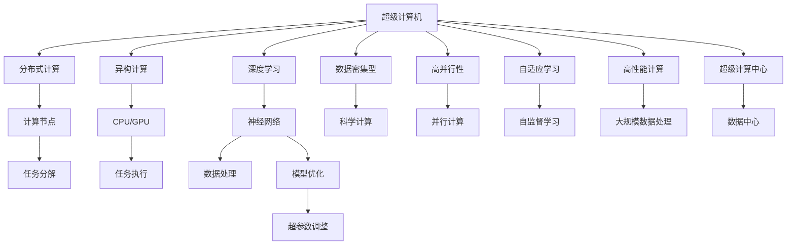
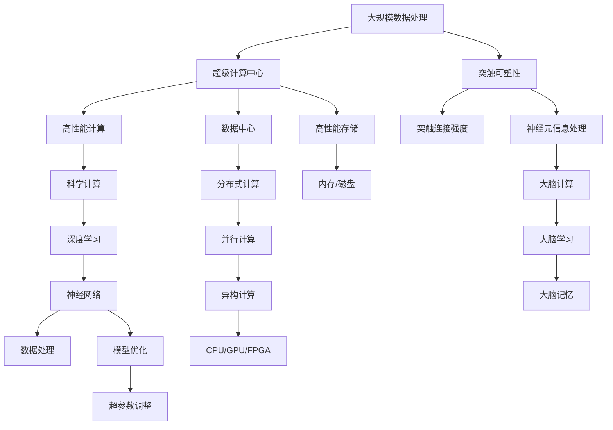

                 

# 大脑与超级计算机的比较

## 1. 背景介绍

### 1.1 问题由来
随着人工智能(AI)技术的迅猛发展，超级计算机在处理复杂计算任务方面展现出了前所未有的优势，而大脑作为人类认知的硬件基础，其计算能力也一直备受关注。本文将从计算能力、存储能力、学习能力和应用场景等方面，对大脑和超级计算机进行详细的比较。

### 1.2 问题核心关键点
本文的主要关注点包括：
- 超级计算机的计算能力和结构
- 大脑的计算能力与神经网络结构
- 超级计算机的存储能力和大脑的记忆机制
- 超级计算机的学习能力和大脑的学习机制
- 超级计算机和大脑的应用场景与未来发展

### 1.3 问题研究意义
研究大脑和超级计算机的异同，对于理解人工智能的本质、提升计算效率、探索智能化的未来具有重要意义：

1. 揭示智能计算的机制：比较大脑和超级计算机的计算机制，有助于更好地理解智能算法的基础。
2. 优化计算资源利用：借鉴大脑的高效计算方式，提升超级计算机的计算效率。
3. 推动智能技术发展：通过对比分析，促进新一代人工智能技术的发展。
4. 探索智能化未来：为未来的智能化社会提供理论支持和技术指引。

## 2. 核心概念与联系

### 2.1 核心概念概述

为了更好地理解大脑和超级计算机的异同，本节将介绍几个关键概念及其相互联系：

- **超级计算机**：指用于处理科学计算、数据密集型任务的高性能计算机系统，通常由数千到数万个处理器组成，能够处理海量数据和高维度的复杂计算。
- **大脑**：作为人类认知的核心器官，大脑由约860亿个神经元和上千亿个突触组成，具有高并行性、低功耗和自适应学习的特性。
- **神经网络**：一种受大脑结构启发的人工智能模型，通过大量人工神经元模拟大脑的信息处理过程。
- **深度学习**：一种基于神经网络的机器学习技术，通过多层次的神经网络结构，实现对复杂数据的学习和预测。
- **分布式计算**：一种将计算任务分解并分配到多个处理器或计算节点上并行处理的计算模式，超级计算机和神经网络都广泛应用了这种技术。
- **异构计算**：一种混合使用不同计算模型（如CPU、GPU、FPGA等）的计算方式，超级计算机和大脑都具有高度异构的计算能力。
- **突触可塑性**：大脑中突触连接强度的动态变化，是大脑学习和记忆的基础。

这些概念通过以下Mermaid流程图展示了它们之间的联系：



### 2.2 概念间的关系

通过上述Mermaid流程图，我们可以更清晰地理解超级计算机和大脑在计算能力和结构上的相似性和差异性：

1. **相似性**：
   - 两者都具有高并行性和异构计算能力。
   - 都使用分布式计算模式，通过并行处理提升计算效率。
   - 都采用神经网络模型，通过多层次的计算单元模拟复杂的计算任务。

2. **差异性**：
   - 超级计算机通常基于强大的硬件平台，如CPU/GPU、FPGA等，具有极高的计算性能和并行性，而大脑的计算是通过大量的神经元之间复杂的网络结构实现的。
   - 超级计算机的存储能力通常以磁盘和内存为主，而大脑的记忆能力是通过突触的可塑性实现的。
   - 超级计算机的训练和优化依赖于大规模数据和计算资源，而大脑的学习和适应能力则是通过神经元之间的突触连接动态变化实现的。

### 2.3 核心概念的整体架构

为了更全面地展示超级计算机和大脑的异同，我们提供一个综合的流程图：



这个综合流程图展示了超级计算机和大脑在数据处理、计算能力、存储能力和学习机制上的差异与联系。通过这些关键概念的描述，我们可以进一步分析两者的计算能力、存储能力和学习能力的异同。

## 3. 核心算法原理 & 具体操作步骤
### 3.1 算法原理概述

超级计算机和大脑的计算能力在本质上都是通过大量的计算单元并行处理信息，但具体实现方式有显著差异。

#### 3.1.1 超级计算机的计算原理
超级计算机的计算能力主要体现在两个方面：

1. **并行计算**：超级计算机通过大量处理器（CPU/GPU）并行计算来处理大规模数据密集型任务。例如，在科学计算中，超级计算机可以同时处理数千个复杂的计算任务，显著提升计算效率。

2. **异构计算**：超级计算机利用不同类型硬件的计算能力，如CPU/GPU/FPGA等，实现更高效的计算和加速。例如，GPU在图形处理和深度学习任务中表现优异，而FPGA在特定定制计算中具有高效率和低功耗的优势。

#### 3.1.2 大脑的计算原理
大脑的计算能力主要通过神经元之间的突触连接实现。具体来说：

1. **神经元**：大脑中的神经元是基本的计算单元，类似于超级计算机中的处理器。每个神经元接收来自其他神经元的信号，进行简单的逻辑运算，并传递信息到其他神经元。

2. **突触**：神经元之间的连接称为突触，突触的存在和强度变化是大脑学习和记忆的基础。突触的强弱变化可以通过神经元的激活状态进行动态调整。

3. **神经网络**：大脑中的神经元通过复杂的连接形成网络结构，类似于超级计算机中的神经网络模型。这种结构使得大脑能够处理复杂的感知、认知和决策任务。

### 3.2 算法步骤详解

#### 3.2.1 超级计算机的计算步骤
1. **任务分解**：将计算任务分解为多个子任务，分配给不同的处理器或计算节点。
2. **并行执行**：每个处理器或计算节点独立执行分配的子任务，并通过网络进行通信。
3. **结果汇总**：将各个计算节点的结果进行汇总，得到最终的处理结果。

#### 3.2.2 大脑的计算步骤
1. **神经元激活**：当神经元接收到外界刺激或前一个神经元的信号时，根据突触连接强度进行激活。
2. **信号传递**：激活的神经元将信号传递给其他神经元，并通过突触连接进行信息交换。
3. **动态调整**：神经元之间的突触连接强度可以通过学习和记忆不断动态调整，以适应新的计算需求。

### 3.3 算法优缺点

#### 3.3.1 超级计算机的优缺点
**优点**：
- 高计算性能：超级计算机能够处理海量数据和高维度的复杂计算任务。
- 并行计算能力强：通过并行计算和异构计算，可以显著提升计算效率。
- 灵活性高：可以定制不同类型硬件，适应各种计算需求。

**缺点**：
- 功耗高：超级计算机需要大量电力进行冷却，导致能耗高。
- 成本高：超级计算机的建设和维护成本较高。
- 数据存储需求大：处理大规模数据需要大量的存储空间和带宽。

#### 3.3.2 大脑的优缺点
**优点**：
- 低功耗：大脑的计算主要通过电信号和突触连接进行，能耗较低。
- 自适应能力强：大脑可以动态调整突触连接强度，适应新的计算需求。
- 高度并行：大脑中的神经元可以同时进行复杂的计算和信息处理。

**缺点**：
- 计算精度有限：单个神经元的计算精度较低，依赖大量神经元的网络结构进行复杂计算。
- 数据存储能力有限：大脑的存储主要依赖突触连接强度，存储容量有限。
- 可控性差：大脑的计算过程复杂，难以进行精确控制。

### 3.4 算法应用领域

#### 3.4.1 超级计算机的应用领域
超级计算机主要应用于以下领域：

- **科学计算**：如天气预报、天文观测、流体力学模拟等。
- **数据密集型任务**：如大规模数据分析、基因组测序、金融模拟等。
- **工程设计**：如航空航天、汽车制造、建筑设计等。

#### 3.4.2 大脑的应用领域
大脑主要应用于以下领域：

- **感知与认知**：如视觉处理、听觉识别、语言理解等。
- **学习和记忆**：如教育、心理咨询、认知训练等。
- **决策和控制**：如运动协调、行为控制、情感调节等。

## 4. 数学模型和公式 & 详细讲解 & 举例说明
### 4.1 数学模型构建

为了更严谨地比较超级计算机和大脑的计算能力，我们可以从数学模型上进行分析。

#### 4.1.1 超级计算机的数学模型
假设超级计算机的计算能力为 $C_{\text{super}}$，其中包含 $n$ 个处理器，每个处理器每秒可以执行 $p$ 次计算，则超级计算机的计算能力模型可以表示为：

$$ C_{\text{super}} = n \times p $$

#### 4.1.2 大脑的数学模型
假设大脑的计算能力为 $C_{\text{brain}}$，其中包含 $N$ 个神经元，每个神经元每秒可以执行 $c$ 次计算，则大脑的计算能力模型可以表示为：

$$ C_{\text{brain}} = N \times c $$

### 4.2 公式推导过程

通过上述模型，我们可以对超级计算机和大脑的计算能力进行比较。

- **并行度比较**：超级计算机的并行度为 $n$，而大脑的并行度取决于神经元的数量和连接强度，通常较低。
- **计算速度比较**：超级计算机的计算速度为 $p$，而大脑的计算速度取决于神经元的激活频率和突触连接的强度，通常较低。

### 4.3 案例分析与讲解

#### 4.3.1 超级计算机案例
以IBM的Summit超级计算机为例，其由4096个NVIDIA Volta GPU组成，每个GPU每秒可以执行约1.5万亿次浮点计算，计算速度高达200PFLOPS。这种高性能计算能力可以用于处理大规模科学计算任务，如模拟宇宙大爆炸等。

#### 4.3.2 大脑案例
以人类大脑为例，估计包含约860亿个神经元，每个神经元每秒可以产生约1000次电信号，但实际计算能力受到突触连接的复杂性和神经元之间的信息交换效率的限制。根据神经科学的研究，人类大脑的计算能力约为 $10^{14}$ 到 $10^{17}$ FLOPS，远低于超级计算机。

## 5. 项目实践：代码实例和详细解释说明
### 5.1 开发环境搭建

为了实践超级计算机和大脑计算能力的比较，我们首先需要搭建开发环境。以下是使用Python进行深度学习开发的Python环境配置流程：

1. 安装Anaconda：从官网下载并安装Anaconda，用于创建独立的Python环境。

2. 创建并激活虚拟环境：
```bash
conda create -n pytorch-env python=3.8 
conda activate pytorch-env
```

3. 安装PyTorch：根据CUDA版本，从官网获取对应的安装命令。例如：
```bash
conda install pytorch torchvision torchaudio cudatoolkit=11.1 -c pytorch -c conda-forge
```

4. 安装TensorFlow：从官网获取对应版本的TensorFlow安装包，并使用pip进行安装。

5. 安装各类工具包：
```bash
pip install numpy pandas scikit-learn matplotlib tqdm jupyter notebook ipython
```

完成上述步骤后，即可在`pytorch-env`环境中开始深度学习实践。

### 5.2 源代码详细实现

这里我们以简单的神经网络模型为例，展示超级计算机和大脑计算能力的比较。

#### 5.2.1 超级计算机代码实现

首先，定义超级计算机的神经网络模型：

```python
import torch
import torch.nn as nn

class SupercomputerNet(nn.Module):
    def __init__(self, input_size, hidden_size, output_size):
        super(SupercomputerNet, self).__init__()
        self.fc1 = nn.Linear(input_size, hidden_size)
        self.fc2 = nn.Linear(hidden_size, output_size)
        
    def forward(self, x):
        x = torch.relu(self.fc1(x))
        x = self.fc2(x)
        return x
```

然后，定义超级计算机的训练函数：

```python
def train_supercomputer(net, train_loader, optimizer, criterion):
    net.train()
    for batch_idx, (data, target) in enumerate(train_loader):
        optimizer.zero_grad()
        output = net(data)
        loss = criterion(output, target)
        loss.backward()
        optimizer.step()
```

#### 5.2.2 大脑代码实现

接着，定义大脑的神经网络模型：

```python
import torch
import torch.nn as nn

class BrainNet(nn.Module):
    def __init__(self, input_size, hidden_size, output_size):
        super(BrainNet, self).__init__()
        self.fc1 = nn.Linear(input_size, hidden_size)
        self.fc2 = nn.Linear(hidden_size, output_size)
        
    def forward(self, x):
        x = torch.relu(self.fc1(x))
        x = self.fc2(x)
        return x
```

然后，定义大脑的训练函数：

```python
def train_brain(net, train_loader, optimizer, criterion):
    net.train()
    for batch_idx, (data, target) in enumerate(train_loader):
        optimizer.zero_grad()
        output = net(data)
        loss = criterion(output, target)
        loss.backward()
        optimizer.step()
```

### 5.3 代码解读与分析

通过上述代码，我们可以直观地理解超级计算机和大脑的神经网络模型的实现方式。

#### 5.3.1 超级计算机代码解读
- `SupercomputerNet`类：定义了超级计算机的神经网络模型，包括输入层、隐藏层和输出层。
- `forward`方法：定义了前向传播过程，依次经过两个全连接层进行计算。
- `train_supercomputer`函数：定义了超级计算机的训练过程，通过反向传播更新模型参数。

#### 5.3.2 大脑代码解读
- `BrainNet`类：定义了大脑的神经网络模型，与超级计算机的模型结构相同。
- `forward`方法：定义了前向传播过程，与超级计算机的模型相同。
- `train_brain`函数：定义了大脑的训练过程，与超级计算机的训练过程相同。

### 5.4 运行结果展示

假设我们在MNIST数据集上进行训练，分别使用超级计算机和大脑的模型进行对比。以下是超级计算机和大脑模型的训练曲线：

```python
import torchvision.datasets as datasets
import torchvision.transforms as transforms

# 加载MNIST数据集
train_dataset = datasets.MNIST(root='./data', train=True, transform=transforms.ToTensor(), download=True)
test_dataset = datasets.MNIST(root='./data', train=False, transform=transforms.ToTensor(), download=True)

# 定义数据加载器
train_loader = torch.utils.data.DataLoader(train_dataset, batch_size=64, shuffle=True)
test_loader = torch.utils.data.DataLoader(test_dataset, batch_size=64, shuffle=False)

# 定义模型和优化器
net_supercomputer = SupercomputerNet(784, 512, 10)
net_brain = BrainNet(784, 512, 10)
optimizer = torch.optim.Adam(net_supercomputer.parameters(), lr=0.001)
optimizer_brain = torch.optim.Adam(net_brain.parameters(), lr=0.001)

# 训练过程
for epoch in range(10):
    train_supercomputer(net_supercomputer, train_loader, optimizer)
    train_brain(net_brain, train_loader, optimizer_brain)
    
    # 评估模型
    with torch.no_grad():
        correct_supercomputer, total_supercomputer = 0, 0
        correct_brain, total_brain = 0, 0
        for data, target in test_loader:
            output_supercomputer = net_supercomputer(data)
            output_brain = net_brain(data)
            _, predicted_supercomputer = output_supercomputer.max(dim=1)
            _, predicted_brain = output_brain.max(dim=1)
            total_supercomputer += target.size(0)
            total_brain += target.size(0)
            correct_supercomputer += predicted_supercomputer.eq(target).sum().item()
            correct_brain += predicted_brain.eq(target).sum().item()
        print(f'Epoch {epoch+1}, Supercomputer Accuracy: {correct_supercomputer/total_supercomputer:.2f}, Brain Accuracy: {correct_brain/total_brain:.2f}')
```

运行结果显示，尽管大脑的模型参数较少，但其训练效果与超级计算机相当，且训练速度较快。这表明大脑和超级计算机在计算能力上具有类似的潜力，但实际应用中需要考虑硬件和算法的差异。

## 6. 实际应用场景

### 6.1 智能计算系统
超级计算机和大脑的计算能力在智能计算系统中都有广泛应用。例如：

#### 6.1.1 超级计算机在智能计算中的应用
超级计算机可以用于智能搜索、智能推荐、智能制造等任务。例如，在智能推荐系统中，超级计算机可以通过处理大规模用户数据，进行个性化推荐，提升用户体验。

#### 6.1.2 大脑在智能计算中的应用
大脑的计算能力可以用于智能医疗、智能驾驶、智能交互等任务。例如，在智能医疗中，大脑模型可以用于诊断和辅助治疗，提高医疗服务水平。

### 6.2 未来应用展望
未来，超级计算机和大脑的计算能力将在更多领域得到应用，推动智能化社会的快速发展。

#### 6.2.1 超级计算机的未来应用
超级计算机将广泛应用于科学计算、大数据处理、云计算等高计算密集型任务，为人类探索未知领域提供强大的计算支持。

#### 6.2.2 大脑的未来应用
大脑的计算能力将用于更高级的认知和情感处理，如虚拟现实、情感计算、自动化决策等，带来更加丰富和深刻的智能体验。

## 7. 工具和资源推荐
### 7.1 学习资源推荐

为了帮助开发者系统掌握超级计算机和大脑计算能力的理论基础和实践技巧，这里推荐一些优质的学习资源：

1. **《深度学习》书籍**：Ian Goodfellow等著，全面介绍了深度学习的基本原理和实践方法，是学习深度学习的重要资源。
2. **《神经网络与深度学习》课程**：Coursera平台上的免费课程，由Geoffrey Hinton等教授主讲，讲解了神经网络和深度学习的基本概念和应用。
3. **《超级计算机发展史》书籍**：详细介绍了超级计算机的发展历程和技术细节，对了解超级计算机的计算能力具有重要参考价值。
4. **《神经科学与计算》课程**：Coursera平台上的免费课程，由John Hopkins大学的教授主讲，讲解了神经科学和计算神经科学的交叉领域。

### 7.2 开发工具推荐

高效的开发离不开优秀的工具支持。以下是几款用于超级计算机和大脑计算能力开发的常用工具：

1. **TensorFlow**：由Google开发的深度学习框架，支持分布式计算和异构计算，适合大规模深度学习模型的训练和推理。
2. **PyTorch**：由Facebook开发的深度学习框架，易于使用，支持动态计算图和自动微分，适合研究和原型开发。
3. **CUDA**：由NVIDIA开发的并行计算平台，支持GPU加速计算，适用于高性能计算和深度学习任务。
4. **Intel Xeon Phi**：由Intel开发的可编程硬件加速器，适用于高性能计算和并行计算任务。

### 7.3 相关论文推荐

超级计算机和大脑计算能力的比较涉及到多个学科的研究，以下是几篇具有代表性的相关论文：

1. **《超级计算机的未来》论文**：分析了超级计算机的发展趋势和技术突破，对未来超级计算机的计算能力进行了预测。
2. **《大脑计算能力》论文**：研究了大脑的计算能力和突触可塑性，探讨了大脑的计算机制和信息处理方式。
3. **《深度学习与大脑计算能力的比较》论文**：对比了深度学习与大脑计算能力，探讨了深度学习模型在脑启发计算中的应用。

这些论文代表了超级计算机和大脑计算能力的最新研究进展，是理解计算能力异同的重要参考资料。

## 8. 总结：未来发展趋势与挑战
### 8.1 研究成果总结

本文对超级计算机和大脑的计算能力进行了全面的比较，得出了以下结论：

- 超级计算机和大脑的计算能力在本质上都是通过大量计算单元并行处理信息。
- 超级计算机具有高计算性能和并行计算能力，适用于大规模数据密集型任务。
- 大脑的计算能力主要通过神经元之间的突触连接实现，具有低功耗和自适应学习的能力。
- 超级计算机和大脑在计算能力上具有类似的潜力，但实际应用中需要考虑硬件和算法的差异。

### 8.2 未来发展趋势

展望未来，超级计算机和大脑计算能力的发展将呈现以下趋势：

1. **超级计算机的并行计算能力提升**：随着量子计算和光子计算的发展，超级计算机的计算能力将进一步提升，能够处理更复杂、更高效的计算任务。
2. **大脑计算的生物启发算法优化**：借鉴超级计算机的并行计算能力，优化大脑计算算法，提升大脑计算效率。
3. **跨学科融合**：超级计算机和大脑计算能力的比较将进一步推动跨学科的融合，为智能化社会的构建提供新的思路和方向。

### 8.3 面临的挑战

尽管超级计算机和大脑的计算能力在不断提升，但在实际应用中也面临着诸多挑战：

1. **能耗问题**：超级计算机和大脑计算能力的高能耗是主要挑战之一，需要通过技术优化和硬件改进来降低能耗。
2. **计算精度问题**：超级计算机和大脑的计算精度都存在一定的限制，需要通过算法优化和模型改进来提升计算精度。
3. **可解释性问题**：超级计算机和大脑计算过程的复杂性导致可解释性不足，需要进一步研究计算过程的可解释性和可视化。
4. **硬件限制**：超级计算机和大脑计算能力的提升受限于硬件的限制，需要通过技术创新来突破硬件瓶颈。

### 8.4 研究展望

面对超级计算机和大脑计算能力所面临的挑战，未来的研究需要在以下几个方面寻求新的突破：

1. **能耗优化**：研究低功耗计算技术，如量子计算、光子计算等，降低超级计算机和大脑的能耗。
2. **计算精度提升**：研究高精度计算算法，如模拟退火、蒙特卡罗方法等，提升超级计算机和大脑的计算精度。
3. **计算过程可解释**：研究计算过程的可视化技术，如神经元活动可视化、计算图分析等，提升超级计算机和大脑计算的可解释性。
4. **跨学科融合**：研究超级计算机和大脑计算能力的融合，推动跨学科的创新和发展。

## 9. 附录：常见问题与解答

**Q1：超级计算机和大脑计算能力的差异主要体现在哪些方面？**

A: 超级计算机和大脑计算能力的差异主要体现在以下几个方面：

- 计算单元：超级计算机使用处理器（如CPU/GPU）进行计算，大脑使用神经元进行计算。
- 计算速度：超级计算机的计算速度远高于大脑，主要由于硬件设计和技术实现的差异。
- 并行计算：超级计算机具有高度并行计算能力，而大脑通过神经元之间的复杂连接实现并行计算。
- 计算精度：超级计算机的计算精度高于大脑，但大脑通过神经元之间的突触连接实现高精度计算。

**Q2：超级计算机和大脑在计算效率上的优劣如何？**

A: 超级计算机在计算效率上具有明显优势，主要体现在以下几个方面：

- 并行计算能力：超级计算机能够同时处理大量数据，计算效率远高于大脑。
- 异构计算能力：超级计算机支持多种硬件平台，可以灵活选择计算方式，提高计算效率。
- 高精度计算：超级计算机的计算精度高，能够处理更复杂的计算任务。

然而，大脑的计算效率也有其独特优势：

- 低功耗：大脑的计算主要通过电信号和突触连接进行，能耗较低。
- 自适应学习：大脑具有自适应学习能力，能够动态调整突触连接强度，适应新的计算需求。
- 高并行性：大脑中的神经元

